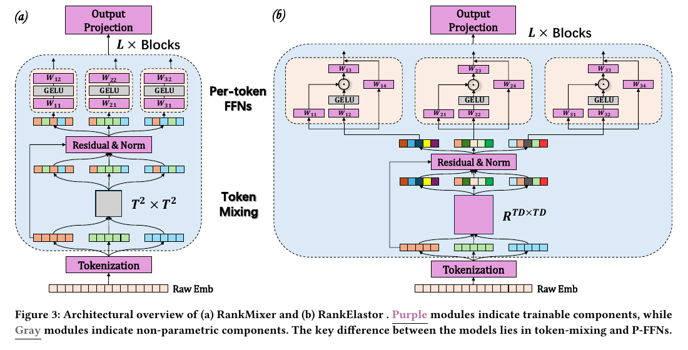
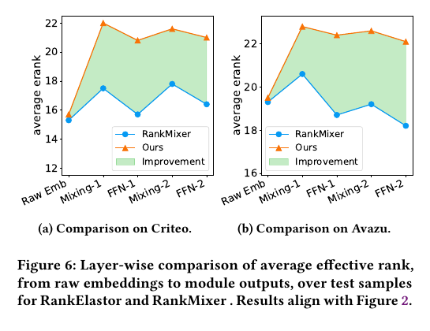
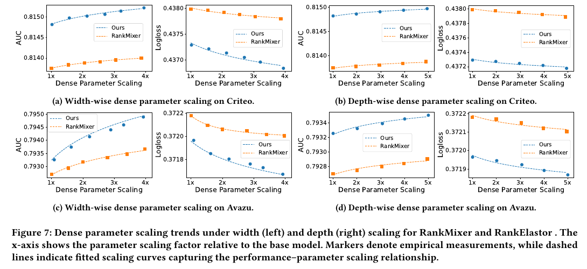

# RankElastor 论文精读：从有效秩动态看推荐模型的稠密扩展

> 论文：Guoming Li, Shangyu Zhang, Junwei Pan, Wentao Ning, Jin Chen, Gengsheng Xue, Chao Zhou, Shudong Huang, Haijie Gu, Menglin Yang.  
> **Expand More, Shrink Less: Shaping Effective-Rank Dynamics for Dense Scaling in Recommendation**.  
> KDD 2026 Research Track，arXiv:2605.23191v1，16 页。  
> DOI：[10.1145/3770855.3818049](https://doi.org/10.1145/3770855.3818049)；[arXiv](https://arxiv.org/abs/2605.23191)；[作者代码](https://github.com/vasile-paskardlgm/RankElastor)；[Zenodo 归档](https://doi.org/10.5281/zenodo.20252036)。  
> 本地原文：[RankElastor_paper.pdf](./RankElastor_paper.pdf)；PDF SHA-256：`41666d90b79b6b0a4bc126cb04b9c9744922f3f74e76f2b0dce6b97ce3a192ef`。  
> 整理日期：2026-08-12。

## 0. 先说结论

RankElastor 是**模型名**，不是论文题名。它是一篇面向推荐/广告 CTR 排序的深度模型论文，而不是 sponsored-search 拍卖、出价或“排名弹性”经济学论文。Criteo、Avazu 都是广告点击率数据，因此它属于“广推搜”中偏**广告/推荐排序模型与稠密参数扩展**的方向；它不讨论 bid、CPC、预算分配或广告拍卖机制。

论文观察到 RankMixer 的内部表示会经历一种“**有效秩的阻尼振荡**”：Token Mixing 稍微扩展表示谱，随后的逐 token FFN（P-FFN）又把谱压缩，层数加深后表示仍可能坍缩到少数方向。RankElastor 的对策可以浓缩为标题中的一句话：

> **Expand More, Shrink Less：让混合层扩得更多，让 FFN 收得更少。**

具体做法只有两项：

1. 把 RankMixer 固定的块转置混合换成对展平后 `T×D` 坐标进行可学习线性变换的 **Parameterized Full Mixing**；
2. 把普通 GELU P-FFN 换成带乘法门控和可学习残差的 **GLU-improved P-FFN**。

在论文报告的离线实验中，它相对 RankMixer 的 AUC 提升为：Criteo `+0.00107`，Avazu `+0.00053`；同时训练耗时增加约 `10%–15%`，显存相近。有效秩曲线和宽度/深度 scaling 曲线也明显更好。

但结论需要保留边界：只有离线公开数据实验，没有线上 A/B；主表虽是 10 次初始化均值，却未提供标准差或显著性检验；Full Mixing 的参数与计算量是 `O(T²D²)`；而且正文、图、代码和附录中存在若干值得复核的不一致。因而更准确的评价是：**模型思路直观、离线结果有吸引力，谱视角很有启发，但理论保证与完整可复现性仍需进一步核验。**

## 1. 问题背景：参数加大了，表示空间真的被用起来了吗？

CTR/排序模型通常把用户、广告/物品、设备、场景等多字段特征嵌入为矩阵

$$
E\in\mathbb{R}^{n\times k},
$$

再由特征交互网络预测点击概率。近年来的一个主方向是增加深度、宽度与稠密参数，希望像基础模型一样获得 scaling 收益。问题是：矩阵维度变大不代表模型真的使用了所有维度。如果大部分能量挤在少数奇异方向上，新增参数只是在一个低维子空间内重复计算，这就是文中所谓的 **embedding collapse（嵌入坍缩）**。

论文用如下指标衡量这一现象：

$$
\operatorname{erank}(X)
=\frac{\sum_i\sigma_i^2}{\max_i\sigma_i^2}
=\frac{\lVert X\rVert_F^2}{\lVert X\rVert_2^2}.
$$

这里 $\sigma_i$ 是奇异值。这个量严格说是 **stable rank（稳定秩）**，论文称它为 norm-based effective rank，并注明 also known as stable rank。它的性质是：

- 范围在 `1` 到代数秩之间；
- 越接近 `1`，说明第一奇异值越占主导，表示越集中；
- 越大，说明能量在更多方向上分布，表示容量利用通常更充分；
- 它是诊断指标，不等同于 AUC，也不能单独证明推荐效果更好。

另外不要与 Roy & Vetterli 常见的熵型 effective rank 混淆。值得注意的是，作者开源仓库的 `shift_analyser.py` 实际计算的是熵型 `exp(H(p))`，而论文公式 (1) 与理论使用的是 stable rank；这一差异将在第 8 节讨论。

## 2. RankMixer 为什么会“先扩后缩”？

RankMixer 先把多字段 embedding 统一为 token 矩阵

$$
X^{(0)}\in\mathbb{R}^{T\times D},
$$

然后重复堆叠两个模块：

- **Token Mixing**：把列方向分块，对块做固定转置/置换，与原输入残差相加并归一化；
- **P-FFN**：对每个 token 独立应用两层 GELU FFN，完成非线性特征交互。

论文在 Criteo 和 Avazu 上逐层测量有效秩，得到一个锯齿状轨迹：

1. Mixing 将不同 token/块重新组合，有效秩上升；
2. P-FFN 的非线性与投影把能量重新集中，有效秩下降；
3. 重复堆叠后振幅逐渐减弱，形成 **damped oscillatory trajectory（阻尼振荡轨迹）**；
4. 与 DCNv2、xDeepFM 的近似单调衰减相比，RankMixer 更好，但仍未消除坍缩。

论文给出的理论解释分两部分。

### 2.1 固定块转置只能“有限扩秩”

若 $Y=\mathcal{T}(X)$ 是块转置，$M=X+Y$，并假设 $X,Y$ 在 Frobenius 内积和主奇异方向上近似不相干，则论文定理 2.1 给出：

$$
\frac{2k\mu}{(\sqrt{k}+\sqrt{\mu})^2}
\lesssim \operatorname{erank}(M)
\lesssim 2(k+\mu),
$$

其中 $k=\operatorname{erank}(X)$，$\mu=\operatorname{erank}(Y)$。直觉是：把两个谱方向不同的矩阵相加，通常可以摊平能量；但固定置换没有能力针对数据学习“该混哪些坐标”，扩展能力有上限。若输入一开始已经低秩，增益往往不大。

### 2.2 普通 P-FFN 可能继续压缩谱

对逐行 FFN

$$
F(X)=\phi(XA)B,
$$

定理 2.2 在随机次高斯权重、正齐次激活和额外 response-gap 等假设下声称：

- 若 $X$ 的代数秩为 1，输出代数秩最多为 2；所有行同号时仍为 1；
- 一般低有效秩输入以高概率满足 $\operatorname{erank}(F(X))\leq\alpha\operatorname{erank}(X)$，$0<\alpha<1$。

直观上，每行都位于同一个（或少数）输入方向时，逐行共享的投影、激活和读出很难凭空制造大量独立方向。需要强调：该证明要求正齐次激活，而实际 RankMixer 使用 GELU，GELU 并不严格正齐次，所以这是**条件化的机制解释**，不是对实际网络的无条件证明。

## 3. RankElastor：两个组件如何对应“扩得更多、缩得更少”

*图源：原论文 Figure 3，CC BY 4.0。紫色模块可学习；左侧 RankMixer 使用固定块混合与普通 GELU P-FFN，右侧 RankElastor 使用全坐标可学习混合与 GLU 改进 P-FFN。*

### 3.1 Parameterized Full Mixing：把置换升级成全坐标学习

RankMixer 的固定混合可以写成置换矩阵与单位阵的 Kronecker 结构。RankElastor 则把 $X\in\mathbb{R}^{T\times D}$ 展平，用一个完整的可学习矩阵进行变换：

$$
\operatorname{vec}(M^\top)
=\operatorname{LN}\!\left((W+I)\operatorname{vec}(X^\top)\right),
\quad W\in\mathbb{R}^{TD\times TD}.
$$

其中 $I$ 保留残差信息。它不再只交换预先定义的块，而是让任意 token-feature 坐标影响任意其他坐标。

作者的表达力论证是：粗粒度 block mixing 受 $W\otimes I_{d^*}$ 约束，同一块内坐标共享混合系数；当粒度细化到 $d^*=1$ 时约束消失，因此可表达更细粒度、高秩的交互。

代价也很明确：

| Mixing 模块 | 计算复杂度 | 参数复杂度 |
|---|---:|---:|
| RankMixer 固定块转置 | $O(TD)$ | 0 |
| RankElastor Full Mixing | $O(T^2D^2)$ | $O(T^2D^2)$ |

所以它的优势依赖 `TD` 仍较小。按正文设置，Criteo 单层 Full Mixing 是 $390^2=152{,}100$ 个权重，Avazu 是 $384^2=147{,}456$ 个权重；相对数千万级 embedding 表仍不大，能够解释论文报告的约 10%–15% 训练耗时增量。但如果放大到 $T=100,D=128$，单层就会达到 $12{,}800^2=163{,}840{,}000$ 个权重。因而 token 数或维度大幅扩展时，二次复杂度可能成为核心瓶颈。

### 3.2 GLU-improved P-FFN：用乘法交互制造新方向

对第 $t$ 个混合后 token $M_t$，论文公式为：

$$
Z_t=
\left(\operatorname{GELU}(M_tW_1)\odot(M_tW_2)\right)W_3
+M_tW_r.
$$

- $W_1,W_2$ 把输入提升到 $rD$ 维；
- $\odot$ 是逐元素乘法门控；
- $W_3$ 压回 $D$ 维；
- $W_r$ 是可学习残差映射；
- 实验中 expansion ratio $r=3$。

门控乘法的关键不是“换了一个激活函数”，而是引入了类似二次多项式的交互。若输入有效维度约为 $k$，二阶单项式空间的规模可达 $k(k+1)/2$，因此有机会把能量注入原线性子空间之外；残差则保护已有方向。

论文定理 3.2 在随机次高斯初始化、低有效秩比例、足够隐藏宽度和非退化数据等条件下声称：

$$
\operatorname{rank}\!\left(\phi(XA)\odot(XC)\right)
\geq \min\left(D,\frac{k(k+1)}{2}\right),
$$

并以高概率得到

$$
\operatorname{erank}(G(X))
\geq \operatorname{erank}(X)+\delta,\qquad \delta>0.
$$

可把它理解为：**Full Mixing 负责把坐标充分打散，GLU 乘法负责产生新方向并少丢信息，两者是协同而非简单相加。** 消融实验也支持这一点：只给 RankMixer 换 GLU 的收益很小，而 Full Mixing + GLU 同时使用时提升最大。

P-FFN 的复杂度比较如下：

| P-FFN | 计算复杂度 | 参数复杂度 |
|---|---:|---:|
| RankMixer | $O(TrD^2)$ | $O(rD^2)$ |
| RankElastor | $O(T(3rD^2+D^2))$ | $(3r+1)D^2$ |

这一部分只是常数倍增长；整体主要新增成本来自 Full Mixing。

## 4. 实验设计

### 4.1 主 CTR 数据

| 数据集 | Train | Validation | Test | 字段数 | 任务定位 |
|---|---:|---:|---:|---:|---|
| Criteo | 33.0M | 8.3M | 4.6M | 39 | 展示广告 CTR |
| Avazu | 32.3M | 4.0M | 4.0M | 24 | 移动广告 CTR |

对比模型：MLP、xDeepFM、DCNv2、AutoInt、RankMixer。评价指标：AUC（越大越好）、LogLoss（越小越好）及 stable rank。实现基于 FuxiCTR。

论文报告的主要设置：

- Criteo embedding dim = 20，Avazu embedding dim = 16；
- RankElastor/RankMixer 均为 2 个 block；
- 文中称 Criteo $(T,D)=(15,26)$，Avazu $(T,D)=(16,24)$；
- GLU expansion ratio = 3；
- 最多训练 100 epochs，验证损失连续 2 轮不改善即早停；
- batch size：Criteo 4096，Avazu 10000；
- 每项是 10 个随机初始化的平均值。

论文未给出硬件型号、方差/置信区间、显著性检验或各次运行结果。

### 4.2 主结果

| 模型 | Criteo AUC ↑ | Criteo LogLoss ↓ | Avazu AUC ↑ | Avazu LogLoss ↓ |
|---|---:|---:|---:|---:|
| MLP | 0.81307 | 0.43927 | 0.79226 | 0.37247 |
| xDeepFM | 0.81334 | 0.43849 | 0.79242 | 0.37236 |
| DCNv2 | 0.81365 | 0.43816 | 0.79258 | 0.37227 |
| AutoInt | 0.81331 | 0.43853 | 0.79072 | 0.37430 |
| RankMixer | 0.81375 | 0.43799 | 0.79270 | 0.37218 |
| **RankElastor** | **0.81482** | **0.43730** | **0.79323** | **0.37196** |

相对 RankMixer：

| 数据集 | AUC 绝对提升 | AUC 相对提升 | LogLoss 绝对下降 | LogLoss 相对下降 |
|---|---:|---:|---:|---:|
| Criteo | +0.00107 | +0.1315% | -0.00069 | -0.1575% |
| Avazu | +0.00053 | +0.0669% | -0.00022 | -0.0591% |

CTR 模型中 `0.001` 量级的 AUC 绝对提升可能有实际价值，但仅凭均值无法判断稳定性或统计显著性。论文用文献 [44] 支持其行业意义，而没有在本文内完成检验。

### 4.3 模块消融

| 模型/变体 | Criteo AUC ↑ | Criteo LogLoss ↓ | Avazu AUC ↑ | Avazu LogLoss ↓ |
|---|---:|---:|---:|---:|
| **RankElastor** | **0.81482** | **0.43730** | **0.79323** | **0.37196** |
| w/o Full Mixing | 0.81413 | 0.43785 | 0.79289 | 0.37210 |
| ReLU-based FFN | 0.81326 | 0.43869 | 0.79241 | 0.37229 |
| GELU-based FFN | 0.81349 | 0.43851 | 0.79288 | 0.37212 |
| RankMixer | 0.81375 | 0.43799 | 0.79270 | 0.37218 |
| RankMixer + GLU-style FFN | 0.81393 | 0.43802 | 0.79286 | 0.37212 |
| RankMixer + ReLU FFN | 0.81284 | 0.43917 | 0.79227 | 0.37238 |

关键观察：

- 去掉 Full Mixing 后，两数据集都退化，说明可学习混合有效；
- 将 RankElastor 的 GLU 改回 ReLU/GELU 后下降更明显；
- 只在 RankMixer 上加 GLU，AUC 仅从 `0.81375→0.81393` 和 `0.79270→0.79286`，且 Criteo LogLoss 略坏；
- 因而论文关于“两个模块协同”的解释与消融方向一致。

## 5. 谱动态、效率和 scaling

### 5.1 “Expand More, Shrink Less”是否真的发生？

*图源：原论文 Figure 6，CC BY 4.0。橙色为 RankElastor，蓝色为 RankMixer。*

按论文图 5/6 的叙述，两者都保留“Mixing 扩张、P-FFN 收缩”的交替模式，但 RankElastor 有三点不同：

- 第一次 Full Mixing 的谱扩张远大于 RankMixer 固定置换；
- 每次 GLU P-FFN 后的收缩更温和；
- 第二个 block 后仍维持更高有效秩，Avazu 上尤其明显。

这支持“减少 embedding collapse”的核心机制，但第 8 节会指出图值与论文定义/矩阵尺寸之间存在重要矛盾，因此这些曲线目前应视为**作者报告的诊断证据**，而非已被独立核验的数值结论。

### 5.2 效率

论文 Figure 4 报告：RankElastor 相对 RankMixer 每 epoch 训练时间增加约 `10%–15%`，GPU 显存近似相同，并与 DCNv2 等高效基线处于相近量级。图中只有柱状图，没有硬件、精确数值和测量方差，因此不能外推为固定的生产开销。

### 5.3 稠密参数扩展

*图源：原论文 Figure 7，CC BY 4.0。左侧为宽度扩展，右侧为深度扩展；点为实验值，虚线为拟合曲线。*

论文分别增加 FFN 宽度、block 深度，并在 Figure 8 中同时增加二者。四组曲线的方向一致：

- RankElastor 随稠密参数增加，AUC 持续上升、LogLoss 持续下降；
- RankMixer 也改善，但斜率明显更小；
- 同时扩深和扩宽优于单独扩一个维度；
- 这里的 **dense scaling** 是增大 block/FFN 等稠密参数，不是扩 embedding 表、候选库或广告库存。

论文没有报告拟合方程、拟合优度、参数绝对数量或大规模极限点，所以更合适的表述是“在所测 1×–9× 范围内表现出更好的 scaling 趋势”，而不是已经发现普适 scaling law。

## 6. 超出静态 CTR 的泛化

论文还在 KuaiVideo（短视频点击）和 TaobaoAd（购物行为）序列任务上报告：

| 模型 | KuaiVideo gAUC ↑ | KuaiVideo AUC ↑ | TaobaoAd gAUC ↑ | TaobaoAd AUC ↑ |
|---|---:|---:|---:|---:|
| AutoInt | 0.6667 | 0.7469 | 0.5744 | 0.6486 |
| DCNv2 | 0.6675 | 0.7470 | 0.5749 | 0.6495 |
| xDeepFM | 0.6696 | 0.7471 | 0.5729 | 0.6393 |
| RankMixer | 0.6691 | 0.7482 | 0.5763 | 0.6508 |
| **RankElastor** | **0.6731** | **0.7514** | **0.5778** | **0.6522** |

相对 RankMixer，绝对提升分别为：KuaiVideo gAUC `+0.0040`、AUC `+0.0032`；TaobaoAd gAUC `+0.0015`、AUC `+0.0014`。这说明方法不只在 Criteo/Avazu 上有效，但论文没有给出这两项任务的详细超参数、运行方差和谱图；当前开源配置也主要覆盖 Criteo/Avazu，因此“已完整复现序列泛化”不能由仓库直接支持。

## 7. 对广推搜系统的实际启示

RankElastor 最可能用于广告/推荐排序链路中的**点击率、相关性或行为预测模型**，而不是拍卖层。一个合理的落地思路是：

1. 对现有深层 CTR ranker 逐 block 采样内部表示；
2. 同时计算 stable rank、熵型 effective rank、奇异值谱和线上/离线主指标；
3. 判断加深/加宽后是否出现“性能饱和 + 表示谱收缩”；
4. 先对 mixing 与 FFN 分别做小规模替换，验证增益来自哪里；
5. 若 `TD` 较大，优先试验分组、低秩、稀疏或 Kronecker 分解的 Full Mixing，而非直接上 $(TD)^2$ 参数；
6. 离线通过后，再以延迟、吞吐、显存、校准、收入/GMV 等联合指标做线上 A/B。

工程上尤其值得保留的思想并不局限于本文结构：**把表示谱当作 scaling 是否有效的中间诊断信号**。当模型加参但有效秩不升时，瓶颈可能不是“参数不够”，而是交互结构持续把信息压回少数方向。

## 8. 批判性审读：哪些地方不能直接照单全收？

### 8.1 有效秩定义、代码与图值不一致

这是最重要的核验点。

1. 论文公式 (1) 定义的是 stable rank：$\lVert X\rVert_F^2/\lVert X\rVert_2^2$；
2. 作者代码 `shift_analyser.py` 的 `effective_rank_entropy()` 却计算 $\exp(-\sum p_i\log p_i)$，即熵型 effective rank；
3. 按正文设置，逐样本 token 矩阵分别为 `15×26` 和 `16×24`，stable rank 与熵型 effective rank 都不可能超过 `min(T,D)`，即 15 和 16；
4. 然而 Figures 1、2、5、6 展示的逐样本/逐层值约在 17–23；Avazu 原始 embedding 若是 `24×16`，秩上限也为 16。

这意味着至少有一个环节未被论文准确说明：图可能基于另一套 `T,D` 配置、对不同轴/批次聚合后再求秩、或图注/公式/代码之一存在错误。在作者澄清前，不宜用这些绝对数值做严格结论；更稳妥的是只引用其相对趋势。

### 8.2 定理 2.2 与实际 GELU 不完全对应

确定性 rank-1 证明依赖 $\phi(cx)=c\phi(x)$ 一类正齐次性质，而 GELU 不满足。附录的 response-gap、随机初始化和浓缩假设也很强，而且推导中把“主方向响应比的下界”用作 Frobenius 能量的上界，相关不等式方向仍需澄清。因此该定理可帮助理解 FFN 的潜在收缩机制，但不能直接证明实际训练后的 RankMixer 必然按某个常数收缩有效秩。

### 8.3 定理 3.1 的“严格包含”结论需要额外条件

正文声称任意粗粒度 $d^*>1$ 的可达变换集合都严格小于 $d^*=1$。附录证明的关键其实是各输入 block 的 span $V_{blocks}$ 不是整个 $\mathbb{R}^{d^*}$；若 blocks 已张成满空间，所给 block-span 论证不能推出严格不足。因此“Full Mixing 普遍严格更强”的表述比附录已证明的条件更宽。

### 8.4 定理 3.2 的维度与宽度条件存在内部张力

正文/重述写隐藏宽度 $m\geq Ck\log D$，但附录构造全部二阶特征时又要求

$$
m\geq C_0\frac{k(k+1)}{2}\log D.
$$

此外，推导把 stable rank $k$ 当作整数代数秩来写 $X=SV^\top$；给出的代数秩下界未显式受样本/token 行数 $T$ 和隐藏宽度 $m$ 限制。严格的秩下界通常还应包含这些维度上限。这些都提示理论推导尚需更精确的假设和表述。

### 8.5 复杂度公式与“逐 token 独立权重”存在歧义

正文和架构图将 P-FFN 描述为 token-specific / independent，并在图中为不同 token 画出不同的 $W_{ij}$。如果这些权重确实互不共享，P-FFN 的参数量应随 token 数 $T$ 再增长一倍；但第 3.3 节给出的参数复杂度没有乘 $T$。这可能只是图示/术语表示不严谨，也可能影响模型参数量比较，论文没有明确消除这一歧义。

### 8.6 实验充分性有限

- 没有线上 A/B 或真实生产服务指标；“industrial-scale benchmarks”不等于生产部署；
- 10 次均值无误差条、标准差、置信区间或显著性；
- 效率图缺硬件与精确数值；
- 只验证小 `T,D`，尚未展示 $O(T^2D^2)$ 在更大 token 空间中的可承受性；
- scaling 图缺参数绝对量、拟合方法和外推验证；
- 序列任务的实验细节少，仓库未提供对应完整流程。

### 8.7 论文与开源配置并非一一对应

仓库 README 声明基于 PyTorch 1.13、CUDA 11.8、Python 3.8、FuxiCTR 2.3.1，但配置文件中的若干 token 数、维度和 depth 与正文主设置不完全一致；实现还包含 RMSNorm、预归一化等正文简化公式未完整展开的细节。仓库对理解实现有帮助，却不足以证明本文所有表格和图可以一键复现。

## 9. 综合评价

| 维度 | 评价 |
|---|---|
| 研究问题 | 重要：解释为什么推荐模型稠密加参后收益饱和 |
| 核心洞察 | 清晰：Mixing 扩谱、P-FFN 缩谱，应该“扩得更多、缩得更少” |
| 方法新意 | 中等偏强：Full Mixing 本身朴素，和 GLU 从谱动态角度组合较完整 |
| 离线效果 | 有吸引力：四个数据集均优于所列基线 |
| 工程代价 | 当前设置可控，但 Full Mixing 对 `TD` 二次增长 |
| 理论可信度 | 有启发但条件强，且存在定义、维度与证明表述不一致 |
| 复现状态 | 代码公开，但尚不能视作所有实验完整可复现 |
| 生产证据 | 不足：无线上 A/B、服务延迟或业务指标 |

我的总体判断是：**这是一篇值得广告/推荐排序工程师阅读的架构诊断论文。最有价值的不是“把所有 ranker 都替换成一个 $(TD)\times(TD)$ 大矩阵”，而是它把 scaling 失败具体化为可观测的谱动态，并把结构修改与该动态一一对应。** 若要进入生产，应先复核有效秩计算与图形生成流程，再以低成本变体做消融和线上验证；理论部分应视为研究假设与设计动机，而非无需条件的保证。

## 10. 一页式记忆卡

| 问题 | 答案 |
|---|---|
| RankElastor 解决什么？ | 深层 CTR/推荐模型的表示谱收缩与 embedding collapse |
| 基线 RankMixer 有何问题？ | 固定块混合扩秩有限，普通 P-FFN 反复缩秩，形成阻尼振荡 |
| 方法一 | `vec(T×D)` 上的可学习 Full Mixing，增强全坐标交互 |
| 方法二 | `GELU(XW1) ⊙ (XW2)` 的 GLU P-FFN + 可学习残差 |
| 核心口号 | Expand More, Shrink Less |
| 主结果 | 相对 RankMixer：Criteo AUC +0.00107；Avazu +0.00053 |
| 额外开销 | 论文报告训练时间约 +10%–15%，显存相近 |
| 最大代价 | Full Mixing 参数/计算为 $O(T^2D^2)$ |
| 最大证据缺口 | 无线上 A/B、无方差/显著性、图值与秩上限不相容 |
| 最稳妥的落地方式 | 先做谱诊断，再尝试分组/低秩 Full Mixing + GLU，并联合验证效果与延迟 |

## 11. 资料与许可

- 论文 PDF：<https://arxiv.org/pdf/2605.23191v1>
- arXiv 元数据：<https://arxiv.org/abs/2605.23191>
- ACM DOI：<https://doi.org/10.1145/3770855.3818049>
- 作者代码：<https://github.com/vasile-paskardlgm/RankElastor>
- 代码归档：<https://doi.org/10.5281/zenodo.20252036>
- 论文许可证：[Creative Commons Attribution 4.0](https://creativecommons.org/licenses/by/4.0/)

本文中的三张论文截图均来自原论文 Figures 3、6、7，仅用于学习总结，按 CC BY 4.0 标注来源；著作权归原作者所有。本总结中的“批判性审读”是基于论文公式、图注、附录和公开代码进行的独立核对，不代表原作者观点。
