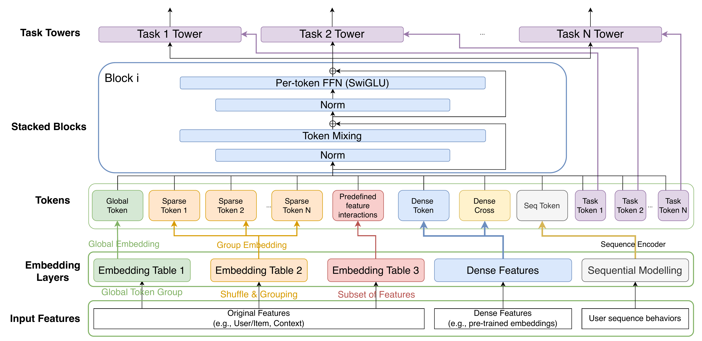
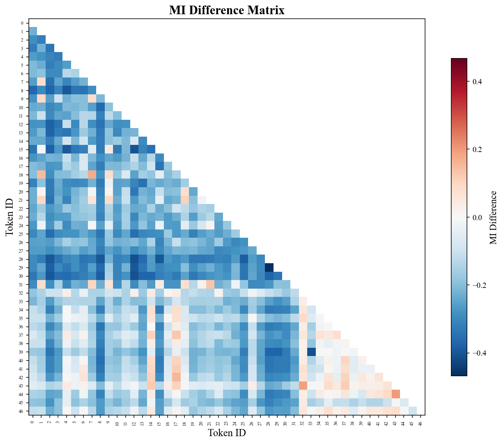
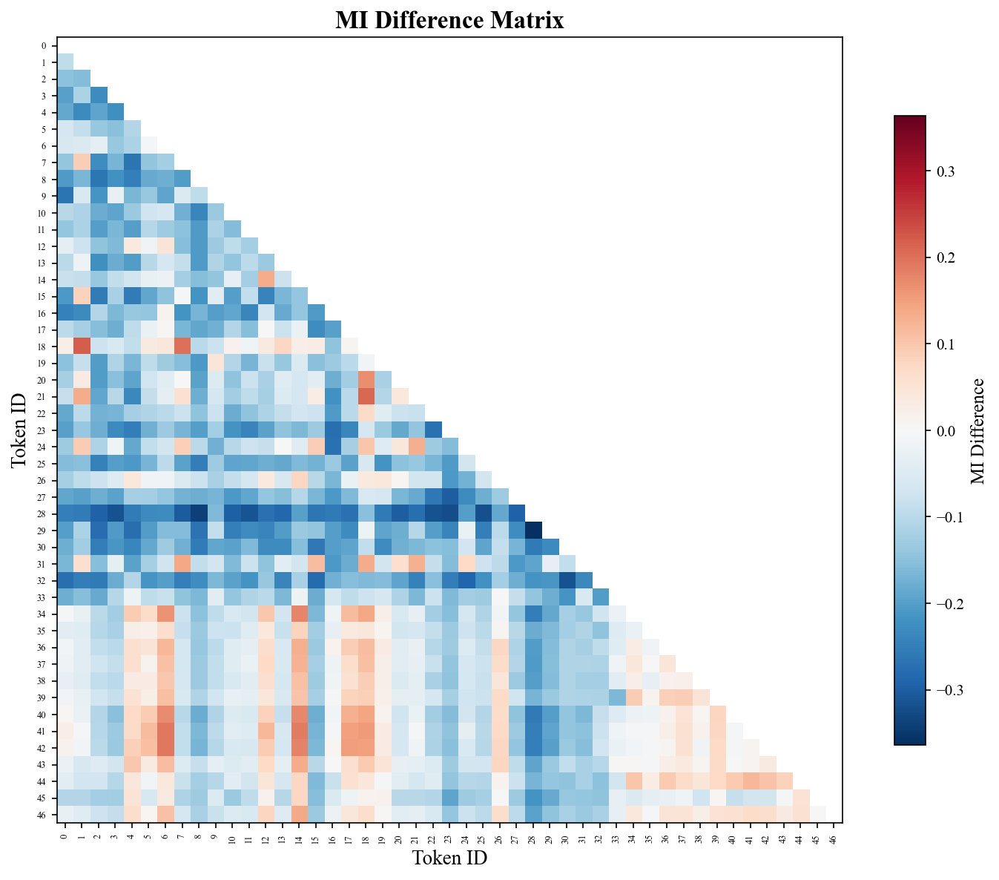
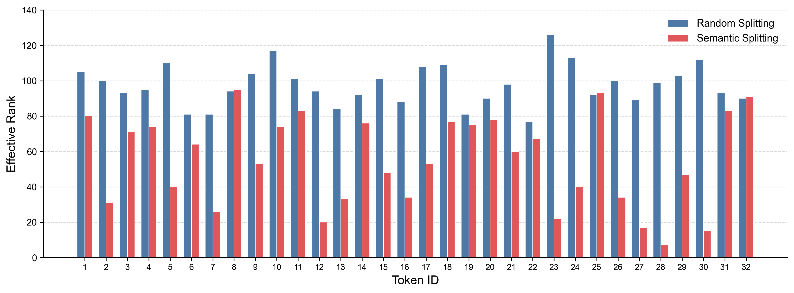
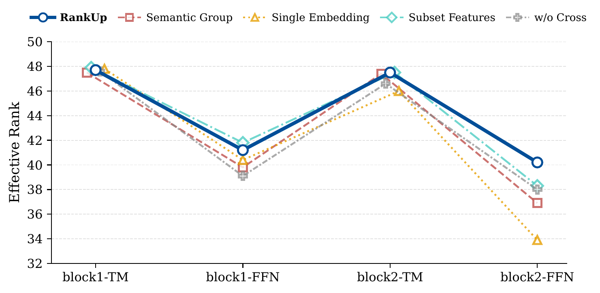
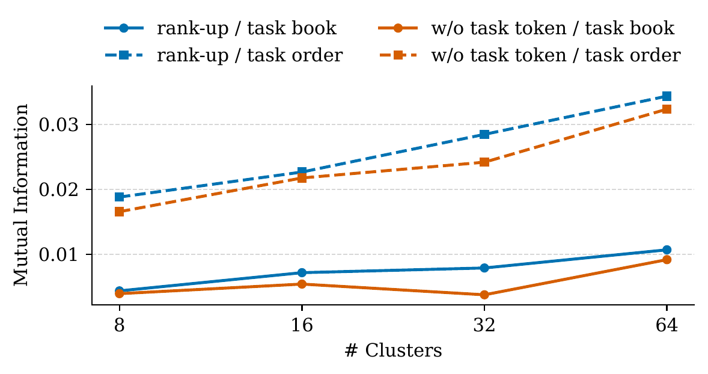

# RankUp 论文详解

> 论文：**RankUp: Towards High-rank Representations for Large Scale Advertising Recommender Systems**  
> 作者：Jin Chen, Shangyu Zhang, Bin Hu, Chao Zhou, Junwei Pan, Gengsheng Xue, Wentao Ning, Gengyu Weng, Wang Zheng, Shaohua Liu, Zeen Xu, Chengyuan Mai, Shijie Quan, Tingyu Jiang, Lifeng Wang, Shudong Huang, Chengguo Yin, Haijie Gu, Jie Jiang  
> 机构：Tencent Inc.  
> 版本：arXiv:2604.17878v3，2026-05-12，共 9 页  
> 状态：2026 年 arXiv/CoRR 预印本，尚未发现正式会议版本  
> 官方页面：[arXiv 摘要](https://arxiv.org/abs/2604.17878v3) / [官方 HTML](https://arxiv.org/html/2604.17878v3) / [arXiv DOI](https://doi.org/10.48550/arXiv.2604.17878)  
> 本地论文：[RankUp.pdf](./RankUp.pdf)  
> 代码与数据：截至 2026-08-12，未发现公开实现；实验使用腾讯内部生产数据

## 0. 先确认论文身份

本文讨论的是微信广告 CVR/pCVR 排序模型中的表示能力，属于广告推荐与排序，也就是通常所说的“搜广推”技术范围，但它不是搜索广告拍卖或关键词检索算法。题目中的 **Rank** 指 token 表示矩阵的“有效秩”，而不是广告展示位次。

它还需要与两篇同名论文区分：

- *RankUp: Boosting Semi-Supervised Regression with an Auxiliary Ranking Classifier*，NeurIPS 2024，研究半监督回归；
- *RankUp: Enhancing graph-based keyphrase extraction methods with error-feedback propagation*，2018 年，研究关键词抽取。

本地 PDF 首页仍保留 ACM 模板里的 “2018”“Conference acronym 'XX”“Woodstock”“XXXX DOI”等占位内容。这些不是论文的真实会议、年份或 DOI；本文只能按 2026 年 arXiv v3 预印本引用。

## 1. 一句话结论

RankUp 的核心观点是：**把推荐模型做大，不等于把表示空间真正用好。** 它没有重点改造 RankMixer 的 Token Mixer，而是从 token 形成和多任务输出两端扩展表示空间：随机打散稀疏特征、为特征提供多套 embedding、加入全局 token、加入预训练用户/广告向量的交叉 token，再为每个任务配置专属 token，从而缓解深层 FFN 中的有效秩下降。

论文在腾讯微信广告生产系统中报告：完整 RankUp 相对基线在三个代表性任务上的 Realtime AUC 分别提升 **0.41% / 0.23% / 0.25%**；20% 流量、连续 14 天的线上 A/B 测试中，微信视频号、公众号和朋友圈的 GMV 分别提升 **3.41% / 4.81% / 2.12%**，随后全量部署。

## 2. 研究问题：参数变多，表示能力真的同步增长了吗？

### 2.1 背景

近年的工业推荐模型逐渐采用 MetaFormer 范式：反复堆叠“跨 token 交互”和“每个 token 内的通道变换”。RankMixer、TokenMixer-Large、Wukong、MixFormer 等工作表明，扩大网络深度、隐藏维度和用户行为序列长度通常能改善排序指标。

但作者区分了两个概念：

- **模型规模**：参数量、层数、隐藏维度、FLOPs；
- **表示容量**：隐藏表示是否真正占据了足够丰富的独立方向。

如果隐藏表示集中到少数主方向，即使参数很多，后续层仍在一个低维子空间中工作。这就是论文所说的 representation collapse，也可译为表示坍塌或维度坍塌。

### 2.2 RankMixer 骨干

输入被整理为 $T$ 个 token，每个 token 的维度为 $D$，第 $l$ 层隐藏状态记作：

$$
\mathbf H_l \in \mathbb R^{T\times D}.
$$

一个 MetaFormer block 包含 Token Mixer 和 per-token FFN，并采用 Pre-LayerNorm 与残差连接：

$$
\mathbf H'_l=
\operatorname{TokenMixer}(\operatorname{LN}(\mathbf H_{l-1}))
+\mathbf H_{l-1},
$$

$$
\mathbf h_{l,i}=
\operatorname{FFN}(\operatorname{LN}(\mathbf h'_{l,i}))
+\mathbf h'_{l,i},\qquad i=1,\ldots,T.
$$

RankMixer 的 Token Mixer 将每个 token 切成多个 head，再跨 token 重组同一 head，几乎不引入参数，适合工业硬件；per-token FFN 则分别沿通道维变换各个 token。RankUp 延续这个骨干，并把 FFN 激活改为 SwiGLU，以提高非线性表达并帮助深层训练稳定。

### 2.3 如何度量“有没有坍塌”：有效秩

对某一层的 token 表示矩阵 $\mathbf H_l$ 做奇异值分解，设奇异值为 $\sigma_1,\ldots,\sigma_k$，其中 $k=\min(T,D)$。先把奇异值归一化：

$$
p_i=\frac{\sigma_i}{\sum_{j=1}^{k}\sigma_j},
$$

再计算：

$$
\operatorname{erank}(\mathbf H_l)
=\exp\left(-\sum_{i=1}^{k}p_i\ln p_i\right).
$$

直觉如下：

| 情况 | 奇异值分布 | 有效秩 | 含义 |
|---|---|---:|---|
| 信息集中在一个方向 | 一个奇异值占绝对主导 | 接近 1 | 表示严重坍塌 |
| 信息分散在多个正交方向 | 多个奇异值比较均衡 | 接近 $k$ | 潜在空间利用更充分 |

有效秩比普通代数秩更稳健，因为极小噪声不会把一个实际低维矩阵轻易判成满秩。论文引用前置研究指出，RankMixer 的有效秩随层数呈阻尼振荡：Token Mixer 只能带来有界的跨 token 秩扩张，FFN 又往往收缩通道秩，因而增加深度并不保证表示容量单调增长。

需要注意：**有效秩是表示多样性的诊断指标，不等同于 AUC，也不是越高越必然越好。** RankUp 的实验展示了有效秩和业务指标同时改善，但没有建立二者之间的因果关系。

## 3. RankUp 整体架构



*图 1：RankUp 总体架构。图片从 arXiv v3 官方 TeX 源中的原始图提取。*

整个数据流可概括为：

1. 原始用户、广告和上下文稀疏特征进入多套 embedding 表；
2. 稀疏特征经随机置换后分组，形成一组 sparse tokens；
3. 全部特征额外汇聚成 global token；
4. 预训练用户向量和广告向量形成显式交叉 token；
5. 稠密特征与行为序列编码器分别产生 dense token 和 sequence token；
6. 每个优化目标加入一个 learnable task token；
7. 所有 token 一同通过堆叠的 Token Mixer 和 per-token SwiGLU FFN；
8. 第 $k$ 个任务塔同时读取共享表示池化结果和第 $k$ 个任务 token。

RankUp 的五个主要机制位于不同位置：

| 机制 | 作用位置 | 直接目标 | 额外代价 |
|---|---|---|---|
| Randomized Permutation Splitting | 稀疏特征分组 | 降低 token 间相关性 | 主要是分组变化，额外参数较少 |
| Multi-embedding | 输入 embedding 层 | 从多个几何视角表示同一特征 | embedding 参数和显存明显增加 |
| Global Token | token 序列入口 | 给局部 token 提供全局上下文 | 一套聚合模块和一个 token |
| Cross Pre-trained Embedding Token | token 序列入口 | 注入召回侧用户/广告交互先验 | 依赖预训练向量和投影层 |
| Task-Specific Token Decoupling | 多任务输入与输出 | 减少任务间表示和梯度干扰 | 每任务一个 token，并扩展塔输入 |

论文摘要只列出了前四项，任务专属 token 在正文中作为第五项完整方法出现。

## 4. 五个核心机制

### 4.1 Randomized Permutation Splitting：随机置换分片

传统做法主要有两类：

- **Autosplit**：把固定顺序拼接的 embedding 向量等长切为 $T$ 段，再分别投影；
- **Semantic Grouping**：由专家把语义相关特征放进同一组，再拼接和投影。

作者认为语义分组可能把高度相关的特征或多个低基数长尾特征集中在同一个 token，使 token 内信息共线、token 之间又重复，从一开始就形成低秩表示。

RankUp 先对 $M$ 个稀疏特征的索引做随机置换：

$$
\mathcal F_\sigma=
\{f_{\sigma(1)},\ldots,f_{\sigma(M)}\},
$$

再分组、拼接并投影为 token。这样做不是删除语义，而是刻意打破“相关特征必须同组”的人工先验，让不同类型和不同频次的特征更均匀地分散到各个 token 中。

其预期作用链条是：

$$
\text{随机打散特征}
\rightarrow \text{减少 token 间冗余}
\rightarrow \text{初始表示基更丰富}
\rightarrow \text{更高有效秩}.
$$

这是五个机制中最轻量的一个，单独带来三个任务上 **+0.06% / +0.06% / +0.08%** 的 Realtime AUC 提升。不过论文没有说明置换是训练前固定一次、按 epoch 重采样，还是按 batch/样本变化；工业推理通常需要可复现映射，这一实现细节非常关键。

### 4.2 Multi-embedding：多嵌入表征

单 embedding 范式用一个表把稀疏特征映射到低维空间：

$$
\psi:\mathcal F\rightarrow\mathbb R^d.
$$

RankUp 改为 $K$ 个彼此独立的 embedding 表 $\{\psi_1,\ldots,\psi_K\}$。对特征 $f_j$，可以从分配给它的表子集 $\mathcal K_j$ 中得到多份表示：

$$
\mathbf e_j=
\{\psi_k(f_j)\mid\psi_k\in\mathcal K_j\}.
$$

同一个类别信号因此拥有多个独立的几何坐标系。作者将其视为扩大初始表示 $\mathbf H_0$ 自由度的方法，尤其希望改善稀疏、长尾特征的表达。

它与“把 embedding 维度简单增大”并不完全相同：多个独立表可以形成不同参数化视角；但二者都会增加参数和存储。论文没有给出等参数对照，因此无法判断收益中有多少来自结构，有多少只是来自更多 embedding 参数。

### 4.3 Global Token：全局上下文 token

普通 sparse token 只看到自己分组内的局部特征。RankUp 额外对全部特征做聚合：

$$
\mathbf g=
A(f_1,\ldots,f_M)
=\operatorname{func}\left(
\operatorname{Pool}(\{\operatorname{Embed}(f_i)\}_{i=1}^{M})
\right).
$$

$\operatorname{func}$ 可以是 MLP，也可以是 FM、FFM/FwFM 或 DCNv2 一类显式交互模块。得到的 $\mathbf g$ 被追加到 token 序列：

$$
\mathbf H_0=[\mathbf g,\mathbf e_1,\ldots,\mathbf e_T].
$$

这相当于给每层 Token Mixer 增加一个信息汇聚与广播节点：局部 token 可以通过它间接获得全局上下文。图 4 的消融曲线显示，去掉或弱化全局信息后，第二个 FFN 的有效秩下降更明显，因而作者认为 Global Token 主要负责稳定深层表示。

论文只给出了聚合函数的候选集合，没有说明生产版本究竟使用哪一种以及具体配置，因此无法精确复现其成本和增益。

### 4.4 Cross Integration of Pre-trained Embeddings：预训练向量交叉 token

工业系统通常已有两塔召回模型产生的用户向量 $\mathbf z_{ue}$ 和广告/物品向量 $\mathbf z_{ie}$。两塔目标偏向全局距离或相似度，而精排需要更细粒度的交互。

RankUp 先做 Hadamard 逐元素乘积，再投影为一个 token：

$$
\mathbf e_{cross}=
\operatorname{Proj}(\mathbf z_{ue}\odot\mathbf z_{ie}).
$$

这个设计可理解为把因子分解模型中的显式匹配先验注入 token 序列。它保留每一维“用户偏好与广告属性同时激活”的信号，比只拼接两个向量更直接。

单独加入 Cross Embedding 后，Order / Book / Add Service 的 Realtime AUC 分别提升 **+0.22% / +0.10% / +0.03%**，对 Order 任务最明显。新广告首日 GMV 的较大提升也与“外部先验帮助稀疏场景”的解释相容，但论文没有做直接归因实验，不能把冷启动收益全部归功于该 token。

### 4.5 Task-Specific Token Decoupling：任务专属 token 解耦

生产模型同时优化 32 个目标。若所有任务完全共享表示，数据量更大或梯度更强的任务可能把共享空间压向自己的方向，弱化其他任务所需的信息。

RankUp 为第 $k$ 个任务加入一个可学习 token $\mathbf x_{task}^{(k)}$。这些 token 与共享 token 一起经过相同骨干，但在混合过程中形成各自的任务相关状态。第 $k$ 个任务塔读取：

$$
y^{(k)}=
\operatorname{Tower}^{(k)}\left(
\mathbf x_{task}^{(k)},
\operatorname{Pool}(\mathbf H'_L)
\right).
$$

也就是“任务私有摘要 + 全局共享摘要”。它不像 MMoE 那样显式分配多位专家，而是在 token 层为不同目标提供独立的信息槽位。

单独加入 Task Token 的 AUC 增益相对较小：**+0.09% / +0.02% / +0.02%**。论文进一步用“表示聚类标签与真实任务标签的互信息”证明任务 token 保留了更多任务相关结构，见第 7.4 节。

## 5. 方法本质：RankUp 主要改了哪里？

从架构角度看，RankUp 更像是对 RankMixer 的**表示供给系统**进行升级，而不是发明一个全新的 Token Mixer：

| 维度 | RankMixer 基线 | RankUp |
|---|---|---|
| token 形成 | Autosplit 或语义分组 | 随机置换分组 |
| sparse embedding | 单套表示为主 | 多套独立 embedding |
| 全局上下文 | 依赖后续 token mixing | 显式 Global Token |
| 预训练召回向量 | 浅层拼接/投影的常见做法 | 用户和广告向量逐元素交叉后成 token |
| 多任务共享 | 共享骨干后接任务塔 | 额外加入任务专属 token |
| block | Token Mixer + per-token FFN | 基本沿用，并用 PreNorm + SwiGLU |

因此，其创新点分布在输入 tokenization、外部先验融合和多任务读出三个环节。论文认为，只把 Self-Attention、Full-Mix 或 UniMixer 等 Token Mixer 做得更复杂，仍可能只是在一个已经受限的潜在空间内加强交互；RankUp 选择先丰富潜在空间本身。

不过本文没有与这些复杂 mixer 做直接、等参数的实验对照，所以“先扩展表示空间比改 mixer 更有效”应理解为作者的设计判断，而不是已被本论文充分验证的普遍结论。

## 6. 实验设置

| 项目 | 论文设置 |
|---|---|
| 数据来源 | 微信视频号广告生产日志 |
| 数据规模 | 每日约 2,000 万样本 |
| 时间范围 | 2024-07 至 2026-03 |
| 稀疏特征 | 1,200+ 个 |
| 核心任务 | CVR 预测 |
| 多任务数量 | 32 个在线优化目标 |
| 代表任务 | Order、Book、Add Service |
| 主要基线 | RankMixer |
| 骨干深度 | 所有消融均使用 2 层 MetaFormer |
| 主预测指标 | Realtime AUC，即短时间连续窗口中的 AUC |
| 表示指标 | 每个样本的 token 矩阵有效秩，再在 batch 内求均值 |
| 相关性分析 | K-means 离散化后估计 token-token MI 或 representation-label MI |

论文没有披露训练/验证/测试切分、优化器、学习率、batch size（训练）、token 数 $T$、隐藏维度 $D$、多 embedding 表数 $K$、损失权重和随机种子等关键配置。

## 7. 离线/准线上结果与表示分析

### 7.1 组件消融：Realtime AUC

| 方法 | Order | Book | Add Service |
|---|---:|---:|---:|
| Randomized Permutation Split | +0.06% | +0.06% | +0.08% |
| Global Token + Multi-Emb | +0.21% | +0.18% | +0.13% |
| Cross Embedding | +0.22% | +0.10% | +0.03% |
| Task Token | +0.09% | +0.02% | +0.02% |
| **完整 RankUp** | **+0.41%** | **+0.23%** | **+0.25%** |

表中各组件行是相对同一基线的独立变体，不是从上到下累加。各行增益也不能直接相加：组件之间会共享信息、产生冗余或交互。完整 RankUp 在三个任务上都最好，但论文未报告重复实验方差、置信区间或显著性检验。表头只写百分数，没有明确说明这些数值是相对百分比还是 AUC 百分点；此外，Global Token 与 Multi-Emb 被捆绑成同一行，无法从该表拆分二者的独立贡献。

### 7.2 随机分片是否真的降低 token 冗余？

作者把一个 batch 的 token embedding 用 K-means 映射到 $K$ 个离散簇，再计算 token $i$ 与 token $j$ 的互信息：

$$
M_{ij}=\sum_{a=1}^{K}\sum_{b=1}^{K}
p(a,b)\log\frac{p(a,b)}{p_i(a)p_j(b)}.
$$

然后比较随机分片与语义分组：

$$
\Delta\mathbf M=
\mathbf M_{Randomized}-\mathbf M_{Semantic}.
$$

$\Delta M_{ij}<0$ 表示随机分片后的 token 冗余更低。论文在 $K=48$ 和 $K=64$ 时都观察到类似的蓝色负值区域，尤其是在 0-31 号 sparse tokens 内部，以及 sparse 与 non-sparse tokens 之间。



*图 2a：$K=48$ 时的 MI 差矩阵。蓝色表示随机分片的互信息更低。*



*图 2b：$K=64$ 时结果保持类似趋势，说明观察对这两个聚类粒度较稳健。*

这项分析支持“随机分片降低统计冗余”，但 MI 是经过 K-means 离散化后的估计值，会受样本量、聚类初始化和 $K$ 影响；论文没有报告这些估计细节或误差条。

### 7.3 随机分片是否提高每个 token 的有效秩？



*图 3：随机分片在 32 个 sparse tokens 上的有效秩总体更高、更均匀。*

图中蓝色柱代表随机分片，红色柱代表语义分组。随机分片的有效秩大多位于约 80-125，而语义分组在若干 token 上出现明显低值。这与作者的解释一致：若把大量低基数、长尾且彼此相似的特征放到同一 token，那个 token 的表示容易集中在少数方向；随机打散可以缓和这种集中。

论文正文称 “Token 12、29、31 低于 20”，但图中的横轴和柱高不能完整对应这一表述：明显低于 20 的红色柱主要出现在其他编号附近。这可能是图表更新后正文编号未同步，不能据此引用具体 token 编号；应以整体趋势为主。

### 7.4 各组件怎样影响层间有效秩？



*图 4：TM 表示 Token Mixer 后的状态，FFN 表示 per-token FFN 后的状态，均包含残差连接。*

可读出三点：

1. 从每个 Token Mixer 到紧随其后的 FFN，有效秩都会明显下降，符合“FFN 是主要收缩环节”的判断；
2. 完整 RankUp 在第二个 FFN 后仍保持最高有效秩，约为 40；
3. Single Embedding 在第二个 FFN 后下降最明显，约为 34，说明多 embedding 主要帮助初始和深层表示多样性；Semantic Group、Subset Features 和 w/o Cross 也低于完整模型。

图中仅有两个 block，因此它能说明 2 层网络内部的秩变化，却不足以直接验证“很深网络中的阻尼振荡”或完整的深度 scaling law。

还有一个容易忽视的混杂因素：有效秩是在 $\mathbf H\in\mathbb R^{T\times D}$ 上计算的，而 Global、Cross 和 Task Tokens 都会增加 $T$，其理论上界 $\min(T,D)$ 也可能随之升高。论文没有报告 token 数匹配的对照，也没有使用 $\operatorname{erank}/\min(T,D)$ 之类的归一化指标。因此，图 4 中一部分 raw erank 增长可能来自 token 行数增加，不能全部解释为“相同表示规模下更抗坍塌”。

### 7.5 Task Token 是否更贴近任务标签？

作者把连续隐藏表示用 K-means 离散成簇 $Z$，并计算它与二元标签 $Y$ 的互信息：

$$
I(Z;Y)=\sum_{z,y}P(z,y)
\log\frac{P(z,y)}{P(z)P(y)}.
$$



*图 5：蓝色为完整 RankUp，橙色为去掉 task token；实线对应 Book，虚线对应 Order。*

在 $K=8,16,32,64$ 的各个聚类粒度下，带 task token 的表示与 Book/Order 标签之间的 MI 都更高。簇数越多，Order 任务上的差距越明显，说明 task token 可能有助于保留细粒度的任务相关结构。

这仍是一种间接证据。聚类后的 MI 不等同于可解释的任务因果分解，而且论文没有与 MMoE、PLE 等标准多任务解耦方法直接对比。Task Tokens 仍与共享 tokens 一起经过同一个 Token Mixer，所有任务也仍会向共享骨干反向传播；论文没有测量任务梯度余弦、冲突率或任务间 trade-off，所以“减少梯度干扰”尚未被直接证明。

## 8. 生产部署与线上 A/B 测试

### 8.1 部署规模

论文给出的生产配置如下：

- 三个场景：微信视频号、微信公众号、微信朋友圈广告；
- 每个场景统一优化 32 个任务；
- 从头训练，不从历史 checkpoint 初始化；
- 采用 2 层 MetaFormer 骨干；
- 每个场景参数量从旧生产系统约 10M 扩到约 100M；
- batch size 为 300 时约 70 GFLOPs/batch；
- Model FLOPs Utilization (MFU) 为 23%；
- 作者称满足实时服务延迟限制，但未公布具体毫秒数或吞吐量。

### 8.2 总体线上结果

线上 A/B 使用 **20% 生产流量**，每个实验连续运行 **14 天**，对照为当时的生产系统，最终已扩至 100% 流量。

| 场景 | Realtime AUC | CTCVR | GMV |
|---|---:|---:|---:|
| 微信视频号 | +0.367% | +1.41% | +3.41% |
| 微信公众号 | +0.331% | +0.21% | +4.81% |
| 微信朋友圈 | +0.269% | +0.87% | +2.12% |

表中只给出带百分号的 uplift，没有明确解释是相对百分比还是百分点，也没有给出基准绝对值，因此无法还原绝对指标。

### 8.3 新广告首日 GMV

| 场景 | 新广告 GMV |
|---|---:|
| 微信视频号 | +5.83% |
| 微信公众号 | +9.67% |
| 微信朋友圈 | +2.84% |

新广告缺少历史行为，属于典型冷启动场景。RankUp 在这里的 uplift 高于总体 GMV uplift，说明更丰富的输入表示与外部预训练先验在稀疏监督下可能更有价值。其中公众号场景达到 **+9.67%**。

### 8.4 Order 任务 GMV

| 场景 | Order 任务 GMV |
|---|---:|
| 微信视频号 | +5.18% |
| 微信公众号 | +7.18% |
| 微信朋友圈 | +4.79% |

Order 是平台广告消耗占比最大的核心转化目标。三场景均有明显提升，公众号达到 **+7.18%**。作者进一步估算，整体收益对应每年数亿美元收入增量，但论文没有披露估算方法或基数，这一数字应视为作者自述。

### 8.5 线上数字的一处版本不一致

arXiv v3 的摘要和线上结果表都写朋友圈 GMV **+2.12%**，正文描述段却写成 **2.21%-4.81%**。本总结以最新 v3 摘要和表格中相互一致的 **2.12%** 为准，将 2.21% 视为正文笔误。

## 9. 如何理解这些结果

### 9.1 哪些证据最有说服力

- **完整模型在三个代表任务上都优于基线**，方向一致；
- 随机分片同时获得 MI 降低和 token 有效秩提高，两种表示指标相互印证；
- 深层 FFN 后完整 RankUp 的有效秩优势最明显，与论文的问题设定一致；
- 三个独立广告场景均取得 AUC、CTCVR 和 GMV 改善，并经过 14 天大流量实验；
- 新广告和 Order 两个高价值切片也保持收益，说明结果不只来自一个汇总指标。

### 9.2 最值得注意的业务信号

离线消融中，Global Token + Multi-Emb 是 Book 和 Add Service 上最强的单项组合，Cross Embedding 则是 Order 上最强的单项。这暗示：

- 长尾或上下文复杂任务可能更依赖丰富的基础表示与全局信息；
- 高意向订单任务可能更受益于用户与广告预训练向量的显式匹配。

这是根据表格做出的合理推断，论文没有进一步给出任务差异的因果分析。

### 9.3 为什么完整模型增益小于单项之和

以 Order 为例，各独立变体的 uplift 相加为 0.58%，而完整 RankUp 是 0.41%。这不代表完整模型有问题，而是说明组件之间并非正交：Global Token、Multi-embedding 和 Cross Token 都在丰富输入表示，可能学习到部分重复信息；多任务 token 也会改变共享骨干的优化路径。因此，应依靠端到端组合实验，不应把消融数字线性外推。

### 9.4 证据强度分级

| 证据强度 | 可以支持的结论 |
|---|---|
| 强 | RankUp 整体方案在腾讯内部三个微信广告场景的 A/B 测试中取得正向业务指标，并已全量上线 |
| 中等 | 在该内部数据和 2 层设置下，若干组件与更高的有效秩、MI 和 Realtime AUC 同时出现 |
| 弱 | 有效秩提升是 GMV 增长的因果原因；收益可迁移到其他平台、公开数据或更深模型；年收入外推可独立验证 |

## 10. 优点

1. **问题切入点实用**：把“参数规模”和“有效表示容量”分开，提醒工业团队不要只看参数、FLOPs 和 AUC scaling。
2. **组件简单且可插拔**：五个机制大多位于输入和读出层，可在保留现有 MetaFormer/RankMixer 服务栈的前提下逐步接入。
3. **诊断链条相对完整**：既测预测指标，也测 token MI、有效秩和任务标签 MI，不只报告最终 GMV。
4. **生产证据强**：三个微信广告场景、20% 流量、14 天实验和最终全量部署，比只在公开小数据集上测试更接近真实工业价值。
5. **冷启动收益突出**：新广告首日 GMV 的提升尤其明显，说明方法对数据极稀疏阶段有潜在价值。

## 11. 局限与证据边界

### 11.1 可复现性不足

- 数据、特征、训练代码和模型代码均未公开；
- 没有公共数据集结果，外部团队无法复核；
- 未给出 $T$、$D$、embedding 表数、各表分配策略、优化器、学习率、损失权重、训练轮数和随机种子；
- 随机置换何时采样、是否固定以及如何保证线上一致性没有说明；
- Global Token 的生产聚合器、预训练向量来源和 task token 具体配置未披露。

### 11.2 对照实验不足

- 明确的主要基线只有 RankMixer，没有与 Wukong、UniMixer、复杂 Attention、MMoE/PLE 等做同设置比较；
- 没有等参数、等 FLOPs 或等延迟对照；
- 线上模型同时从约 10M 扩到 100M 参数，业务增益可能同时来自模型扩容和 RankUp 结构，二者没有严格拆分；
- 各消融变体是否参数量匹配没有说明；
- Global Token 与 Multi-Embedding 没有拆开消融，PreNorm 与 SwiGLU 也没有消融；
- 32 个目标中只展示三个任务的 AUC，Task Token 的标签 MI 只展示两个任务，不能判断所有任务是否一致受益。

### 11.3 “深层坍塌”论证仍有限

论文以深层网络中的秩衰减为主要动机，但所有消融采用 2 层骨干，图 4 也只展示两个 block。文中没有不同深度、宽度或参数规模下的有效秩与 AUC 曲线，因此没有直接证明 RankUp 改善完整的 scaling law，也没有显示在十几层或更深网络中的稳定性。

### 11.4 统计信息不完整

- Realtime AUC 没有给出窗口长度、基准绝对值、方差或置信区间；
- 线上结果虽称“统计显著”，但没有随机化单位、p 值、置信区间、流量样本量、检验方法或多重检验校正；连续 14 个日测量还可能存在日间自相关；
- CTCVR 未给出明确公式；
- MI 依赖 K-means 离散化，但缺少样本量、聚类随机种子、有限样本偏差修正和估计方差；图 5 中差距随 $K$ 增大也可能部分受估计器偏差影响；
- 有效秩提高与业务指标改善同时出现，但没有相关性分析或因果干预。

### 11.5 有效秩与机制解释存在混杂

- 新增 Global、Cross、Task Tokens 会增加 $T$，也可能机械性提高 raw erank 的上界；论文没有 token 数匹配或归一化 erank；
- Multi-Embedding 增加参数和几何自由度，但没有与同参数的更宽单 embedding 比较；
- 多套 embedding 没有显式多样性约束，理论上也可能学习成彼此冗余；
- Global Token 自身引入更强的全局交互，其收益不一定来自高秩；
- 论文只展示“有效秩、MI 和业务指标一同上升”，没有证明前者导致后者；高秩也可能包含无用或噪声方向。

### 11.6 效率与部署信息仍不足

- 23% MFU 没有对应硬件、精度、编译器或严格可比基线；
- 论文只说满足实时约束，没有报告吞吐、显存、embedding 内存、训练时长以及 p50/p95/p99 延迟；
- 相关工作引用的 RankMixer MFU 为 45%，但设置不同，不能直接与本文 23% 比较，也不能只凭 23% 判断硬件效率已经改善；
- Multi-Embedding 和多个额外 token 的分项资源开销没有披露。

### 11.7 文本与口径存在小问题

- 数据集章节写 2024-07 至 2026-03，部署章节又称使用 18 个月日志，二者可能是全量范围与实际训练子集的差异，但论文没有解释；
- 实验设置写 1,200+ 稀疏特征，部署章节写 1,000+ feature fields，口径可能不同；
- 朋友圈 GMV 在 v3 摘要/表格为 2.12%，正文一处为 2.21%；
- 图 3 与正文列举的低秩 token 编号不能完全对应；
- 首页会议和版权字段仍是 ACM 模板占位符。

## 12. 对工程落地的启示

若要在其他搜广推系统中验证 RankUp，建议按以下顺序进行，并始终保持等参数或等算力对照：

1. **先建立诊断**：在输入、每个 Token Mixer 后和每个 FFN 后记录逐样本有效秩，同时观察奇异值谱，而不是只看最终 AUC；
2. **优先测试随机分片**：成本最低，但应固定多组随机种子，验证提升是否稳定，并保证训练与服务端分组完全一致；
3. **单独评估 Global Token**：从简单 mean/sum pooling + MLP 开始，再与 FM/DCNv2 聚合器比较；
4. **对 Multi-embedding 做参数匹配**：与“单表但更宽”以及“同总参数的多表”分别比较，确认结构收益；
5. **接入预训练交叉 token**：检查用户/广告向量的训练时效、分布漂移和在线更新成本；
6. **多任务场景再加 task token**：同时与 MMoE/PLE 对照，并测量弱任务是否受益、强任务是否受损；
7. **做深度 scaling 实验**：至少比较 2/4/8/16 层下的 AUC、有效秩、训练稳定性、FLOPs、显存和 P99 延迟；
8. **最后做线上分层 A/B**：除总体指标外，单独监控新广告、长尾广告、核心转化任务、校准度和广告成本效率。

一个更严格的验证矩阵应同时控制三类变量：

| 对照维度 | 至少需要的实验 |
|---|---|
| 结构 | 基线、五个单组件、完整组合、关键两两组合 |
| 规模 | 等参数、等 FLOPs、等延迟三组对照 |
| 深度 | 多个 block 深度下的 AUC 与有效秩曲线 |
| 稳定性 | 多随机种子、多日期窗口、均值与置信区间 |
| 泛化 | 不同广告场景、公开数据或不同业务域 |

## 13. 最终评价

RankUp 的价值不在于某个复杂的新算子，而在于把工业推荐模型的扩容问题重新表述为：**怎样让新增参数对应到可用、互补且任务相关的表示方向。** 五个机制分别处理特征分组共线、输入自由度不足、局部 token 缺少全局视野、召回先验利用浅、多任务梯度冲突，设计逻辑清晰，生产结果也很有吸引力。

但从学术证据看，它更像一篇强生产经验报告，而不是已经完成充分控制实验的 scaling-law 研究：私有数据和实现不可复现，基线与统计报告有限，2 层实验不足以完整支撑“深层表示坍塌”，10M 到 100M 的扩容又混入了结构收益。因此，最稳妥的结论是：

> RankUp 提供了一套有生产验证的“高秩表示设计工具箱”，证明这些组件在微信广告系统中共同有效；它尚未证明有效秩本身是业务增益的原因，也尚未证明同样的收益能普遍迁移到其他模型、深度和数据域。

## 14. 数字速查

| 类别 | 关键数字 |
|---|---|
| 论文版本 | arXiv v3，2026-05-12，9 页，5 图 |
| 数据 | 日均约 2,000 万样本，1,200+ 稀疏特征 |
| 任务 | 32 个 CVR 相关在线目标 |
| 骨干 | 2 层 MetaFormer/RankMixer 类架构 |
| 参数规模 | 生产模型约 10M -> 100M |
| 计算 | batch 300 时约 70 GFLOPs，MFU 23% |
| A/B | 20% 流量，连续 14 天 |
| 完整 RankUp AUC 消融 | Order +0.41%，Book +0.23%，Add Service +0.25% |
| 总体 GMV | 视频号 +3.41%，公众号 +4.81%，朋友圈 +2.12% |
| 新广告 GMV | +5.83%，+9.67%，+2.84% |
| Order GMV | +5.18%，+7.18%，+4.79% |

## 15. 引用

```bibtex
@article{chen2026rankup,
  title   = {RankUp: Towards High-rank Representations for Large Scale Advertising Recommender Systems},
  author  = {Chen, Jin and Zhang, Shangyu and Hu, Bin and Zhou, Chao and Pan, Junwei and Xue, Gengsheng and Ning, Wentao and Weng, Gengyu and Zheng, Wang and Liu, Shaohua and Xu, Zeen and Mai, Chengyuan and Quan, Shijie and Jiang, Tingyu and Wang, Lifeng and Huang, Shudong and Yin, Chengguo and Gu, Haijie and Jiang, Jie},
  journal = {arXiv preprint arXiv:2604.17878},
  year    = {2026}
}
```

> 注：以上 BibTeX 按当前 arXiv v3 信息整理。正式发表前应再次检查作者、会议和 DOI；不要照抄 PDF 首页的 ACM 模板占位字段。
