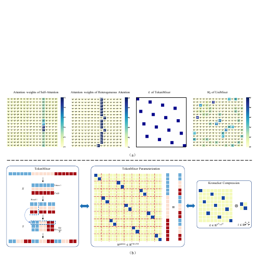
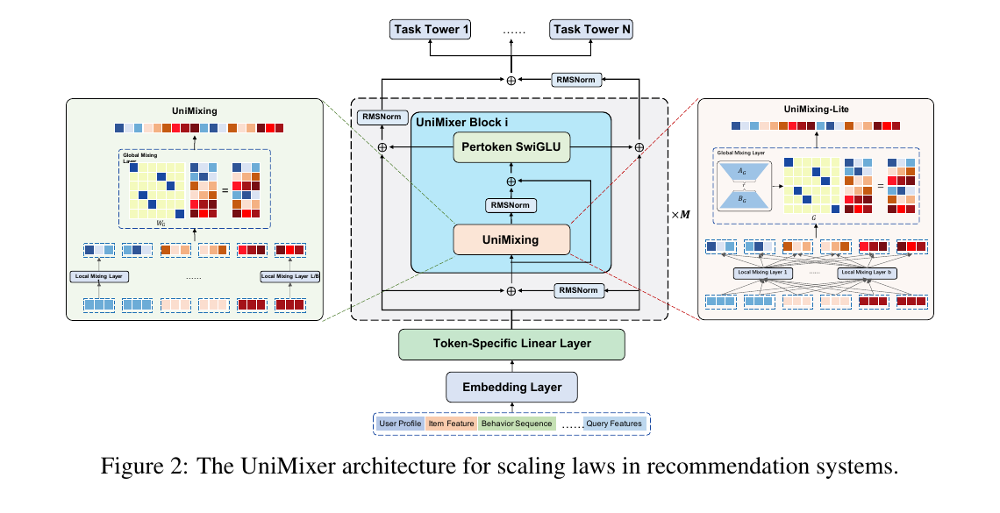
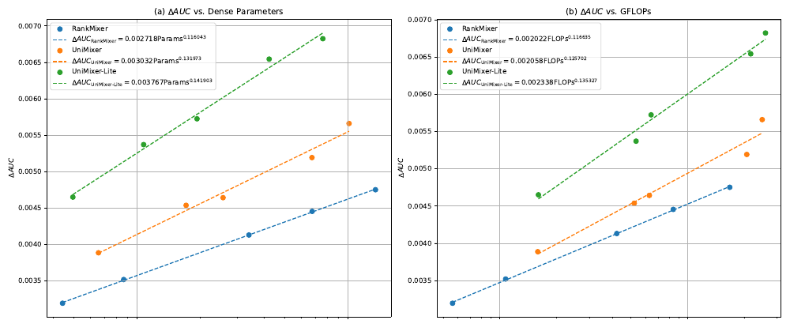

# UniMixer 论文详解

> 论文：**UniMixer: A Unified Architecture for Scaling Laws in Recommendation Systems**  
> 作者：Mingming Ha, Guanchen Wang, Linxun Chen, Xuan Rao, Yuexin Shi, Tianbao Ma, Zhaojie Liu, Yunqian Fan, Zilong Lu, Yanan Niu, Han Li, Kun Gai  
> 机构：Kuaishou Technology  
> 版本：arXiv:2604.00590v2，2026-04-02，共 17 页  
> 官方页面：[arXiv:2604.00590](https://arxiv.org/abs/2604.00590)
> 本地论文：[UniMixer.pdf](./UniMixer.pdf)
> 系列综述：[RankMixer 及其演进方法详细调研](../rankmixer/RankMixer及其演进方法详细调研.md)

## 0. 同名说明

“UniMixer”并不是唯一论文名。除本文外，至少还有一篇多变量时间序列预测论文 **UniMixer: Unified Patch-Wise and Global Inter-Series Dependency Modeling for Multivariate Time Series Forecasting**，以及一篇生成式观看时长预测论文。结合当前工作区已有的 RankMixer、TokenMixer-Large 等推荐系统论文，本笔记讲解的是上面这篇“推荐系统 Scaling Laws”论文。

## 1. 一句话结论

UniMixer 的核心不是“再造一个 Transformer”，而是把 RankMixer/TokenMixer 中**固定、按规则重排特征**的操作写成一个可学习的矩阵，再将它拆成“块内局部混合 + 块间全局混合”。这样，Attention、TokenMixer 和 FM/Wukong 都能被放进同一套“局部变换后再做全局混合”的框架中。轻量版 UniMixing-Lite 再用“局部基矩阵组合 + 全局低秩分解”压缩参数，论文实验中取得了最好的参数 Scaling 曲线。

## 2. 论文试图解决什么问题

### 2.1 推荐模型也希望出现 Scaling Law

LLM 中常见的 Scaling Law 是：数据、参数或计算量增加时，性能按相对稳定的规律继续提升。工业推荐模型也希望通过反复堆叠一种基础模块，让 AUC 随参数量或 FLOPs 稳定增长。

问题是，推荐输入和语言 token 不一样。语言 token 通常位于共享语义空间，而推荐系统会同时接收用户画像、物品属性、行为序列、查询词、数值特征、ID 特征和交叉特征等。不同字段的统计性质与语义空间高度异质，直接套用标准自注意力未必合适。

### 2.2 现有三条路线彼此割裂

论文把可扩展推荐架构分成三类：

| 路线 | 代表 | 如何交互 | 主要优点 | 主要问题 |
|---|---|---|---|---|
| Attention-based | Heterogeneous Attention、HiFormer、FAT | 用 token/field-specific 的 Q、K、V 算动态权重 | 表达力强、随输入变化 | 计算较重；异质空间内积可能产生尖锐、噪声或难训练的权重 |
| TokenMixer-based | RankMixer、TokenMixer-Large | 按预设规则切分、拼接和重排特征 | 简单、稳定，避免异质 token 直接做相似度 | 混合规则固定、不可学习；经典形式要求 head 数等于 token 数 |
| FM-based | Wukong、Kunlun | 显式构造二阶特征交互，再用 MLP/投影 | 高效、含明确交互先验 | 主要依赖低阶交互，继续扩大模型时可能受限 |

UniMixer 的研究问题是：**能否用一个统一模块同时解释并吸收三条路线的优势，而且扩得更划算？**

## 3. 必要符号与输入处理

设推荐输入被分成若干语义域，例如：

$$
\mathbf X=[\underbrace{\mathbf X_U}_{用户画像},\underbrace{\mathbf X_I}_{物品特征},\underbrace{\mathbf X_B}_{行为序列},\underbrace{\mathbf X_Q}_{查询特征},\ldots].
$$

每个域先经各自的 embedding，得到不同维度的向量，再拼成一个长向量 $\mathbf E$。论文沿用 RankMixer 的思路，把 $\mathbf E$ 均匀切段，并对第 $i$ 段使用独立投影：

$$
\mathbf x_i=W_i^{\text{proj}}\mathbf E_{di:di+d}+\mathbf b_i^{\text{proj}}\in\mathbb R^D.
$$

堆叠后得到隐藏状态 $X\in\mathbb R^{T\times D}$。这里 $T$ 是 token 数，$D$ 是每个 token 的维度。进入 UniMixing 时，论文常把它展平成长度 $L=TD$ 的向量。

## 4. 最关键的观察：TokenMixer 其实是一个置换矩阵

### 4.1 从“切分拼接规则”变成线性代数

经典 TokenMixer 先把每个 token 沿通道维切为 $H$ 个 head，再把所有 token 的同一 head 拼在一起。看起来像专门编写的数据搬运规则，但任何固定重排都等价于：

$$
\operatorname{TokenMixer}(X)
=\operatorname{reshape}\left(W^{\text{perm}}\operatorname{flatten}(X)\right),
$$

其中 $W^{\text{perm}}\in\mathbb R^{TD\times TD}$ 是置换矩阵。

直观例子：若

$$
X=\begin{bmatrix}
x_1&x_2&x_3&x_4&x_5&x_6\\
x_7&x_8&x_9&x_{10}&x_{11}&x_{12}
\end{bmatrix},
$$

并切成两个 head，那么 TokenMixer 输出为

$$
\begin{bmatrix}
x_1&x_2&x_3&x_7&x_8&x_9\\
x_4&x_5&x_6&x_{10}&x_{11}&x_{12}
\end{bmatrix}.
$$

这只是把 12 个位置重新排序，因此一定可以由一个 $12\times12$ 的 0-1 矩阵完成。

### 4.2 置换矩阵的四个性质

论文总结了 $W^{\text{perm}}$ 的四个性质：

1. **可压缩**：它可写为更小矩阵的 Kronecker 积 $G\otimes I$；
2. **双随机**：每行、每列之和都为 1；
3. **稀疏**：每行、每列恰好一个非零元素；
4. **对称性**：在论文讨论的 $T=H$ 情况下为对称矩阵；$T\ne H$ 时一般不对称。

这一步是全文的支点：既然 TokenMixer 等价于矩阵，就可以把固定的 0-1 元素放松成可学习权重，让模型自己学习“应该怎样重排和混合”。

上半部分把 Self-Attention、异质 Attention、固定 TokenMixer 和 UniMixer 的混合权重并排展示；下半部分则把“手写重排”改写为置换矩阵，并说明大矩阵可由更小矩阵的 Kronecker 积表达。这张图正好连接了“规则操作”和后续“可学习结构化矩阵”两种表述。

### 4.3 为什么不能直接学习整个矩阵

若直接学习 $TD\times TD$ 的矩阵，参数量和计算量均为 $O(T^2D^2)$，同时还会产生巨大的中间张量。因此需要结构化分解，而不是显式构造整个矩阵。

## 5. UniMixing：先局部、再全局

从下往上看，异质特征先经过 embedding 和 token-specific 投影，随后进入若干 UniMixer Block；每个 Block 由 UniMixing、Pertoken SwiGLU、RMSNorm 和双流残差组成。图左右两侧放大了完整版与 Lite 版的局部/全局混合方式。

### 5.1 把长向量切成块

令展平后的总维度为 $L$，块大小为 $B$，块数为

$$
n=L/B.
$$

将输入切成 $n$ 个长度为 $B$ 的块：

$$
\operatorname{flatten}(X)=[\mathbf x_1\mid\mathbf x_2\mid\cdots\mid\mathbf x_n].
$$

每个块有一个块内局部矩阵 $W_B^i\in\mathbb R^{B\times B}$；所有块之间由全局矩阵 $W_G\in\mathbb R^{n\times n}$ 混合。

### 5.2 两步数据流

第一步是**局部混合**：

$$
\mathbf h_i=\mathbf x_iW_B^i,\qquad
H=\begin{bmatrix}\mathbf h_1\\\vdots\\\mathbf h_n\end{bmatrix}\in\mathbb R^{n\times B}.
$$

第二步是**全局混合**：

$$
\operatorname{UniMixing}(X)=\operatorname{reshape}(W_GH,1,L).
$$

可以把它想成两级交换网络：

- $W_B^i$ 决定第 $i$ 个小组内部哪些通道互相交流；
- $W_G$ 决定不同小组之间如何传递信息；
- 两级组合后，得到覆盖整个输入的结构化特征交互。

这与先构造大矩阵

$$
W_G\otimes\{W_B^i\}_{i=1}^{n}
$$

再乘输入在代数上等价，但不需要把 $L\times L$ 大矩阵真正放进显存。

### 5.3 参数量与计算量

忽略归一化等小项，完整 UniMixing 的混合参数约为：

$$
\underbrace{n^2}_{W_G}+\underbrace{nB^2}_{所有\ W_B^i}
=\frac{L^2}{B^2}+LB.
$$

主要乘法计算量约为：

$$
\underbrace{nB^2}_{局部}+\underbrace{n^2B}_{全局}
=LB+\frac{L^2}{B}.
$$

论文强调，优化后的计算管线把显式大矩阵的 $O(L^2)$ 计算降为 $O(LB+L^2/B)$，并避免创建 $L\times L$ 中间变量。

块大小 $B$ 是重要折中：$B$ 变大时，全局混合更便宜，但局部矩阵更贵；$B$ 变小时，局部更细致，但块数和全局矩阵变大。

### 5.4 让可学习矩阵仍像“软置换”

普通自由矩阵可能完全失去原 TokenMixer 的结构先验。作者因此施加三类约束：

1. 先对称化：

$$
\widetilde W=(W+W^\mathsf T)/2;
$$

2. 用 Sinkhorn-Knopp 迭代交替做行、列归一化，使矩阵近似双随机；
3. 用温度 $\tau$ 控制分布尖锐程度：低温让少数位置更大，形成近似稀疏的“软置换”。

$$
\overline W_G=\operatorname{Sinkhorn}\left(\widetilde W_G/\tau\right),\qquad
\overline W_B^i=\operatorname{Sinkhorn}\left(\widetilde W_B^i/\tau\right).
$$

注意：这不是严格离散的置换矩阵。有限次 Sinkhorn 和低温得到的是**近似双随机、分布尖锐的连续矩阵**，它仍允许多个非零权重，因而可训练。

输出再走残差与 RMSNorm：

$$
O=\operatorname{RMSNorm}(X+\operatorname{UniMixing}(X)).
$$

## 6. 为什么作者说它统一了三类架构

论文用一个抽象式概括特征混合：

$$
\text{输出}=\operatorname{reshape}\big(
\underbrace{G(X,W_G)}_{全局交互强度}
\underbrace{L(X,W_B)}_{局部投影结果}
\big).
$$

不同方法只是选择了不同的局部投影和全局混合：

| 方法 | 局部混合 | 全局混合 |
|---|---|---|
| Self-Attention | $XW_V$ | $\operatorname{softmax}((XW_Q)(XW_K)^\mathsf T/\sqrt d)$ |
| Heterogeneous Attention | token-specific 的 $X\widetilde W_V$ | token-specific Q/K 产生的动态注意力 |
| TokenMixer | 原输入 $X$ | 与输入无关的固定置换 $G$ |
| FM | 固定/可学投影 $Y$ | 二阶项 $XI(XI)^\mathsf T$ |
| UniMixer | 每块独立的 $x_iW_B^i$ | 可学习、受约束且与输入无关的 $W_G$ |

对应关系可以这样理解：

- UniMixer 的 $W_B^i$ 类似异质注意力中每个 token 独有的 value 投影；
- $W_G$ 扮演 attention score matrix 的角色，但它不是每个样本动态算出来的，而是数据集层面学习到的静态结构；
- 固定 $W_G$ 和恒等局部变换，就接近原始 TokenMixer；
- 把全局项换成输入相关的二阶内积，就能描述 FM/Wukong。

这里的“统一”主要是**计算结构上的统一视角**，不是证明这些模型在所有设置下严格等价。尤其论文把 Attention 退化到 FM 的论述省略了 softmax、缩放等差别，因此更适合看作结构类比，而不是完整的函数等价证明。

## 7. UniMixing-Lite 如何进一步压缩

完整 UniMixing 为每个块保存独立 $B\times B$ 矩阵，块数多时会有冗余；全局 $n\times n$ 矩阵也会随块数平方增长。Lite 版做两次压缩。

### 7.1 局部矩阵用共享基组合

先学习 $b$ 个共享基矩阵 $\{Z_\ell\}_{\ell=1}^b$，第 $i$ 个块只学习组合系数 $\omega^i$：

$$
W_B^{*i}=\operatorname{Sinkhorn}\left(\sum_{\ell=1}^{b}\omega_\ell^iZ_\ell\right).
$$

局部参数从约 $nB^2$ 变为约 $bB^2+nb$。这类似用有限套“基本交互模板”组合出每个块自己的模式。

### 7.2 全局矩阵用低秩分解

$$
W_r=\operatorname{Sinkhorn}(A_GB_G),
$$

其中 $A_G\in\mathbb R^{n\times r}$、$B_G\in\mathbb R^{r\times n}$，全局参数从 $n^2$ 降为 $2nr$。

于是 Lite 版保留了：

- 类 Attention 的块特异局部变换；
- 类 TokenMixer 的低参数静态全局混合；
- Sinkhorn 与温度带来的结构先验。

论文公式仍先形成 $A_GB_G$ 并做 Sinkhorn，因此实际计算节省多少取决于具体实现、Sinkhorn 迭代方式和是否显式物化全局矩阵；论文没有给出足够实现细节来独立核算这一点。

## 8. 完整网络不只有 UniMixing

### 8.1 Pertoken SwiGLU

混合之后，每个 token 使用自己的 SwiGLU 参数，而不是共享同一个前馈网络：

$$
\operatorname{pSwiGLU}(o_i)=W^i_{down}\left[(W^i_{up}o_i+b^i_{up})\odot
\operatorname{Swish}(W^i_{gate}o_i+b^i_{gate})\right]+b^i_{down}.
$$

这样做是为了保留字段异质性，但也会增加参数量。

### 8.2 SiameseNorm

作者认为 RankMixer 随深度增加时容易失效，因此引入双流 SiameseNorm。两条状态流初始化为同一输入，之后一条偏向每层归一化，另一条保留较直接的残差信息：

$$
\widetilde Y_\ell=\operatorname{RMSNorm}(\bar Y_\ell),\quad
O_\ell=\operatorname{UniMixer}(\bar X_\ell+\widetilde Y_\ell),
$$

$$
\bar X_{\ell+1}=\operatorname{RMSNorm}(\bar X_\ell+O_\ell),\quad
\bar Y_{\ell+1}=\bar Y_\ell+O_\ell.
$$

最终融合：

$$
X_{out}=\bar X_M+\operatorname{RMSNorm}(\bar Y_M).
$$

直观上，一条流提供较稳定的归一化表示，另一条流提供不被每层归一化过度改写的残差高速路，缓和 Pre-Norm 与 Post-Norm 的取舍。

### 8.3 温度训练策略

低温有利于学出尖锐、稀疏的混合图，但梯度也会变弱或不稳定。论文给出两种训练方法：

- 从 $\tau=1.0$ 线性退火到 $0.05$；
- 数据不足时先用高温训练，再用已训练权重初始化低温模型继续训练。

第二种实际上是两阶段 warm-up/cold-start 策略。

## 9. 实验怎么做

### 9.1 数据与任务

- 快手广告投放场景的真实日志；
- 超过 7 亿用户样本，覆盖一年；
- 数百个异质特征，包括数值、ID、交叉和序列特征；
- 标签为用户首次激活后的次日是否回访；
- 指标为 AUC、用户级 UAUC、Dense 参数量和 FLOPs/Batch；
- 40 张 GPU 的混合分布式训练框架；
- Dense 与 Sparse 参数都使用 Adam，学习率 0.001。

基线包括 Heterogeneous Attention、HiFormer、FAT、RankMixer、TokenMixer-Large 和 Wukong。

### 9.2 主结果：准确率、参数和 FLOPs 要分开看

关键结果如下：

| 模型 | AUC | UAUC | Dense Params | FLOPs/Batch |
|---|---:|---:|---:|---:|
| Heterogeneous Attention | 0.744577 | 0.733829 | 132.7M | 1.68T |
| RankMixer | 0.749329 | 0.738938 | 135.5M | 1.68T |
| TokenMixer-Large | 0.748410 | 0.737940 | 103.3M | 1.27T |
| UniMixer, 2 blocks | 0.749770 | 0.739331 | 67.5M | 2.07T |
| UniMixer-Lite, 2 blocks | 0.751121 | 0.740739 | 42.4M | 2.17T |
| UniMixer-Lite, 4 blocks | 0.752327 | 0.742091 | 38.2M | 1.26T |
| UniMixer-Lite, 4 blocks | **0.752718** | **0.742530** | 84.5M | 4.24T |

最值得关注的是 38.2M 的 4-block Lite：它的 AUC/UAUC 高于表中所有基线，同时参数少于 TokenMixer-Large 的一半，FLOPs 也略低于 TokenMixer-Large。另一方面，67.5M 的标准 UniMixer 虽然参数更少，但 FLOPs 高于 RankMixer；84.5M Lite 的最好绝对 AUC 则用了 4.24T FLOPs。因此，“更高效”需明确是参数效率、某个 Pareto 点，还是所有规模下的计算效率，不能一概而论。

### 9.3 Scaling 曲线

作者将相对 AUC 增益拟合为幂律，报告的参数 Scaling 指数为：

- RankMixer：0.116043；
- UniMixer：0.131973；
- UniMixer-Lite：0.141903。

FLOPs Scaling 指数为：

- RankMixer：0.116635；
- UniMixer：0.125702；
- UniMixer-Lite：0.135327。

指数越大，表示资源继续增加时，拟合曲线中的收益衰减相对更慢。Lite 的系数和指数都最大，所以作者称其 Scaling ROI 最好。不过论文没有充分说明 Params/FLOPs 在拟合前的单位与归一化，也没有报告拟合误差、置信区间或样本点外预测，因此这些指数更适合用来比较本实验内部趋势，不宜视作跨任务的普遍定律。

## 10. 消融实验告诉了什么

以 6.57M 参数的完整 UniMixer 为基准，AUC 为 0.748464：

| 改动 | AUC | 相对 AUC 变化 |
|---|---:|---:|
| 完整 UniMixer | 0.748464 | - |
| 去掉温度系数 | 0.746819 | -0.1645% |
| 去掉对称约束 | 0.747891 | -0.0573% |
| 去掉块特异局部矩阵 | 0.748028 | -0.0436% |
| 去掉模型 warm-up | 0.747608 | -0.0856% |
| SiameseNorm 换成 Post-Norm | 0.748191 | -0.0273% |

主要结论：

1. 温度控制最重要，支持“尖锐/近稀疏混合图有用”的主张；
2. 两阶段 warm-up 也很重要，说明低温优化确实困难；
3. 对称约束、块特异局部矩阵和 SiameseNorm 都有正贡献，但幅度较小；
4. 论文没有在主表中给出去掉 Sinkhorn、去掉双随机约束或完全换成 Attention score 的结果，因此各个结构先验的独立贡献仍未被完整拆开。

## 11. Lite 版的宽度、秩与深度

### 11.1 局部基数量 $b$

$b=2\to4$ 时 AUC 从 0.749228 升至 0.750230；$b=4\to8$ 只升至 0.750283，已出现饱和。说明少量共享局部模式就能覆盖大部分需求。

### 11.2 全局秩 $r$

$r=2,64,128,256$ 时，AUC 依次为 0.748568、0.749002、0.749228、0.749539。更高秩带来稳定但逐渐减弱的收益。作者观察到，在相近参数增量下，增加局部基数量通常比提高全局秩更划算。

### 11.3 堆叠深度

- RankMixer：2 层 0.747772，4 层降到 0.746706；
- UniMixer-Lite：2 层 0.749228，4 层升到 0.750803，8 层为 0.750875。

这支持 UniMixer-Lite 比 RankMixer 更适合加深，但 4 层到 8 层仅提升 0.000072、参数和 FLOPs接近翻倍，边际收益已经很小。论文“沿深度扩展更高效”的结论主要由 2 层到 4 层支撑，不能理解为任意加深都会高效增长。

## 12. 在线 A/B 结果

论文称 UniMixer/UniMixer-Lite 已部署到快手多个广告场景，以安装日之后 30 天内的累计活跃天数 CAD（D1-D30）衡量互动，平均提升超过 15%。

这是很强的业务信号，但论文没有披露：

- 实验流量、样本量和运行日期；
- 对照模型究竟是哪一个；
- 各场景的逐项提升；
- 置信区间、显著性检验和护栏指标；
- 是否存在同期策略或流量变化。

因此可以表述为“论文报告了超过 15% 的在线提升”，但现有信息不足以独立审计该结论。

## 13. 这篇论文真正有价值的地方

1. **重新解释 TokenMixer**：把工程上的切分、转置、拼接规则转成置换矩阵，是很干净的理论视角。
2. **把固定规则连续化**：用 Sinkhorn 和温度把离散置换放松为可微、可学习的软置换。
3. **结构化而非暴力全连接**：局部矩阵与全局矩阵分解兼顾表达能力、参数量和显存。
4. **Lite 设计针对瓶颈下手**：局部冗余用共享基，全局平方参数用低秩分解。
5. **关注深度可扩展性**：SiameseNorm 让模型在 2 层到 4 层的扩展上明显优于 RankMixer。
6. **有大规模产业数据与在线部署信号**：虽然细节不足，但任务规模和场景具有现实价值。

## 14. 局限与阅读时应保持的警惕

1. **非公开数据、无公开代码**：截至本笔记撰写时，arXiv 页面未给官方代码，结果难以复现。
2. **只验证一个核心任务和一家平台**：数据来自快手广告新用户留存，能否迁移到 CTR、CVR、长序列召回或其他平台未知。
3. **实验设置不完整**：未说明训练/验证/测试划分、时间切分、batch size、训练步数、Sinkhorn 迭代次数、主要 $B/b/r$ 配置等。
4. **统计报告不足**：没有多次运行方差、误差条或显著性检验。
5. **在线实验信息过少**：超过 15% 的 CAD 提升缺少审计所需细节。
6. **“统一”偏结构抽象**：Attention 与 FM 的关系没有完整处理 softmax 等运算，不能当作严格等价定理。
7. **计算效率并非所有点都占优**：部分 UniMixer/Lite 配置 FLOPs 高于强基线；最稳妥的说法是它给出了更好的若干 Pareto 点和拟合 Scaling 趋势。
8. **Lite 的实际计算实现不透明**：低秩矩阵乘积之后再做 Sinkhorn 是否需要物化 $n\times n$ 矩阵，会影响真实速度和显存收益。
9. **Scaling Law 证据范围有限**：拟合点数、拟合优度和跨数据规模验证不足，更像本场景的经验 Scaling curve。
10. **仍是预印本**：arXiv v2 未标注正式会议或期刊接收信息，结论尚未经过公开同行评审的最终版本检验。

## 15. 与 RankMixer 的最简对比

| 问题 | RankMixer | UniMixer |
|---|---|---|
| 混合模式 | 人工固定重排 | 从固定重排出发，学习软置换 |
| 是否依赖输入动态计算权重 | 否 | 否，$W_G$ 是模型参数 |
| 局部变换 | 主要是规则切分/拼接 | 每块有可学习局部矩阵 |
| head/token 限制 | 经典形式要求 $H=T$ | 用 $L,B$ 表述，不再需要该限制 |
| 深度设计 | 深层扩展可能退化 | SiameseNorm 支持更稳定堆叠 |
| 轻量化 | 固定规则本身参数少 | 基矩阵组合 + 全局低秩 |

一句话说，**RankMixer 是“设计一个好用的固定洗牌规则”，UniMixer 是“把洗牌规则变成带结构先验的可学习路由”。**

## 16. 推荐阅读顺序

若想快速抓住论文，不必从头逐字读：

1. 第 1 页图 1：先看 Scaling 曲线想说明什么；
2. 第 5 页图 2：理解完整架构；
3. 第 6-8 页公式 (10)-(18)：置换矩阵、局部/全局混合与 Lite；
4. 第 10 页表 2：比较准确率、参数和 FLOPs；
5. 第 11-13 页表 3、表 4：看约束、低秩和深度是否真的有效；
6. 第 16 页附录 A：用 2×6 数值例子彻底理解 TokenMixer 等价置换矩阵；
7. 最后再回看第 2-4 页的三类基线公式。

## 17. 最终评价

UniMixer 最有说服力的贡献，是把固定 TokenMixer 提炼为“可学习的局部-全局软置换网络”，并用一个结构清晰的 Lite 版本取得强参数效率。它比“所有推荐交互模块已经被严格统一”这一宏大表述更扎实，也更值得复用。

如果要把它用于实际系统，下一步应优先验证三件事：

1. 在公开 CTR 数据集上能否复现相同趋势；
2. Sinkhorn、温度退火和低秩全局矩阵的真实吞吐/显存开销；
3. 不同块大小 $B$、局部基数 $b$、全局秩 $r$ 和深度的 Pareto 前沿。

在现有证据下，合理结论是：**UniMixer 提供了一个很有启发性的统一设计语言，并在快手留存建模场景中显示出优秀的参数 Scaling 效率；但其跨任务普适性、严格理论等价性和可复现性仍需进一步验证。**
