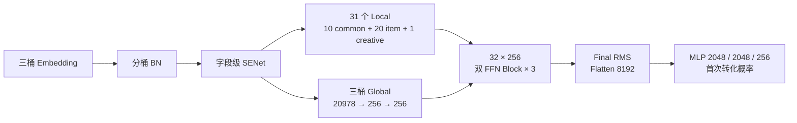
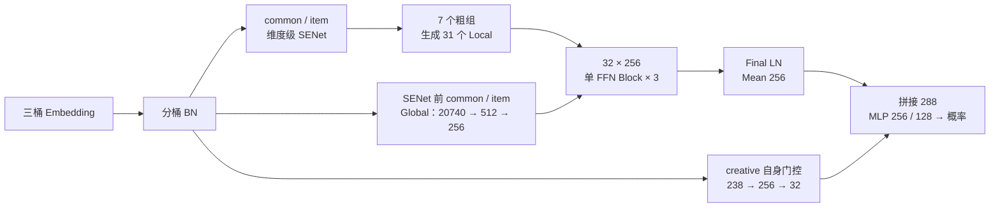
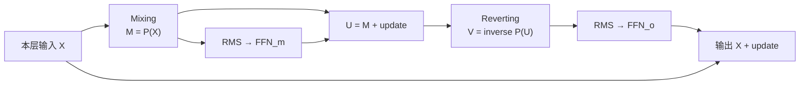
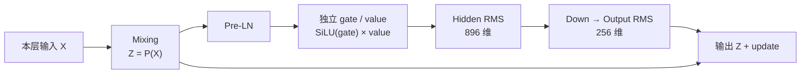

# RankMixer 补充文档：Small-3 与 mature_v1 的结构及公式对比

本文补充[《RankMixer 阶段算法技术工作汇报》](/Users/goku/Documents/Codex/RSA_code_0816/introduce/RankMixer_阶段算法技术工作汇报_完整版_2026-09-09.md)，比较当前源码与保存配置中的两个方案：

- **Small-3**：个人迭代方案 [cvr_bn_rankmixer_v6_e2_small_3.py](/Users/goku/Documents/Codex/RSA_code_0816/src/models/rankmixer/cvr_bn_rankmixer_v6_e2_small_3.py)，对应[运行配置](/Users/goku/Documents/Codex/RSA_code_0816/bash/set-rankmixer-v6-e2-small-3-args.txt:12)。
- **Mature-v1**：公司线上成熟架构的缩参适配版 [cvr_senet_mature_rankmixer_v1.py](/Users/goku/Documents/Codex/RSA_code_0816/src/models/rankmixer/cvr_senet_mature_rankmixer_v1.py)，对应[运行配置](/Users/goku/Documents/Codex/RSA_code_0816/bash/set-rankmixer-mature-3bucket-d256-args.txt:12)。其架构与效果作为公司方案参照，不计为个人原创成果。

结构与参数按当前代码核对；实验以 [RankMixer-汇总-0909.xlsx](/Users/goku/Documents/Codex/RSA_code_0816/docs/experiments/RankMixer-汇总-0909.xlsx) 为准。公式描述实际启用的前向路径，省略设备放置、日志及 batch 维；历史任务最终配置未完整留存，因此实验结果属于完整方案对照。

## 1. 核心区别与统一记号

两者均为 **32 个 Token、256 维、3 层**，但输入门控、Token 构造、单层交互次数、残差路径和读出方式均不同。Small-3 将更多参数分配给双阶段交互和完整展平后的预测头；Mature-v1 则将更多参数用于输入门控与 Token 投影，采用单阶段交互和较小的末端。

三层 Small-3 共包含 **6 个串行 SwiGLU 阶段**，三层 Mature-v1 包含 **3 个**，相同 Block 数不代表相同计算深度或容量。每套 SwiGLU 内的 up、gate、down 三次投影共同构成一个 FFN，不计为三个 FFN。

| 比较项 | Small-3 | Mature-v1 |
|---|---|---|
| 输入字段 | common / item / creative：385 / 835 / 14；每字段 17 维 | 相同字段集合与 Embedding 维度 |
| SENet | 字段级门控，17 维共享一个权重 | Embedding 坐标级门控 |
| 门控范围 | \(2\sigma(\cdot)\in(0,2)\) | \(\sigma(\cdot)\in(0,1)\) |
| Local Token | 31 个细分组分别生成一个 Token | 7 个粗组分别生成多个 Token，共 31 个 |
| creative | 进入 Local、Global 和交互主干 | 独立旁路，末端融合 |
| Global 来源 | 三桶 SENet 后表示 | common/item 的 BN 后、SENet 前表示 |
| 单层主干 | Mixing → FFN → Reverting → FFN | Mixing → FFN |
| FFN 中间宽度 | \(M=704\)，每层两套 | \(M=896\)，每层一套 |
| 主要 Norm | 逐 Token 独立缩放的 RMSNorm | 共享仿射参数的 LN，以及 FFN 内部 RMSNorm |
| 层输出残差基底 | 本层原始输入 \(X\) | 混合后输入 \(P(X)\) |
| 读出 | Final RMS → Flatten：8192 维 | Final LN → Mean：256 维，再拼接 creative 32 维 |
| 任务头 | \(8192\to2048\to2048\to256\to1\) | \(288\to256\to128\to1\) |

记 \(c,i,a\) 为各自入口 BN 后的三桶行向量。不同模型中的同名记号表示相同位置的变量，不表示其学习后的数值相同。

| 符号 | 含义 / 维度 |
|---|---|
| \(c,i,a\) | \(6545,\ 14195,\ 238\) 维；合计 20978 维 |
| \(\tilde c,\tilde i,\tilde a\) | 对应模型的 SENet 输出 |
| \(T,H,D,L\) | Token 数、混合分片数、Token 宽度、层数；均为 \(32,32,256,3\) |
| \(M\) | SwiGLU 隐层宽度，分别为 704 / 896 |
| \(P,P^{-1}\) | 固定 Mixing 及其逆置换 |
| \([u;v]\)、\(\odot\) | 特征拼接、逐元素乘法 |

### 整体信息流

## 2. SENet：字段级重加权与坐标级重加权

### 2.1 Small-3：以字段均值生成共享门控

把各桶 BN 输出还原为“字段 × 17 维”，记第 \(f\) 个字段为 \(E_{q,f}\in\mathbb R^{17}\)，其中 \(q\in\{c,i,a\}\)。先对字段内部取均值：

$$
s_{q,f}=\frac1{17}\sum_{j=1}^{17}E_{q,f,j}.
$$

三桶的门控条件分别为 \(z_c=s_c\)、\(z_i=[s_c;s_i]\)、\(z_a=[s_c;s_i;s_a]\)：

$$
g_q=2\sigma\!\left(
\tanh\!\left(\operatorname{BN}_{q,h}(z_qU_q)\right)V_q
\right),\qquad
\widetilde E_{q,f,j}=g_{q,f}E_{q,f,j}.
$$

| 门控对象 | 两次投影 | 门控输出数 |
|---|---|---:|
| common | \(385\to128\to385\) | 385 |
| item | \(1220\to128\to835\) | 835 |
| creative | \(1234\to128\to14\) | 14 |

六个投影矩阵无显式 bias，中间 BN 带可训练仿射参数。每个字段只有一个门值，统一缩放该字段的 17 个坐标；门值不做 Softmax，允许对字段抑制或放大。

“分层”指条件范围从 common 扩展到 common/item，再扩展到三桶。**三组条件均来自 SENet 前的字段均值，并非先将 common 门控结果传给 item。**

### 2.2 Mature-v1：以完整向量生成坐标门控

定义带瓶颈宽度 \(r\) 的门控函数：

$$
G(u,v;r)=v\odot\sigma\!\left(
\operatorname{ReLU}\!\left(\operatorname{BN}(uA+b_1)\right)B+b_2
\right).
$$

三桶分别为：

$$
\tilde c=G(c,c;256),\qquad
\tilde i=G([c;i],i;128),\qquad
\tilde a=G(a,a;128).
$$

| 门控对象 | 两次投影 | 门控输出数 |
|---|---|---:|
| common | \(6545\to256\to6545\) | 6545 |
| item | \(20740\to128\to14195\) | 14195 |
| creative | \(238\to128\to238\) | 238 |

该实现不先取字段均值，每个 Embedding 坐标都拥有独立的样本相关门值。creative 仅由自身生成门控；item 同样读取门控前的 common/item。

当前 sigmoid 配置中，第二次投影的权重与 bias 均初始化为零，因此初始门值为 **0.5**，不是恒等门控。其 \((0,1)\) 范围描述的是当前乘法位置的缩放，不能据此推断后续 BN/MLP 的整体幅度。

**结构含义：**Small-3 用较低成本选择字段，但在生成门控时压缩了字段内部信息；Mature-v1 保留坐标差异，门控更细，同时增加参数。SENet 参数分别为 0.522M 与 7.906M。FiBiNET 为字段重要性重加权提供了推荐场景依据，但不能证明本项目两种粒度中哪一种必然更优。[FiBiNET 原论文](https://arxiv.org/abs/1905.09433)

源码：[Small-3 SENet](/Users/goku/Documents/Codex/RSA_code_0816/src/models/rankmixer/cvr_bn_rankmixer_v6_e2_small_3.py:1427)、[Mature-v1 门控](/Users/goku/Documents/Codex/RSA_code_0816/src/models/rankmixer/cvr_senet_mature_rankmixer_v1.py:1435)及[三桶调用](/Users/goku/Documents/Codex/RSA_code_0816/src/models/rankmixer/cvr_senet_mature_rankmixer_v1.py:1723)。

## 3. Token 构造、Global 来源与 creative 路径

### 3.1 Local：一组一个 Token，与一组多个 Token

Small-3 对每个固定语义组 \(G_t\) 单独投影：

$$
\ell_t=
R_{\gamma_t}\!\left(
\operatorname{GELU}\!\left(
[\widetilde E_f]_{f\in G_t}W_t+b_t
\right)\right),\qquad
W_t\in\mathbb R^{17|G_t|\times256}.
$$

common 为 10 组，每组 38 或 39 个字段；item 为 20 组，每组 41 或 42 个；creative 为 1 组、14 个字段。相同输入宽度的组使用 batched GEMM，但各组权重仍独立。顺序为 **Linear → GELU → RMSNorm**。

Mature-v1 从七个粗组生成 31 个 Local：

$$
[\ell_{j,1};\ldots;\ell_{j,k_j}]
=\operatorname{BN}_j\!\left(
\operatorname{GELU}(\tilde x_jW_j+b_j)
\right),\qquad
W_j\in\mathbb R^{17n_j\times(k_j256)}.
$$

| 粗组 | 字段数 \(n_j\) | 输入宽度 | Token 数 \(k_j\) | 投影输出宽度 |
|---|---:|---:|---:|---:|
| user_v1 | 102 | 1734 | 3 | 768 |
| user_v2 | 149 | 2533 | 3 | 768 |
| user_v3 | 134 | 2278 | 4 | 1024 |
| item_v1 | 202 | 3434 | 5 | 1280 |
| item_v2 | 203 | 3451 | 5 | 1280 |
| item_v3 | 202 | 3434 | 5 | 1280 |
| item_v4_plus | 228 | 3876 | 6 | 1536 |
| 合计 | 1220 | 20740 | 31 | 7936 |

这里先做一次宽投影，再将输出解释成多个 Token。**同一粗组生成的每个 Token 都能读取该组全部字段**，并非先切成 \(k_j\) 份字段再分别投影。顺序为 **Linear → GELU → BN**，BN 作用于各粗组展开后的输出坐标。

因此，Small-3 在第一次投影时就限制各 Token 的输入范围；Mature-v1 允许同组多个 Token 从较宽输入中学习不同视角，代价是更大的 Local 投影矩阵。两者都使用独立投影参数，区别主要在输入覆盖范围。

### 3.2 Global：门控后汇总，与绕过门控的全局路径

Small-3 的 Global 为：

$$
g_S=R_{256}\!\left(
\operatorname{GELU}([\tilde c;\tilde i;\tilde a]W_{g1}+b_{g1})
W_{g2}+b_{g2}\right),
$$

对应 \(20978\to256\to256\)，第一层 GELU，第二层线性，末端 RMSNorm。

Mature-v1 的 Global 为：

$$
g_M=\operatorname{LN}_{256}\!\left(
\operatorname{GELU}\!\left(
\operatorname{LN}_{20740}([c;i])W_{g1}+b_{g1}\right)
W_{g2}+b_{g2}\right),
$$

对应 \(20740\to512\to256\)。入口 LN 对 common/item 拼接向量一起归一化，出口再做一次 LN。

Small-3 的 Local 与 Global 均经过同一套 SENet，且均包含 creative；Mature-v1 的 Global 直接读取入口 BN 输出，为 common/item 保留一条绕过 SENet 的路径。它仍经过 LN 和两次投影，不能称为“无损原始信息通路”。TokenMixer-Large 明确引入由全量输入生成的 Global Token，但是否在 SENet 前取值属于本项目具体设计。[TokenMixer-Large §3.2.2](https://arxiv.org/html/2602.06563v2#S3.SS2.SSS2)

### 3.3 creative：主干内交互，与末端条件融合

Small-3 的 creative 既生成一个 Local，也参与 Global，在三层主干中与其他信息交互。Mature-v1 将 creative 留在主干外，定义逐坐标可训练的 Swish：

$$
\operatorname{Swish}_{\beta}(x)=x\odot\sigma(\beta\odot x),
$$

$$
h_a=\operatorname{Swish}_{\beta_1}
\!\left(\operatorname{BN}(\tilde aW_{a1}+b_{a1})\right),\qquad
a_{\mathrm{out}}=\operatorname{Swish}_{\beta_2}
\!\left(\operatorname{BN}(h_aW_{a2}+b_{a2})\right).
$$

宽度为 \(238\to256\to32\)；\(\beta_1,\beta_2\) 分别有 256、32 个参数，均初始化为 1.702。该旁路只在末端与主干汇总拼接，随后仍可通过任务头产生非线性组合，并非完全不与 common/item 交互。

源码：[Small-3 Local/Global](/Users/goku/Documents/Codex/RSA_code_0816/src/models/rankmixer/cvr_bn_rankmixer_v6_e2_small_3.py:1558)、[Mature-v1 Local/Global/creative](/Users/goku/Documents/Codex/RSA_code_0816/src/models/rankmixer/cvr_senet_mature_rankmixer_v1.py:1481)。

## 4. 交互主干：同一个置换，两种更新方程

### 4.1 Mixing 完全相同

两者均执行：

$$
[B,32,256]\to[B,32,32,8]
\xrightarrow{\mathrm{transpose}(0,2,1,3)}
[B,32,32,8]\to[B,32,256].
$$

以 0 为起始下标，逐元素表达为：

$$
P(X)_{b,h,\,8t+r}=X_{b,t,\,8h+r},
\quad 0\le t,h<32,\quad0\le r<8.
$$

混合后的第 \(h\) 个位置，汇集所有原 Token 的第 \(h\) 个 8 维子块。它只有坐标置换，没有学习参数、加权求和或注意力分数。在当前 \(T=H\) 配置下，\(P^{-1}=P\)、\(P^2=I\)。

### 4.2 Small-3：两套独立 SwiGLU，最终加回原始输入

对单个位置的行向量 \(z\)，定义：

$$
F(z)=
\left[(zW_u+b_u)\odot\operatorname{SiLU}(zW_g+b_g)\right]
W_d+b_d,\qquad \operatorname{SiLU}(x)=x\odot\sigma(x).
$$

Small-3 中 \(W_u,W_g\in\mathbb R^{256\times704}\)，\(W_d\in\mathbb R^{704\times256}\)。每层、每位置及两套 FFN 之间均不共享权重。第 \(\ell\) 层严格为：

$$
\begin{aligned}
M_\ell&=P(X_\ell),\\
U_\ell&=M_\ell+F_{\ell,m}\!\left(R_{\ell,m}(M_\ell)\right),\\
V_\ell&=P^{-1}(U_\ell),\\
\boxed{X_{\ell+1}}&=\boxed{X_\ell+
F_{\ell,o}\!\left(R_{\ell,o}(V_\ell)\right)}.
\end{aligned}
$$

第一套 FFN 处理混合后的分片组合，第二套在恢复的坐标布局中生成更新。**最后加回的是 \(X_\ell\)，不是 \(V_\ell\)**。第一套 FFN 的更新影响第二套的输入，没有作为独立残差项直接叠加到最终输出。

### 4.3 Mature-v1：单套 SwiGLU，在 FFN 内控制尺度

第 \(\ell\) 层先令 \(Z_\ell=P(X_\ell)\)、\(Q_\ell=\operatorname{LN}(Z_\ell)\)，再对各位置独立计算：

$$
H_{\ell,t}=R_{896}\!\left[
\operatorname{SiLU}(Q_{\ell,t}W^g_{\ell,t}+b^g_{\ell,t})
\odot(Q_{\ell,t}W^v_{\ell,t}+b^v_{\ell,t})\right],
$$

$$
\boxed{X_{\ell+1,t}=Z_{\ell,t}
+R_{256}(H_{\ell,t}W^d_{\ell,t}+b^d_{\ell,t})}.
$$

其中上投影为 \(256\to896\)，下投影为 \(896\to256\)。门控乘积之后、down 输出之后各有一次 RMSNorm；最后加回 \(Z_\ell=P(X_\ell)\)，当前 residual scale 为 1。

Mature-v1 没有显式 Reverting，但下一层会再次 Mixing。尽管 \(P^2=I\)，两次置换之间有非线性变换和残差，**两层 Mature-v1 不等于一层 Small-3**。若将所有 FFN 更新置零，Small-3 的层映射为 \(X\)，Mature-v1 则为 \(P(X)\)。后者仍有残差路径，且置换保范数，不能据此断言其梯度会断裂。

### 4.4 与论文的对应关系

| 结构 | 单层更新要点 | 与本项目的关系 |
|---|---|---|
| 原始 RankMixer | \(S=\operatorname{LN}(P(X)+X)\)，\(X'=\operatorname{LN}(\operatorname{PFFN}(S)+S)\) | 一套 PFFN；不同于 Mature-v1 直接以 \(P(X)\) 为 FFN 残差基底，也不同于 Small-3 双 FFN |
| TokenMixer-Large | Mixing–Reverting 两阶段、Per-token SwiGLU、残差与归一化调整 | Small-3 的设计依据；不是 Small-3 首创双 FFN |
| Small-3 / Mature-v1 | 分别采用上文源码方程 | 都不能仅凭名称认定为原论文的逐项复现 |

依据：[RankMixer §3.1，公式（1）](https://arxiv.org/html/2507.15551v3#S3.SS1)、[TokenMixer-Large §3.3](https://arxiv.org/html/2602.06563v2#S3.SS3)。后者公式（12）、（16）写作 Post-Norm，而 §3.3.3 说明采用 Pre-Norm，图示也存在表达差异；本文仅借其设计思想解释，不用论文图替代实际代码方程。

源码：[Small-3 Mix/Block](/Users/goku/Documents/Codex/RSA_code_0816/src/models/rankmixer/cvr_bn_rankmixer_v6_e2_small_3.py:1712)、[Mature-v1 Mix/Block](/Users/goku/Documents/Codex/RSA_code_0816/src/models/rankmixer/cvr_senet_mature_rankmixer_v1.py:1290)。

## 5. 归一化、初始化与读出

### 5.1 Norm 的位置与参数共享同样重要

$$
R_{\gamma,\epsilon}(x)=
\gamma\odot\frac{x}{\sqrt{\operatorname{mean}(x^2)+\epsilon}},
\qquad
\operatorname{LN}_{\gamma,\beta,\epsilon}(x)=
\gamma\odot\frac{x-\mu}{\sqrt{\operatorname{mean}((x-\mu)^2)+\epsilon}}+\beta.
$$

两者都沿最后一个特征维度计算统计量，不在 Token 轴上求均值。Norm 参数在各层、各作用域之间独立：

| 位置 | Small-3 | Mature-v1 |
|---|---|---|
| Local 投影后 | RMS，\(\gamma:[31,256]\)，逐 Token 独立 | 各粗组独立 BN，输出坐标各有 gamma/beta |
| Global | 出口 RMS，\(\gamma:[256]\) | 入口 LN 20740 维，出口 LN 256 维 |
| FFN 前 | 每层两次 RMS，各 \(\gamma:[32,256]\) | 每层一次 LN，gamma/beta 各 \([256]\)，跨 Token 共享 |
| 门控乘积后 | 无额外 Norm | RMS，scale 为 \([1,1,896]\)，跨 Token/batch 共享 |
| down 输出后 | 无额外 Norm | RMS，scale 为 \([1,256]\)，跨 Token/batch 共享 |
| 最终读出前 | RMS，\(\gamma:[32,256]\) | LN，gamma/beta 各 \([256]\)，跨 Token 共享 |
| RMS/LN epsilon | RMS 为 \(10^{-6}\) | 自定义 RMS/LN 均为 \(10^{-8}\) |

Mature-v1 的 PFFN 权重逐 Token 独立，但其主干 LN/RMS 仿射参数共享。Small-3 则连主干 RMS 的缩放也逐 Token 独立。RMSNorm 原论文解释了不做中心化的归一化方式，但无法单独证明此处任一种位置或共享策略更适合 CVR。[RMSNorm 原论文](https://arxiv.org/abs/1910.07467)

### 5.2 down 初始化与输出 RMS 的耦合

Small-3 的 up/gate 使用标准差 \(1/\sqrt D\) 的正态初始化，down 使用标准差 \(0.01/\sqrt{704}\) 的正态初始化，bias 为零。由于 down 后没有 RMS，小幅 down 初始化可以直接减小初始残差更新。

Mature-v1 的 up/gate 使用经截断校正的 Glorot 尺度正态初始化，down 使用传入标准差 \(1/\sqrt{896}\) 的截断正态；随后立即进行输出 RMS。忽略 epsilon 且 \(\alpha>0\) 时：

$$
R(\alpha u)\approx R(u).
$$

因此，若仅把 Mature-v1 的 down 权重缩小，其效果可能被输出 RMS 的重缩放大幅抵消；不能直接移植 Small-3 的初始化系数，并预期相同的残差幅度。TokenMixer-Large 也讨论 down 小初始化与残差学习的关系，但本项目的 Norm 位置仍需单独考虑。[TokenMixer-Large §3.4.4](https://arxiv.org/html/2602.06563v2#S3.SS4.SSS4)

### 5.3 读出决定任务头能直接区分哪些位置

Small-3：

$$
h_S=\operatorname{vec}(R_{\mathrm{final}}(X_3))\in\mathbb R^{8192},
\qquad
\hat p_S=\sigma\!\left(
\operatorname{clip}(\operatorname{MLP}_{2048,2048,256,1}(h_S),-50,50)
\right).
$$

Mature-v1：

$$
h_M=\left[
\frac1{32}\sum_{t=1}^{32}\operatorname{LN}_{\mathrm{final}}(X_{3,t});
a_{\mathrm{out}}\right]\in\mathbb R^{288},
$$

$$
\hat p_M=\sigma\!\left(
\operatorname{clip}(\operatorname{MLP}_{256,128,1}(h_M),-50,50)
\right).
$$

两者隐藏层均为 Dense → BN → GELU，最终为线性输出；这里 GELU 均采用 tanh 近似。

对给定的最终张量 \(Z\)，Flatten 后首层可写为 \(\sum_t Z_tW_t+b\)，而 Mean 后首层为 \((\frac1T\sum_tZ_t)W+b\)。前者可为各位置学习不同投影，后者先汇总位置。该比较只描述读出接口；主干本来就可学习位置相关表示，不能推导为 Mature-v1 整网不区分 Token，也不能据此判定 Mean 必然较差。

源码：[Small-3 RMS/初始化](/Users/goku/Documents/Codex/RSA_code_0816/src/models/rankmixer/cvr_bn_rankmixer_v6_e2_small_3.py:1526)、[Small-3 预测头](/Users/goku/Documents/Codex/RSA_code_0816/src/models/rankmixer/cvr_bn_rankmixer_v6_e2_small_3.py:1872)、[Mature-v1 Norm](/Users/goku/Documents/Codex/RSA_code_0816/src/models/rankmixer/cvr_senet_mature_rankmixer_v1.py:1221)、[Mature-v1 预测头](/Users/goku/Documents/Codex/RSA_code_0816/src/models/rankmixer/cvr_senet_mature_rankmixer_v1.py:1579)。

## 6. 参数与计算量：差别主要在分配位置

Dense 参数包括权重、bias、Norm 仿射参数和可训练 Swish 参数，不含 Sparse、BN 移动统计及优化器状态。表中主干不含最后一次 Norm：

| 模块 | Small-3 参数量 | Mature-v1 参数量 |
|---|---:|---:|
| 三桶输入 BN | 41,956 | 41,956 |
| SENet，含内部 BN | 522,112 | 7,906,162 |
| Local 投影及 Norm | 5,386,240 | 24,795,392 |
| Global 投影及 Norm | 5,436,672 | 10,792,712 |
| 三个交互 Block | 104,177,664 | 66,261,888 |
| 最终 Norm | 8,192 | 512 |
| creative 独立旁路 | 0 | 70,272 |
| 任务头及输出 | 21,509,121 | 107,777 |
| **Dense 合计** | **137,081,957** | **109,976,671** |
| **单样本推理 FLOPs** | **约 0.274242G** | **约 0.220714G** |

以每层 FFN 为例，忽略 bias/Norm 后：

$$
P_{S,\mathrm{FFN}}=6TDM_S,\qquad
P_{M,\mathrm{FFN}}=3TDM_M,\qquad
\frac{P_{S,\mathrm{FFN}}}{P_{M,\mathrm{FFN}}}
=\frac{2\times704}{896}=\frac{11}{7}.
$$

计入 bias/Norm 后，每层分别为：

$$
P_{S,\mathrm{block}}=2T(3DM_S+2M_S+D)+2TD=34\,725\,888,
$$

$$
P_{M,\mathrm{block}}=T(3DM_M+2M_M+D)+(2D+M_M+D)=22\,087\,296.
$$

Small-3 的主干与任务头分别占总参数约 **76.00% / 15.69%**；Mature-v1 的输入 BN、SENet、Local 与 Global 合计约 **39.59%**。虽然 Small-3 总参数多约 **24.65%**，其输入变换实际上明显更小。这是“更多 FFN、更多总参数”不能直接解释模型效果的具体原因。

FLOPs 为从 Embedding 输出开始的静态推理估算：乘法、加法各计一次，计入 Norm、激活与残差，不含反向、优化器和数据搬运；非线性按统一标量算术口径计数，不代表硬件时延。Mature-v1 的源码参数、Excel 的 109M 备注及本次估算相符到备注精度。

参数公式来源：[Small-3 参数计数](/Users/goku/Documents/Codex/RSA_code_0816/src/models/rankmixer/cvr_bn_rankmixer_v6_e2_small_3.py:751)、[Mature-v1 参数分解](/Users/goku/Documents/Codex/RSA_code_0816/src/models/rankmixer/cvr_senet_mature_rankmixer_v1.py:520)。

## 7. 共同实验窗口与解释边界

两者均按首日 Dense 冷启动、Sparse 热启动，随后加载同版本前一天参数继续训练，并在次日评估。共同测试窗口如下，年份为 2026；“首日”对应冷启动训练后的评估。

| 测试日 | 阶段 | Base AUC | Small-3 AUC | Mature-v1 AUC | Mature − Small |
|---|---|---:|---:|---:|---:|
| 08-16 | 首日 | 0.866960 | 0.866559 | 0.866934 | +0.000375 |
| 08-17 | 续训 | 0.867867 | 0.867530 | 0.867801 | +0.000271 |
| 08-18 | 续训 | 0.868909 | 0.868650 | 0.868971 | +0.000321 |
| 08-19 | 续训 | 0.869868 | 0.869587 | 0.869982 | +0.000395 |
| 08-20 | 续训 | 0.869504 | 0.869335 | 0.869643 | +0.000308 |
| 五日等权均值 | — | 0.8686216 | 0.8683322 | 0.8686662 | **+0.000334** |

来源：[0909 工作簿](/Users/goku/Documents/Codex/RSA_code_0816/docs/experiments/RankMixer-汇总-0909.xlsx)，Sheet1：日期 A69:A73，Base B69:B73，Small-3 V69:V73，Mature-v1 D48:D52；两种方案 COPC 分别位于 W69:W73、E48:E52。

Mature-v1 在五日均领先，后续四个热启动测试日平均仍领先 **0.00032375**，因此差距不限于首日。共同末日，Small-3 距 Base 为 **−0.000169**，Mature-v1 相对 Base 为 **+0.000139**。这些是逐日方案比较，不能视为五次独立训练，也不能把绝对 AUC 随日期变化直接归因于收敛。

共同窗口中，Small-3 的 COPC 范围为 0.981053–1.017099，Mature-v1 为 0.963620–1.005859。AUC 领先不等于每个日期的校准表现都更好。

当前保存配置还存在训练差异：

| 项目 | Small-3 | Mature-v1 |
|---|---|---|
| 优化器 / 初始学习率 | Flood Adam / \(2\times10^{-5}\) | 相同 |
| batch / eval batch | 2048 / 2048 | 相同 |
| 学习率调度 | gauss_decay；warmup 60000，decay 40000 | 相同类型及步数 |
| 最低学习率比例 | 默认 0.1；当前 args 未覆盖 | args 明确 0.5 |
| 显式训练目标 | fst_CVR log loss | fst_CVR log loss |
| L2 使用 | 当前任务头未登记相同 L2 项 | 部分权重登记 L2，但本文件未将其汇入显式优化 loss |

Mature-v1 的 regularizer 注册不等于已加入训练目标；两者均对各自的 loss 求梯度。学习率下限及初始化不同，使现有结果不能解释为“只改变架构”的严格消融。以上是当前代码/配置事实，不替代历史训练任务的最终展开配置。

依据：[Small-3 调度默认值](/Users/goku/Documents/Codex/RSA_code_0816/src/models/rankmixer/cvr_bn_rankmixer_v6_e2_small_3.py:110)、[Mature-v1 实际 loss](/Users/goku/Documents/Codex/RSA_code_0816/src/models/rankmixer/cvr_senet_mature_rankmixer_v1.py:848)及[梯度目标](/Users/goku/Documents/Codex/RSA_code_0816/src/models/rankmixer/cvr_senet_mature_rankmixer_v1.py:907)。

## 8. 对后续实验的直接启示

在现有训练设置及共同五日窗口内，Mature-v1 完整方案取得了更高的 AUC；结合当前源码，其 Dense 参数和理论计算量也更低。由于结构、初始化与学习率配置同时存在差异，尚不能确定优势来自哪一部分。下一步应先统一学习率及恢复口径，再围绕接口做可解释的对照：

| 待回答的问题 | 建议控制方式 |
|---|---|
| Global 绕过 SENet 是否有价值？ | 固定三桶输入范围、Global 宽度与 Norm，仅替换门控前/后的来源；creative 是否参与另做一项 |
| 坐标级门控是否优于字段级门控？ | 固定桶依赖、门值范围和初始化，再比较门控粒度；记录或匹配新增参数 |
| 双 FFN 与单 FFN 如何取舍？ | 分开比较 FFN 数量、残差基底和 Norm 位置；匹配主干参数预算，不能一次替换整个 Mature Block 后单独归因 |
| 大任务头是否必要？ | 用“读出方式 × 任务头容量”的对照，区分位置保留与末端容量；保持最终 Norm 一致 |

Small-3 已有连续改善，适合作为个人主线的固定起点；Mature-v1 的价值在于提供一套不同的有效分配方式，帮助逐项判断参数应当用于更细的输入选择、更宽的投影，还是更多交互与更大的预测头。
