# RankMixer 搜索首次转化率模型阶段算法技术工作汇报

> 整理日期：2026-09-03  
> 任务：电商搜索排序首次转化率（fst_CVR）预估  
> 核心工作：cvr_bn_rankmixer_v1～v10 迭代、v6 系列消融，以及公司线上结构的小模型适配与 mature 系列实验  
> 数值依据：[RankMixer-汇总.xlsx](/Users/goku/Documents/Codex/RSA_code_0816/docs/RankMixer-汇总.xlsx)，Sheet1；实验背景：[background.md](/Users/goku/Documents/Codex/RSA_code_0816/docs/background.md)。

## 阅读导引

- [1. 阶段工作与主要成果](#sec-overview)
- [2. 任务、实验协议与数学记号](#sec-protocol)
- [3. 整体技术路线](#sec-roadmap)
- [4. cvr_bn_rankmixer_v1～v10 逐版迭代](#sec-iterations)
- [5. v6 系列细致消融](#sec-ablation)
- [6. 公司线上结构适配与 mature 系列](#sec-mature)
- [7. UniMixer 独立对照](#sec-unimixer)
- [8. 阶段认识与下一步收敛方向](#sec-findings)
- [附录 A：完整 AUC 记录](#appendix-auc)
- [附录 B：参数量与成本口径](#appendix-cost)
- [附录 C：记录差异与源码索引](#appendix-sources)

<a id="sec-overview"></a>

## 1. 阶段工作与主要成果

本阶段围绕一个核心问题展开：**在保持搜索场景输入特征、首次转化标签和训练数据一致的条件下，如何将 RankMixer 类交互结构适配到当前强基线，并逐步缩小离线 AUC 差距。**

研发过程采用“快速验证结构假设，再围绕有潜力的方案做细致消融”的方式推进。前期通过 v1～v4 修正特征组织与交互方式；中期通过 v5/v6 探索更强的交互主干、语义分组与容量取舍；随后通过 v7～v10 检查任务头、显式交叉和读出方式；最终围绕 v6 开展 E2、E3、Small、E4 消融。与此同时，以公司线上代码的小参数量适配版本 mature_v1 为另一条起点，验证成熟结构在当前三桶输入上的适用性。

### 1.1 可以直接汇报的阶段成果

| 工作成果 | 实验或实现依据 | 当前结论 |
|---|---|---|
| 完成从初始 RankMixer 到面向业务语义的输入组织 | v1 裸维度切分 → v2 完整字段切分 → v3 业务语义分组 | v3 相比 v2，在同一测试日提升 **3.01 bp**，参数量相同 |
| 完成双空间交互、Global Token 和增强读出的实现 | v5 引入 Mixing/Reverting、双 Per-token SwiGLU、Global/Pool/Flatten 三路读出 | 7 月前三个测试日，v5 相比 v3 平均提升 **6.38 bp**；对应全部四条表内记录的均值为 **+2.66 bp**，其中第四条待核对 |
| 找到适合继续消融的 v6 起点 | v5 的 D=1024 改为 D=512，同时恢复语义约束的均衡分组 | 参数从 **348.432M** 降到 **177.217M**；8 月首日相对 v5 提升 **18.54 bp** |
| 将 v10 的联合改动拆成可解释的验证链 | v6 → E2：增强读出改 PureFlat；E2 → E3：RMSNorm 改 LayerNorm | E2 相对 v6 连续三日提升 **5.45 / 4.00 / 4.44 bp**；E3 首日相比 E2 回退 **1.76 bp** |
| 完成宽度和业务分支的进一步取舍 | E2 → E2 Small：D 减半；Small → E4：common/item 主干、creative 旁路及小任务头 | Small 首日相比 E2 仅低 **0.52 bp**，当前代码参数减少 **48.66%**；E4 继续减参，但本次 AUC 回退 |
| 建立来自公司线上结构的高质量小模型对照 | mature_v1：D=256、3 层、成熟 SENet/pSwiGLU、均值池化与 creative 旁路 | 两个测试日相对 Base 分别低 **0.26 / 0.66 bp**，是表内最接近 Base 的候选 |

本文统一使用 **1 bp = 0.0001 AUC**。例如 `+0.000545 AUC = +5.45 bp`；这些数值是 AUC 的绝对差值，不是业务转化率的相对提升。

**结果的整体位置：**现有候选尚未在表中超过同日 Base。自研 BN 系列中，8 月首日最高的是 v8（0.866615）；v6_e2 的优势是已有连续三日相对 v6 的正向结果；mature_v1 则在已有两日中最接近 Base。选择 v6 做细致消融，是为保留一个结构清楚、有多日结果的研发起点，并不表示后续所有候选都弱于原始 v6。

### 1.2 这份汇报如何组织证据

版本的结构与公式依据当前保存的源码和参数文件；AUC 使用最新 Excel。各节“出发点”由已保存的设计说明、结构差异和已知建模问题归纳，用来解释改动所针对的问题。对于缺少单变量对照的修改，结论描述整套方案的效果，不把观察到的差值直接拆成某个模块的收益。

需要区分两个名称：表中的 **`rankmixer_v1` 是最早且未保存代码的方案**；**`bn_rankmixer_v1` 对应已保存的 `cvr_bn_rankmixer_v1.py`**。前者只复盘结果，不补写无法验证的内部结构。

<a id="sec-protocol"></a>

## 2. 任务、实验协议与数学记号

### 2.1 输入与目标

所有本报告中的结构比较都围绕同一组现有输入展开：

| 特征桶 | 字段数 | 单字段 Embedding 维度 | 拼接后宽度 | 主要信息 |
|---|---:|---:|---:|---|
| common | 385 | 17 | 6,545 | 用户、Query、会话、上下文等 |
| item | 835 | 17 | 14,195 | 商品、相关性、价格、偏好、统计、召回等 |
| creative | 14 | 17 | 238 | 展示、创意与促销表达 |
| 合计 | **1,234** | **17** | **20,978** | 三桶字段集合保持一致 |

输入表示为：

$$
E_c\in\mathbb R^{B\times385\times17},\qquad
E_i\in\mathbb R^{B\times835\times17},\qquad
E_a\in\mathbb R^{B\times14\times17}.
$$

输出是首次转化概率：

$$
\hat p_n=\sigma\!\left(\operatorname{clip}(f_\theta(E_n),-c,c)\right),
\qquad
\mathcal L_{\mathrm{BCE}}
=-\frac1B\sum_{n=1}^{B}
\left[y_n\log\hat p_n+(1-y_n)\log(1-\hat p_n)\right].
$$

主标签为 `fst_cvr_label`。报告中的结构没有以新增特征或新增辅助任务解释 AUC 差异；源码里注册的正则化项，也不额外写成一个未经核实的已启用训练目标。

### 2.2 两条独立实验链

| 实验链 | 起始训练日 | 首个测试日 | 启动与续训方式 |
|---|---|---|---|
| 7 月链 | 2026-07-01 | 2026-07-02 | 起始日 dense 冷启动、sparse 按公共方式热启动；后续沿同一模型逐日续训 |
| 8 月链 | 2026-08-15 | 2026-08-16 | 重新建立独立 dense 冷启动链；后续只加载同一模型前一天 checkpoint |

背景记录给出的规模约为每日 **5.5 亿训练样本、次日 1.1 亿测试样本**。设计继承某个旧版本，不意味着加载旧版本的 dense 参数。每个方案都应沿自己的实验链训练。

当前保存的主要运行参数包括：`batch_size=2048`、`epochs=1`、dense 优化器 `flood_adam`、dense learning rate `2e-5`、sparse learning rate `0.05`，以及相同的 `cvr_fea_v10_base_cold` 特征配置。参数文件用于解释当前实现；具体历史运行是否有平台侧覆盖，以对应任务记录为准。

**Excel 第一列明确是“测试数据日期”。**因此表中 `2026-08-16` 的结果，对应背景协议下 `2026-08-15` 训练后的次日测试。部分设计文件名包含 `20260814`，当前 args 中也保留了历史日期模板；这些标签不替代 Excel 中的实际测试日期。

同日差值定义为：

$$
\Delta_m(d)=\operatorname{AUC}_m(d)-\operatorname{AUC}_{\mathrm{Base}}(d),
\qquad
\Delta_m^{\mathrm{bp}}(d)=10^4\Delta_m(d).
$$

两个候选的平均差值只在共同测试日集合上计算：

$$
\overline{\Delta}_{a-b}
=\frac{1}{|\mathcal D_a\cap\mathcal D_b|}
\sum_{d\in\mathcal D_a\cap\mathcal D_b}
\left[\operatorname{AUC}_a(d)-\operatorname{AUC}_b(d)\right].
$$

例如 v6 有四天结果、E2 有三天结果，比较时使用前三个共同测试日，不能直接相减各自不同窗口的平均 AUC。

COPC 用于辅助观察整体概率尺度，代码中的定义为：

$$
\operatorname{COPC}=\frac{\sum_n\hat p_n}{\sum_n y_n+\epsilon}.
$$

COPC 接近 1 表示总预测量与总正例量接近，不能替代排序能力的 AUC，也不能说明所有子人群都已校准。

### 2.3 统一记号与基础算子

| 记号 | 含义 |
|---|---|
| $B,F,E$ | batch、字段数、字段 Embedding 维度；本任务 $F=1234,E=17$ |
| $T,D,H,L$ | token 数、token 宽度、重排的 head 数、交互 block 数 |
| $M$ | SwiGLU/SiLU 中间维度；需要与 $D$ 分开记录 |
| $G_t$ | 第 $t$ 个 token 的字段 ID 集合 |
| $\phi$ | 对应代码中的 GELU 类激活；具体路径使用 `gelu_2` 或 mature 实现的 `_gelu` |
| $P,P^{-1}$ | 无参数 Mixing 置换及其逆变换 |
| $\operatorname{LN},\operatorname{RMS}$ | LayerNorm 与 RMSNorm；具体参数共享方式在相关章节说明 |
| $\odot,[\cdot;\cdot]$ | 逐元素乘法与拼接 |

公式按单个样本表达时省略 batch 下标；`vec` 只展平该样本的字段或 token 维度，保留 batch 轴。$x[G_t]$ 表示取出该字段组对应的全部 Embedding 坐标。

当 $H=T$、$d_h=D/T$ 时，无参数 Mixing 可写为：

$$
P(X)_{b,h,t d_h+r}=X_{b,t,h d_h+r},
\quad 0\le t,h<T,\;0\le r<d_h.
$$

它对应 `reshape → transpose → reshape`，将来自不同 token 的 channel 分块重新组织。该算子没有注意力的 QK 相似度计算，也没有可训练矩阵；后续的 Per-token FFN 才对重排后的信息进行可学习变换。原始 RankMixer 将这种 Mixing 与独立的 Per-token FFN 结合，是本阶段探索的基础。[RankMixer 论文，§3](https://arxiv.org/html/2507.15551v1#S3)

常用归一化为：

$$
\operatorname{RMS}(x)=\gamma\odot
\frac{x}{\sqrt{D^{-1}\sum_jx_j^2+\epsilon}},
\qquad
\operatorname{LN}(x)=\gamma\odot
\frac{x-\mu(x)}{\sqrt{\operatorname{Var}(x)+\epsilon}}+\beta.
$$

RMSNorm 不减去均值，但仍对整体范数做归一化，因此不能把它描述为“保留全部绝对幅度”。

<a id="sec-roadmap"></a>

## 3. 整体技术路线

### 3.1 自研 BN 系列：按问题逐步推进

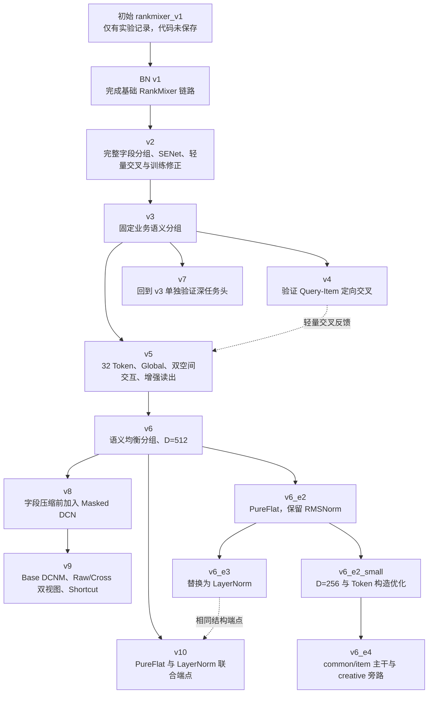

图中的实线表示设计关系，不表示跨版本加载权重，也不等于严格的运行先后时间。特别是 **v7 来源于 v3，v10 来源于 v6**；把编号简单写成十次连续替换，会掩盖这些有目的的回溯实验。

### 3.2 线上结构适配线

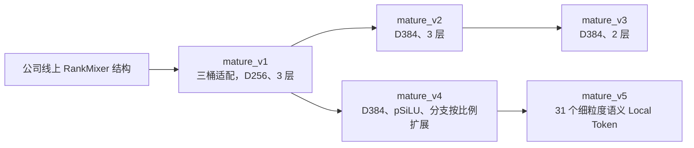

这条线的出发点是复用公司线上方案中的整体建模经验，在现有任务上形成可以比较的小模型。mature_v2/v3 已有代码和参数文件，当前汇总表尚未记录对应 AUC。

### 3.3 强基线提供了哪些结构参照

Base 的实际主路径为：

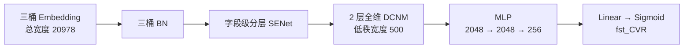

其关键参照包括字段重要性门控、压缩前的全维乘性交叉，以及深任务头。令 $x_0$ 为 BN/SENet 后的 20,978 维向量，当前默认无 cross 激活且开启 LN 的 DCNM 可写为：

$$
z_{\ell+1}=\operatorname{LN}\!\left(
z_\ell+x_0\odot\left[(z_\ell V_\ell+b_{\ell,1})U_\ell+b_{\ell,2}\right]
\right),\quad z_0=x_0,
$$

$$
V_\ell\in\mathbb R^{20978\times500},\qquad
U_\ell\in\mathbb R^{500\times20978},\quad \ell=0,1.
$$

Base 参数约 **90.342M**。它的领先是整体结构的实验结果；本阶段通过不同版本逐步检查其中哪些设计值得借鉴，而不是预先假定某个模块必然带来增益。

<a id="sec-iterations"></a>

## 4. cvr_bn_rankmixer_v1～v10 逐版迭代

### 4.1 v1：建立 RankMixer 基础链路，暴露输入组织问题

**设计出发点。**先把现有三桶特征接入 RankMixer，验证无参数 token 交互与独立 FFN 能否承担原有 dense 主塔的建模任务。该阶段的重点是完成可运行的架构基线，以便观察后续应该修改输入、交互还是输出。

对应源码：[cvr_bn_rankmixer_v1.py](/Users/goku/Documents/Codex/RSA_code_0816/src/models/rankmixer/cvr_bn_rankmixer_v1.py:774)。核心配置为 $T=H=16,D=768,L=2,k=4$，末端使用均值池化和线性预测。

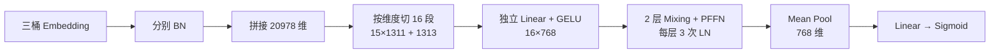

输入 token 为：

$$
s_t=\operatorname{Slice}_t([\operatorname{vec}(\operatorname{BN}(E_c));\operatorname{vec}(\operatorname{BN}(E_i));\operatorname{vec}(\operatorname{BN}(E_a))]),
\qquad x_t=\phi(s_tW_t+b_t).
$$

实际代码中的投影带 **bias 和 GELU 类激活**；文件内个别旧注释写着“无 bias”，报告采用函数实现的真实行为。

Per-token FFN 和 block 为：

$$
F_t(u)=\phi(uW_{t,1}+b_{t,1})W_{t,2}+b_{t,2},
\quad W_{t,1}\in\mathbb R^{768\times3072},
$$

$$
S=\operatorname{LN}_1(X+P(X)),\qquad
X'=\operatorname{LN}_3\left(S+F(\operatorname{LN}_2(S))\right).
$$

**由实现暴露的具体问题。**总宽度除以 16 得到 1,311，但 $1311\bmod17=2$，15 个内部切点都落在字段 Embedding 内部；部分 token 还跨越 common/item、item/creative 的桶边界。这样，独立 FFN 所面对的子空间缺少清楚的字段语义。与此同时，v1 没有 Base 的 SENet 和显式交叉，PFFN 的 $k=4$ 又使模型达到 **167.293M** 参数。

这些问题给 v2 提供了可操作的修改依据：先修正字段边界和输入选择，再控制容量并补回基础交叉能力。

**实验反馈。**7 月首日，初始未存代码方案为 0.858606，BN v1 为 0.862033，差值为 **+34.27 bp**。由于前者代码缺失，这个提升只能归属于两个完整方案之间的差异。BN v1 的四个测试日平均落后 Base **26.66 bp**，说明后续仍有明显改进空间。

### 4.2 v2：先修复字段边界，再补齐基础归纳偏置

**设计出发点。**v1 的低效之处具有具体结构原因：完整字段被切开、不同桶混入同一个 token、字段重要性没有显式选择，且较大 FFN 与短周期实验的训练预算不匹配。v2 围绕这些问题做组合式修正。

对应源码：[cvr_bn_rankmixer_v2.py](/Users/goku/Documents/Codex/RSA_code_0816/src/models/rankmixer/cvr_bn_rankmixer_v2.py:872)。

| 修改 | 所针对的问题 |
|---|---|
| 按完整字段分组，common/item/creative 分配 5/10/1 个 token | 避免破坏 17 维字段结构，为小规模 creative 保留独立输入位置 |
| 恢复字段级分层 SENet | 在进入投影前学习样本相关的字段重要性 |
| FFN 扩展率 $k:4\to2$ | 降低主体容量，接近 Base 的参数量级 |
| 每层恢复两次 Add&Norm | 去除 v1 额外的 FFN 前归一化 |
| 独立 FFN 改为 batched matmul | 保留 token 专属参数，同时减少逐 token 的算子组织开销 |
| Gated Pool 与 Bucket Cross | 分别补充动态信息汇聚和三桶显式乘性交互 |
| checkpoint 恢复后重置学习率 milestone | 使新一轮学习率调度相对正确的起点展开 |

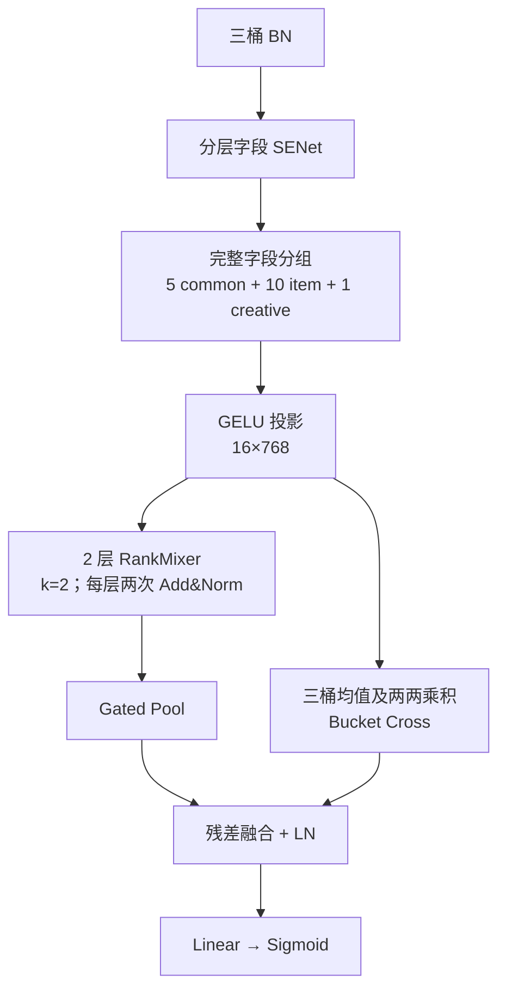

字段级 SENet 先对每个字段的 17 维取均值。以 item 为例：

$$
s_{b,j}=\frac1{17}\sum_{r=1}^{17}E_{b,j,r},\qquad
g_i=2\sigma\left(\tanh\left(\operatorname{BN}([s_c;s_i]A_i)\right)B_i\right),
$$

$$
\widetilde E_{i,j,:}=g_{i,j}E_{i,j,:}.
$$

common 门控只看 common，item 门控看 common+item，creative 门控看三桶。每个 gate 对对应字段的整条 Embedding 统一缩放。

v2 的 block 为：

$$
S=\operatorname{LN}(X+P(X)),\qquad
X'=\operatorname{LN}(S+F(S)),\qquad k=2.
$$

令最终 token 为 $h_t$，池化权重与结果为：

$$
\alpha_t=\operatorname{softmax}_t(w^\top h_t),\qquad
p=\sum_t\alpha_th_t.
$$

分数向量 $w$ 零初始化，使起始池化等价于均值池化。Bucket Cross 从 **Mixer 之前**的 token 按桶取均值，记为 $c,i,a$：

$$
r=\sigma(\eta)\operatorname{LN}
\left(\phi([c;i;a;c\odot i;c\odot a;i\odot a]W+b)\right),
\quad\eta_0=-2,
$$

$$
h=\operatorname{LN}(p+r),\qquad\hat p=\sigma(w_o^\top h+b_o).
$$

**实验反馈。**首日 AUC 从 0.862033 提升到 **0.862690**，增加 **6.57 bp**；相对 Base 的差距由 25.05 bp 缩小到 18.48 bp。参数下降到 **95.809M**。这是整套修正的净效果，无法拆出 SENet、LR reset、字段切分或 Bucket Cross 各自的贡献。仓库中的 `v1_lrfix` 可以作为工程对照实现，但汇总表没有其独立结果。

### 4.3 v3：从“字段完整”进一步走向“业务语义完整”

**设计出发点。**v2 保住了字段边界，但仍按字段排列顺序连续均分。相邻字段未必属于相同业务主题，同一语义域也可能被切到多个 token。对于每个 token 都有独立参数的主干，稳定且清楚的业务子空间更有利于明确其学习对象。

对应源码：[cvr_bn_rankmixer_v3.py](/Users/goku/Documents/Codex/RSA_code_0816/src/models/rankmixer/cvr_bn_rankmixer_v3.py:282)。v3 保留 v2 的 SENet、主干、池化、Bucket Cross 和输出头，将字段 ID 按业务含义固定映射到 16 个组。

| 桶 | v2 字段数划分 | v3 字段数划分 | v3 语义组织 |
|---|---|---|---|
| common | 77/77/77/77/77 | 16/90/92/85/102 | 画像设备、购买价值、长期兴趣、Query 意图召回、实时会话漏斗 |
| item | 5×84 + 5×83 | 98/71/58/60/126/73/46/134/33/136 | 身份质量、文本相关性、多模态、价格供给、价格偏好、全局统计、正向偏好、曝光互动、会话、召回图关系 |
| creative | 14 | 14 | 展示与促销表达 |

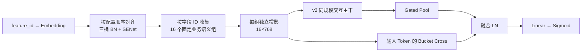

数学上，将位置切片换成语义集合上的映射：

$$
x_t=\phi\left(\operatorname{Concat}_{j\in G_t}\widetilde E_j\,W_t+b_t\right),
\qquad
G_t\cap G_s=\varnothing\;(t\ne s),\qquad
\bigcup_tG_t=\mathcal F.
$$

分组同时满足桶归属、字段完整覆盖和无重复约束。源码新增字段 ID 映射和完整性检查，使 token 的身份不再依赖 lookup 返回顺序。

**实验反馈。**同一测试日，v3 的 AUC 为 **0.862991**，相对 v2 增加 **3.01 bp**；两者参数同为 **95.809M**。这是本阶段较清楚的语义分组正向证据。v3 在最新表中已有七个测试日，平均落后 Base **12.10 bp**，其中最后三日差距为 **11.28 / 11.37 / 10.87 bp**。改善后仍存在差距，因此后续继续检查交互能力与读出能力。

### 4.4 v4：验证搜索场景的 Query–Item 定向交叉

**设计出发点。**v3 已经形成有明确含义的 Query token、商品文本 token 和商品身份质量 token。搜索排序中的相关性依赖当前 Query 与候选商品之间的条件关系，因此可以在这些语义明确的位置上增加有方向的交互，检验固定重排以外的搜索先验是否能进一步改善效果。

对应源码：[QICross-Lite 实现](/Users/goku/Documents/Codex/RSA_code_0816/src/models/rankmixer/cvr_bn_rankmixer_v4.py:1511)。该分支从 **输入 token** 读取 `common_query_intent_retrieval`，分别指向 `item_text_relevance` 与 `item_static_identity_quality`，避免在重排后继续把固定位置当作原始 Query 或商品语义。

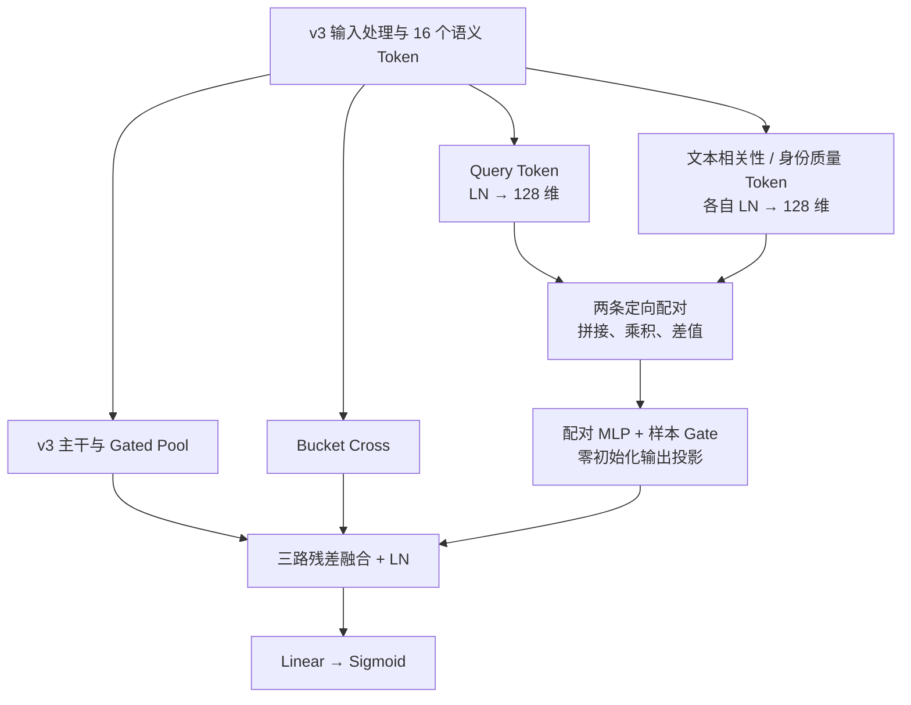

对一个目标 item token，先做低维投影：

$$
q=\operatorname{LN}(x_q)W_q+b_q\in\mathbb R^{128},\qquad
i=\operatorname{LN}(x_i)W_i+b_i\in\mathbb R^{128}.
$$

构造配对表示与样本门控：

$$
z=\phi\left([q;i;q\odot i;q-i]W_h+b_h\right),
\qquad
g=\sigma\left([q;i;q\odot i]w_g+b_g\right),
$$

$$
r_{q\to i}=g\,(zW_o+b_o),\qquad
r_{QI}=r_{q\to\mathrm{text}}+r_{q\to\mathrm{identity}}.
$$

$W_o,b_o$ 零初始化，保证附加分支在初始化时输出为零；在相同主干参数下，它不会立即扰动原有输出。这是初始化设计，并不意味着实际实验从 v3 的 dense checkpoint 热启动。零输出投影也意味着新分支内部部分参数在第一步的梯度会受限，但是否构成实际训练瓶颈，需要训练日志验证。

**实验反馈。**v4 首日 AUC **0.862709**，相对 v3 下降 **2.82 bp**，增加约 **0.630M** 参数。这个结果说明当前低秩定向残差分支没有形成净收益。其输入已经经过 token 压缩，交叉范围也只涉及两个目标；后续 v8/v9 转向“压缩之前、完整字段空间中的交叉”，因此具有新的问题依据。

### 4.5 v5：同时增强交互主干、全局信息与输出表达

**设计出发点。**v3 的多日结果仍有差距，v4 的小分支也没有补齐。接下来需要检查更完整的结构：局部 token 是否不足以传递全局信息，固定重排后的残差是否对齐，池化与线性头是否过早压缩了表达，以及更强的主干容量是否有效。

v5 是一次组合式扩展，参考了后续 TokenMixer-Large 对 Mixing/Reverting 和层间残差的设计思路；实际实现只采用当前代码中明确存在的 dense 路径，没有把论文中的 MoE、辅助监督或线上收益写成本项目成果。[TokenMixer-Large 论文](https://arxiv.org/abs/2602.06563)

对应源码：[v5 TokenMixer block](/Users/goku/Documents/Codex/RSA_code_0816/src/models/rankmixer/cvr_bn_rankmixer_v5.py:1599)、[v5 读出与任务头](/Users/goku/Documents/Codex/RSA_code_0816/src/models/rankmixer/cvr_bn_rankmixer_v5.py:1648)。

| 修改 | 建模出发点 |
|---|---|
| 16 个 token 改成 31 Local + 1 Global | 增加局部表达槽位，同时建立直接读取全部输入的全局路径 |
| Local 采用固定、均衡的字段分组 | 控制每个投影的输入规模，使同宽分组能够批量执行 |
| D=1024、两层双空间 Per-token SwiGLU | 检查更强主干与门控非线性带来的表达能力 |
| Mixing 后变换，再 Reverting | 将 mixed-space 更新映射回原始 token/channel 布局 |
| PreNorm、跨 block 长残差、小幅度输出初始化 | 为较大主干保留稳定的输入直通路径 |
| Global + 条件 Pool + 压缩 Flatten | 同时保留全局表示、样本相关汇聚和 token 位置相关信息 |
| 深任务头 `[2048,2048,256]` | 增加面向 CVR 目标的最终非线性映射 |

**v5 的 Local 分组需要准确命名：**代码中的字段成员是用固定 salt 离线生成并冻结的均衡分组，运行时不再重新哈希；这些组并非 v3 那种以业务主题命名的语义分组。common 为 `5×39+5×38`，item 为 `15×42+5×41`，creative 为 `14`，共 31 个 Local token。

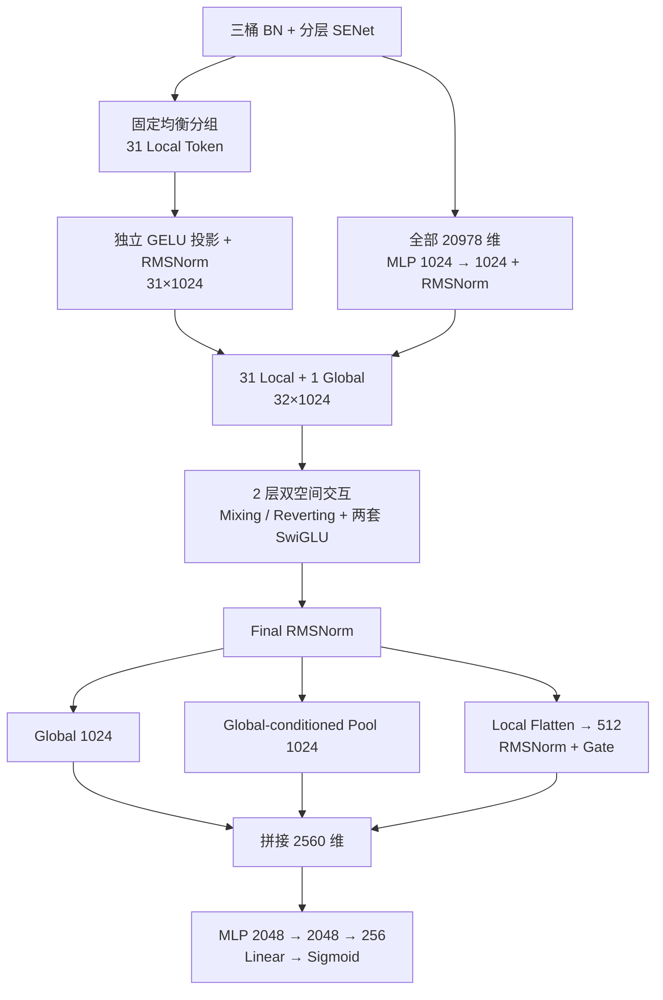

**关键数学一：Global Token。**令 $x_0$ 为 BN/SENet 后的三桶拼接：

$$
g_0=\operatorname{RMS}\left(\phi(x_0W_{g1}+b_{g1})W_{g2}+b_{g2}\right),
\qquad X_0=[x_1;\ldots;x_{31};g_0].
$$

**关键数学二：双空间交互。**每个 token 使用独立参数的 SwiGLU：

$$
F_t(u)=\left[(uW_{t,u}+b_{t,u})\odot
\operatorname{SiLU}(uW_{t,g}+b_{t,g})\right]W_{t,d}+b_{t,d},
\quad\operatorname{SiLU}(z)=z\sigma(z).
$$

v5/v6 的一个 block 精确写为：

$$
Y=P(X),\qquad
\widetilde Y=Y+F_{\mathrm{mixed}}(\operatorname{RMS}_{\mathrm{mixed}}(Y)),
$$

$$
Z=P^{-1}(\widetilde Y),\qquad
\boxed{X'=X+F_{\mathrm{original}}(\operatorname{RMS}_{\mathrm{original}}(Z))}.
$$

最终长残差连接的是 **block 输入 $X$**。$Z$ 负责为 original-space FFN 提供条件，不直接替换最后加法中的残差输入。

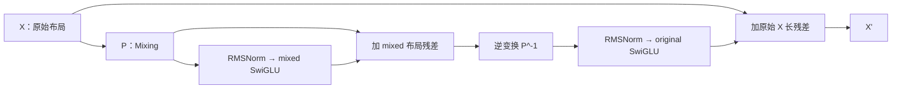

两个 SwiGLU 的参数独立。下投影标准差采用 $0.01/\sqrt M$，使初期残差更新幅度较小；这是小随机初始化，不是把整个新增主干置零。

**关键数学三：三路增强读出。**设最终 Global 为 $g$、Local 为 $h_1,\ldots,h_{31}$，$Q=128$：

$$
q=gW_q+b_q,\qquad k_t=h_tW_k+b_k,\qquad
\alpha_t=\operatorname{softmax}_t\left(\frac{q^\top k_t}{\sqrt Q}\right),
\qquad p=\sum_{t=1}^{31}\alpha_th_t,
$$

$$
f=\sigma(\eta)\operatorname{RMS}\left(\phi(\operatorname{vec}(H_{\mathrm{local}})W_f+b_f)\right),
\qquad h=[g;p;f]\in\mathbb R^{2560}.
$$

Global-conditioned Pool 的点积用于末端单 query 信息汇聚；主干 Mixing 仍然是无参数重排。

**实验反馈与取舍。**v5 在 7 月前三个测试日得到 **0.863747 / 0.864929 / 0.866454**，相对 v3 分别提升 **7.56 / 6.05 / 5.52 bp**，平均 **6.38 bp**；相对 Base 平均低 **7.00 bp**。这是该结构组合的改善，不能单独归因为 Global、SwiGLU、深头或某一路读出。

最新表还在 7 月 5 日登记了第四条 v5 结果 **0.864163**。该条 AUC 和 COPC 与 8 月首日记录完全相同，已列为待核对项。若完全按四条表内记录计算，v5 平均落后 Base **10.13 bp**、相对 v3 平均提升 **2.66 bp**；报告同时给出这个完整窗口，避免只呈现较好的前三日。

容量方面，v5 为 **348.432M** 参数，其中四套 Per-token SwiGLU 相关 block 参数约 **277.266M**，占 **79.58%**。因此下一步有明确的优化方向：控制主干宽度，并把 v3 验证过的语义组织重新融入均衡 token 设计。

### 4.6 v6：用语义约束和宽度控制形成后续消融起点

**设计出发点。**v5 表明增强表示链路有潜力，但参数成本较高；v3 又提供了业务语义分组的正向证据。v6 将两项经验结合：保留 v5 的 Global、双空间交互和增强读出，改为语义约束下的均衡分组，并把宽度降到 512。这个动机来源于已有结构和成本问题；后续 8 月结果用于检验选择，不能倒写成设计时已经知道的结论。

对应源码：[v6 分组定义](/Users/goku/Documents/Codex/RSA_code_0816/src/models/rankmixer/cvr_bn_rankmixer_v6.py:346)、[v6 主干及读出](/Users/goku/Documents/Codex/RSA_code_0816/src/models/rankmixer/cvr_bn_rankmixer_v6.py:1649)。

| 对比项 | v5 | v6 |
|---|---|---|
| Local 分组原则 | 固定哈希均衡混合 | 业务语义约束下的固定均衡分组 |
| Local 配额及字段数 | 10 common + 20 item + 1 creative | 相同 |
| $T,H,L$ | 32、32、2 | 相同 |
| token 宽度 $D$ | 1024 | **512** |
| SwiGLU 中间维度 $M$ | 704 | **仍为 704** |
| Global/Pool/Flatten 输出 | 1024/1024/512 | 512/512/512 |
| 最终任务头输入 | 2560 | 1536 |
| Dense 参数 | 348.432M | **177.217M** |

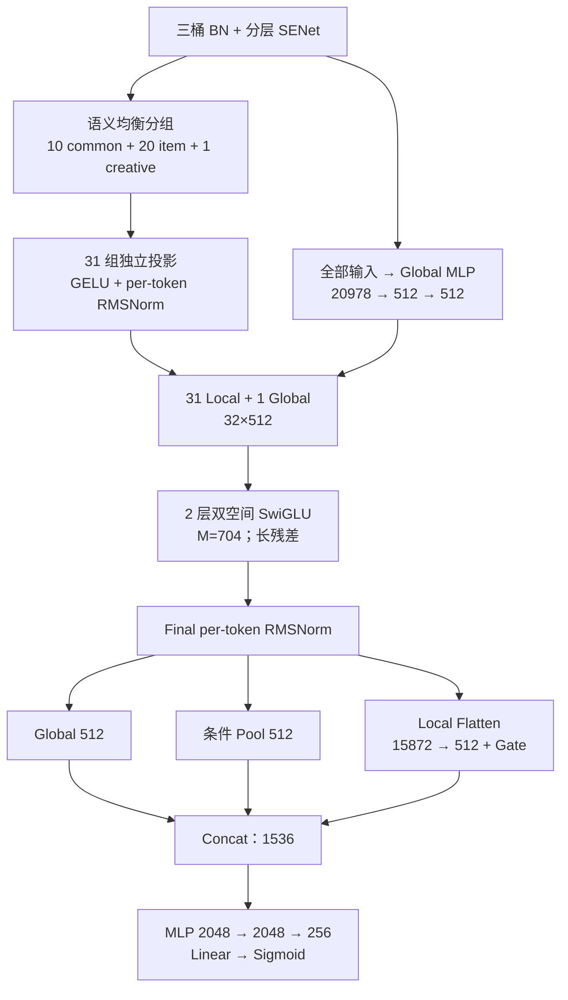

语义分组覆盖用户画像与生命周期、消费价值、长期兴趣、Query 意图与召回、实时会话，以及商品身份、相关性、多模态、价格与偏好、漏斗统计、召回图关系等主题。其约束为：

$$
|G_c|:\;5\times39+5\times38=385,\qquad
|G_i|:\;15\times42+5\times41=835,\qquad
|G_a|=14.
$$

这里组数与每组字段数仍和 v5 一致，改变的是组内字段成员及其语义。投影将同宽组放入同一个 family 批量计算，但权重形状仍为 $[N,I,D]$，各 token 并不共享投影参数。

v6 的双空间 block 仍使用上一节公式；不同之处是 $D=512$。主要 SwiGLU 矩阵参数近似为：

$$
P_{\mathrm{SwiGLU,matrices}}\approx
2L\cdot T\cdot3DM=6LTDM.
$$

本轮保持 $M=704$ 固定，因此这些主矩阵参数随 $D$ 近似线性减半；不能直接使用“所有参数按 $D^2$ 缩小到四分之一”的估计。实际总参数减少 **49.14%**。

**实验反馈。**在同一个 8 月首日测试集上，v6 为 **0.866017**，v5 为 **0.864163**，v6 提升 **18.54 bp**。这个结果支持“语义分组与宽度控制”组合在该轮更有效，但两项同时改变，无法分别定量归因。

| 测试日 | Base | v6 | v6 − Base |
|---|---:|---:|---:|
| 2026-08-16 | 0.866960 | 0.866017 | −9.43 bp |
| 2026-08-17 | 0.867867 | 0.867088 | −7.79 bp |
| 2026-08-18 | 0.868909 | 0.867996 | −9.13 bp |
| 2026-08-19 | 0.869868 | 0.868878 | −9.90 bp |
| 同日差值均值 | — | — | **−9.06 bp** |

**为什么选择 v6 继续做消融。**它保留了完整的可扩展主干，成本明显低于 v5，且已积累连续多日结果。围绕同一个起点改变读出、归一化、宽度或业务分支，比在每个新版本中同时重写所有模块更便于判断哪些部分值得保留。后面的 E2/E3 正是利用这个稳定起点拆解 v10 的联合改动。

### 4.7 v7：回到 v3，单独检查任务头是否限制表达

**设计出发点。**v5/v6 同时改了很多模块，其中一个明显变化是深任务头。为了检查这个因素，v7 回到较简单的 v3，保留其输入、16-token 主干、Gated Pool 和 Bucket Cross，只替换融合表示之后的预测网络。

对应源码：[v7 深任务头](/Users/goku/Documents/Codex/RSA_code_0816/src/models/rankmixer/cvr_bn_rankmixer_v7.py:1457)。

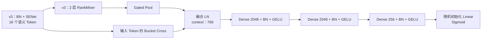

令 v3 的融合表示为 $h_0\in\mathbb R^{768}$，v7 的变化为：

$$
h_1=\phi(\operatorname{BN}(h_0W_1+b_1)),\quad
h_2=\phi(\operatorname{BN}(h_1W_2+b_2)),\quad
h_3=\phi(\operatorname{BN}(h_2W_3+b_3)),
$$

$$
(\dim h_1,\dim h_2,\dim h_3)=(2048,2048,256),\qquad
z=h_3w_o+b_o.
$$

当前 v7 使用单一深任务头，没有额外保留 v3 的线性 logit 捷径。最后一层采用正常随机初始化，使深层参数从训练开始就有梯度路径。参数从 **95.809M** 增加到 **102.113M**，增加 **6.304M**。

**实验反馈。**8 月首日 AUC 为 **0.865866**，相对同日 Base 低 **10.94 bp**。当前表中没有同一 8 月链的 v3 结果，所以只能评价这个候选的总体位置，**还不能从现有记录给出“深任务头相对 v3 增益多少”的数值**。7 月 v3 与 8 月 v7 的绝对 AUC 差值不能作为该消融的效果。

### 4.8 v8：把显式交叉移到语义压缩之前

**设计出发点。**v4 在已经压缩的少量语义 token 上做 Query–Item 交叉没有形成收益，而 Base 在完整 20,978 维字段空间进行显式交叉。由此提出新的假设：部分有效字段交互可能需要在 token 投影之前建立，再交给 Mixer 学习更高层组合。

v8 在 v6 的 BN/SENet 后插入两层 Masked Low-Rank DCN。Local token 读取交叉后视图，Global token 继续读取原始 BN/SENet 视图，以提供另一条信息路径。对应源码：[v8 Masked DCN](/Users/goku/Documents/Codex/RSA_code_0816/src/models/rankmixer/cvr_bn_rankmixer_v8.py:1564)。

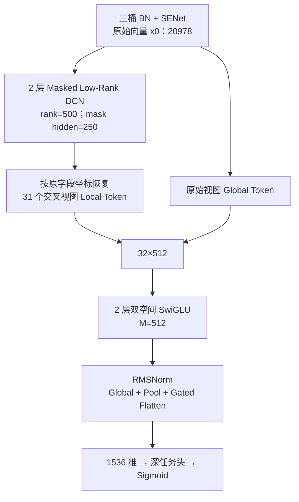

对第 $\ell$ 层输入 $x_\ell$，设低秩宽度 $r=500$、mask 隐层宽度 $s=250$：

$$
u_\ell=x_\ell V_\ell+b_{v,\ell},\qquad
m_\ell=\operatorname{ReLU}(x_\ell A_\ell+b_{a,\ell})B_\ell+b_{m,\ell},
$$

$$
x_{\ell+1}=\operatorname{LN}\left(
x_\ell+x_0\odot\left[(u_\ell\odot m_\ell)U_\ell+b_{u,\ell}\right]
\right).
$$

mask 的末层采用小随机权重、bias 初始化为 1，使低秩交叉的通道系数初始接近 1。这里的 mask 是**无 sigmoid 约束的线性输出**，可以为负，不应解释成 0～1 的特征保留概率。

为控制加入 DCN 后的预算，v8 同时把 SwiGLU 中间宽度 **$M:704\to512$**，总参数约 **192.243M**。因此实际实验处理是“加入 Masked DCN、调整 Local/Global 输入视图并缩小 FFN 中间宽度”的组合。

**实验反馈。**8 月首日 AUC **0.866615**，相比 v6 增加 **5.98 bp**，相对 Base 低 **3.45 bp**。它是当前表中自研 BN 系列在该测试日的最高值；比 E2 高 **0.53 bp**。单日结果支持继续关注这一候选，但无法把 +5.98 bp 全部分配给 Masked DCN。

### 4.9 v9：对齐 Base 的 DCNM，并保留 Raw/Cross 双视图

**设计出发点。**v8 仍采用新设计的 mask 交叉层。进一步的探索是回到已有强基线的两层 DCNM500，并同时保留原始字段视图与交叉视图，检查输入压缩和最终读出是否遗漏了 Base 中有用的信息。

当前实现是 **v9-Small**：使用 Base 同型 DCNM、Raw/Cross 双视图 Local token、Cross Global token，以及直接进入任务头的 DCNM Shortcut。对应源码：[v9 DCNM](/Users/goku/Documents/Codex/RSA_code_0816/src/models/rankmixer/cvr_bn_rankmixer_v9.py:1628)、[双视图 token](/Users/goku/Documents/Codex/RSA_code_0816/src/models/rankmixer/cvr_bn_rankmixer_v9.py:1755)。

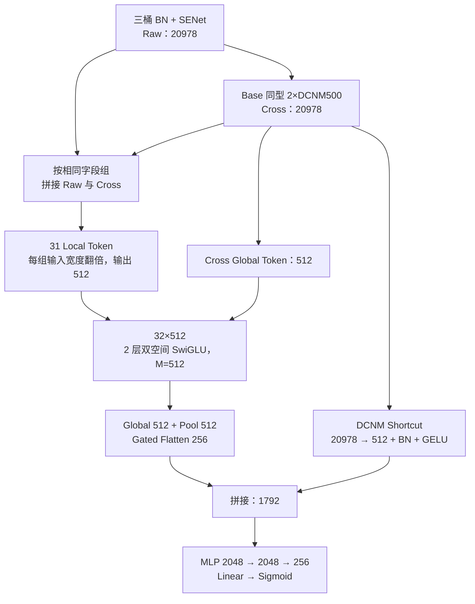

令 $x_0$ 为 Raw，$x_2=\operatorname{DCNM}_2(x_0)$ 为 Cross。第 $t$ 个 Local token 为：

$$
l_t=\operatorname{RMS}_t\left(
\phi\left([x_0[G_t];x_2[G_t]]W_t+b_t\right)
\right).
$$

Global 与 Shortcut 分别为：

$$
g_0=\operatorname{GlobalMLP}(x_2),\qquad
s=\phi(\operatorname{BN}(x_2W_s+b_s))\in\mathbb R^{512}.
$$

末端形成：

$$
h=[g_{\mathrm{final}};p_{\mathrm{pool}};f_{\mathrm{flat},256};s]
\in\mathbb R^{512+512+256+512}=\mathbb R^{1792}.
$$

该方案保留的是 Base 的 DCNM 结构和直接信息路径，整体末端仍是新模型；不能据此假定它自动继承 Base 的 AUC 下限。当前总参数 **199.446M**。

**实验反馈。**8 月首日 AUC 为 **0.865254**，低于 v8 **13.61 bp**，相对 Base 低 **17.06 bp**。这表明“更贴近 Base 的交叉层 + 双视图 + Shortcut”这一组合没有在本次实验中胜出。v9 同时改变交叉形式、Global 来源、Local 投影输入、Flatten 宽度和读出结构，尚不足以判断其中哪一项造成回退。这个结果进一步说明了围绕既有主干进行拆分验证的必要性。

### 4.10 v10：检查增强读出和归一化是否构成瓶颈

**设计出发点。**v6 虽然同时使用 Global、条件 Pool 和压缩 Flatten，但 Local 信息经过了汇聚或降维；对应任务头无法直接访问完整 token 表示。v10 检查更直接的接口：把全部 32 个 token 展平后交给 MLP，并将主干的归一化改成 LayerNorm。

对应源码：[v10 LayerNorm](/Users/goku/Documents/Codex/RSA_code_0816/src/models/rankmixer/cvr_bn_rankmixer_v10.py:1510)、[v10 block](/Users/goku/Documents/Codex/RSA_code_0816/src/models/rankmixer/cvr_bn_rankmixer_v10.py:1772)。

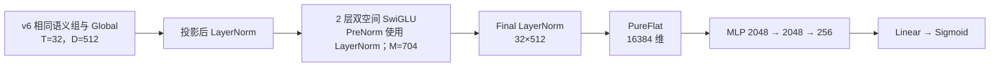

block 改为：

$$
Z=P^{-1}\left(P(X)+F_m(\operatorname{LN}(P(X)))\right),\qquad
X'=X+F_o(\operatorname{LN}(Z)).
$$

读出改为：

$$
h_{\mathrm{v10}}=\operatorname{vec}\left(\operatorname{LN}(X_L)\right)
\in\mathbb R^{32\times512} = \mathbb R^{16384},
\qquad
z=\operatorname{MLP}_{16384\to2048\to2048\to256\to1}(h_{\mathrm{v10}}).
$$

这里的 PureFlat 包含 **31 个 Local 和 1 个 Global**。它与 v6 中“只将 31 个 Local 展平，再压缩到 512 维并乘 gate”的路线不同。删除增强读出后，第一层任务头反而变大，因此参数从 v6 的 177.217M 增至 **199.276M**。

**如何评价 v10。**当前 Excel 没有独立命名为 `bn_rankmixer_v10` 的结果列。经当前代码核对，**v6_e3 与 v10 具有相同的语义分组、T/D/L/M、全链路 LayerNorm 和 PureFlat 结构端点**；E3 保留部分 v6 命名以便控制消融差异。表中的 **0.866386** 应记为 E3 的实测结果，可用于评价该结构端点，不能重复登记成另一次 v10 实验。

直接比较 v6 与 v10 会同时改变读出和归一化，难以解释效果。因此进一步建立 **v6 → E2 → E3**，分别检验完整读出替换和具体 Norm 实现替换。这是本阶段从快速结构探索进入细致消融的关键转折。

### 4.11 主线结果一览

下表两列 AUC 属于各自独立实验链，只在同一列内进行同日比较。

| 版本 | $T/D/L$ | 关键变化 | 07-02 测试 AUC | 08-16 测试 AUC |
|---|---|---|---:|---:|
| Base | — | BN + SENet + DCNM + MLP | 0.864538 | 0.866960 |
| 初始 rankmixer_v1 | 未知 | 代码未保存 | 0.858606 | — |
| BN v1 | 16/768/2 | 裸维度 token、PFFN、均值池化 | 0.862033 | — |
| v2 | 16/768/2 | 字段安全与组合修正 | 0.862690 | — |
| v3 | 16/768/2 | 业务语义分组 | 0.862991 | — |
| v4 | 16/768/2 | QICross-Lite | 0.862709 | — |
| v5 | 32/1024/2 | Global、双空间交互、增强读出 | 0.863747 | 0.864163 |
| v6 | 32/512/2 | 语义均衡与宽度控制 | — | 0.866017 |
| v7 | 16/768/2 | v3 主干 + 深头 | — | 0.865866 |
| v8 | 32/512/2 | 前置 Masked DCN | — | **0.866615** |
| v9 | 32/512/2 | DCNM、双视图、Shortcut | — | 0.865254 |
| v10 | 32/512/2 | LayerNorm + PureFlat | — | 无独立列；E3 结构端点见第 5 节 |

来源：Sheet1!B26:W26、B4:AJ4。空白表示该窗口无记录。


图中每个点均减去同一天的 Base；v5 的 07-05 记录以空心点和虚线标明待核对。纵轴单位为 AUC bp。完整数值见附录 A。

<a id="sec-ablation"></a>

## 5. v6 系列细致消融

### 5.1 消融矩阵与控制变量

细致消融围绕四个问题展开：**读出是否过早压缩信息、Norm 实现是否合适、主干宽度能否缩小、creative 是否需要参与主干交互。**

| 方案 | 对照来源 | 主要改变 | 保持的关键部分 | 参数量 |
|---|---|---|---|---:|
| v6 | 主线起点 | 增强读出 | 31+1 token、D512、L2、M704、RMSNorm | 177.217M |
| E2 | v6 | 整体读出改为 PureFlat | 分组、主干、Norm、任务塔隐藏层宽度 | 199.367M |
| E3 | E2 | 全链路 RMSNorm 改为当前 LayerNorm 实现 | 分组、主干线性层、PureFlat、任务塔 | 199.276M |
| E2 Small | E2 | D512 → D256；优化 token 构造图 | M704、L2、RMSNorm、PureFlat、任务塔隐藏层宽度 | 102.356M |
| E4 | E2 Small | common/item 主干、creative 旁路、均值读出、小任务头、末端 LN | D256、L2、M704、双空间交互与主要初始化 | 80.739M |

E2 和 E3 分别是“完整读出接口替换”与“具体归一化实现替换”的消融；Small 和 E4 是进一步的成本/结构取舍。E4 联合改变的模块较多，适合评价完整方案，不宜称为仅移除 creative token 的单变量实验。

### 5.2 E2：完整 token 表示直接进入任务头

**出发点。**v6 的三个读出分支各有作用，但局部信息最终都会经历加权汇聚或 512 维投影。PureFlat 允许任务头第一层直接读取每个 token 的位置与 channel，检验这个压缩接口是否限制了最终表达。

对应源码：[v6_e2](/Users/goku/Documents/Codex/RSA_code_0816/src/models/rankmixer/cvr_bn_rankmixer_v6_e2.py:1888)。

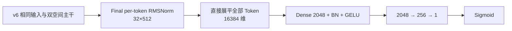

替换前后的接口为：

$$
h_{\mathrm{v6}}=[g;p;f_{512}]\in\mathbb R^{1536},
\qquad
h_{\mathrm{E2}}=\operatorname{vec}(\operatorname{RMS}(X_L))\in\mathbb R^{16384}.
$$

虽然任务塔隐藏层仍为 `[2048,2048,256]`，首层权重从 $1536\times2048$ 变成 $16384\times2048$，增加：

$$
(16384-1536)\times2048=30,408,704
$$

个矩阵参数。扣除原有 Pool 和压缩 Flatten 分支后，净增参数为：

$$
199,367,013-177,217,126=22,149,887.
$$

因此，这个对照回答的是“将完整增强读出换成 PureFlat 的端到端效果”，而不能进一步拆成“去掉 attention pooling”“去掉 gate”或“额外参数”各自的影响。

| 测试日 | v6 AUC | E2 AUC | E2 − v6 | E2 − Base |
|---|---:|---:|---:|---:|
| 2026-08-16 | 0.866017 | 0.866562 | **+5.45 bp** | −3.98 bp |
| 2026-08-17 | 0.867088 | 0.867488 | **+4.00 bp** | −3.79 bp |
| 2026-08-18 | 0.867996 | 0.868440 | **+4.44 bp** | −4.69 bp |
| 共同三日均值 | 0.867034 | 0.867497 | **+4.63 bp** | **−4.15 bp** |

来源：Sheet1!G4:L6。E2 是本轮最清楚的多日正向消融结果。表中同时记录 v6/E2 的运行时间为 **440/560 分钟**；在表内口径下增加约 **27.3%**。该时间没有完整硬件和执行日志支撑，适合作为成本记录，不直接换算成线上延迟。

### 5.3 E3：在 PureFlat 上隔离当前 Norm 实现的变化

**出发点。**如果直接看 v10 相比 v6 的改善，无法知道它来自 PureFlat 还是 LayerNorm。因此保留 E2 的输入、主干线性变换与任务头，只切换归一化实现。

对应源码：[v6_e3 Norm 路径](/Users/goku/Documents/Codex/RSA_code_0816/src/models/rankmixer/cvr_bn_rankmixer_v6_e3.py:1516)。

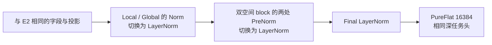

替换覆盖 Local 投影后、Global 投影后、两个 block 的 mixed/original PreNorm，以及最终 token 归一化。具体算子差异为：

$$
\operatorname{RMS}_t(x)=\gamma_t\odot
\frac{x}{\sqrt{\operatorname{mean}(x^2)+\epsilon_r}},
$$

$$
\operatorname{LN}(x)=\gamma\odot
\frac{x-\operatorname{mean}(x)}{\sqrt{\operatorname{Var}(x)+\epsilon_l}}+\beta.
$$

**这个实验不只改变是否减均值。**E2 的 Local/Block/Final RMSNorm 有 token 专属的 $[T,D]$ gamma；E3 采用末维 LayerNorm，gamma/beta 为跨 token 共享的 $[D]$。LayerNorm 沿用所调用实现的 epsilon 设置，不再读取 `rm_rms_epsilon`。因此结论应称为“这两种具体 Norm 配置的比较”，不能泛化为所有 RMSNorm 与 LayerNorm 的优劣。两者 Norm 参数合计相差 **91,136**，主干线性矩阵宽度没有改变。

**实验反馈。**E3 首日为 **0.866386**，相对 E2 的 0.866562 下降 **1.76 bp**，但仍高于原始 v6 **3.69 bp**。首日变化可以作如下算术分解：

$$
\underbrace{AUC_{E3}-AUC_{v6}}_{+3.69\,\mathrm{bp}}
=\underbrace{AUC_{E2}-AUC_{v6}}_{+5.45\,\mathrm{bp}}
+\underbrace{AUC_{E3}-AUC_{E2}}_{-1.76\,\mathrm{bp}}.
$$

这个分解说明，在本次结果中，v10 结构端点相对 v6 的净改善主要沿 PureFlat 这一步产生，Norm 替换抵消了一部分改善。后两项属于同一验证链上的观测差值，并非两个可以独立推广的因果效应。

### 5.4 E2 Small：检验宽度冗余，并优化 Token 构造图

**出发点。**E2 带来 AUC 改善，也增加了参数和训练时间。下一步将主干宽度减半，检验是否可以以较低成本保留大部分效果；同时对 token 构造中的重复切片操作做执行图优化。

对应源码：[v6_e2_small Token 构造](/Users/goku/Documents/Codex/RSA_code_0816/src/models/rankmixer/cvr_bn_rankmixer_v6_e2_small.py:1595)。

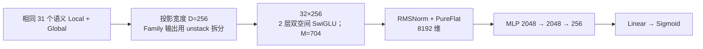

模型尺度变化为：

$$
D:512\to256,\quad M=704\;\text{不变},\quad
\dim h_{\mathrm{flat}}:16384\to8192.
$$

参数从 **199.367M** 降到 **102.356M**，减少 **97.011M，约 48.66%**。

执行图优化针对同宽 family 的输出 $Y\in\mathbb R^{B\times N\times D}$。原实现对每个 token 单独切片，优化后一次 `tf.unstack(Y, axis=1)` 得到全部输出，再按冻结的 token 顺序放回。两种写法的输入梯度都满足：

$$
\frac{\partial\mathcal L}{\partial Y}
=\sum_{t=1}^{N}\operatorname{Scatter}_t(g_t)
=\operatorname{Stack}(g_1,\ldots,g_N).
$$

不同 token 的梯度写入位置互不重叠，所以可以减少重复构造大形状切片梯度的开销。对于该部分逻辑中间张量，按既有设计中的 $B=2048,D=256$、FP32 和 family 大小 `1/5/5/5/15` 估算，梯度张量总量由 **602 MiB** 降为 **62 MiB**；这是中间张量量级分析，不是整日训练实测峰值内存。

“等价”仅指 **D=256、相同权重与输入时，切片路径和 unstack 路径的对应计算**。把 D 从 512 改为 256 本身会改变模型容量，不存在两个宽度的输出等价保证。

**实验反馈。**Small 首日 AUC **0.866510**，相比 E2 低 **0.52 bp**，相对 Base 低 **4.50 bp**。这是一个值得保留的成本候选：本次单日结果中的 AUC 损失较小，但多日稳定性与实际训练耗时仍需要后续记录支持。

### 5.5 E4：验证 common/item 主干与 creative 独立旁路

**出发点。**mature 路线把 common/item 作为主要交互对象，creative 通过独立支路在末端融合。E4 将这一组织方式引入 Small，检查小规模 creative 字段是否需要占据一个主干 token，同时缩小读出和任务头成本。

对应源码：[v6_e4 前向路径](/Users/goku/Documents/Codex/RSA_code_0816/src/models/rankmixer/cvr_bn_rankmixer_v6_e4.py:2032)。

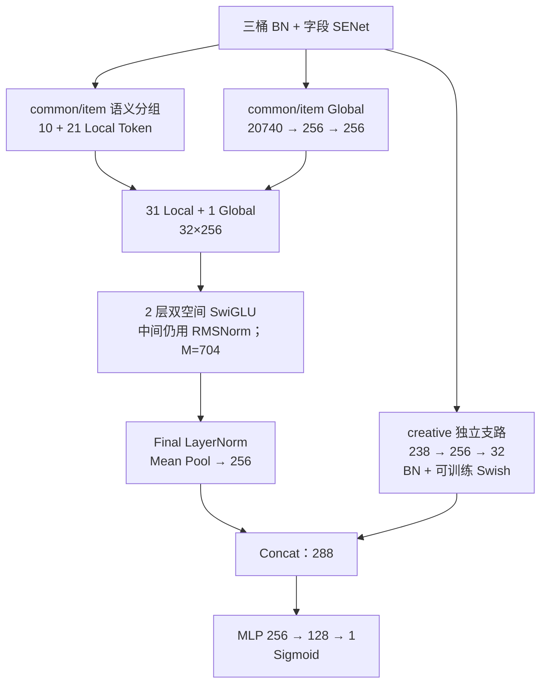

E4 的关键变化有五项：

1. Local 分配由 `10/20/1` 改为 `10/21/0`；item 原有五个 42-field 价格相关组被细分为六个 35-field 组，总字段集合不变。
2. Global 输入只使用 common+item，宽度从 20,978 改为 20,740。
3. creative 的字段级 SENet 改为只依赖自身 14 个字段，再经独立 MLP 输出 32 维。
4. 末端改为 LayerNorm 后对全部 32 个 token 取均值；block 内部仍保留 RMSNorm。
5. 任务塔由 `[2048,2048,256]` 改为 `[256,128]`。

读出与融合公式为：

$$
p_{ci}=\frac1{32}\sum_{t=1}^{32}\operatorname{LN}(X_{L,t})\in\mathbb R^{256},
$$

$$
h_a=\operatorname{Swish}_{\beta_1}(\operatorname{BN}(x_aW_1+b_1)),\qquad
c_a=\operatorname{Swish}_{\beta_2}(\operatorname{BN}(h_aW_2+b_2))\in\mathbb R^{32},
$$

$$
\operatorname{Swish}_{\beta}(z)=z\sigma(\beta\odot z),\quad \beta_0=1.702,
\qquad
z_{\mathrm{CVR}}=\operatorname{MLP}_{288\to256\to128\to1}([p_{ci};c_a]).
$$

**实验反馈。**E4 参数 **80.739M**，首日 AUC **0.866333**，相比 Small 下降 **1.77 bp**，相对 Base 低 **6.27 bp**。结果说明本次多项简化在节省成本的同时牺牲了一部分 AUC；无法单独判定是 creative 路由、均值池化、Final LN 还是小任务头导致回退。

### 5.6 v6 消融得到了什么

| 问题 | 目前得到的答案 | 证据强度 |
|---|---|---|
| v6 增强读出是否值得继续保留？ | PureFlat 完整替换在三个共同测试日均更好 | 本阶段较强的多日同向证据，包含参数随接口变化的影响 |
| v10 的改善是否来自 LayerNorm？ | 本次 E2→E3 反而下降 1.76 bp | 单日具体 Norm 实现对照 |
| D=512 是否有缩小空间？ | D256 Small 首日仅下降 0.52 bp，参数约减半 | 单日成本取舍证据 |
| creative 旁路与小头是否可以直接移植？ | E4 首日回退，当前整套移植没有提高 AUC | 联合结构实验，不能拆分单模块贡献 |

<a id="sec-mature"></a>

## 6. 公司线上结构适配与 mature 系列

### 6.1 这条路线的研究目的

根据本阶段的工作背景，`cvr_senet_mature_rankmixer_v1` 来自公司线上 RankMixer 代码的小参数量适配。其意义是：在自研版本之外，引入一套已经形成线上建模经验的结构，并在本任务相同三桶输入和首次转化标签下检验效果。

迁移的是结构组织方式。当前适配实现保留 385/835/14 个字段、17 维 Embedding 和单一 fst_CVR 输出，没有将线上参考代码中的其他输入或多任务目标混入本次结果。

### 6.2 mature_v1：保留成熟模块组合，建立 D256 小模型基准

**设计出发点。**自研系列已经尝试较大的主干和复杂读出，但容量并未稳定转化为 AUC。mature_v1 通过较小的 token 宽度，保留成熟代码中更细粒度的 SENet、投影组织、归一化、creative 旁路和紧凑任务头，检验另一种容量分配方式。

对应源码：[mature_v1](/Users/goku/Documents/Codex/RSA_code_0816/src/models/rankmixer/cvr_senet_mature_rankmixer_v1.py:1629)。配置为 $T=32,D=256,L=3,M=896=3.5D$。

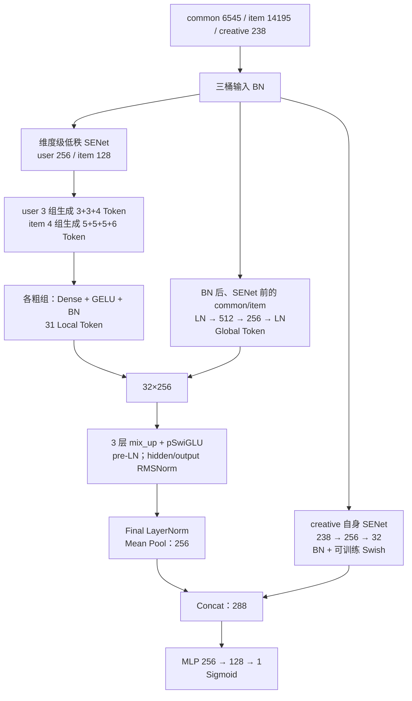

#### 6.2.1 与 BN 系列不同的 SENet 粒度

BN 系列先对 17 维字段取均值，再生成每个字段一个 gate；mature 的 `excitation2` 直接处理展平向量，输出与目标向量等宽的 gate。令 $u,i,a$ 为三桶 BN 输出，则：

$$
\widetilde u=u\odot\sigma\left(
\operatorname{ReLU}(\operatorname{BN}(uA_u+b_u))B_u+c_u\right),
$$

$$
\widetilde i=i\odot\sigma\left(
\operatorname{ReLU}(\operatorname{BN}([u;i]A_i+b_i))B_i+c_i\right),
$$

$$
\widetilde a=a\odot\sigma\left(
\operatorname{ReLU}(\operatorname{BN}(aA_a+b_a))B_a+c_a\right).
$$

低秩宽度为 **256/128/128**，输出宽度为 **6545/14195/238**。因此它可以在 Embedding 维度级进行选择。默认 sigmoid 门控的末层权重和 bias 零初始化，初始 gate 为 **0.5**；它没有 BN 系列 `2×sigmoid` 的系数。

该 SENet 约 **7.906M** 参数，明显高于 BN 系列字段级 SENet 的 **0.522M**。所以 mature_v1 的整体参数较小，并不表示每一个输入模块都更小。

#### 6.2.2 Local 与 Global 的输入来源

Local 的粗分组如下：

| 桶 | 粗组字段数 | 每组生成 token 数 |
|---|---|---|
| common/user | 102 / 149 / 134 | 3 / 3 / 4 |
| item | 202 / 203 / 202 / 228 | 5 / 5 / 5 / 6 |

一整个粗组共同生成多个 token：

$$
T_g=\operatorname{Reshape}_{k_g\times D}
\left(\operatorname{BN}_g(\phi(\widetilde x_gW_g+b_g))\right),
\qquad W_g\in\mathbb R^{17n_g\times k_gD}.
$$

同一个粗组内生成的 $k_g$ 个 token 都可以读取该组全部字段。其输入共享范围与“一组明确字段只产生一个 token”的 v6 分组不同。

Global 使用 **BN 后、SENet 前的 common+item**：

$$
g_0=\operatorname{LN}\left(
\phi(\operatorname{LN}([u;i])W_{g1}+b_{g1})W_{g2}+b_{g2}
\right),\qquad 20740\to512\to256.
$$

creative 不进入 Local 或 Global 主干，其信息通过独立支路在读出阶段融合。

#### 6.2.3 mature pSwiGLU 的真实残差与归一化

对第 $\ell$ 层，令 $Z_\ell=P(X_\ell)$、$Q_\ell=\operatorname{LN}(Z_\ell)$：

$$
H_\ell=\operatorname{RMS}_h\left(
\operatorname{SiLU}(Q_\ell W_{g,\ell}+b_{g,\ell})
\odot(Q_\ell W_{v,\ell}+b_{v,\ell})\right),
$$

$$
O_\ell=\operatorname{RMS}_o(H_\ell W_{d,\ell}+b_{d,\ell}),
\qquad
\boxed{X_{\ell+1}=Z_\ell+O_\ell}.
$$

所有线性矩阵按 token 独立；hidden/output RMSNorm 的 scale 沿最后一维共享，而非每个 token 一套完整 scale。残差加在 **mix_up 后的 $Z_\ell$** 上，没有 v6 的 Reverting 与 original-space 第二套 FFN。

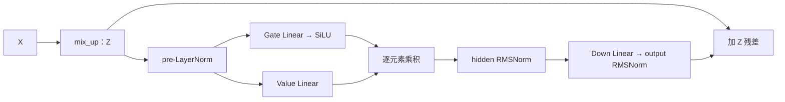

三层后进行 Final LN 和均值池化，再与 creative 支路拼接：

$$
p=\frac1{32}\sum_t\operatorname{LN}(X_{3,t}),\qquad
z=\operatorname{MLP}_{288\to256\to128\to1}([p;c_a]).
$$

**实验反馈。**

| 测试日 | Base AUC | mature_v1 AUC | 相对 Base | mature_v1 COPC |
|---|---:|---:|---:|---:|
| 2026-08-16 | 0.866960 | **0.866934** | **−0.26 bp** | 1.005859 |
| 2026-08-17 | 0.867867 | **0.867801** | **−0.66 bp** | 1.005633 |
| 两日均值 | 0.867414 | 0.867368 | **−0.46 bp** | — |

来源：Sheet1!B48:F49。总参数 **109.977M**，表中登记为“109M/0.2207GFLOPs/440mins”。这是当前最接近 Base 的候选结果。其意义是证明成熟模块组合在本任务上具有竞争力；现有对照不能把这两日表现单独归因给均值池化、维度级 SENet、内部 RMSNorm 或 creative 旁路。

### 6.3 mature_v2：扩展主干宽度，检查容量提升空间

**设计出发点。**mature_v1 已形成较强的小模型起点，最直接的容量实验是增加 token 宽度与 FFN 中间维度，检查同一类交互是否仍能从扩容受益。

对应源码：[mature_v2 配置](/Users/goku/Documents/Codex/RSA_code_0816/src/models/rankmixer/cvr_senet_mature_rankmixer_v2.py:268)。

```mermaid
flowchart LR
    A["沿用 mature_v1 输入与粗组投影"] --> B["32 Token<br/>D：256 → 384"]
    B --> C["3 层成熟 pSwiGLU<br/>M：896 → 1344"]
    C --> D["Final LN + Mean Pool<br/>384 维"]
    E["creative<br/>238 → 256 → 48"] --> F["Concat：432"]
    D --> F
    F --> G["任务塔仍为 256 → 128 → 1"]
```

主要尺度变化为：

$$
D:256\to384,\qquad M=3.5D:896\to1344,\qquad L=3.
$$

Per-token SwiGLU 的主矩阵参数约为 $3LTDM$。此时 $M$ 随 $D$ 同比例变化，主矩阵规模约增至：

$$
\left(\frac{384}{256}\right)^2=2.25
$$

倍。实际总参数从 **109.977M** 增至 **205.158M**。

当前 v2 并非所有支路都同比例扩展：SENet 低秩宽度仍为 256/128/128，Global 隐层仍为 512，creative 隐层仍为 256，任务塔仍为 `[256,128]`；主要扩展的是 token 主干和 creative 输出宽度。

**结果状态。**代码与运行参数已保存，最新 Excel 无该版本 AUC 列，因此这一步可以汇报为已构建的容量对照，不补写效果结论。

### 6.4 mature_v3：在 D384 下检查深度与成本的关系

**设计出发点。**mature_v2 扩容后参数超过 200M。保持 D384 和 M1344，将 block 从三层减为两层，可以检查第三层交互是否值得其容量和计算成本。

对应源码：[mature_v3 配置](/Users/goku/Documents/Codex/RSA_code_0816/src/models/rankmixer/cvr_senet_mature_rankmixer_v3.py:268)。

```mermaid
flowchart LR
    A["与 mature_v2 相同输入<br/>32×384 Token"] --> B["pSwiGLU block 1"]
    B --> C["pSwiGLU block 2<br/>删除第三层"]
    C --> D["Final LN + Mean Pool"]
    D --> E["拼接 48 维 creative"]
    E --> F["MLP 256 → 128 → 1"]
```

其结构关系为：

$$
\operatorname{Backbone}_{v2}=F_3\circ F_2\circ F_1,
\qquad
\operatorname{Backbone}_{v3}=F_2\circ F_1,
\quad D=384,M=1344.
$$

按当前参数计算，删除一层减少 **49,646,016** 个参数，总量降至 **155.512M**。

**结果状态。**最新 Excel 同样没有 mature_v3 的 AUC，无法判断较浅主干的收益或损失。v2/v3 体现的是针对同一成熟结构建立宽度和深度对照，属于已完成的方案构建工作。

### 6.5 mature_v4：以单路 pSiLU 控制扩容成本

**设计出发点。**将宽度增至 D384 会显著增加 SwiGLU 参数。v4 尝试保留成熟代码的 pre-LN、hidden/output RMSNorm 和残差组织，使用单上投影的 pSiLU 替换双上投影 SwiGLU，并将 SENet、Global、creative 与任务头按新的宽度一起调整。

对应源码：[mature_v4 pSiLU](/Users/goku/Documents/Codex/RSA_code_0816/src/models/rankmixer/cvr_senet_mature_rankmixer_v4.py:1370)。

```mermaid
flowchart TD
    A["三桶 BN"] --> B["维度级 SENet<br/>低秩宽度 384 / 192 / 192"]
    B --> C["沿用粗组多 Token 投影<br/>31 Local；D384"]
    A --> D["common/item Global<br/>20740 → 768 → 384"]
    C --> E["32×384"]
    D --> E
    E --> F["3 层 mix_up + pSiLU<br/>M=1344；保留双 RMSNorm"]
    F --> G["Final LN + Mean Pool：384"]
    B --> H["creative：238 → 384 → 48"]
    G --> I["Concat：432"]
    H --> I
    I --> J["MLP 384 → 192 → 1<br/>Sigmoid"]
```

令 $Z=P(X)$、$Q=\operatorname{LN}(Z)$，单路 pSiLU 为：

$$
H=\operatorname{RMS}_h\left(\operatorname{SiLU}(QW_u+b_u)\right),\qquad
O=\operatorname{RMS}_o(HW_d+b_d),\qquad X'=Z+O.
$$

与 pSwiGLU 相比，删除一套独立上投影及两路相乘。对于相同的 $T,D,M,L$，主矩阵参数从 $3LTDM$ 改为 $2LTDM$；包含被删除上投影的 bias 后，D384、M1344、L3 的减少量为：

$$
LT(DM+M)=3\times32\times(384\times1344+1344)
=49,674,240.
$$

这仍然保留成熟实现的归一化和 mixed-space 残差，不能等同于退回原始论文的普通两层 PFFN。

当前 v4 的总参数为 **164.968M**。若把相同 D384 全链路配置中的 pSiLU 换回 pSwiGLU，按公式计算的反事实参数量为 **214.642M**；这只是同宽结构的参数核算，不是表中另一个已运行模型。

**实验反馈。**首日 AUC **0.866206**，相对 mature_v1 下降 **7.28 bp**，相对 Base 低 **7.54 bp**。当前 v1→v4 联合改变了 token 宽度、FFN 形式和多条分支宽度，因此只能说明这个扩容/简化组合在本次结果中没有胜过 mature_v1，不能把全部下降归因为删除 SwiGLU 的独立门控分支。

### 6.6 mature_v5：把粗组多 Token 投影改成细粒度语义 Token

**设计出发点。**v1～v4 由七个粗组投影产生 31 个 Local token，同一粗组中的多个 token 都能读取该组全部字段，但每个 token 没有明确的业务主题。自研 v3/v6 的经验表明，可以进一步检查“字段业务语义与 token 身份对齐”的价值。

mature_v5 以 v4 为基础，保留其 Global、pSiLU、creative 旁路和任务头，替换 Local tokenizer。对应源码：[mature_v5 语义投影](/Users/goku/Documents/Codex/RSA_code_0816/src/models/rankmixer/cvr_senet_mature_rankmixer_v5.py:1852)。

```mermaid
flowchart TD
    A["按原粗组字段顺序<br/>三桶 BN + mature SENet"] --> B["恢复 feature_id 与字段 Tensor 映射"]
    B --> C["按冻结语义 gather<br/>10 common + 21 item"]
    C --> D["每组独立 Linear → BN<br/>31×384"]
    E["原 BN common/item<br/>保持 v4 的 Global MLP"] --> F["拼接 1 Global<br/>32×384"]
    D --> F
    F --> G["v4 相同 3 层 pSiLU<br/>Final LN + Mean Pool"]
    H["v4 相同 creative 旁路<br/>48 维"] --> I["Concat：432"]
    G --> I
    I --> J["v4 相同 MLP<br/>384 → 192 → 1"]
```

这里先按旧字段顺序完成 BN/SENet，再恢复字段 ID 映射并重新 gather。这样可以保持已定义的维度级门控与字段的对应关系，避免直接重排原始向量后使同一位置的 gate 作用于另一个字段。

每组只产生一个语义 token：

$$
x_t=\operatorname{BN}_t\left(
\operatorname{Concat}_{j\in G_t}\widetilde E_j\,W_t+b_t
\right),\qquad W_t\in\mathbb R^{17|G_t|\times384}.
$$

每个组有独立投影和独立 BN，统计沿 batch 维计算。**当前 v5 在 Linear 与 BN 之间没有 GELU**，而 v4 的粗组投影使用 GELU。因此这一处理同时改变字段组织、投影输入共享范围、参数量和投影激活，结论应归于整个 tokenizer 的替换。

31 个 Local token 的分配为：

$$
\text{common}:5\times39+5\times38=385,\qquad
\text{item}:10\times42+6\times35+5\times41=835.
$$

语义表复用当前 UniMixer 的 common/item 划分。creative 保留独立支路，不进入 Local 集合。

参数变化可以直接由投影方式解释。旧方式中，一组字段共同生成 $k_g$ 个 token，矩阵参数为 $\sum_g17n_gk_gD$；新方式每个字段只进入一个 token，矩阵参数为 $17(385+835)D$。当前 D384 下：

$$
P_{\mathrm{new\ tokenizer}}
=1220\times17\times384+31\times384+2\times31\times384
=7,999,872.
$$

对应 v4 tokenizer 为 **37,193,088** 参数，差值 **29,193,216**。当前 v5 源码与 args 得到的总参数为 **135.775M**。

**实验反馈及对应关系。**Excel 的同名 mature_v5 列记录首日 AUC **0.866289**，比 mature_v4 高 **0.83 bp**，仍比 mature_v1 低 **6.45 bp**。但该列参数备注为 **199M**，与当前源码的 **135.775M** 不一致。报告保留这两个来源的原值；在确认实际运行维度之前，上述 +0.83 bp 只作为同名实验记录之间的差值，不作为当前 tokenizer 改动的严格归因结论。

### 6.7 两条研发路线带来的结构认识

| 结构维度 | 自研 v6 | mature_v1 | 这项差异说明什么 |
|---|---|---|---|
| SENet 选择粒度 | 每字段一个 gate，整体缩放 17 维 | 每个展平维度一个 gate | 输入选择能力与参数分配不同 |
| Local 输入 | 10/20/1 个细粒度语义组 | 7 个粗组产生 10/21 个 common/item token | token 的输入共享范围不同 |
| Global 来源 | 三桶 BN/SENet 后 | common/item 的 BN 后、SENet 前 | 全局支路所保留的信息不同 |
| creative | 同时进入 Local 与 Global | 独立支路，末端融合 | 小桶参与交互的位置不同 |
| 每层交互 | Mixing/Reverting + 双 SwiGLU | mix_up + 单 pSwiGLU | 参数预算、深度和残差布局不同 |
| 层数 | 2 | 3 | 不能只用层数比较实际计算量 |
| 归一化 | 以 per-token RMSNorm 为主 | pre/final LN + FFN 内双 RMSNorm | 数值尺度控制的位置不同 |
| 读出与任务头 | 三路 1536 维 + `[2048,2048,256]` | Mean 256 + creative 32 + `[256,128]` | 更大末端不一定在所有主干上更有效 |
| 总参数 | 177.217M | 109.977M | mature_v1 整体更小，但 SENet 更大 |
| 08-16 AUC | 0.866017 | 0.866934 | mature_v1 高 **9.17 bp**，属于完整结构比较 |

两条路线的共同价值在于逐步识别“容量应该放在哪里、信息应该在哪个阶段交互和融合”。mature_v1 的结果说明，保留成熟结构的组合可能比继续增加主干和输出头容量更有效；E4 的回退又表明，抽取其中几个表面结构直接移植，未必保留原组合的效果。

<a id="sec-unimixer"></a>

## 7. UniMixer 独立对照：检查可学习交互的另一种形式

汇总表还记录了 `unimixer_v1`，因此本报告保留这条独立探索。它的出发点是：RankMixer 的交互重排固定不变，是否可以通过可学习的分块混合矩阵，自适应选择不同特征子空间之间的信息流。

对应源码：[cvr_bn_unimixer_v1.py](/Users/goku/Documents/Codex/RSA_code_0816/src/models/rankmixer/cvr_bn_unimixer_v1.py:518)。

```mermaid
flowchart LR
    A["三桶 BN + 字段 SENet"] --> B["32 个语义组<br/>10 common + 21 item + 1 creative"]
    B --> C["独立 Linear + Token BN<br/>32×512；无额外 Global"]
    C --> D["2 层 UniMixer-Lite<br/>分块混合 + Per-token SwiGLU<br/>SiameseNorm 双流"]
    D --> E["双流末端融合<br/>PureFlat 16384"]
    E --> F["MLP 2048 → 2048 → 256<br/>Linear → Sigmoid"]
```

与 v6 的 31+1 结构相比，UniMixer 的 32 个 token 都是输入语义组，不含额外 Global token。将长度 $TD=16384$ 的向量重排为 $G=512$ 个宽度 $q=32$ 的块，混合参数采用：

$$
A=UV^\top,\qquad B_g=\sum_{k=1}^{K}c_{gk}B^{(k)},
$$

$$
\overline A=\operatorname{SK}\left(\exp\left(\frac{A+A^\top}{2\tau}\right)\right),
\qquad
\overline B_g=\operatorname{SK}\left(\exp\left(\frac{B_g+B_g^\top}{2\tau}\right)\right).
$$

其中 $\operatorname{SK}$ 表示交替行列归一化及实现中的最终对称化。有限迭代和数值 epsilon 使其属于**近似双随机矩阵**；温度 $\tau$ 控制权重集中程度，并不等于已经执行稀疏路由。

若分块输入为 $V_{b,g,:}$，则块内、块间混合为：

$$
U_{b,g,:}=V_{b,g,:}\overline B_g,\qquad
Y_{b,h,:}=\sum_g\overline A_{gh}U_{b,g,:}.
$$

**实验反馈。**首日 AUC **0.865662**，相对 Base 低 **12.98 bp**。该版本同时采用了自己的 token 归一化、SiameseNorm、SwiGLU 和读出，不是仅把 v6 的固定 Mixing 替换成可学习矩阵。因此当前结果能够描述完整 UniMixer 候选的效果，不能单独判断“可学习 Mixing 是否优于固定 Mixing”。

<a id="sec-findings"></a>

## 8. 阶段认识与下一步收敛方向

### 8.1 结构探索已经形成连续的问题链

这一阶段的迭代可以用六个递进问题概括：

| 研发问题 | 对应工作 | 形成的认识 |
|---|---|---|
| 输入有没有按正确粒度组织？ | v1→v2→v3 | 先保住字段边界，再固定业务语义；v3 的等参数对照提供正向证据 |
| 交互应该在哪个空间发生？ | v4、v5/v6、v8/v9 | 语义 token 交叉、重排空间交互、全字段交叉解决的是不同问题；当前结果没有支持某一类交叉普遍有效 |
| 全局信息与残差如何保留？ | v5/v6、v9、mature_v1 | Global 来源、Reverting、长残差与 Shortcut 都会改变信息路径，需要以实现位置区分 |
| 任务头能否充分利用主干表示？ | v7、v10、E2/E3 | 对自研 v6，完整读出替换是已观察到的明确改善；深头本身的 v3/v7 同日对照仍缺失 |
| 容量放在哪里更有效？ | v5→v6、E2 Small、mature_v1～v4 | 更大模型没有稳定胜出；输入选择、token 投影、交互层和读出的预算分配都值得关注 |
| 好结构能否通过局部模仿迁移？ | E4、mature_v5 | 抽取成熟结构的部分模块，需要重新验证整套组合与接口是否匹配 |

### 8.2 当前最值得保留的候选与证据


所有柱形对应同一个测试日 `2026-08-16`，Base AUC=0.866960。排序只描述这一日的结果，不代表显著性排序；mature_v5 的运行参数对应关系仍待核对。

| 候选 | 保留理由 | 当前数据范围 |
|---|---|---|
| mature_v1 | 已有结果最接近 Base，且当前实现参数约 110M | 两日差距 −0.26/−0.66 bp |
| v6_e2 | 相对 v6 连续三日正向，可作为自研路线的新对照点 | 三日平均提升 +4.63 bp |
| v6_e2_small | 首日 AUC 仅比 E2 低 0.52 bp，参数约减半 | 目前一日 |
| v8 | 自研 BN 系列首日最高，支持关注前置交叉的完整组合 | 目前一日 |

v4、v9、E4 和 mature_v4 的回退也形成了可复用认识：有明确动机的结构仍需要实测；显式交叉、旁路、深度或参数量，都不能单独作为效果的保证。

### 8.3 已沉淀的工程与算法工作

本阶段的交付不只包括多个模型文件，还包括以下可以持续复用的能力：

- **输入语义与顺序契约。**建立 feature_id→Embedding 映射、冻结语义组、字段完整覆盖/无重复检查，以及部分版本的组顺序校验，减少模型实现与特征排列漂移。
- **多种交互主干的完整实现。**覆盖普通 RankMixer PFFN、双空间 SwiGLU、Masked DCN、Base DCNM 双视图、成熟 pSwiGLU/pSiLU，以及 UniMixer-Lite。
- **可追踪的消融链。**围绕 v6 拆分读出与 Norm，再增加宽度与业务支路实验，使联合设计能够逐步获得更清楚的解释。
- **参数预算与执行图优化。**复核 Dense 参数构成，将等宽投影和 FFN 组织为 batched matmul，并在 Small 中优化 token 拆分的梯度图。
- **统一结果复盘。**把不同日期链、同日 Base、AUC 差值、参数量与已有记录对应起来，保留负向结果和无结果版本的真实状态。

### 8.4 下一步优先级

后续适合优先延续 mature_v1、E2/Small 和 v8 的同日、多日对比，并冻结各次运行的实际参数与代码版本。这样可以先判断当前较好候选的收益是否持续，再决定是否继续增加结构复杂度。

若继续做结构归因，优先围绕已有正向发现补齐控制：对 E2 建立参数预算匹配的读出对照；对成熟结构的 SENet、Norm 与 creative 路径逐项验证；对 v8 补充保持 FFN 中间宽度一致的交叉对照。这些属于后续计划，不计入本阶段已取得的收益。

当前结果没有多随机种子统计或逐样本配对置信区间，因此工作结论定位为**离线结构探索、候选收敛和消融证据积累**。mature_v1 已很接近 Base，但尚无“稳定超越 Base”或线上业务增益的证据。
<!-- BEGIN GENERATED EVIDENCE APPENDICES -->
<a id="appendix-auc"></a>

## 附录 A：完整 AUC 记录

以下保留汇总表中全部已有 AUC。重复出现的 8 月 Base 列合并展示；空格记为“—”，不按零处理。AUC 保留六位小数，差值由原始 AUC 重新计算。

### A.1 7 月独立实验链

| 测试日期 | Base | 初始 v1（无代码） | BN v1 | v2 | v3 | v4 | v5 |
| --- | --- | --- | --- | --- | --- | --- | --- |
| 2026-07-02 | 0.864538 | 0.858606 | 0.862033 | 0.862690 | 0.862991 | 0.862709 | 0.863747 |
| 2026-07-03 | 0.865633 | 0.860093 | 0.862850 | — | 0.864324 | — | 0.864929 |
| 2026-07-04 | 0.867060 | 0.861917 | 0.864362 | — | 0.865902 | — | 0.866454 |
| 2026-07-05 | 0.866114 | 0.861130 | 0.863436 | — | 0.865013 | — | 0.864163 † |
| 2026-07-06 | 0.865990 | 0.861049 | — | — | 0.864862 | — | — |
| 2026-07-07 | 0.866681 | 0.861717 | — | — | 0.865544 | — | — |
| 2026-07-08 | 0.867488 | 0.862672 | — | — | 0.866401 | — | — |
| 2026-07-09 | 0.868414 | 0.863714 | — | — | — | — | — |
| 2026-07-10 | 0.868604 | — | — | — | — | — | — |
| 2026-07-11 | 0.869244 | — | — | — | — | — | — |
| 2026-07-12 | 0.869039 | — | — | — | — | — | — |
| 2026-07-13 | 0.869139 | — | — | — | — | — | — |
| 2026-07-14 | 0.869355 | — | — | — | — | — | — |
| 2026-07-15 | 0.869151 | — | — | — | — | — | — |
| 2026-07-16 | 0.869715 | — | — | — | — | — | — |

来源：Sheet1!A25:X40。† V29 的 v5 AUC=0.864163、W29 的 COPC=0.995193，与 8 月首日 D4/E4 完全相同，暂保留原记录并标注待核对。BN v1 的 07-04 结果采用最新表 G28 的 **0.864362**。

### A.2 8 月首日全部候选

| 方案 | AUC | 相对 Base（bp） | COPC | AUC 单元格 |
| --- | --- | --- | --- | --- |
| Base | 0.866960 | +0.00 | 1.005092 | Sheet1!B4 |
| v5 | 0.864163 | -27.97 | 0.995193 | Sheet1!D4 |
| v6 | 0.866017 | -9.43 | 0.999257 | Sheet1!G4 |
| v6_e2 | 0.866562 | -3.98 | 0.992616 | Sheet1!J4 |
| v6_e2_small | 0.866510 | -4.50 | 1.010160 | Sheet1!M4 |
| v6_e3 | 0.866386 | -5.74 | 1.008348 | Sheet1!P4 |
| v6_e4 | 0.866333 | -6.27 | 1.000596 | Sheet1!V4 |
| v7 | 0.865866 | -10.94 | 1.003265 | Sheet1!Y4 |
| v8 | 0.866615 | -3.45 | 1.013728 | Sheet1!AB4 |
| v9 | 0.865254 | -17.06 | 1.006730 | Sheet1!AE4 |
| UniMixer v1 | 0.865662 | -12.98 | 1.003650 | Sheet1!AH4 |
| mature_v1 | 0.866934 | -0.26 | 1.005859 | Sheet1!D48 |
| mature_v4 | 0.866206 | -7.54 | 1.016601 | Sheet1!G48 |
| mature_v5 | 0.866289 | -6.71 | 0.997439 | Sheet1!J48 |

测试日统一为 2026-08-16。mature_v5 的参数备注与当前代码存在差异，详见附录 C；v10 无独立结果列，E3 为其结构端点的消融实现。

### A.3 8 月后续日期与连续实验记录

| 测试日期 | Base | v6 | v6_e2 | mature_v1 |
| --- | --- | --- | --- | --- |
| 2026-08-16 | 0.866960 | 0.866017 | 0.866562 | 0.866934 |
| 2026-08-17 | 0.867867 | 0.867088 | 0.867488 | 0.867801 |
| 2026-08-18 | 0.868909 | 0.867996 | 0.868440 | — |
| 2026-08-19 | 0.869868 | 0.868878 | — | — |
| 2026-08-20 | 0.869504 | — | — | — |
| 2026-08-21 | 0.869311 | — | — | — |
| 2026-08-22 | 0.869081 | — | — | — |
| 2026-08-23 | 0.868243 | — | — | — |
| 2026-08-24 | 0.867981 | — | — | — |
| 2026-08-25 | 0.868269 | — | — | — |
| 2026-08-26 | 0.869582 | — | — | — |

来源：Sheet1!A4:B14、G4:G7、J4:J6、D48:D49。Base 在该轮已有 11 天记录。表中 08-27～08-30 只有日期、没有 AUC，未计入已完成结果。

### A.4 各自记录窗口的描述性统计

| 方案与窗口 | 测试日期 | 天数 | 平均 AUC | 同日相对 Base 均值（bp） |
| --- | --- | --- | --- | --- |
| 初始 v1（无代码） | 2026-07-02～2026-07-09 | 8 | 0.861362 | -51.28 |
| BN v1 | 2026-07-02～2026-07-05 | 4 | 0.863170 | -26.66 |
| v3 | 2026-07-02～2026-07-08 | 7 | 0.865005 | -12.10 |
| v5：历史前三日窗口 | 2026-07-02～2026-07-04 | 3 | 0.865043 | -7.00 |
| v5：全部四条，含待核对日 | 2026-07-02～2026-07-05 | 4 | 0.864823 | -10.13 |
| v6 | 2026-08-16～2026-08-19 | 4 | 0.867495 | -9.06 |
| E2 | 2026-08-16～2026-08-18 | 3 | 0.867497 | -4.15 |
| mature_v1 | 2026-08-16～2026-08-17 | 2 | 0.867368 | -0.46 |

这些窗口长度与日期不同，用于描述各自结果；候选之间的直接比较应使用下表的共同日期。

### A.5 关键同日差值复算

| 比较 | 共同测试日 | 逐日差值（bp） | 均值（bp） | 解释范围 |
| --- | --- | --- | --- | --- |
| BN v1 − 初始 v1 | 07-02 | +34.27 | +34.27 | 原始代码缺失，只能比较完整方案 |
| v2 − BN v1 | 07-02 | +6.57 | +6.57 | 组合修正 |
| v3 − v2 | 07-02 | +3.01 | +3.01 | 相同规模下的语义组织对照 |
| v4 − v3 | 07-02 | -2.82 | -2.82 | QICross-Lite |
| v5 − v3：前三日 | 07-02 / 07-03 / 07-04 | +7.56 / +6.05 / +5.52 | +6.38 | 组合扩展 |
| v5 − v3：全部四条 | 07-02 / 07-03 / 07-04 / 07-05 | +7.56 / +6.05 / +5.52 / -8.50 | +2.66 | 包含待核对的 07-05 |
| v6 − v5 | 08-16 | +18.54 | +18.54 | 语义分组与宽度联合改变 |
| E2 − v6 | 08-16 / 08-17 / 08-18 | +5.45 / +4.00 / +4.44 | +4.63 | 完整读出接口替换 |
| E3 − E2 | 08-16 | -1.76 | -1.76 | 具体 Norm 实现替换 |
| Small − E2 | 08-16 | -0.52 | -0.52 | 宽度与执行图优化 |
| E4 − Small | 08-16 | -1.77 | -1.77 | 业务路径与末端结构联合变化 |
| v8 − v6 | 08-16 | +5.98 | +5.98 | 前置交叉与 M704→512 |
| v9 − v8 | 08-16 | -13.61 | -13.61 | 交叉、视图与读出联合变化 |
| mature_v4 − v1 | 08-16 | -7.28 | -7.28 | 扩容与 FFN 联合变化 |
| mature_v5 − v4 | 08-16 | +0.83 | +0.83 | 运行参数对应关系待核对 |

<a id="appendix-cost"></a>

## 附录 B：参数量与成本口径

### B.1 当前代码与保存参数下的 Dense 参数量

以下通过当前源码中的参数核算函数，或按对应矩阵、bias、BN/LN/RMSNorm 参数逐模块复算。计入可训练 Dense 参数；不含动态 sparse Embedding 表、优化器状态、BN moving statistics、梯度与激活内存。原始未保存代码的 rankmixer_v1 无法复算。

| 方案 | Dense 参数数目 | 百万参数（M） |
| --- | --- | --- |
| Base | 90,341,785 | 90.342 |
| BN v1 | 167,293,157 | 167.293 |
| v2 | 95,809,126 | 95.809 |
| v3 | 95,809,126 | 95.809 |
| v4 | 96,439,272 | 96.439 |
| v5 | 348,432,486 | 348.432 |
| v6 | 177,217,126 | 177.217 |
| v7 | 102,113,126 | 102.113 |
| v8 | 192,242,606 | 192.243 |
| v9 | 199,445,658 | 199.446 |
| v10 | 199,275,877 | 199.276 |
| v6_e2 | 199,367,013 | 199.367 |
| v6_e3 | 199,275,877 | 199.276 |
| v6_e2_small | 102,356,069 | 102.356 |
| v6_e4 | 80,739,301 | 80.739 |
| mature_v1 | 109,976,671 | 109.977 |
| mature_v2 | 205,157,727 | 205.158 |
| mature_v3 | 155,511,711 | 155.512 |
| mature_v4 | 164,968,095 | 164.968 |
| mature_v5 | 135,774,879 | 135.775 |

E3 与 v10 的参数量相同，表示相同结构端点；表格没有将二者算成两次独立效果实验。mature_v5 的源码参数量与 Excel“199M”备注仍待对齐。

### B.2 Excel 已登记的计算量与时间

| 方案 | 原表参数备注 | 原表 FLOPs | 原表时间 | 来源 |
| --- | --- | --- | --- | --- |
| Base | 90M | 0.1809 GFLOPs | — | Sheet1!B2 / B24 / B46 |
| v6 | 177M | 0.3586 GFLOPs | 440 分钟 | Sheet1!G2 |
| v6_e2 | 199M | — | 560 分钟 | Sheet1!J2 |
| mature_v1 | 109M | 0.2207 GFLOPs | 440 分钟 | Sheet1!D46 |
| mature_v4 | 164M | 0.3312 GFLOPs | 520 分钟 | Sheet1!G46 |
| mature_v5 | 199M | — | 535 分钟 | Sheet1!J46 |

原表的参数备注保留原样；源码复算值见上一节。训练时间受实际 worker/PS、算子实现、通信和输入流水线影响，不能仅用 FLOPs 推算，也不能直接作为线上推理耗时。

### B.3 复杂度变化的关键公式

普通两层 Per-token FFN 的参数为：

$$
P_{\mathrm{PFFN}}=LT(2DM+M+D),\qquad M=kD.
$$

每层一套 Per-token SwiGLU 的参数为：

$$
P_{\mathrm{pSwiGLU}}=LT(3DM+2M+D).
$$

v5/v6 的每层有两套，因此上述主体乘以 2，再加上相关 Norm 参数。mature_v4/v5 的单路 pSiLU 主体为：

$$
P_{\mathrm{pSiLU}}=LT(2DM+M+D).
$$

这些公式只计对应 FFN；Global、SENet、token 投影和任务头需要另外计入。无参数 Mixing 的矩阵乘参数为零，但重排、内存访问与布局变换仍可能产生实际执行开销。


<a id="appendix-sources"></a>

## 附录 C：记录差异与源码索引

### C.1 最新表格与历史材料的处理原则

| 事项 | 核对结果 | 本报告处理 |
| --- | --- | --- |
| 背景材料路径 | 请求中两次给出同一 xlsx 路径；docs 目录中另有 background.md，内容对应当前任务背景 | 使用 background.md 解释背景，以最新 Excel 作为 AUC 主来源 |
| BN v1 的第三个测试日 | Excel G28=0.864362；background.md 写为 0.864326 | 使用 Excel，四日相对 Base 均值更新为 −26.66 bp |
| 8 月 Base 的第五个测试日 | Excel B8/B52=0.869504；background.md 写为 0.869604 | 使用 Excel 的 0.869504 |
| 7 月 v5 的第四条记录 | V29/W29 与 D4/E4 的 AUC/COPC 均完全相同 | 保留原值、标注待核对，同时给出前三日及全部四日窗口 |
| mature_v5 的参数备注 | Excel J46=199M；当前 D384 源码与 args 为 135.775M | 分别保留，不把同名 AUC 直接当作当前配置的严格归因结果 |
| v10 与 E3 | Excel 只有 E3 列；当前代码结构端点与 v10 相同 | 将 0.866386 归属于 E3，不虚构或重复登记 v10 实验 |
| mature_v2/v3 | 存在代码及 args，但 Excel 无对应 AUC | 作为已构建方案介绍，不补写效果 |
| 实验日期 | Excel 表头是测试日期；设计文件名和 args 可能保留历史日期 | AUC 日期使用 Excel；训练日按背景的次日测试协议解释 |
| 旧文档中的实验状态 | 部分旧介绍写 v7/v8/消融尚无结果 | 以本次最新 Excel 更新，不沿用过期状态 |

其中 v5 的重复记录和 mature_v5 的参数对应关系属于待核对项，其余数值差异已按最新表格统一。当前工作区未包含所有历史运行的完整日志与代码快照，因此源码说明代表本次核查时的实现，结果按表格中的版本命名对应。

### C.2 模型与运行参数索引

| 方案 | 模型源码 | 保存的运行参数 |
| --- | --- | --- |
| Base | [模型代码](/Users/goku/Documents/Codex/RSA_code_0816/src/models/seq_model/cvr_bn_senet_dcnm_fst.py) | [参数文件](/Users/goku/Documents/Codex/RSA_code_0816/scripts/set-x.txt) |
| BN v1 | [模型代码](/Users/goku/Documents/Codex/RSA_code_0816/src/models/rankmixer/cvr_bn_rankmixer_v1.py) | 背景说明中的通用方式；无单列 args 文件 |
| BN v2 | [模型代码](/Users/goku/Documents/Codex/RSA_code_0816/src/models/rankmixer/cvr_bn_rankmixer_v2.py) | [参数文件](/Users/goku/Documents/Codex/RSA_code_0816/bash/set-rankmixer-v2-args.txt) |
| BN v3 | [模型代码](/Users/goku/Documents/Codex/RSA_code_0816/src/models/rankmixer/cvr_bn_rankmixer_v3.py) | [参数文件](/Users/goku/Documents/Codex/RSA_code_0816/bash/set-rankmixer-v3-args.txt) |
| BN v4 | [模型代码](/Users/goku/Documents/Codex/RSA_code_0816/src/models/rankmixer/cvr_bn_rankmixer_v4.py) | [参数文件](/Users/goku/Documents/Codex/RSA_code_0816/bash/set-rankmixer-v4-args.txt) |
| BN v5 | [模型代码](/Users/goku/Documents/Codex/RSA_code_0816/src/models/rankmixer/cvr_bn_rankmixer_v5.py) | [参数文件](/Users/goku/Documents/Codex/RSA_code_0816/bash/set-rankmixer-v5-args.txt) |
| BN v6 | [模型代码](/Users/goku/Documents/Codex/RSA_code_0816/src/models/rankmixer/cvr_bn_rankmixer_v6.py) | [参数文件](/Users/goku/Documents/Codex/RSA_code_0816/bash/set-rankmixer-v6-args.txt) |
| BN v7 | [模型代码](/Users/goku/Documents/Codex/RSA_code_0816/src/models/rankmixer/cvr_bn_rankmixer_v7.py) | [参数文件](/Users/goku/Documents/Codex/RSA_code_0816/bash/set-rankmixer-v7-args.txt) |
| BN v8 | [模型代码](/Users/goku/Documents/Codex/RSA_code_0816/src/models/rankmixer/cvr_bn_rankmixer_v8.py) | [参数文件](/Users/goku/Documents/Codex/RSA_code_0816/bash/set-rankmixer-v8-args.txt) |
| BN v9 | [模型代码](/Users/goku/Documents/Codex/RSA_code_0816/src/models/rankmixer/cvr_bn_rankmixer_v9.py) | [参数文件](/Users/goku/Documents/Codex/RSA_code_0816/bash/set-rankmixer-v9-args.txt) |
| BN v10 | [模型代码](/Users/goku/Documents/Codex/RSA_code_0816/src/models/rankmixer/cvr_bn_rankmixer_v10.py) | [参数文件](/Users/goku/Documents/Codex/RSA_code_0816/bash/set-rankmixer-v10-args.txt) |
| v6_e2 | [模型代码](/Users/goku/Documents/Codex/RSA_code_0816/src/models/rankmixer/cvr_bn_rankmixer_v6_e2.py) | [参数文件](/Users/goku/Documents/Codex/RSA_code_0816/bash/set-rankmixer-v6-e2-args.txt) |
| v6_e3 | [模型代码](/Users/goku/Documents/Codex/RSA_code_0816/src/models/rankmixer/cvr_bn_rankmixer_v6_e3.py) | [参数文件](/Users/goku/Documents/Codex/RSA_code_0816/bash/set-rankmixer-v6-e3-args.txt) |
| v6_e2_small | [模型代码](/Users/goku/Documents/Codex/RSA_code_0816/src/models/rankmixer/cvr_bn_rankmixer_v6_e2_small.py) | [参数文件](/Users/goku/Documents/Codex/RSA_code_0816/bash/set-rankmixer-v6-e2-small-args.txt) |
| v6_e4 | [模型代码](/Users/goku/Documents/Codex/RSA_code_0816/src/models/rankmixer/cvr_bn_rankmixer_v6_e4.py) | [参数文件](/Users/goku/Documents/Codex/RSA_code_0816/bash/set-rankmixer-v6-e4-args.txt) |
| mature_v1 | [模型代码](/Users/goku/Documents/Codex/RSA_code_0816/src/models/rankmixer/cvr_senet_mature_rankmixer_v1.py) | [参数文件](/Users/goku/Documents/Codex/RSA_code_0816/bash/set-rankmixer-mature-3bucket-d256-args.txt) |
| mature_v2 | [模型代码](/Users/goku/Documents/Codex/RSA_code_0816/src/models/rankmixer/cvr_senet_mature_rankmixer_v2.py) | [参数文件](/Users/goku/Documents/Codex/RSA_code_0816/bash/set-rankmixer-mature-v2-args.txt) |
| mature_v3 | [模型代码](/Users/goku/Documents/Codex/RSA_code_0816/src/models/rankmixer/cvr_senet_mature_rankmixer_v3.py) | [参数文件](/Users/goku/Documents/Codex/RSA_code_0816/bash/set-rankmixer-mature-v3-args.txt) |
| mature_v4 | [模型代码](/Users/goku/Documents/Codex/RSA_code_0816/src/models/rankmixer/cvr_senet_mature_rankmixer_v4.py) | [参数文件](/Users/goku/Documents/Codex/RSA_code_0816/bash/set-rankmixer-mature-v4-args.txt) |
| mature_v5 | [模型代码](/Users/goku/Documents/Codex/RSA_code_0816/src/models/rankmixer/cvr_senet_mature_rankmixer_v5.py) | [参数文件](/Users/goku/Documents/Codex/RSA_code_0816/bash/set-rankmixer-mature-v5-args.txt) |
| UniMixer v1 | [模型代码](/Users/goku/Documents/Codex/RSA_code_0816/src/models/rankmixer/cvr_bn_unimixer_v1.py) | [参数文件](/Users/goku/Documents/Codex/RSA_code_0816/bash/set-unimixer-v1-args.txt) |

另外，[v1_lrfix](/Users/goku/Documents/Codex/RSA_code_0816/src/models/rankmixer/cvr_bn_rankmixer_v1_lrfix.py)、[mature_debug](/Users/goku/Documents/Codex/RSA_code_0816/src/models/rankmixer/cvr_senet_mature_rankmixer_debug.py)、[mature_fst_v1](/Users/goku/Documents/Codex/RSA_code_0816/src/models/rankmixer/cvr_mature_rankmixer_fst_v1.py) 是已保存的训练生命周期或兼容入口相关实现。当前表格没有其独立 AUC，本文没有把它们计为新的算法收益。

### C.3 关键设计材料

- [v1 问题诊断与 v2 设计](/Users/goku/Documents/Codex/RSA_code_0816/src/models/rankmixer/RANKMIXER_V2_DESIGN.md)
- [v3 字段语义分组](/Users/goku/Documents/Codex/RSA_code_0816/introduce/rankmixer_v3_introduction.md)
- [v5 模块与参数构成](/Users/goku/Documents/Codex/RSA_code_0816/introduce/rankmixer_v5_introduce.md)
- [v6 分组、主干和读出](/Users/goku/Documents/Codex/RSA_code_0816/introduce/rankmixer_v6_introduction.md)
- [E2/E3 消融定义](/Users/goku/Documents/Codex/RSA_code_0816/introduce/rankmixer_v6_e2_e3_ablation_design_20260814.md)
- [Small 执行图优化与等价性边界](/Users/goku/Documents/Codex/RSA_code_0816/introduce/rankmixer_v6_e2_small_introduction.md)
- [E4 业务路径与末端结构](/Users/goku/Documents/Codex/RSA_code_0816/introduce/rankmixer_v6_e4_introduction.md)
- [mature_v4 的 pSiLU 与参数口径](/Users/goku/Documents/Codex/RSA_code_0816/introduce/cvr_senet_mature_rankmixer_v4_introduction.md)
- [mature_v5 的语义 tokenizer](/Users/goku/Documents/Codex/RSA_code_0816/introduce/cvr_senet_mature_rankmixer_v5_introduction.md)

历史设计材料用于解释思路；其中旧的 AUC、训练状态或默认参数如与当前 Excel/源码不一致，以本文明确核对后的口径为准。流程图采用 Mermaid，数学表达采用 LaTeX，配套 AUC 图片位于本报告对应的 assets 目录。
