# RankMixer 搜索首次转化率模型实习工作汇报

实验数据截至：2026 年 9 月 9 日  
汇报整理：2026 年 9 月 10 日  
数据来源：[RankMixer-汇总-0909.xlsx](/Users/goku/Documents/Codex/RSA_code_0816/docs/experiments/RankMixer-汇总-0909.xlsx)，Sheet1

## 1. 主要工作内容

实习期间，我主要负责探索 RankMixer 在搜索精排首次转化率预估中的应用。工作从现有的 `cvr_fst_last_norpy.py` 开始：先改编出 `cvr_bn_senet_dcnm_fst.py`，整理三桶特征和首次转化任务，保留原有的 BN、SENet、DCNM 和任务头，作为后续实验的 Base。在相同特征和训练方式下，第一批 RankMixer 的 AUC 与 Base 还有明显差距，后续改进也围绕这段差距展开。

我先调整字段进入 Token 的方式，从直接切分改为完整字段分组，再按业务语义组织输入；随后尝试 Query–Item 交互、Global Token、双 FFN 和压缩前显式交叉。到了 v6 系列，重点转向读出、归一化和参数分配：比较完整展平与池化，比较 RMSNorm 与 LayerNorm，再检查缩窄 Token 后增加深度能否改善 AUC。每一版都保留模型实现、运行参数和已有结果，便于回到具体改动上分析。

### 1.1 已完成的工作

| 工作范围 | 已完成的内容 |
|---|---|
| 对照基线 | 从原有模型中整理三桶输入和首次转化任务，保留 BN、分层 SENet、DCNM 与 MLP，建立同口径 Base |
| 主线结构探索 | 保存 v1～v10 共 10 个编号版本，覆盖输入组织、主干交互、任务头及显式交叉的不同设计 |
| v6 系列对照 | 保存 E2、E3、E4、Small、Small-1、Small-2、Small-3 共 7 个派生版本，逐步拆分读出、归一化、宽度和深度问题 |
| 其他交互形式 | 实现 UniMixer-Lite 候选，检验可学习混合矩阵和双流结构在当前任务上的表现 |
| 实验与记录 | 上述 18 个主要实现中，17 个已有 AUC 记录，按模型和测试日期去重后共 52 条；v10 尚无独立结果记录 |
| 工程配套 | 字段映射及校验、Token 批量投影、Per-token FFN、训练参数、参数量核算、静态检查、等价路径验证工具和结果分析工具 |

18 个主要实现中，17 个已有 AUC 记录，共 52 条“模型—测试日期”结果；v10 暂无独立结果。这些日期包含同一模型的逐日续训，不按独立重复实验计数。表中最初的 `rankmixer_v1` 另有八日历史记录，但当前没有对应源码，后文单独保留。

### 1.2 版本演进路线

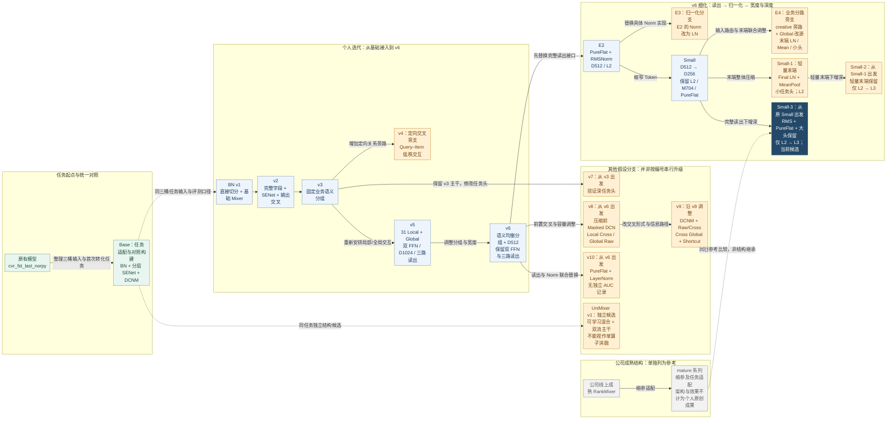

实线表示结构上的设计来源，虚线表示任务对照或参考关系，均不表示跨版本加载 Dense checkpoint。每个版本仍从自己的 Dense 冷启动开始，之后只接续本版本前一天的参数。图中的 v1 指有源码的 BN v1；0909 表中另一个无对应源码的最初 `rankmixer_v1` 不纳入结构继承链。

这条迭代路线的重点是逐步缩小问题范围：v1～v3 先处理输入组织，v4～v9 从不同位置检查交互与信息保留，v10 和 E2/E3 分开研究读出与归一化，最后在 Small 上把宽度、末端和深度拆成不同分支。Small-2 与 Small-3 来自两条不同末端，不能画成串行升级。UniMixer 同时改变多个模块，单列为独立候选。mature 来自公司已有成熟结构，只用于缩参适配和参考比较。

### 1.3 当前结果

目前继续推进的是 `cvr_bn_rankmixer_v6_e2_small_3`，下文简称 Small-3。它在两层 Small 的基础上增加一层同构 Block，保留 D256、RMSNorm 和完整展平读出。8 月 16 日至 20 日，Small-3 的 AUC 每天都高于 Small，五日平均提高 **0.0001892**；相对更宽的 E2，Dense 参数少约 **31.24%**，共同五日平均 AUC 高 **0.0001354**。

我自己的方案目前仍未超过同日 Base。最新已有测试日 8 月 20 日，Small-3 为 **0.869335**，Base 为 **0.869504**，还差 **0.000169**。下面列出已有同日记录支持的几项变化，具体实现和逐日表现分别在第二、三部分展开。

| 对比 | 共同测试日 | 天数 | 首日差值 | 全窗口平均差值 |
| --- | --- | --- | --- | --- |
| v2 → v3 | 07-02 | 1 | +0.000301 | +0.00030100 |
| v3 → v5 | 07-02～07-04 | 3 | +0.000756 | +0.00063767 |
| v5 → v6 | 08-16 | 1 | +0.001854 | +0.00185400 |
| v6 → E2 | 08-16～08-19 | 4 | +0.000545 | +0.00047925 |
| E2 → Small | 08-16～08-21 | 6 | -0.000052 | -0.00004133 |
| Small → Small-3 | 08-16～08-20 | 5 | +0.000049 | +0.00018920 |
| E2 → Small-3 | 08-16～08-20 | 5 | -0.000003 | +0.00013540 |

差值均为右侧版本减左侧版本，按共同测试日等权平均。多模块一起改变的实验，收益按整套方案记录，不拆成单个模块的贡献。完整数据集中在第五部分。

代码名带 `mature` 的版本是根据公司线上成熟 RankMixer 缩小参数并适配当前任务的参考方案，第四部分单独介绍，不计入我自行提出的架构成果。

## 2. RankMixer v1～v10 的改进

前期迭代主要围绕三个位置展开：字段怎样形成 Token，Token 之间怎样交互，以及交互后的表示怎样进入预测头。下面先交代对照模型和共用的计算方式，再按版本说明改动及结果。UniMixer 是这一阶段的补充尝试，放在本部分末尾。

各版本保留独立流程图和配置表。橙色标出变化或该细节图的重点，蓝色表示沿用模块，灰色为说明；实线表示数据流，虚线表示说明或对照关系。结果表中的“首日”为 Dense 冷启动、Sparse Embedding 热启动后的首次测试，“续训”为后续逐日热启动后的测试。

### 2.1 输入、Base 与共用结构

#### 统一输入与对照模型

模型预测搜索候选的首次转化概率，主指标为 `fst_CVR` 的 AUC，COPC 用于观察整体预估量与实际正例量的偏差。各方案使用相同的三桶稀疏特征，改动集中在现有特征的组织方式和 Dense 建模部分。

| 特征桶 | 字段数 | 单字段 Embedding 维度 | 展平宽度 | 主要内容 |
|---|---:|---:|---:|---|
| common | 385 | 17 | 6,545 | 用户画像、Query、行为、会话和上下文 |
| item | 835 | 17 | 14,195 | 商品属性、相关性、价格偏好、统计和召回信息 |
| creative | 14 | 17 | 238 | 创意、展示和促销信息 |
| 合计 | 1,234 | 17 | 20,978 | 字段集合保持一致 |

我在特征组织上做的调整，是重新安排这些已有字段进入哪些 Token、在什么位置交互，以及如何送入预测头。字段含义和分组依据可追溯到 [特征清单](/Users/goku/Documents/Codex/RSA_code_0816/docs/features/rankmixer_v2_三桶数据特征清单.txt)。

在设计 RankMixer 之前，我需要一个输入和任务口径清楚、能够反复对照的起点。我从 `cvr_fst_last_norpy.py` 改编出 `cvr_bn_senet_dcnm_fst.py`，整理 common、item、creative 三桶输入，去掉当前对照中不用的数值、DIN 序列和 gattr 路径，并为 last-CVR 及相关分支增加开关。这样，后续可以集中比较同一组特征怎样被 Dense 网络组织，而不是把增加特征或改变任务带来的差异混在一起。

**算法流程图：Base：整理任务与输入，保留原有交叉塔**

```mermaid
%%{init: {"look": "classic", "flowchart": {"nodeSpacing": 18, "rankSpacing": 18, "padding": 6, "wrappingWidth": 100}}}%%
flowchart LR
    subgraph SG_senet["继承：字段级分层 SENet"]
        N_stats["逐字段取17维均值<br/>得到 c / i / a 统计"]
        N_gates["分层 SENet 门控<br/>c；[c,i]；[c,i,a]<br/>隐层128，2×Sigmoid"]
        N_scale["字段门控 × Embedding<br/>同字段17维共享gate"]
    end
    subgraph SG_dcnm["继承：DCNM 单元 × 2"]
        N_crossin["当前层输入 zℓ<br/>首层 z₀=x₀"]
        N_low["低秩两次线性投影<br/>20,978→500→20,978"]
        N_product["与原始 x₀ 逐元素相乘"]
        N_add["加回 zℓ → LayerNorm"]
    end
    N_input["三桶稀疏字段<br/>385 / 835 / 14"]
    N_select["整理当前任务输入<br/>数值/序列/gattr移出"]
    N_embed["每字段 Embedding 17维<br/>共 20,978维"]
    N_bn["分桶 BN"]
    N_concat["三桶拼接 x₀<br/>20,978维"]
    N_mlp["MLP 2048→2048→256<br/>各层 BN + 激活"]
    N_logit["线性投影 → logit<br/>截断 + Sigmoid"]
    N_out["首次转化概率"]
    N_input --> N_select
    N_select --> N_embed
    N_embed --> N_bn
    N_bn --> N_stats
    N_stats --> N_gates
    N_gates -->|"字段gate"| N_scale
    N_bn -->|"字段向量"| N_scale
    N_scale --> N_concat
    N_concat --> N_crossin
    N_crossin --> N_low
    N_low --> N_product
    N_concat -->|"固定 x₀"| N_product
    N_product --> N_add
    N_crossin -->|"层残差"| N_add
    N_add -->|"两层后"| N_mlp
    N_mlp --> N_logit
    N_logit --> N_out
    classDef input fill:#e9f5ef,stroke:#6a9e84,color:#174b34;
    class N_input input;
    classDef unchanged fill:#edf4fc,stroke:#7290b1,color:#183a5e;
    class N_embed,N_bn,N_stats,N_gates,N_scale,N_concat,N_crossin,N_low,N_product,N_add,N_mlp,N_logit unchanged;
    classDef changed fill:#fff0d4,stroke:#ca8425,color:#71400d;
    class N_select changed;
    classDef output fill:#244968,stroke:#244968,color:#ffffff;
    class N_out output;
```

相对原模型，调整的是三桶输入与首次转化任务口径，移除本对照不用的数值、DIN 序列、gattr 路径并增加任务开关；BN、分层 SENet、DCNM500 及 MLP 均为继承。Base 不使用 Token，T/D/L 不适用；图中展开一个 DCNM 单元，独立堆叠两次。

**模块与配置变化**

| 模块 / 配置项 | 对照版本：cvr_fst_last_norpy | 本版 |
| --- | --- | --- |
| 输入路径 | 原模型包含数值、DIN序列、gattr等路径 | 整理为common/item/creative三桶 |
| 任务设置 | 原有first/last及相关任务分支 | 按首次转化口径配置，增加分支开关 |
| 字段门控 | 字段级分层SENet，隐层128 | 继承 |
| 显式交叉 | 两层DCNM，低秩宽度500 | 继承 |
| 任务头隐藏层 | 2048 / 2048 / 256 | 继承 |
| Token配置 T/D/L/M | 不使用RankMixer Token | 不使用RankMixer Token |

BN、字段级分层 SENet、两层 DCNM500 和 `[2048,2048,256]` 任务头均继承自原模型。我的贡献是任务适配、整理和对照构建，不把这些已有模块当作自己提出的结构。

Base 对我后续设计的启发主要有两点。首先，输入不仅需要对齐尺寸，还需要根据样本调整字段权重。令 $e_j\in\mathbb R^{17}$ 是某字段的 BN 后表示，字段统计为 $s_j=17^{-1}\sum_{r=1}^{17}e_{j,r}$。将三桶统计分别记为 $s_c,s_i,s_a$，门控依赖为：

$$
g_c=q_c(s_c),\qquad g_i=q_i([s_c;s_i]),\qquad
g_a=q_a([s_c;s_i;s_a]),\qquad \widetilde e_j=g_j e_j.
$$

在当前启用 SENet BN 的路径中，$q(u)=2\sigma(\tanh(\operatorname{BN}(uW_1))W_2)$，隐层宽度为 128。每个字段共享一个 gate 到它的 17 个维度；item 和 creative 的权重还依赖前面桶的信息。这解释了我为什么在 v2 中补回这一条已有路径：希望先保留基线已经具备的字段选择能力，再检验 Mixer，而不是让最初的结构对照同时缺少输入门控。

其次，Base 在压缩前对完整字段向量做显式交叉。令 $x_0\in\mathbb R^{20978}$ 为 SENet 后的拼接向量，当前默认无 cross 激活的两层 DCNM 可写为：

$$
z_0=x_0,\qquad
z_{\ell+1}=\operatorname{LN}\!\left(z_\ell+x_0\odot\left[(z_\ell V_\ell+b_{\ell,1})U_\ell+b_{\ell,2}\right]\right),\quad \ell=0,1,
$$

$$
V_\ell\in\mathbb R^{20978\times500},\qquad U_\ell\in\mathbb R^{500\times20978}.
$$

这条路径先用低秩映射控制参数，再与 $x_0$ 逐元素相乘，最后保留原层残差。它使我关注一个问题：RankMixer 是否在字段进入 Token 时，就压掉了原本有用的交叉信息？v8、v9 因此把交叉位置移到 Token 投影之前；v7、E2 则从任务头和读出端检查另一种可能的信息损失。

Base 在两条实验链均有连续结果，详细数值见第五部分。它是当前仍需超越的完整方案，不能因为我借鉴了其中某个模块，就预先认定该模块单独解释了它的领先。源码的部分分支默认仍为开启，复现时必须连同实际 args 核对任务设置。

#### 符号与训练目标

为使各版本的变化可以直接比较，下文用 $e$ 表示单个样本的字段表示，$X\in\mathbb R^{T\times D}$ 表示 Token 矩阵。公式省略 batch 维；Token 重排、投影等按样本执行，BN 在训练时依赖批内统计；`vec` 只展平该样本的 Token 或字段维度。

| 记号 | 在本项目中的含义 |
|---|---|
| $F,E$ | 字段数和单字段 Embedding 维度，本任务为 $1234,17$ |
| $T,D,H,L$ | Token 数、Token 宽度、Mixing 的 head 数和完整 Block 数 |
| $M$ | FFN 中间宽度；v5、v6 及 Small 主线的 SwiGLU 中间宽度保持 704，不能默认随 $D$ 等比例变化 |
| $G_t$ | 第 $t$ 个 Local Token 对应的字段集合 |
| $P,P^{-1}$ | 无参数 Mixing 及其逆置换 Reverting |
| $[a;b]$、$a\odot b$ | 拼接、逐元素乘法 |
| $\phi,\sigma$ | 对应代码路径的激活函数、Sigmoid；若有固定 GELU/Swish 选择，在相关小节单独说明 |

模型侧沿用上游 `fst_cvr_label` 作为目标，Small-3 用二分类 log loss 训练：

$$
\widehat y_i=\sigma(z_i),\qquad
\mathcal L=-\frac1N\sum_{i=1}^{N}\left[y_i\log\widehat y_i+(1-y_i)\log(1-\widehat y_i)\right].
$$

公式表示主任务损失，数值实现使用框架的 log loss。下文预测式中的 MLP 下标列出隐藏层尺寸，默认还包含最后映射到单个 logit 的线性输出层。AUC 负责评价排序，COPC 负责描述总体预测尺度；结构改动有可能改善其中一项而损害另一项。这里研究的“首次转化”遵循团队上游标签口径，不把字段名自行展开为用户人生首单等未经样本生成规则确认的定义。

我把 Dense 冷启动协议与结构继承分开：$v_{k+1}$ 在代码上参考 $v_k$，不意味着加载 $v_k$ 的 Dense 权重。Sparse 热启动也不表示冻结；后续训练中稀疏参数仍可更新。因此，这些实验评价的是共同初始化协议下的完整学习结果。

#### 原始 RankMixer 与双 FFN 的来源

原始 [RankMixer 论文](/Users/goku/Documents/Codex/RSA_code_0816/docs/papers/RankMixer/RankMixer.pdf) 第 3.1 节、图 1 的一个 Block 只有一个 Per-token FFN 阶段：

$$
S=\operatorname{LN}(P(X)+X),\qquad Y=\operatorname{LN}(\operatorname{PFFN}(S)+S).
$$

PFFN 对每个 Token 使用独立的两层 MLP；其中两个全连接层共同组成一个 FFN，不能与“两个 FFN 阶段”混为一谈。固定 Mixing 通过 `reshape → transpose → reshape` 改变分片的组织方式，本身没有注意力权重或可训练的交互矩阵。

v5 起采用的 Mixing–FFN–Reverting–FFN 思路对应 [TokenMixer-Large 论文](/Users/goku/Documents/Codex/RSA_code_0816/docs/papers/TokenMixer-Large/TokenMixer-Large.pdf) 第 3.3.1 节和图 1：先在重排空间交互，再恢复 Token 布局并更新。因此，双 FFN、Reverting 和全局 Token 都有论文依据，不应写成我在 Small-3 中首次提出的结构。论文公式（12）、（16）与图 1、第 3.3.3 节在 Norm 位置和残差连接上存在表述差异。例如图 1 把首个 Norm 放在 Mixing 前，第二段加回第一段输出；本项目首个 Norm 在 Mixing 后，最终加回 Block 原始输入。本项目采用的具体公式以源码为准，不宣称逐项复现论文。

我的主要工作是围绕当前三桶字段、现有训练框架和实际 AUC 差距，选择与实现这些机制，并设计分组、定向交互、不同读出和宽深配置的对照。公司 mature 方案则有独立的来源，其缩参适配结果只作参考。本文各版本的 Block 数均按各自实现定义计数：Small-3 的三层包含六个 FFN 阶段，不能仅凭“三层”就与原始 RankMixer 或 mature 的三层等量比较。

**算法流程图：Block 对比：原始 RankMixer、TML 图 1 与本项目**

```mermaid
%%{init: {"look": "classic", "flowchart": {"nodeSpacing": 18, "rankSpacing": 18, "padding": 6, "wrappingWidth": 100}}}%%
flowchart LR
    subgraph SG_r_["原始 RankMixer：1 个 FFN 阶段"]
        N_r_x["输入 X"]
        N_r_p["固定 Mixing：P(X)"]
        N_r_a["X + P(X)<br/>LayerNorm → S"]
        N_r_f["Per-token FFN<br/>Linear→GELU→Linear"]
        N_r_b["S + FFN(S)<br/>LayerNorm"]
        N_r_y["Block 输出 Y"]
    end
    subgraph SG_t_["TokenMixer-Large：按图 1"]
        N_t_x["输入 X"]
        N_t_n["RMSNorm(X)"]
        N_t_p["Mixing"]
        N_t_f["第一前馈阶段<br/>pSwiGLU / S-P MoE"]
        N_t_r["Reverting"]
        N_t_a["加回 X<br/>第一段输出 U"]
        N_t_n2["RMSNorm(U)"]
        N_t_f2["第二前馈阶段<br/>pSwiGLU / S-P MoE"]
        N_t_a2["加回 U"]
        N_t_y["Block 输出 Y"]
    end
    subgraph SG_s_["本项目 v5 起：以 Small-3 为例"]
        N_s_x["输入 X"]
        N_s_p["先 Mixing<br/>m = P(X)"]
        N_s_n["后 RMSNorm(m)"]
        N_s_f["第一套 pSwiGLU"]
        N_s_a["加回 m<br/>h = m + update"]
        N_s_r["Reverting(h)<br/>得到 r"]
        N_s_n2["RMSNorm(r)"]
        N_s_f2["第二套 pSwiGLU"]
        N_s_a2["加回原始输入 X<br/>不是加回 r"]
        N_s_y["Block 输出 Y"]
    end
    N_r_x --> N_r_p
    N_r_p --> N_r_a
    N_r_x -->|"残差 X"| N_r_a
    N_r_a --> N_r_f
    N_r_f --> N_r_b
    N_r_a -->|"残差 S"| N_r_b
    N_r_b --> N_r_y
    N_t_x --> N_t_n
    N_t_n --> N_t_p
    N_t_p --> N_t_f
    N_t_f --> N_t_r
    N_t_r --> N_t_a
    N_t_x -->|"残差 X"| N_t_a
    N_t_a --> N_t_n2
    N_t_n2 --> N_t_f2
    N_t_f2 --> N_t_a2
    N_t_a -->|"残差 U"| N_t_a2
    N_t_a2 --> N_t_y
    N_s_x --> N_s_p
    N_s_p --> N_s_n
    N_s_n --> N_s_f
    N_s_f --> N_s_a
    N_s_p -->|"残差 m"| N_s_a
    N_s_a --> N_s_r
    N_s_r --> N_s_n2
    N_s_n2 --> N_s_f2
    N_s_f2 --> N_s_a2
    N_s_x -->|"长残差 X"| N_s_a2
    N_s_a2 --> N_s_y
    classDef input fill:#e9f5ef,stroke:#6a9e84,color:#174b34;
    class N_r_x,N_t_x,N_s_x input;
    classDef unchanged fill:#edf4fc,stroke:#7290b1,color:#183a5e;
    class N_r_p,N_r_a,N_r_b,N_t_p,N_t_a,N_t_n2,N_s_p,N_s_a,N_s_n2 unchanged;
    classDef changed fill:#fff0d4,stroke:#ca8425,color:#71400d;
    class N_r_f,N_t_n,N_t_f,N_t_r,N_t_f2,N_t_a2,N_s_n,N_s_f,N_s_r,N_s_f2,N_s_a2 changed;
    classDef output fill:#244968,stroke:#244968,color:#ffffff;
    class N_r_y,N_t_y,N_s_y output;
```

原始 RankMixer 分支按论文公式（1）绘制；TokenMixer-Large 分支按论文图 1（图中前馈可采用 S-P MoE）绘制，并不把其公式（12）（16）中不同的 Norm/残差写法混入图中；本项目分支严格对应实际代码。两套 FFN 是已有论文思路，当前实现首个 Norm 的位置与最后残差的起点另有区别。

### 2.2 v1：接入 RankMixer，建立第一版对照

我首先要回答的是：沿用现有三桶稀疏特征，把 Dense 建模部分换成 RankMixer 后，这条链路能否有效学习当前 CVR 任务。因此，BN v1 优先完成从 Embedding、分桶 BN、Token 投影到 Mixer 和预测输出的完整接入。它使用原始 RankMixer 的固定重排与 Per-token FFN 思路，采用 16 个 Token、768 维表示和两层 Block，先用较直接的均值池化加线性层输出概率，为后续改动提供可运行的起点。

**算法流程图：BN v1：从直接切分到基础 Mixer**

```mermaid
%%{init: {"look": "classic", "flowchart": {"nodeSpacing": 18, "rankSpacing": 18, "padding": 6, "wrappingWidth": 100}}}%%
flowchart LR
    subgraph SG_block["RankMixer Block × 2；每层1套FFN"]
        N_bin["当前 Block 输入 x"]
        N_mix["固定 Mixing<br/>reshape→transpose"]
        N_ln1["x + Mixing(x)<br/>LayerNorm₁ 得到 s"]
        N_ln2["FFN 前 LayerNorm₂"]
        N_ffn["独立 Per-token FFN<br/>768→3072→768<br/>GELU"]
        N_ln3["s + FFN 输出<br/>LayerNorm₃"]
    end
    N_input["三桶 Embedding<br/>385 / 835 / 14 ×17"]
    N_bn["分桶 BN"]
    N_flat["拼接 20,978维"]
    N_split["按坐标切16段<br/>15×1311 + 1313"]
    N_proj["每段独立 Linear + GELU<br/>T=16，D=768"]
    N_pool["16个Token取均值<br/>768维"]
    N_head["线性 768→1<br/>截断 + Sigmoid"]
    N_out["首次转化概率"]
    N_note["每字段17维<br/>切段未对齐字段边界"]
    N_input --> N_bn
    N_bn --> N_flat
    N_flat --> N_split
    N_split --> N_proj
    N_proj --> N_bin
    N_bin --> N_mix
    N_mix --> N_ln1
    N_bin -->|"残差"| N_ln1
    N_ln1 --> N_ln2
    N_ln2 --> N_ffn
    N_ffn --> N_ln3
    N_ln1 -->|"残差 s"| N_ln3
    N_ln3 -->|"堆叠2层后"| N_pool
    N_pool --> N_head
    N_head --> N_out
    N_split -.-> N_note
    classDef input fill:#e9f5ef,stroke:#6a9e84,color:#174b34;
    class N_input input;
    classDef unchanged fill:#edf4fc,stroke:#7290b1,color:#183a5e;
    class N_bn unchanged;
    classDef changed fill:#fff0d4,stroke:#ca8425,color:#71400d;
    class N_flat,N_split,N_proj,N_bin,N_mix,N_ln1,N_ln2,N_ffn,N_ln3,N_pool,N_head changed;
    classDef output fill:#244968,stroke:#244968,color:#ffffff;
    class N_out output;
    classDef note fill:#f5f6f8,stroke:#a3adb8,color:#435161,stroke-dasharray:4 3;
    class N_note note;
```

保留三桶 Embedding 和 BN；以切段投影、两层固定 Mixing/PFFN、MeanPool 与线性输出替换 Base 的 SENet/DCNM/深任务头。T=H=16，D=768，L=2，FFN中间维3072。按坐标切段可能切开17维字段；图中残差均来自当层输入或第一次 Add&LN 后的表示。

**模块与配置变化**

| 模块 / 配置项 | 对照版本：Base | 本版 |
| --- | --- | --- |
| T / H / D / L | Base不使用Token | 16 / 16 / 768 / 2 |
| Token分组 | 不使用Token | 20,978维切16段：15×1311+1313 |
| 输入门控 | 字段级分层SENet | 未接入SENet |
| 交互主干 | 两层DCNM500 | 固定Mixing + 独立PFFN |
| 每Block FFN数 / 中间维M | 不适用 | 1套 / 3072（4D） |
| Block归一化 | DCNM每层残差后LN | Mixing后LN + FFN前LN + FFN后LN |
| 读出 / 任务头 | 全维交叉输出 / 2048-2048-256 | MeanPool 768维 / Linear→1 |

具体地，设三桶 BN 后拼接得到的向量为 $e\in\mathbb{R}^{20978}$，我将其切成 16 段，每段独立投影：

$$
x_t=\operatorname{GELU}(e_{I_t}W_t+b_t),\qquad x_t\in\mathbb{R}^{768}.
$$

这里 $I_t$ 是第 $t$ 段的坐标集合，$W_t,b_t$ 各段独立。固定 Mixing 算子 $P$ 通过 reshape 和 transpose 交换 Token 与分片的组织方式，不计算注意力权重；其后的 FFN 才用学习参数联合处理混入当前 Token 的信息。v1 的实际 Block 为：

$$
s=\operatorname{LN}_1(x+P(x)),\qquad
x'=\operatorname{LN}_3\bigl(s+F(\operatorname{LN}_2(s))\bigr),
$$

$$
F_t(u)=\operatorname{GELU}(uW_{t,1}+b_{t,1})W_{t,2}+b_{t,2},
\qquad 768\rightarrow3072\rightarrow768.
$$

每个 Token 有自己的 FFN 参数；这里的两次线性投影共同组成一套 FFN。与后续 v2 相比，v1 还多了一次 FFN 前的 LN。末端把 16 个 Token 平均成一个 768 维向量，再经线性层和 Sigmoid 预测。

跑通以后，我首先检查输入组织，而没有把 AUC 差距简单理解为“网络还不够大”。20,978 维的切法是 `15×1311 + 1313`，而一个字段的完整 Embedding 是 17 维，1,311 不能被 17 整除。这意味着同一字段会被切到两个 Token 中，一些 Token 还跨过 common、item、creative 的桶边界。固定重排本身不会知道这些边界，后面的独立 FFN 只能从这种输入安排中学习。此外，v1 没有保留 Base 的字段级 SENet 和显式交叉，均值池化也直接赋予所有 Token 相同权重。这些都是可以定位到代码、继续检验的问题。

**逐日实验数据（0909 汇总）**

对照版本为 Base；差值均为本版减对照。只配对同一测试日，空值“—”表示对照无记录。

| 测试日 | 阶段 | BN v1 AUC | Base AUC | ΔBase | COPC |
| --- | --- | --- | --- | --- | --- |
| 07-02 | 首日 | 0.862033 | 0.864538 | −0.002505 | 0.987065 |
| 07-03 | 续训 | 0.862850 | 0.865633 | −0.002783 | 0.984521 |
| 07-04 | 续训 | 0.864362 | 0.867060 | −0.002698 | 1.017144 |
| 07-05 | 续训 | 0.863436 | 0.866114 | −0.002678 | 1.000928 |

| 统计窗口 | 本版天数 | 本版平均AUC | 平均ΔBase |
| --- | --- | --- | --- |
| 首日 | 1 | 0.86203300 | −0.00250500 |
| 后续热启动 | 3 | 0.86354933 | −0.00271967 |
| 本链全部已有日期 | 4 | 0.86317025 | −0.00266600 |

来源：Sheet1 AUC 单元格 G26, G27, G28, G29；COPC 取各自相邻列。均值为测试日等权平均，不表示独立重复实验。

在 7 月 2 日，BN v1 的 AUC 为 **0.862033**，比同日 Base 低 **0.002505**；7 月 2 日至 5 日四个测试日全部低于 Base，平均差距为 **0.002666**。后续热启动没有消除这一差距，因此下一版优先处理字段边界、输入加权和基础交叉路径。Excel 中另有最早的 `rankmixer_v1`，但目前没有其对应源码；本文不将它与 BN v1 混为一个版本，也不根据二者数值差异推断具体模块的作用。

### 2.3 v2：保留完整字段，调整输入与输出交互

v2 的目标是把基础实现中的几个明显问题一起修正，让后续实验建立在更合理的输入上。我先将切分单位从“向量坐标”改成“完整字段”，在 common、item、creative 内分别生成 5、10、1 个 Token。每个字段的 17 维表示完整进入一个分组，同一个 Token 不再跨桶；这一版按桶内已有字段顺序均衡切组，还没有进一步做业务语义分类。

**算法流程图：v2：完整字段、输入门控与桶间交叉**

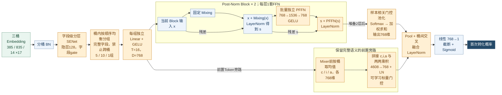

相对 BN v1，新增完整字段分组、恢复基线 SENet、增加门控池化与前置桶间交叉；FFN从3072缩至1536，并删除额外的FFN前LN。T=H=16，D=768，L=2。批量FFN仍为不同Token保存独立参数。

**模块与配置变化**

| 模块 / 配置项 | 对照版本：BN v1 | 本版 |
| --- | --- | --- |
| T / H / D / L | 16 / 16 / 768 / 2 | 保留 |
| Token分组 | 按坐标切16段，可切开字段 | 完整字段；桶内顺序均衡5/10/1组 |
| 输入门控 | 无SENet | 恢复Base字段级分层SENet |
| 每Block FFN数 / 中间维M | 1套 / 3072（4D） | 1套 / 1536（2D） |
| Block归一化 | 3处LN | 2处Post-LN，删除额外FFN前LN |
| 读出 / 任务头 | MeanPool / Linear→1 | 门控池化 + 桶间残差 + LN / Linear→1 |
| FFN计算 / 训练修正 | 逐Token独立计算 / 重置op未实际执行 | 批量独立矩阵乘 / 恢复后执行里程碑重置 |

与此同时，我把 Base 中已有的分层 SENet 接回输入端，让字段在压缩成 Token 前先获得样本相关的权重。记字段向量为 $e_f$，字段统计为 $s$，则可概括为 $\tilde e_f=2\sigma(g_f(s))e_f$；其中 $g_f$ 表示分层 SENet 为字段 $f$ 计算的门控 logit，common、item、creative 使用不同的分层条件输入。之后再按完整字段组 $G_t$ 构造 Token：

$$
x_t=\operatorname{GELU}\left(\operatorname{Concat}_{f\in G_t}(\tilde e_f)W_t+b_t\right).
$$

这里恢复的是现有基线的字段加权能力。我的工作是将其接入新的 Token 路径，并处理各桶字段展开、分组、投影之间的对应关系；SENet 本身不是本阶段新提出的模块。

主干方面，我删除 v1 中连续出现的额外归一化，将 FFN 中间宽度从 $4D$ 改成 $2D$，即 `768→1536→768`，保留一层 Mixing 和一套 PFFN 的结构：

$$
s=\operatorname{LN}(x+P(x)),\qquad
x'=\operatorname{LN}(s+F(s)).
$$

这样调整是为了先减少不必要的归一化和过大的 FFN 容量，再观察输入修正后的表现。我还将逐 Token 调用的 FFN 改成批量矩阵乘：权重包含 Token 维，例如 $W_1\in\mathbb{R}^{T\times D\times2D}$，因此合并了计算组织方式，但没有把不同 Token 的参数变成共享参数。

输出端需要回答两个问题：不同样本是否应强调不同 Token，以及三桶之间能否保留更直接的交叉通路。针对前者，我把均值池化改成 $z_{\mathrm{pool}}=\sum_t\alpha_t h_t$，其中 $\alpha_t=\operatorname{softmax}_t(w^\top h_t)$，$h_t$ 是末层 Token；评分权重从零开始，使初始池化等同于均值池化。针对后者，我从 Mixer 前的 Token 分别得到三桶均值 $c,i,a$，把 $[c;i;a;c\odot i;c\odot a;i\odot a]$ 投影并归一化，再通过可学习标量门控加到池化表示上。这样既保留隐式的 Mixer 交互，也提供一个低成本的桶间乘性路径。训练实现上，我还处理了参数恢复后的学习率里程碑重置，使已有重置操作被实际执行；这项修正没有单独的 AUC 消融结果。

**逐日实验数据（0909 汇总）**

对照版本为 BN v1；差值均为本版减对照。只配对同一测试日，空值“—”表示对照无记录。

| 测试日 | 阶段 | v2 AUC | ΔBase | BN v1 AUC | ΔBN v1 | COPC |
| --- | --- | --- | --- | --- | --- | --- |
| 07-02 | 首日 | 0.862690 | −0.001848 | 0.862033 | +0.000657 | 1.015013 |

来源：Sheet1 AUC 单元格 J26；COPC 取各自相邻列。均值为测试日等权平均，不表示独立重复实验。

7 月 2 日，v2 的 AUC 为 **0.862690**，比 BN v1 高 **0.000657**，但仍低于 Base **0.001848**。这说明整套基础修正在首日取得了改善，无法据此把收益分别归给完整字段、SENet、交叉或训练修正。由于 v2 只有这一个测试日，下一步我保留其主干和输出配置，集中检查一个更具体的问题：字段虽然完整了，分到同一个 Token 中的内容是否仍过于杂乱。

**算法流程图：模块对比：删除额外Pre-LN，并缩小FFN**

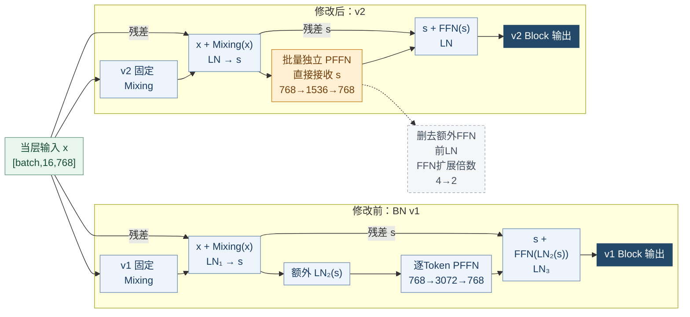

图中两条分支分别表示 v1 与 v2 的 Block 实现，彼此不串接。v1有三次LN，v2删除紧接Mixing后LN的额外FFN前LN，保留两次Add&LN；同时FFN中间宽度3072→1536。T=16，D=768，各自堆叠L=2；两路每个Block都只有一套PFFN，批量矩阵乘不改变Token参数独立性。

### 2.4 v3：按业务语义组织 Token

完整字段并不等于合理的 Token。v2 按顺序均衡切分，能避免切开 Embedding，却可能把用户画像、Query 和实时行为放进同一个压缩投影。Per-token FFN 为不同 Token 配置独立参数，如果输入组本身缺少清楚的含义，这种独立性就未必用在最需要的地方。因此，v3 保留 v2 的 `16 Token、D768、两层主干、门控池化与桶间交叉`，把主要工作放到固定业务语义分组上。

**算法流程图：v3：固定语义组，保持其余主干与读出**

```mermaid
%%{init: {"look": "classic", "flowchart": {"nodeSpacing": 18, "rankSpacing": 18, "padding": 6, "wrappingWidth": 100}}}%%
flowchart LR
    subgraph SG_block["Post-Norm Block × 2；每层1套FFN"]
        N_bin["当前 Block 输入 x"]
        N_mix["固定 Mixing"]
        N_ln1["x + Mixing(x)<br/>LayerNorm 得到 s"]
        N_ffn["批量独立 PFFN<br/>768→1536→768<br/>GELU"]
        N_ln2["s + PFFN(s)<br/>LayerNorm"]
    end
    subgraph SG_crossbranch["保留完整语义的前置旁路"]
        N_means["Mixer前按桶取均值<br/>c / i / a，各768维"]
        N_cross["拼接 c,i,a 与两两乘积<br/>4608→768 + LN<br/>可学习标量门控"]
    end
    N_input["三桶 Embedding<br/>385 / 835 / 14 ×17"]
    N_bn["分桶 BN"]
    N_senet["字段级分层 SENet<br/>隐层128，字段gate"]
    N_group["固定语义字段集合<br/>common/item/creative<br/>5 / 10 / 1组"]
    N_proj["每组独立 Linear + GELU<br/>T=16，D=768"]
    N_pool["样本相关门控池化<br/>Softmax → 加权求和<br/>输出768维"]
    N_fusion["Pool + 桶间交叉<br/>融合 LayerNorm"]
    N_head["线性 768→1<br/>截断 + Sigmoid"]
    N_out["首次转化概率"]
    N_map["字段ID → Tensor映射<br/>覆盖/重复/桶归属校验"]
    N_input --> N_bn
    N_bn --> N_senet
    N_senet --> N_map
    N_group --> N_proj
    N_proj --> N_bin
    N_bin --> N_mix
    N_mix --> N_ln1
    N_bin -->|"残差"| N_ln1
    N_ln1 --> N_ffn
    N_ffn --> N_ln2
    N_ln1 -->|"残差 s"| N_ln2
    N_ln2 -->|"堆叠2层后"| N_pool
    N_proj -->|"前置Token旁路"| N_means
    N_means --> N_cross
    N_pool --> N_fusion
    N_cross --> N_fusion
    N_fusion --> N_head
    N_head --> N_out
    N_map --> N_group
    classDef input fill:#e9f5ef,stroke:#6a9e84,color:#174b34;
    class N_input input;
    classDef unchanged fill:#edf4fc,stroke:#7290b1,color:#183a5e;
    class N_bn,N_senet,N_proj,N_bin,N_mix,N_ln1,N_ffn,N_ln2,N_pool,N_means,N_cross,N_fusion,N_head unchanged;
    classDef changed fill:#fff0d4,stroke:#ca8425,color:#71400d;
    class N_group,N_map changed;
    classDef output fill:#244968,stroke:#244968,color:#ffffff;
    class N_out output;
```

相对 v2，仅重新组织已有完整字段为固定业务语义组，并增加字段ID映射与校验；T=H=16，D=768，L=2，主干、门控池化和桶间交叉均保留，参数量不变。

**模块与配置变化**

| 模块 / 配置项 | 对照版本：v2 | 本版 |
| --- | --- | --- |
| T / H / D / L / M | 16 / 16 / 768 / 2 / 1536 | 保留 |
| Token数量分配 | common/item/creative：5/10/1 | 保留 |
| 组成员依据 | 桶内完整字段顺序均衡切分 | 固定业务语义字段ID集合 |
| 输入对应关系 | 沿桶内字段顺序分组 | 显式ID→Tensor映射及覆盖/重复/归属校验 |
| 投影参数 | 每组独立投影；目标768维 | 保留，重分组后投影参数总量不变 |
| 主干 / 读出 / 头 | 两层单PFFN / 门控池化+桶间交叉 / 线性 | 保留 |

我根据字段 ID 整理用户画像、消费价值、长期兴趣、Query、实时会话等 common 信息，并在 item 侧区分身份与质量、文本相关性、多模态、价格偏好、统计和召回信息。数学形式仍是组内拼接后独立投影，变化在于组的成员：

$$
G_t^{\mathrm{v2}}=\text{桶内相邻的一段字段},\qquad
G_t^{\mathrm{v3}}=\text{事先确定的业务语义字段集合}.
$$

$$
x_t^{\mathrm{v3}}=\operatorname{GELU}\left([\tilde e_f]_{f\in G_t^{\mathrm{v3}}}W_t+b_t\right).
$$

这没有新增特征，也没有改成共享投影。字段总数、Token 数和目标宽度不变，组间只重新分配输入，因此投影权重总量 $\sum_t17|G_t|D=17\cdot1234\cdot768$ 不变，整个版本的参数量也与 v2 相同。我的判断是：先让每个压缩投影接收更相关的信息，再让固定 Mixing 交换这些表示，比直接增加主干宽度更值得先验证。

这项工作还包含一部分容易被忽略的实现检查。实际 lookup 返回顺序不能直接当成业务字段顺序，我建立了字段 ID 到输入 Tensor 的映射，再按固定清单取值，并校验覆盖、重复和桶归属。如果同一个位置今天是 Query、明天变成另一个字段，即使张量形状没有变化，独立 Token 参数也会学到错误的对应关系。固定成员与顺序因此既服务于建模，也服务于后续 checkpoint 续训的一致性。

**逐日实验数据（0909 汇总）**

对照版本为 v2；差值均为本版减对照。只配对同一测试日，空值“—”表示对照无记录。

| 测试日 | 阶段 | v3 AUC | ΔBase | v2 AUC | Δv2 | COPC |
| --- | --- | --- | --- | --- | --- | --- |
| 07-02 | 首日 | 0.862991 | −0.001547 | 0.862690 | +0.000301 | 1.013880 |
| 07-03 | 续训 | 0.864324 | −0.001309 | — | — | 0.994684 |
| 07-04 | 续训 | 0.865902 | −0.001158 | — | — | 1.006273 |
| 07-05 | 续训 | 0.865013 | −0.001101 | — | — | 0.991048 |
| 07-06 | 续训 | 0.864862 | −0.001128 | — | — | 1.002946 |
| 07-07 | 续训 | 0.865544 | −0.001137 | — | — | 1.013556 |
| 07-08 | 续训 | 0.866401 | −0.001087 | — | — | 1.010243 |

| 统计窗口 | 本版天数 | 本版平均AUC | 平均ΔBase | 与v2配对天数 | 配对平均Δv2 |
| --- | --- | --- | --- | --- | --- |
| 首日 | 1 | 0.86299100 | −0.00154700 | 1 | +0.00030100 |
| 后续热启动 | 6 | 0.86534100 | −0.00115333 | 0 | — |
| 本链全部已有日期 | 7 | 0.86500529 | −0.00120957 | 1 | +0.00030100 |

配对均值仅使用“配对天数”对应的共同日期；本版全窗口均值不与对照的其他窗口直接相减。

来源：Sheet1 AUC 单元格 M26, M27, M28, M29, M30, M31, M32；COPC 取各自相邻列。均值为测试日等权平均，不表示独立重复实验。

7 月 2 日，v3 的 AUC 为 **0.862991**，比 v2 高 **0.000301**。这是比 v2 的组合修正更集中的分组对照，但仍只有一个共同测试日。v3 自身继续热启动到 7 月 8 日，七天仍全部低于 Base，差距由首日 **0.001547** 变为末日 **0.001087**，中间存在波动。于是，我保留语义组织这一方向，同时继续追问：搜索任务中最重要的 Query–Item 关系，是否值得提供一条直接的交叉路径；更广泛的全局信息又是否会在主干和池化中受到限制。这分别形成了 v4 和 v5 的不同尝试。

**算法流程图：模块对比：完整字段分组走向固定语义分组**

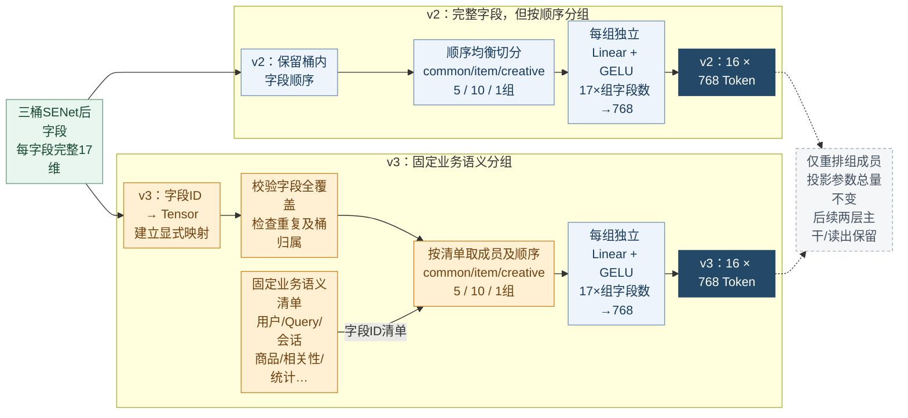

图中分别展示 v2 与 v3 的 Token 构造，两条分支互为对照。v2按桶内返回顺序把完整字段均衡切成5/10/1组；v3按字段ID映射和业务语义清单确定成员与顺序。已有1234字段均保留，每字段17维，T=16/D=768/L=2及后续主干读出不变；变化不是增加特征或共享投影。

### 2.5 v4：增加 Query–Item 定向交互

v3 有了固定语义 Token 后，我可以精确定位 Query 与商品信息，而不必仅依赖后续重排去碰到这些关系。搜索转化不仅取决于用户或商品单侧特征，也取决于候选与当前需求的匹配。因此，v4 在 v3 上增加两路低秩交叉：Query 对文本相关性，以及 Query 对商品身份与质量。这里要验证的是，给指定关系增加可学习的交互通道，能否补充现有 Mixer 和桶间交叉。

**算法流程图：v4：从 Mixer 前的语义 Token 构建 Q–I 交叉**

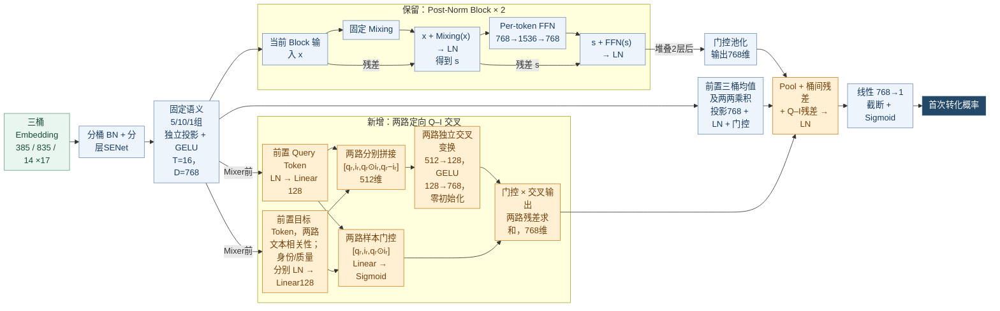

保留 v3 的三桶输入、SENet、语义分组、两层主干、门控池化及桶间交叉，新增两路 Query–Item 低秩残差。T=H=16，D=768，L=2。Query与目标均取自Mixer前；两路目标分别为文本相关性、商品身份与质量；输出投影零初始化，不代表实际继承v3 Dense checkpoint。

**模块与配置变化**

| 模块 / 配置项 | 对照版本：v3 | 本版 |
| --- | --- | --- |
| T / H / D / L / M | 16 / 16 / 768 / 2 / 1536 | 保留 |
| 三桶语义组 / 主干 | 5/10/1组；两层单PFFN | 保留 |
| 定向Q–I交叉 | 无 | 新增Query→文本相关性、Query→身份质量两路 |
| 交叉取值位置 / 低秩维 | 不适用 | Mixer前语义Token / 128 |
| 交叉构成 | 不适用 | q、i、q⊙i、q−i；小MLP+样本门控 |
| 新增路径初始化 | 不适用 | 输出128→768投影为零；仍独立Dense冷启 |
| 读出 / 任务头 | Pool+桶间交叉，经LN / Linear→1 | 增加Q–I残差后统一LN / Linear→1 |

我从 **Mixer 之前**读取 Query Token $q$ 与目标 Token $i_j$，分别归一化并投影到 $r=128$ 维；没有把重排后的某个位置继续当作纯粹的 Query。对于目标 $j$，新增路径可写为：

$$
q_r=\operatorname{LN}(q)W_q+b_q,\qquad
i_{j,r}=\operatorname{LN}(i_j)W_{i,j}+b_{i,j},
$$

$$
u_j=[q_r;i_{j,r};q_r\odot i_{j,r};q_r-i_{j,r}],\qquad
\delta_j=\gamma_j\left(\operatorname{GELU}(u_jW_{h,j}+b_{h,j})W_{o,j}+b_{o,j}\right).
$$

其中 $\odot$ 为逐元素乘法，$\gamma_j\in(0,1)$ 由两端表示及其乘积经 Sigmoid 得到，是随样本变化的门控。乘积用于表达联合响应，差值为网络提供两端差异，128 维中间表示则限制新增路径的规模。两路 $\delta_j$ 投回 768 维后作为并行残差加入读出，原有主干、门控池化和三桶交叉都保留。

实现时，我用语义组名称定位两端 Token，并为两路交叉建立独立变量作用域。输出投影 $W_{o,j},b_{o,j}$ 从零初始化，使新增分支初始输出为零，先控制它对主路径的扰动，再随训练学习更新。这里的零初始化不表示实际实验加载了 v3 Dense 参数；v4 与其他候选一样独立冷启动。源码中关于“恢复 v3 后预测不变”的注释描述的是一种条件情形，不能作为本次实验启动方式的依据。

**逐日实验数据（0909 汇总）**

对照版本为 v3；差值均为本版减对照。只配对同一测试日，空值“—”表示对照无记录。

| 测试日 | 阶段 | v4 AUC | ΔBase | v3 AUC | Δv3 | COPC |
| --- | --- | --- | --- | --- | --- | --- |
| 07-02 | 首日 | 0.862709 | −0.001829 | 0.862991 | −0.000282 | 0.995042 |

来源：Sheet1 AUC 单元格 P26；COPC 取各自相邻列。均值为测试日等权平均，不表示独立重复实验。

7 月 2 日，v4 的 AUC 为 **0.862709**，比 v3 低 **0.000282**。这次单日结果没有支持保留这一整套定向交叉，因此后续主线没有继续叠加它。我从中得到的直接反馈是：关系在业务上重要，不等于用当前低秩拼接、门控和接入位置就能改善 AUC；已有字段本身也可能包含相关性信息。后者只是可能解释，现有结果并未区分信息重复、参数学习或融合位置的影响。

### 2.6 v5：引入 Global Token 和双 FFN

v4 的结果让我把问题重新放回整个信息路径上：仅给个别语义关系补旁路，可能仍绕不开“先压缩成少量 Token，再汇总成一个向量”的限制。v5 因此回到 v3 这条设计基础，尝试一套幅度更大的结构调整。我的目标是让局部字段获得更细的表示，让全量输入有一个直接进入主干的位置，并让预测头同时读取全局、重点局部和带位置的局部信息。

**算法流程图：v5：31+1 Token、双空间交互与三路读出**

```mermaid
%%{init: {"look": "classic", "flowchart": {"nodeSpacing": 18, "rankSpacing": 18, "padding": 6, "wrappingWidth": 100}}}%%
flowchart LR
    subgraph SG_tokenize["输入组织：31 Local + 1 Global"]
        N_groups["冻结哈希均衡分组<br/>common/item/creative<br/>10 / 20 / 1组"]
        N_local["同宽组独立批量投影<br/>GELU + per-token RMS<br/>31 × 1024"]
        N_global["三桶SENet后全量输入<br/>20978→1024→1024<br/>GELU / Linear / RMS"]
        N_tokens["Local + Global<br/>T=H=32，D=1024"]
    end
    subgraph SG_block["完整 Block × 2；每层2套独立FFN"]
        N_bin["当层输入 x"]
        N_mix["固定 Mixing<br/>交换Token与分片轴"]
        N_fm["RMS → pSwiGLUₘ<br/>1024→704→1024"]
        N_addm["m + Fₘ(RMS(m))<br/>得到 h"]
        N_revert["Reverting(h)<br/>恢复原Token布局"]
        N_fo["RMS → pSwiGLUₒ<br/>1024→704→1024"]
        N_addo["x + Fₒ(RMS(r))<br/>加回当层原始输入 x"]
    end
    subgraph SG_readout["三路读出"]
        N_gread["保留 Global<br/>1024维"]
        N_pool["Global→Query 128维<br/>Local→Keys，Softmax<br/>条件加权池化 1024维"]
        N_flat["31个Local展平<br/>31744→512 + RMS<br/>可学习标量门控"]
        N_join["三路拼接<br/>1024 + 1024 + 512<br/>共 2560维"]
    end
    N_input["三桶 Embedding<br/>385 / 835 / 14 ×17"]
    N_bn["分桶 BN + 分层SENet"]
    N_final["Final per-token RMS<br/>提取31 Local与1 Global"]
    N_head["MLP 2048→2048→256<br/>BN + GELU；Linear→1"]
    N_out["截断 + Sigmoid<br/>首次转化概率"]
    N_input --> N_bn
    N_bn --> N_groups
    N_groups --> N_local
    N_bn -->|"SENet后"| N_global
    N_local --> N_tokens
    N_global --> N_tokens
    N_tokens --> N_bin
    N_bin --> N_mix
    N_mix --> N_fm
    N_fm --> N_addm
    N_mix -->|"残差 m"| N_addm
    N_addm --> N_revert
    N_revert --> N_fo
    N_fo --> N_addo
    N_bin -->|"长残差 x"| N_addo
    N_addo -->|"堆叠2层后"| N_final
    N_final -->|"Global"| N_gread
    N_final -->|"Global + Local"| N_pool
    N_final -->|"Local"| N_flat
    N_gread --> N_join
    N_pool --> N_join
    N_flat --> N_join
    N_join --> N_head
    N_head --> N_out
    classDef input fill:#e9f5ef,stroke:#6a9e84,color:#174b34;
    class N_input input;
    classDef unchanged fill:#edf4fc,stroke:#7290b1,color:#183a5e;
    class N_bn,N_bin unchanged;
    classDef changed fill:#fff0d4,stroke:#ca8425,color:#71400d;
    class N_groups,N_local,N_global,N_tokens,N_mix,N_fm,N_addm,N_revert,N_fo,N_addo,N_final,N_gread,N_pool,N_flat,N_join,N_head changed;
    classDef output fill:#244968,stroke:#244968,color:#ffffff;
    class N_out output;
```

相对 v3，组合替换为31 Local + 1 Global、D1024、两层Mixing/Reverting双FFN、RMS以及三路读出和深任务头。Local为冻结哈希均衡分组，不是业务语义分组；三路读出1024+1024+512=2560维。双FFN参考TokenMixer-Large，具体长残差按本项目源码连接。

**模块与配置变化**

| 模块 / 配置项 | 对照版本：v3 | 本版 |
| --- | --- | --- |
| T / H / D / L | 16 / 16 / 768 / 2 | 32 / 32 / 1024 / 2 |
| Local分组 / Global | 语义5/10/1；无独立Global | 冻结哈希均衡10/20/1；新增全量Global |
| 每Block FFN数 / 中间维M | 1套GELU PFFN / 1536 | 2套pSwiGLU / 704 |
| 交互顺序 | Mixing→PFFN | Mixing→FFNₘ→Reverting→FFNₒ |
| 归一化 / 残差 | 两处Post-LN；分段残差 | FFN前RMS；最终加回Block输入x |
| 读出宽度 | 门控池化+桶间残差，共768维 | Global1024 + 条件Pool1024 + 压缩Flat512 = 2560 |
| 任务头 / 下投影初始化 | 线性768→1 / 常规初始化 | 2048-2048-256→1 / 标准差0.01/√704 |

输入从 16 个 Token 改为 **31 个 Local Token 加 1 个 Global Token**，宽度由 768 变为 1,024，主干仍为两个完整 Block。Local 在三个桶内分配为 `10/20/1`，这一版用离线生成并冻结的**哈希均衡分组**控制每组输入规模；尽管函数名保留了 `semantic`，它并不是按业务含义整理的语义分组。Global 则由三桶 SENet 后的全量 20,978 维表示经 `20978→1024→1024` 生成。我希望它提供一条不依赖某个 Local 分组的全量输入路径，但这一路本身仍然经过可学习压缩，不能称为无损保留原始特征。

交互主干参考 **TokenMixer-Large 的 Mixing–Reverting 双 FFN 设计**，不再沿用 v1–v4 每层一套 PFFN 的形式。原始 RankMixer 每个完整 Block 只有一个 PFFN 阶段；这里增加两种坐标组织下的前馈处理，属于论文设计的任务适配，不能算作我的独立结构发明。按本项目源码，设 $P$ 为固定重排，$F_m,F_o$ 为参数独立的 Per-token SwiGLU，则：

$$
m=P(x),\qquad h=m+F_m(\operatorname{RMS}(m)),
$$

$$
r=P^{-1}(h),\qquad x'=x+F_o(\operatorname{RMS}(r)).
$$

第一套 FFN 在重排后的空间处理来自不同 Token 的分片；Reverting 恢复原 Token 的坐标组织，第二套 FFN 再整合这些已带有交互信息的分片。恢复布局不等于恢复原始数值。最后的长残差来自 Block 输入 $x$，不是 $r$，因此新增更新始终围绕输入通路累积。两套 FFN 均用以下 SwiGLU，而不是把普通两层 MLP 中的两个线性层称为“两套 FFN”：

$$
F_t(u)=\bigl((uW_{u,t}+b_{u,t})\odot\operatorname{SiLU}(uW_{g,t}+b_{g,t})\bigr)W_{d,t}+b_{d,t}.
$$

上投影与 gate 投影均从 $D=1024$ 进入 $M=704$，相乘后再投回 1,024 维；这个 $M$ 是独立配置，不是 $4D$ 或其他固定扩展倍数。我同时改用 FFN 前的 RMSNorm，并将下投影权重设为标准差 $0.01/\sqrt{704}$ 的小幅随机初始化，希望在增加非线性容量时控制初始更新幅度。归一化位置与残差以当前实现为准，不将它描述成 TokenMixer-Large 图式的逐项完全复现。

末端读出也随之调整。设最终 Global 为 $g$、Local 为 $l_t$，我用 Global 生成 query，从 Local 中计算条件加权汇总，并保留另一条 Local 展平压缩分支：

$$
\alpha_t=\operatorname{softmax}_t\left(\frac{(gW_Q)(l_tW_K)^\top}{\sqrt{128}}\right),\quad
p=\sum_t\alpha_t l_t,\quad
f=\beta\operatorname{RMS}\left(\operatorname{GELU}(\operatorname{vec}(l)W_f+b_f)\right),
$$

$$
z=[g;p;f]\in\mathbb{R}^{1024+1024+512}=\mathbb{R}^{2560}.
$$

这里 $\beta$ 是可学习标量门控。三路分别提供全局表示、当前样本更需要的局部汇总，以及固定位置下联合读取 Local 的投影；展平分支压缩到 512 维，仍可能丢失信息。拼接后改用 `[2048,2048,256]` 任务头。我的实现工作覆盖了 31 组输入清单与校验、同宽组的独立批量投影、Global 路径、Mixing/Reverting 及双 SwiGLU、初始化，以及三路读出到任务头的维度衔接。

**逐日实验数据（0909 汇总）**

对照版本为 v3；差值均为本版减对照。只配对同一测试日，空值“—”表示对照无记录。

**7 月独立训练链**

| 测试日 | 阶段 | v5 AUC | ΔBase | v3 AUC | Δv3 | COPC |
| --- | --- | --- | --- | --- | --- | --- |
| 07-02 | 首日 | 0.863747 | −0.000791 | 0.862991 | +0.000756 | 1.003826 |
| 07-03 | 续训 | 0.864929 | −0.000704 | 0.864324 | +0.000605 | 0.991724 |
| 07-04 | 续训 | 0.866454 | −0.000606 | 0.865902 | +0.000552 | 1.007756 |

| 统计窗口 | 本版天数 | 本版平均AUC | 平均ΔBase | 与v3配对天数 | 配对平均Δv3 |
| --- | --- | --- | --- | --- | --- |
| 首日 | 1 | 0.86374700 | −0.00079100 | 1 | +0.00075600 |
| 后续热启动 | 2 | 0.86569150 | −0.00065500 | 2 | +0.00057850 |
| 本链全部已有日期 | 3 | 0.86504333 | −0.00070033 | 3 | +0.00063767 |

配对均值仅使用“配对天数”对应的共同日期；本版全窗口均值不与对照的其他窗口直接相减。

来源：Sheet1 AUC 单元格 V26, V27, V28；COPC 取各自相邻列。均值为测试日等权平均，不表示独立重复实验。

**8 月独立训练链**

| 测试日 | 阶段 | v5 AUC | ΔBase | v3 AUC | Δv3 | COPC |
| --- | --- | --- | --- | --- | --- | --- |
| 08-16 | 首日 | 0.864163 | −0.002797 | — | — | 0.995193 |

来源：Sheet1 AUC 单元格 D4；COPC 取各自相邻列。均值为测试日等权平均，不表示独立重复实验。

v5 在首日及后续两个热启动测试日都优于 v3，说明这套改动的改善没有仅停留在冷启动当天。但它同时改变分组、Token 数与宽度、Global、交互、归一化和读出，三日结果无法回答究竟哪一项贡献最大。更关键的是，v5 在 8 月重新独立冷启动后，8 月 16 日 AUC 为 **0.864163**，比同日 Base 低 **0.002797**。7 月窗口的改善没有直接转化为新起点下的小差距，因此我没有继续把宽度向上加，而是重新检查语义组织与容量分配。

### 2.7 v6：均衡语义分组，收缩 Token 宽度

v5 扩充了信息路径，但仍留下两个具体问题。一是哈希均衡优先照顾分组大小，放弃了 v3 已经尝试过的语义组织；二是 1,024 维 Token 配合每层两套独立 FFN，Dense 参数量已达 **348,432,486**，新窗口的结果却没有相应优势。我的下一步判断是：先把分组恢复成有业务依据的组织，并减少宽度，检查较小模型是否能够更有效地利用已有交互和读出。参数多并不能单独说明过拟合；在没有训练曲线与泛化分析前，这里把缩宽视为待检验的容量选择。

**算法流程图：v6：语义均衡与D512保留双空间交互**

```mermaid
%%{init: {"look": "classic", "flowchart": {"nodeSpacing": 18, "rankSpacing": 18, "padding": 6, "wrappingWidth": 100}}}%%
flowchart LR
    subgraph SG_tokenize["输入组织：31 Local + 1 Global"]
        N_groups["固定语义均衡分组<br/>common/item/creative<br/>10 / 20 / 1组"]
        N_local["同宽组独立批量投影<br/>GELU + per-token RMS<br/>31 × 512"]
        N_global["三桶SENet后全量输入<br/>20978→512→512<br/>GELU / Linear / RMS"]
        N_tokens["Local + Global<br/>T=H=32，D=512"]
    end
    subgraph SG_block["完整 Block × 2；每层2套独立FFN"]
        N_bin["当层输入 x"]
        N_mix["固定 Mixing<br/>交换Token与分片轴"]
        N_fm["RMS → pSwiGLUₘ<br/>512→704→512"]
        N_addm["m + Fₘ(RMS(m))<br/>得到 h"]
        N_revert["Reverting(h)<br/>恢复原Token布局"]
        N_fo["RMS → pSwiGLUₒ<br/>512→704→512"]
        N_addo["x + Fₒ(RMS(r))<br/>加回当层原始输入 x"]
    end
    subgraph SG_readout["三路读出"]
        N_gread["保留 Global<br/>512维"]
        N_pool["Global→Query 128维<br/>Local→Keys，Softmax<br/>条件加权池化 512维"]
        N_flat["31个Local展平<br/>15872→512 + RMS<br/>可学习标量门控"]
        N_join["三路拼接<br/>512 + 512 + 512<br/>共 1536维"]
    end
    N_input["三桶 Embedding<br/>385 / 835 / 14 ×17"]
    N_bn["分桶 BN + 分层SENet"]
    N_final["Final per-token RMS<br/>提取31 Local与1 Global"]
    N_head["MLP 2048→2048→256<br/>BN + GELU；Linear→1"]
    N_out["截断 + Sigmoid<br/>首次转化概率"]
    N_input --> N_bn
    N_bn --> N_groups
    N_groups --> N_local
    N_bn -->|"SENet后"| N_global
    N_local --> N_tokens
    N_global --> N_tokens
    N_tokens --> N_bin
    N_bin --> N_mix
    N_mix --> N_fm
    N_fm --> N_addm
    N_mix -->|"残差 m"| N_addm
    N_addm --> N_revert
    N_revert --> N_fo
    N_fo --> N_addo
    N_bin -->|"长残差 x"| N_addo
    N_addo -->|"堆叠2层后"| N_final
    N_final -->|"Global"| N_gread
    N_final -->|"Global + Local"| N_pool
    N_final -->|"Local"| N_flat
    N_gread --> N_join
    N_pool --> N_join
    N_flat --> N_join
    N_join --> N_head
    N_head --> N_out
    classDef input fill:#e9f5ef,stroke:#6a9e84,color:#174b34;
    class N_input input;
    classDef unchanged fill:#edf4fc,stroke:#7290b1,color:#183a5e;
    class N_bn,N_bin,N_mix,N_addm,N_revert,N_addo,N_final,N_head unchanged;
    classDef changed fill:#fff0d4,stroke:#ca8425,color:#71400d;
    class N_groups,N_local,N_global,N_tokens,N_fm,N_fo,N_gread,N_pool,N_flat,N_join changed;
    classDef output fill:#244968,stroke:#244968,color:#ffffff;
    class N_out output;
```

相对 v5，哈希均衡分组替换为固定语义均衡分组，Token宽度1024→512；31+1 Token、两层双FFN、RMS与三路读出形式保留，M=704不变。相关投影和任务头输入随宽度变化，三路输出2560→1536维；图中橙色也包含随D变窄的接口。

**模块与配置变化**

| 模块 / 配置项 | 对照版本：v5 | 本版 |
| --- | --- | --- |
| T / H / D / L | 32 / 32 / 1024 / 2 | 32 / 32 / 512 / 2 |
| Local分组 | 冻结哈希均衡10/20/1 | 固定语义均衡10/20/1 |
| 每组字段数 | 均衡切组 | common38/39；item41/42；creative14 |
| 每Block FFN数 / 中间维M | 2套pSwiGLU / 704 | 保留 |
| 主干 / 归一化 | Mixing-Reverting双FFN / RMS | 保留；FFN输入输出宽度变512 |
| Global输入来源 | 三桶SENet后的20,978维 | 保留；20978→512→512 |
| 读出 / 任务头 | 1024+1024+512=2560 / 2048-2048-256 | 512+512+512=1536 / 隐藏层不变 |

v6 保留 `31 Local + 1 Global、两层 Mixing/Reverting、双 SwiGLU、RMSNorm 和三路读出`，将 Local 改为固定的语义均衡分组。common 的 385 个字段分成 10 组，每组 38 或 39 个；item 的 835 个字段分成 20 组，每组 41 或 42 个；creative 的 14 个字段单独一组。我希望把相关字段尽量放在一起，同时避免少数 Token 需要压缩过多字段。实现中固定了每组的字段 ID、成员顺序及校验信息，并将相同输入宽度的组组织为批量投影，各组仍保留独立权重。这使语义组织与计算布局能够同时被明确检查。

另一项修改是 $D:1024\rightarrow512$，但 SwiGLU 中间宽度保持 $M=704$。单个 Token 的 FFN 由 `1024→704→1024` 变为 `512→704→512`。忽略偏置与归一化时，每层两套 Per-token SwiGLU 的权重规模为：

$$
N_{\mathrm{block,weight}}\approx2\times T\times3DM=6TDM,
\qquad T=32,\ M=704.
$$

因此，固定 $T,M$ 时，将 $D$ 减半会使这部分主干权重约减半，而不是减为四分之一。Local、Global 投影也随 $D$ 变窄；三路读出从 `1024 + 1024 + 512` 的 2,560 维变成 `512 + 512 + 512` 的 1,536 维，任务头第一层的输入相应收缩。整模 Dense 参数降至 **177,217,126**。这是一套覆盖分组和宽度相关接口的调整，不能仅看作某个 FFN 局部缩参。

**逐日实验数据（0909 汇总）**

对照版本为 v5；差值均为本版减对照。只配对同一测试日，空值“—”表示对照无记录。

| 测试日 | 阶段 | v6 AUC | ΔBase | v5 AUC | Δv5 | COPC |
| --- | --- | --- | --- | --- | --- | --- |
| 08-16 | 首日 | 0.866017 | −0.000943 | 0.864163 | +0.001854 | 0.999257 |
| 08-17 | 续训 | 0.867088 | −0.000779 | — | — | 0.991026 |
| 08-18 | 续训 | 0.867996 | −0.000913 | — | — | 0.996467 |
| 08-19 | 续训 | 0.868878 | −0.000990 | — | — | 0.994335 |

| 统计窗口 | 本版天数 | 本版平均AUC | 平均ΔBase | 与v5配对天数 | 配对平均Δv5 |
| --- | --- | --- | --- | --- | --- |
| 首日 | 1 | 0.86601700 | −0.00094300 | 1 | +0.00185400 |
| 后续热启动 | 3 | 0.86798733 | −0.00089400 | 0 | — |
| 本链全部已有日期 | 4 | 0.86749475 | −0.00090625 | 1 | +0.00185400 |

配对均值仅使用“配对天数”对应的共同日期；本版全窗口均值不与对照的其他窗口直接相减。

来源：Sheet1 AUC 单元格 D69, D70, D71, D72, G4, G5, G6, G7；COPC 取各自相邻列。均值为测试日等权平均，不表示独立重复实验。

8 月 16 日，v6 的 AUC 为 **0.866017**，比同日 v5 高 **0.001854**，与 Base 的差距减为 **0.000943**。这个对比支持把 v6 作为后续研究起点，但 v5 在这条训练链只有一个测试日，不能推断 v6 在更长训练阶段也始终优于 v5。上表还列出了 v6 的三个后续热启动测试日。

四日平均仍比 Base 低 **0.00090625**，差距也没有随热启动持续缩小。这让我把下一阶段的问题定得更具体：语义 Token 已有相对清楚的组织，主干的输出是否又在三路读出中被过早压缩；当前归一化、宽度和深度是否合适。于是，后续不再把多个增强模块同时叠上去，而是以 v6 为参照，用 E2、E3 和 Small 系列逐步拆分这些问题。

### 2.8 v7：在 v3 主干上增加深任务头

v3 已经加入固定语义分组、Token 交互和三桶交叉，但这些表示在融合成一个 768 维向量后，直接经过线性层产生 logit。我想检验的假设是：即使前面的交互表示包含有用信息，最终仍可能需要多层非线性组合，才能把它们转化为有效的 CVR 判别。因此，v7 没有沿 v6 再增加主干模块，而是回到 v3，保留其输入、两层 Mixer、门控池化与三桶交叉，只在输出接口上接入更深的任务头。

**算法流程图：v7：保持 v3 主干，替换深任务头**

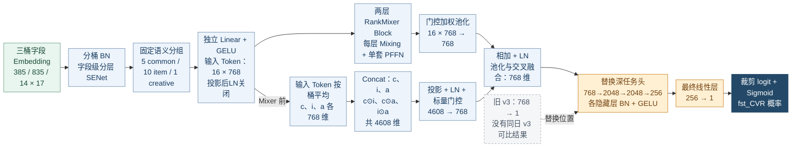

相对 v3 保留 16 个语义 Token、两层原始 RankMixer 型 Block、门控池化和输入 Token 的三桶交叉；仅将最终线性预测替换为 768→2048→2048→256→1 深任务头。v7 并非从 v6 派生；三桶交叉取 Mixer 之前的 Token。

**模块与配置变化**

| 模块 / 配置项 | 对照版本：v3 | 本版 |
| --- | --- | --- |
| 结构来源 | v3 | v3；不是沿v6增改 |
| Token数 / 宽度 / Block数 | 16 / 768 / 2 | 保持不变 |
| 每层FFN | 1套PFFN，M=1536 | 保持不变 |
| 投影后LN开关 | rm_proj_ln=false | 保持false；投影后不额外加LN |
| 读出与融合 | Gated Pool + Bucket Cross，768维 | 保持不变 |
| 预测接口 | 768→1 | 768→2048→2048→256→1 |
| 任务头处理 | 最终线性层 | 新增隐藏层BN与GELU |

设融合后的表示为 $c\in\mathbb{R}^{768}$，v3 的输出是 $\ell=w^\top c+b$；v7 则改为：

$$
h_0=c,\qquad h_k=\operatorname{GELU}\!\left(\operatorname{BN}(W_kh_{k-1}+b_k)\right),\quad k=1,2,3,
$$

$$
768\rightarrow2048\rightarrow2048\rightarrow256\rightarrow1,\qquad
\ell=w_o^\top h_3+b_o.
$$

我的具体工作是把 Base 风格的深任务头接到 v3 已有的融合表示后，补齐各层独立变量、初始化、正则项注册以及训练和导出时的 BN 处理，并校验输入确实为 768 维。深任务头直接负责最终预测，没有再并联一个旧线性 logit。这里增加的是读出后的非线性容量；它不会恢复池化之前已经丢掉的 Token 细节，因此也不能与后续 PureFlat 的思路混为一谈。

**逐日实验数据（0909 汇总）**

对照版本为 v3；差值均为本版减对照。只配对同一测试日，空值“—”表示对照无记录。

| 测试日 | 阶段 | v7 AUC | ΔBase | v3 AUC | Δv3 | COPC |
| --- | --- | --- | --- | --- | --- | --- |
| 08-16 | 首日 | 0.865866 | −0.001094 | — | — | 1.003265 |

来源：Sheet1 AUC 单元格 Y4；COPC 取各自相邻列。均值为测试日等权平均，不表示独立重复实验。

0909 表中，v7 只有 **8 月 16 日**的一次记录，AUC 为 **0.865866**，比同日 Base 低 **0.001094**，COPC 为 **1.003265**。由于没有同日、同训练起点的 v3 结果，不能把它与 7 月的 v3 相减，宣称加深任务头提升了多少。这一分支完成了对输出容量假设的实现验证，但现有数据还不足以判断其独立收益；后续若重新评估，需要补跑 8 月相同起点的 v3。与此同时，它也促使我把“任务头是否够强”和“进入任务头的信息是否已经被压缩”分开考虑，后一个问题由 v10 和 E2 继续检查。

### 2.9 v8：在 Token 压缩前加入显式交叉

v6 是先把每组字段投影成 512 维 Token，再进行跨 Token 交互。我提出的另一个假设是：一组字段一旦压缩，某些细粒度乘性关系可能更难在后面恢复；而 Base 的 DCNM 在全量字段表示上就进行显式交叉。基于这个差别，v8 把交叉位置前移到 BN/SENet 之后、语义分组投影之前，尝试让 Local Token 接收已经交互过的字段表示。同时，我保留一条不同的信息来源：Global Token 仍读取交叉前的表示，避免所有输入都必须先通过新增交叉模块。

**算法流程图：v8：Cross Local 与 Raw Global 两条入口**

```mermaid
%%{init: {"look": "classic", "flowchart": {"nodeSpacing": 18, "rankSpacing": 18, "padding": 6, "wrappingWidth": 100}}}%%
flowchart LR
    N_input["三桶字段 Embedding<br/>共 1234 × 17"]
    N_raw["分桶 BN + 分层 SENet<br/>Raw：20978 维"]
    N_dcn["新增两层 Masked DCN<br/>rank 500 / mask 隐层 250"]
    N_cross["Cross：20978 维<br/>按原桶和字段坐标拆回"]
    N_local["10 / 20 / 1 语义组<br/>独立 Linear + GELU + RMSNorm<br/>Local：31 × 512"]
    N_global["Raw Global 投影<br/>20978→512→512<br/>RMSNorm：1 × 512"]
    N_cat["Concat Local + Global<br/>32 × 512"]
    N_blocks["两层双 FFN Block<br/>Mixing / Reverting<br/>SwiGLU 中间宽度：512"]
    N_norm["Final per-token RMSNorm<br/>32 × 512"]
    N_gfinal["末端 Global Token<br/>512 维"]
    N_lfinal["末端 Local Tokens<br/>31 × 512"]
    N_pool["Global 条件加权池化<br/>输出 512 维"]
    N_flat["Local 展平：15872 维<br/>压缩 + RMSNorm + 门控<br/>输出 512 维"]
    N_concat["三路 Concat<br/>512 + 512 + 512 = 1536"]
    N_head["任务头<br/>1536→2048→2048→256"]
    N_output["线性输出 → 裁剪 → Sigmoid<br/>fst_CVR 概率"]
    N_input --> N_raw
    N_raw --> N_dcn
    N_dcn --> N_cross
    N_cross --> N_local
    N_raw -->|"绕过 DCN"| N_global
    N_local --> N_cat
    N_global --> N_cat
    N_cat --> N_blocks
    N_blocks --> N_norm
    N_norm --> N_gfinal
    N_norm --> N_lfinal
    N_gfinal -->|"条件查询"| N_pool
    N_lfinal -->|"被汇总的 Local"| N_pool
    N_lfinal --> N_flat
    N_gfinal --> N_concat
    N_pool --> N_concat
    N_flat --> N_concat
    N_concat --> N_head
    N_head --> N_output
    classDef input fill:#e9f5ef,stroke:#6a9e84,color:#174b34;
    class N_input input;
    classDef unchanged fill:#edf4fc,stroke:#7290b1,color:#183a5e;
    class N_raw,N_global,N_cat,N_norm,N_gfinal,N_lfinal,N_pool,N_flat,N_concat,N_head unchanged;
    classDef changed fill:#fff0d4,stroke:#ca8425,color:#71400d;
    class N_dcn,N_cross,N_local,N_blocks changed;
    classDef output fill:#244968,stroke:#244968,color:#ffffff;
    class N_output output;
```

相对 v6 新增压缩前两层 Masked Low-Rank DCN；Local 使用 Cross 字段，Global 保留交叉前、BN/SENet 后的 Raw 表示。SwiGLU 中间宽度由 704 改为 512，仍保留三路 1536 维读出。Mask 是 500 维线性调制，不是 Sigmoid 概率。

**模块与配置变化**

| 模块 / 配置项 | 对照版本：v6 | 本版 |
| --- | --- | --- |
| 结构来源 | v6 | v6 + 压缩前交叉 |
| Token数 / 宽度 / Block数 | 32 / 512 / 2 | 保持不变 |
| 前置交叉 | 无 | 2层Masked DCN；rank=500，Mask隐层250 |
| Local输入 | 三桶BN/SENet后的Raw | Cross后恢复字段坐标，再按10/20/1组投影 |
| Global输入 | 三桶BN/SENet后的Raw | 保持Raw路径，绕过前置DCN |
| 每套SwiGLU中间宽度M | 704 | 512；每Block仍为两套 |
| 末端 | RMSNorm；三路1536维；2048/2048/256头 | 保持不变 |

设三桶拼接后的表示为 $x_0\in\mathbb{R}^{20978}$，两层 Masked Low-Rank DCN 的第 $l$ 层可以写为：

$$
q_l=V_lx_l+b_l^{q}\in\mathbb{R}^{500},\qquad
m_l=B_l\operatorname{ReLU}(A_lx_l+a_l)+b_l^{m}\in\mathbb{R}^{500},
$$

$$
x_{l+1}=\operatorname{LN}\!\left[x_l+x_0\odot\left(U_l(q_l\odot m_l)+b_l^{u}\right)\right],\qquad l=0,1.
$$

其中 Mask 隐层为 250 维。**Mask 作用在 500 维低秩表示上，输出层是线性的，并没有经过 Sigmoid。**它可以放大、抑制或改变低秩分量的符号，不能解释成取值在 0 到 1 的字段重要性概率。我将其输出偏置初始化为 1、输出权重设为小幅随机值，使新增调制在初始化附近接近保留原低秩通路；这也不等于把整层 DCN 初始化为恒等映射。

结构上，v8 用交叉后的 $x_2$ 恢复 common/item/creative 的桶与字段位置，再按原语义组构建 31 个 Local Token；Global 则从交叉前、已经经过 BN/SENet 的 $x_0$ 生成。我的实现重点是保存这两条路径的来源，按实际字段 ID 和 17 维字段边界重建映射，确保 DCN 输出不会因为维度一致就被错误切回语义组。我还加入 Mask 均值、波动、近零和大幅值占比，以及交叉更新与输入的 RMS 比值等只读诊断，便于后续观察调制是否异常。此外，主干 SwiGLU 中间宽度从 v6 的 704 改为 512，Token 数、512 维宽度、两层主干及三路读出保留，所以这版是“前置交叉与容量调整”的联合方案。

**逐日实验数据（0909 汇总）**

对照版本为 v6；差值均为本版减对照。只配对同一测试日，空值“—”表示对照无记录。

| 测试日 | 阶段 | v8 AUC | ΔBase | v6 AUC | Δv6 | COPC |
| --- | --- | --- | --- | --- | --- | --- |
| 08-16 | 首日 | 0.866615 | −0.000345 | 0.866017 | +0.000598 | 1.013728 |

来源：Sheet1 AUC 单元格 AB4；COPC 取各自相邻列。均值为测试日等权平均，不表示独立重复实验。

8 月 16 日 v8 的 AUC 为 **0.866615**，比 v6 高 **0.000598**，与 Base 的差距为 **0.000345**；它是现有非 mature 系列在该首日的最高 AUC，COPC 为 **1.013728**。这一结果使压缩前交叉成为值得保留的候选方向，但目前只有首日记录，不能说它在后续热启动阶段持续领先，更不能单独把收益记在 Mask 上。若继续投入，我会先固定中间宽度，拆开“有无前置 DCN”和“有无 Mask”两组对照，再延长同起点的连续训练窗口，而不是直接把单日最优结构认定为最终方案。

### 2.10 v9：引入 DCNM 和 Raw/Cross 双视图

v8 的 Local 路径只看到 Cross 表示，原始视图主要由 Global 保留。我进一步考虑：单个语义组是否需要同时接触交叉前、交叉后的特征；交叉结果是否还应有一条绕过 Token 压缩和 Mixer 的直接输出通路。v9 因此采用 Base 同型的两层 DCNM500，并围绕它构建 Raw/Cross 双视图和 DCNM Shortcut。这里复用了已有 Base 的交叉结构，我所做的是在 RankMixer 中重新组织信息路径与接口，而不是重新提出 DCNM。

**算法流程图：v9：双视图 Local 与 DCNM 直连路径**

```mermaid
%%{init: {"look": "classic", "flowchart": {"nodeSpacing": 18, "rankSpacing": 18, "padding": 6, "wrappingWidth": 100}}}%%
flowchart LR
    N_input["三桶字段 Embedding<br/>共 1234 × 17"]
    N_raw["分桶 BN + 分层 SENet<br/>Raw：20978 维"]
    N_dcn["Base 同型两层 DCNM<br/>rank 500，无 Mask"]
    N_cross["Cross：20978 维<br/>保留字段坐标布局"]
    N_rawgroups["按 10 / 20 / 1 语义组<br/>收集 Raw 字段"]
    N_crossgroups["按相同字段 ID / 组<br/>收集 Cross 字段"]
    N_views["组内 Concat Raw / Cross<br/>每组输入：34 × 字段数"]
    N_local["独立 Linear + GELU + RMSNorm<br/>Local：31 × 512"]
    N_global["Cross Global<br/>20978→512→512<br/>RMSNorm：1 × 512"]
    N_tokens["Concat Local + Global<br/>32 × 512"]
    N_blocks["两层双 FFN Block<br/>D512 / M512"]
    N_norm["Final per-token RMSNorm<br/>32 × 512"]
    N_gfinal["末端 Global<br/>512 维"]
    N_lfinal["末端 Local<br/>31 × 512"]
    N_pool["Global 条件池化<br/>输出 512 维"]
    N_flat["Local 展平：15872 维<br/>压缩 + RMSNorm + 门控<br/>输出改为 256 维"]
    N_shortcut["Cross Shortcut<br/>20978→512<br/>BN + GELU"]
    N_fusion["四路 Concat<br/>512+512+256+512<br/>共 1792 维"]
    N_head["任务头<br/>1792→2048→2048→256"]
    N_output["线性输出 → 裁剪 → Sigmoid<br/>fst_CVR 概率"]
    N_input --> N_raw
    N_raw --> N_dcn
    N_dcn --> N_cross
    N_raw --> N_rawgroups
    N_cross --> N_crossgroups
    N_rawgroups --> N_views
    N_crossgroups --> N_views
    N_views --> N_local
    N_cross --> N_global
    N_local --> N_tokens
    N_global --> N_tokens
    N_tokens --> N_blocks
    N_blocks --> N_norm
    N_norm --> N_gfinal
    N_norm --> N_lfinal
    N_gfinal -->|"条件查询"| N_pool
    N_lfinal --> N_pool
    N_lfinal --> N_flat
    N_cross -->|"绕过 Token / Mixer"| N_shortcut
    N_gfinal --> N_fusion
    N_pool --> N_fusion
    N_flat --> N_fusion
    N_shortcut --> N_fusion
    N_fusion --> N_head
    N_head --> N_output
    classDef input fill:#e9f5ef,stroke:#6a9e84,color:#174b34;
    class N_input input;
    classDef unchanged fill:#edf4fc,stroke:#7290b1,color:#183a5e;
    class N_raw,N_rawgroups,N_tokens,N_blocks,N_norm,N_gfinal,N_lfinal,N_pool unchanged;
    classDef changed fill:#fff0d4,stroke:#ca8425,color:#71400d;
    class N_dcn,N_cross,N_crossgroups,N_views,N_local,N_global,N_flat,N_shortcut,N_fusion,N_head changed;
    classDef output fill:#244968,stroke:#244968,color:#ffffff;
    class N_output output;
```

替换为 Base 同型两层 DCNM500，同时让每个语义组拼接 Raw/Cross；Global 改读 Cross，新增 512 维 Cross Shortcut。保留两层 D512/M512 主干，将 Local 展平分支缩至 256 维，最终四路融合为 1792 维。并非只移除 v8 的 Mask。

**模块与配置变化**

| 模块 / 配置项 | 对照版本：v8（设计关系） | 本版 |
| --- | --- | --- |
| 结构对照 | v8 | 组合调整，不是仅去掉Mask |
| Token数 / D / L / M | 32 / 512 / 2 / 512 | 保持不变 |
| 前置交叉 | 2层Masked DCN500 | Base同型2层DCNM500，无Mask |
| Local每字段输入 | Cross：17维 | Concat(Raw,Cross)：34维 |
| Global来源 | Raw | Cross |
| 直接输出旁路 | 无 | Cross→512维Shortcut |
| 末端拼接 | 512+512+512=1536维 | 512+512+256+512=1792维 |

默认关闭交叉投影的额外激活时，其公式为：

$$
x_{l+1}=\operatorname{LN}\!\left[x_l+x_0\odot\left(U_l(V_lx_l+b_l^v)+b_l^u\right)\right],\qquad l=0,1,
$$

其中 $V_l:20978\rightarrow500$，$U_l:500\rightarrow20978$。相比 v8，这里没有样本相关的 Mask 分支，低秩交叉的变量组织、初始化和归一化路径按 Base 对齐。但整个模型的变化远不止去掉 Mask：对于语义组 $\mathcal G_j$，Local 投影输入由一份字段表示改为 $[x_0[\mathcal G_j];x_2[\mathcal G_j]]$。一个字段的接口由 17 维变为 34 维，同组 Raw/Cross 一起投影到 512 维。此处 Cross 是经过全字段交互、仍占据该字段坐标位置的表示，不应把它理解成只与该字段自身有关。

我把 Global 的输入改为交叉后的全量表示，并增加 $s=\operatorname{GELU}(\operatorname{BN}(W_sx_2+b_s))\in\mathbb{R}^{512}$ 的 Shortcut，直接送入任务头。这样，即使 Token 压缩与 Mixer 未能充分利用 DCNM 信息，预测层也能直接接触它。为控制融合接口，Local 展平分支的压缩输出从 512 降为 256 维，最终拼接维度为 $512+512+256+512=1792$。实现中我分别维护 Raw/Cross 的字段映射，校验两份视图在同一个字段 ID 上对齐，核对双视图投影输入、Cross Global、Shortcut 以及四路拼接的维度，并保留 Base 训练与导出所用的 DCNM 归一化路径。

**逐日实验数据（0909 汇总）**

对照版本为 v8；差值均为本版减对照。只配对同一测试日，空值“—”表示对照无记录。

| 测试日 | 阶段 | v9 AUC | ΔBase | v8 AUC | Δv8 | COPC |
| --- | --- | --- | --- | --- | --- | --- |
| 08-16 | 首日 | 0.865254 | −0.001706 | 0.866615 | −0.001361 | 1.006730 |

来源：Sheet1 AUC 单元格 AE4；COPC 取各自相邻列。均值为测试日等权平均，不表示独立重复实验。

8 月 16 日 v9 的 AUC 为 **0.865254**，比 v8 低 **0.001361**，比 Base 低 **0.001706**，COPC 为 **1.006730**。这个结果没有支持继续堆叠这套组合。它不能证明 DCNM、Raw/Cross 或 Shortcut 中哪一项无效，因为交叉类型、Local 输入、Global 来源和读出接口同时变化；也不能凭一个结果认定训练发生了过拟合。对我后续方案选择更有用的提醒是：增加信息入口并不自动等于模型能更好地利用信息。与继续增加旁路相比，先检查已有 Token 如何进入任务头，更容易构建清楚的对照，这也是后续转向 PureFlat 分支的理由。

**算法流程图：前置交叉细节：v8 Masked DCN 与 v9 DCNM**

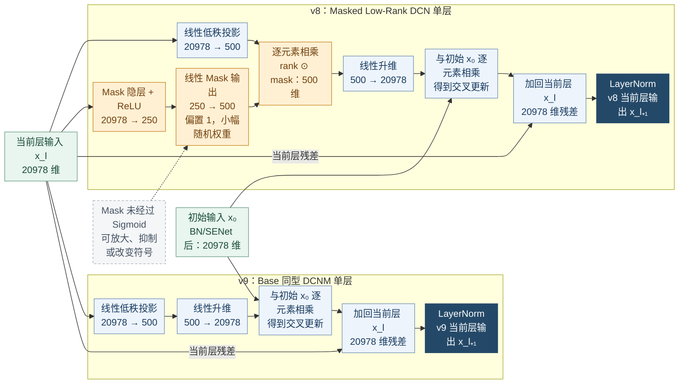

两者在 20978 维完整字段空间交叉，每层先压到 rank 500 再恢复；两层各有独立参数。v8 额外根据当前 x_l 生成 500 维线性 Mask，并乘在 rank 表示上。x₀ 是两层共享的初始 BN/SENet 后输入，残差来自当前 x_l；第二层的 x_l 为第一层输出。此图只比较交叉算子，不能代替 v8/v9 整体方案消融。

### 2.11 v10：使用完整展平读出，调整归一化

经过任务头与多路交叉的尝试，我将注意力转向 v6 的读出过程。v6 经过多轮交互后，32 个 512 维 Token 最终被压到 1536 维：Global 一路、Global 条件池化一路、Local 展平压缩一路。我的假设是，模型未必只缺少新的交互模块，也可能在交互之后过早压缩了信息。相比预先设计三条汇总路径，直接保留每个 Token 的位置与各维输出，再让任务头学习组合，是一个更直接的信息保留方案。

**算法流程图：v10：PureFlat 与 LayerNorm 的联合替换**

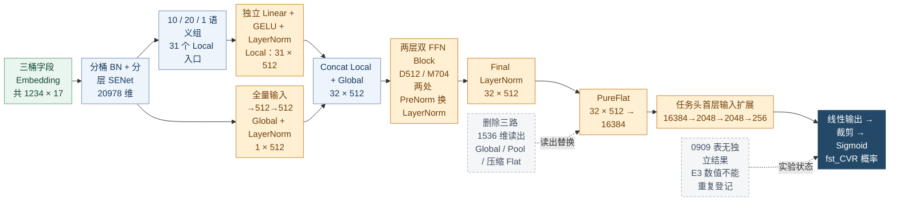

保留 v6 的语义分组、Global、D512、两层双 FFN 与 M704；投影后、Block PreNorm 和末端全部由 RMSNorm 替换为 LayerNorm。删除三路汇总，直接展平全部 Token；任务头首层输入由 1536 增至 16384。0909 表无 v10 独立结果，不挪用 E3。

**模块与配置变化**

| 模块 / 配置项 | 对照版本：v6 | 本版 |
| --- | --- | --- |
| 结构来源 | v6 | v6，非从v9继续增加支路 |
| Token数 / D / L / M | 32 / 512 / 2 / 704 | 保持不变 |
| 投影 / Block / 末端Norm | RMSNorm | 统一换成LayerNorm |
| 读出 | Global+Pool+压缩Flat：1536维 | 全部Token直接PureFlat：16384维 |
| 任务头首层 | 1536→2048 | 16384→2048 |
| 任务头隐藏层 | 2048 / 2048 / 256 | 保持不变 |
| 0909独立实验记录 | v6有4日记录 | v10无独立AUC；不挪用E3结果 |

因此，v10 回到 v6 主干，将读出从

$$
c_{\mathrm{v6}}=[z_g;\operatorname{Pool}(Z_{\mathrm{local}},z_g);\operatorname{Compress}(\operatorname{vec}(Z_{\mathrm{local}}))]\in\mathbb{R}^{1536}
$$

改为 $c_{\mathrm{v10}}=\operatorname{vec}(\operatorname{LN}(Z))\in\mathbb{R}^{16384}$，让全部 32 个 Token 直接进入 `[2048,2048,256]` 任务头。我删除了条件池化、Local 展平压缩及其门控和三路拼接，并重新核对任务头第一层的输入维度与参数量。隐藏层尺寸不变并不意味着容量不变：输入从 1536 增到 16384 维，第一层权重矩阵也随之扩大。

这一版还同时把 Local/Global 投影后、Block 内 PreNorm 及末端的 RMSNorm 换成 LayerNorm。两者的计算差别可概括为：

$$
\operatorname{RMSNorm}(z)=\gamma\odot\frac{z}{\sqrt{D^{-1}\sum_d z_d^2+\epsilon}},\qquad
\operatorname{LN}(z)=\gamma\odot\frac{z-\mu(z)}{\sqrt{\operatorname{Var}(z)+\epsilon}}+\beta.
$$

我的考虑是，在保留完整 Token 表示时，也检查去均值是否会改变进入任务头的分布。不过，当前具体实现还涉及按 Token 独立的 scale 与沿最后一维共享的 gamma/beta 之间的变化，因此它检验的是一组明确的实现选择，不能简化为一般性的 RMSNorm 和 LayerNorm 优劣。

**实验数据（0909 汇总）**

| 版本 | 独立AUC记录 | 当前可以说明的内容 |
| --- | --- | --- |
| v10 | 无 | 已有实现和结构差异；不补造结果，也不挪用其他版本数值 |

**0909 工作簿没有 v10 独立训练结果。**这一版有代码，但不能补写 AUC，也不能把结构端点相近的 E3 结果再计为一次 v10 实验。v10 的两个改动同时发生，本身也不便解释结果；因此后续以 v6 为起点，先用 E2 只替换读出，再由 E3 在 E2 上替换归一化，将“保留完整信息”和“改变归一化”分开验证。对应多日结果放在第三部分，这也是实验设计从组合探索走向逐项检查的一步。

### 2.12 补充尝试：UniMixer 的可学习混合与双流结构

RankMixer 的固定重排没有可训练参数，提供的是预先确定的信息交换路径。我进一步想检查，能否把“哪些坐标应当混合、混合多少”交给数据学习。为此，我实现并适配了 UniMixer 分支：沿用当前任务的字段输入和 BN/SENet，构造 `10 common + 21 item + 1 creative` 共 32 个语义 Token，每个 512 维，不额外增加 Global Token；随后使用可学习混合及双流归一化主干，最后将 16384 维完整表示交给任务头。这一版本是对另一类结构的实现与任务适配，不应把所借鉴的混合设计描述成我独立提出的算法。

**算法流程图：UniMixer v1：可学习混合与双流主干**

```mermaid
%%{init: {"look": "classic", "flowchart": {"nodeSpacing": 18, "rankSpacing": 18, "padding": 6, "wrappingWidth": 100}}}%%
flowchart LR
    N_input["三桶字段 Embedding<br/>共 1234 × 17"]
    N_bn["分桶 BN<br/>字段级分层 SENet"]
    N_groups["固定语义分组<br/>10 common / 21 item<br/>1 creative，共 32 组"]
    N_project["每组独立 Linear → BN<br/>每 Token：512 维"]
    N_tokens["堆叠 32 × 512<br/>没有额外 Global Token"]
    N_init["双流初始化<br/>x₀ = y₀ = 输入 Token"]
    N_block1["UniMixer Block 1<br/>可学习混合 + 单套 pSwiGLU<br/>双流更新；D512 / M1024"]
    N_block2["UniMixer Block 2<br/>独立层参数<br/>双流更新；D512 / M1024"]
    N_combine["双流末端合成<br/>x₂ + RMSNorm(y₂)<br/>32 × 512"]
    N_flat["PureFlat<br/>32 × 512 → 16384"]
    N_head["任务头<br/>16384→2048→2048→256"]
    N_output["线性输出 → 裁剪 → Sigmoid<br/>fst_CVR 概率"]
    N_note["同时改变多项结构<br/>不能视为只替换 Mixing"]
    N_input --> N_bn
    N_bn --> N_groups
    N_groups --> N_project
    N_project --> N_tokens
    N_tokens --> N_init
    N_init --> N_block1
    N_block1 --> N_block2
    N_block2 --> N_combine
    N_combine --> N_flat
    N_flat --> N_head
    N_head --> N_output
    N_note -.->|"对照边界"| N_block1
    classDef input fill:#e9f5ef,stroke:#6a9e84,color:#174b34;
    class N_input input;
    classDef unchanged fill:#edf4fc,stroke:#7290b1,color:#183a5e;
    class N_bn,N_head unchanged;
    classDef changed fill:#fff0d4,stroke:#ca8425,color:#71400d;
    class N_groups,N_project,N_tokens,N_init,N_block1,N_block2,N_combine,N_flat changed;
    classDef output fill:#244968,stroke:#244968,color:#ffffff;
    class N_output output;
    classDef note fill:#f5f6f8,stroke:#a3adb8,color:#435161,stroke-dasharray:4 3;
    class N_note note;
```

保留三桶输入与字段级分层 SENet，替换为 10 common / 21 item / 1 creative 共 32 个语义 Token，不额外生成 Global。每 Token 投影后使用独立 BN；两层 UniMixer 双流主干每层只有一套 pSwiGLU，M1024。最终完整展平进入深任务头；内部双流见独立细节图。

**模块与配置变化**

| 模块 / 配置项 | 对照版本：v6（对照方案，非单模块消融） | 本版 |
| --- | --- | --- |
| 比较口径 | v6 | 整套UniMixer候选，非单算子消融 |
| 输入Token | 10/20/1 Local + 1 Global | 10/21/1语义组，无额外Global |
| Token数 / 宽度 / Block数 | 32 / 512 / 2 | 保持32 / 512 / 2 |
| 交互 | 固定Mixing/Reverting | 块内+块间可学习混合；rank128、8个基矩阵 |
| 每个Block的FFN | 两套pSwiGLU，M=704 | 一套pSwiGLU，M=1024 |
| 状态更新 | 单流长残差 | x/y双流及RMSNorm |
| 输出 | 三路1536维 | 双流合成后PureFlat 16384维 |

直接为 16384 维建立完整混合矩阵代价较高，因此实现采用块内、块间两步混合。将展平表示整理为 $512$ 个长度为 $32$ 的坐标块，块间矩阵用低秩参数化，块内矩阵由共享基矩阵组合：

$$
W_G=UV^\top,\quad U,V\in\mathbb{R}^{512\times128};\qquad
W_{B,g}=\sum_{k=1}^{8}a_{gk}B_k,\quad B_k\in\mathbb{R}^{32\times32}.
$$

这里的“块”是展平后的坐标块，不是神经网络的第几层 Block。代码将这些矩阵对称化，按温度缩放、指数化，再进行 10 次交替行列归一化和最终对称化，得到近似双随机的混合权重。计算时先在每个坐标块内右乘对应矩阵，再对相同块内位置做块间混合，最后恢复为 `32×512`。有限次数归一化配合 epsilon 只能支持“近似双随机”的表述；指数化和温度调节也不意味着实现了精确零值的稀疏矩阵。混合矩阵是学习得到的模型参数，并不由每个样本单独生成，所以也不能把它等同于 Q/K 注意力。

主干同时改用双流状态。设 $R$ 为 RMSNorm、$M$ 为上述混合、$F$ 为一套 Per-token SwiGLU，则当前代码可写为：

$$
u_l=x_l+R(y_l),\qquad f_l=F\!\left(R(u_l+M(u_l))\right),
$$

$$
x_{l+1}=R(x_l+f_l),\qquad y_{l+1}=y_l+f_l,
\qquad Z_{\mathrm{out}}=x_L+R(y_L).
$$

我的工作包括接入语义字段映射与独立 Token 投影，实现低秩和基矩阵参数化、温度调度和数值稳定处理，并把双流状态更新及完整展平输出接入当前 fst_CVR 训练框架。它与 v6 不仅在 Mixing 是否可学习上不同，还同时改变了 Token 组织、Global 路径、每个 Block 的 FFN 组织、归一化与残差、读出方式，因而是一项整体候选方案，不能视作只替换 Mixing 算子的消融。

**逐日实验数据（0909 汇总）**

对照版本为 v6；差值均为本版减对照。只配对同一测试日，空值“—”表示对照无记录。

| 测试日 | 阶段 | UniMixer v1 AUC | ΔBase | v6 AUC | Δv6 | COPC |
| --- | --- | --- | --- | --- | --- | --- |
| 08-16 | 首日 | 0.865662 | −0.001298 | 0.866017 | −0.000355 | 1.003650 |

来源：Sheet1 AUC 单元格 AH4；COPC 取各自相邻列。均值为测试日等权平均，不表示独立重复实验。

8 月 16 日 UniMixer v1 的 AUC 为 **0.865662**，比 v6 低 **0.000355**，比 Base 低 **0.001298**，COPC 为 **1.003650**。现有单日记录没有支持将它替换为主线，也不足以否定可学习混合本身。若后续重新开展这个方向，更有解释力的做法是在已有多日对照的结构上固定 Token、归一化、FFN 和读出，只替换混合机制，并把算子成本纳入对比；本阶段则优先推进 v6 系列中已经能形成连续训练比较的分支。

本节四个已记录分支的原始结果分别见 Sheet1 的 Y4:Z4、AB4:AC4、AE4:AF4、AH4:AI4；v10 无独立结果。上述“下一步”是根据现有证据形成的实验安排，不代表这些补充消融已经完成。

**算法流程图：UniMixer 内部：可学习混合和双流状态更新**

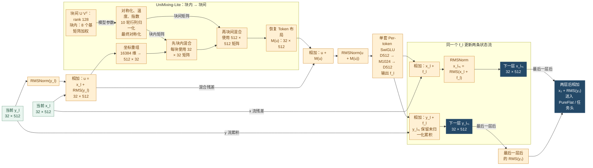

展开一个 Block，整体重复两层且各层参数独立；所有流张量为 32×512。混合内部将 16384 维整理成 512 个长度 32 的坐标块，先块内后块间。矩阵来自模型参数，不是样本生成的 Q/K 注意力；有限 10 轮行列归一化仅保证近似双随机。两层后输出 x₂+RMS(y₂)。

## 3. V6 系列的改进与实验结果

v6 在 8 月首日相对 v5 有明显改善，但已有四日结果均落后于 Base。我以它为共同起点，集中检查读出、归一化、宽度和深度。E2 和 E3 先比较读出及 Norm，Small 缩小 Token 宽度；Small-1/2 检查轻量末端与增深，Small-3 则回到完整读出分支增加第三层。

### 3.1 E2：用完整展平替换三路读出

v6 用 Global、条件池化和压缩 Flatten 三路读出，原本希望兼顾全局信息、重点字段和 Token 身份。但主干输出有 `32×512=16,384` 个坐标，进入任务头前却被压缩到 1,536 维。我因此提出一个需要实验检验的假设：主干可能已经学到了有用的交互，但读出层预先规定的汇总方式限制了任务头使用这些信息。与其继续往主干叠加模块，不如先让任务头直接看到完整表示。

**算法流程图：E2：完整读出进入任务头**

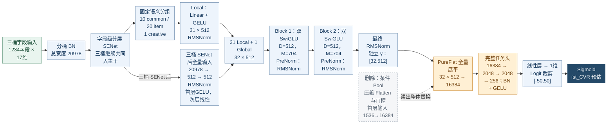

相对 v6，保留输入、两层交互、RMSNorm 和隐藏层尺寸；将三路 1536 维读出整体替换为 PureFlat 16384 维。首层任务头矩阵同时变大，包含容量变化，不能归为等参数池化消融。

**模块与配置变化**

| 模块 / 配置项 | 对照版本：v6 | 本版 |
| --- | --- | --- |
| Token数 / D / L / M | 32 / 512 / 2 / 704 | 保持不变 |
| 输入与Global来源 | 10/20/1 Local；三桶SENet后Global | 保持不变 |
| 归一化 | RMSNorm | 保持不变 |
| 读出 | Global + 条件Pool + 压缩Flat：1536维 | PureFlat：32×512=16384维 |
| 任务头首层 | 1536→2048 | 16384→2048 |
| 任务头隐藏层 | 2048 / 2048 / 256 | 保持不变 |
| Dense参数（源码核算） | 177,217,126 | 199,367,013 |

设最终归一化后的 Local Token 为 $Z_1,\ldots,Z_{31}$，Global Token 为 $Z_g$，v6 的接口可以写成：

$$
c_{v6}=\left[Z_g;\ \sum_{t=1}^{31}\alpha_t(Z_g,Z_t)Z_t;\ s\cdot R\!\left(\operatorname{vec}(Z_{1:31})\right)\right]\in\mathbb R^{1536},
$$

其中 $\alpha_t$ 为 Global 条件下的 Softmax 权重，$R$ 是投影到 512 维并归一化的压缩路径，$s$ 是可学习的标量门控。E2 将其整体替换为：

$$
c_{E2}=\operatorname{vec}([Z_1,\ldots,Z_{31},Z_g])\in\mathbb R^{16384},\qquad
\hat y=\sigma\!\left(\operatorname{MLP}_{2048,2048,256}(c_{E2})\right).
$$

实现上，我保留 v6 的字段映射、Global 来源、两个交互 Block 和 RMSNorm，删除条件 Pool、压缩投影及其门控，重新核对 Flatten 后的静态维度和任务头参数。这个实验的关键是替换完整读出接口；虽然任务头隐藏层宽度没变，首层矩阵却从 `1536×2048` 扩大到 `16384×2048`。扣除旧读出模块后，Dense 参数净增 **22,149,887**，由 **177,217,126** 增至 **199,367,013**。因此，AUC 的变化同时包含信息传递方式和任务头容量的影响，不能写成“参数不变，只去掉池化”。

**逐日实验数据（0909 汇总）**

对照版本为 v6；差值均为本版减对照。只配对同一测试日，空值“—”表示对照无记录。

| 测试日 | 阶段 | E2 AUC | ΔBase | v6 AUC | Δv6 | COPC |
| --- | --- | --- | --- | --- | --- | --- |
| 08-16 | 首日 | 0.866562 | −0.000398 | 0.866017 | +0.000545 | 0.992616 |
| 08-17 | 续训 | 0.867488 | −0.000379 | 0.867088 | +0.000400 | 1.000266 |
| 08-18 | 续训 | 0.868440 | −0.000469 | 0.867996 | +0.000444 | 1.003412 |
| 08-19 | 续训 | 0.869406 | −0.000462 | 0.868878 | +0.000528 | 1.002997 |
| 08-20 | 续训 | 0.869088 | −0.000416 | — | — | 1.007179 |
| 08-21 | 续训 | 0.868819 | −0.000492 | — | — | 1.020976 |

| 统计窗口 | 本版天数 | 本版平均AUC | 平均ΔBase | 与v6配对天数 | 配对平均Δv6 |
| --- | --- | --- | --- | --- | --- |
| 首日 | 1 | 0.86656200 | −0.00039800 | 1 | +0.00054500 |
| 后续热启动 | 5 | 0.86864820 | −0.00044360 | 3 | +0.00045733 |
| 本链全部已有日期 | 6 | 0.86830050 | −0.00043600 | 4 | +0.00047925 |

配对均值仅使用“配对天数”对应的共同日期；本版全窗口均值不与对照的其他窗口直接相减。

来源：Sheet1 AUC 单元格 G69, G70, G71, G72, G73, G74, J4, J5, J6, J7, J8, J9；COPC 取各自相邻列。均值为测试日等权平均，不表示独立重复实验。

8 月 16 日至 19 日四个共同测试日，E2 相对 v6 分别提高 **0.000545、0.000400、0.000444、0.000528**，平均提高 **0.00047925**；其中首日 AUC 从 0.866017 升至 0.866562，后续三个热启动测试日平均提高 **0.00045733**。E2 已有至 8 月 21 日的六日结果，但 v6 只有四日，直接配对比较只使用上述四日。

这组结果让我把完整读出保留下来，继续研究它与宽度、深度的配合。它支持“当前三路读出可以改进”的判断，还不足以证明损失一定发生在池化操作本身；要拆开这一点，需要补充任务头参数预算相近的对照。

### 3.2 E3：在 E2 上比较 LayerNorm

v10 同时使用了 PureFlat 和 LayerNorm，无法只凭结构看出两个改动各自是否合适。E2 固定 PureFlat 后，我再从 E2 构建 E3，检查归一化是否仍有改进空间。这里的想法是：展平后，任务头会直接接收不同 Token 的坐标，归一化对均值和幅度的处理可能影响这层接口；但这种影响应当通过对照判断，不能因为 LayerNorm 更常见就预先认定它更好。

**算法流程图：E3：替换归一化实现**

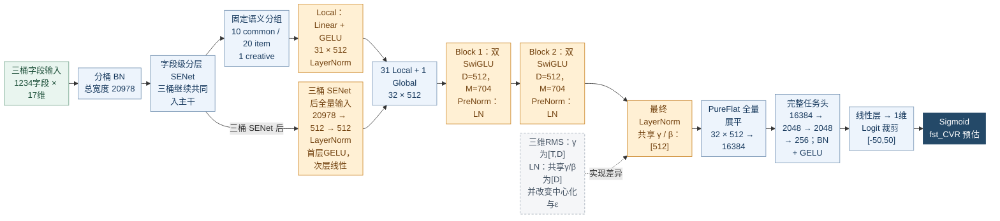

相对 E2，保留 PureFlat、T32/D512/L2/M704 和任务头；投影后、Block PreNorm、末端统一由 RMSNorm 换为 LayerNorm。同时改变中心化、gamma/beta 共享方式和 epsilon；两套 FFN 及 Mixing/Reverting 保留。

**模块与配置变化**

| 模块 / 配置项 | 对照版本：E2 | 本版 |
| --- | --- | --- |
| Token数 / D / L / M | 32 / 512 / 2 / 704 | 保持不变 |
| 投影后 / Block内 / 最终Norm | RMSNorm | LayerNorm |
| 三维Token的仿射参数 | 每Token独立γ：[T,D]，无β | 跨Token共享γ、β：[D] |
| 归一化统计 | 均方，不减均值 | 减均值后计算方差；ε按各自实现 |
| 读出及任务头 | PureFlat 16384；2048/2048/256头 | 保持不变 |
| Dense参数（源码核算） | 199,367,013 | 199,275,877 |

对三维 Token 张量中的一个位置 $x_{t,d}$，原来的 Per-token RMSNorm 与 E3 的 LayerNorm 可概括为：

$$
\operatorname{RMS}(x)_{t,d}
=\gamma_{t,d}\frac{x_{t,d}}{\sqrt{D^{-1}\sum_jx_{t,j}^{2}+\epsilon_R}},
$$

$$
\operatorname{LN}(x)_{t,d}
=\gamma_d\frac{x_{t,d}-\mu_t}{\sqrt{D^{-1}\sum_j(x_{t,j}-\mu_t)^2+\epsilon_L}}+\beta_d,
\qquad \mu_t=D^{-1}\sum_jx_{t,j}.
$$

我将 Local/Global 投影后、两个 Block 的 PreNorm 和最终 Token 的归一化统一切到 LayerNorm，其他核心结构保留 E2 的 `T=32、D=512、L=2、M=704` 与 PureFlat。需要注意，两套实现不只是相差一个“减均值”：原三维 RMSNorm 按 Token 使用独立 scale，LayerNorm 的 gamma/beta 则在 Token 间共享，epsilon 也各按自己的实现配置。参数因此从 **199,367,013** 变为 **199,275,877**。这是两种具体归一化实现的对照，并非只隔离中心化操作的实验。

**逐日实验数据（0909 汇总）**

对照版本为 E2；差值均为本版减对照。只配对同一测试日，空值“—”表示对照无记录。

| 测试日 | 阶段 | E3 AUC | ΔBase | E2 AUC | ΔE2 | COPC |
| --- | --- | --- | --- | --- | --- | --- |
| 08-16 | 首日 | 0.866386 | −0.000574 | 0.866562 | −0.000176 | 1.008348 |
| 08-17 | 续训 | 0.867416 | −0.000451 | 0.867488 | −0.000072 | 0.983833 |
| 08-18 | 续训 | 0.868336 | −0.000573 | 0.868440 | −0.000104 | 0.993394 |
| 08-19 | 续训 | 0.869211 | −0.000657 | 0.869406 | −0.000195 | 1.000404 |

| 统计窗口 | 本版天数 | 本版平均AUC | 平均ΔBase | 与E2配对天数 | 配对平均ΔE2 |
| --- | --- | --- | --- | --- | --- |
| 首日 | 1 | 0.86638600 | −0.00057400 | 1 | −0.00017600 |
| 后续热启动 | 3 | 0.86832100 | −0.00056033 | 3 | −0.00012367 |
| 本链全部已有日期 | 4 | 0.86783725 | −0.00056375 | 4 | −0.00013675 |

配对均值仅使用“配对天数”对应的共同日期；本版全窗口均值不与对照的其他窗口直接相减。

来源：Sheet1 AUC 单元格 P4, P5, P6, P7；COPC 取各自相邻列。均值为测试日等权平均，不表示独立重复实验。

8 月 16 日至 19 日，E3 相对 E2 的 AUC 差值依次为 **−0.000176、−0.000072、−0.000104、−0.000195**，四日平均 **−0.00013675**。首日是 0.866386 对 0.866562，后续三个热启动测试日也全部回退，平均差值 **−0.00012367**。因此，后续 Small 主线继续保留原 RMSNorm，而没有把 LayerNorm 当作默认升级。这个结论限于当前位置、参数共享方式和训练配置；E3 与 v10 的核心结构端点相同，也不能把 E3 的这组结果再记为一次独立的 v10 实验收益。

**算法流程图：归一化对比：统计与共享方式**

```mermaid
%%{init: {"look": "classic", "flowchart": {"nodeSpacing": 18, "rankSpacing": 18, "padding": 6, "wrappingWidth": 100}}}%%
flowchart LR
    subgraph SG_rms_branch["保留原值均值，仅做 RMS 缩放"]
        N_rms_stat["RMS 路径<br/>计算 mean(x²)"]
        N_rms_den["分母<br/>√(mean(x²) + ε_R)"]
        N_rms_div["原值除以分母<br/>不减 Token 均值"]
        N_rms_affine["乘独立 scale<br/>γ：[T,D]<br/>无平移 β"]
        N_rms_out["RMSNorm 输出<br/>[B,T,D]"]
    end
    subgraph SG_ln_branch["先中心化，再标准化与仿射变换"]
        N_ln_mean["LN 路径<br/>计算 μ = mean(x)"]
        N_ln_center["逐 Token 中心化<br/>x_c = x − μ"]
        N_ln_var["计算 mean(x_c²)<br/>沿最后一维"]
        N_ln_den["分母<br/>√(mean(x_c²) + ε_L)"]
        N_ln_div["中心化值除以分母<br/>x_c / 分母"]
        N_ln_affine["乘 γ，再加 β<br/>γ / β：[D]<br/>跨 Token 共享"]
        N_ln_out["LayerNorm 输出<br/>[B,T,D]"]
    end
    N_input["Token 张量 x<br/>[B,T,D]<br/>均沿最后一维统计"]
    N_note["E3 在投影/Block/末端<br/>统一替换具体 Norm<br/>非仅“是否减均值”"]
    N_input --> N_rms_stat
    N_rms_stat --> N_rms_den
    N_rms_den -->|"分母"| N_rms_div
    N_input -->|"原值 x"| N_rms_div
    N_rms_div --> N_rms_affine
    N_rms_affine --> N_rms_out
    N_input --> N_ln_mean
    N_input -->|"原值 x"| N_ln_center
    N_ln_mean -->|"均值 μ"| N_ln_center
    N_ln_center --> N_ln_var
    N_ln_var --> N_ln_den
    N_ln_den -->|"分母"| N_ln_div
    N_ln_center -->|"中心化值"| N_ln_div
    N_ln_div --> N_ln_affine
    N_ln_affine --> N_ln_out
    N_note -.->|"共享方式也改变"| N_ln_affine
    classDef input fill:#e9f5ef,stroke:#6a9e84,color:#174b34;
    class N_input input;
    classDef unchanged fill:#edf4fc,stroke:#7290b1,color:#183a5e;
    class N_rms_stat,N_rms_den,N_rms_div,N_rms_affine unchanged;
    classDef changed fill:#fff0d4,stroke:#ca8425,color:#71400d;
    class N_ln_mean,N_ln_center,N_ln_var,N_ln_den,N_ln_div,N_ln_affine changed;
    classDef output fill:#244968,stroke:#244968,color:#ffffff;
    class N_rms_out,N_ln_out output;
    classDef note fill:#f5f6f8,stroke:#a3adb8,color:#435161,stroke-dasharray:4 3;
    class N_note note;
```

对比三维 Token 张量 [B,T,D] 上的当前实现。RMSNorm 不减均值，使用 per-token gamma [T,D]；E3 LayerNorm 先中心化，gamma/beta [D] 在 Token 间共享，两条实现使用各自 epsilon。Global 的二维 RMSNorm gamma 本来就是 [D]，不能把该三维参数形状推广到所有路径。

### 3.3 Small：将 Token 宽度从 512 缩到 256

E2 的正向结果伴随着接近两亿 Dense 参数，接下来的问题是：完整读出是否必须依赖 512 维 Token 才有效。如果将每个 Token 缩窄，同时保留交互和读出方式，能否用较少参数保住大部分 AUC，并把节省的预算用于更有价值的位置？Small 围绕这一点，从 E2 将 $D$ 从 512 减到 256。

**算法流程图：Small：缩窄 Token 表示**

```mermaid
%%{init: {"look": "classic", "flowchart": {"nodeSpacing": 18, "rankSpacing": 18, "padding": 6, "wrappingWidth": 100}}}%%
flowchart LR
    N_input["三桶字段输入<br/>1234字段 × 17维"]
    N_bn["分桶 BN<br/>总宽度 20978"]
    N_senet["字段级分层 SENet<br/>三桶继续共同入主干"]
    N_groups["固定语义分组<br/>10 common / 20 item<br/>1 creative"]
    N_local["Local：Linear + GELU<br/>31 × 256<br/>RMSNorm"]
    N_global["三桶 SENet 后全量输入<br/>20978 → 256 → 256<br/>RMSNorm<br/>首层GELU，次层线性"]
    N_concat["31 Local + 1 Global<br/>32 × 256"]
    N_block1["Block 1：双 SwiGLU<br/>D=256，M=704<br/>PreNorm：RMSNorm"]
    N_block2["Block 2：双 SwiGLU<br/>D=256，M=704<br/>PreNorm：RMSNorm"]
    N_norm["最终 RMSNorm<br/>独立 γ：[32,256]"]
    N_readout["PureFlat 全量展平<br/>32 × 256 → 8192"]
    N_head["完整任务头<br/>8192 → 2048 → 2048<br/>→ 256；BN + GELU"]
    N_logit["线性层 → 1维<br/>Logit 裁剪 [-50,50]"]
    N_output["Sigmoid<br/>fst_CVR 预估"]
    N_delta["宽度 D：512→256<br/>FFN 中间 M：仍为704<br/>Flatten：16384→8192"]
    N_input --> N_bn
    N_bn --> N_senet
    N_senet --> N_groups
    N_groups --> N_local
    N_senet -->|"三桶 SENet 后"| N_global
    N_local --> N_concat
    N_global --> N_concat
    N_concat --> N_block1
    N_block1 --> N_block2
    N_block2 --> N_norm
    N_norm --> N_readout
    N_readout --> N_head
    N_head --> N_logit
    N_logit --> N_output
    N_delta -.->|"宽度变化，非增深"| N_block2
    classDef input fill:#e9f5ef,stroke:#6a9e84,color:#174b34;
    class N_input input;
    classDef unchanged fill:#edf4fc,stroke:#7290b1,color:#183a5e;
    class N_bn,N_senet,N_groups,N_logit unchanged;
    classDef changed fill:#fff0d4,stroke:#ca8425,color:#71400d;
    class N_local,N_global,N_concat,N_block1,N_block2,N_norm,N_readout,N_head changed;
    classDef output fill:#244968,stroke:#244968,color:#ffffff;
    class N_output output;
    classDef note fill:#f5f6f8,stroke:#a3adb8,color:#435161,stroke-dasharray:4 3;
    class N_delta note;
```

相对 E2，D512→256，Local/Global、FFN 输入输出和读出宽度随之变窄；T32/L2/M704、双 FFN、RMSNorm、PureFlat 及任务头隐藏层尺寸保留。另用 Unpack 整理同宽组 Token 输出，该算子优化不等于缩宽前后数值等价。

**模块与配置变化**

| 模块 / 配置项 | 对照版本：E2 | 本版 |
| --- | --- | --- |
| Token数 / Block数 | 32 / 2 | 保持不变 |
| Token宽度D | 512 | 256 |
| 每套SwiGLU | 512→704→512 | 256→704→256；M=704不变 |
| Local / Global投影输出 | 512维 | 256维 |
| PureFlat与任务头首层 | 16384维 → 2048 | 8192维 → 2048 |
| 归一化 / 隐藏层 | RMSNorm；2048/2048/256 | 保持不变 |
| Dense参数（源码核算） | 199,367,013 | 102,356,069 |

我保持 32 个 Token、两层 Block、每层两套 Per-token SwiGLU、RMSNorm 和 PureFlat，**SwiGLU 中间宽度 M=704 不变**。变化主要发生在 Local/Global 投影、FFN 的输入输出宽度，以及任务头入口：

$$
Z:\ [B,32,512]\rightarrow[B,32,256],\qquad
\operatorname{vec}(Z):\ 16384\rightarrow8192,
$$

$$
F(x)=\bigl[\operatorname{SiLU}(xW_g+b_g)\odot(xW_v+b_v)\bigr]W_o+b_o,
\quad W_g,W_v\in\mathbb R^{D\times704},\ W_o\in\mathbb R^{704\times D}.
$$

这个选择缩小了 Token 的存储和传递宽度，但保留了 704 维门控变换空间。因而它不是所有维度同比缩小的模型：与 $DM$ 相关的主要权重近似随 $D$ 线性变化，任务头首层也随 Flatten 输入缩小，不能把宽度减半等同于参数变成四分之一。核算后 Dense 参数从 **199,367,013** 降为 **102,356,069**，减少约 **48.66%**。

**逐日实验数据（0909 汇总）**

对照版本为 E2；差值均为本版减对照。只配对同一测试日，空值“—”表示对照无记录。

| 测试日 | 阶段 | Small AUC | ΔBase | E2 AUC | ΔE2 | COPC |
| --- | --- | --- | --- | --- | --- | --- |
| 08-16 | 首日 | 0.866510 | −0.000450 | 0.866562 | −0.000052 | 1.010160 |
| 08-17 | 续训 | 0.867450 | −0.000417 | 0.867488 | −0.000038 | 0.983928 |
| 08-18 | 续训 | 0.868375 | −0.000534 | 0.868440 | −0.000065 | 0.995010 |
| 08-19 | 续训 | 0.869339 | −0.000529 | 0.869406 | −0.000067 | 0.983074 |
| 08-20 | 续训 | 0.869041 | −0.000463 | 0.869088 | −0.000047 | 1.004643 |
| 08-21 | 续训 | 0.868840 | −0.000471 | 0.868819 | +0.000021 | 1.017854 |

| 统计窗口 | 本版天数 | 本版平均AUC | 平均ΔBase | 与E2配对天数 | 配对平均ΔE2 |
| --- | --- | --- | --- | --- | --- |
| 首日 | 1 | 0.86651000 | −0.00045000 | 1 | −0.00005200 |
| 后续热启动 | 5 | 0.86860900 | −0.00048280 | 5 | −0.00003920 |
| 本链全部已有日期 | 6 | 0.86825917 | −0.00047733 | 6 | −0.00004133 |

配对均值仅使用“配对天数”对应的共同日期；本版全窗口均值不与对照的其他窗口直接相减。

来源：Sheet1 AUC 单元格 J69, J70, J71, J72, J73, J74, M4, M5, M6, M7, M8；COPC 取各自相邻列。均值为测试日等权平均，不表示独立重复实验。

8 月 16 日至 21 日六个共同测试日，Small 相对 E2 的 AUC 差值为 **−0.000052、−0.000038、−0.000065、−0.000067、−0.000047、+0.000021**，平均 **−0.00004133**。首日 Small 为 0.866510，第六日为 0.868840；前五日略低于 E2，第六日略高。这些记录说明较大幅度的缩参伴随了较小的平均 AUC 损失，但没有重复种子或置信区间，不能据此宣称二者统计等价。它给我的直接启发是：继续堆宽未必是当前最值得投入参数的方向，可以在 D256 上验证增深。

这一版还实现了 Token 构造的计算图整理：同宽组保留独立投影权重及原有转置布局，用一次 `tf.unstack` 替代逐 Token 切片，并保留 `rm_optimize_tokenize=false` 参考路径。这样做针对重复切片的梯度回填；其等价性应在同为 D256、相同权重和输入时核对，不能与 D512→D256 的容量实验混为一谈，也不能从参数变化直接推导训练加速比例。

### 3.4 E4：尝试 creative 旁路与轻量末端

公司成熟方案将 creative 单独处理，在末端再与主干融合。这为我提供了一个具体的适配假设：common/item 承担主干交互，creative 保留独立通路，是否能够减少其经过统一 Token 压缩带来的影响，同时降低任务头代价？E4 从 Small 出发尝试这套组织方式。这里借鉴的是已有方案的设计，个人工作在于把它接入当前主干、处理字段和维度关系并验证结果，不将该分路思想算作自行提出的创新。

**算法流程图：E4：creative 旁路与轻量末端**

```mermaid
%%{init: {"look": "classic", "flowchart": {"nodeSpacing": 18, "rankSpacing": 18, "padding": 6, "wrappingWidth": 100}}}%%
flowchart LR
    subgraph SG_main["common/item 主干"]
        N_ci_senet["common/item 字段 SENet<br/>common 依赖自身<br/>item 依赖 common+item"]
        N_groups["主干固定语义组<br/>10 common + 21 item<br/>无 creative Local"]
        N_local["Local：Linear + GELU<br/>31 × 256 + RMSNorm"]
        N_raw_ci["取 BN 后 common/item<br/>SENet 前，共 20740维"]
        N_global["Global 投影<br/>20740 → 256 → 256<br/>RMSNorm<br/>首层GELU，次层线性"]
        N_concat["31 Local + 1 Global<br/>32 × 256"]
        N_block1["Block 1：双 SwiGLU<br/>D256 / M704<br/>PreNorm：RMSNorm"]
        N_block2["Block 2：双 SwiGLU<br/>D256 / M704<br/>PreNorm：RMSNorm"]
        N_norm["最终共享 LayerNorm<br/>γ / β：[256]"]
        N_mean["MeanPool<br/>32 × 256 → 256"]
    end
    subgraph SG_creative["creative 独立旁路"]
        N_a_senet["creative 独立 SENet<br/>gate 仅依赖 creative"]
        N_a_fc1["creative：238 → 256<br/>Dense + BN<br/>参数化 Swish"]
        N_a_fc2["creative：256 → 32<br/>Dense + BN<br/>参数化 Swish"]
    end
    N_input["三桶字段输入<br/>1234字段 × 17维"]
    N_bn["入口分桶 BN<br/>common / item / creative"]
    N_fuse["直接拼接<br/>256 + 32 = 288维<br/>拼接前无额外 Norm"]
    N_head1["任务头：288 → 256<br/>Dense + BN + GELU"]
    N_head2["任务头：256 → 128<br/>Dense + BN + GELU"]
    N_logit["线性层 → 1维<br/>Logit 裁剪 [-50,50]"]
    N_output["Sigmoid<br/>fst_CVR 预估"]
    N_input --> N_bn
    N_bn -->|"common/item"| N_ci_senet
    N_bn -->|"creative"| N_a_senet
    N_ci_senet --> N_groups
    N_groups --> N_local
    N_bn -->|"绕过 SENet"| N_raw_ci
    N_raw_ci --> N_global
    N_local --> N_concat
    N_global --> N_concat
    N_concat --> N_block1
    N_block1 --> N_block2
    N_block2 --> N_norm
    N_norm --> N_mean
    N_a_senet --> N_a_fc1
    N_a_fc1 --> N_a_fc2
    N_mean --> N_fuse
    N_a_fc2 -->|"独立 32维旁路"| N_fuse
    N_fuse --> N_head1
    N_head1 --> N_head2
    N_head2 --> N_logit
    N_logit --> N_output
    classDef input fill:#e9f5ef,stroke:#6a9e84,color:#174b34;
    class N_input input;
    classDef unchanged fill:#edf4fc,stroke:#7290b1,color:#183a5e;
    class N_bn,N_ci_senet,N_local,N_concat,N_block1,N_block2,N_logit unchanged;
    classDef changed fill:#fff0d4,stroke:#ca8425,color:#71400d;
    class N_a_senet,N_groups,N_raw_ci,N_global,N_norm,N_mean,N_a_fc1,N_a_fc2,N_fuse,N_head1,N_head2 changed;
    classDef output fill:#244968,stroke:#244968,color:#ffffff;
    class N_output output;
```

相对 Small，同时改变 Local 分组、Global 来源、creative 门控与路径、最终 Norm、池化及任务头。保留 D256/L2/M704、双 FFN 与 Block 内 RMSNorm；creative 不进入 Local/Global，Global 使用入口 BN 后、SENet 前的 common/item，末端 256+32=288 维直接拼接。

**模块与配置变化**

| 模块 / 配置项 | 对照版本：Small | 本版 |
| --- | --- | --- |
| 主干Local分组 | 10 common / 20 item / 1 creative | 10 common / 21 item；creative移出 |
| Global来源 | 三桶SENet后，共20978维 | common/item SENet前，共20740维 |
| creative处理 | 参与Local和Global；分层字段门控 | 独立字段门控；238→256→32旁路 |
| 主干T / D / L / M | 32 / 256 / 2 / 704 | 保持不变；仍为双FFN |
| 最终Norm与读出 | RMSNorm + PureFlat 8192维 | Final LN + Mean256 + creative32，共288维 |
| 任务头隐藏层 | 2048 / 2048 / 256 | 256 / 128 |
| Dense参数（源码核算） | 102,356,069 | 80,739,301 |

设 $b_c,b_i,b_a$ 是 common、item、creative 的入口 BN 输出，$\tilde b_c,\tilde b_i,\tilde b_a$ 是相应版本的 SENet 输出。Small 让三桶经过字段级 SENet 后，同时参与 Local 和 Global；E4 则将主干改为 `10 common + 21 item` 的 31 个 Local Token，creative 从主干移出，并把 Global 来源改为 SENet 前的 common/item：

$$
G_{\mathrm{Small}}=G([\tilde b_c;\tilde b_i;\tilde b_a]),\qquad
G_{E4}=G([b_c;b_i]):\ 20740\rightarrow256\rightarrow256.
$$

E4 仍保留 Small 的 D256、两层 Mixing/Reverting 和双 SwiGLU，但 creative 的 SENet gate 改为只由 creative 自身生成。其末端可写为：

$$
c_{E4}=\left[\frac1{32}\sum_{t=1}^{32}\operatorname{LN}(Z_t);\ \phi(\tilde b_a)\right]\in\mathbb R^{288},
\quad \phi:238\rightarrow256\rightarrow32,
$$

$$
\hat y=\sigma\!\left(\operatorname{MLP}_{256,128}(c_{E4})\right).
$$

我的实现工作包括重新固定 common/item 的 31 组字段映射，区分 Global 的 BN 后输入与 Local 的 SENet 后输入，接入 creative 的 Dense/BN/参数化 Swish 旁路，并核对主干池化 256 维与旁路 32 维的拼接。主干内部仍是 RMSNorm，只有最终 Token 使用共享 LayerNorm 后取均值。参数降至 **80,739,301**，但输入路由、Global 来源、最终 Norm、池化和任务头均发生变化，因此只能把它作为整套适配方案评估。

**逐日实验数据（0909 汇总）**

对照版本为 Small；差值均为本版减对照。只配对同一测试日，空值“—”表示对照无记录。

| 测试日 | 阶段 | E4 AUC | ΔBase | Small AUC | ΔSmall | COPC |
| --- | --- | --- | --- | --- | --- | --- |
| 08-16 | 首日 | 0.866333 | −0.000627 | 0.866510 | −0.000177 | 1.000596 |
| 08-17 | 续训 | 0.867402 | −0.000465 | 0.867450 | −0.000048 | 0.994176 |
| 08-18 | 续训 | 0.868349 | −0.000560 | 0.868375 | −0.000026 | 1.004021 |

| 统计窗口 | 本版天数 | 本版平均AUC | 平均ΔBase | 与Small配对天数 | 配对平均ΔSmall |
| --- | --- | --- | --- | --- | --- |
| 首日 | 1 | 0.86633300 | −0.00062700 | 1 | −0.00017700 |
| 后续热启动 | 2 | 0.86787550 | −0.00051250 | 2 | −0.00003700 |
| 本链全部已有日期 | 3 | 0.86736133 | −0.00055067 | 3 | −0.00008367 |

配对均值仅使用“配对天数”对应的共同日期；本版全窗口均值不与对照的其他窗口直接相减。

来源：Sheet1 AUC 单元格 V4, V5, V6；COPC 取各自相邻列。均值为测试日等权平均，不表示独立重复实验。

8 月 16 日至 18 日，E4 的 AUC 为 **0.866333、0.867402、0.868349**，相对 Small 分别低 **0.000177、0.000048、0.000026**，三日平均 **−0.00008367**。这个结果没有支持直接采用整套替换。它也没有单独证明 creative 旁路无效，而是说明成熟方案中的组成部分需要与当前输入加权、主干和读出配合验证。为更清楚地检查末端作用，另一条 Small-1 分支保留了原来的三桶输入组织。

### 3.5 Small-1：集中压缩读出和任务头

E2 说明完整读出有价值，Small 又说明宽度有压缩空间；我还希望分辨，当前约两千万参数的末端是否同样可以被压缩。如果两层主干已能把必要信息分布到各 Token，是否可以用均值汇总和较小任务头完成预估？Small-1 围绕这一假设，保留 Small 的三桶 SENet、语义分组、Global 来源与两层交互，只更换末端整体结构。

**算法流程图：Small-1：集中压缩末端**

```mermaid
%%{init: {"look": "classic", "flowchart": {"nodeSpacing": 18, "rankSpacing": 18, "padding": 6, "wrappingWidth": 100}}}%%
flowchart LR
    N_input["三桶字段输入<br/>1234字段 × 17维"]
    N_bn["分桶 BN<br/>总宽度 20978"]
    N_senet["字段级分层 SENet<br/>三桶继续共同入主干"]
    N_groups["固定语义分组<br/>10 common / 20 item<br/>1 creative"]
    N_local["Local：Linear + GELU<br/>31 × 256<br/>RMSNorm"]
    N_global["三桶 SENet 后全量输入<br/>20978 → 256 → 256<br/>RMSNorm<br/>首层GELU，次层线性"]
    N_concat["31 Local + 1 Global<br/>32 × 256"]
    N_block1["Block 1：双 SwiGLU<br/>D=256，M=704<br/>PreNorm：RMSNorm"]
    N_block2["Block 2：双 SwiGLU<br/>D=256，M=704<br/>PreNorm：RMSNorm"]
    N_norm["最终 LayerNorm<br/>共享 γ / β：[256]"]
    N_readout["沿 Token 轴 MeanPool<br/>32 × 256 → 256"]
    N_head["小任务头<br/>256 → 256 → 128<br/>Dense + BN + GELU"]
    N_logit["线性层 → 1维<br/>Logit 裁剪 [-50,50]"]
    N_output["Sigmoid<br/>fst_CVR 预估"]
    N_delta["末端整体替换<br/>8192维 → 256维<br/>非单独 MeanPool 消融"]
    N_input --> N_bn
    N_bn --> N_senet
    N_senet --> N_groups
    N_groups --> N_local
    N_senet -->|"三桶 SENet 后"| N_global
    N_local --> N_concat
    N_global --> N_concat
    N_concat --> N_block1
    N_block1 --> N_block2
    N_block2 --> N_norm
    N_norm --> N_readout
    N_readout --> N_head
    N_head --> N_logit
    N_logit --> N_output
    N_delta -.->|"压缩接口"| N_readout
    classDef input fill:#e9f5ef,stroke:#6a9e84,color:#174b34;
    class N_input input;
    classDef unchanged fill:#edf4fc,stroke:#7290b1,color:#183a5e;
    class N_bn,N_senet,N_groups,N_local,N_global,N_concat,N_block1,N_block2,N_logit unchanged;
    classDef changed fill:#fff0d4,stroke:#ca8425,color:#71400d;
    class N_norm,N_readout,N_head changed;
    classDef output fill:#244968,stroke:#244968,color:#ffffff;
    class N_output output;
    classDef note fill:#f5f6f8,stroke:#a3adb8,color:#435161,stroke-dasharray:4 3;
    class N_delta note;
```

相对 Small，完整保留三桶输入、Global 与两层双 FFN 主干；末端从 Final RMSNorm + PureFlat + 大任务头，整体换为共享 LN + MeanPool + [256,128] 小头。creative 仍在主干，没有独立旁路；任务头还使用成熟方案风格的 BN/正则接口。

**模块与配置变化**

| 模块 / 配置项 | 对照版本：Small | 本版 |
| --- | --- | --- |
| Token数 / D / L / M | 32 / 256 / 2 / 704 | 保持不变 |
| 输入与Global来源 | 三桶SENet后；10/20/1 Local+Global | 保持不变；无creative旁路 |
| 投影与Block内Norm | RMSNorm | 保持不变 |
| 最终Norm | 每Token独立RMSNorm | 跨Token共享LayerNorm |
| 读出维度 | PureFlat：8192维 | MeanPool：256维 |
| 任务头隐藏层 | 2048 / 2048 / 256 | 256 / 128 |
| Dense参数（源码核算） | 102,356,069 | 80,938,853 |

Small 与 Small-1 的主要接口差异为：

$$
c_{\mathrm{Small}}=\operatorname{vec}(\operatorname{RMS}(Z))\in\mathbb R^{8192}
\ \longrightarrow\ \operatorname{MLP}_{2048,2048,256},
$$

$$
c_{\mathrm{Small\text{-}1}}=\frac1{32}\sum_{t=1}^{32}\operatorname{LN}(Z_t)\in\mathbb R^{256}
\ \longrightarrow\ \operatorname{MLP}_{256,128}.
$$

我仅在最终 Token 处替换为共享 gamma/beta 的 LayerNorm，投影和 Block 内的 PreNorm 仍保持 RMSNorm；任务头采用成熟方案风格的 BN 处理，并在 Dense 层注册正则项；当前主任务 loss 未见显式汇总这些正则项，本文不将它解释成已经生效的正则收益。creative 仍留在原 Token 主干，没有增加旁路。参数从 **102,356,069** 降到 **80,938,853**。均值读出直接汇总各 Token，去掉了 Flatten 接口中对不同位置分别学习权重的空间；这正是需要验证的取舍，而不是事先就能确定的损失。

**逐日实验数据（0909 汇总）**

对照版本为 Small；差值均为本版减对照。只配对同一测试日，空值“—”表示对照无记录。

| 测试日 | 阶段 | Small-1 AUC | ΔBase | Small AUC | ΔSmall | COPC |
| --- | --- | --- | --- | --- | --- | --- |
| 08-16 | 首日 | 0.866085 | −0.000875 | 0.866510 | −0.000425 | 1.000299 |

来源：Sheet1 AUC 单元格 M69；COPC 取各自相邻列。均值为测试日等权平均，不表示独立重复实验。

8 月 16 日唯一共同测试日，Small-1 的 AUC 为 **0.866085**，比 Small 的 0.866510 低 **0.000425**。当前证据说明这套轻量末端在首日没有保住原方案效果；由于同时更换了最终 Norm、读出和任务头实现，不能把差值全部归到均值池化，也没有后续热启动记录来判断其是否会追上。接下来的 Small-2 因此在保留这一末端的前提下增加深度，检查主干是否还能补足表示能力。

**算法流程图：末端对比：PureFlat 与 MeanPool**

```mermaid
%%{init: {"look": "classic", "flowchart": {"nodeSpacing": 18, "rankSpacing": 18, "padding": 6, "wrappingWidth": 100}}}%%
flowchart LR
    subgraph SG_flat_branch["Small / Small-3 的完整末端"]
        N_rms["Small：最终 RMSNorm<br/>γ：[32,256]"]
        N_flat["PureFlat 全量展平<br/>[B,8192]"]
        N_large1["大头首层：8192→2048<br/>Dense + BN + GELU"]
        N_large2["后续：2048→2048→256<br/>Dense + BN + GELU"]
        N_logit_flat["线性输出：256→1<br/>Logit 裁剪"]
        N_output_flat["Sigmoid<br/>Small 分支预估"]
    end
    subgraph SG_mean_branch["Small-1 / Small-2 的轻量末端"]
        N_ln["Small-1：共享 LayerNorm<br/>γ / β：[256]"]
        N_mean["Token 轴等权 MeanPool<br/>[B,256]"]
        N_smallhead["小头：256→256→128<br/>Dense + BN + GELU"]
        N_logit_mean["线性输出：128→1<br/>Logit 裁剪"]
        N_output_mean["Sigmoid<br/>Small-1 分支预估"]
    end
    N_input["主干最终 Token：Z<br/>[B,32,256]"]
    N_note["同时改变 Norm、读出<br/>与任务头容量/实现<br/>不是等参数池化对照"]
    N_input --> N_rms
    N_rms --> N_flat
    N_flat --> N_large1
    N_large1 --> N_large2
    N_large2 --> N_logit_flat
    N_logit_flat --> N_output_flat
    N_input --> N_ln
    N_ln --> N_mean
    N_mean --> N_smallhead
    N_smallhead --> N_logit_mean
    N_logit_mean --> N_output_mean
    N_note -.->|"组合替换"| N_smallhead
    classDef input fill:#e9f5ef,stroke:#6a9e84,color:#174b34;
    class N_input input;
    classDef unchanged fill:#edf4fc,stroke:#7290b1,color:#183a5e;
    class N_rms,N_flat,N_large1,N_large2,N_logit_flat unchanged;
    classDef changed fill:#fff0d4,stroke:#ca8425,color:#71400d;
    class N_ln,N_mean,N_smallhead,N_logit_mean changed;
    classDef output fill:#244968,stroke:#244968,color:#ffffff;
    class N_output_flat,N_output_mean output;
    classDef note fill:#f5f6f8,stroke:#a3adb8,color:#435161,stroke-dasharray:4 3;
    class N_note note;
```

输入是相同规格的主干最终 Token。Small-1 同时替换最终 Norm、读出和任务头，不能把观测差值只归给 MeanPool。PureFlat 保留坐标位置，MeanPool 沿 Token 轴汇总；两条末端不是同参数容量。Small-2/3 分别在这两条末端下增加主干深度。

### 3.6 Small-2：在轻量末端下增加第三层

Small-1 的回退还留下一个可能：均值与小任务头对上游表示的要求更高，两层主干未必已经生成足够便于汇总的表示。Small-2 保留 Small-1 的输入、宽度、归一化位置和末端，只将两层主干增至三层，让模型多进行一次相同形式的交互更新。以 $B_\ell$ 表示参数独立的第 $\ell$ 个 Block，结构从：

**算法流程图：Small-2：在轻量末端下增深**

```mermaid
%%{init: {"look": "classic", "flowchart": {"nodeSpacing": 18, "rankSpacing": 18, "padding": 6, "wrappingWidth": 100}}}%%
flowchart LR
    N_input["三桶字段输入<br/>1234字段 × 17维"]
    N_bn["分桶 BN<br/>总宽度 20978"]
    N_senet["字段级分层 SENet<br/>三桶继续共同入主干"]
    N_groups["固定语义分组<br/>10 common / 20 item<br/>1 creative"]
    N_local["Local：Linear + GELU<br/>31 × 256<br/>RMSNorm"]
    N_global["三桶 SENet 后全量输入<br/>20978 → 256 → 256<br/>RMSNorm<br/>首层GELU，次层线性"]
    N_concat["31 Local + 1 Global<br/>32 × 256"]
    N_block1["Block 1：双 SwiGLU<br/>D=256，M=704<br/>PreNorm：RMSNorm"]
    N_block2["Block 2：双 SwiGLU<br/>D=256，M=704<br/>PreNorm：RMSNorm"]
    N_block3["新增 Block 3<br/>独立双 SwiGLU<br/>D=256，M=704"]
    N_norm["最终 LayerNorm<br/>共享 γ / β：[256]"]
    N_readout["沿 Token 轴 MeanPool<br/>32 × 256 → 256"]
    N_head["小任务头<br/>256 → 256 → 128<br/>Dense + BN + GELU"]
    N_logit["线性层 → 1维<br/>Logit 裁剪 [-50,50]"]
    N_output["Sigmoid<br/>fst_CVR 预估"]
    N_delta["直接来源：Small-1<br/>仅 L：2 → 3<br/>保留轻量末端"]
    N_input --> N_bn
    N_bn --> N_senet
    N_senet --> N_groups
    N_groups --> N_local
    N_senet -->|"三桶 SENet 后"| N_global
    N_local --> N_concat
    N_global --> N_concat
    N_concat --> N_block1
    N_block1 --> N_block2
    N_block2 --> N_block3
    N_block3 --> N_norm
    N_norm --> N_readout
    N_readout --> N_head
    N_head --> N_logit
    N_logit --> N_output
    N_delta -.->|"唯一结构改动"| N_block3
    classDef input fill:#e9f5ef,stroke:#6a9e84,color:#174b34;
    class N_input input;
    classDef unchanged fill:#edf4fc,stroke:#7290b1,color:#183a5e;
    class N_bn,N_senet,N_groups,N_local,N_global,N_concat,N_block1,N_block2,N_norm,N_readout,N_head,N_logit unchanged;
    classDef changed fill:#fff0d4,stroke:#ca8425,color:#71400d;
    class N_block3 changed;
    classDef output fill:#244968,stroke:#244968,color:#ffffff;
    class N_output output;
    classDef note fill:#f5f6f8,stroke:#a3adb8,color:#435161,stroke-dasharray:4 3;
    class N_delta note;
```

相对 Small-1，仅新增第三个同构 Block；三桶输入、D256/M704、Block 内 RMSNorm、Final LN、MeanPool 和 [256,128] 小头保留。第三层参数独立，不是共享前两层，也没有新增单层双 FFN 设计。

**模块与配置变化**

| 模块 / 配置项 | 对照版本：Small-1 | 本版 |
| --- | --- | --- |
| 结构来源 | Small-1 | 沿用Small-1轻量末端 |
| Token数 / D / M | 32 / 256 / 704 | 保持不变 |
| 完整Block数L | 2 | 3；新增独立第三层 |
| 前馈阶段总数 | 2×2=4 | 3×2=6 |
| 最终Norm / 读出 | Final LN / MeanPool 256维 | 保持不变 |
| 任务头隐藏层 | 256 / 128 | 保持不变 |
| Dense参数（源码核算） | 80,938,853 | 115,664,741；增加34,725,888 |

$$
Z^{(2)}=B_2(B_1(Z^{(0)}))
\quad\longrightarrow\quad
Z^{(3)}=B_3(B_2(B_1(Z^{(0)}))),
$$

末端仍是 Final LN、MeanPool 和 `[256,128]` 任务头。新增的 Block 与已有两层同构，包含两套独立 Per-token SwiGLU；这里调整的是堆叠深度，没有新设计单层内部结构。新增 **34,725,888** 个参数，总量变为 **115,664,741**。为了保持这条对照的可解释性，我保留了原有 Token 顺序、`D=256、M=704`、末端接口以及每层独立的变量空间。

**逐日实验数据（0909 汇总）**

对照版本为 Small-1；差值均为本版减对照。只配对同一测试日，空值“—”表示对照无记录。

| 测试日 | 阶段 | Small-2 AUC | ΔBase | Small-1 AUC | ΔSmall-1 | COPC |
| --- | --- | --- | --- | --- | --- | --- |
| 08-16 | 首日 | 0.866261 | −0.000699 | 0.866085 | +0.000176 | 0.995815 |
| 08-17 | 续训 | 0.867183 | −0.000684 | — | — | 1.002240 |

| 统计窗口 | 本版天数 | 本版平均AUC | 平均ΔBase | 与Small-1配对天数 | 配对平均ΔSmall-1 |
| --- | --- | --- | --- | --- | --- |
| 首日 | 1 | 0.86626100 | −0.00069900 | 1 | +0.00017600 |
| 后续热启动 | 1 | 0.86718300 | −0.00068400 | 0 | — |
| 本链全部已有日期 | 2 | 0.86672200 | −0.00069150 | 1 | +0.00017600 |

配对均值仅使用“配对天数”对应的共同日期；本版全窗口均值不与对照的其他窗口直接相减。

来源：Sheet1 AUC 单元格 P69, P70；COPC 取各自相邻列。均值为测试日等权平均，不表示独立重复实验。

8 月 16 日，Small-2 的 AUC 为 **0.866261**，比 Small-1 提高 **0.000176**。这是两者唯一共同日期，所以它支持轻量末端分支的首日增深改善，尚不能写成该分支已经获得多日验证。Small-2 另有 8 月 17 日 AUC **0.867183**；与原 Small 在这两个共同日期相比，仍分别低 **0.000249、0.000267**，平均 **−0.000258**。

这一结果说明增加交互深度确实有值得继续检查的信号，但当前三层轻量末端仍没有达到原两层 Small 的水平。我因此把增深与末端压缩分开看待：轻量末端尚未成立，不应为了保留小任务头而继续无条件堆层；更直接的下一步是在原 Small 的完整读出上验证同样的增深。

### 3.7 Small-3：保留完整读出，在 D256 上增加深度

#### 3.7.1 改进假设与相对 Small 的变化

Small-3 回到**原始 Small 分支**，保留 RMSNorm、PureFlat 和 `[2048,2048,256]` 任务头，只将两层 Block 改为三层。这样设计是为了回答前几组实验逐渐收敛出来的问题：在 D256 已保留大部分效果的基础上，增加一次交互更新，同时让任务头继续读取全部 Token，是否比继续保留 D512 的两层宽主干更合适？它的结构来源是 Small，不是从 Small-2 继续修改，也没有把公司 mature 的主干替换进来。

**算法流程图：Small-3：完整读出分支增深**

```mermaid
%%{init: {"look": "classic", "flowchart": {"nodeSpacing": 18, "rankSpacing": 18, "padding": 6, "wrappingWidth": 100}}}%%
flowchart LR
    N_input["三桶字段输入<br/>1234字段 × 17维"]
    N_bn["分桶 BN<br/>总宽度 20978"]
    N_senet["字段级分层 SENet<br/>三桶继续共同入主干"]
    N_groups["固定语义分组<br/>10 common / 20 item<br/>1 creative"]
    N_local["Local：Linear + GELU<br/>31 × 256<br/>RMSNorm"]
    N_global["三桶 SENet 后全量输入<br/>20978 → 256 → 256<br/>RMSNorm<br/>首层GELU，次层线性"]
    N_concat["31 Local + 1 Global<br/>32 × 256"]
    N_block1["Block 1：双 SwiGLU<br/>D=256，M=704<br/>PreNorm：RMSNorm"]
    N_block2["Block 2：双 SwiGLU<br/>D=256，M=704<br/>PreNorm：RMSNorm"]
    N_block3["新增 Block 3<br/>独立双 SwiGLU<br/>D=256，M=704"]
    N_norm["最终 RMSNorm<br/>独立 γ：[32,256]"]
    N_readout["PureFlat 全量展平<br/>32 × 256 → 8192"]
    N_head["完整任务头<br/>8192 → 2048 → 2048<br/>→ 256；BN + GELU"]
    N_logit["线性层 → 1维<br/>Logit 裁剪 [-50,50]"]
    N_output["Sigmoid<br/>fst_CVR 预估"]
    N_delta["直接来源：原 Small<br/>仅 L：2 → 3<br/>保留完整读出与大头"]
    N_input --> N_bn
    N_bn --> N_senet
    N_senet --> N_groups
    N_groups --> N_local
    N_senet -->|"三桶 SENet 后"| N_global
    N_local --> N_concat
    N_global --> N_concat
    N_concat --> N_block1
    N_block1 --> N_block2
    N_block2 --> N_block3
    N_block3 --> N_norm
    N_norm --> N_readout
    N_readout --> N_head
    N_head --> N_logit
    N_logit --> N_output
    N_delta -.->|"唯一结构改动"| N_block3
    classDef input fill:#e9f5ef,stroke:#6a9e84,color:#174b34;
    class N_input input;
    classDef unchanged fill:#edf4fc,stroke:#7290b1,color:#183a5e;
    class N_bn,N_senet,N_groups,N_local,N_global,N_concat,N_block1,N_block2,N_norm,N_readout,N_head,N_logit unchanged;
    classDef changed fill:#fff0d4,stroke:#ca8425,color:#71400d;
    class N_block3 changed;
    classDef output fill:#244968,stroke:#244968,color:#ffffff;
    class N_output output;
    classDef note fill:#f5f6f8,stroke:#a3adb8,color:#435161,stroke-dasharray:4 3;
    class N_delta note;
```

相对原 Small，仅新增第三个同构 Block；三桶语义输入、D256/M704、RMSNorm、PureFlat 8192 维和 [2048,2048,256] 任务头保留。结构来源是 Small，不是 Small-2，也没有替换为公司 mature 主干；双 FFN 在前序版本已经存在。

**模块与配置变化**

| 模块 / 配置项 | 对照版本：Small | 本版 |
| --- | --- | --- |
| 结构来源 | 原Small | 从Small增加深度，不是Small-2 |
| Token数 / D / M | 32 / 256 / 704 | 保持不变 |
| 完整Block数L | 2 | 3；新增独立第三层 |
| 前馈阶段总数 | 2×2=4 | 3×2=6 |
| 最终Norm / 读出 | RMSNorm / PureFlat 8192维 | 保持不变 |
| 任务头隐藏层 | 2048 / 2048 / 256 | 保持不变 |
| Dense参数（源码核算） | 102,356,069 | 137,081,957；增加34,725,888 |

Small-3 的任务接口为：

$$
Z^{(3)}=B_3(B_2(B_1(Z^{(0)}))),\qquad
\hat y_{\mathrm{Small\text{-}3}}
=\sigma\!\left(\operatorname{MLP}_{2048,2048,256}
\left(\operatorname{vec}\left(\operatorname{RMS}(Z^{(3)})\right)\right)\right).
$$

其中每个 $B_\ell$ 沿用已有的 Mixing/Reverting、两套 SwiGLU 和长残差。我的具体改动是增加第三个独立 Block，保留输入与读出接口，核对三层变量作用域和参数统计，再沿相同启动口径比较连续日期结果。

#### 3.7.2 从输入到输出的完整实现

Small-3 沿用 Base 的字段级分层 SENet。每个字段的 17 维 Embedding 先汇总成字段统计，再生成字段 gate；同一字段的各维共享该 gate。creative 与其他两桶一起进入主干交互。

Local Token 按固定字段 ID 分成 `10 common + 20 item + 1 creative` 共 31 组。common 每组 38 或 39 个字段，item 每组 41 或 42 个字段，creative 的 14 个字段单独成组；同宽组通过批量矩阵乘投影，但各 Token 参数独立。另一个 Global Token 由三桶 SENet 后的全部 20,978 维表示经过 `20,978→256→256` 生成。

```mermaid
%%{init: {"look": "classic", "flowchart": {"nodeSpacing": 18, "rankSpacing": 18, "padding": 6, "wrappingWidth": 100}}}%%
flowchart LR
    A["common 385 / item 835 / creative 14<br/>每字段 17 维"] --> B["分桶 BN + Base 字段级分层 SENet"]
    B --> C["31 个固定语义组<br/>10 common + 20 item + 1 creative"]
    C --> D["独立投影 + RMSNorm<br/>31 × 256"]
    B --> E["三桶全量输入 → 256 → 256<br/>Global Token + RMSNorm"]
    D --> F["拼接为 32 × 256"]
    E --> F
    F --> G["3 个独立 Block<br/>Mixing / Reverting + 双 Per-token SwiGLU"]
    G --> H["Final per-token RMSNorm"]
    H --> I["PureFlat：8192 维"]
    I --> J["2048 → 2048 → 256 → 1<br/>Sigmoid，fst_CVR"]
```

每个 Block 有两套独立的 SwiGLU，中间宽度均为 704。一套在重排后的空间更新，另一套在还原后的空间更新。设 `P` 是固定 Mixing，`P⁻¹` 是 Reverting，则代码对应：

$$
m=P(x),\qquad h=m+F_m(\mathrm{RMS}(m)),
$$

$$
r=P^{-1}(h),\qquad x'=x+F_o(\mathrm{RMS}(r)).
$$

最后的长残差来自 Block 输入 `x`，不是直接把 `r` 再加到输出。SwiGLU 的 gate/value 两路分别投影，逐元素相乘后投回 256 维；三个 Block 各自有独立变量空间。

**算法流程图：双 FFN Block：两种布局下更新**

```mermaid
%%{init: {"look": "classic", "flowchart": {"nodeSpacing": 18, "rankSpacing": 18, "padding": 6, "wrappingWidth": 100}}}%%
flowchart LR
    subgraph SG_mixed_ffn["第一套 Per-token SwiGLU：重排空间"]
        N_norm_m["RMSNorm_m<br/>每个混合 Token 独立 γ"]
        N_up_m["Up 投影<br/>256 → 704"]
        N_gate_m["Gate 投影 + SiLU<br/>256 → 704"]
        N_mul_m["逐元素相乘<br/>Up ⊙ SiLU(Gate)"]
        N_down_m["Down 投影<br/>704 → 256<br/>得到 mixed update"]
    end
    subgraph SG_original_ffn["第二套 Per-token SwiGLU：原布局空间"]
        N_norm_o["RMSNorm_o<br/>每个原布局 Token 独立 γ"]
        N_up_o["Up 投影<br/>256 → 704"]
        N_gate_o["Gate 投影 + SiLU<br/>256 → 704"]
        N_mul_o["逐元素相乘<br/>Up ⊙ SiLU(Gate)"]
        N_down_o["Down 投影<br/>704 → 256<br/>得到 original update"]
    end
    N_input["Block 输入 x<br/>[B,32,256]"]
    N_mix["固定 Mixing：m=P(x)<br/>[B,32,32,8] 换轴<br/>恢复为 [B,32,256]"]
    N_add_m["第一次残差<br/>h = m + mixed update"]
    N_revert["Reverting：r=P⁻¹(h)<br/>恢复 Token 坐标布局<br/>不恢复原始数值"]
    N_add_out["长残差加回输入 x<br/>y = x + original update<br/>此处不加 r"]
    N_output["Block 输出 y<br/>[B,32,256]"]
    N_weights["每阶段 32 组独立权重<br/>两阶段之间不共享<br/>三个 Block 之间不共享"]
    N_input --> N_mix
    N_mix --> N_norm_m
    N_norm_m --> N_up_m
    N_norm_m --> N_gate_m
    N_up_m --> N_mul_m
    N_gate_m --> N_mul_m
    N_mul_m --> N_down_m
    N_down_m -->|"更新"| N_add_m
    N_mix -->|"+ m"| N_add_m
    N_add_m --> N_revert
    N_revert --> N_norm_o
    N_norm_o --> N_up_o
    N_norm_o --> N_gate_o
    N_up_o --> N_mul_o
    N_gate_o --> N_mul_o
    N_mul_o --> N_down_o
    N_down_o -->|"更新"| N_add_out
    N_input -->|"+ x：长残差"| N_add_out
    N_add_out --> N_output
    N_weights -.->|"权重关系"| N_down_o
    classDef input fill:#e9f5ef,stroke:#6a9e84,color:#174b34;
    class N_input input;
    classDef unchanged fill:#edf4fc,stroke:#7290b1,color:#183a5e;
    class N_mix,N_norm_m,N_up_m,N_gate_m,N_mul_m,N_down_m,N_add_m,N_revert,N_norm_o,N_up_o,N_gate_o,N_mul_o,N_down_o,N_add_out unchanged;
    classDef output fill:#244968,stroke:#244968,color:#ffffff;
    class N_output output;
    classDef note fill:#f5f6f8,stroke:#a3adb8,color:#435161,stroke-dasharray:4 3;
    class N_weights note;
```

这是 Small-3 沿用的 Block 内部结构，不是 Small-3 新增设计。两套 Per-token SwiGLU 参数独立；第一套在重排布局交互，第二套在恢复坐标布局后整合。精确残差为 h=m+F_m(RMS(m))，输出 y=x+F_o(RMS(Revert(h)))；最后加 x，不加 r。以下 D256/M704/T32。

#### 3.7.3 参数增加在哪里，如何与 E2 比较

| 模块 | Dense 参数 | 占比 |
| --- | --- | --- |
| 输入 BN、SENet、Local/Global 投影及归一化 | 11,386,980 | 8.31% |
| 三层交互 Block | 104,177,664 | 76.00% |
| Final RMSNorm | 8,192 | 0.01% |
| PureFlat 后任务头 | 21,509,121 | 15.69% |
| 合计 | 137,081,957 | 100.00% |

新增的第三层主要增加两套 Per-token SwiGLU 及其归一化参数。相较两层 Small，参数增长约 **33.93%**；相较 D512 的 E2，仍减少约 **31.24%**。比较结果时需要同时记住这两个参照，不能把 Small-3 相对 Small 的增深描述成缩参。

为了判断新增容量究竟花在何处，我按实际矩阵形状核算了一层的代价。每套 Per-token SwiGLU 都包含两条 $D\to M$ 投影和一条 $M\to D$ 投影，计入偏置为：

$$
N_{\mathrm{pSwiGLU}}=T(3DM+2M+D).
$$

两套 SwiGLU 加两处 per-token RMSNorm，得到：

$$
N_{\mathrm{Block}}=2T(3DM+2M+D)+2TD=34,725,888
\quad (T=32,D=256,M=704).
$$

因此，Small-3 相对 Small 的增量可以直接对应到一个完整交互 Block，不是输入特征或任务头一起扩张的结果。不过它仍比 Base 的约 90.342M Dense 参数多约 51.74%，且当前 AUC 未超过 Base；“参数更少、效果更好”只能用于与 E2 的指定比较，不能扩展成对 Base 的性价比优势。

#### 3.7.4 连续训练后的 AUC 与 COPC

**同日 AUC 对照**

| 测试日 | Base | E2 | Small | Small-3 | Small-3 − Small | Small-3 − E2 | Small-3 − Base |
| --- | --- | --- | --- | --- | --- | --- | --- |
| 08-16 | 0.866960 | 0.866562 | 0.866510 | 0.866559 | +0.000049 | -0.000003 | -0.000401 |
| 08-17 | 0.867867 | 0.867488 | 0.867450 | 0.867530 | +0.000080 | +0.000042 | -0.000337 |
| 08-18 | 0.868909 | 0.868440 | 0.868375 | 0.868650 | +0.000275 | +0.000210 | -0.000259 |
| 08-19 | 0.869868 | 0.869406 | 0.869339 | 0.869587 | +0.000248 | +0.000181 | -0.000281 |
| 08-20 | 0.869504 | 0.869088 | 0.869041 | 0.869335 | +0.000294 | +0.000247 | -0.000169 |
| 共同五日均值 | 0.8686216 | 0.8681968 | 0.8681430 | 0.8683322 | +0.0001892 | +0.0001354 | -0.0002894 |

来源：Sheet1 的 A69:B73、G69:G73、J69:J73、V69:V73。表中均值只使用共同五日，没有把 E2 和 Small 的第六日混进来。

**首日与后续热启动的统计**

| 统计窗口 | 本版天数 | 本版平均AUC | 平均ΔBase | 与Small配对天数 | 配对平均ΔSmall |
| --- | --- | --- | --- | --- | --- |
| 首日 | 1 | 0.86655900 | −0.00040100 | 1 | +0.00004900 |
| 后续热启动 | 4 | 0.86877550 | −0.00026150 | 4 | +0.00022425 |
| 本链全部已有日期 | 5 | 0.86833220 | −0.00028940 | 5 | +0.00018920 |

配对均值仅使用“配对天数”对应的共同日期；本版全窗口均值不与对照的其他窗口直接相减。

Small-3 对 Small 的五日差值都为正，平均为 **+0.0001892**。首日提高 0.000049，后续四个热启动测试日平均提高 **0.00022425**。与 E2 相比，首日低 0.000003，后续四日全部更高，平均提高 **0.000170**；全窗口平均提高 **0.0001354**。

这些结果支持继续沿 Small-3 做验证。它相对 Base 的差距由首日 0.000401 缩小到最后一个已有测试日的 0.000169，但中间仍有波动，不能据五天记录推断会自动追平。模型自身 AUC 随日期升降也受测试日样本分布影响，判断进展时应看同日对照。


与同为三层但使用轻量末端的 Small-2 比较，8 月 16 日、17 日分别提高 **0.000298、0.000347**；该对照支持保留当前完整末端，但仍是最终 Norm、读出和任务头的组合差异。

该 Small-2 对照使用 Sheet1 的 P69:P70 与 V69:V70，同为 8 月 16 日、17 日。

**总体预估尺度**

| 测试日 | Base COPC | E2 COPC | Small COPC | Small-3 COPC |
| --- | --- | --- | --- | --- |
| 08-16 | 1.005092 | 0.992616 | 1.010160 | 0.991841 |
| 08-17 | 0.995396 | 1.000266 | 0.983928 | 0.981053 |
| 08-18 | 1.013652 | 1.003412 | 0.995010 | 1.017099 |
| 08-19 | 0.992964 | 1.002997 | 0.983074 | 0.993935 |
| 08-20 | 1.005404 | 1.007179 | 1.004643 | 1.009918 |

Small-3 的 COPC 在五日内为 0.981053～1.017099，既出现低估，也出现高估。同窗口按日期平均的 `|COPC−1|`，Small-3 为 **0.0120376**，Small 为 **0.0105582**，E2 为 **0.0042476**。这个简单汇总只用于描述总体预估尺度偏差，但已足以提醒：当前 AUC 的改善不能写成 AUC 与校准同时改善。后续需要继续看日期和业务分层中的偏差。

#### 3.7.5 当前选择与待验证的问题

我选择继续验证 Small-3，主要是因为它已有连续五日结果，并且能在相同输入和末端下，与 Small 比较新增一层的效果。v8 的首日 AUC 略高，但目前只有一天记录，我会保留它作为待补跑的候选。

下一步优先保留 D256、完整读出和三层交互，检查这组改善在新日期上能否延续，同时补充参数预算接近的两层对照。PureFlat 的收益中还包含任务头容量增加，也需要单独拆开。当前 Small-3 仍落后于 Base，COPC 也没有同步改善，因此后续实验会同时记录排序效果、预估尺度和实际运行成本。

### 3.8 V6 系列结构对照

将几版配置放在一起，可以看出这组实验的推进顺序：先改读出，再比较归一化和宽度，最后沿不同末端分别增加深度。

| 版本 | 结构来源 | D / 层数 / M | 归一化 | 读出 | 任务头隐藏层 | Dense 参数 |
| --- | --- | --- | --- | --- | --- | --- |
| v6 | v5 | 512 / 2 / 704 | RMSNorm | 三路融合 1536 维 | 2048 / 2048 / 256 | 177,217,126 |
| E2 | v6 | 512 / 2 / 704 | RMSNorm | PureFlat 16384 维 | 2048 / 2048 / 256 | 199,367,013 |
| E3 | E2 | 512 / 2 / 704 | LayerNorm | PureFlat 16384 维 | 2048 / 2048 / 256 | 199,275,877 |
| Small | E2 | 256 / 2 / 704 | RMSNorm | PureFlat 8192 维 | 2048 / 2048 / 256 | 102,356,069 |
| E4 | Small | 256 / 2 / 704 | 主干 RMS / 末端 LN | MeanPool + creative，共 288 维 | 256 / 128 | 80,739,301 |
| Small-1 | Small | 256 / 2 / 704 | 主干 RMS / 末端 LN | MeanPool 256 维 | 256 / 128 | 80,938,853 |
| Small-2 | Small-1 | 256 / 3 / 704 | 主干 RMS / 末端 LN | MeanPool 256 维 | 256 / 128 | 115,664,741 |
| Small-3 | Small | 256 / 3 / 704 | RMSNorm | PureFlat 8192 维 | 2048 / 2048 / 256 | 137,081,957 |

本节数据来源为 0909 工作簿 Sheet1：v6/E2/Small 使用 D69:K74 中各自的 AUC 列；E3 使用 P4:P7；E4 使用 V4:V6；Small-1/2/3 分别使用 M69、P69:P70、V69:V73。全部均值使用相同日期配对；这些日期是连续训练链的不同测试日，不是独立随机种子的重复实验。

## 4. 公司线上 RankMixer 的小参数版本：mature

`cvr_senet_mature_rankmixer_v1` 及其他名字带 mature 的代码，是根据公司线上成熟 RankMixer 缩小参数并适配当前任务而来。这里引用它们，是为了了解成熟结构在同样的数据输入和训练方式下能达到什么位置。其架构及表现不作为我自行提出的模型成果。

### 4.1 mature 各版本的结构与已有结果

以下五个版本保留了公司成熟方案的主要组织方式，并在参数规模或接口上做了适配。流程图用于比较各自输入、主干和末端的差异。原线上模型的完整参数规模尚未统一核对，这里只讨论当前仓库中保存的缩参实现和 0909 表中的结果。

#### mature_v1：公司成熟结构适配参考

**算法流程图：mature_v1：公司成熟方案适配参考**

```mermaid
%%{init: {"look": "classic", "flowchart": {"nodeSpacing": 18, "rankSpacing": 18, "padding": 6, "wrappingWidth": 100}}}%%
flowchart LR
    subgraph SG_local_path["Local：SENet后表示"]
        N_groups["common三粗组→3+3+4<br/>item四粗组→5+5+5+6<br/>共31个Local Token"]
        N_local["粗组共同读取组内字段<br/>Dense→GELU→BN<br/>reshape为31 × 256"]
    end
    subgraph SG_mature_block["成熟 Block × 3；单套 pSwiGLU"]
        N_mix["mix_up：Z=P(X)<br/>固定张量重排"]
        N_preln["对 mixed token 做 LN<br/>Q=LN(Z)"]
        N_gate["Gate独立上投影<br/>256→896，SiLU"]
        N_value["Value独立上投影<br/>256→896"]
        N_hidden["Gate × Value<br/>hidden RMSNorm<br/>中间维 M=896"]
        N_down["Per-token Down<br/>896→256<br/>output RMSNorm"]
        N_add["加回 mix_up 后的 Z<br/>X下一层 = Z + O"]
    end
    subgraph SG_creative_path["独立creative支路：末端融合"]
        N_creative_senet["creative 自身SENet<br/>238维→秩128→238维<br/>维度级 Sigmoid gate"]
        N_creative["creative独立旁路<br/>238→256→32<br/>每层BN + 可训练Swish"]
    end
    N_input["三桶稀疏字段 ×17维<br/>common385 / item835<br/>creative14"]
    N_bn["三桶分别输入 BN"]
    N_senet["维度级低秩 SENet<br/>common秩256；item秩128<br/>item gate读取[c,i]"]
    N_global["BN后、SENet前 c+i<br/>LN→20740→512→256<br/>GELU / Linear / LN"]
    N_tokens["31 Local + 1 Global<br/>T=32，D=256<br/>L=3"]
    N_final["Final LayerNorm<br/>32个Token均值池化<br/>256维"]
    N_join["主干与creative拼接<br/>256 + 32 = 288维"]
    N_head["MLP 256→128→1<br/>BN + 激活 / 线性输出"]
    N_out["截断 + Sigmoid<br/>首次转化概率"]
    N_input --> N_bn
    N_bn -->|"common/item"| N_senet
    N_senet --> N_groups
    N_groups --> N_local
    N_bn -->|"common/item原BN表示"| N_global
    N_local --> N_tokens
    N_global --> N_tokens
    N_tokens --> N_mix
    N_mix --> N_preln
    N_preln --> N_gate
    N_preln --> N_value
    N_gate --> N_hidden
    N_value --> N_hidden
    N_hidden --> N_down
    N_down --> N_add
    N_mix -->|"mixed-space残差 Z"| N_add
    N_add -->|"堆叠3层后"| N_final
    N_bn -->|"creative"| N_creative_senet
    N_creative_senet --> N_creative
    N_final --> N_join
    N_creative --> N_join
    N_join --> N_head
    N_head --> N_out
    classDef input fill:#e9f5ef,stroke:#6a9e84,color:#174b34;
    class N_input input;
    classDef unchanged fill:#edf4fc,stroke:#7290b1,color:#183a5e;
    class N_bn,N_senet,N_groups,N_mix,N_preln,N_add,N_creative_senet unchanged;
    classDef changed fill:#fff0d4,stroke:#ca8425,color:#71400d;
    class N_local,N_global,N_tokens,N_gate,N_value,N_hidden,N_down,N_final,N_creative,N_join,N_head changed;
    classDef output fill:#244968,stroke:#244968,color:#ffffff;
    class N_out output;
```

mature_v1 当前配置为：T=32、D=256、L=3、M=896；Local使用SENet后common/item，Global使用SENet前common/item，creative独立末端融合。每层只有一套pSwiGLU，残差加回mix_up之后的Z；没有Reverting和第二套FFN。配置表列出当前缩参实现的实际取值。

**模块与配置变化**

| 模块 / 配置项 | 对照版本：公司线上成熟RankMixer（原始规模未统一核验） | 本版 |
| --- | --- | --- |
| T / D / L / M | 线上原规模未在本报告统一核验 | 32 / 256 / 3 / 896 |
| 输入与标签 | 迁移公司成熟模块组合 | 385/835/14字段，E17，fst_cvr_label |
| SENet形式 / 低秩宽度 | 继承维度级低秩门控 | common256 / item128 / creative128 |
| Local / Global | 继承粗组Local + 全量Global形式 | common3粗组→10 Token，item4粗组→21；Global 20740→512→256 |
| 单Block结构 | 继承mix_up + 单套pSwiGLU | Pre-LN；hidden/output RMS；残差加回mixed Z |
| creative旁路 | 继承独立末端融合 | 238→256→32，BN + 可训练Swish |
| 读出 / 任务头 | 继承Final LN + MeanPool | Mean256 + creative32 = 288；MLP256/128 |

**逐日实验数据（0909 汇总）**

对照版本为 Base；差值均为本版减对照。只配对同一测试日，空值“—”表示对照无记录。

| 测试日 | 阶段 | mature_v1 AUC | Base AUC | ΔBase | COPC |
| --- | --- | --- | --- | --- | --- |
| 08-16 | 首日 | 0.866934 | 0.866960 | −0.000026 | 1.005859 |
| 08-17 | 续训 | 0.867801 | 0.867867 | −0.000066 | 1.005633 |
| 08-18 | 续训 | 0.868971 | 0.868909 | +0.000062 | 0.963620 |
| 08-19 | 续训 | 0.869982 | 0.869868 | +0.000114 | 0.996293 |
| 08-20 | 续训 | 0.869643 | 0.869504 | +0.000139 | 0.997236 |
| 08-21 | 续训 | 0.869318 | 0.869311 | +0.000007 | 1.022386 |
| 08-22 | 续训 | 0.869135 | 0.869081 | +0.000054 | 0.987855 |
| 08-23 | 续训 | 0.868288 | 0.868243 | +0.000045 | 1.000504 |
| 08-24 | 续训 | 0.868061 | 0.867981 | +0.000080 | 0.989155 |

| 统计窗口 | 本版天数 | 本版平均AUC | 平均ΔBase |
| --- | --- | --- | --- |
| 首日 | 1 | 0.86693400 | −0.00002600 |
| 后续热启动 | 8 | 0.86889988 | +0.00005438 |
| 本链全部已有日期 | 9 | 0.86868144 | +0.00004544 |

来源：Sheet1 AUC 单元格 D48, D49, D50, D51, D52, D53, D54, D55, D56；COPC 取各自相邻列。均值为测试日等权平均，不表示独立重复实验。

#### mature_v2：公司成熟结构适配参考

**算法流程图：mature_v2：公司成熟方案适配参考**

```mermaid
%%{init: {"look": "classic", "flowchart": {"nodeSpacing": 18, "rankSpacing": 18, "padding": 6, "wrappingWidth": 100}}}%%
flowchart LR
    subgraph SG_local_path["Local：SENet后表示"]
        N_groups["common三粗组→3+3+4<br/>item四粗组→5+5+5+6<br/>共31个Local Token"]
        N_local["粗组共同读取组内字段<br/>Dense→GELU→BN<br/>reshape为31 × 384"]
    end
    subgraph SG_mature_block["成熟 Block × 3；单套 pSwiGLU"]
        N_mix["mix_up：Z=P(X)<br/>固定张量重排"]
        N_preln["对 mixed token 做 LN<br/>Q=LN(Z)"]
        N_gate["Gate独立上投影<br/>384→1344，SiLU"]
        N_value["Value独立上投影<br/>384→1344"]
        N_hidden["Gate × Value<br/>hidden RMSNorm<br/>中间维 M=1344"]
        N_down["Per-token Down<br/>1344→384<br/>output RMSNorm"]
        N_add["加回 mix_up 后的 Z<br/>X下一层 = Z + O"]
    end
    subgraph SG_creative_path["独立creative支路：末端融合"]
        N_creative_senet["creative 自身SENet<br/>238维→秩128→238维<br/>维度级 Sigmoid gate"]
        N_creative["creative独立旁路<br/>238→256→48<br/>每层BN + 可训练Swish"]
    end
    N_input["三桶稀疏字段 ×17维<br/>common385 / item835<br/>creative14"]
    N_bn["三桶分别输入 BN"]
    N_senet["维度级低秩 SENet<br/>common秩256；item秩128<br/>item gate读取[c,i]"]
    N_global["BN后、SENet前 c+i<br/>LN→20740→512→384<br/>GELU / Linear / LN"]
    N_tokens["31 Local + 1 Global<br/>T=32，D=384<br/>L=3"]
    N_final["Final LayerNorm<br/>32个Token均值池化<br/>384维"]
    N_join["主干与creative拼接<br/>384 + 48 = 432维"]
    N_head["MLP 256→128→1<br/>BN + 激活 / 线性输出"]
    N_out["截断 + Sigmoid<br/>首次转化概率"]
    N_input --> N_bn
    N_bn -->|"common/item"| N_senet
    N_senet --> N_groups
    N_groups --> N_local
    N_bn -->|"common/item原BN表示"| N_global
    N_local --> N_tokens
    N_global --> N_tokens
    N_tokens --> N_mix
    N_mix --> N_preln
    N_preln --> N_gate
    N_preln --> N_value
    N_gate --> N_hidden
    N_value --> N_hidden
    N_hidden --> N_down
    N_down --> N_add
    N_mix -->|"mixed-space残差 Z"| N_add
    N_add -->|"堆叠3层后"| N_final
    N_bn -->|"creative"| N_creative_senet
    N_creative_senet --> N_creative
    N_final --> N_join
    N_creative --> N_join
    N_join --> N_head
    N_head --> N_out
    classDef input fill:#e9f5ef,stroke:#6a9e84,color:#174b34;
    class N_input input;
    classDef unchanged fill:#edf4fc,stroke:#7290b1,color:#183a5e;
    class N_bn,N_senet,N_groups,N_mix,N_preln,N_add,N_creative_senet,N_head unchanged;
    classDef changed fill:#fff0d4,stroke:#ca8425,color:#71400d;
    class N_local,N_global,N_tokens,N_gate,N_value,N_hidden,N_down,N_final,N_creative,N_join changed;
    classDef output fill:#244968,stroke:#244968,color:#ffffff;
    class N_out output;
```

相对mature_v1，D256→384、M896→1344，并把creative输出32→48；L=3和其余主要模块形式保留。SENet低秩宽度256/128/128、Global隐层512、creative隐层256、任务头256/128没有同比扩大。0909工作簿没有mature_v2独立AUC记录，不填补收益。

**模块与配置变化**

| 模块 / 配置项 | 对照版本：mature_v1 | 本版 |
| --- | --- | --- |
| T / D / L / M | 32 / 256 / 3 / 896 | 32 / 384 / 3 / 1344 |
| SENet低秩宽度 | 256 / 128 / 128 | 保留 |
| Local投影 | 粗组生成31×256 | 相同粗组生成31×384 |
| Global路径 | 20740→512→256 | 20740→512→384 |
| creative路径 | 238→256→32 | 238→256→48 |
| 读出 / 任务头 | 256+32=288；MLP256/128 | 384+48=432；MLP256/128 |
| 单Block形式 | mix_up + 单套pSwiGLU；Pre-LN、双RMS | 保留，输入输出及FFN中间维随D改变 |

**实验数据（0909 汇总）**

| 版本 | 独立AUC记录 | 当前可以说明的内容 |
| --- | --- | --- |
| mature_v2 | 无 | 已有实现和结构差异；不补造结果，也不挪用其他版本数值 |

#### mature_v3：公司成熟结构适配参考

**算法流程图：mature_v3：公司成熟方案适配参考**

```mermaid
%%{init: {"look": "classic", "flowchart": {"nodeSpacing": 18, "rankSpacing": 18, "padding": 6, "wrappingWidth": 100}}}%%
flowchart LR
    subgraph SG_local_path["Local：SENet后表示"]
        N_groups["common三粗组→3+3+4<br/>item四粗组→5+5+5+6<br/>共31个Local Token"]
        N_local["粗组共同读取组内字段<br/>Dense→GELU→BN<br/>reshape为31 × 384"]
    end
    subgraph SG_mature_block["成熟 Block × 2；单套 pSwiGLU"]
        N_mix["mix_up：Z=P(X)<br/>固定张量重排"]
        N_preln["对 mixed token 做 LN<br/>Q=LN(Z)"]
        N_gate["Gate独立上投影<br/>384→1344，SiLU"]
        N_value["Value独立上投影<br/>384→1344"]
        N_hidden["Gate × Value<br/>hidden RMSNorm<br/>中间维 M=1344"]
        N_down["Per-token Down<br/>1344→384<br/>output RMSNorm"]
        N_add["加回 mix_up 后的 Z<br/>X下一层 = Z + O"]
    end
    subgraph SG_creative_path["独立creative支路：末端融合"]
        N_creative_senet["creative 自身SENet<br/>238维→秩128→238维<br/>维度级 Sigmoid gate"]
        N_creative["creative独立旁路<br/>238→256→48<br/>每层BN + 可训练Swish"]
    end
    N_input["三桶稀疏字段 ×17维<br/>common385 / item835<br/>creative14"]
    N_bn["三桶分别输入 BN"]
    N_senet["维度级低秩 SENet<br/>common秩256；item秩128<br/>item gate读取[c,i]"]
    N_global["BN后、SENet前 c+i<br/>LN→20740→512→384<br/>GELU / Linear / LN"]
    N_tokens["31 Local + 1 Global<br/>T=32，D=384<br/>L=2（由3层减为2层）"]
    N_final["Final LayerNorm<br/>32个Token均值池化<br/>384维"]
    N_join["主干与creative拼接<br/>384 + 48 = 432维"]
    N_head["MLP 256→128→1<br/>BN + 激活 / 线性输出"]
    N_out["截断 + Sigmoid<br/>首次转化概率"]
    N_input --> N_bn
    N_bn -->|"common/item"| N_senet
    N_senet --> N_groups
    N_groups --> N_local
    N_bn -->|"common/item原BN表示"| N_global
    N_local --> N_tokens
    N_global --> N_tokens
    N_tokens --> N_mix
    N_mix --> N_preln
    N_preln --> N_gate
    N_preln --> N_value
    N_gate --> N_hidden
    N_value --> N_hidden
    N_hidden --> N_down
    N_down --> N_add
    N_mix -->|"mixed-space残差 Z"| N_add
    N_add -->|"堆叠2层后"| N_final
    N_bn -->|"creative"| N_creative_senet
    N_creative_senet --> N_creative
    N_final --> N_join
    N_creative --> N_join
    N_join --> N_head
    N_head --> N_out
    classDef input fill:#e9f5ef,stroke:#6a9e84,color:#174b34;
    class N_input input;
    classDef unchanged fill:#edf4fc,stroke:#7290b1,color:#183a5e;
    class N_bn,N_senet,N_groups,N_local,N_global,N_mix,N_preln,N_gate,N_value,N_hidden,N_down,N_add,N_final,N_creative_senet,N_creative,N_join,N_head unchanged;
    classDef changed fill:#fff0d4,stroke:#ca8425,color:#71400d;
    class N_tokens changed;
    classDef output fill:#244968,stroke:#244968,color:#ffffff;
    class N_out output;
```

相对mature_v2，仅将成熟Block堆叠由3层减至2层；T=32、D=384、M=1344、Local/Global/creative及末端均保留。图中每个Block仍为一套pSwiGLU，残差在mix_up后。0909工作簿中mature_v2和mature_v3均无独立AUC记录，不能据结构推断效果。

**模块与配置变化**

| 模块 / 配置项 | 对照版本：mature_v2 | 本版 |
| --- | --- | --- |
| T / D / L / M | 32 / 384 / 3 / 1344 | 32 / 384 / 2 / 1344 |
| 深度操作 | 3个独立成熟Block | 删除第三个同构Block |
| SENet / Local | 低秩256/128/128；7粗组→31 Local | 保留 |
| Global路径 | 20740→512→384 | 保留 |
| creative路径 | 238→256→48 | 保留 |
| 读出 / 任务头 | Final LN + Mean384，拼接48；MLP256/128 | 保留 |

**实验数据（0909 汇总）**

| 版本 | 独立AUC记录 | 当前可以说明的内容 |
| --- | --- | --- |
| mature_v3 | 无 | 已有实现和结构差异；不补造结果，也不挪用其他版本数值 |

#### mature_v4：公司成熟结构适配参考

**算法流程图：mature_v4：公司成熟方案适配参考**

```mermaid
%%{init: {"look": "classic", "flowchart": {"nodeSpacing": 18, "rankSpacing": 18, "padding": 6, "wrappingWidth": 100}}}%%
flowchart LR
    subgraph SG_local_path["Local：SENet后表示"]
        N_groups["common三粗组→3+3+4<br/>item四粗组→5+5+5+6<br/>共31个Local Token"]
        N_local["粗组共同读取组内字段<br/>Dense→GELU→BN<br/>reshape为31 × 384"]
    end
    subgraph SG_mature_block["成熟 Block × 3；单套 pSiLU"]
        N_mix["mix_up：Z=P(X)<br/>固定张量重排"]
        N_preln["对 mixed token 做 LN<br/>Q=LN(Z)"]
        N_up["单路 Per-token Up<br/>384→1344，SiLU"]
        N_hidden["hidden RMSNorm<br/>中间维 M=1344"]
        N_down["Per-token Down<br/>1344→384<br/>output RMSNorm"]
        N_add["加回 mix_up 后的 Z<br/>X下一层 = Z + O"]
    end
    subgraph SG_creative_path["独立creative支路：末端融合"]
        N_creative_senet["creative 自身SENet<br/>238维→秩192→238维<br/>维度级 Sigmoid gate"]
        N_creative["creative独立旁路<br/>238→384→48<br/>每层BN + 可训练Swish"]
    end
    N_input["三桶稀疏字段 ×17维<br/>common385 / item835<br/>creative14"]
    N_bn["三桶分别输入 BN"]
    N_senet["维度级低秩 SENet<br/>common秩384；item秩192<br/>item gate读取[c,i]"]
    N_global["BN后、SENet前 c+i<br/>LN→20740→768→384<br/>GELU / Linear / LN"]
    N_tokens["31 Local + 1 Global<br/>T=32，D=384<br/>L=3"]
    N_final["Final LayerNorm<br/>32个Token均值池化<br/>384维"]
    N_join["主干与creative拼接<br/>384 + 48 = 432维"]
    N_head["MLP 384→192→1<br/>BN + 激活 / 线性输出"]
    N_out["截断 + Sigmoid<br/>首次转化概率"]
    N_input --> N_bn
    N_bn -->|"common/item"| N_senet
    N_senet --> N_groups
    N_groups --> N_local
    N_bn -->|"common/item原BN表示"| N_global
    N_local --> N_tokens
    N_global --> N_tokens
    N_tokens --> N_mix
    N_mix --> N_preln
    N_preln --> N_up
    N_up --> N_hidden
    N_hidden --> N_down
    N_down --> N_add
    N_mix -->|"mixed-space残差 Z"| N_add
    N_add -->|"堆叠3层后"| N_final
    N_bn -->|"creative"| N_creative_senet
    N_creative_senet --> N_creative
    N_final --> N_join
    N_creative --> N_join
    N_join --> N_head
    N_head --> N_out
    classDef input fill:#e9f5ef,stroke:#6a9e84,color:#174b34;
    class N_input input;
    classDef unchanged fill:#edf4fc,stroke:#7290b1,color:#183a5e;
    class N_bn,N_groups,N_mix,N_preln,N_add unchanged;
    classDef changed fill:#fff0d4,stroke:#ca8425,color:#71400d;
    class N_senet,N_local,N_global,N_tokens,N_up,N_hidden,N_down,N_final,N_creative_senet,N_creative,N_join,N_head changed;
    classDef output fill:#244968,stroke:#244968,color:#ffffff;
    class N_out output;
```

以已运行mature_v1为参照：D256→384、M896→1344，单路pSiLU替换双上投影pSwiGLU，且SENet、Global、creative和任务头一起扩宽，L=3保留。pSiLU保留Pre-LN、hidden/output RMS与mixed-space残差，取消独立gate投影及两路乘积；不是仅删除门控的一项效果消融。

**模块与配置变化**

| 模块 / 配置项 | 对照版本：mature_v1（已运行参考） | 本版 |
| --- | --- | --- |
| T / D / L / M | 32 / 256 / 3 / 896 | 32 / 384 / 3 / 1344 |
| 单Block FFN | pSwiGLU：两条上投影及乘积 | pSiLU：单上投影接SiLU，取消独立gate |
| Norm / 残差 | Pre-LN；hidden/output RMS；mixed残差 | 保留 |
| SENet低秩宽度 | 256 / 128 / 128 | 384 / 192 / 192 |
| Global路径 | 20740→512→256 | 20740→768→384 |
| creative路径 | 238→256→32 | 238→384→48 |
| 读出 / 任务头 | 256+32=288；MLP256/128 | 384+48=432；MLP384/192 |

**逐日实验数据（0909 汇总）**

对照版本为 mature_v1；差值均为本版减对照。只配对同一测试日，空值“—”表示对照无记录。

| 测试日 | 阶段 | mature_v4 AUC | ΔBase | mature_v1 AUC | Δmature_v1 | COPC |
| --- | --- | --- | --- | --- | --- | --- |
| 08-16 | 首日 | 0.866206 | −0.000754 | 0.866934 | −0.000728 | 1.016601 |

来源：Sheet1 AUC 单元格 G48；COPC 取各自相邻列。均值为测试日等权平均，不表示独立重复实验。

#### mature_v5：公司成熟结构适配参考

**算法流程图：mature_v5：公司成熟方案适配参考**

```mermaid
%%{init: {"look": "classic", "flowchart": {"nodeSpacing": 18, "rankSpacing": 18, "padding": 6, "wrappingWidth": 100}}}%%
flowchart LR
    subgraph SG_local_path["Local：SENet后表示"]
        N_map["先按旧顺序完成BN/SENet<br/>再恢复字段ID→Tensor<br/>覆盖/重复/桶归属校验"]
        N_groups["冻结细粒度语义组<br/>common10 + item21<br/>一组只生成一个Token"]
        N_local["每组独立 Linear→BN<br/>无GELU；正态初始化<br/>31 × 384"]
    end
    subgraph SG_mature_block["成熟 Block × 3；单套 pSiLU"]
        N_mix["mix_up：Z=P(X)<br/>固定张量重排"]
        N_preln["对 mixed token 做 LN<br/>Q=LN(Z)"]
        N_up["单路 Per-token Up<br/>384→1344，SiLU"]
        N_hidden["hidden RMSNorm<br/>中间维 M=1344"]
        N_down["Per-token Down<br/>1344→384<br/>output RMSNorm"]
        N_add["加回 mix_up 后的 Z<br/>X下一层 = Z + O"]
    end
    subgraph SG_creative_path["独立creative支路：末端融合"]
        N_creative_senet["creative 自身SENet<br/>238维→秩192→238维<br/>维度级 Sigmoid gate"]
        N_creative["creative独立旁路<br/>238→384→48<br/>每层BN + 可训练Swish"]
    end
    N_input["三桶稀疏字段 ×17维<br/>common385 / item835<br/>creative14"]
    N_bn["三桶分别输入 BN"]
    N_senet["维度级低秩 SENet<br/>common秩384；item秩192<br/>item gate读取[c,i]"]
    N_global["BN后、SENet前 c+i<br/>LN→20740→768→384<br/>GELU / Linear / LN"]
    N_tokens["31 Local + 1 Global<br/>T=32，D=384<br/>L=3"]
    N_final["Final LayerNorm<br/>32个Token均值池化<br/>384维"]
    N_join["主干与creative拼接<br/>384 + 48 = 432维"]
    N_head["MLP 384→192→1<br/>BN + 激活 / 线性输出"]
    N_out["截断 + Sigmoid<br/>首次转化概率"]
    N_input --> N_bn
    N_bn -->|"common/item"| N_senet
    N_senet --> N_map
    N_groups --> N_local
    N_bn -->|"common/item原BN表示"| N_global
    N_local --> N_tokens
    N_global --> N_tokens
    N_tokens --> N_mix
    N_mix --> N_preln
    N_map --> N_groups
    N_preln --> N_up
    N_up --> N_hidden
    N_hidden --> N_down
    N_down --> N_add
    N_mix -->|"mixed-space残差 Z"| N_add
    N_add -->|"堆叠3层后"| N_final
    N_bn -->|"creative"| N_creative_senet
    N_creative_senet --> N_creative
    N_final --> N_join
    N_creative --> N_join
    N_join --> N_head
    N_head --> N_out
    classDef input fill:#e9f5ef,stroke:#6a9e84,color:#174b34;
    class N_input input;
    classDef unchanged fill:#edf4fc,stroke:#7290b1,color:#183a5e;
    class N_bn,N_senet,N_global,N_tokens,N_mix,N_preln,N_up,N_hidden,N_down,N_add,N_final,N_creative_senet,N_creative,N_join,N_head unchanged;
    classDef changed fill:#fff0d4,stroke:#ca8425,color:#71400d;
    class N_map,N_groups,N_local changed;
    classDef output fill:#244968,stroke:#244968,color:#ffffff;
    class N_out output;
```

相对mature_v4，Local由7个粗组共同生成31个Token，替换为10 common + 21 item语义组逐组生成Token；先按原顺序做BN/SENet，再恢复字段映射。新投影为Linear→独立BN，无GELU，初始化也改变。T32/D384/L3/M1344及pSiLU、Global、creative和任务头保留。此图不展示存在来源差异的成本数字。

**模块与配置变化**

| 模块 / 配置项 | 对照版本：mature_v4 | 本版 |
| --- | --- | --- |
| T / D / L / M | 32 / 384 / 3 / 1344 | 保留 |
| Local字段组织 | 7个粗组生成31个Token | 10 common + 21 item语义组，各生成1个Token |
| 投影输入范围 | 同粗组的多个Token均读取该粗组全部字段 | 每个Token只读取其固定语义组 |
| Local投影 | Linear→GELU→BN | Linear→独立BN，删除GELU |
| 投影初始化 | 默认Glorot uniform | 正态，标准差1/√输入维 |
| 主干 / 输入加权 | 3层pSiLU；SENet低秩384/192/192 | 保留；按旧字段顺序处理BN/SENet后重新gather |
| Global / creative / 任务头 | 20740→768→384；238→384→48；MLP384/192 | 全部保留，末端拼接432维 |

**逐日实验数据（0909 汇总）**

对照版本为 mature_v4；差值均为本版减对照。只配对同一测试日，空值“—”表示对照无记录。

| 测试日 | 阶段 | mature_v5 AUC | ΔBase | mature_v4 AUC | Δmature_v4 | COPC |
| --- | --- | --- | --- | --- | --- | --- |
| 08-16 | 首日 | 0.866289 | −0.000671 | 0.866206 | +0.000083 | 0.997439 |

来源：Sheet1 AUC 单元格 J48；COPC 取各自相邻列。均值为测试日等权平均，不表示独立重复实验。

### 4.2 与 Small-3 的连续训练表现对比

两者均从 8 月 15 日数据开始自己的 Dense 冷启动链，Sparse Embedding 热启动，后续逐日续接各自前一天的参数。下面先比较双方都有结果的五个测试日。

| 测试日 | 对应训练阶段 | Base | Small-3 | mature_v1 | mature − Small-3 | mature − Base |
| --- | --- | --- | --- | --- | --- | --- |
| 08-16 | 首日冷启动后测试 | 0.866960 | 0.866559 | 0.866934 | +0.000375 | -0.000026 |
| 08-17 | 后续热启动后测试 | 0.867867 | 0.867530 | 0.867801 | +0.000271 | -0.000066 |
| 08-18 | 后续热启动后测试 | 0.868909 | 0.868650 | 0.868971 | +0.000321 | +0.000062 |
| 08-19 | 后续热启动后测试 | 0.869868 | 0.869587 | 0.869982 | +0.000395 | +0.000114 |
| 08-20 | 后续热启动后测试 | 0.869504 | 0.869335 | 0.869643 | +0.000308 | +0.000139 |
| 共同五日均值 |  | 0.8686216 | 0.8683322 | 0.8686662 | +0.0003340 | +0.0000446 |

来源：Sheet1 的 A48:B52、D48:D52、V69:V73。mature_v1 在共同五日中每天都高于 Small-3，平均高 **0.000334**。首日差距为 0.000375，后续四日平均差距为 **0.00032375**，差距没有只出现在冷启动当天。

mature_v1 还有 8 月 21 日至 24 日的后续记录；Small-3 在这些日期尚无结果，因此不补写或外推其表现。mature_v1 完整九日中，前两日略低于 Base，随后七日略高于 Base，九日平均 AUC 差值为 **+0.00004544**，最大单日差值为 +0.000139。这是参考方案的结果。其九日 COPC 范围为 0.963620～1.022386，也不能据 AUC 小幅领先就认定所有指标更好。

### 4.3 结构差异及后续对照方向

同样是 D256、三层，两个模型的具体结构仍有明显区别：

| 比较项 | 我的 Small-3 | 公司结构缩参适配的 mature_v1 |
|---|---|---|
| 输入加权 | 沿用 Base 的字段级分层 SENet | 维度级低秩 SENet |
| Local Token | 10/20/1 个固定语义组，每组生成一个 Token | common/item 粗组各自投影成多个 Token |
| Global 来源 | 三桶 SENet 后的全部字段 | common/item 的 BN 后、SENet 前表示 |
| creative | 同时参与 Local 与 Global | 独立支路，末端融合 |
| 每层主干 | Mixing/Reverting、两套 pSwiGLU、中间宽度 704 | mix_up、单套 pSwiGLU、中间宽度 896 |
| 末端 | RMSNorm、PureFlat、`[2048,2048,256]` 任务头 | Final LN、均值池化、creative 拼接、`[256,128]` 任务头 |
| 当前学习率衰减下限配置 | gauss_decay 的 min_rate 为 0.1 | min_rate 为 0.5 |

对我来说，这组对照最有用的地方是帮助重新排序问题。mature 用不同的输入加权、更紧凑的末端和不同主干，仍取得更好的同日结果，说明我不能继续把差距仅解释成容量不足。尤其 Small-1、E4 的结果没有复现 mature 的整体优势，提示“把某一个成熟模块搬进来”和“保留一套配合好的完整结构”可能不是同一件事。

因此，我会先把训练配置差异核对清楚，再优先检查输入侧的信息路径：Global 从 SENet 前还是后取值，creative 参与主干还是末端融合，以及字段门控与 Token 投影如何配合。每次只选择能区分两种解释的一组对照。例如研究 Global 来源时，固定 Local 分组、主干和任务头，而不是同时换成小头和均值池化。这样 mature 的结果才能转化为具体研究问题，而不是仅在报告中多列一行更高的 AUC。

学习率衰减下限来自当前保存代码和 args。相同数据、相同启动方式不等于所有训练超参数都相同；在缺少各历史任务最终展开配置的情况下，上述 AUC 属于完整方案对照，不能直接归为纯架构差异。mature_v4、v5 的单日结果也列在第五部分，mature_v2、v3 没有表内结果，不展开为个人成果。

## 5. 全部实验数据与资源记录

### 5.1 实验设置与数据范围

#### 训练起点与日期含义

实验有两条独立训练链：

| 实验链 | 起始训练日 | 首个测试日 | 首日启动方式 | 后续训练方式 |
|---|---|---|---|---|
| 7 月链 | 2026-07-01 | 2026-07-02 | 全部 Dense 参数冷启动，不继承旧 Dense checkpoint；Sparse Embedding 按公共方式热启动 | 仅加载该方案前一天的参数 |
| 8 月链 | 2026-08-15 | 2026-08-16 | 重新进行 Dense 冷启动，Sparse Embedding 热启动 | 仅加载该方案前一天的参数 |

按项目背景，每天使用约 5.5 亿样本训练，在次日约 1.1 亿样本上测试。这两个规模来自 [background.md](/Users/goku/Documents/Codex/RSA_code_0816/docs/overview/background.md)，属于背景给定的近似规模。每个版本从自己的起点训练；结构上参考前一个版本，不代表加载前一个版本的 Dense checkpoint。8 月链也不延续 7 月链的 Dense 参数。

Excel 第一列是**测试日期**。例如 8 月 16 日表示使用 8 月 15 日数据训练后的测试结果，8 月 17 日则对应首次后续热启动训练后的结果。本文同时看首日与后续日期，不用冷启动第一天替代整段训练表现。

#### 结果比较方式

模型与基线的差值为：

$$
\Delta_m(d)=\mathrm{AUC}_m(d)-\mathrm{AUC}_{\mathrm{Base}}(d).
$$

两个候选只在共同测试日比较，先逐日相减，再取算术平均。比如 E2 和 Small 各有六日记录，二者使用六日窗口；Small-3 只有五日记录，与 E2 比较时使用共同五日。不同模型各自全窗口的平均 AUC 不能直接相减。

本文直接使用 AUC 绝对差值，如 `+0.0001892`，不与 CVR 的相对变化混用。已有记录没有提供多随机种子的重复结果或配对置信区间，所以下文“提高”“回退”均指这些测试日的观测结果。

COPC 按代码定义为总预测量与总正例量之比。它接近 1 说明总体尺度接近，但不能替代 AUC，也不能证明每一类用户或商品都已校准。当前保存的 v6 系列与 mature 配置还存在学习率衰减下限差异，跨系列结果按完整方案比较，详见第四部分。

#### 数据范围与阅读约定

本节汇总 [RankMixer-汇总-0909.xlsx](/Users/goku/Documents/Codex/RSA_code_0816/docs/experiments/RankMixer-汇总-0909.xlsx) 中的全部已有结果，数据均来自 `Sheet1` 的四个实验区域。以下按“模型—测试日期”去重，AUC 和 COPC 均保留；重复位置的数值一致，来源列列出全部对应单元格。

日期均为 2026 年的**测试日期**，不是训练任务的提交日期。7 月 2 日、8 月 16 日分别对应两条独立训练链的首次测试，其他已有日期对应后续逐日续训结果。训练启动方式沿用本报告前述协议。`ΔBase` 为该方案 AUC 减同日 Base AUC；Base 在两个月的结果分别完整列出，不将不同日期相减。

| 记录类别 | 有结果的模型数 | 去重后模型—日期条数 | 统计范围 |
| --- | --- | --- | --- |
| Base 对照 | 1 | 26 | 7 月 15 个测试日、8 月 11 个测试日 |
| 最初 rankmixer_v1 历史入口 | 1 | 8 | 7 月 8 个测试日；当前无对应源码 |
| 个人主要实现 | 17 | 52 | BN v1～v9、v6 派生与 UniMixer；不含无结果的 v10 |
| 公司成熟结构适配参考 | 3 | 11 | mature_v1、mature_v4、mature_v5 |
| 合计 | 22 | 97 | AUC 与 COPC 各保留一项，共 97 对观测 |

表中 `BN v1` 指 `bn_rankmixer_v1`，与最初的 `rankmixer_v1` 分开；E2、E3、E4、Small 系列均为 v6 的派生名称。公司 mature 版本仅作参考，其架构与效果不记为个人提出的模型成果。Base 对应表中的 `base(bn-senet-dcnm)`。

### 5.2 7 月独立实验链

#### 5.2.1 Base 的完整记录

| 测试日 | Base AUC | Base COPC | 来源：AUC/COPC |
| --- | --- | --- | --- |
| 07-02 | 0.864538 | 0.999353 | B26/C26 |
| 07-03 | 0.865633 | 0.995678 | B27/C27 |
| 07-04 | 0.867060 | 0.996078 | B28/C28 |
| 07-05 | 0.866114 | 1.009153 | B29/C29 |
| 07-06 | 0.865990 | 1.013088 | B30/C30 |
| 07-07 | 0.866681 | 1.013268 | B31/C31 |
| 07-08 | 0.867488 | 0.997224 | B32/C32 |
| 07-09 | 0.868414 | 1.007504 | B33/C33 |
| 07-10 | 0.868604 | 1.005580 | B34/C34 |
| 07-11 | 0.869244 | 1.003787 | B35/C35 |
| 07-12 | 0.869039 | 0.997258 | B36/C36 |
| 07-13 | 0.869139 | 0.996504 | B37/C37 |
| 07-14 | 0.869355 | 1.006872 | B38/C38 |
| 07-15 | 0.869151 | 0.993542 | B39/C39 |
| 07-16 | 0.869715 | 0.999701 | B40/C40 |

#### 5.2.2 最初 RankMixer 历史入口

| 测试日 | 方案 | AUC | COPC | ΔBase | 来源：AUC/COPC |
| --- | --- | --- | --- | --- | --- |
| 07-02 | 最初 v1 | 0.858606 | 1.002679 | −0.005932 | D26/E26 |
| 07-03 | 最初 v1 | 0.860093 | 0.976490 | −0.005540 | D27/E27 |
| 07-04 | 最初 v1 | 0.861917 | 0.988776 | −0.005143 | D28/E28 |
| 07-05 | 最初 v1 | 0.861130 | 0.995731 | −0.004984 | D29/E29 |
| 07-06 | 最初 v1 | 0.861049 | 0.998041 | −0.004941 | D30/E30 |
| 07-07 | 最初 v1 | 0.861717 | 0.990904 | −0.004964 | D31/E31 |
| 07-08 | 最初 v1 | 0.862672 | 1.004904 | −0.004816 | D32/E32 |
| 07-09 | 最初 v1 | 0.863714 | 1.019263 | −0.004700 | D33/E33 |

#### 5.2.3 BN v1 至 v5 的已有记录

| 测试日 | 方案 | AUC | COPC | ΔBase | 来源：AUC/COPC |
| --- | --- | --- | --- | --- | --- |
| 07-02 | BN v1 | 0.862033 | 0.987065 | −0.002505 | G26/H26 |
| 07-02 | v2 | 0.862690 | 1.015013 | −0.001848 | J26/K26 |
| 07-02 | v3 | 0.862991 | 1.013880 | −0.001547 | M26/N26 |
| 07-02 | v4 | 0.862709 | 0.995042 | −0.001829 | P26/Q26 |
| 07-02 | v5 | 0.863747 | 1.003826 | −0.000791 | V26/W26 |
| 07-03 | BN v1 | 0.862850 | 0.984521 | −0.002783 | G27/H27 |
| 07-03 | v3 | 0.864324 | 0.994684 | −0.001309 | M27/N27 |
| 07-03 | v5 | 0.864929 | 0.991724 | −0.000704 | V27/W27 |
| 07-04 | BN v1 | 0.864362 | 1.017144 | −0.002698 | G28/H28 |
| 07-04 | v3 | 0.865902 | 1.006273 | −0.001158 | M28/N28 |
| 07-04 | v5 | 0.866454 | 1.007756 | −0.000606 | V28/W28 |
| 07-05 | BN v1 | 0.863436 | 1.000928 | −0.002678 | G29/H29 |
| 07-05 | v3 | 0.865013 | 0.991048 | −0.001101 | M29/N29 |
| 07-06 | v3 | 0.864862 | 1.002946 | −0.001128 | M30/N30 |
| 07-07 | v3 | 0.865544 | 1.013556 | −0.001137 | M31/N31 |
| 07-08 | v3 | 0.866401 | 1.010243 | −0.001087 | M32/N32 |

### 5.3 8 月独立实验链

#### 5.3.1 Base 的完整记录

| 测试日 | Base AUC | Base COPC | 来源：AUC/COPC |
| --- | --- | --- | --- |
| 08-16 | 0.866960 | 1.005092 | B4/C4<br/>B48/C48<br/>B69/C69 |
| 08-17 | 0.867867 | 0.995396 | B5/C5<br/>B49/C49<br/>B70/C70 |
| 08-18 | 0.868909 | 1.013652 | B6/C6<br/>B50/C50<br/>B71/C71 |
| 08-19 | 0.869868 | 0.992964 | B7/C7<br/>B51/C51<br/>B72/C72 |
| 08-20 | 0.869504 | 1.005404 | B8/C8<br/>B52/C52<br/>B73/C73 |
| 08-21 | 0.869311 | 1.008302 | B9/C9<br/>B53/C53<br/>B74/C74 |
| 08-22 | 0.869081 | 1.008253 | B10/C10<br/>B54/C54<br/>B75/C75 |
| 08-23 | 0.868243 | 1.005172 | B11/C11<br/>B55/C55<br/>B76/C76 |
| 08-24 | 0.867981 | 0.999090 | B12/C12<br/>B56/C56<br/>B77/C77 |
| 08-25 | 0.868269 | 0.985613 | B13/C13<br/>B57/C57<br/>B78/C78 |
| 08-26 | 0.869582 | 1.003107 | B14/C14<br/>B58/C58<br/>B79/C79 |

#### 5.3.2 v5 与 v6 主干调整

| 测试日 | 方案 | AUC | COPC | ΔBase | 来源：AUC/COPC |
| --- | --- | --- | --- | --- | --- |
| 08-16 | v5 | 0.864163 | 0.995193 | −0.002797 | D4/E4 |
| 08-16 | v6 | 0.866017 | 0.999257 | −0.000943 | G4/H4<br/>D69/E69 |
| 08-17 | v6 | 0.867088 | 0.991026 | −0.000779 | G5/H5<br/>D70/E70 |
| 08-18 | v6 | 0.867996 | 0.996467 | −0.000913 | G6/H6<br/>D71/E71 |
| 08-19 | v6 | 0.868878 | 0.994335 | −0.000990 | G7/H7<br/>D72/E72 |

#### 5.3.3 v7、v8、v9 与 UniMixer 候选

| 测试日 | 方案 | AUC | COPC | ΔBase | 来源：AUC/COPC |
| --- | --- | --- | --- | --- | --- |
| 08-16 | v7 | 0.865866 | 1.003265 | −0.001094 | Y4/Z4 |
| 08-16 | v8 | 0.866615 | 1.013728 | −0.000345 | AB4/AC4 |
| 08-16 | v9 | 0.865254 | 1.006730 | −0.001706 | AE4/AF4 |
| 08-16 | UniMixer v1 | 0.865662 | 1.003650 | −0.001298 | AH4/AI4 |

#### 5.3.4 E2 与 E3：读出及归一化分支

| 测试日 | 方案 | AUC | COPC | ΔBase | 来源：AUC/COPC |
| --- | --- | --- | --- | --- | --- |
| 08-16 | E2 | 0.866562 | 0.992616 | −0.000398 | J4/K4<br/>G69/H69 |
| 08-16 | E3 | 0.866386 | 1.008348 | −0.000574 | P4/Q4 |
| 08-17 | E2 | 0.867488 | 1.000266 | −0.000379 | J5/K5<br/>G70/H70 |
| 08-17 | E3 | 0.867416 | 0.983833 | −0.000451 | P5/Q5 |
| 08-18 | E2 | 0.868440 | 1.003412 | −0.000469 | J6/K6<br/>G71/H71 |
| 08-18 | E3 | 0.868336 | 0.993394 | −0.000573 | P6/Q6 |
| 08-19 | E2 | 0.869406 | 1.002997 | −0.000462 | J7/K7<br/>G72/H72 |
| 08-19 | E3 | 0.869211 | 1.000404 | −0.000657 | P7/Q7 |
| 08-20 | E2 | 0.869088 | 1.007179 | −0.000416 | J8/K8<br/>G73/H73 |
| 08-21 | E2 | 0.868819 | 1.020976 | −0.000492 | J9/K9<br/>G74/H74 |

#### 5.3.5 Small 系列与 E4 分支

| 测试日 | 方案 | AUC | COPC | ΔBase | 来源：AUC/COPC |
| --- | --- | --- | --- | --- | --- |
| 08-16 | Small | 0.866510 | 1.010160 | −0.000450 | M4/N4<br/>J69/K69 |
| 08-16 | Small-1 | 0.866085 | 1.000299 | −0.000875 | M69/N69 |
| 08-16 | Small-2 | 0.866261 | 0.995815 | −0.000699 | P69/Q69 |
| 08-16 | Small-3 | 0.866559 | 0.991841 | −0.000401 | V69/W69 |
| 08-16 | E4 | 0.866333 | 1.000596 | −0.000627 | V4/W4 |
| 08-17 | Small | 0.867450 | 0.983928 | −0.000417 | M5/N5<br/>J70/K70 |
| 08-17 | Small-2 | 0.867183 | 1.002240 | −0.000684 | P70/Q70 |
| 08-17 | Small-3 | 0.867530 | 0.981053 | −0.000337 | V70/W70 |
| 08-17 | E4 | 0.867402 | 0.994176 | −0.000465 | V5/W5 |
| 08-18 | Small | 0.868375 | 0.995010 | −0.000534 | M6/N6<br/>J71/K71 |
| 08-18 | Small-3 | 0.868650 | 1.017099 | −0.000259 | V71/W71 |
| 08-18 | E4 | 0.868349 | 1.004021 | −0.000560 | V6/W6 |
| 08-19 | Small | 0.869339 | 0.983074 | −0.000529 | M7/N7<br/>J72/K72 |
| 08-19 | Small-3 | 0.869587 | 0.993935 | −0.000281 | V72/W72 |
| 08-20 | Small | 0.869041 | 1.004643 | −0.000463 | M8/N8<br/>J73/K73 |
| 08-20 | Small-3 | 0.869335 | 1.009918 | −0.000169 | V73/W73 |
| 08-21 | Small | 0.868840 | 1.017854 | −0.000471 | J74/K74 |

Small 在 8 月 21 日的 AUC/COPC 只登记在底部区域的 `J74/K74`，上方对应位置没有填写；本表保留这一天，因此 Small 与 E2 均有六个测试日。Small-3 仅有五日记录，不向后填充。

#### 5.3.6 公司 mature 适配参考

| 测试日 | 方案 | AUC | COPC | ΔBase | 来源：AUC/COPC |
| --- | --- | --- | --- | --- | --- |
| 08-16 | mature_v1 | 0.866934 | 1.005859 | −0.000026 | D48/E48 |
| 08-16 | mature_v4 | 0.866206 | 1.016601 | −0.000754 | G48/H48 |
| 08-16 | mature_v5 | 0.866289 | 0.997439 | −0.000671 | J48/K48 |
| 08-17 | mature_v1 | 0.867801 | 1.005633 | −0.000066 | D49/E49 |
| 08-18 | mature_v1 | 0.868971 | 0.963620 | +0.000062 | D50/E50 |
| 08-19 | mature_v1 | 0.869982 | 0.996293 | +0.000114 | D51/E51 |
| 08-20 | mature_v1 | 0.869643 | 0.997236 | +0.000139 | D52/E52 |
| 08-21 | mature_v1 | 0.869318 | 1.022386 | +0.000007 | D53/E53 |
| 08-22 | mature_v1 | 0.869135 | 0.987855 | +0.000054 | D54/E54 |
| 08-23 | mature_v1 | 0.868288 | 1.000504 | +0.000045 | D55/E55 |
| 08-24 | mature_v1 | 0.868061 | 0.989155 | +0.000080 | D56/E56 |

这些是公司成熟结构的缩参适配结果。mature_v1 的九日记录完整列出，但与 Small-3 直接比较只能使用双方共有的 8 月 16 日至 20 日。其他日期仅用于描述 mature_v1 自身与同日 Base 的表现。

### 5.4 工作簿登记的参数量、计算量与时间

下表仅整理工作簿现有备注，保留原始写法；没有登记的 FLOPs 或时间不另行补数。源码精确参数量与这些取整备注属于不同证据，另行列出。

| 方案 | 参数量 / FLOPs / 时间原始备注 | 来源 |
| --- | --- | --- |
| Base | 90M/0.1809GFLOPs | B2、B24、B46、B67 |
| v6 | 177M/0.3586GFLOPs/440mins | G2、D67 |
| E2 | 199M/560mins | J2、G67 |
| mature_v1 | 109M/0.2207GFLOPs/440mins | D46 |
| mature_v4 | 164M/0.3312GFLOPs/520mins | G46 |
| mature_v5 | 199M/535mins | J46 |

表中 `M` 为百万参数，`mins` 为分钟。原表未进一步标注 FLOPs 的统计范围、对应的运行日期、硬件和时间测量边界，因此时间按原记录保留，不据此补算吞吐、峰值显存或线上时延。尤其 mature_v5 的原始备注为 `199M/535mins`，不能用其他介绍中的静态参数值替换工作簿记录。

### 5.5 完整性核对与未登记结果

本次共读取到 **134 对** AUC/COPC 展示，其中 **37 对**是在其他区域重复登记，合并后为上文的 **97 对**。共核对 **86 个**已有 `auc_diff` 公式，均对应同日 AUC 减 Base，缓存值与重新计算一致。资源备注共有 **11 处**，按模型和原始文字合并为 **6 条**。

| 缺失或特殊情况 | 本节处理 |
| --- | --- |
| v10、mature_v2、mature_v3 | 当前工作簿没有独立 AUC/COPC 记录；不登记其他版本的结果，也不据源码推断实验效果 |
| 8 月 27 日至 30 日 | 工作簿保留了日期行，但所有模型的结果为空；不当作零、不认为训练已完成 |
| 单个模型的后续空白日期 | 只列已有值，不前向填充；也不根据空白推断运行失败、停训或排队状态 |
| Sheet1!H56 | 内容仅为纯空格，不是 mature_v4 在 8 月 24 日的有效 COPC 记录 |
| 最初 rankmixer_v1 | 八日历史结果保留，但因当前无对应源码，不并入 BN v1 的结构解释 |
| 未登记资源的模型 | 不补造 FLOPs、时间或实测内存；源码参数统计与工作簿备注分开说明 |

52 条个人记录包含同一方案连续训练后的多日测试，不是 52 次独立随机试验。这里的全量记录用于保留实验事实；对改动有效性的判断仍须回到相同日期、明确结构来源的对照。

### 5.6 当前源码的 Dense 参数量

| 版本 | Dense 可训练参数 | 百万参数 |
| --- | --- | --- |
| v6 | 177,217,126 | 177.217M |
| E2 | 199,367,013 | 199.367M |
| E3 | 199,275,877 | 199.276M |
| Small | 102,356,069 | 102.356M |
| Small-1 | 80,938,853 | 80.939M |
| Small-2 | 115,664,741 | 115.665M |
| Small-3 | 137,081,957 | 137.082M |
| E4 | 80,739,301 | 80.739M |

参数数目依据当前源码的计数公式和固定配置，范围为 Dense 可训练变量；不含稀疏 Embedding 表、优化器状态、BN moving statistics 或激活内存。它们不能直接换算为线上内存占用。

### 5.7 数据说明与实现索引

#### 数据与历史记录的差异

实验数据统一采用 0909 工作簿。旧文档仅用于了解实现过程；以下几项差异在查阅历史资料时需要留意。

| 项目 | 本文采用的记录 |
|---|---|
| BN v1，7 月 4 日 | 最新表 G28 为 0.864362；background 中的 0.864326 为旧值 |
| Base，8 月 20 日 | 最新表为 0.869504；background 中的 0.869604 为旧值 |
| E2 与 Small 的测试窗口 | 均有六日结果；Small 的第六日位于底部 J74，顶部同名位置为空 |
| v10、mature_v2/v3 | 有实现，没有表内独立 AUC；不挪用其他版本的结果 |
| mature_v5 的参数备注 | 最新表为 199M，旧报告静态数为 135.775M；保留表内原值，具体运行配置仍需确认 |
| 旧说明中的日期 | 部分介绍保留旧日期模板，实际训练及测试日期按最新表和本次约定说明 |

#### 模型及运行参数索引

| 方案 | 源码 | 保存的运行参数 |
| --- | --- | --- |
| Base | [模型](/Users/goku/Documents/Codex/RSA_code_0816/src/models/seq_model/cvr_bn_senet_dcnm_fst.py) | [参数](/Users/goku/Documents/Codex/RSA_code_0816/scripts/set-x.txt) |
| BN v1 | [模型](/Users/goku/Documents/Codex/RSA_code_0816/src/models/rankmixer/cvr_bn_rankmixer_v1.py) | 按通用入口配置 |
| v2 | [模型](/Users/goku/Documents/Codex/RSA_code_0816/src/models/rankmixer/cvr_bn_rankmixer_v2.py) | [参数](/Users/goku/Documents/Codex/RSA_code_0816/bash/set-rankmixer-v2-args.txt) |
| v3 | [模型](/Users/goku/Documents/Codex/RSA_code_0816/src/models/rankmixer/cvr_bn_rankmixer_v3.py) | [参数](/Users/goku/Documents/Codex/RSA_code_0816/bash/set-rankmixer-v3-args.txt) |
| v4 | [模型](/Users/goku/Documents/Codex/RSA_code_0816/src/models/rankmixer/cvr_bn_rankmixer_v4.py) | [参数](/Users/goku/Documents/Codex/RSA_code_0816/bash/set-rankmixer-v4-args.txt) |
| v5 | [模型](/Users/goku/Documents/Codex/RSA_code_0816/src/models/rankmixer/cvr_bn_rankmixer_v5.py) | [参数](/Users/goku/Documents/Codex/RSA_code_0816/bash/set-rankmixer-v5-args.txt) |
| v6 | [模型](/Users/goku/Documents/Codex/RSA_code_0816/src/models/rankmixer/cvr_bn_rankmixer_v6.py) | [参数](/Users/goku/Documents/Codex/RSA_code_0816/bash/set-rankmixer-v6-args.txt) |
| v7 | [模型](/Users/goku/Documents/Codex/RSA_code_0816/src/models/rankmixer/cvr_bn_rankmixer_v7.py) | [参数](/Users/goku/Documents/Codex/RSA_code_0816/bash/set-rankmixer-v7-args.txt) |
| v8 | [模型](/Users/goku/Documents/Codex/RSA_code_0816/src/models/rankmixer/cvr_bn_rankmixer_v8.py) | [参数](/Users/goku/Documents/Codex/RSA_code_0816/bash/set-rankmixer-v8-args.txt) |
| v9 | [模型](/Users/goku/Documents/Codex/RSA_code_0816/src/models/rankmixer/cvr_bn_rankmixer_v9.py) | [参数](/Users/goku/Documents/Codex/RSA_code_0816/bash/set-rankmixer-v9-args.txt) |
| v10 | [模型](/Users/goku/Documents/Codex/RSA_code_0816/src/models/rankmixer/cvr_bn_rankmixer_v10.py) | [参数](/Users/goku/Documents/Codex/RSA_code_0816/bash/set-rankmixer-v10-args.txt) |
| E2 | [模型](/Users/goku/Documents/Codex/RSA_code_0816/src/models/rankmixer/cvr_bn_rankmixer_v6_e2.py) | [参数](/Users/goku/Documents/Codex/RSA_code_0816/bash/set-rankmixer-v6-e2-args.txt) |
| E3 | [模型](/Users/goku/Documents/Codex/RSA_code_0816/src/models/rankmixer/cvr_bn_rankmixer_v6_e3.py) | [参数](/Users/goku/Documents/Codex/RSA_code_0816/bash/set-rankmixer-v6-e3-args.txt) |
| Small | [模型](/Users/goku/Documents/Codex/RSA_code_0816/src/models/rankmixer/cvr_bn_rankmixer_v6_e2_small.py) | [参数](/Users/goku/Documents/Codex/RSA_code_0816/bash/set-rankmixer-v6-e2-small-args.txt) |
| Small-1 | [模型](/Users/goku/Documents/Codex/RSA_code_0816/src/models/rankmixer/cvr_bn_rankmixer_v6_e2_small_1.py) | [参数](/Users/goku/Documents/Codex/RSA_code_0816/bash/set-rankmixer-v6-e2-small-1-args.txt) |
| Small-2 | [模型](/Users/goku/Documents/Codex/RSA_code_0816/src/models/rankmixer/cvr_bn_rankmixer_v6_e2_small_2.py) | [参数](/Users/goku/Documents/Codex/RSA_code_0816/bash/set-rankmixer-v6-e2-small-2-args.txt) |
| Small-3 | [模型](/Users/goku/Documents/Codex/RSA_code_0816/src/models/rankmixer/cvr_bn_rankmixer_v6_e2_small_3.py) | [参数](/Users/goku/Documents/Codex/RSA_code_0816/bash/set-rankmixer-v6-e2-small-3-args.txt) |
| E4 | [模型](/Users/goku/Documents/Codex/RSA_code_0816/src/models/rankmixer/cvr_bn_rankmixer_v6_e4.py) | [参数](/Users/goku/Documents/Codex/RSA_code_0816/bash/set-rankmixer-v6-e4-args.txt) |
| UniMixer v1 | [模型](/Users/goku/Documents/Codex/RSA_code_0816/src/models/rankmixer/cvr_bn_unimixer_v1.py) | [参数](/Users/goku/Documents/Codex/RSA_code_0816/bash/set-unimixer-v1-args.txt) |
| mature_v1（公司对照） | [模型](/Users/goku/Documents/Codex/RSA_code_0816/src/models/rankmixer/cvr_senet_mature_rankmixer_v1.py) | [参数](/Users/goku/Documents/Codex/RSA_code_0816/bash/set-rankmixer-mature-3bucket-d256-args.txt) |

#### 相关资料

- [原 0905 完整汇报](/Users/goku/Documents/Codex/RSA_code_0816/introduce/RankMixer_阶段算法技术工作汇报_完整版_2026-09-05.md)：保留更早的公式说明和历史设计记录，实验状态以本文更新为准。
- [v6 E2/E3 对照设计](/Users/goku/Documents/Codex/RSA_code_0816/introduce/rankmixer_v6_e2_e3_ablation_design_20260814.md)：解释完整读出与 Norm 的拆分。
- [Small 介绍](/Users/goku/Documents/Codex/RSA_code_0816/introduce/rankmixer_v6_e2_small_introduction.md)、[Small-1 介绍](/Users/goku/Documents/Codex/RSA_code_0816/introduce/rankmixer_v6_e2_small_1_introduction.md)、[Small-2 介绍](/Users/goku/Documents/Codex/RSA_code_0816/introduce/rankmixer_v6_e2_small_2_introduction.md)、[Small-3 介绍](/Users/goku/Documents/Codex/RSA_code_0816/introduce/rankmixer_v6_e2_small_3_introduction.md)：对应各分支的实现细节。
- [Small-3 学习说明](/Users/goku/Documents/Codex/RSA_code_0816/introduce/rankmixer_v6_e2_small_3_learning_guide.md)：字段分组、张量形状和主干计算的展开说明。
- [RankMixer](/Users/goku/Documents/Codex/RSA_code_0816/docs/papers/RankMixer/RankMixer.pdf)、[TokenMixer-Large](/Users/goku/Documents/Codex/RSA_code_0816/docs/papers/TokenMixer-Large/TokenMixer-Large.pdf)、[UniMixer](/Users/goku/Documents/Codex/RSA_code_0816/docs/papers/UniMixer/UniMixer.pdf)：相关基础机制的来源。本文的改动和实验结果均按本项目代码及数据说明，不将论文或公司原模型效果作为个人成果。

## 6. 收获与成长

### 6.1 更具体地理解模型中的信息流

这段工作中，我对模型的理解逐渐从“用了哪些模块”变成了“信息经过这些模块以后，还留下了什么”。刚接入 RankMixer 时，我比较关注 Token 分组和交互主干，希望通过结构调整缩小与 Base 的 AUC 差距。随着版本增多，我开始沿着一条样本的计算过程往下看：字段怎样进入 Token，不同 Token 在哪里交换信息，最后又怎样交给预测头。这个过程帮助我把一个比较笼统的效果问题，拆成了能够在代码和实验中分别检查的问题。

E2 是其中对我启发比较大的一次尝试。它保留 v6 的主干，只把三路压缩读出换成完整展平，四个共同测试日的 AUC 都有所提高。看到这个结果后，我意识到，继续加强主干未必是当时最值得优先做的事，末端能否用好已有表示同样重要。接着核算参数时，我又发现，读出维度从 1,536 增到 16,384，也会明显扩大任务头首层。这让我在解释实验时更谨慎：同一个改动往往同时改变信息传递和模型容量，需要沿实际矩阵形状去看，才能确定下一轮该控制哪些变量。

Small 系列进一步加深了这种认识。D512 缩到 D256 后，平均 AUC 损失较小；但把末端一起改成均值池化和小任务头，效果回退就明显得多。在保留完整读出的分支上增加第三层，Small-3 才取得了五日相对 Small 全部为正的结果。几组实验放在一起，我才逐渐看清，宽度、深度和读出需要配合选择。现在再考虑增加参数，我会先想清楚希望补足哪一段表示能力，以及用哪一个对照来判断这笔参数投入是否值得。

对论文和已有方案的理解也更具体了。原始 RankMixer 的一个 Block 只有一个 PFFN 阶段，v5 之后采用的双 FFN、Mixing/Reverting 则参考了 TokenMixer-Large。落实到代码时，Norm 的位置、残差从哪里接回、不同 Token 是否共享权重，都需要逐项确认。公司 mature 方案又采用了另一套输入门控、主干和末端组合。把这些差异画成流程图、写成公式之后，我更容易说明自己借鉴了什么、实际改了什么，以及当前结果究竟验证了哪一套实现。

### 6.2 更重视输入对应关系和训练状态

TensorFlow 工程方面，收获最深的是对张量含义和训练状态的检查。语义分组涉及 1,234 个字段，张量形状正确只能说明维度对得上。如果 lookup 顺序与分组清单不一致，或者有字段重复、遗漏，模型仍可能正常建图和训练，但实际输入已经偏离设计。因此，我在固定语义组时，同时维护字段 ID 到 Embedding 的映射，检查字段覆盖、桶归属、组大小和顺序，并在批量投影后恢复原来的 Token 位置。这些工作让后面的 AUC 对比有了更可靠的基础。

同样的认识也用在 Small 的算子整理上。将同宽字段组堆起来做批量矩阵乘时，每组仍应使用自己的权重，即 $Y_j=X_jW_j+b_j$；合并计算并不意味着共享 $W_j$。用一次 `tf.unstack` 替代多次切片，则是为了减少反向图中重复的梯度回填。为了检查这种改写，我保留了相同 D256 结构下的参考路径和优化路径，把它与 D512→D256 的模型缩宽实验分开处理。

仓库中的 [等价路径验证工具](/Users/goku/Documents/Codex/RSA_code_0816/src/models/rankmixer/tools/verify_rankmixer_v6_e2_small.py) 会比较 Tokenizer 输出、探针损失、输入和参数梯度，并检查原生 Adam 三步更新、优化器状态及 checkpoint 恢复。这让我学会把验证范围说清楚：这样的工具可以帮助检查 Tokenizer 改写，却还覆盖不到 FloodAdam、Flood BN、PS 和实际数据读取共同参与的完整训练。训练吞吐和峰值内存也需要另外实测，不能从算子数量或理论张量大小直接推算出来。

逐日训练还让我更加重视 checkpoint 恢复后的状态。早期代码中有过只创建 milestone reset op、没有实际执行的情况；名义学习率相同，当天真正使用的学习率曲线仍可能不同。当前 `gauss_decay` 的计算为：

$$
\eta(s)=\eta_0
\begin{cases}
1,&s<w,\\
\max\{r_{\min},\exp(-((s-w)/q)^2)\},&s\ge w,
\end{cases}
\qquad w=60000,\quad q=40000.
$$

其中 $s$ 根据实际 milestone 计算。参数名虽然叫 `warmup_steps`，这里对应的是衰减前的平台期，并没有线性升高学习率。类似的细节提醒我，分析结构结果前，要先确认模型入口、训练日期、Sparse 来源、Dense 冷启动开关和输出目录与实验设定一致。下一步复现时，我会同时保存最终展开的运行参数、代码版本和恢复日志，减少仅凭参数模板回忆一次实验的情况。

目前形成的工程检查内容可以归纳为下表，相关限制也一并保留，便于后续接着验证。

| 检查内容 | 已做的处理与证据 | 还需要补齐的部分 |
|---|---|---|
| 字段和 Token 是否按设计对应 | 固定字段 ID、覆盖及顺序校验，同宽组批量投影后恢复 Token 位置；见 [Small-3 源码](/Users/goku/Documents/Codex/RSA_code_0816/src/models/rankmixer/cvr_bn_rankmixer_v6_e2_small_3.py) | 变更特征配置时同步核对映射，保存实际运行的字段与分组版本 |
| Tokenizer 算子改写是否保持数值行为 | 保留参考路径，提供输出、梯度、原生 Adam 更新与恢复的 [验证工具](/Users/goku/Documents/Codex/RSA_code_0816/src/models/rankmixer/tools/verify_rankmixer_v6_e2_small.py) | 在完整训练环境验证，并补充吞吐和峰值内存记录 |
| 恢复后是否进入预期的训练状态 | v2 中实际执行 milestone 重置；逐项核对冷启动及后续热启动配置，见 [v2 源码](/Users/goku/Documents/Codex/RSA_code_0816/src/models/rankmixer/cvr_bn_rankmixer_v2.py) | 每次任务保留最终参数和恢复日志，确认当日学习率及 checkpoint 来源 |
| 实现检查是否覆盖了当前版本 | 9 月 9 日 Small 系列本地检查共 32 项：28 项通过，3 项缺少 TensorFlow 而跳过，1 项外层 args 一致性检查未通过；结构、层数与参数量相关检查通过 | 日期及 checkpoint 配置已发生变化，需要重新划分结构约束与运行配置约束；本地静态检查不能替代生产环境建图和训练 |
| AUC 差值是否能进一步复核 | 已有 [配对 AUC 分析工具](/Users/goku/Documents/Codex/RSA_code_0816/src/models/rankmixer/tools/paired_auc_analysis.py) 和 [实验汇总工具](/Users/goku/Documents/Codex/RSA_code_0816/src/models/rankmixer/tools/finalize_ablation_report.py) | 保存同样本预测，核对样本完整性，实际运行配对分析并补独立训练结果 |

### 6.3 建立更严格的实验比较习惯

实验比较方面，我开始更习惯先核对日期和训练阶段，再看数值高低。E2、Small 有六日结果，Small-3 只有五日，直接比较就只能使用共同五日；同一个模型续训后的不同日期，也不能当作多个随机种子的重复实验。首日效果和后续热启动效果都要看，Small-3 与 E2 的对比就说明，只看冷启动当天会漏掉后续几天的差异。

这次汇总表复核也发现，一部分结果在不同区域重复出现，Small 的第六日记录在底部区域。最终 134 组有值的 AUC/COPC 展示去重后为 97 组，其中 37 组重复值一致，86 个已有差值公式与同日相减一致。个人主线的 52 条记录来自 17 个有结果的实现。这些数字帮助我理清已有证据的数量和范围，也提醒我，整理实验记录本身就是分析的一部分：漏掉一行、混用不同窗口，都会改变对一个方案的判断。

我对指标的理解也不再只停留在 AUC。Small-3 相对 Small 的排序效果有所改善，但共同五日的平均 $|\mathrm{COPC}-1|$ 更大，说明整体预估尺度没有同步改善。后续我会继续看日期和业务分层中的偏差，并补充同样本配对分析。现有工具具备分析能力，表格里却还没有相应区间结果，这部分仍需要实际完成。

### 6.4 不足与下一步安排

回头看，前期一次修改多个模块，确实有助于快速找到方向，但也留下了归因不清的问题。独立保存每个版本方便回退和比较，随着文件变多，配置和测试的维护成本也增加了。今后我希望在保留必要探索的同时，更早确定关键对照，及时整理字段映射、运行参数和结果，避免到了汇总阶段才集中补查。

当前最需要继续解决的仍是效果与验证。Small-3 已经比自己的前序版本有所进步，但还没有超过同日 Base；实际运行成本优势和线上收益也尚未得到验证。我准备按以下顺序安排下一轮工作。

| 顺序 | 具体工作 | 希望据此决定什么 |
|---|---|---|
| 1 | 冻结 Small-3 的结构和运行口径，补齐后续共同日期及新日期测试；保存同样本预测，记录实际吞吐和峰值内存 | 判断五日改善能否延续，以及继续投入这条分支是否值得 |
| 2 | 保留输入和末端，补一个与 Small-3 参数预算接近的两层对照，同时观察 AUC、COPC 和实测开销 | 区分第三层交互与单纯增加容量的作用，决定参数是否继续用于深度 |
| 3 | 在接近的参数预算下比较读出；补充扩大任务头的原三路读出方案 | 判断 PureFlat 的收益有多少来自末端容量，寻找成本更低的读出方式 |
| 4 | 先对齐或记录与 mature 的学习率等条件差异，再固定主干和读出，分别更换 Global 来源或输入门控 | 缩小与成熟参考方案的差距来源，避免一次移植多个模块后难以判断原因 |

v8 仍保留为候选，它的首日结果较好，是否补跑要结合上述实验的资源安排。如果进一步验证表明某条分支效果持续落后、成本又更高，我会先检查是否还有明确的问题值得验证，再决定是否继续。先把 Small-3 的多日对照、实际开销和配对分析补齐，是我下一阶段最明确的工作。
