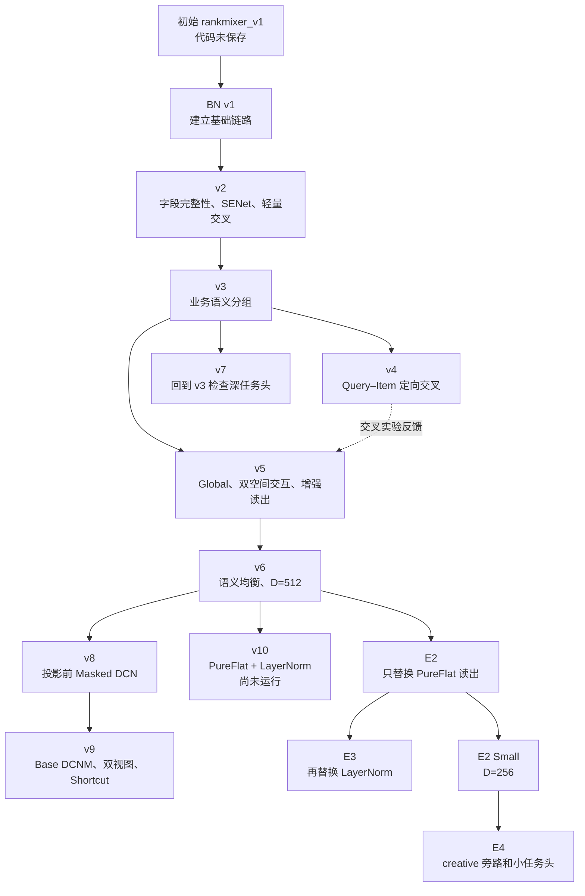
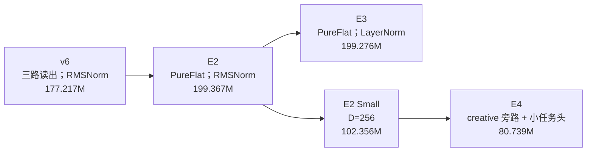
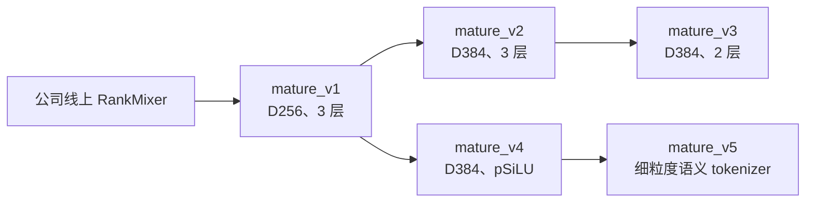

# RankMixer 搜索首次转化率模型阶段算法技术工作汇报（简版）

> 汇报日期：2026-09-04 
> 任务：电商搜索排序首次转化率（fst_CVR）预估 
> 数据来源：[RankMixer-汇总.xlsx](/Users/goku/Documents/Codex/RSA_code_0816/docs/RankMixer-汇总.xlsx)；背景来源：[background.md](/Users/goku/Documents/Codex/RSA_code_0816/docs/background.md) 
> 详细版本：[RankMixer 阶段算法技术工作汇报](/Users/goku/Documents/Codex/RSA_code_0816/introduce/RankMixer_阶段算法技术工作汇报_2026-09-03.md)

## 1. 工作目标与阶段结论

本阶段的目标是把 RankMixer 类结构适配到当前搜索 fst_CVR 任务，在相同三桶特征和训练协议下，逐步缩小与公司 Base 的离线 AUC 差距。研发方式是先快速验证结构假设，再围绕效果较好的 v6 做细致消融；同时从公司线上 RankMixer 代码出发，建立 mature 小模型路线。

当前得到的主要结论如下：

1. **特征组织方式有效。**v3 将连续均分改为业务语义分组，AUC 从 v2 的 **0.862690** 提升到 **0.862991**，提升 **万3.01**，且参数量不变。
2. **更大的模型不一定更好。**v5 扩展到 **348.432M** 参数；v6 恢复语义约束并将宽度减半后，参数降至 **177.217M**，8 月首日 AUC 从 **0.864163** 提升到 **0.866017**，提升 **千1.854**。
3. **读出接口是明确的改进点。**E2 用 PureFlat 替换 v6 的三路增强读出，三个共同测试日的平均 AUC 从 **0.867034** 提升到 **0.867497**，提升 **万4.63**。
4. **当前 LayerNorm 替换没有带来额外收益。**E3 只在 E2 上替换 Norm，首日 AUC 从 **0.866562** 降到 **0.866386**，下降 **万1.76**。
5. **公司成熟结构具有较高效率。**mature_v1 参数约 **109.977M**，两个测试日 AUC 为 **0.866934/0.867801**，仅比同日 Base 低 **万0.26/万0.66**，是现有结果中最接近 Base 的候选。

8 月 16 日 Base AUC 为 **0.866960**。自研 BN 系列最高结果是 v8 的 **0.866615**，低 Base **万3.45**；全部候选目前仍未在表内超过同日 Base。

## 2. 数据口径与核心技术

输入由三类特征组成：common 385 个字段、item 835 个字段、creative 14 个字段；单字段 Embedding 维度为 17，总输入宽度为 20,978。

报告只比较共同测试日。若方案 $a$ 和 $b$ 在日期 $d$ 的 AUC 分别为 $\operatorname{AUC}_a(d)$ 和 $\operatorname{AUC}_b(d)$，则：

$$
\Delta_{a-b}(d)=\operatorname{AUC}_a(d)-\operatorname{AUC}_b(d).
$$

AUC 绝对差值达到 0.001 时使用“千”口径，小于 0.001 时使用“万”口径。例如，0.003 写作“千3”，0.0002 写作“万2”。7 月 5 日的 v5 没有运行，因此 v5 的 7 月统计只使用 7 月 2～4 日。

RankMixer 的基本思路是先把完整字段组织成 token，再用固定置换交换不同 token 的部分 channel，最后通过 token 独立的 FFN 学习交互：

$$
x_t=\phi\!\left(\operatorname{Concat}_{j\in G_t}E_jW_t+b_t\right),
$$

$$
Z=P^{-1}\!\left(P(X)+F_m(\operatorname{Norm}(P(X)))\right),
\qquad
X'=X+F_o(\operatorname{Norm}(Z)).
$$

其中 $G_t$ 是第 $t$ 个 token 对应的字段组，$P/P^{-1}$ 是无参数 Mixing/Reverting，$F_m/F_o$ 是重排空间和原空间中的 Per-token FFN。基础 Mixing 与 Per-token FFN 来自 [RankMixer](https://arxiv.org/abs/2507.15551)；Mixing/Reverting、Per-token SwiGLU 和 RMSNorm 主要参考 [TokenMixer-Large](/Users/goku/Documents/Codex/RSA_code_0816/docs/tokenmixer/TokenMixer-Large.pdf)。其他基础机制分别参考 [SENet](https://arxiv.org/abs/1709.01507)、[DCN](https://arxiv.org/abs/1708.05123)、[SwiGLU](https://arxiv.org/abs/2002.05202)、[RMSNorm](https://arxiv.org/abs/1910.07467) 和 [LayerNorm](https://arxiv.org/abs/1607.06450)。语义分组、Query–Item Cross、PureFlat 和 creative 旁路是结合本任务特征、已有实验及公司代码提出的内部方案。

## 3. 整体迭代路线

版本号不等于严格的父子关系。v7 回到 v3 检查任务头；v8 的设计父版本是 v6；v10 是基于 v6 的联合方案，当前尚未运行。

## 4. 自研 BN RankMixer v1～v10

### 4.1 v1：先建立可运行的 RankMixer 基线

**问题依据：**需要先验证无参数 Mixing 与 Per-token FFN 能否接入现有三桶特征。最初实现直接把 20,978 维输入切成 16 段，切点会落入字段内部，部分 token 还跨越特征桶，业务含义不清楚。

**核心改动：**完成三桶 BN、16 token 投影、两层 RankMixer 和均值池化链路，作为后续诊断起点。代码：[cvr_bn_rankmixer_v1.py](/Users/goku/Documents/Codex/RSA_code_0816/src/models/rankmixer/cvr_bn_rankmixer_v1.py)。

**AUC 反馈：**7 月首日，最早但未保存代码的 rankmixer_v1 为 **0.858606**，保存代码的 BN v1 为 **0.862033**，BN v1 提升 **千3.427**。BN v1 四日平均 AUC 为 **0.863170**，同日 Base 均值为 **0.865836**，仍低 **千2.666**。

### 4.2 v2：修复字段边界，并补齐基础建模能力

**问题依据：**v1 存在字段被切开、不同桶混入同一 token、缺少字段重要性选择、参数量较大等问题。

**核心改动：**按完整字段分组为 common/item/creative=`5/10/1` 个 token；加入字段级 SENet、Gated Pool 和 Bucket Cross；FFN 扩展率从 4 降到 2，并修正续训后的学习率 milestone。代码：[cvr_bn_rankmixer_v2.py](/Users/goku/Documents/Codex/RSA_code_0816/src/models/rankmixer/cvr_bn_rankmixer_v2.py)。

**AUC 反馈：**首日 AUC 从 v1 的 **0.862033** 提升到 **0.862690**，提升 **万6.57**；同日 Base 为 **0.864538**。参数从 **167.293M** 降到 **95.809M**。由于多项修改同时发生，该结果属于完整 v2 方案，不能拆成单个模块收益。

### 4.3 v3：从字段完整进一步升级为业务语义完整

**问题依据：**v2 虽然不再切断字段，但仍按字段顺序连续均分；相邻字段未必具有相同业务含义。

**核心改动：**保持 v2 主干和参数量不变，将字段按 Query、用户行为、商品文本、价格、统计等业务语义固定分组，并增加完整覆盖和无重复检查。代码：[cvr_bn_rankmixer_v3.py](/Users/goku/Documents/Codex/RSA_code_0816/src/models/rankmixer/cvr_bn_rankmixer_v3.py)。

**AUC 反馈：**同日 AUC 从 v2 的 **0.862690** 提升到 v3 的 **0.862991**，提升 **万3.01**；两者参数均为 **95.809M**。v3 七日平均 AUC 为 **0.865005**，同日 Base 均值为 **0.866215**，仍低 **千1.210**。这提供了较清楚的语义分组正向证据。

### 4.4 v4：验证 Query–Item 定向交叉

**问题依据：**搜索相关性依赖 Query 与候选商品的条件关系，因此尝试在已有语义 token 上显式加入 Query–Item 交互。

**核心改动：**对 Query token 与商品文本、商品身份质量 token 构造乘积项和差值项，通过低秩网络与零初始化残差接回主干。代码：[cvr_bn_rankmixer_v4.py](/Users/goku/Documents/Codex/RSA_code_0816/src/models/rankmixer/cvr_bn_rankmixer_v4.py)。

**AUC 反馈：**v4 为 **0.862709**，v3 为 **0.862991**，下降 **万2.82**。说明在已压缩 token 上增加当前定向交叉没有形成净收益，后续因此转向投影前的完整字段交叉。

### 4.5 v5：同时增强主干交互、全局信息和读出

**问题依据：**v3 仍落后 Base，v4 的局部交叉也没有补齐差距，需要检查全局信息、重排残差、主干容量和读出压缩是否共同限制模型。

**核心改动：**token 数增至 32、宽度增至 1,024；加入 Global Token、Mixing/Reverting、双空间 Per-token SwiGLU、RMSNorm，以及 Global/Pool/Flatten 三路读出和深任务头。代码：[cvr_bn_rankmixer_v5.py](/Users/goku/Documents/Codex/RSA_code_0816/src/models/rankmixer/cvr_bn_rankmixer_v5.py)。

**AUC 反馈：**在 7 月三个共同测试日，v5 为 **0.863747/0.864929/0.866454**，v3 为 **0.862991/0.864324/0.865902**，分别提升 **万7.56/万6.05/万5.52**；平均 AUC 为 **0.865043 vs 0.864406**，提升 **万6.38**。与上一编号版本 v4 的唯一共同日相比，v5 **0.863747**、v4 **0.862709**，提升 **千1.038**。代价是参数量增至 **348.432M**。

### 4.6 v6：保留有效结构，同时恢复语义约束并控制宽度

**问题依据：**v5 的增强链路表现出潜力，但参数成本过高；v3 又证明业务语义分组有效。

**核心改动：**保留 v5 的 Global、双空间交互和增强读出；将 Local token 改为 `10/20/1` 个语义均衡组，宽度从 1,024 降至 512，中间维度仍保持 704。代码：[cvr_bn_rankmixer_v6.py](/Users/goku/Documents/Codex/RSA_code_0816/src/models/rankmixer/cvr_bn_rankmixer_v6.py)。

**AUC 反馈：**8 月首日 v6 为 **0.866017**，v5 为 **0.864163**，提升 **千1.854**；参数从 **348.432M** 降到 **177.217M**。v6 四日平均 AUC 为 **0.867495**，同日 Base 平均差距为 **万9.06**。由于语义分组和宽度同时改变，不能把全部提升只归因于其中一项。

### 4.7 v7：回到 v3，检查浅任务头是否限制表达

**问题依据：**v5/v6 相比早期版本还引入了深任务头，需要判断效果是否主要来自任务头容量。

**核心改动：**回到 v3 的 16-token 主干、Gated Pool 和 Bucket Cross，只把末端线性预测替换为 `[2048,2048,256]` 深任务头。代码：[cvr_bn_rankmixer_v7.py](/Users/goku/Documents/Codex/RSA_code_0816/src/models/rankmixer/cvr_bn_rankmixer_v7.py)。

**AUC 反馈：**8 月首日 v7 为 **0.865866**，上一编号版本 v6 为 **0.866017**，低 **万1.51**；同日 Base 为 **0.866960**。由于当前没有同一 8 月实验链的 v3 结果，不能用现有数据计算“深任务头相对 v3”的净收益。

### 4.8 v8：把显式交叉前移到 token 投影之前

**问题依据：**v4 在压缩后的少量 token 上交叉失败，而 Base 在完整字段空间做 DCN 交叉。由此推测，有用的低阶组合可能需要在字段压缩前建立。

**核心改动：**在 20,978 维输入上增加两层低秩 Masked DCN；Local token 读取 Cross 视图，Global Token 保留 Raw 视图；同时把 SwiGLU 中间维度从 704 调为 512。代码：[cvr_bn_rankmixer_v8.py](/Users/goku/Documents/Codex/RSA_code_0816/src/models/rankmixer/cvr_bn_rankmixer_v8.py)。

**AUC 反馈：**v8 为 **0.866615**，上一编号版本 v7 为 **0.865866**，提升 **万7.49**；与设计父版本 v6 的 **0.866017** 相比提升 **万5.98**，同日低 Base **万3.45**。这是自研 BN 系列在 8 月首日的最高结果，但交叉形式与中间宽度同时变化，仍属于组合效果。

### 4.9 v9：进一步对齐 Base 的 DCNM，并保留 Raw/Cross 双视图

**问题依据：**v8 使用的是新设计的 Masked DCN，因此继续检查公司 Base 的两层 DCNM500 是否更可靠，同时避免 token 投影丢失原始信息。

**核心改动：**复用 Base 的 DCNM500；Local 同时读取 Raw/Cross，Global 改读 Cross，并增加 DCNM Shortcut；Flatten 宽度从 512 降至 256。代码：[cvr_bn_rankmixer_v9.py](/Users/goku/Documents/Codex/RSA_code_0816/src/models/rankmixer/cvr_bn_rankmixer_v9.py)。

**AUC 反馈：**v9 为 **0.865254**，v8 为 **0.866615**，下降 **千1.361**；同日低 Base **千1.706**。说明“Base DCNM + 双视图 + Shortcut”的完整组合没有在本次实验中胜出，无法只归因于某一个模块。

### 4.10 v10：检查 PureFlat 与 LayerNorm 联合端点

**问题依据：**v6 的三路读出仍会汇聚或压缩 Local token，任务头无法直接看到完整 token 表示；同时需要检查 RMSNorm 是否合适。

**核心改动：**把全部 32 个 token 直接展平为 16,384 维输入任务头，并把主干 Norm 改为 LayerNorm。代码：[cvr_bn_rankmixer_v10.py](/Users/goku/Documents/Codex/RSA_code_0816/src/models/rankmixer/cvr_bn_rankmixer_v10.py)。

**结果状态：**v10 **尚未运行**。上一编号版本 v9 的首日 AUC 为 **0.865254**，但没有 v10 AUC，因此不能进行数值比较。E3 与当前 v10 代码具有相同的核心结构端点，表中的 **0.866386 只属于 E3**。

## 5. 围绕 v6 的细致消融

v10 同时改变读出和 Norm，无法直接归因，因此将联合方案拆为 v6→E2→E3，并继续检查宽度和 creative 路径。

| 方案 | 为什么做 | 主要变化 | AUC 结果 |
|---|---|---|---|
| [E2](/Users/goku/Documents/Codex/RSA_code_0816/src/models/rankmixer/cvr_bn_rankmixer_v6_e2.py) | 检查 v6 是否在读出阶段过早压缩信息 | 三路增强读出整体替换为 32×512 PureFlat；主干和 RMSNorm 保持不变 | 三个共同日：E2 **0.866562/0.867488/0.868440**，v6 **0.866017/0.867088/0.867996**；分别提升 **万5.45/万4.00/万4.44**，平均提升 **万4.63** |
| [E3](/Users/goku/Documents/Codex/RSA_code_0816/src/models/rankmixer/cvr_bn_rankmixer_v6_e3.py) | 隔离 Norm 的影响 | 在 E2 上把全链路 RMSNorm 换为当前 LayerNorm 实现 | 首日 E3 **0.866386**、E2 **0.866562**，下降 **万1.76**；E3 仍比 v6 **0.866017** 高 **万3.69** |
| [E2 Small](/Users/goku/Documents/Codex/RSA_code_0816/src/models/rankmixer/cvr_bn_rankmixer_v6_e2_small.py) | E2 效果较好但成本上升，需要检查宽度冗余 | D 从 512 降到 256，M 保持 704，并优化 token 构造图 | 首日 Small **0.866510**、E2 **0.866562**，仅低 **万0.52**；参数从 **199.367M** 降到 **102.356M** |
| [E4](/Users/goku/Documents/Codex/RSA_code_0816/src/models/rankmixer/cvr_bn_rankmixer_v6_e4.py) | 检查 creative 是否必须进入主干，并继续降低任务头成本 | common/item 进入主干，creative 独立旁路；改均值读出和 `[256,128]` 小任务头 | 首日 E4 **0.866333**、Small **0.866510**，下降 **万1.77**；参数进一步降到 **80.739M** |

这组消融中，证据最明确的是 E2：PureFlat 相对 v6 连续三天正向。Small 展示了较好的单日成本取舍；E3 和 E4 则说明当前 Norm 替换、creative 旁路与小任务头的组合没有继续提高 AUC。

## 6. 公司线上结构适配：mature 系列

mature 路线不是从自研 v6 继续修改，而是从公司线上 RankMixer 结构出发，在当前三桶 fst_CVR 任务上建立小参数量版本，再围绕宽度、深度、FFN 和 tokenizer 做消融。

| 版本 | 迭代原因与改动 | 参数量 | AUC 反馈 |
|---|---|---:|---|
| [mature_v1](/Users/goku/Documents/Codex/RSA_code_0816/src/models/rankmixer/cvr_senet_mature_rankmixer_v1.py) | 用 D256、3 层 pSwiGLU、维度级 SENet、Global Token、均值池化和 creative 旁路保留线上成熟结构的主要组合 | 109.977M | 两日 **0.866934/0.867801**，Base **0.866960/0.867867**，分别低 **万0.26/万0.66** |
| [mature_v2](/Users/goku/Documents/Codex/RSA_code_0816/src/models/rankmixer/cvr_senet_mature_rankmixer_v2.py) | 检查成熟结构是否仍能从容量扩展中受益；D256→384，M896→1344，保持 3 层 | 205.158M | 尚无 AUC 记录 |
| [mature_v3](/Users/goku/Documents/Codex/RSA_code_0816/src/models/rankmixer/cvr_senet_mature_rankmixer_v3.py) | mature_v2 超过 200M，因此保持 D384/M1344，把 3 层减为 2 层，检查深度成本 | 155.512M | 尚无 AUC 记录 |
| [mature_v4](/Users/goku/Documents/Codex/RSA_code_0816/src/models/rankmixer/cvr_senet_mature_rankmixer_v4.py) | D384 下 SwiGLU 成本较高，因此改为单上投影 pSiLU，并同步调整各分支宽度 | 164.968M | 首日 **0.866206**；mature_v1 **0.866934**，低 **万7.28**。v2/v3 无 AUC，因此不能与它们比较 |
| [mature_v5](/Users/goku/Documents/Codex/RSA_code_0816/src/models/rankmixer/cvr_senet_mature_rankmixer_v5.py) | v4 的粗组会让多个 token 共享整组字段，token 缺少明确语义；改为 31 个细粒度语义 Local token | 135.775M | 首日 **0.866289**；mature_v4 **0.866206**，提升 **万0.83**，但仍比 mature_v1 **0.866934** 低 **万6.45** |

mature_v1 的结果说明，较小模型也可以通过更合理的 SENet、交互、归一化和业务路径组合接近 Base。mature_v4/v5 进一步表明，扩宽主干或迁移局部结构仍需完整实验验证，不能用参数量推断 AUC。

## 7. UniMixer 独立对照

UniMixer 用可学习的块间和块内混合矩阵替代 RankMixer 的固定置换，用于检查自适应信息路由是否更合适。当前实现同时包含自己的语义 token、SiameseNorm、Per-token SwiGLU 和 PureFlat 读出，因此结果代表完整 UniMixer 候选。

首日 UniMixer v1 AUC 为 **0.865662**，同日 Base 为 **0.866960**，低 **千1.298**。当前结果不能单独证明“可学习 Mixing”不如固定 Mixing，因为两套方案还存在其他结构差异。代码：[cvr_bn_unimixer_v1.py](/Users/goku/Documents/Codex/RSA_code_0816/src/models/rankmixer/cvr_bn_unimixer_v1.py)。

## 8. 结果汇总与下一步

| 当前候选 | AUC 证据 | 建议定位 |
|---|---|---|
| mature_v1 | 两日最接近 Base：**0.866934/0.867801** | 优先补充多日和多随机种子验证 |
| v6_e2 | 相对 v6 三个共同测试日均正向，平均提升 **万4.63** | 自研路线新的主要对照点 |
| v6_e2_small | 首日 **0.866510**，仅比 E2 低 **万0.52**，参数约减半 | 成本敏感候选 |
| v8 | 首日 **0.866615**，为自研 BN 系列最高 | 补做保持 M 不变的 Masked DCN 单变量对照 |

下一阶段应优先延长 mature_v1、E2/Small 和 v8 的同日实验链，并固定实际代码、参数和 checkpoint。结构归因方面，重点补充 E2 的参数预算匹配读出对照、v8 的纯交叉对照，以及 mature 路线中 SENet、Norm、creative 旁路和 tokenizer 的单变量实验。

当前结果主要来自单次离线运行，尚无多随机种子统计或置信区间。因此，这一阶段可以确认的是迭代路径、候选收敛和消融方向，暂不能把单日差值解释为稳定线上收益。
