# RankMixer 搜索首次转化率模型阶段算法技术工作汇报（简版）

> 汇报日期：2026-09-04<br>
> 任务：电商搜索排序首次转化率（fst_CVR）预估<br>
> 数据来源：[RankMixer-汇总.xlsx](/Users/goku/Documents/Codex/RSA_code_0816/docs/RankMixer-汇总.xlsx)；背景来源：[background.md](/Users/goku/Documents/Codex/RSA_code_0816/docs/background.md)<br>
> 详细版本：[RankMixer 阶段算法技术工作汇报](/Users/goku/Documents/Codex/RSA_code_0816/introduce/RankMixer_阶段算法技术工作汇报_2026-09-03.md)

## 1. 工作目标与阶段结论

本阶段的目标是把 RankMixer 类结构适配到搜索 fst_CVR 任务，在相同三桶特征和训练协议下逐步缩小与公司 Base 的离线 AUC 差距。研发过程采用两种方式：先快速验证输入、交互和读出假设，再围绕效果较好的 v6 做细致消融；同时从公司线上 RankMixer 代码出发，建立 mature 小模型路线。

阶段结论可以概括为五点：

1. **字段如何组成 token 会直接影响效果。**v3 将连续均分改为业务语义分组，AUC 从 v2 的 **0.862690** 提升到 **0.862991**，提升 **万3.01**，参数量不变。
2. **增加容量不能代替合理的信息组织。**v5 扩展到 **348.432M**；v6 恢复语义约束并把宽度减半后，参数降至 **177.217M**，8 月首日 AUC 从 **0.864163** 提升到 **0.866017**，提升 **千1.854**。
3. **读出接口是当前最明确的改进点。**E2 用 PureFlat 替换 v6 的三路读出，三个共同测试日均取得正向变化，逐日结果见 5.1 节。
4. **当前 LayerNorm 配置没有继续提高效果。**E3 只在 E2 上替换 Norm，首日 AUC 从 **0.866562** 降到 **0.866386**，下降 **万1.76**。
5. **公司成熟结构的容量分配更高效。**mature_v1 约 **109.977M**，两日平均仅比 Base 低 **万0.46**，是当前最接近 Base 的候选；逐日结果见 6.1 节。

8 月 16 日 Base AUC 为 **0.866960**。自研 BN 系列最高是 v8 的 **0.866615**，低 Base **万3.45**；当前表内尚无候选超过同日 Base。

## 2. 数据口径与核心机制

输入包含 common 385 个字段、item 835 个字段和 creative 14 个字段；单字段 Embedding 维度为 17，总输入宽度为 20,978。7 月和 8 月是两条独立实验链，版本对比只使用共同测试日。

若两个方案在日期 $d$ 的结果分别为 $\operatorname{AUC}_a(d)$ 和 $\operatorname{AUC}_b(d)$，则：

$$
\Delta_{a-b}(d)=\operatorname{AUC}_a(d)-\operatorname{AUC}_b(d).
$$

AUC 绝对差值达到 0.001 时使用“千”口径，小于 0.001 时使用“万”口径。例如，0.003 写作“千3”，0.0002 写作“万2”。7 月 5 日的 v5 没有运行，因此 v5 的 7 月统计只使用 7 月 2～4 日。

RankMixer 先把字段集合 $G_t$ 投影为 token，再用无参数置换交换不同 token 的部分 channel，最后通过 token 独立的 FFN 学习交互：

$$
x_t=\phi\!\left(\operatorname{Concat}_{j\in G_t}E_jW_t+b_t\right).
$$

基础 Mixing 与 Per-token FFN 来自 [RankMixer](https://arxiv.org/abs/2507.15551)；Mixing/Reverting、Per-token SwiGLU 和 RMSNorm 主要参考 [TokenMixer-Large](/Users/goku/Documents/Codex/RSA_code_0816/docs/tokenmixer/TokenMixer-Large.pdf)。其他机制分别参考 [SENet](https://arxiv.org/abs/1709.01507)、[DCN](https://arxiv.org/abs/1708.05123)、[SwiGLU](https://arxiv.org/abs/2002.05202)、[RMSNorm](https://arxiv.org/abs/1910.07467) 和 [LayerNorm](https://arxiv.org/abs/1607.06450)。业务语义分组、Query–Item Cross、PureFlat 和 creative 旁路来自本阶段的代码诊断、离线实验与公司结构经验。

## 3. 整体迭代路线

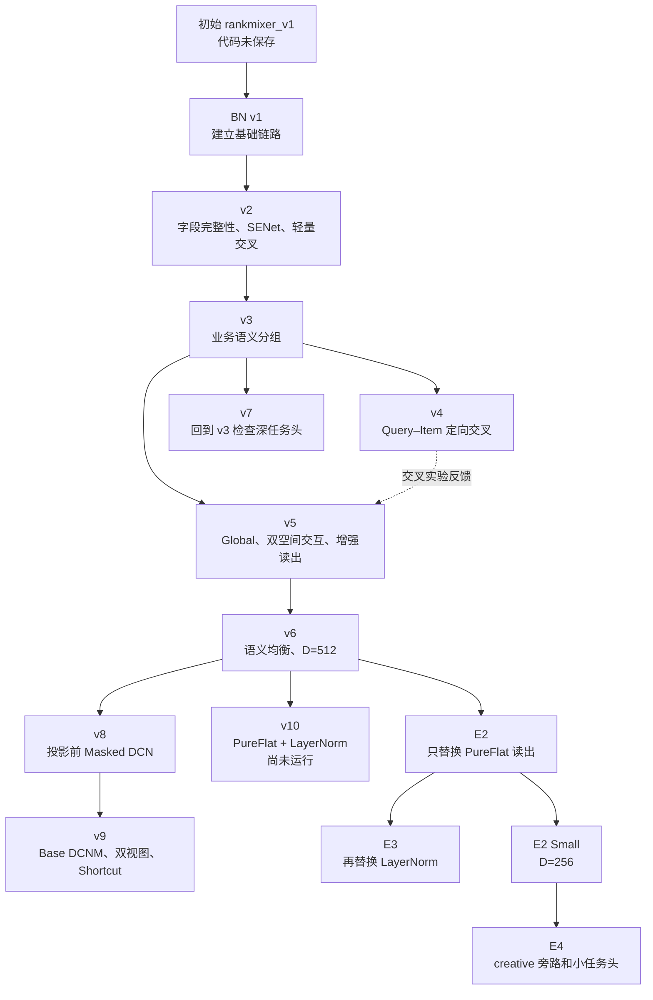

版本号不等于严格的父子关系。v7 回到 v3 检查任务头；v8 的设计父版本是 v6；v10 是基于 v6 的联合方案，当前尚未运行。

## 4. 自研 BN RankMixer v1～v10

### 4.1 v1：建立可运行基线，并定位输入切分问题

**为什么修改：**需要先验证无参数 Mixing 与 Per-token FFN 能否接入三桶输入。v1 直接拼接 20,978 维特征后切成 16 段，因此切点会落入 17 维字段内部，部分 token 还会跨越特征桶。

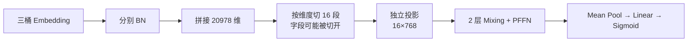

**核心公式：**v1 使用位置切片生成 token：

$$
s_t=\operatorname{Slice}_t([E_c;E_i;E_a]),
\qquad x_t=\phi(s_tW_t+b_t).
$$

block 中先做 Mixing 残差，再在 FFN 前增加一次归一化：

$$
S=\operatorname{LN}_1(X+P(X)),
\qquad
X'=\operatorname{LN}_3\!\left(S+F(\operatorname{LN}_2(S))\right).
$$

代码：[cvr_bn_rankmixer_v1.py](/Users/goku/Documents/Codex/RSA_code_0816/src/models/rankmixer/cvr_bn_rankmixer_v1.py)。

| 测试日 | Base | 初始 v1（无代码） | BN v1 | BN v1 − Base |
|---|---:|---:|---:|---:|
| 07-02 | 0.864538 | 0.858606 | 0.862033 | −千2.505 |
| 07-03 | 0.865633 | 0.860093 | 0.862850 | −千2.783 |
| 07-04 | 0.867060 | 0.861917 | 0.864362 | −千2.698 |
| 07-05 | 0.866114 | 0.861130 | 0.863436 | −千2.678 |
| 四日均值 | 0.865836 | 0.860437 | 0.863170 | **−千2.666** |

首日 BN v1 的 **0.862033** 相比最早未保存代码方案的 **0.858606** 提升 **千3.427**。由于初始方案没有代码，该差值只能视为完整方案比较。

### 4.2 v2：从“按维度切片”改为“按完整字段分组”

**为什么修改：**v1 破坏字段边界、缺少字段重要性选择，且 $k=4$ 的 PFFN 使参数达到 167.293M。v2 同时修复输入组织、容量和基础交互能力。

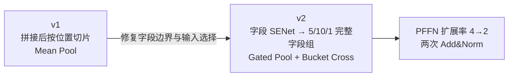

**公式前后对比：**

$$
\text{v1: }s_t=\operatorname{Slice}_t([E_c;E_i;E_a])
\quad\Longrightarrow\quad
\text{v2: }x_t=\phi\!\left(\operatorname{Concat}_{j\in G_t}\widetilde E_jW_t+b_t\right).
$$

v2 在投影前增加字段级 SENet：

$$
\widetilde E_{j,:}=2\sigma(g_j)E_{j,:},
$$

并将 block 从“FFN 前额外 LN”改为两次 Add&Norm：

$$
\text{v1: }X'=\operatorname{LN}(S+F(\operatorname{LN}(S)))
\quad\Longrightarrow\quad
\text{v2: }X'=\operatorname{LN}(S+F(S)).
$$

读出从均值池化改为学习 token 权重，并补充三桶乘性交叉：

$$
p_{\mathrm{v1}}=\frac1T\sum_th_t
\quad\Longrightarrow\quad
p_{\mathrm{v2}}=\sum_t\operatorname{softmax}_t(w^\top h_t)h_t,
$$

$$
r=\phi([c;i;a;c\odot i;c\odot a;i\odot a]W+b),
\qquad h=\operatorname{LN}(p+\sigma(\eta)r).
$$

代码：[cvr_bn_rankmixer_v2.py](/Users/goku/Documents/Codex/RSA_code_0816/src/models/rankmixer/cvr_bn_rankmixer_v2.py)。

| 测试日 | Base | BN v1 | v2 | v2 − BN v1 |
|---|---:|---:|---:|---:|
| 07-02 | 0.864538 | 0.862033 | **0.862690** | **万6.57** |

参数从 **167.293M** 降至 **95.809M**。由于字段切分、SENet、Pool、Cross 和训练调度同时变化，AUC 只能归于完整 v2 方案。

### 4.3 v3：保持公式与参数不变，只改变字段集合的语义

**为什么修改：**v2 已保证字段完整，但仍按排列顺序连续均分；相邻字段不一定属于相同业务主题。对于参数独立的 Per-token FFN，token 身份稳定且语义明确更有利于学习。

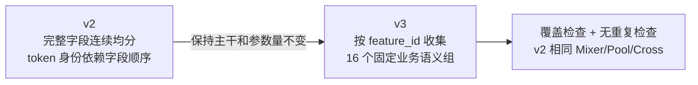

**公式前后对比：**投影公式不变，变化只在集合 $G_t$ 的定义：

$$
\text{v2: }G_t=\operatorname{ContiguousSplit}_t(\mathcal F)
\quad\Longrightarrow\quad
\text{v3: }G_t=\operatorname{SemanticGroup}_t(\text{feature\_id}),
$$

$$
G_t\cap G_s=\varnothing\ (t\ne s),
\qquad \bigcup_tG_t=\mathcal F.
$$

代码：[cvr_bn_rankmixer_v3.py](/Users/goku/Documents/Codex/RSA_code_0816/src/models/rankmixer/cvr_bn_rankmixer_v3.py)。

| 测试日 | Base | v3 | v3 − Base |
|---|---:|---:|---:|
| 07-02 | 0.864538 | 0.862991 | −千1.547 |
| 07-03 | 0.865633 | 0.864324 | −千1.309 |
| 07-04 | 0.867060 | 0.865902 | −千1.158 |
| 07-05 | 0.866114 | 0.865013 | −千1.101 |
| 07-06 | 0.865990 | 0.864862 | −千1.128 |
| 07-07 | 0.866681 | 0.865544 | −千1.137 |
| 07-08 | 0.867488 | 0.866401 | −千1.087 |
| 七日均值 | 0.866215 | 0.865005 | **−千1.210** |

在唯一可与 v2 直接比较的 07-02，v3 **0.862991**、v2 **0.862690**，提升 **万3.01**；两者参数均为 **95.809M**。这是本阶段较清楚的语义分组正向证据。

### 4.4 v4：在语义 token 上加入 Query–Item 定向交叉

**为什么修改：**v3 已经形成 Query、商品文本和商品身份质量等明确 token。搜索相关性依赖 Query 与候选商品之间的条件关系，因此尝试在这些位置增加有方向的交互。

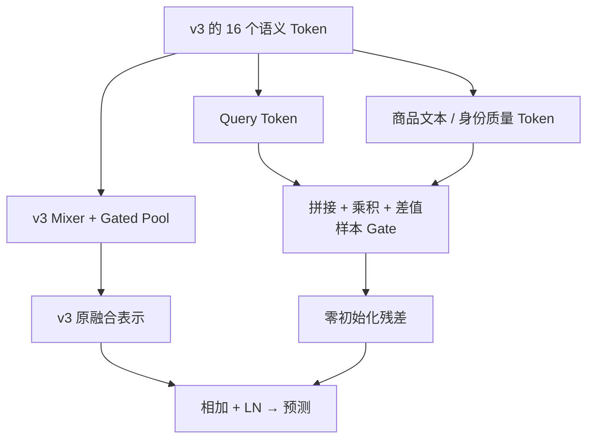

**公式前后对比：**v3 的末端只有 Gated Pool 与 Bucket Cross；v4 增加 $r_{QI}$：

$$
\text{v3: }h=\operatorname{LN}(p+r_{\mathrm{bucket}})
\quad\Longrightarrow\quad
\text{v4: }h'=\operatorname{LN}(p+r_{\mathrm{bucket}}+r_{QI}).
$$

对 Query 表示 $q$ 和目标商品表示 $i$，新增分支为：

$$
z=\phi([q;i;q\odot i;q-i]W_h+b_h),
\qquad
g=\sigma([q;i;q\odot i]w_g+b_g),
$$

$$
r_{q\to i}=g_i(z_iW_{o,i}+b_{o,i}),
\qquad
r_{QI}=r_{q\to\mathrm{text}}+r_{q\to\mathrm{identity}}.
$$

$W_{o,i},b_{o,i}$ 零初始化，使新增分支初始输出为零，避免一开始破坏 v3 主路径。代码：[cvr_bn_rankmixer_v4.py](/Users/goku/Documents/Codex/RSA_code_0816/src/models/rankmixer/cvr_bn_rankmixer_v4.py)。

| 测试日 | v3 | v4 | v4 − v3 |
|---|---:|---:|---:|
| 07-02 | 0.862991 | 0.862709 | **−万2.82** |

该分支增加约 0.630M 参数，但没有形成净收益。后续 v8 因此把显式交叉前移到 token 投影之前。

### 4.5 v5：升级为 Global Token、双空间交互和三路读出

**为什么修改：**v3 多日仍落后 Base，v4 的局部交叉也没有补齐差距。新的问题是：局部 token 是否缺少全局信息、Mixing 后的残差是否应该恢复原布局、读出是否过早压缩，以及主干容量是否不足。

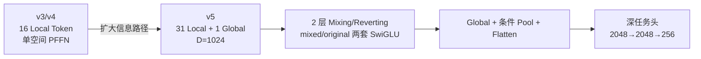

**主干公式前后对比：**v3/v4 在 Mixing 后使用一套 PFFN；v5 在重排空间和恢复后的原空间各使用一套 Per-token SwiGLU：

$$
\text{v3: }S=\operatorname{LN}(X+P(X)),
\qquad X'=\operatorname{LN}(S+F(S)),
$$

$$
\text{v5: }Y=P(X),
\qquad \widetilde Y=Y+F_m(\operatorname{RMS}(Y)),
$$

$$
Z=P^{-1}(\widetilde Y),
\qquad
\boxed{X'=X+F_o(\operatorname{RMS}(Z))}.
$$

Per-token FFN 同时由普通两层 GELU 改为 SwiGLU：

$$
F_{\mathrm{PFFN}}(u)=\phi(uW_1+b_1)W_2+b_2
$$

$$
\Longrightarrow\quad
F_{\mathrm{SwiGLU}}(u)=
\left[(uW_u+b_u)\odot\operatorname{SiLU}(uW_g+b_g)\right]W_d+b_d.
$$

**读出公式前后对比：**

$$
\text{v3/v4: }h=\operatorname{LN}(p+r_{\mathrm{bucket}})
\quad\Longrightarrow\quad
\text{v5: }h=[g_{\mathrm{global}};p_{\mathrm{conditioned}};f_{\mathrm{flat}}].
$$

其中条件 Pool 用 Global 生成 query，对 31 个 Local token 加权；Flatten 分支保留 token 位置后压缩到 512 维。代码：[cvr_bn_rankmixer_v5.py](/Users/goku/Documents/Codex/RSA_code_0816/src/models/rankmixer/cvr_bn_rankmixer_v5.py)。

| 测试日 | v3 | v5 | v5 − v3 |
|---|---:|---:|---:|
| 07-02 | 0.862991 | 0.863747 | 万7.56 |
| 07-03 | 0.864324 | 0.864929 | 万6.05 |
| 07-04 | 0.865902 | 0.866454 | 万5.52 |
| 三日均值 | 0.8644057 | 0.8650433 | **万6.38** |

| 与上一编号版本比较 | v4 | v5 | v5 − v4 |
|---|---:|---:|---:|
| 07-02 | 0.862709 | 0.863747 | **千1.038** |

v5 的组合结构取得正向结果，但参数增至 **348.432M**；其中双空间 Per-token SwiGLU 是主要参数来源，因此 v6 转向宽度控制。

### 4.6 v6：保留 v5 信息路径，恢复语义分组并将宽度减半

**为什么修改：**v5 的双空间主干和增强读出有潜力，但成本过高；v3 又证明语义分组有效。v6 将这两条经验合并。

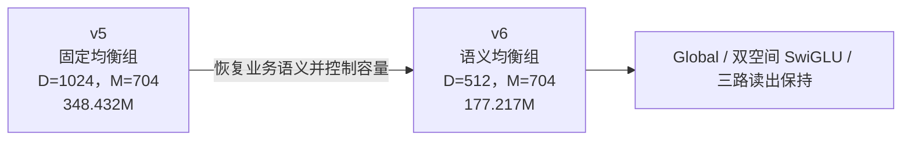

**公式与维度变化：**双空间 block 公式保持不变，字段集合和宽度发生变化：

$$
G_t^{\mathrm{v5}}=\operatorname{FixedBalancedGroup}_t(\mathcal F)
\quad\Longrightarrow\quad
G_t^{\mathrm{v6}}=\operatorname{SemanticBalancedGroup}_t(\mathcal F),
$$

$$
D:1024\to512,
\qquad M:704\to704,
\qquad h_{\mathrm{readout}}:2560\to1536.
$$

双空间 SwiGLU 的主要矩阵参数近似为 $6LTDM$。本次 $L,T,M$ 不变，因此主干参数随 $D$ 近似减半，而不是按 $D^2$ 降为四分之一。代码：[cvr_bn_rankmixer_v6.py](/Users/goku/Documents/Codex/RSA_code_0816/src/models/rankmixer/cvr_bn_rankmixer_v6.py)。

| 测试日 | Base | v6 | v6 − Base |
|---|---:|---:|---:|
| 08-16 | 0.866960 | 0.866017 | −万9.43 |
| 08-17 | 0.867867 | 0.867088 | −万7.79 |
| 08-18 | 0.868909 | 0.867996 | −万9.13 |
| 08-19 | 0.869868 | 0.868878 | −万9.90 |
| 四日均值 | 0.868401 | 0.867495 | **−万9.06** |

| 同日版本比较 | v5 | v6 | v6 − v5 |
|---|---:|---:|---:|
| 08-16 | 0.864163 | 0.866017 | **千1.854** |

结果支持“语义分组与宽度控制”的完整组合，但两项同时变化，不能分别定量归因。

### 4.7 v7：回到 v3，只检查深任务头

**为什么修改：**v5/v6 除了改变主干，还引入了深任务头。为了判断早期模型是否受浅预测头限制，v7 回到 v3 主干，仅替换末端预测网络。

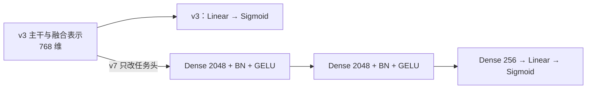

**公式前后对比：**

$$
\text{v3: }\hat p=\sigma(w^\top h+b)
$$

$$
\Longrightarrow\quad
h_k=\phi(\operatorname{BN}(h_{k-1}W_k+b_k)),\ k=1,2,3,
\qquad
\hat p_{\mathrm{v7}}=\sigma(h_3w_o+b_o),\quad h_0=h.
$$

代码：[cvr_bn_rankmixer_v7.py](/Users/goku/Documents/Codex/RSA_code_0816/src/models/rankmixer/cvr_bn_rankmixer_v7.py)。

| 测试日 | Base | 上一编号版本 v6 | v7 | v7 − v6 |
|---|---:|---:|---:|---:|
| 08-16 | 0.866960 | 0.866017 | 0.865866 | **−万1.51** |

v7 的设计父版本是 v3，而当前没有同一 8 月实验链的 v3 结果，因此不能计算深任务头相对 v3 的净收益；表中 v6 仅用于展示编号相邻版本的位置。

### 4.8 v8：把显式交叉前移到 token 投影之前

**为什么修改：**v4 在压缩后的少量语义 token 上做交叉没有收益，而公司 Base 在完整 20,978 维字段空间中使用 DCN。由此提出假设：有用的低阶组合应在 token 压缩前建立。

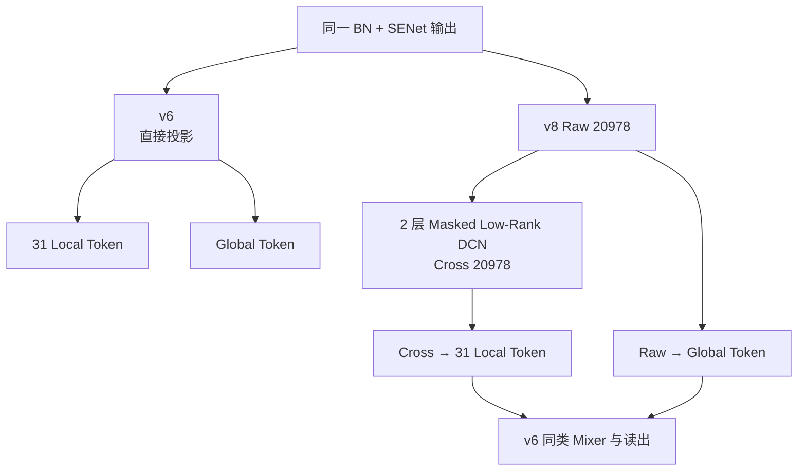

**公式前后对比：**v6 直接使用 $x_0$ 投影；v8 先构造 Cross 视图：

$$
\text{v6: }l_t=\operatorname{Proj}_t(x_0[G_t])
$$

$$
\Longrightarrow\quad
u_l=x_lV_l+b_{v,l},
\qquad
m_l=\operatorname{ReLU}(x_lA_l+b_{a,l})B_l+b_{m,l},
$$

$$
x_{l+1}=\operatorname{LN}\!\left(
x_l+x_0\odot[(u_l\odot m_l)U_l+b_{u,l}]
\right),
\qquad
l_t^{\mathrm{v8}}=\operatorname{Proj}_t(x_2[G_t]).
$$

Local token 读取 $x_2$，Global 仍读取 $x_0$，形成 Cross/Raw 两条路径。为控制新增 DCN 的成本，SwiGLU 中间维度同时从 $M=704$ 降到 $M=512$，因此 v8 不是纯单变量交叉实验。代码：[cvr_bn_rankmixer_v8.py](/Users/goku/Documents/Codex/RSA_code_0816/src/models/rankmixer/cvr_bn_rankmixer_v8.py)。

| 测试日 | Base | v7 | 设计父版本 v6 | v8 |
|---|---:|---:|---:|---:|
| 08-16 | 0.866960 | 0.865866 | 0.866017 | **0.866615** |

v8 比上一编号版本 v7 提升 **万7.49**，比设计父版本 v6 提升 **万5.98**，仍低 Base **万3.45**。这是自研 BN 系列在 8 月首日的最高结果。

### 4.9 v9：用 Base 同型 DCNM，并同时保留 Raw/Cross 信息

**为什么修改：**v8 使用新设计的 Masked DCN。v9 进一步检查公司强基线的 DCNM500 是否更可靠，并避免只保留 Cross 视图造成原始信息损失。

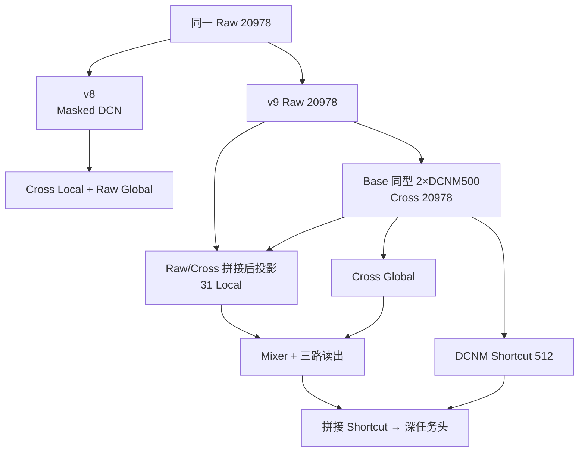

**公式前后对比：**v8 的交叉项包含学习 mask；v9 改为 Base 同型低秩 DCNM：

$$
\text{v8: }x_{l+1}=\operatorname{LN}\!\left(x_l+x_0\odot[(u_l\odot m_l)U_l+b_l]\right)
$$

$$
\Longrightarrow\quad
\text{v9: }x_{l+1}=\operatorname{LN}\!\left(
x_l+x_0\odot[(x_lV_l+b_{1,l})U_l+b_{2,l}]
\right).
$$

Local token 的输入也由单 Cross 视图改为 Raw/Cross 拼接：

$$
l_t^{\mathrm{v8}}=\operatorname{Proj}_t(x_2[G_t])
\quad\Longrightarrow\quad
l_t^{\mathrm{v9}}=\operatorname{Proj}_t([x_0[G_t];x_2[G_t]]).
$$

末端再增加 $s=\phi(\operatorname{BN}(x_2W_s+b_s))$ 的 DCNM Shortcut，最终读出由 1536 维增至 1792 维。代码：[cvr_bn_rankmixer_v9.py](/Users/goku/Documents/Codex/RSA_code_0816/src/models/rankmixer/cvr_bn_rankmixer_v9.py)。

| 测试日 | Base | v8 | v9 | v9 − v8 |
|---|---:|---:|---:|---:|
| 08-16 | 0.866960 | 0.866615 | 0.865254 | **−千1.361** |

v9 同日低 Base **千1.706**。交叉形式、视图、Global 来源、Shortcut 和 Flatten 宽度同时变化，因此结果只能评价完整组合。

### 4.10 v10：把三路读出改为 PureFlat，并切换 LayerNorm

**为什么修改：**v6 的条件 Pool 和压缩 Flatten 都会汇聚或降维，任务头不能直接访问完整 token 表示；同时需要检查 RMSNorm 是否构成限制。

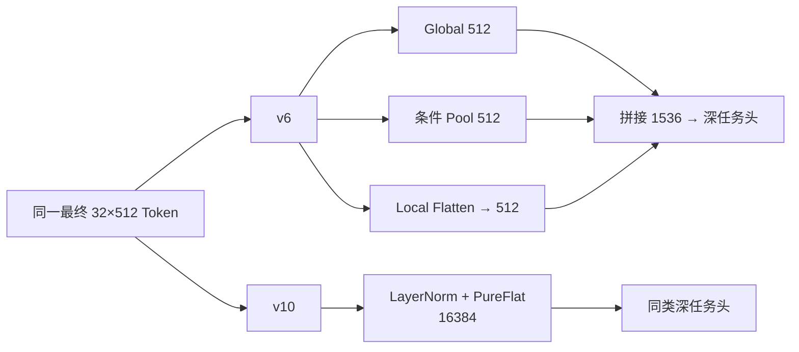

**公式前后对比：**

$$
h_{\mathrm{v6}}=[g;p;f_{512}]\in\mathbb R^{1536}
\quad\Longrightarrow\quad
h_{\mathrm{v10}}=\operatorname{vec}(\operatorname{LN}(X_L))
\in\mathbb R^{16384}.
$$

Norm 同时由只做尺度归一化的 RMSNorm 改为减均值的 LayerNorm：

$$
\operatorname{RMS}(x)=\gamma\odot
\frac{x}{\sqrt{\operatorname{mean}(x^2)+\epsilon}}
$$

$$
\Longrightarrow\quad
\operatorname{LN}(x)=\gamma\odot
\frac{x-\operatorname{mean}(x)}{\sqrt{\operatorname{Var}(x)+\epsilon}}+\beta.
$$

代码：[cvr_bn_rankmixer_v10.py](/Users/goku/Documents/Codex/RSA_code_0816/src/models/rankmixer/cvr_bn_rankmixer_v10.py)。

**结果状态：**v10 尚未运行。上一编号版本 v9 的首日 AUC 为 **0.865254**，但没有 v10 AUC，因此不能进行数值比较。E3 与当前 v10 代码具有相同核心结构端点，表中的 **0.866386 只属于 E3**。

### 4.11 主线首日结果一览

7 月和 8 月是独立实验链，下表不跨列计算差值。

| 版本 | 07-02 AUC | 08-16 AUC | 结果说明 |
|---|---:|---:|---|
| Base | 0.864538 | 0.866960 | 同日基准 |
| 初始 rankmixer_v1 | 0.858606 | — | 代码未保存 |
| BN v1 | 0.862033 | — | 建立基础链路 |
| v2 | 0.862690 | — | 字段安全与组合修正 |
| v3 | 0.862991 | — | 语义分组 |
| v4 | 0.862709 | — | QI Cross 回退 |
| v5 | 0.863747 | 0.864163 | 强化主干但成本高 |
| v6 | — | 0.866017 | 后续消融起点 |
| v7 | — | 0.865866 | v3 主干的深头实验 |
| v8 | — | **0.866615** | 自研 BN 首日最高 |
| v9 | — | 0.865254 | DCNM 双视图组合回退 |
| v10 | — | — | 尚未运行 |

## 5. 围绕 v6 的细致消融

v10 同时改变读出和 Norm，无法判断收益来自哪一项。因此将联合方案拆为 v6→E2→E3，并继续检查宽度与 creative 路径。

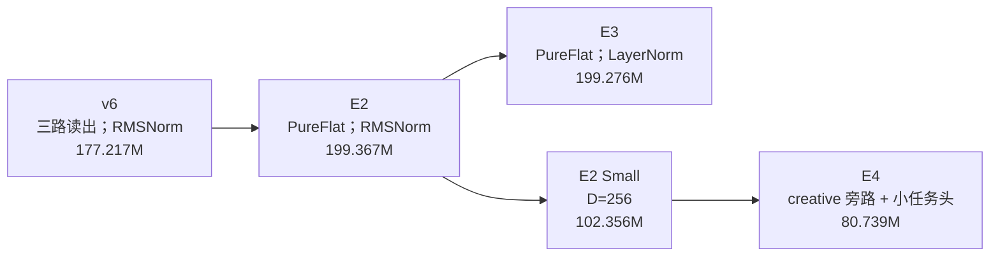

### 5.1 E2：只替换读出接口

**为什么修改：**v6 的三个读出分支都对 Local token 做了汇聚或压缩。E2 保留语义分组、D512 主干和 RMSNorm，只检查完整 token 表示是否应该直接交给任务头。

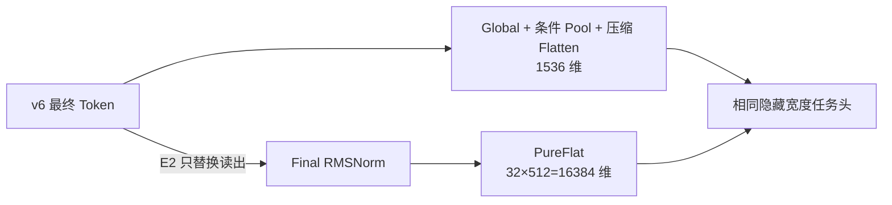

**公式前后对比：**

$$
h_{\mathrm{v6}}=[g;p;f_{512}]\in\mathbb R^{1536}
\quad\Longrightarrow\quad
h_{\mathrm{E2}}=\operatorname{vec}(\operatorname{RMS}(X_L))
\in\mathbb R^{16384}.
$$

任务头首层因此从 $1536\times2048$ 变为 $16384\times2048$；扣除原有 Pool 和 Flatten 分支后，总参数从 **177.217M** 增至 **199.367M**。代码：[cvr_bn_rankmixer_v6_e2.py](/Users/goku/Documents/Codex/RSA_code_0816/src/models/rankmixer/cvr_bn_rankmixer_v6_e2.py)。

| 测试日 | Base | v6 | E2 | E2 − v6 |
|---|---:|---:|---:|---:|
| 08-16 | 0.866960 | 0.866017 | 0.866562 | **万5.45** |
| 08-17 | 0.867867 | 0.867088 | 0.867488 | **万4.00** |
| 08-18 | 0.868909 | 0.867996 | 0.868440 | **万4.44** |
| 三日均值 | 0.867912 | 0.867034 | 0.867497 | **万4.63** |

E2 连续三个共同测试日均高于 v6，是当前最清楚的多日正向消融结果。它验证的是“完整读出替换”的端到端效果，其中也包含首层参数增加的影响。

### 5.2 E3：在 PureFlat 上只替换 Norm

**为什么修改：**E2 已隔离 PureFlat 的影响；E3 继续保持输入、主干线性层、PureFlat 和任务头不变，只比较当前 RMSNorm 与 LayerNorm 实现。

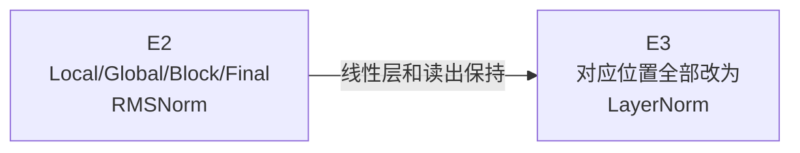

**公式前后对比：**

$$
\operatorname{RMS}_t(x)=\gamma_t\odot
\frac{x}{\sqrt{\operatorname{mean}(x^2)+\epsilon_r}}
$$

$$
\Longrightarrow\quad
\operatorname{LN}(x)=\gamma\odot
\frac{x-\operatorname{mean}(x)}{\sqrt{\operatorname{Var}(x)+\epsilon_l}}+\beta.
$$

这里不只是增加减均值操作：E2 部分 RMSNorm 使用 token 专属 $[T,D]$ scale，E3 的 LayerNorm 参数沿 token 共享。因此结论只适用于这两套具体实现。代码：[cvr_bn_rankmixer_v6_e3.py](/Users/goku/Documents/Codex/RSA_code_0816/src/models/rankmixer/cvr_bn_rankmixer_v6_e3.py)。

| 测试日 | v6 | E2 | E3 | E3 − E2 |
|---|---:|---:|---:|---:|
| 08-16 | 0.866017 | 0.866562 | 0.866386 | **−万1.76** |

E3 仍比 v6 高 **万3.69**，说明相对 v6 的主要改善来自 PureFlat；当前 LayerNorm 替换抵消了一部分收益。0.866386 只属于 E3，不属于尚未运行的 v10。

### 5.3 E2 Small：主干宽度减半，并优化 token 拆分

**为什么修改：**E2 提高 AUC，但参数和训练时间增加。Small 检查 D512 是否存在宽度冗余，并减少 token 构造中重复的大形状切片操作。

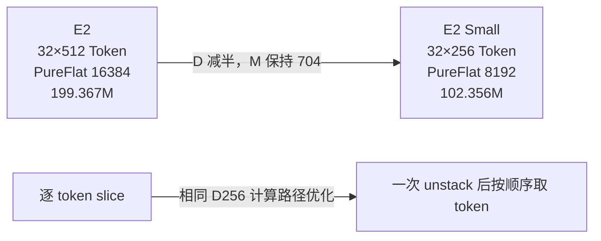

**公式与尺寸变化：**

$$
D:512\to256,
\qquad M:704\to704,
\qquad \dim h_{\mathrm{flat}}:16384\to8192.
$$

在相同 D256 输入与权重下，拆分计算由多次位置切片改为一次 `unstack`：

$$
[y_1,\ldots,y_T]
=\operatorname{SliceEach}(Y)
\quad\Longrightarrow\quad
[y_1,\ldots,y_T]=\operatorname{Unstack}(Y,\text{axis}=1).
$$

这项等价性只针对 token 拆分方式；D512→D256 本身会改变模型容量。代码：[cvr_bn_rankmixer_v6_e2_small.py](/Users/goku/Documents/Codex/RSA_code_0816/src/models/rankmixer/cvr_bn_rankmixer_v6_e2_small.py)。

| 测试日 | Base | E2 | E2 Small | Small − E2 |
|---|---:|---:|---:|---:|
| 08-16 | 0.866960 | 0.866562 | 0.866510 | **−万0.52** |

参数减少 **97.011M，约 48.66%**，首日 AUC 只下降万0.52，因此 Small 是值得继续验证的成本候选。

### 5.4 E4：把 creative 移出主干，并改为小任务头

**为什么修改：**mature 路线让 common/item 参与主要交互，creative 在末端独立融合。E4 把该组织方式移植到 Small，同时继续压缩读出和任务头。

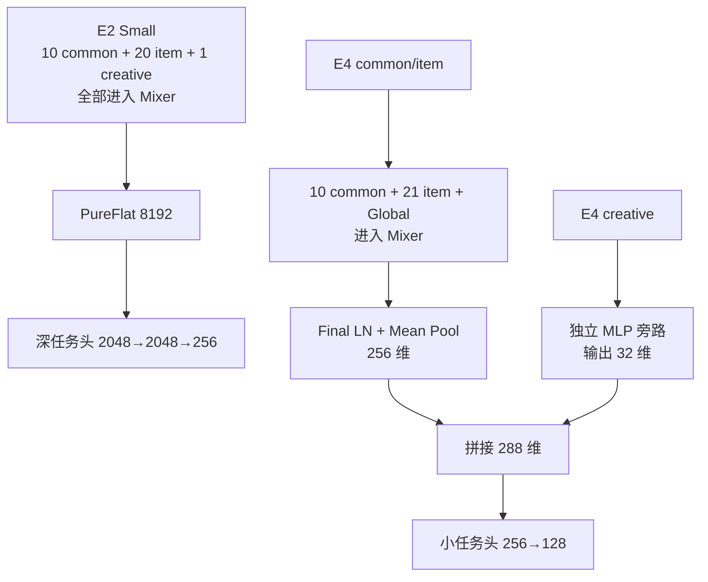

**公式前后对比：**

$$
h_{\mathrm{Small}}=\operatorname{vec}(\operatorname{RMS}(X_L))
\in\mathbb R^{8192}
$$

$$
\Longrightarrow\quad
p_{ci}=\frac1{32}\sum_{t=1}^{32}\operatorname{LN}(X_{L,t})\in\mathbb R^{256},
\qquad
h_{\mathrm{E4}}=[p_{ci};c_a]\in\mathbb R^{288}.
$$

同时，Local 配额从 `10/20/1` 改为 `10/21/0`，Global 只读取 common+item，任务头从 `[2048,2048,256]` 改为 `[256,128]`。代码：[cvr_bn_rankmixer_v6_e4.py](/Users/goku/Documents/Codex/RSA_code_0816/src/models/rankmixer/cvr_bn_rankmixer_v6_e4.py)。

| 测试日 | Base | E2 Small | E4 | E4 − Small |
|---|---:|---:|---:|---:|
| 08-16 | 0.866960 | 0.866510 | 0.866333 | **−万1.77** |

E4 参数进一步降到 **80.739M**，但多项结构同时变化且首日 AUC 回退，不能判断是哪一个模块造成下降。

### 5.5 v6 消融结论

| 研究问题 | 当前答案 | 数据范围 |
|---|---|---|
| v6 的三路读出是否可能过早压缩？ | E2 PureFlat 三个共同日均更高，平均提升 **万4.63** | 三日 |
| LayerNorm 是否优于当前 RMSNorm？ | E3 **0.866386** 低于 E2 **0.866562**，下降 **万1.76** | 单日 |
| D512 是否可以缩小？ | Small **0.866510** 仅比 E2 低 **万0.52**，参数约减半 | 单日 |
| creative 旁路与小头能否直接移植？ | E4 **0.866333** 低于 Small **0.866510**，完整组合未提高 AUC | 单日 |

## 6. 公司线上结构适配：mature 系列

mature 路线不是从自研 v6 继续修改，而是从公司线上 RankMixer 结构出发，在当前三桶任务上建立小参数量版本，再检查宽度、深度、FFN 和 tokenizer。

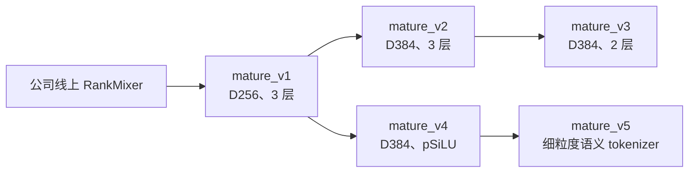

### 6.1 mature_v1：保留成熟模块组合，建立 D256 小模型

**为什么修改：**自研路线已经尝试较大主干和复杂读出，但容量没有稳定转化为 AUC。mature_v1 用较小宽度保留公司代码中维度级 SENet、粗组多 Token 投影、pSwiGLU、均值池化和 creative 旁路，检查另一种容量分配方式。

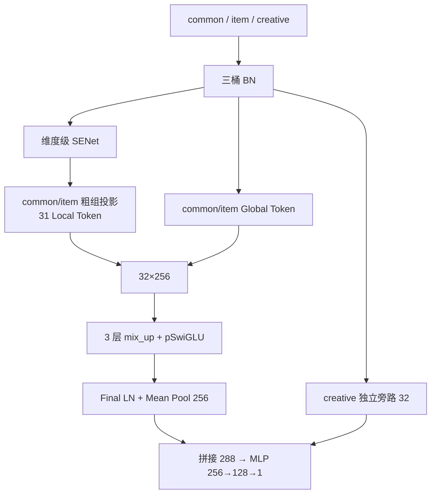

**与自研 BN 路线的关键公式差异：**BN 系列每个字段只学习一个 gate，统一缩放该字段的 17 维 Embedding：

$$
\widetilde E_{j,:}=2\sigma(g_j)E_{j,:}.
$$

mature SENet 直接对展平维度生成等宽 gate，可在 Embedding 维度级选择：

$$
\widetilde u=u\odot\sigma\!\left(
\operatorname{ReLU}(\operatorname{BN}(uA_u+b_u))B_u+c_u
\right).
$$

其 block 也不同于 v6 的 Mixing/Reverting 双空间 FFN。令 $Z=P(X)$、$Q=\operatorname{LN}(Z)$：

$$
H=\operatorname{RMS}_h\!\left(
\operatorname{SiLU}(QW_g+b_g)\odot(QW_v+b_v)
\right),
$$

$$
O=\operatorname{RMS}_o(HW_d+b_d),
\qquad
\boxed{X'=Z+O}.
$$

残差加在 mix_up 后的 $Z$ 上，没有 v6 的 Reverting 和 original-space 第二套 FFN。代码：[cvr_senet_mature_rankmixer_v1.py](/Users/goku/Documents/Codex/RSA_code_0816/src/models/rankmixer/cvr_senet_mature_rankmixer_v1.py)。

| 测试日 | Base | mature_v1 | mature_v1 − Base |
|---|---:|---:|---:|
| 08-16 | 0.866960 | 0.866934 | **−万0.26** |
| 08-17 | 0.867867 | 0.867801 | **−万0.66** |
| 两日均值 | 0.867414 | 0.867368 | **−万0.46** |

mature_v1 仅 **109.977M**，却是当前最接近 Base 的候选，说明容量放置与模块组合比单纯增加总参数更重要。

### 6.2 mature_v2/v3：先扩宽，再检查第三层是否值得

**为什么修改：**v2 检查成熟主干是否能从 D256→384 的扩容中受益；扩容后参数超过 200M，因此 v3 保持宽度不变，只删除第三个 block，检查深度成本。

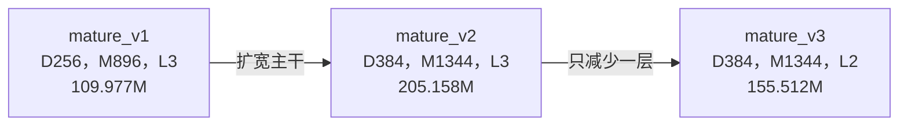

**公式前后对比：**

$$
\text{v1}\to\text{v2}:\quad
D:256\to384,
\qquad M=3.5D:896\to1344,
\qquad L=3.
$$

Per-token SwiGLU 主矩阵规模近似为 $3LTDM$。D 和 M 同比例扩大时，主干规模约变为：

$$
\frac{384\times1344}{256\times896}=2.25.
$$

v3 只改变复合深度：

$$
\operatorname{Backbone}_{\mathrm{v2}}=F_3\circ F_2\circ F_1
\quad\Longrightarrow\quad
\operatorname{Backbone}_{\mathrm{v3}}=F_2\circ F_1.
$$

代码：[mature_v2](/Users/goku/Documents/Codex/RSA_code_0816/src/models/rankmixer/cvr_senet_mature_rankmixer_v2.py)、[mature_v3](/Users/goku/Documents/Codex/RSA_code_0816/src/models/rankmixer/cvr_senet_mature_rankmixer_v3.py)。

| 版本 | 参数量 | AUC 状态 |
|---|---:|---|
| mature_v2 | 205.158M | 尚无 AUC 记录 |
| mature_v3 | 155.512M | 尚无 AUC 记录 |

这两版已完成结构和参数对照，但当前不能判断扩宽或减层的实际收益。

### 6.3 mature_v4：用单路 pSiLU 控制 D384 的 FFN 成本

**为什么修改：**D384 下 pSwiGLU 的双上投影成本较高。v4 保留 mature 的 pre-LN、双 RMSNorm 和 mixed-space 残差，把双分支门控 FFN 简化为单上投影 pSiLU。

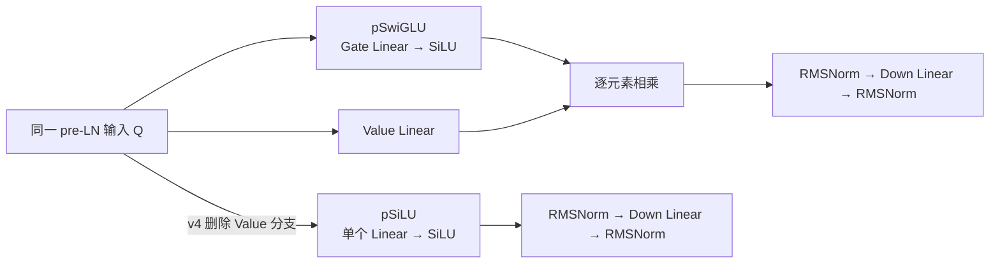

**公式前后对比：**

$$
H_{\mathrm{pSwiGLU}}=
\operatorname{RMS}_h\!\left(
\operatorname{SiLU}(QW_g+b_g)\odot(QW_v+b_v)
\right)
$$

$$
\Longrightarrow\quad
H_{\mathrm{pSiLU}}=
\operatorname{RMS}_h\!\left(\operatorname{SiLU}(QW_u+b_u)\right).
$$

同宽度下，主矩阵参数由约 $3LTDM$ 降为 $2LTDM$。v4 同时把 SENet、Global、creative 和任务头宽度调整到 D384 配置，因此仍是组合实验。代码：[cvr_senet_mature_rankmixer_v4.py](/Users/goku/Documents/Codex/RSA_code_0816/src/models/rankmixer/cvr_senet_mature_rankmixer_v4.py)。

| 测试日 | Base | mature_v1 | mature_v4 | v4 − v1 |
|---|---:|---:|---:|---:|
| 08-16 | 0.866960 | 0.866934 | 0.866206 | **−万7.28** |

mature_v2/v3 没有 AUC，因此当前只能与已运行的 mature_v1 比较。v4 参数为 **164.968M**，扩宽和 FFN 简化的组合没有胜过 v1。

### 6.4 mature_v5：把粗组多 Token 投影改为细粒度语义 Token

**为什么修改：**v1～v4 用七个粗组生成 31 个 Local token；同一粗组中的多个 token 都能读取整组字段，token 本身没有明确业务主题。v5 检查字段语义与 token 身份对齐是否更合适。

```mermaid
flowchart LR
    R["同一 BN + mature SENet 输出"] --> A["mature_v4<br/>7 个粗字段组"]
    A --> B["每组一次大投影"]
    B --> C["reshape 成多个 Token<br/>组内 Token 共享全部字段"]
    R --> D["mature_v5<br/>feature_id 映射"]
    D --> E["10 common + 21 item<br/>细粒度语义组"]
    E --> F["每组独立 Linear + BN<br/>一组一个 Token"]
```

**公式前后对比：**旧方式让一个粗组 $g$ 一次产生 $k_g$ 个 token：

$$
T_g^{\mathrm{v4}}=
\operatorname{Reshape}_{k_g\times D}\!\left(
\operatorname{BN}_g(\phi(\widetilde x_gW_g+b_g))
\right).
$$

新方式让每个语义组只产生一个 token：

$$
x_t^{\mathrm{v5}}=
\operatorname{BN}_t\!\left(
\operatorname{Concat}_{j\in G_t}\widetilde E_jW_t+b_t
\right).
$$

当前 v5 在 Linear 与 BN 之间没有 v4 的 GELU，因此变化包含字段组织、投影共享范围、激活和参数量。其他 Global、pSiLU、creative 旁路和任务头保持 v4 结构。代码：[cvr_senet_mature_rankmixer_v5.py](/Users/goku/Documents/Codex/RSA_code_0816/src/models/rankmixer/cvr_senet_mature_rankmixer_v5.py)。

| 测试日 | mature_v1 | mature_v4 | mature_v5 | v5 − v4 |
|---|---:|---:|---:|---:|
| 08-16 | 0.866934 | 0.866206 | 0.866289 | **万0.83** |

mature_v5 参数从 v4 的 **164.968M** 降至 **135.775M**，AUC 小幅回升，但仍比 mature_v1 低 **万6.45**。因此当前结果支持继续研究语义 tokenizer，但还没有超过 mature_v1。

### 6.5 mature 路线结果汇总

| 版本 | 主要实验问题 | 参数量 | 08-16 AUC |
|---|---|---:|---:|
| mature_v1 | 公司成熟结构的 D256 小模型适配 | 109.977M | **0.866934** |
| mature_v2 | D256→384 的宽度扩展 | 205.158M | — |
| mature_v3 | D384 下三层→两层 | 155.512M | — |
| mature_v4 | pSwiGLU→pSiLU 的成本控制 | 164.968M | 0.866206 |
| mature_v5 | 粗组投影→细粒度语义 tokenizer | 135.775M | 0.866289 |

## 7. UniMixer 独立对照

**为什么修改：**RankMixer 的 $P$ 是固定置换，无法根据数据调整信息流。UniMixer 检查可学习的块间和块内混合矩阵能否更好地选择交互路径。

```mermaid
flowchart LR
    R["Token 表示"] --> A["RankMixer"]
    A --> B["固定置换 P<br/>无可训练 Mixing 参数"]
    B --> C["Per-token FFN"]
    R --> D["UniMixer"]
    D --> E["可学习块间矩阵 A<br/>可学习块内矩阵 B_g"]
    E --> F["Sinkhorn 近似双随机归一化"]
    F --> G["Per-token SwiGLU + 双流读出"]
```

**公式前后对比：**RankMixer 直接执行固定重排：

$$
Y_{\mathrm{RankMixer}}=P(X).
$$

UniMixer 将展平表示分成块，学习低秩块间矩阵和块内矩阵：

$$
A=UV^\top,
\qquad
B_g=\sum_{k=1}^{K}c_{gk}B^{(k)},
$$

$$
U_{b,g,:}=V_{b,g,:}\overline B_g,
\qquad
Y_{b,h,:}=\sum_g\overline A_{gh}U_{b,g,:},
$$

其中 $\overline A$ 和 $\overline B_g$ 经过有限次 Sinkhorn 归一化。当前 UniMixer 还同时改变了 token 归一化、SiameseNorm、SwiGLU 和读出，因此不是只替换 Mixing 的单变量实验。代码：[cvr_bn_unimixer_v1.py](/Users/goku/Documents/Codex/RSA_code_0816/src/models/rankmixer/cvr_bn_unimixer_v1.py)。

| 测试日 | Base | UniMixer v1 | UniMixer − Base |
|---|---:|---:|---:|
| 08-16 | 0.866960 | 0.865662 | **−千1.298** |

## 8. 结果收敛与下一步


| 候选 | 主要证据 | 当前定位 |
|---|---|---|
| mature_v1 | 两日 AUC **0.866934/0.867801**，分别低 Base **万0.26/万0.66** | 当前最接近 Base，且参数约 110M |
| v6_e2 | 三个共同测试日均高于 v6，平均提升 **万4.63** | 自研路线新的主要对照点 |
| v6_e2_small | 首日 **0.866510**，只比 E2 低 **万0.52**，参数约减半 | 成本敏感候选 |
| v8 | 首日 **0.866615**，比设计父版本 v6 高 **万5.98** | 自研 BN 首日最高，但仍需拆分 Cross 与 M 变化 |

这轮迭代形成了四条较清楚的技术认识：

1. 字段边界和业务语义应在 token 化阶段显式保证，v2→v3 的等参数结果支持这一点。
2. 双空间交互、Global 和读出能够增强表达，但 v5→v6 说明容量需要放在有效位置，不能只扩大 D。
3. E2 的多日结果说明任务头直接读取完整 token 表示值得继续研究；当前 LayerNorm 替换没有进一步提高 AUC。
4. mature_v1 说明较小主干结合细粒度输入选择、成熟残差和业务旁路，可以比更大的自研模型更接近 Base。

下一阶段建议优先延长 mature_v1、E2/Small 和 v8 的同日实验链，并固定实际代码、参数和 checkpoint。结构归因方面，优先补充三类对照：

- 为 E2 构建参数预算匹配的读出对照，区分 PureFlat 信息保留与首层增参的影响。
- 为 v8 保持 $M=704$ 或建立无 Cross 的 $M=512$ 对照，单独判断投影前交叉的作用。
- 对 mature 路线分别拆分 SENet、pSiLU、creative 旁路与语义 tokenizer，避免再次形成多项同时变化的组合实验。

当前结果主要来自单次离线运行，尚无多随机种子统计或置信区间。因此，本阶段能够确认的是迭代逻辑、候选收敛和消融方向，暂不能把单日 AUC 差值解释为稳定线上收益。
