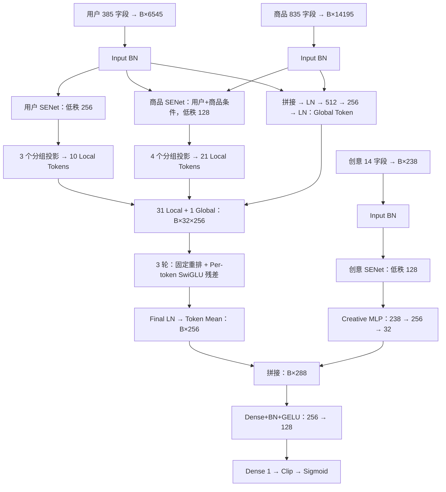
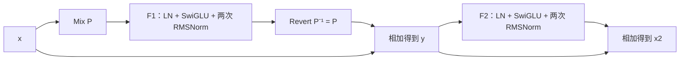

# cvr_senet_mature_rankmixer_v1 代码与算法详解

**结合 RankMixer 与 TokenMixer-Large 的结构、公式、复杂度及训练实现分析**

撰写日期：2026-09-07。

分析对象：[cvr_senet_mature_rankmixer_v1.py](/Users/goku/Documents/Codex/RSA_code_0816/src/models/rankmixer/cvr_senet_mature_rankmixer_v1.py)。本文中的“v1”均指这份文件，不指 `cvr_bn_rankmixer_v1.py`、`cvr_mature_rankmixer_fst_v1.py` 或其他版本。

配套运行配置：[set-rankmixer-mature-3bucket-d256-args.txt](/Users/goku/Documents/Codex/RSA_code_0816/bash/set-rankmixer-mature-3bucket-d256-args.txt)。默认结构与该配置一致，部分训练参数不同，后文单列。

论文依据为 [RankMixer，arXiv v3](https://arxiv.org/html/2507.15551v3) 与 [TokenMixer-Large，arXiv v2](https://arxiv.org/html/2602.06563v2)。文中分别标识**代码事实**、**论文设计**与**本文推导/实验建议**；数学推导用于解释当前实现，不代表已取得相应实验收益。

验证范围：阅读源码及必要依赖、解析固定特征表、核对字段与参数公式、验证重排及双层恒等式。未在生产 TensorFlow 1.x / Flood 环境构图、训练或测量延迟，不把静态估算写成运行实测。

---

## 1. 先理解这份方案在做什么

这是一套**面向首次转化预测的、稠密部分约 1.10 亿参数的单任务模型**。它先把用户、商品、创意三个桶的稀疏特征查成 Embedding，再分别处理：用户与商品进入 Token Mixer 主干；创意经较小网络压缩后，在预测塔前拼入。

可以把它的主要思想分成四步：

1. **先做条件特征筛选。** SENet 为 Embedding 的每个坐标生成门值，其中商品门值还依赖当前用户。
2. **把大向量组织成有限数量的表示槽位。** 七个固定特征组投影成 31 个 Local Token，再加入一个直接读取用户与商品底层向量的 Global Token。
3. **反复交换信息并分别加工。** 每轮先固定重排不同 Token 的通道片段，再用各 Token 独立参数的 SwiGLU 处理。
4. **聚合与预测。** 对 32 个输出 Token 取均值，与 32 维创意表示拼接，经过 `[256,128]` 预测塔输出一个概率。

理解时最需要记住的几个事实：

| 问题 | 当前代码的答案 |
|---|---|
| 是否使用 Self-Attention？ | 没有 Q/K/V、注意力分数或 Softmax Attention；Mixer 使用固定坐标重排 |
| `mix_up` 是否是样本 Mixup 数据增强？ | 不是，它只交换单个样本内部的 Token/Head 坐标 |
| 32 个 Token 如何组成？ | 用户 10 个、商品 21 个、用户与商品的 Global Token 1 个 |
| 创意是否参与 Mixer？ | 不参与；创意只在末端预测塔与主干表示交互 |
| 是否有序列建模？ | 没有 sequence / DIN / gattr / dense-feature 路径；稀疏字段本身是否编码历史统计，要看特征定义 |
| 是否有多任务或延迟校正？ | 只有 `fst_cvr_label` 对应的一个 Sigmoid/BCE；没有辅助任务、蒸馏或 replay 概率校正 |
| 是否就是原论文 RankMixer？ | 固定 Mixing 和 Per-token FFN 思路相近，但残差、归一化、FFN 和输入处理均有差异 |
| 是否就是 TokenMixer-Large？ | 连续两层存在相近的 Mixing–Reverting 代数骨架，但规范化、层数口径和扩展机制不相同 |

“mature”是这份实现使用的命名，不能据此推断代码对转化标签做了成熟期校正，也不能据此认定本地版本已经通过线上验证。

## 2. 总体数据流与默认张量形状

下面所有张量都省略数据类型；默认 Embedding 维度为 17。`B` 是批大小，构造默认与配套配置均为 2048。



即使阅读器不渲染 Mermaid，也可按以下链条理解主路径：

```text
1234 个字段的 Embedding
  ├─ 用户/商品：BN → SENet → 分组投影 → 31 Local Tokens
  ├─ 用户/商品：BN → 全局 MLP → 1 Global Token
  │                                      ↓
  │                         [B,32,256] → 3 轮 Mixer → LN → Mean
  └─ 创意：BN → SENet → [238→256→32]                   ↓
                             └───────────── 拼接 [B,288]
                                                  ↓
                                       [256→128→1] → pCVR
```

默认结构参数来自[构造函数](/Users/goku/Documents/Codex/RSA_code_0816/src/models/rankmixer/cvr_senet_mature_rankmixer_v1.py:270)：

| 符号 | 代码参数 | 默认值 | 含义 |
|---|---|---:|---|
| E | `embedding_size` | 17 | 每字段默认 Embedding 宽度 |
| T | `mixup_token_num` | 32 | 主干 Token 数 |
| D | `mixup_token_dim` | 256 | 每个 Token 的宽度 |
| L | `mlp_mixer_layers` | 3 | 固定重排 + 一套 SwiGLU 的重复次数 |
| r | `mixer_expand_ratio` | 3.5 | SwiGLU 隐层扩张比例 |
| M | `mixer_hidden_dim` | 896 | `int(D*r)` |
| G | `global_token_hidden_dim` | 512 | Global Token MLP 隐层宽度 |
| C_h / C_o | `creative_hidden_dim / creative_output_dim` | 256 / 32 | 创意旁路隐层/输出宽度 |
| — | `cvr_layers` | `[256,128]` | 单任务预测塔 |

这里的 `L=3` 表示 **3 套 SwiGLU**。对照每个 Block 含两套 SwiGLU 的结构时，不能只按相同的“层数”比较。

## 3. 特征分桶与 Token 分配

### 3.1 字段数不是词表大小，也不是 Token 数

三个桶分别有 385、835、14 个字段，总计 1234 个字段。每字段经过稀疏查表/字段聚合后，默认得到一个 17 维向量。

因此：

$$
d_u=385\times17=6545,\quad
d_i=835\times17=14195,\quad
d_c=14\times17=238.
$$

总输入宽度是 20,978，用户与商品合计宽度是 20,740。

这不能解释成“Embedding 表只有 1234×17 个参数”。每个字段可能对应大量离散 ID，其词表存储由 Flood 管理。特征配置也支持共享 Embedding；稀疏参数总量不能仅凭本文件的字段数量确定。[查表与字段重建入口](/Users/goku/Documents/Codex/RSA_code_0816/src/models/rankmixer/cvr_senet_mature_rankmixer_v1.py:1649)

### 3.2 固定七组投影，31 个 Local Token

以下数量由当前文件中的 ID 列表直接统计：

| 固定组 | 字段数 | 输入宽度 | Token 数 | 投影输出宽度 | Token 下标，0 起始 |
|---|---:|---:|---:|---:|---|
| `user_v1` | 102 | 1,734 | 3 | 768 | 0–2 |
| `user_v2` | 149 | 2,533 | 3 | 768 | 3–5 |
| `user_v3` | 134 | 2,278 | 4 | 1,024 | 6–9 |
| `item_v1` | 202 | 3,434 | 5 | 1,280 | 10–14 |
| `item_v2` | 203 | 3,451 | 5 | 1,280 | 15–19 |
| `item_v3` | 202 | 3,434 | 5 | 1,280 | 20–24 |
| `item_v4_plus` | 228 | 3,876 | 6 | 1,536 | 25–30 |
| `global` | 用户与商品全量 | 20,740 | 1 | 256 | 31 |
| `creative` | 14 | 238 | 0 | 旁路输出 32 | 不在 Token 轴上 |

来源：[分组常量与 Token 配额](/Users/goku/Documents/Codex/RSA_code_0816/src/models/rankmixer/cvr_senet_mature_rankmixer_v1.py:182)。这些名称是代码分组标签；本文件没有给每个数字 ID 提供业务释义，不能凭 `v1/v2/v3` 推断它们分别是“短期兴趣”“长期兴趣”等。

### 3.3 分组投影不是“先切小块，各算各的”

对第 g 组，输入为 $s_g\in\mathbb R^{B\times d_g}$，分配 $k_g$ 个 Token，实际计算是：

$$
q_g=\operatorname{BN}\left(\operatorname{GELU}(s_gW_g+b_g)\right),
\quad W_g\in\mathbb R^{d_g\times(k_gD)}.
$$

随后七组输出与 Global Token 拼接，统一 reshape 为 $[B,32,256]$。[投影实现](/Users/goku/Documents/Codex/RSA_code_0816/src/models/rankmixer/cvr_senet_mature_rankmixer_v1.py:1481)，[拼接与 reshape](/Users/goku/Documents/Codex/RSA_code_0816/src/models/rankmixer/cvr_senet_mature_rankmixer_v1.py:1753)。

以 `user_v1` 为例，1734 维输入整体映射到 768 维，再看作 3 个 256 维 Token。因此这 3 个 Token 的每个输出坐标，都有机会使用该组全部 102 个字段的信息。它们没有固定分别负责前 34、中 34、后 34 个字段。

**本文分析：**这是一种组内多视角压缩。局部投影约束不同大组使用独立参数，同时允许同组多个 Token 学习不同表示。但“有不同槽位”不等于“训练后必然分工明显”，仍需看 Token 相似度、表示秩或消融。

### 3.4 哪些约束是真正阻止构图的

代码会检查：

- 不允许非空 coupon / dense / sequence / gattr / DIN 特征映射。
- 路由引用的字段必须存在；重复路由或重复查表字段会报错。
- 七组 Local Token 数加 1，必须等于配置的 T。
- D 必须能被 T 整除。
- 实际查表拼接宽度必须与“路由字段数×E”一致。

不过，**字段数量变化、分组 checksum 变化、配置中额外但未路由的字段，部分情况只记录 warning**，并非全部强制中断。因此源码中的校验更接近“硬约束 + 基线漂移告警”。修改特征表后不能只看程序是否启动成功。[特征契约检查](/Users/goku/Documents/Codex/RSA_code_0816/src/models/rankmixer/cvr_senet_mature_rankmixer_v1.py:432)

还要注意，配置系统允许字段自带 Embedding 宽度，但目标模型的宽度契约采用统一 E。若要引入异宽 Embedding，需同步调整模型的宽度计算与路由逻辑。

## 4. Input BN 与 excitation2 SENet：先产生条件门值

### 4.1 三种归一化分别在做什么

这份模型混用了 BN、LN、RMSNorm，不能笼统称为“Pre-RMSNorm 模型”。

| 算子 | 统计维度 | 是否减均值 | 主要位置 |
|---|---|---|---|
| BatchNorm | 二维输入的批次轴，每个坐标分别统计 | 是 | 三桶输入、SENet 瓶颈、Local 投影、创意旁路、预测塔 |
| LayerNorm | 单条向量的最后一个维度 | 是 | Global Token 输入与输出、每套 SwiGLU 前、Mixer 最终输出 |
| RMSNorm | 单条向量的最后一个维度 | 否 | SwiGLU 的 896 维乘积隐层、256 维输出分支 |

BN 默认走 `ModelBase.batch_norm_layer_v2` 的 Flood/Riemann 实现，`use_riemann_bn=True`，衰减系数 0.9；`enable_phalanx` 即使传 true 也会被忽略。[BN 包装](/Users/goku/Documents/Codex/RSA_code_0816/src/models/rankmixer/cvr_senet_mature_rankmixer_v1.py:1421)，[底层分支](/Users/goku/Documents/Codex/RSA_code_0816/src/models/model_base.py:477)

### 4.2 这里的 SENet 是逐坐标门控

记输入 BN 后的三个向量为 $u,i,c$。把门控函数写成：

$$
g(a;W_s,W_e)=\sigma\left(
\operatorname{ReLU}(\operatorname{BN}(aW_s+b_s))W_e+b_e
\right).
$$

默认三条路径为：

$$
\tilde u=u\odot g_u(u),\qquad
\tilde i=i\odot g_i([u;i]),\qquad
\tilde c=c\odot g_c(c).
$$

| 分支 | 产生门值时的输入宽度 | 低秩瓶颈 | 门值输出宽度 |
|---|---:|---:|---:|
| 用户 | 6545 | 256 | 6545 |
| 商品 | 20740 | 128 | 14195 |
| 创意 | 238 | 128 | 238 |

来源：[excitation2](/Users/goku/Documents/Codex/RSA_code_0816/src/models/rankmixer/cvr_senet_mature_rankmixer_v1.py:1435)，[三次调用](/Users/goku/Documents/Codex/RSA_code_0816/src/models/rankmixer/cvr_senet_mature_rankmixer_v1.py:1721)。

它没有先把每个字段的 17 维平均成一个标量，再给字段乘统一权重。用户侧实际生成 6545 个门值，即同一字段的不同 Embedding 坐标也可得到不同缩放。

### 4.3 商品门值已经产生了用户条件交互

商品输出的第 j 个坐标为：

$$
\tilde i_j=i_j\,\sigma\bigl(f_j(u,i)\bigr).
$$

同一个商品在不同用户下，$f_j$ 可以不同。因此模型并不是“进入 Mixer 后才第一次发生用户–商品交互”。这种交互在输入门控阶段已经存在。

它也是非对称的：商品门值看用户与商品；用户门值只看用户；创意门值只看创意。商品门控的输入是 **BN 后但尚未经过 SENet 的 u 和 i**，不是 $[\tilde u;\tilde i]$。

另外，用户 SENet 看的是全部用户组，商品 SENet 看的是用户与全部商品组。因此 Local Token 的“局部”，描述的是投影直接读取哪个组，不能理解成它对其他组完全没有函数依赖。

### 4.4 “低秩”约束的准确含义

瓶颈层把 $a$ 压到 r 维，再生成较宽门值。忽略 BN 的批次耦合，在固定激活区域内分析单样本门值网络，其关于输入的 Jacobian 可写成低维矩阵乘积，秩受到 r 的限制。

但最终输出是 $x\odot g(a)$。当 a 包含 x 时，求导还会出现 $\operatorname{diag}(g)$ 项。因此不能说“整个 SENet 输出变成了秩不超过 128/256 的表示”。低秩瓶颈限制的是**门值的条件变化方式**，它保留了一条原输入逐坐标缩放的路径。

`senet_hidden_size` 虽然在构造函数中被保存，但这三次调用显式传入 256/128/128；只改该参数不会改变这里的瓶颈宽度。

### 4.5 初始化：默认门值为 0.5

默认 `senet_act_type='sigmoid'` 时，第二层 excitation 的 kernel 和 bias 均为零，因此初始化时：

$$
g_u=g_i=g_c=\sigma(0)=0.5.
$$

也就是各桶初始先缩小一半，而不是恒等输出。与此同时，门网络第二层权重为零使第一层 squeeze 在最初反传时暂时收不到来自该路径的任务梯度；第二层开始更新后，这条梯度才会打开。

这是局部初始化事实，不意味着训练无法进行。后面的 BN 会影响缩放的实际传播，Global Token 也直接读取未门控的 BN 输入。若选择 ReLU 门值，初始化分支会改变，且门值不再受限于 0～1。

## 5. Global Token：绕过门控的用户与商品联合表示

Global Token 的输入明确为 `[user_bn,item_bn]`，而不是 31 个 Local Token 的平均值，也不是 SENet 后的用户与商品向量：

$$
a=\operatorname{LN}([u;i])\in\mathbb R^{20740},
$$

$$
h=\operatorname{GELU}(aW_{g1}+b_{g1})\in\mathbb R^{512},
$$

$$
x_G=\operatorname{LN}(hW_{g2}+b_{g2})\in\mathbb R^{256}.
$$

来源：[Global Token 实现](/Users/goku/Documents/Codex/RSA_code_0816/src/models/rankmixer/cvr_senet_mature_rankmixer_v1.py:1502)，[实际输入](/Users/goku/Documents/Codex/RSA_code_0816/src/models/rankmixer/cvr_senet_mature_rankmixer_v1.py:1769)。

**本文分析：**它提供了三种补充能力：

1. 在七个分组投影之外，用同一套 MLP 直接组合全部用户与商品坐标。
2. 在 SENet 抑制某些维度时，仍有一条读取原 BN 向量的可学习路径。
3. 从第一轮 Mixing 开始，把这一联合表示的通道片段分发给所有混合槽位。

但它并不是无损原始特征旁路：20740→512→256 仍是明显压缩，也有非线性和归一化。它的“全局”范围只覆盖主干的用户与商品，**没有覆盖创意**。

还不能把最终下标 31 的输出当作可直接读取的 CLS 表示：Global Token 最初在这个位置，但后续重排会改变坐标组织；最终代码也没有专门读取它，而是对所有 Token 求均值。

## 6. 固定 Mixing：真正发生的是坐标置换

### 6.1 严格索引公式

默认 $T=32,D=256$，每个 Token 被分成 $H=T=32$ 个 Head，每个 Head 宽度：

$$q=D/T=8.$$

对输入 $X\in\mathbb R^{B\times T\times D}$，代码执行：

```text
[B,32,256]
  → reshape [B,32,32,8]
  → transpose [0,2,1,3]
  → reshape [B,32,256]
```

精确索引为：

$$
Y_{b,h,tq+k}=X_{b,t,hq+k},
\quad 0\le t,h<T,\quad 0\le k<q.
$$

也就是说，输出第 h 个 Token 收集了**每一个输入 Token 的第 h 个 8 维片段**。[mix_up 源码](/Users/goku/Documents/Codex/RSA_code_0816/src/models/rankmixer/cvr_senet_mature_rankmixer_v1.py:1290)

### 6.2 一个能手算的例子

取 $T=2,D=4,q=2$：

```text
输入 Token A： [a0,a1 | a2,a3]
输入 Token B： [b0,b1 | b2,b3]

重排后 Token 0：[a0,a1 | b0,b1]
重排后 Token 1：[a2,a3 | b2,b3]
```

这里没有计算 a 与 b 的相似度，没有求加权平均，也没有把两个向量逐元素相加；它只是把原来分散的子向量放进同一个新向量，使后续 FFN 可以一起处理它们。

### 6.3 为什么无参数也能支持复杂交互

把展平后的 Mixing 记为置换矩阵 P，则：

$$P^\top P=I,\qquad \|Px\|_2=\|x\|_2.$$

所以 Mixing 自身不改变展平向量的欧氏范数，不压缩坐标，也不创造乘法交叉。**交互来自重排之后的可学习非线性网络**：同一个 SwiGLU 的输入中，现在同时包含多个来源的片段。

第一轮中，每个混合 Token 看到所有原 Token，但各取 8 维，而不是各自完整的 256 维。若每套 FFN 为一般稠密映射，再经过第二轮重排及其后的第二套 FFN，单个输出坐标就有机会依赖各原 Token 的全部通道。这里说的是计算图允许的依赖范围，不是训练必然学到了有效交互。

“无参数”也不等于“零延迟”：transpose/reshape 可能涉及数据布局调整与内存读写，实际是否融合及其成本要看运行框架。

### 6.4 两次重排为什么恢复原坐标

当本实现保持 $H=T$ 时，操作就是交换同样大小的两个轴，因此：

$$P^2=I,\qquad P^{-1}=P.$$

前面的小例子再执行一次，就恢复 `[a0,a1,a2,a3]` 和 `[b0,b1,b2,b3]`。

但不能据此说“两层 Mixer 等于没做 Mixing”：中间有独立的非线性网络，一般有 $PF\ne FP$。这恰恰引出第 10 节的双空间解释。

## 7. Per-token SwiGLU：参数最多、交互最主要的部分

### 7.1 一个代码层的完整公式

令第 l 层输入为 $X_l$，先做重排：

$$Z_l=P(X_l).$$

随后先按每个 Token 的 D 维做 LayerNorm：

$$A_l=\operatorname{LN}_D(Z_l).$$

对第 t 个 Token：

$$
G_{l,t}=\operatorname{SiLU}(A_{l,t}W^{g}_{l,t}+b^{g}_{l,t}),
\qquad \operatorname{SiLU}(x)=x\sigma(x),
$$

$$V_{l,t}=A_{l,t}W^{v}_{l,t}+b^{v}_{l,t},$$

$$H_{l,t}=\operatorname{RMSNorm}_M(G_{l,t}\odot V_{l,t}),$$

$$R_{l,t}=\operatorname{RMSNorm}_D(H_{l,t}W^{o}_{l,t}+b^{o}_{l,t}),$$

$$\boxed{X_{l+1}=Z_l+R_l=P(X_l)+R_l.}$$

三次循环结束后，另做一次 Final LayerNorm。[SwiGLU](/Users/goku/Documents/Codex/RSA_code_0816/src/models/rankmixer/cvr_senet_mature_rankmixer_v1.py:1344)，[主干循环](/Users/goku/Documents/Codex/RSA_code_0816/src/models/rankmixer/cvr_senet_mature_rankmixer_v1.py:1398)

这里的 shortcut 是 $Z_l$，即已经混合的输入；不是 $X_l$。每轮没有 `LN(PX+X)`，也没有在残差加法之后立刻执行 Post-LN。

### 7.2 “Per-token”体现在权重形状中

| 参数 | 默认形状 | 含义 |
|---|---|---|
| $W^g$ | `[32,256,896]` | 每个 Token 各有一个门分支矩阵 |
| $W^v$ | `[32,256,896]` | 每个 Token 各有一个值分支矩阵 |
| $W^o$ | `[32,896,256]` | 每个 Token 各有一个输出投影矩阵 |
| $b^g,b^v$ | `[32,1,896]` | Token 独立，沿 batch 广播 |
| $b^o$ | `[32,1,256]` | Token 独立，沿 batch 广播 |

实现会把输入由 `[B,T,D]` 转成 `[T,B,D]`，利用 batched matmul 并行处理。[Per-token Dense](/Users/goku/Documents/Codex/RSA_code_0816/src/models/rankmixer/cvr_senet_mature_rankmixer_v1.py:1321)

这不等于 MoE：没有路由器、Top-k 或按样本跳过专家。每个样本都计算全部 32 套 Token 网络。它也不同于标准 Transformer 的共享 FFN，后者在不同 Token 位置复用同一组权重。

### 7.3 门和值的乘法提供了什么

如果忽略 SiLU 与归一化，一个隐层单元近似包含：

$$
\left(\sum_i a_iw_i^g\right)
\left(\sum_j a_jw_j^v\right)
=\sum_{i,j}w_i^gw_j^v a_ia_j.
$$

这说明乘法门控可以表达不同输入坐标的成对作用；加入 SiLU 后则变成连续的输入条件变换。重排把来自不同 Token 的片段汇到 a 中，从而让这些乘积覆盖跨来源的坐标。

这只是解释交互能力的局部代数视角，**不能把整个网络精确等同于二阶 FM，也不能说叠三层就只对应某个固定多项式阶数**。激活、Norm、门控和残差都使实际函数更复杂。

### 7.4 两次 RMSNorm 的作用与代价

RMSNorm 对长度 d 的向量定义为：

$$
\operatorname{RMSNorm}(x)
=\gamma\odot\frac{x}{\sqrt{d^{-1}\sum_{j=1}^d x_j^2+\epsilon}},
\qquad \epsilon=10^{-8}.
$$

- 隐层 RMSNorm 作用在门和值的乘积上，缓和乘积幅度的变化。
- 输出 RMSNorm 在 down projection 后，把残差分支输出幅度再做归一化。
- LN 有 gamma/beta，RMSNorm 只有 scale；这几处参数在 Token 间共享，FFN 权重则不共享。

Pre-LN 有 D 个 gamma 和 D 个 beta；两处 RMSNorm 的 scale 分别有 M、D 个参数。这些参数均在 Token 间共享。`ndims=2` 只控制 `[1,1,M]` 这种广播形状，不代表跨两个轴归一化；统计仍只沿最后一维。[Norm 实现](/Users/goku/Documents/Codex/RSA_code_0816/src/models/rankmixer/cvr_senet_mature_rankmixer_v1.py:1221)

**本文分析：**输出 RMSNorm 能稳定分支量级，但也会削弱网络通过整体缩小 down matrix 来减小残差更新的能力。如果 $\epsilon$ 可忽略且 a>0，则大致有：

$$\operatorname{RMSNorm}(ax)\approx\operatorname{RMSNorm}(x).$$

因此，若以后想采用“小 down 初始化让残差接近恒等”的策略，不能只改 down matrix 的标准差，还需要同时考虑这里的输出 RMSNorm、可学习 scale 或显式 residual scale。

### 7.5 初始化与残差尺度

门/值矩阵使用截断正态，其请求标准差为：

$$
\sigma_{g,v}=\frac{\sqrt{2/(D+M)}}{0.879625661\ldots}.
$$

该常数用于修正截断造成的方差缩小。Down matrix 使用请求标准差 $1/\sqrt M$ 的截断正态，偏置为零。[初始化实现](/Users/goku/Documents/Codex/RSA_code_0816/src/models/rankmixer/cvr_senet_mature_rankmixer_v1.py:1329)

虽然 `_per_token_swiglu` 接收 `residual_scale`，循环中的每次调用都固定传 1.0。没有按深度自动缩小残差分支，也没有 zero-gamma 初始化。

不能由“P 是正交置换”推导整个网络的梯度稳定。把完整残差分支记为 F，则单层 Jacobian 是 $(I+J_F)P$；P 本身不缩放范数，但 $I+J_F$、最终 LN 与各归一化的导数仍然决定训练行为。

### 7.6 三种方法的 Per-token FFN：统一成单条公式对比

**比较口径：以下每条公式都表示“从第一层线性投影的输入，到 FFN 分支输出”的完整内部计算；外部 Pre-Norm、残差以及 Mixing/Reverting 在后面的表格中单列。** 比较的是稠密 Per-token FFN，不包含 MoE 路由。

统一记号：

- $v_t\in\mathbb R^D$：即将进入第一个线性投影的第 t 个 Token，已完成该方法在此之前要求的归一化/坐标变换。
- $W_u^t,W_g^t\in\mathbb R^{D\times M}$：up 与 gate 矩阵；$W_d^t\in\mathbb R^{M\times D}$：down 矩阵。
- $b_u^t,b_g^t\in\mathbb R^M$，$b_d^t\in\mathbb R^D$：相应偏置。
- $R_M,R_D$：分别沿 M 维、D 维计算的 RMSNorm，均包含可训练 scale。
- $\operatorname{SiLU}(a)=a\sigma(a)$，$\odot$ 表示逐元素乘法。

为便于对照，三种方法使用相同的矩阵名称；它们并不共享参数，M 也不要求取相同值。层下标省略，t 表明各 Token 拥有独立的投影参数。

**① RankMixer：两矩阵 GELU FFN**

$$
\boxed{
f_t^{\mathrm{RankMixer}}(v_t)
=\operatorname{GELU}(v_tW_u^t+b_u^t)W_d^t+b_d^t
}
$$

即 `up → GELU → down`，没有单独的 gate 分支。[原文 §3.3.2，式 (6)–(7)](https://arxiv.org/html/2507.15551v3#S3.SS3.SSS2)

**② TokenMixer-Large：三矩阵 SwiGLU FFN**

$$
\boxed{
f_t^{\mathrm{TML}}(v_t)
=\left[
\operatorname{SiLU}(v_tW_g^t+b_g^t)
\odot(v_tW_u^t+b_u^t)
\right]W_d^t+b_d^t
}
$$

即 `SiLU(gate) × up → down`。这里保留 bias，与主文式 (17)–(18) 一致；附录 A.4 所述优化实现进一步移除 bias，此时将上述三个 b 置零。[主文 FFN 定义](https://arxiv.org/html/2602.06563v2#S3.SS3.SSS2)，[附录去 bias 说明](https://arxiv.org/html/2602.06563v2#A1.SS4)

**③ 当前 mature v1：隐层与输出均做 RMSNorm 的 SwiGLU FFN**

$$
\boxed{
f_t^{\mathrm{v1}}(v_t)
=R_D\!\left(
R_M\!\left[
\operatorname{SiLU}(v_tW_g^t+b_g^t)
\odot(v_tW_u^t+b_u^t)
\right]W_d^t+b_d^t
\right)
}
$$

即 `SiLU(gate) × up → hidden RMSNorm → down → output RMSNorm`。默认 D=256、M=896；bias 均保留。[当前实现](/Users/goku/Documents/Codex/RSA_code_0816/src/models/rankmixer/cvr_senet_mature_rankmixer_v1.py:1344)

**三条公式之外，归一化与残差怎么接？**

| 方法 | 进入上述 FFN 主体前 | FFN 输出与残差的关系 | FFN 内部归一化 |
|---|---|---|---|
| RankMixer | $x_t$ 已是前一 Mixing 残差及 LN 的输出；令 $v_t=x_t$ | $y_t=\operatorname{LN}_D(x_t+f_t^{\mathrm{RankMixer}}(x_t))$ | 无 |
| TML | 使用 Pre-RMSNorm；前半段为 Norm→Mix→FFN，后半段为 Norm→FFN | 前半段还需 Revert 后接残差；完整结构与论文表达差异见第 10 节 | 主文 SwiGLU 定义中无上述 hidden/output RMSNorm |
| 当前 v1 | $x_t=[P(X)]_t$，$v_t=\operatorname{LN}_D(x_t)$ | $y_t=x_t+f_t^{\mathrm{v1}}(\operatorname{LN}_D(x_t))$ | $R_M$ 与 $R_D$ |

如果只想核对当前代码的一条**含 Pre-LN 和残差**的公式，完整写法是：

$$
\boxed{
y_t=x_t+
R_D\!\left(
R_M\!\left[
\operatorname{SiLU}\!\left(\operatorname{LN}_D(x_t)W_g^t+b_g^t\right)
\odot\left(\operatorname{LN}_D(x_t)W_u^t+b_u^t\right)
\right]W_d^t+b_d^t
\right),\quad x_t=[P(X)]_t
}
$$

这里不能把 TML 前半段的 Pre-RMSNorm 一律写成 $v_t=R_D([P(X)]_t)$：其图示顺序是先对原坐标 Token 做 Norm，再 Mixing，通常 $P(R_D(X))\ne R_D(P(X))$。将 FFN 主体单独统一，正是为了保留这个差异。

| 内部计算差异 | RankMixer | TokenMixer-Large | 当前 mature v1 |
|---|---|---|---|
| 主投影矩阵数 | 2 | 3 | 3 |
| 非线性核心 | GELU | SiLU 门控乘法 | SiLU 门控乘法 |
| 门值×up 后归一化 | 无 | 主文主体无 | RMSNorm，M 维 |
| down 后归一化 | 主体无；残差加法后有 LN | 主文主体无 | RMSNorm，D 维，位于残差加法前 |
| 每 Token 主权重数 | $2DM$ | $3DM$ | $3DM$ |

对照时的关键是：**RankMixer 到 TML 的 FFN 主体变化是“GELU 两层网络 → 乘法门控的 SwiGLU”；当前 v1 在 SwiGLU 主体中又增加了乘积之后与 down 之后的两次 RMSNorm，外围同时使用 Pre-LN。**

## 8. Mean Pooling、创意旁路与单任务预测塔

### 8.1 Token Mean 的真实含义

Final LN 后的主干输出为 $\widehat X\in\mathbb R^{B\times32\times256}$，主干上下文：

$$m=\frac1{32}\sum_{t=0}^{31}\widehat X_t\in\mathbb R^{256}.$$

这是一种按坐标求均值的固定读出，不是注意力池化，也没有给 Global Token 额外权重。[读出](/Users/goku/Documents/Codex/RSA_code_0816/src/models/rankmixer/cvr_senet_mature_rankmixer_v1.py:1795)

不能简单说“Global 信息被压到 1/32 所以不重要”：Global 输入的信息早已通过 Mixing 和 FFN 传播到其他槽位。另一方面，均值会压缩 Token 轴，可能丢失不同 Token 的差异，具体是否成为瓶颈需要消融。

还需区分两种重排：整个 Token 的顺序打乱不改变均值，但本文 P 会交换 Token 与 Head 坐标，通常有 $\operatorname{Mean}(PX)\ne\operatorname{Mean}(X)$。这也是奇偶层和读出坐标值得一起考察的原因。

### 8.2 创意旁路的两个可训练 Swish

创意输入 $\tilde c\in\mathbb R^{238}$，经过：

$$
h_c=\operatorname{Swish}_{\beta_h}\left(\operatorname{BN}(\tilde cW_h+b_h)\right),
\quad h_c\in\mathbb R^{256},
$$

$$
c_o=\operatorname{Swish}_{\beta_o}\left(\operatorname{BN}(h_cW_o+b_o)\right),
\quad c_o\in\mathbb R^{32},
$$

$$\operatorname{Swish}_{\beta}(x)=x\sigma(\beta\odot x).$$

$\beta_h,\beta_o$ 是逐通道可训练参数，初始值 1.702。[创意旁路](/Users/goku/Documents/Codex/RSA_code_0816/src/models/rankmixer/cvr_senet_mature_rankmixer_v1.py:1532)

**本文分析：**这条路径让创意信号不必经 32 个 Token 的平均读出，成本也很小；但创意影响用户/商品表示的最早机会是预测塔，不能参与前面三轮 Token 交互。是否应该让创意进入主干，需要根据任务中的用户×创意、商品×创意关系强度来验证。

默认旁路宽度 32 恰好等于 D/8，但代码没有自动绑定这个比例。修改 D 不会自动调整 `creative_output_dim`。

### 8.3 从 288 维到一个概率

$$z_0=[m;c_o]\in\mathbb R^{288},$$

$$z_1=\operatorname{GELU}(\operatorname{BN}(z_0W_1+b_1))\in\mathbb R^{256},$$

$$z_2=\operatorname{GELU}(\operatorname{BN}(z_1W_2+b_2))\in\mathbb R^{128},$$

$$\ell=z_2w+b,\qquad p=\sigma(\operatorname{clip}(\ell,-50,50)).$$

预测塔默认 `gelu_2` 是 tanh 近似 GELU；它与创意路径的可训练 Swish 不同。[预测塔](/Users/goku/Documents/Codex/RSA_code_0816/src/models/rankmixer/cvr_senet_mature_rankmixer_v1.py:1579)，[GELU 定义](/Users/goku/Documents/Codex/RSA_code_0816/src/models/model_base.py:223)

`fst_cvr_label` 的确切标签生成窗口、延迟处理与样本空间由上游数据定义，本文件只取出这个标签并优化二分类损失。不能仅由名字断言所有样本已经满足某种延迟成熟条件。

## 9. 与 RankMixer 原论文的对应关系

### 9.1 共同的建模方向

RankMixer 的核心是语义 Tokenization、固定多头 Token Mixing、Token 独立 FFN 与均值读出；原文还讨论了稀疏 MoE 扩展。当前 v1 采用了其中的固定重排与独立参数思路。[RankMixer §3](https://arxiv.org/html/2507.15551v3#S3)

这种参数组织的价值可以从计算角度理解：对于同样 T 个输入，把 FFN 从共享改成 Token 独立，权重数量增加 T 倍，但每个样本本来就要对 T 个 Token 各执行一次 FFN，主矩阵乘法次数不因此再增加 T 倍。它增加了槽位专用容量，而不是让同一输入额外经过所有专家。

### 9.2 最重要的差异是残差位置

原文式 (1) 为：

$$S_l=\operatorname{LN}(P(X_l)+X_l),$$

$$X_{l+1}=\operatorname{LN}(\operatorname{PFFN}(S_l)+S_l).$$

当前 v1 则为：

$$Z_l=P(X_l),\qquad X_{l+1}=Z_l+F_l(Z_l),$$

其中 $F_l$ 已包含 Pre-LN、SwiGLU、两次 RMSNorm；最后另有 Final LN。[RankMixer 式 (1)](https://arxiv.org/html/2507.15551v3#S3.SS1)，[当前循环](/Users/goku/Documents/Codex/RSA_code_0816/src/models/rankmixer/cvr_senet_mature_rankmixer_v1.py:1398)

**本文推导：**二者不是仅仅把 GELU 换成 SwiGLU。原文第一步直接组合 x 与 Px；当前代码先完整保留 Px，再加混合坐标中的学习更新。

在 P 为自逆置换的特殊情形，$I+P$ 会消去满足 $Pv=-v$ 的反对称分量，因为 $(I+P)v=0$。这是固定加法算子的代数性质，不等于证明原论文在实际数据上一定损失关键任务信息：前面的可学习 Tokenizer 可以适应这个算子，任务所需信息也未必落在被消去的分量中。

当前单层没有这个固定的 $I+P$ 操作，因此不能原封不动套用“直接相加原 Token 与混合 Token”的批评；应分析它自己的混合坐标残差。

### 9.3 当前方案额外加入了什么

| 维度 | RankMixer 原文稠密块 | 当前 v1 |
|---|---|---|
| 固定 Mixing | 有 | 有，H=T=32 |
| Token 独立 FFN | 两层 GELU FFN | 三矩阵 SwiGLU，M=3.5D |
| Mixing 残差 | 原输入与混合结果直接相加 | 不做该加法 |
| FFN 规范化 | 原文块公式为 Post-LN | Pre-LN + 内部/输出 RMSNorm |
| 底层结构 | 论文语义 Tokenization | 三桶 BN、条件 SENet、七组投影 |
| 全局输入支路 | 不是原文基本块核心定义 | 用户与商品联合 MLP 生成 Global Token |
| 任务读出 | 均值读出 | 均值后额外拼入创意旁路 |
| 稀疏专家扩展 | 原文另有 MoE 设计 | 未实现 |

论文列描述的是公开基本结构，不应当作其所有生产特征与外围模块的穷尽清单。[RankMixer §3.2–3.4](https://arxiv.org/html/2507.15551v3#S3.SS2)

## 10. 与 TokenMixer-Large 的关系：双层展开比函数名更重要

### 10.1 论文要改进的是整套可扩展结构

TokenMixer-Large 在语义 Token 之外加入 Global Token，以 Mixing–Reverting 组织两段 Token 专用计算，并采用 Pre-RMSNorm、SwiGLU、深层残差/辅助监督及稀疏 Per-token MoE。它还包含相应系统优化；这些能力不能由出现一个同名 Mixing 算子就自动获得。[TokenMixer-Large §3](https://arxiv.org/html/2602.06563v2#S3)

阅读该论文需留意：§3.3.1 的式 (12)、(16) 使用 Post-Norm 展示，§3.3.3、图 1 和附录 A.4 则讨论/采用 Pre-RMSNorm。下面先明确比较**坐标变换和残差拓扑**，再单独比较规范化位置，不将几种写法混成同一条精确公式。

式 (16) 的残差记号与图 1 双段示意也不完全一致，因此第 10.2 节公式仅是当前源码的严格改写，不声称逐符号复现论文全部公式。

### 10.2 当前两层确实可以展开成 Mixing–Reverting 骨架

把当前第 l 层完整学习分支记为 $F_l$，即它包含 Pre-LN、SwiGLU、hidden RMSNorm 和 output RMSNorm。单层为：

$$\mathcal B_l(x)=Px+F_l(Px).$$

连续两层：

$$
\begin{aligned}
x_1&=Px+F_1(Px),\\
P x_1&=x+P F_1(Px)\quad(P^2=I),\\
x_2&=P x_1+F_2(P x_1).
\end{aligned}
$$

令 $y=x+P F_1(Px)$，便得到：

$$
\boxed{y=x+P^{-1}F_1(Px),\qquad x_2=y+F_2(y).}
$$

这一步是**当前代码的精确代数改写**，不要求 $F_1,F_2$ 线性：第一段在混合坐标中计算，再恢复坐标后加回 x；第二段在恢复后的坐标中计算。



因此，“代码没有显式名为 Revert 的函数，所以完全没有恢复原坐标的结构”是不够准确的。第二轮 `_mix_up` 对前一轮 shortcut 的恢复，已经隐含实现了这部分代数作用。

### 10.3 为什么这仍不是论文实现的逐项等价

**第一，Norm 与 P 一般不可交换。** 对本模型按最后一维的 LN/RMSNorm，通常：

$$\operatorname{LN}(Px)\ne P\operatorname{LN}(x),\qquad
\operatorname{RMSNorm}(Px)\ne P\operatorname{RMSNorm}(x).$$

原因是 P 改变了哪些坐标落在同一条 Token 向量里，从而改变用于均值、方差或 RMS 计算的分组。上面的精确等价必须把完整 $F_1$ 留在其原来的位置，不能把 Norm 随意挪到 Mixing 之前。

**第二，当前 F 包含两次分支内部 RMSNorm。** 这与单纯“Pre-RMSNorm → SwiGLU → 残差”不是同一个数值变换。尤其输出 RMSNorm 会影响小初始化的作用。

**第三，代码有三轮而不是三个双段 Block。** 默认输出为：

$$x_3=P x_2+F_3(Px_2).$$

即一个完整的两层配对，再加一个混合坐标层。最终 LN 和均值读出发生在这个输出上。若按相同 D/M/T 与三个双段 Block 比较，对方会有六套 SwiGLU，主干预算约翻倍，不能称为等深等预算。

**第四，当前默认强制 H=T。** Mixing–Reverting 的一般形式允许混合空间具有不同的 Token 数和宽度，然后再恢复；本实现的固定 Token 契约及 FFN 维度不能仅通过修改一个 H 参数实现该能力。

**第五，深层和稀疏扩展不在本文件中。** 没有跨 Block interval residual、intermediate auxiliary loss、路由器或 sparse train/sparse infer 专家机制。[TML §3.3–3.4](https://arxiv.org/html/2602.06563v2#S3.SS3)

### 10.4 用两套坐标理解交互能力

**本文推导：**如果在某点将第一段 $F_1$ 线性化为 Token 分块矩阵 $A_1=\operatorname{diag}(A_{1,1},\dots,A_{1,T})$，则还原后增量 $P^{-1}F_1(Px)$ 对输入 x 的局部 Jacobian 具有以下形式：

$$P^{-1}A_1P$$

这种结构。虽然 $A_1$ 在混合坐标中按 Token 独立，它在原坐标中却连接了来自不同原 Token 的片段。第二段 $A_2$ 则按恢复后的 Token 分组处理。

两段交替工作的意义，是在两套分组坐标中分别做稠密变换，以较规整的矩阵乘法逐步组合跨 Token 与 Token 内部信息。这里的“原坐标”只表示恢复 reshape 前的索引组织，不意味着多层以后各 Token 仍保留最初的人类可解释语义。

### 10.5 对扩深实验的直接影响

当前 `L=2`、`L=3`、`L=4` 同时改变两件事：学习分支数量，以及输出相对初始坐标的重排奇偶性。它们不只是单一“容量”差异。

可以同时记录：

- 偶数层配对模型，例如 2/4/6 轮。
- 奇数层模型在读出前是否额外执行一次固定恢复。
- 每层分支 RMS、shortcut RMS 及二者比值。
- 输出 Token 两两相似度与均值读出后的有效信息。

这些是用于区分原因的实验设计，不预设偶数层或显式恢复一定更好。

### 10.6 更深的模型：额外残差、辅助监督与小初始化分别解决什么

TML 的深层设计还包括间隔跨层残差、辅助损失和较小的 down projection 初始化；当前 v1 均未实现对应的完整机制。[深层结构](https://arxiv.org/html/2602.06563v2#S3.SS3.SSS4)，[初始化讨论](https://arxiv.org/html/2602.06563v2#A1.SS7)

从优化角度可把它们区分为三个作用，以下为本文的解释性分析：

| 手段 | 作用于哪里 | 要改善的现象 | 当前 v1 的情况 |
|---|---|---|---|
| 间隔跨层残差 | 跨多个深度位置的信息路径 | 让早期表示与梯度有更短的跨层通道 | 只有当前轮/配对可展开的残差，没有独立跨多个 Block 的跳接 |
| 辅助监督 | 中间表示到任务损失的路径 | 降低早层只依赖末端长反传链的程度 | 只有最终单个 BCE，`loss_first` 只是其别名 |
| 较小 down 初始化 | 初始分支更新量 | 避免深层叠加从过大的更新开始 | down 后有输出 RMSNorm，不能直接照搬缩小权重的做法 |

这些手段与 Norm 不是互相替代的：Norm 管理某条向量的尺度与分布；跨层残差改变路径长度；辅助监督改变优化目标及梯度来源。将它们统一叫“加归一化稳定训练”，会掩盖真正的实验变量。

若实现一个一般的中间监督对照，可写为 $\mathcal L=\mathcal L_{\mathrm{final}}+\sum_j\lambda_j\mathcal L_j$，但这只是通用实验形式，**不是从 TML 原文恢复出的完整辅助损失公式**。选择中间层、logit 组合方式、权重与是否停止梯度，都必须明确。

初始化也必须说明“缩小标准差”还是“缩小方差”。论文相关段落和附录中的初始化数值记法需要联合核对；更不能把某个数值直接贴到本文件 down matrix 后，就认为获得了同样的初始残差尺度。

### 10.7 扩大总参数：为什么 Token 独立与稀疏 MoE 是两个层次

RankMixer 的 MoE 扩展讨论动态 ReLU 路由及 dense-training/sparse-inference；TML 改进为 Token 专属专家池和稀疏训练/稀疏推理，使用固定 Top-k 路由并保留常开专家。[RankMixer MoE](https://arxiv.org/html/2507.15551v3#S3.SS4)，[TML Sparse-Pertoken MoE](https://arxiv.org/html/2602.06563v2#S3.SS4)

用一个不绑定论文具体实现细节的示意式说明两者的结构差别：

$$
F_t(x)=E_{t,\mathrm{always}}(x)
+\alpha\sum_{e\in\operatorname{TopK}(r_t(x))}g_{t,e}(x)E_{t,e}(x).
$$

这里 t 表示 Token 槽位，e 表示该槽位的专家，路由器按当前样本选择部分专家。常开专家属于该 Token 的专家池，不能误解为所有 Token 共用同一个 FFN。

**本文推导：**假设每个槽位有 $N_e$ 个可路由专家和 1 个常开专家，各有 $P_e$ 个主参数，每次激活 k 个可路由专家，那么忽略路由器及不等宽因素：

$$P_{\mathrm{total}}\approx T(N_e+1)P_e,\qquad
P_{\mathrm{active}}\approx T(k+1)P_e.$$

它提供了一个把“存储的模型容量”与“单样本激活量”部分分开的方向。收益仍取决于路由质量、专家训练充分性、负载、批次聚合与算子实现，不能由公式推断真实加速倍数。

当前代码处在前一个层次：它已经按 Token 分开参数，但每个 Token 只有一套完整 SwiGLU，所有样本都执行全部矩阵。SwiGLU 中的 sigmoid 是隐层通道门控，它没有选择或跳过专家。因此增大当前 M/D/L，与增加稀疏 MoE 的总专家数，是不同的扩容实验。

## 11. 参数量、计算量与内存：默认值精确拆解

### 11.1 稠密可训练参数，共 109,976,671

统计口径包含 Dense 权重/偏置、BN/LN 的 gamma/beta、RMSNorm scale 和创意 Swish beta；不含稀疏 Embedding 表、BN moving statistics、优化器状态、梯度及运行缓存。

| 模块 | 参数量 | 占稠密参数比例 |
|---|---:|---:|
| 三桶 Input BN | 41,956 | 0.038% |
| 三条 SENet | 7,906,162 | 7.189% |
| 七组 Local Tokenizer | 24,795,392 | 22.546% |
| Global Token MLP 及 LN | 10,792,712 | 9.814% |
| 三套 Mixer + Final LN | 66,262,400 | 60.251% |
| Creative Converter | 70,272 | 0.064% |
| 单任务预测塔 | 107,777 | 0.098% |
| **合计** | **109,976,671** | **100%** |

这些是基于当前形状的静态精确计数，与目标文件的 `_calculate_dense_trainable_params()` 默认公式一致；并非实际 Flood 图的变量遍历实测。[参数公式](/Users/goku/Documents/Codex/RSA_code_0816/src/models/rankmixer/cvr_senet_mature_rankmixer_v1.py:520)

### 11.2 为什么一层 Mixer 约有 2209 万参数

一层三个主要矩阵为：

$$P_{\text{weights}}=3TDM.$$

再加偏置与 Norm：

$$
P_{\text{layer}}=
3TDM+(2TM+TD)+(2D+M+D).
$$

其中 $2D$ 是 Pre-LN，M 是隐层 RMS scale，最后 D 是输出 RMS scale。

代入 $T=32,D=256,M=896$：

$$3TDM=22,020,096,$$

$$P_{\text{layer}}=22,087,296,$$

$$P_{\text{mixer}}=3P_{\text{layer}}+2D=66,262,400.$$

### 11.3 其他模块的计数公式

默认开启 BN 与 SENet 时：

| 模块 | 公式 |
|---|---|
| 输入 BN | $2(d_u+d_i+d_c)$ |
| 单条 SENet，输入 a、瓶颈 r、输出 o | $ar+r+2r+ro+o$ |
| 单组 Tokenizer | $d_gk_gD+3k_gD$ |
| Global Token | $2(d_u+d_i)+(d_u+d_i)G+G+GD+D+2D$ |
| 创意旁路 | $d_cC_h+C_hC_o+4(C_h+C_o)$ |
| 默认预测塔 | $(D+C_o)256+3\times256+256\times128+3\times128+128+1$ |

SENet 三条分别使用 $(a,r,o)=(6545,256,6545)$、$(20740,128,14195)$、$(238,128,238)$。

Local Tokenizer 各组参数为 1,334,016 / 1,947,648 / 2,335,744 / 4,399,360 / 4,421,120 / 4,399,360 / 5,958,144，与第 3 节顺序一致。

代码还会在构图时遍历稠密 scope 的可训练变量，与公式比对。不过发生差异时主要记录 warning，且非默认激活若引入额外可训练参数，估算公式可能需要一起更新。[图参数检查](/Users/goku/Documents/Codex/RSA_code_0816/src/models/rankmixer/cvr_senet_mature_rankmixer_v1.py:600)

### 11.4 每样本矩阵乘法量

使用 1 MAC = 1 次乘法加累加；按常见 2 FLOPs/MAC 折算。只统计主要矩阵乘法，不包括 Norm、激活、偏置、Embedding lookup、数据搬运、损失和反向传播。

| 模块 | 每样本 MACs |
|---|---:|
| SENet | 7,883,648 |
| Local Tokenizer | 24,771,584 |
| Global Token | 10,749,952 |
| 三套 Mixer | 66,060,288 |
| 创意旁路 | 69,120 |
| 预测塔 | 106,624 |
| **合计** | **109,641,216** |

即主矩阵乘法约 **109.64 MMAC/样本，219.28 MFLOPs/样本**。这不是端到端精确 FLOPs，也不是训练 FLOPs。

当 $M=rD$ 时，当前 Mixer 的主导项为：

$$P_{\text{mixer}}\approx3rLTD^2,\qquad
F_{\text{mixer}}\approx6rLTD^2.$$

若普通两矩阵 Per-token FFN 的隐层宽度为 $r_{\mathrm{FFN}}D$，其主权重约为 $2r_{\mathrm{FFN}}TD^2$；在 H=T、两空间宽度均为 D、两段采用相同扩张比 r 时，一个含两套 SwiGLU 的双空间块主权重约为 $6rTD^2$。这是按矩阵形状直接推导的统一比较口径，不能仅把“3 层”与“3 层”放在一起。

### 11.5 参数预算说明了什么

**本文分析：**约 32.36% 的稠密参数在 Local + Global Tokenizer，约 7.19% 在 SENet。因而即便 Mixer 主干相同，更改 Tokenizer 或 Global MLP 也会显著改变模型预算与效果，不能把这类变化都归因于 Mixer。

扩大 D 的主干成本近似按平方增长；在 G 不变时，全局第一层 $20740\times G$ 不随 D 增长。固定 31 个 Local Token 的情况下，增大 T 不能只改超参数，还需重分配分组配额。

在当前所有 Token 网络均独立、全部执行的结构中，通过扩大 D/M/T 或增加层数来扩容，通常会同时增加主矩阵计算。这应与第 9.1 节的“共享 FFN 改为独立 FFN”区分：后者可以增加参数而保持相同 T/D/M 下的主 MACs。若想在已经独立的结构上继续显著增加总参数而限制激活计算，则需进一步引入稀疏专家等机制。

### 11.6 内存与吞吐不能从 FLOPs 直接得出

按 FP32 计算，109,976,671 个稠密权重本身约占 **419.5 MiB**；训练还需梯度、Adam 状态及中间激活，分布式分片会改变各设备承担的部分。

默认批大小 2048 时：

- 一个 `[B,32,256]` 激活张量约 64 MiB。
- 一个 `[32,B,896]` 隐层张量约 224 MiB。

一层 SwiGLU 同时涉及 gate、value、乘积与反向所需缓存，因此不能用“单个 224 MiB”当作整层训练峰值。实际训练内存、MFU、P95/P99 延迟应在对应 Flood/设备环境测量。

## 12. 训练目标与配置的实际语义

### 12.1 损失是概率形式的单任务 Log Loss

代码先对 logit clip，再 Sigmoid，然后调用 `tf.losses.log_loss`：

$$
\mathcal L_{\text{BCE}}=-\frac1B\sum_{b=1}^B
\left[y_b\log p_b+(1-y_b)\log(1-p_b)\right].
$$

上式展示理想 BCE；库调用还包含数值稳定用的 epsilon/reduction 处理。没有样本权重、蒸馏项、多任务 loss 或源码内的负采样概率修正。[损失入口](/Users/goku/Documents/Codex/RSA_code_0816/src/models/rankmixer/cvr_senet_mature_rankmixer_v1.py:848)

若未来调整上游采样比例或数据混合方式，应同时检查概率校准，不能以为本模块会自动恢复原分布概率。路径名中出现 `replay` 或兼容属性存在，也不等于这里已做 replay correction。

### 12.2 L2“注册了”与“加入优化目标”是两件事

不少权重创建时传入了 `l2_regularizer(self.l2_deep)`。但本文件构造的 `self.loss` 只有上述 Log Loss，并直接调用：

```python
grads_and_vars = self.optimizer.compute_gradients(self.loss)
```

没有可见的 `get_regularization_loss()`、`REGULARIZATION_LOSSES` 求和或 `get_total_loss()`。[优化入口](/Users/goku/Documents/Codex/RSA_code_0816/src/models/rankmixer/cvr_senet_mature_rankmixer_v1.py:907)

因此，**在本文件可见的显式损失路径中，不能声称已经优化 BCE + L2**。FloodOptimizer 内部是否另做处理，需要运行环境或其实现确认。并且 squeeze 第一层、创意旁路等并不是所有权重都注册了同一种 L2，即便补入集合也要先明确覆盖范围。

### 12.3 学习率里的 warmup 实际是平台期

默认 `schedule_config` 为 `gauss_decay`，`warmup_steps=60000`、`decay_steps=40000`、`min_rate=0.5`。令 $s=global\_step-milestone\_step$，真实倍率是：

$$
f(s)=
\begin{cases}
1,&s<60000,\\
\max\{0.5,\exp[-((s-60000)/40000)^2]\},&s\ge60000.
\end{cases}
$$

也就是前 60000 步始终使用基础学习率，并不从零线性升高；之后衰减，到约 93302 步触及一半下限。[学习率实现](/Users/goku/Documents/Codex/RSA_code_0816/src/utils/learning_rate.py:95)

构造默认基础学习率为 $10^{-5}$，配套脚本是 $2\times10^{-5}$，因此两种情况下末端下限分别是 $5\times10^{-6}$ 与 $10^{-5}$。

另有 `enable_dense_warmup`，默认关闭，控制的是一个 checkpoint/特征迁移 hook，和上面的学习率平台期不是同一件事。[get_hooks](/Users/goku/Documents/Codex/RSA_code_0816/src/models/rankmixer/cvr_senet_mature_rankmixer_v1.py:1196)

### 12.4 需要结合 runner 核实的训练与评估路径

| 观察 | 源码所能确定的事实 | 实际影响/核验方式 |
|---|---|---|
| 梯度裁剪 | `grad_clip_value` 被保存，但目标优化路径没有显式裁剪 | 不能据此宣称存在梯度裁剪；检查实际 optimizer/runner |
| Dropout | 参数被保存，主干/塔未调用 Dropout | 不应把 dropout 配置当作已生效的正则 |
| BN renorm | 默认 false；开启后底层改用 `UPDATE_OPS` | 本文件 train op 未显式绑定该集合，需核实框架是否执行 |
| 学习率阶段重置 | `train_init` 在 chief 上重置 milestone；`test()` 会调用 `train_init` | 若该评估路径被使用，评估可能重新开始学习率阶段 |
| 测试集读取 mode | `build_dataset_op` 传给 `get_dataset` 的是总任务 `flood_mode` | 总任务 train 时，内部 test 读取也可能用训练的 batch/shuffle/drop 配置 |
| 参数审计 | 图变量总数与估算不符通常 warning 后继续 | 必须查看日志差异，不能将成功构图视为参数口径一致 |

依据：[dataset mode 传递](/Users/goku/Documents/Codex/RSA_code_0816/src/models/rankmixer/cvr_senet_mature_rankmixer_v1.py:789)、[get_dataset](/Users/goku/Documents/Codex/RSA_code_0816/src/models/rankmixer/cvr_senet_mature_rankmixer_v1.py:702)、[test](/Users/goku/Documents/Codex/RSA_code_0816/src/models/rankmixer/cvr_senet_mature_rankmixer_v1.py:1018)、[train_init](/Users/goku/Documents/Codex/RSA_code_0816/src/models/rankmixer/cvr_senet_mature_rankmixer_v1.py:1159)。

这几项不应混在“模型结构优劣”结论里。例如测试集尾批被丢弃或学习率阶段重置，会影响实验可比性，先核实再解释 AUC 差异更可靠。

### 12.5 指标与导出

训练图记录 AUC、预测均值与 COPC；此处 COPC 的明确公式是：

$$\mathrm{COPC}=\frac{\sum_b p_b}{\sum_b y_b+10^{-8}}.$$

大于 1 表示该聚合口径下总预测转化数高于观测数；接近 1 也不保证所有分桶校准良好。测试方法还建立 PR-AUC、分桶误差等累计器。[指标](/Users/goku/Documents/Codex/RSA_code_0816/src/models/rankmixer/cvr_senet_mature_rankmixer_v1.py:858)

导出规格使用 `example` 作为输入、`cvr` 作为输出 key。`opt_goal/export_name` 默认是 `first_cvr`，但不能把配置名直接当作 SavedModel 实际输出 key。[导出](/Users/goku/Documents/Codex/RSA_code_0816/src/models/rankmixer/cvr_senet_mature_rankmixer_v1.py:1134)

### 12.6 构造默认值与配套脚本区别

| 项目 | 构造默认 | 配套脚本 |
|---|---|---|
| 稠密学习率 | 0.00001 | 0.00002 |
| 训练 interleave | 8 | 6 |
| `save_predict_result` | false | true |
| `upload_log` | false | true |
| T / D / L / M | 32 / 256 / 3 / 896 | 相同 |
| `enable_dense_warmup` | false | false |
| checkpoint 恢复意图 | 由外部 runner 配置 | `ignore_dense_checkpoint=true`，`ignore_sparse_checkpoint=false` |

脚本中的 `flood_lr=0.05` 属于另一项 Flood 配置，不能拿来替换上述稠密 Adam 学习率。checkpoint 标志表明脚本意图使用稠密冷启动与稀疏恢复，但实际恢复结果仍应以运行日志为准。

## 13. 如何评价这个方案，下一步该验证什么

### 13.1 当前结构可以合理期待的优势

以下属于从计算图出发的设计判断，不是效果承诺：

- **条件输入选择。** 商品 SENet 在进入主干前就可以根据用户调整商品特征坐标。
- **异构参数分配。** 分组投影、Per-token 参数为不同表示槽位提供独立容量。
- **较规整的主干计算。** 固定重排和 batched matmul 便于形成集中矩阵计算，但实际效率依赖底层实现。
- **直接联合信息补充。** Global MLP 绕过 SENet，补充用户与商品的整体表示。
- **创意信号独立读出。** 创意以较低成本保留到预测塔。

### 13.2 结构上最值得观察的约束

1. **固定路由缺乏输入自适应。** 哪些通道片段进入哪个槽位预先固定；适应性主要靠投影、门控与 FFN 学习，而不是 Attention 权重或专家路由。
2. **创意晚交互。** 前面三轮主干不能读取创意，创意与其他特征的组合集中在小预测塔。
3. **投影压缩及均值读出。** 组内压缩、全局瓶颈与末端均值都可能形成表示约束；扩大主干未必能补回前面丢失的任务信息。
4. **深层稳定性没有完整扩展设计。** 当前 L=3 不能证明更深时仍稳定，且输出 RMSNorm 改变小初始化的效果。
5. **信息范围受上游特征限制。** 本文件没有动态序列聚合模块，扩大稠密网络不能自动恢复未输入的行为序列信息。

### 13.3 推荐的分阶段消融矩阵

| 优先级 | 实验 | 控制条件 | 要回答的问题 |
|---|---|---|---|
| P0 | 核对测试 mode、LR reset、L2 与梯度裁剪实际路径 | 先不改结构 | 实验比较是否建立在一致训练/评估语义上？ |
| P1 | 关闭 SENet；商品门值改为只看商品 | 保持 Token 分配、主干和标签一致，记录参数变化 | 门控及用户条件门控分别贡献多少？ |
| P1 | 移除 Global Token 内容，保留同尺寸零占位作为第一组消融 | T=32 与其余结构不变 | 直接全局信息是否有增益？ |
| P1 | Global 改读 SENet 后输入 | 同一 MLP 宽度与初始化口径 | 直接读取未门控向量是否必要？ |
| P1 | L=2/3/4，记录奇数层末端恢复变体 | 同数据预算；报告真实参数/MACs | 收益来自深度、坐标读出还是二者？ |
| P1 | 去掉 hidden RMS 或 output RMS，分别实验 | 每次只改一项；监控分支 RMS 与梯度 | 两次 Norm 各自解决什么问题？ |
| P2 | 创意加入主干，同时保留/取消旁路 | 预先重新分配 Local 配额，使 T/预算可比 | 创意早交互是否值得其成本？ |
| P2 | Current paired core 对照 TML 式 Pre-RMSNorm core | 对齐 SwiGLU 套数、宽度、读出与训练流程 | 差异来自 Norm、残差组织还是容量？ |
| P2 | Mean 对照其他读出 | 同一 backbone；明确新增头参数 | 输出聚合是否压缩过强？ |

Global 零占位实验检验的是“全局内容的功能贡献”；它不属于严格等有效参数模型。若要研究同预算下把 Global 参数改投其他模块是否更好，需要另做参数重分配对照。

创意入主干也不能简单再追加一个 Token 把 T 改成 33，因为 D=256 不能被 33 整除。可以在维持 T=32 时重新分配现有配额，或系统调整 T/D 后完整报告预算变化。

不建议一次同时改 SENet、Norm、层数、Global 与读出，再将效果归因于某一个论文模块。

### 13.4 比较必须同时固定和报告哪些因素

至少固定训练/测试日期、样本与标签定义、稀疏 checkpoint、Embedding 更新策略、批大小、训练步数和学习率阶段；每个方案报告稠密参数、激活计算与实际时间/内存。

指标建议包含 AUC、请求/用户分组 AUC、Log Loss、PR-AUC、COPC 与分桶校准；增加多个随机种子，并按请求或用户维度评估差异的不确定性，避免相关样本被当成独立证据。

两篇论文的工业实验可以支持研究这些结构的动机，但公开规模、数据和系统环境并不等于当前搜索 CVR 任务。因此本文不以论文指标预测这份 v1 的线上收益，也不引用其他本地版本成绩充当 v1 实测。

## 14. 常见误读速查

| 容易误读成 | 更准确的理解 |
|---|---|
| 三桶都进入 RankMixer | 只有用户和商品进 Token 主干，创意走旁路 |
| 31 个 Local Token 代表 31 个互不重叠字段子集 | 七个分组整体投影到多个 Token；同组 Token 都可读取该组全量输入 |
| SENet 为每字段生成一个权重 | 它为 Embedding 展平后的每个坐标生成权重 |
| Global Token 来自 SENet 输出 | 它直接读取用户与商品 BN 输出 |
| `mix_up` 做向量加权融合 | 它是固定坐标重排，融合主要在后续 FFN |
| 一层残差是 x+F(Px) | 一层实际是 Px+F(Px) |
| 没写 Revert，所以连续层不存在恢复结构 | H=T 时两轮可以精确展开成混合/恢复与原坐标双段结构 |
| 有 RMSNorm 就是 TML 的 Pre-RMSNorm | 当前是 Pre-LN + hidden/output RMSNorm，位置与作用不同 |
| L=3 等于三个 TML 双段 Block | 当前只有三套 SwiGLU，需统一套数与预算 |
| Per-token FFN 就是稀疏 MoE | 当前所有槽位网络都执行，没有稀疏路由 |
| 配置了 `l2_deep` 就一定在优化 L2 | 本文件没有显式把正则集合加进 self.loss |
| `warmup_steps=60000` 表示线性热身 | 当前 gauss_decay 前 60000 步是恒定学习率 |
| 约 1.10 亿参数是整个线上模型大小 | 只统计稠密可训练参数，不含稀疏表和运行状态 |

## 15. 源码导航、论文定位与复核记录

### 15.1 建议阅读源码的顺序

| 顺序 | 入口 | 阅读目标 |
|---|---|---|
| 1 | [model_fn](/Users/goku/Documents/Codex/RSA_code_0816/src/models/rankmixer/cvr_senet_mature_rankmixer_v1.py:1629) | 先看三桶、SENet、Tokens、旁路与输出的真实连线 |
| 2 | [分组与默认参数](/Users/goku/Documents/Codex/RSA_code_0816/src/models/rankmixer/cvr_senet_mature_rankmixer_v1.py:182) | 确认 Token 配额与结构尺寸 |
| 3 | [excitation2](/Users/goku/Documents/Codex/RSA_code_0816/src/models/rankmixer/cvr_senet_mature_rankmixer_v1.py:1435) | 理解门值输入、输出维度和初始化 |
| 4 | [embedding_to_tokens](/Users/goku/Documents/Codex/RSA_code_0816/src/models/rankmixer/cvr_senet_mature_rankmixer_v1.py:1481) | 理解整组投影与 BN/GELU 顺序 |
| 5 | [mix_up](/Users/goku/Documents/Codex/RSA_code_0816/src/models/rankmixer/cvr_senet_mature_rankmixer_v1.py:1290) | 手推 T/Head 轴交换 |
| 6 | [per_token_swiglu](/Users/goku/Documents/Codex/RSA_code_0816/src/models/rankmixer/cvr_senet_mature_rankmixer_v1.py:1344) | 对照三矩阵、Norm 和 shortcut |
| 7 | [mlp_mixer_swiglu](/Users/goku/Documents/Codex/RSA_code_0816/src/models/rankmixer/cvr_senet_mature_rankmixer_v1.py:1398) | 计数真实 FFN 套数并理解双层配对 |
| 8 | [loss/optimizer](/Users/goku/Documents/Codex/RSA_code_0816/src/models/rankmixer/cvr_senet_mature_rankmixer_v1.py:848) | 看真正被优化的目标与训练算子 |
| 9 | [parameter breakdown](/Users/goku/Documents/Codex/RSA_code_0816/src/models/rankmixer/cvr_senet_mature_rankmixer_v1.py:520) | 统一参数口径 |

相关依赖：[FeatureColumnBuilder](/Users/goku/Documents/Codex/RSA_code_0816/src/data/feature.py)、[三桶特征配置](/Users/goku/Documents/Codex/RSA_code_0816/src/data/cvr/cvr_fea_v10_base_cold.py)、[ModelBase](/Users/goku/Documents/Codex/RSA_code_0816/src/models/model_base.py)、[学习率工具](/Users/goku/Documents/Codex/RSA_code_0816/src/utils/learning_rate.py)。

### 15.2 论文精读定位

1. **Zhu et al.，RankMixer: Scaling Up Ranking Models in Industrial Recommenders。** 使用 v3，版本日期 2025-07-26。[版本记录](https://arxiv.org/abs/2507.15551v3)。§3.1 式 (1) 用于核对残差；§3.2 看 Tokenization；§3.3 看 Mixing 与 Per-token FFN；§3.4–3.5 看稀疏扩展与规模口径。[论文全文](https://arxiv.org/html/2507.15551v3)
2. **Jiang et al.，TokenMixer-Large: Scaling Up Large Ranking Models in Industrial Recommenders。** 使用 v2，版本日期 2026-02-10。[版本记录](https://arxiv.org/abs/2602.06563v2)。§3.2 看语义/Global Token；§3.3.1 看 Mixing–Reverting；§3.3.2–3.3.4、图 1 与附录 A.4 联合核对 SwiGLU、Norm、深层稳定设计；§3.4 看稀疏 Per-token MoE。[论文全文](https://arxiv.org/html/2602.06563v2)

本文的代码参数、MACs、SENet 梯度分析、P 的索引与自逆性质、双层代数展开、奇偶层读出及实验建议，均以本地源码和文中推导为依据，不是照搬论文中的实验结论。

### 15.3 本次分析的可复核快照

- 仓库 HEAD：`249ee65e05de271986f390dc2e51d318e5ecbbd9`。
- 目标源码 SHA-256：`aab7e6464e8004ef387daec4d075478c6f2c4d284e130b542433a72c28d9aaf2`。
- 源码行数：1830。链接行号针对本次读取版本，后续修改可能移动。
- 固定路由：1234 字段，无重复；八组 SHA-256 与文件内基线一致。
- 默认主干输入：31 Local + 1 Global，形状 `[B,32,256]`。
- 默认稠密参数：109,976,671；主要矩阵乘法：109,641,216 MACs/样本。
- 已通过轻量数值/索引复核：P 为双射、$P^2=I$、连续两层的 Mixing–Reverting 代数改写。
- 未进行生产构图、实际训练、线上 A/B 或延迟测试。本文不修改模型源码与运行配置。
