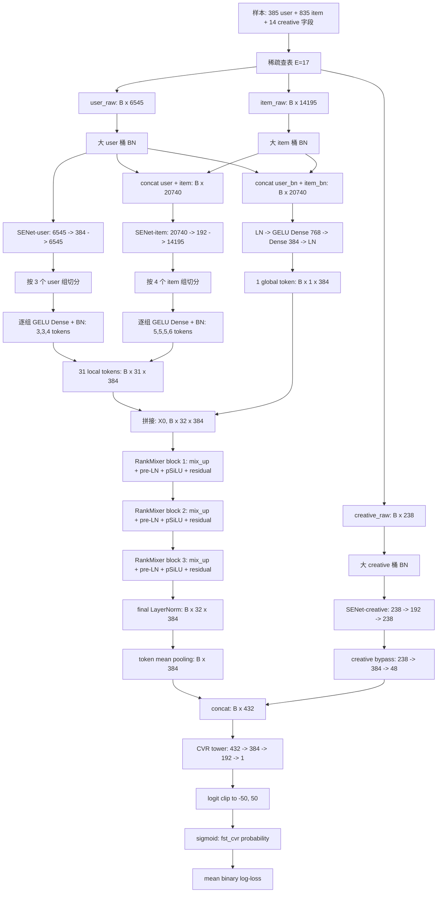
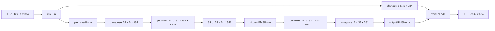

# cvr_senet_mature_rankmixer_v4：D384 pSiLU-Stable 方案说明

## 1. 版本定位

`cvr_senet_mature_rankmixer_v4` 是以
`cvr_senet_mature_rankmixer_v1` 为主干构造的搜索精排 fst_CVR 实验版本。
它保留三桶特征、SENet、31 个局部 token、1 个全局 token、三层
RankMixer、创意旁路、单 CVR 塔及原训练数据链路，核心结构改动是：

1. token 维度由 256 扩展为 384；
2. 与 token 表征容量直接相关的分支按约定同步扩展；
3. 每个 RankMixer block 中的 v1 pSwiGLU 替换为单上投影
   **pSiLU-Stable**；
4. 不增加新的辅助任务、序列分支、蒸馏、DCN 或额外损失。

因此，v4 的目标不是单纯追求最少参数，而是在 D384 容量下，用一个简单、
稳定、容易归因的 FFN 验证：独立门控投影是否是 CVR 排序收益的必要条件。

> 版本状态：这是新的离线实验候选，不应在完成离线 AUC/COPC、分桶指标、
> 稳定性和线上小流量验证前视作现网版本。

## 2. 冻结后的默认配置

设 batch size 为 (B)，embedding 维度为 (E)，token 数为 (T)，token
维度为 (D)，pSiLU 中间维度为 (M)。v4 的默认值如下。

| 模块 | 符号或配置 | v4 数值 |
|---|---:|---:|
| common_user 字段数 | (N_u) | 385 |
| item 字段数 | (N_i) | 835 |
| creative 字段数 | (N_c) | 14 |
| 每字段 embedding 维度 | (E) | 17 |
| user 拼接宽度 | (U=N_uE) | 6,545 |
| item 拼接宽度 | (I=N_iE) | 14,195 |
| creative 拼接宽度 | (C=N_cE) | 238 |
| 局部 token 数 | (T_{local}) | 31 |
| 全局 token 数 | (T_{global}) | 1 |
| 总 token 数 | (T) | 32 |
| token 维度 | (D) | 384 |
| RankMixer 层数 | (L) | 3 |
| FFN 扩展率 | (r) | 3.5 |
| FFN 中间维度 | (M=rD) | 1,344 |
| user SENet 低秩维度 | (R_u) | 384 |
| item SENet 低秩维度 | (R_i) | 192 |
| creative SENet 低秩维度 | (R_c) | 192 |
| global-token 隐层 | (H_g) | 768 |
| creative 旁路 | (C\to H_c\to O_c) | (238\to384\to48) |
| CVR 塔 |  | (432\to384\to192\to1) |

局部 token 的分配保持不变：

- user 三组分别生成 (3+3+4=10) 个 token；
- item 四组分别生成 (5+5+5+6=21) 个 token；
- user 与 item 的原始桶表示再生成 1 个 global token；
- 总数为 (10+21+1=32)。

## 3. 端到端算法流程图



### BN 的准确位置

v4 与 v1 一样，入口首先是三个**大桶 BN**：user、item、creative 各做一次，
并没有先把原始字段拆成很多小桶再分别做入口 BN。后续出现的 BN 分别是：

1. 三个 SENet 的 squeeze 层之后各一次；
2. 七个局部 token 组完成 Dense 投影之后各一次；
3. creative 旁路的两层投影之后各一次；
4. CVR 塔的两个隐藏层之后各一次。

因此，“局部 token 组投影后的 BN”不能等价理解为“原始小桶 BN”：前者作用在
已经投影到 (n_tD) 维的表示上，后者则会在 token 投影以前改变每个原始特征组
的统计口径。

## 4. SENet 计算与初始化

对任意分支，令条件输入为 (x)，需要被重标定的目标表示为 (z)，低秩维度为
(R)。代码中的 excitation2 为

\[
s=\operatorname{ReLU}\!\left(\operatorname{BN}(xW_s+b_s)\right),
\qquad
g=\sigma(sW_e+b_e),
\qquad
\operatorname{SE}(x,z)=z\odot g.
\]

三个分支分别为：

\[
\begin{aligned}
z_u'&=\operatorname{SE}(u,u), &R_u&=384,\\
z_i'&=\operatorname{SE}([u;i],i), &R_i&=192,\\
z_c'&=\operatorname{SE}(c,c), &R_c&=192.
\end{aligned}
\]

初始化保持成熟版本的稳定策略：

- squeeze 权重 (W_s)：Glorot uniform；偏置 (b_s=0)；
- squeeze 后 BN：通常以 (gamma=1,\beta=0) 起步；
- sigmoid excitation 权重 (W_e=0)，偏置 (b_e=0)；
- 因而初始 gate 为 (sigma(0)=0.5)，模型从“所有维度统一缩放 0.5”开始，
  而不是从随机且高度不均匀的特征选择开始。

item gate 的条件输入是 ([u;i])，但 gate 最终只重标定 item 表示；这是一个
“user 条件化 item”的 SENet，而不是把 user 和 item 一起输出。

## 5. token 构造

### 5.1 局部 token

第 (k) 个特征组的输入宽度记为 (F_kE)，该组分配 (n_k) 个 token。

\[
X_k=\operatorname{BN}\left(
\operatorname{GELU}(z_kW_k+b_k)
\right),
\qquad
X_k\in\mathbb{R}^{B\times(n_kD)}.
\]

再将所有组拼接并 reshape，得到

\[
X_{local}\in\mathbb{R}^{B\times31\times384}.
\]

### 5.2 全局 token

global token 使用入口 BN 后的 user/item 原始桶表示，而不是 SENet 输出：

\[
x_g=\operatorname{LN}([u_{bn};i_{bn}]),
\qquad
g=\operatorname{LN}\left(
\operatorname{GELU}(x_gW_{g1}+b_{g1})W_{g2}+b_{g2}
\right),
\]

其中维度为

\[
20740\rightarrow768\rightarrow384.
\]

最后得到

\[
X_0=[X_{local};g]\in\mathbb{R}^{B\times32\times384}.
\]

## 6. RankMixer 与 pSiLU-Stable

### 6.1 参数自由的 mix_up

每一层先对输入 (X_{\ell-1}\in\mathbb{R}^{B\times32\times384}) 做：

\[
B\times32\times384
\xrightarrow{\operatorname{reshape}}
B\times32\times32\times12
\xrightarrow{\operatorname{transpose}(1,2)}
B\times32\times32\times12
\xrightarrow{\operatorname{reshape}}
B\times32\times384.
\]

虽然输入和输出的外观尺寸相同，但中间交换了 token 轴与拆分后的 channel 轴，
所以每个新 token 都聚合了原来多个 token 的通道片段。这个操作没有可训练参数。

记结果为

\[
\widetilde X_\ell=\operatorname{MixUp}(X_{\ell-1}).
\]

### 6.2 v4 单上投影 pSiLU

统一使用 token (t)、层 (ell) 的记号：

\[
q_{\ell,t}=\operatorname{LayerNorm}(\widetilde x_{\ell,t}).
\]

v4 的 token FFN 为

\[
\boxed{
\mathcal F^{S}_{\ell,t}(q_{\ell,t})=
\operatorname{RMSNorm}_{o}\!\left(
\operatorname{RMSNorm}_{h}\!\left[
\operatorname{SiLU}(q_{\ell,t}W_{u,\ell,t}+b_{u,\ell,t})
\right]W_{d,\ell,t}+b_{d,\ell,t}
\right)
}
\]

并采用

\[
x_{\ell,t}=\widetilde x_{\ell,t}+
\mathcal F^{S}_{\ell,t}(q_{\ell,t}).
\]

注意 residual shortcut 是 **mix_up 之后的** (widetilde x_{ell,t})，不是
mix_up 之前的 (x_{ell-1,t})。三层结束后再做一次 final LayerNorm。

单层内部的完整维度流为：



权重和偏置尺寸如下：

| 张量 | 形状 |
|---|---:|
| (W_u) | (32\times384\times1344) |
| (b_u) | (32\times1\times1344) |
| (W_d) | (32\times1344\times384) |
| (b_d) | (32\times1\times384) |
| pre-LN 的 (gamma,\beta) | 各 (384) |
| hidden RMSNorm scale | (1344) |
| output RMSNorm scale | (384) |

初始化策略为：

\[
W_u\sim\operatorname{TruncatedNormal}\left(
0,\frac{\sqrt{2/(D+M)}}{0.879625661}
\right),
\qquad b_u=0,
\]

\[
W_d\sim\operatorname{TruncatedNormal}\left(0,\frac{1}{\sqrt M}\right),
\qquad b_d=0.
\]

LayerNorm 的 (gamma=1,\beta=0)，两个 RMSNorm 的 scale 均初始化为 1。
代码使用 (x\cdot\sigma(x)) 实现 SiLU，以兼容目标 TensorFlow 1.x 环境。

## 7. 与论文 PFFN、v1 pSwiGLU 的严格对比

以下三式共享相同的输入 (q_{\ell,t})，并省略 block 外部完全相同的 mix_up、
pre-LN、residual 和 final LN。

### 7.1 论文 PFFN

\[
\mathcal F^{P}_{\ell,t}(q)=
\operatorname{GELU}(qW_{1,\ell,t}+b_{1,\ell,t})
W_{2,\ell,t}+b_{2,\ell,t}.
\]

### 7.2 v1 pSwiGLU

\[
\mathcal F^{V}_{\ell,t}(q)=
\operatorname{RMSNorm}_{o}\!\left(
\operatorname{RMSNorm}_{h}\!\left[
\operatorname{Swish}(qW_{g,\ell,t}+b_{g,\ell,t})
\odot(qW_{u,\ell,t}+b_{u,\ell,t})
\right]W_{d,\ell,t}+b_{d,\ell,t}
\right).
\]

### 7.3 v4 pSiLU-Stable

\[
\mathcal F^{S}_{\ell,t}(q)=
\operatorname{RMSNorm}_{o}\!\left(
\operatorname{RMSNorm}_{h}\!\left[
\operatorname{SiLU}(qW_{u,\ell,t}+b_{u,\ell,t})
\right]W_{d,\ell,t}+b_{d,\ell,t}
\right).
\]

| 对比项 | 论文 PFFN | v1 pSwiGLU | v4 pSiLU-Stable |
|---|---|---|---|
| 上游投影数 | 1 | 2：gate + value | 1 |
| 下投影数 | 1 | 1 | 1 |
| 非线性 | GELU | Swish gate | SiLU |
| 元素乘法门控 | 无 | 有 | 无 |
| hidden RMSNorm | 论文式中无 | 有 | 有 |
| output RMSNorm | 论文式中无 | 有 | 有 |
| 与 v1 稳定化骨架一致 | 否 | 基准 | 是 |
| 核心假设 | 标准逐 token FFN | 动态门控增强交互 | 单非线性投影已足够 |

v4 不是简单退回论文 PFFN。它只删除 pSwiGLU 的独立 gate/value 双路及乘法，
仍保留 v1 已验证的双 RMSNorm、残差形式和初始化，因此是更接近 v1 的单变量结构
修改。

## 8. creative 旁路与任务头

creative SENet 输出经过：

\[
238\xrightarrow{\text{Dense+BN+parametric Swish}}384
\xrightarrow{\text{Dense+BN+parametric Swish}}48.
\]

其中 parametric Swish 为 (x\sigma(\beta x))，两个 (eta) 都以 1.702
初始化。RankMixer 输出对 32 个 token 做均值池化：

\[
h_m=\frac{1}{32}\sum_{t=1}^{32}X_{L,t}
\in\mathbb R^{B\times384}.
\]

将其与 creative 旁路拼接：

\[
h=[h_m;h_c]\in\mathbb R^{B\times432},
\]

再进入单任务塔：

\[
432\rightarrow384\rightarrow192\rightarrow1
\xrightarrow{\operatorname{clip}[-50,50]}
\sigma(\cdot).
\]

两个隐藏层均为 Dense、Flood/Riemann BN、`gelu_2`；最终只预测
`fst_cvr_label`，损失是 batch 上的平均 binary log-loss。

## 9. 稠密参数量

以下统计包括可训练 Dense/BN/Norm/SENet/FFN 参数，不包括动态稀疏 embedding
表、BN moving mean/variance 和优化器 slot。

| 模块 | v4 参数量 |
|---|---:|
| 三个入口 BN | 41,956 |
| 三路 SENet | 11,848,754 |
| 31 个局部 token 投影 | 37,193,088 |
| global token | 16,266,632 |
| 三层 RankMixer pSiLU | 99,264,576 |
| creative 旁路 | 111,552 |
| CVR 任务头 | 241,537 |
| **合计** | **164,968,095** |

对比口径：

| 方案 | 默认关键宽度 | 稠密参数量 | 解释 |
|---|---|---:|---|
| v1 实际版本 | D256, M896, pSwiGLU | 109,976,671 | 原始基线 |
| v2 实际版本 | D384, M1344, pSwiGLU，其他分支部分保持旧宽度 | 205,157,727 | 现有 D384 文件 |
| **v4 本版本** | D384, M1344, pSiLU，全链路比例扩展 | **164,968,095** | 本次候选 |
| D384 同宽反事实 | D384, M1344, pSwiGLU，全链路比例扩展 | 214,642,335 | 用于隔离 FFN 影响 |

在完全相同的 D384 全链路宽度下，pSiLU 相比 pSwiGLU 少
49,674,240 个参数：RankMixer 模块减少约 33.35%，全稠密模型减少约
23.14%。但由于 v4 同时把 D256 扩为 D384，v4 总参数仍约为实际 v1 的
1.50 倍。不能把“相对 v1 的效果变化”全部归因于去门控。

## 10. args 参数文件

配套参数文件为：

```text
bash/set-rankmixer-mature-v4-args.txt
```

关键 `model_args` 已显式冻结：

| 参数 | 数值 |
|---|---:|
| `user_senet_lowrank` | 384 |
| `item_senet_lowrank` | 192 |
| `creative_senet_lowrank` | 192 |
| `mixup_token_num` | 32 |
| `mixup_token_dim` | 384 |
| `mlp_mixer_layers` | 3 |
| `mixer_expand_ratio` | 3.5 |
| `global_token_hidden_dim` | 768 |
| `creative_hidden_dim` | 384 |
| `creative_output_dim` | 48 |
| `cvr_layers` | `[384, 192]` |
| `runtime_build_id` | `mature_rankmixer_v4_psilu_d384_tf_only_20260901` |

训练侧沿用成熟参数：batch size 2048、`flood_adam`、初始学习率
(2\times10^{-5})、Gaussian decay、60,000 warmup steps、40,000 decay
steps、最小倍率 0.5、单 epoch。所有辅助头和 replay 特有修正保持关闭。

参数文件继续设置：

- `ignore_dense_checkpoint=True`：D384 和 FFN 结构改变后不导入旧稠密参数；
- `ignore_sparse_checkpoint=False`：继续复用已有稀疏 embedding；
- `runtime_build_id` 与源码常量一致，便于启动时发现 args/source 混用。

## 11. 推荐实验口径

最重要的两组比较应分开解释：

1. **业务候选比较**：实际 v1 D256 pSwiGLU vs v4 D384 pSiLU，回答最终
   AUC、COPC、稳定性和延迟是否更好；这是联合改变容量与 FFN 的结果。
2. **结构归因比较**：D384 全链路同宽 pSwiGLU vs v4 D384 pSiLU，只改变
   gate/value 双路，回答去门控本身是否有效。

建议至少监控 overall AUC、user/query/item 频次分桶 AUC、COPC、正负样本
log-loss、训练 loss 曲线、梯度/激活异常、单步吞吐、峰值显存和在线 P99。
只有结构归因组也成立时，才能较有把握地把收益归因于 pSiLU-Stable。

## 12. 代码与兼容性说明

- 模型入口：`models.rankmixer.cvr_senet_mature_rankmixer_v4.MLPModel`；
- 目标运行栈：仓库现有 Python 3、TensorFlow 1.x、Flood；
- SiLU 使用 `x * sigmoid(x)`，不依赖较新 TensorFlow 的 `tf.nn.silu`；
- 保留旧 `pwff_fc2_*` 与 `pwff_fc3_*` scope 名表示 surviving up/down
  投影，`pwff_fc1_*` gate scope 在 v4 中不存在；
- 构图后会核对实际稠密可训练参数与公式统计，默认配置预期为
  **164,968,095**，不一致时直接报错。
