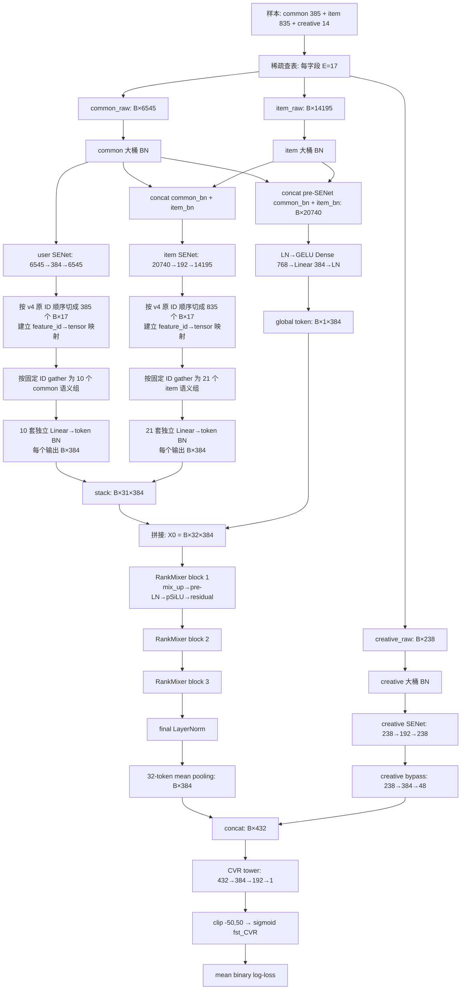

# cvr_senet_mature_rankmixer_v5：语义 Token 化 D384 pSiLU 方案与实现说明

## 1. 版本定位

`cvr_senet_mature_rankmixer_v5` 以已经成功运行的
`cvr_senet_mature_rankmixer_v4` 为唯一主干，只替换 **31 个 local token 的构造方式**：

- v4：把 common 划为 3 个成熟大组、item 划为 4 个成熟大组，再分别一次投影出
  `3+3+4` 与 `5+5+5+6` 个 token；
- v5：沿用 `cvr_bn_unimixer_v1.py` 的 common/item 语义划分，形成
  `10+21=31` 个语义组，每组独立执行 `Linear → token BN`，每组恰好输出一个
  384 维 token；
- `creative` 暂时不参与语义 token 化，继续走 v4 的 creative SENet 与 48 维旁路；
- 第 32 个 global token、RankMixer、pSiLU-Stable、均值池化、CVR 塔、损失函数、
  数据读取以及 train/eval/export 生命周期均保持 v4。

因此 v4 与 v5 的离线差异可以主要归因于：**粗粒度多 token 投影**与
**细粒度语义单 token 投影**之间的差异。

> 版本状态：v5 是新的离线实验候选。当前仓库环境可完成语法与静态契约验证；
> 真正的 TensorFlow 1.x/Flood 构图、首 batch 和训练验证仍应在与 v4 相同的服务器
> 运行环境中执行。

## 2. v4 与 v5 的严格差分边界

| 模块 | v4 | v5 | 是否改变 |
|---|---|---|---:|
| 稀疏字段 | common 385、item 835、creative 14 | 相同 | 否 |
| embedding | 每字段 17 维 | 相同 | 否 |
| 入口 BN | common/item/creative 三个大桶 BN | 相同 | 否 |
| SENet | user 384、item 192、creative 192 | 相同 | 否 |
| local token 分组 | 3 个 common 粗组 + 4 个 item 粗组 | 10 个 common 语义组 + 21 个 item 语义组 | **是** |
| local token 投影 | 每粗组 `GELU Dense → BN`，一次输出多个 token | 每语义组 `Linear → 独立 BN`，一次输出一个 token | **是** |
| creative local token | 无 | 无 | 否 |
| global token | `20740 → 768 → 384` | 相同 | 否 |
| RankMixer | 3 层，T=32，D=384 | 相同 | 否 |
| token FFN | pSiLU-Stable，M=1344 | 相同 | 否 |
| creative 旁路 | `238 → 384 → 48` | 相同 | 否 |
| CVR 塔 | `432 → 384 → 192 → 1` | 相同 | 否 |
| 目标与损失 | fst_CVR + mean binary log-loss | 相同 | 否 |

v5 没有引入 UniMixer 主干、温度退火、Sinkhorn、序列特征、蒸馏、replay 校正、
DCN 或辅助任务；只借用了 UniMixer v1 中经过固定的 **语义字段分组与逐 token 投影方式**。

## 3. 冻结后的默认维度

设 batch size 为 \(B\)，字段 embedding 维度为 \(E\)，总 token 数为 \(T\)，
token 维度为 \(D\)，pSiLU 隐层维度为 \(M\)。默认配置为：

| 项目 | 符号 | 数值 |
|---|---:|---:|
| common 字段数 | \(N_u\) | 385 |
| item 字段数 | \(N_i\) | 835 |
| creative 字段数 | \(N_c\) | 14 |
| embedding 维度 | \(E\) | 17 |
| common 大桶宽度 | \(385E\) | 6,545 |
| item 大桶宽度 | \(835E\) | 14,195 |
| creative 大桶宽度 | \(14E\) | 238 |
| common 语义 token 数 |  | 10 |
| item 语义 token 数 |  | 21 |
| global token 数 |  | 1 |
| 总 token 数 | \(T\) | 32 |
| token 维度 | \(D\) | 384 |
| RankMixer 层数 | \(L\) | 3 |
| pSiLU 扩展率 | \(r\) | 3.5 |
| pSiLU 隐层维度 | \(M=rD\) | 1,344 |
| global token 隐层 | \(H_g\) | 768 |
| creative 输出 | \(O_c\) | 48 |

## 4. 31 个 local token 的固定顺序

token 顺序是模型 ABI，不在运行时哈希、排序或重排。下表中的序号就是进入
RankMixer 前的 local token 下标。

| token | bucket | 语义组 | 字段数 \(n_t\) | 投影输入宽度 \(17n_t\) |
|---:|---|---|---:|---:|
| 0 | common | `common_user_profile_device_geo_lifecycle` | 39 | 663 |
| 1 | common | `common_user_order_consumption_value` | 39 | 663 |
| 2 | common | `common_user_purchase_price_recency` | 39 | 663 |
| 3 | common | `common_longterm_view_exposure_interest` | 39 | 663 |
| 4 | common | `common_longterm_click_fav_interest` | 39 | 663 |
| 5 | common | `common_query_text_intent` | 38 | 646 |
| 6 | common | `common_query_retrieval_relevance` | 38 | 646 |
| 7 | common | `common_realtime_session_action` | 38 | 646 |
| 8 | common | `common_shortterm_candidate_funnel` | 38 | 646 |
| 9 | common | `common_shortterm_funnel_page_context` | 38 | 646 |
| 10 | item | `item_goods_category_brand_identity` | 42 | 714 |
| 11 | item | `item_shop_static_quality_service` | 42 | 714 |
| 12 | item | `item_title_query_lexical_ner` | 42 | 714 |
| 13 | item | `item_semantic_category_relevance` | 42 | 714 |
| 14 | item | `item_image_video_embedding_similarity` | 42 | 714 |
| 15 | item | `item_current_price_supply` | 35 | 595 |
| 16 | item | `item_coupon_promotion_discount` | 35 | 595 |
| 17 | item | `item_user_purchase_price_preference` | 35 | 595 |
| 18 | item | `item_user_view_click_price_preference` | 35 | 595 |
| 19 | item | `item_price_gap_rank_competitiveness` | 35 | 595 |
| 20 | item | `item_price_promotion_buypower_context` | 35 | 595 |
| 21 | item | `item_goods_category_global_funnel` | 42 | 714 |
| 22 | item | `item_shop_brand_global_quality` | 42 | 714 |
| 23 | item | `item_purchase_order_fav_affinity` | 42 | 714 |
| 24 | item | `item_longterm_exposure_view_affinity` | 42 | 714 |
| 25 | item | `item_click_stay_engagement` | 42 | 714 |
| 26 | item | `item_shortterm_candidate_funnel` | 41 | 697 |
| 27 | item | `item_session_page_position_context` | 41 | 697 |
| 28 | item | `item_i2i_graph_neighbor_recall` | 41 | 697 |
| 29 | item | `item_u2i_q2i_query_recall` | 41 | 697 |
| 30 | item | `item_recall_source_hit_rank_path` | 41 | 697 |

common 分组尺寸严格为：

\[
(39,39,39,39,39,38,38,38,38,38),\qquad \sum n_t=385.
\]

item 分组尺寸严格为：

\[
(42,42,42,42,42,35,35,35,35,35,35,42,42,42,42,42,41,41,41,41,41),
\qquad \sum n_t=835.
\]

源码同时冻结了每组、每桶语义顺序的 SHA256；字段缺失、重复、跨桶、顺序改变或
creative 混入 local token 都会在模型初始化阶段报错。

## 5. 为什么必须“先恢复字段映射，再按语义 gather”

v4 入口大桶的字段顺序来自成熟的 3 个 common 粗组与 4 个 item 粗组；v5 语义组
顺序与它们不同。因此不能把 `user_senet` 直接按 `(39,39,...)×17` 切开，否则张量
宽度虽然完全正确，但字段语义会静默错位。

v5 的安全流程为：

\[
u^{se}\in\mathbb R^{B\times6545}
\xrightarrow[\text{v4 原 ID 顺序}]{\operatorname{split}(17)}
\{id_j\mapsto e^{se}_j\}_{j=1}^{385},
\]

\[
i^{se}\in\mathbb R^{B\times14195}
\xrightarrow[\text{v4 原 ID 顺序}]{\operatorname{split}(17)}
\{id_j\mapsto e^{se}_j\}_{j=1}^{835}.
\]

随后才按照语义组中显式保存的 feature ID gather。这样既保留 v4 大桶 BN/SENet
对每个原位置的作用，又得到 UniMixer v1 定义的语义 token。

## 6. 单个语义 token 的公式、BN 与初始化

对第 \(t\) 个语义组 \(G_t\)，字段数为 \(n_t\)，取 post-SENet 字段表示：

\[
x_t=\operatorname{Concat}\left(e^{se}_j:j\in G_t\right)
\in\mathbb R^{B\times17n_t}.
\]

v5 token 化公式为：

\[
\boxed{
z_t=\operatorname{BN}_t\left(x_tW_t+b_t\right)
\in\mathbb R^{B\times384}
}
\]

其中没有 GELU、SiLU 或 RMSNorm。31 组分别拥有独立的：

- \(W_t\in\mathbb R^{17n_t\times384}\)；
- \(b_t\in\mathbb R^{384}\)；
- BN 的 trainable `gamma/beta`；
- BN 的非 trainable `moving_mean/moving_variance`；
- TensorFlow variable scope。

每次 BN 输入都是 `[B,384]`，只沿 batch 维统计，不会把 31 个 token 的统计量混在
一起。token BN 是 v5 语义 tokenizer 的强制组成部分，即便外围实验关闭其他
`batch_norm` 分支，也不会被共享或省略。

初始化严格采用：

\[
W_t\sim\mathcal N\left(0,\frac{1}{17n_t}\right),\qquad
\operatorname{std}(W_t)=\frac{1}{\sqrt{17n_t}},\qquad b_t=0.
\]

投影 kernel 继续使用 `l2_deep` regularizer；BN 后不再接激活函数。

## 7. 端到端算法流程图



流程图中只有“恢复字段映射、31 组 gather、31 套 Linear→BN”是 v5 新路径。

## 8. 保持不变的 global token 与 creative 路径

global token 仍使用 **入口 BN 后、SENet 前** 的 common/item：

\[
x_g=\operatorname{LN}([u_{bn};i_{bn}]),
\]

\[
g=\operatorname{LN}\left(
\operatorname{GELU}(x_gW_{g1}+b_{g1})W_{g2}+b_{g2}
\right),
\qquad 20740\rightarrow768\rightarrow384.
\]

31 个 local token 与 global token 拼接为：

\[
X_0=[z_0,z_1,\ldots,z_{30},g]\in\mathbb R^{B\times32\times384}.
\]

creative 的 14 个字段仍参与 creative 大桶 BN、creative SENet，并进入：

\[
238\rightarrow384\rightarrow48.
\]

它不生成第 32 个 local token；第 32 个 token 明确是 v4 global token。

## 9. 保持不变的 RankMixer pSiLU-Stable

每层继续先做无参数 `mix_up`，再对各 token 使用 v4 的 pSiLU-Stable：

\[
q_{\ell,t}=\operatorname{LayerNorm}(\widetilde x_{\ell,t}),
\]

\[
\mathcal F^{S}_{\ell,t}(q_{\ell,t})=
\operatorname{RMSNorm}_{o}\left(
\operatorname{RMSNorm}_{h}\left[
\operatorname{SiLU}(q_{\ell,t}W_{u,\ell,t}+b_{u,\ell,t})
\right]W_{d,\ell,t}+b_{d,\ell,t}
\right),
\]

\[
x_{\ell,t}=\widetilde x_{\ell,t}+\mathcal F^{S}_{\ell,t}(q_{\ell,t}).
\]

默认 \(D=384,M=1344,L=3\)，参数作用域与 v4 的 surviving
`pwff_fc2_*` / `pwff_fc3_*` 保持一致。

## 10. 稠密参数量

语义 tokenizer 的可训练参数为：

\[
P_{tokenizer}
=\sum_{t=0}^{30}\left[(17n_t)\times384+384+2\times384\right].
\]

因为 \(\sum n_t=385+835=1220\)，所以：

\[
P_W=1220\times17\times384=7,964,160,
\]

\[
P_b=31\times384=11,904,
\]

\[
P_{BN}=31\times2\times384=23,808,
\]

\[
\boxed{P_{tokenizer}=7,999,872}.
\]

BN moving mean/variance、动态稀疏 embedding 表和优化器 slot 不计入 trainable
参数。默认配置分项如下：

| 模块 | v4 | v5 |
|---|---:|---:|
| 三个入口 BN | 41,956 | 41,956 |
| 三路 SENet | 11,848,754 | 11,848,754 |
| 31 个 local token 投影 | 37,193,088 | **7,999,872** |
| global token | 16,266,632 | 16,266,632 |
| 三层 RankMixer pSiLU | 99,264,576 | 99,264,576 |
| creative 旁路 | 111,552 | 111,552 |
| CVR 塔 | 241,537 | 241,537 |
| **合计** | **164,968,095** | **135,774,879** |

差值为：

\[
164,968,095-135,774,879=29,193,216.
\]

参数下降是“一组只输出一个 token”的结构结果，不是本版本的独立优化目标；实验重点
仍是语义划分是否带来更好的 CVR 表征和泛化。

## 11. args、checkpoint 与运行入口

模型入口：

```text
models.rankmixer.cvr_senet_mature_rankmixer_v5.MLPModel
```

配套参数文件：

```text
bash/set-rankmixer-mature-v5-args.txt
```

args 除模型入口与 `runtime_build_id` 外保持 v4 不变。build ID 为：

```text
mature_rankmixer_v5_semantic_psilu_d384_tf_only_20260901
```

继续保留：

- `ignore_dense_checkpoint=True`：v5 tokenizer 的变量数量、形状和 scope 已改变，
  不导入 v4 稠密参数；
- `ignore_sparse_checkpoint=False`：继续复用既有稀疏 embedding；
- `batch_norm=true`、D=384、T=32、L=3、M=1344 以及所有训练超参数与 v4 一致。

## 12. 实验解释与验收建议

最直接的 A/B 是同一数据、同一 sparse checkpoint、同一随机种子和训练超参数下：

```text
v4 粗粒度 7 组多 token 投影
vs
v5 细粒度 31 语义组单 token 投影
```

至少验收：overall AUC、COPC、log-loss、query/user/item 频次分桶 AUC、长尾与冷启动
分桶、训练曲线、梯度/激活异常、吞吐、显存和线上 P99。特别关注：

1. 语义 token 是否改善长尾字段与跨域统计的隔离；
2. 每 token 独立 BN 在小 batch、分布漂移和多 worker 条件下是否稳定；
3. v5 参数更少后是否出现容量损失，还是因为减少粗组内无关耦合而提升泛化；
4. global token 与 local token 的互补性是否保持。

源码的构图参数审计保持 v4 行为：公式值与实际 graph trainable 变量一致时记录验证
成功；若不一致则记录 warning 并继续，以保留可配置架构的运行兼容性，而不是直接抛错。
