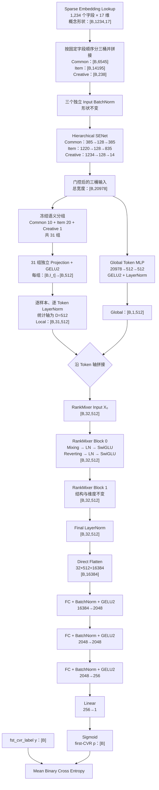
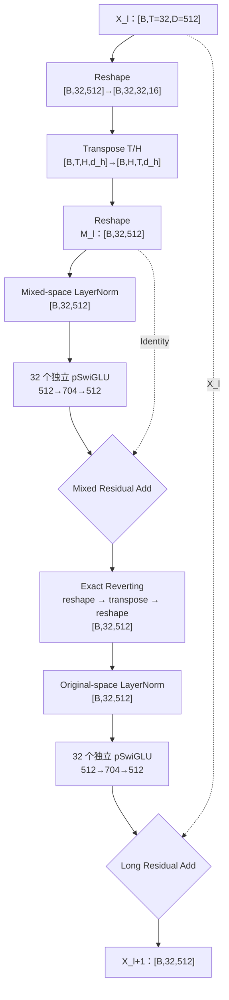

# RankMixer v10：LayerNorm PureFlat 单路径架构

## 1. 模型定位

RankMixer v10 是搜索首次转化率预估的单任务模型。它不是在 v9 上继续增加 DCNM、
Shortcut、Gate 或读出分支，而是以 v6 的语义 Token 主干为基础，完成两项受控修改：

1. RankMixer Token 投影后、Block 内以及最终输出统一使用标准 LayerNorm。
2. 删除 Global-conditioned Pool、压缩 Flatten、scalar gate 和多路 Concat，直接把
   `[B,32,512]` 展平为 `[B,16384]`，送入 Base 风格的深任务头。

因此 v10 的主链只有一条：

```text
BN → SENet → 31 Local + 1 Global Token
→ 2 × Mixing/Reverting RankMixer Block
→ Final LayerNorm
→ Direct Flatten
→ 2048 → 2048 → 256 → 1
```

对应实现：

- [`cvr_bn_rankmixer_v10.py`](../src/models/rankmixer/cvr_bn_rankmixer_v10.py)
- [`set-rankmixer-v10-args.txt`](../bash/set-rankmixer-v10-args.txt)
- [`test_rankmixer_v10_static.py`](../src/models/rankmixer/tests/test_rankmixer_v10_static.py)

## 2. 固定配置

v10 将关键结构参数固定在代码中，并在初始化时校验，避免启动参数与算法说明不一致。

| 配置项 | v10 取值 |
|---|---:|
| Common / Item / Creative 字段数 | 385 / 835 / 14 |
| 输入字段总数 | 1,234 |
| Field Embedding 维度 | 17 |
| 展平输入总宽度 | 20,978 |
| Local / Global Token | 31 / 1 |
| 总 Token 数 `T` | 32 |
| Mixing Head 数 `H` | 32 |
| Token hidden dimension `D` | 512 |
| Head dimension `d_h=D/H` | 16 |
| RankMixer Block 数 `L` | 2 |
| Per-token SwiGLU hidden `M` | 704 |
| RankMixer 归一化 | 标准 LayerNorm |
| 读出方式 | PureFlat |
| Task Head | `16384→2048→2048→256→1` |
| 训练目标 | 单一 first-CVR BCE |
| 固定 Dense 可训练参数 | **199,275,877** |
| 扩展 FLOPs/样本 | **399,355,903** |

启动参数显式固定：

```json
{
  "rm_norm_type": "layer_norm",
  "rm_readout_type": "pure_flat",
  "rm_token_num": 32,
  "rm_hidden_dim": 512,
  "rm_layer_num": 2,
  "rm_head_num": 32,
  "rm_swiglu_hidden_dim": 704,
  "cvr_layers": [2048, 2048, 256]
}
```

## 3. 端到端算法流程与维度



主链维度可以简写为：

\[
[B,1234,17]
\rightarrow [B,20978]
\rightarrow [B,31,512]\oplus[B,1,512]
\rightarrow [B,32,512]
\rightarrow [B,16384]
\rightarrow [B,2048]
\rightarrow [B,2048]
\rightarrow [B,256]
\rightarrow [B,1].
\]

## 4. 语义 Token 与 LayerNorm

### 4.1 31 个 Local Token

v10 完整复用 v6 已冻结的语义分组，不在运行时哈希、排序或重新划分字段。

| Bucket | Token 数 | 每组字段数 |
|---|---:|---|
| Common | 10 | `39×5 + 38×5 = 385` |
| Item | 20 | `42×15 + 41×5 = 835` |
| Creative | 1 | `14` |
| 合计 | 31 | 1,234 |

代码同时校验：

- 每个字段恰好进入一个 Token；
- 不允许跨 Common/Item/Creative 桶；
- 每组容量固定；
- 字段顺序 SHA256 与冻结值完全一致；
- `rm_group_version=rankmixer_v10_semantic_balanced_v1`。

### 4.2 投影后的标准 LayerNorm

第 `t` 个语义组输入宽度为 `I_t=17×组内字段数`：

\[
z_t\in\mathbb{R}^{I_t}
\xrightarrow{\text{Linear+GELU2}}
u_t\in\mathbb{R}^{512}.
\]

随后沿最后一维做标准 LayerNorm：

\[
\operatorname{LN}(u_t)=
\gamma\odot
\frac{u_t-\mu_t}{\sqrt{\sigma_t^2+\epsilon}}
+\beta.
\]

其中均值和方差对每个样本、每个 Token 独立计算，统计轴只有 `D=512`。
标准 LayerNorm 的 `gamma/beta` 形状均为 `[512]`，在 Token 位置之间共享；
Token Projection 和 SwiGLU 参数仍按 Token 独立。

实现复用仓库现有 `model_utils.layer_norm`：

- 训练图优先调用当前生产环境的 `cayman.python.layer_norm_for_train`；
- 导出图调用同一 TensorFlow 1.x 版本的 `tf.contrib.layers.layer_norm`；
- 不增加第三方包，不修改 TensorFlow、Flood 或 Cayman 版本。

需要区分两类归一化：

| 位置 | 归一化 | 目的 |
|---|---|---|
| SENet 前和 Task Head | BatchNorm | 使用总体样本统计校准固定字段或 MLP 隐层 |
| Token 投影后、RankMixer Block 内、最终 Token | LayerNorm | 单样本内稳定每个 Token 的隐藏状态 |

“v10 使用 LayerNorm”特指 RankMixer Token 主链，不删除 Base 输入塔和任务头原有的 BatchNorm。

## 5. Mixing/Reverting Block

每个 Block 的输入输出均为 `[B,32,512]`。



公式为：

\[
M_l=\operatorname{Mix}(X_l),
\]

\[
\widetilde M_l=M_l+
\operatorname{pSwiGLU}_{mix}
(\operatorname{LN}_{mix}(M_l)),
\]

\[
R_l=\operatorname{Revert}(\widetilde M_l),
\]

\[
X_{l+1}=X_l+
\operatorname{pSwiGLU}_{token}
(\operatorname{LN}_{token}(R_l)).
\]

Mixing 与 Reverting 仍然只是 reshape/transpose，不包含可训练参数。LayerNorm 使用共享
`[D]` 仿射参数，但两个 pSwiGLU 的权重在 32 个位置上相互独立。

## 6. PureFlat 单路径读出

v6 的最终 `[B,32,512]` 先拆为 Global 与 31 个 Local Token，再生成：

```text
Global 512 + Weighted Pool 512 + Gated Flatten 512 = 1536
```

v9 则在此基础上继续加入 DCNM Shortcut。v10 删除这些读出模块：

```text
Final Tokens：[B,32,512]
    ↓ 保持固定 Token 顺序直接 reshape
PureFlat Context：[B,16384]
    ↓
Base-style Task Head：16384→2048→2048→256→1
```

这里的 Flatten：

- 没有投影层；
- 没有 sigmoid gate；
- 没有 weighted pooling；
- 没有 Global/Local 旁路；
- 没有 DCNM Shortcut；
- 没有辅助损失或第二个预测头。

它保留所有 32 个 Token 的位置身份和全部 512 维坐标，让单一任务头决定哪些坐标有效。
因此，v10 是对“读出压缩是否造成信息损失”的直接实验，而不是对 Mixing 算子的独立增强。

## 7. 参数量静态核算

参数统计只包含固定 Dense 可训练变量，不包含动态稀疏 Embedding、优化器 slot、指标变量
和 BatchNorm moving statistics。

| 模块 | 参数量 |
|---|---:|
| 三桶 Input BatchNorm | 41,956 |
| Hierarchical SENet | 522,112 |
| 31 个 Local Token Projection + LayerNorm | 10,757,632 |
| Global Token MLP + LayerNorm | 11,004,928 |
| 2 个 Mixing/Reverting Block | 138,661,888 |
| Final LayerNorm | 1,024 |
| PureFlat Task Head | 38,286,337 |
| **合计** | **199,275,877** |

关键公式：

```text
Local Tokenizer
= 20,978×512              # 所有 Local Projection kernel
  + 31×512                # 31 个 bias
  + 2×512                 # 标准 LN gamma + beta
= 10,757,632

一个 pSwiGLU
= 32 × [3×512×704 + 2×704 + 512]
= 34,664,448

两个 Block
= 2 × [2×34,664,448 + 2×(2×512)]
= 138,661,888

Task Head
= (16,384×2,048 + 2,048 + 2×2,048)
 + (2,048×2,048 + 2,048 + 2×2,048)
 + (2,048×256 + 256 + 2×256)
 + (256×1 + 1)
= 38,286,337
```

模型初始化会用同一公式计算参数预算；建图后还会遍历 `Cvr-task-part` 下的实际可训练
变量并校验总数必须等于 `199,275,877`，防止代码、脚本和文档发生静默偏移。

## 8. FLOPs 静态核算

按单样本一次推理前向计算：一次乘法或加法各计 1 FLOP，Dense MAC 计 2 FLOPs，
推理 BatchNorm 每元素计 4 FLOPs，LayerNorm 每个长度 `D` 的向量计 `8D+2`，
GELU2 按每元素 9 FLOPs。reshape/transpose 不计算术 FLOPs，但仍有内存访问成本。

| 模块 | 扩展 FLOPs/样本 |
|---|---:|
| 三桶 Input BatchNorm | 83,912 |
| Hierarchical SENet | 1,087,414 |
| Local Tokenizer | 21,751,358 |
| Global Token | 22,014,466 |
| 2 个 RankMixer Block | 277,684,480 |
| Final LayerNorm | 131,136 |
| Task Head + Sigmoid | 76,603,137 |
| **合计** | **399,355,903（0.399356G）** |

Batch 2,048 的固定前向算术量约为 `0.817881 TFLOPs`。这不是生产延迟估计；稀疏
查表、参数服务器通信、transpose 和内存带宽仍需通过实际运行观测。

## 9. 与 Base、v6、v9 的结构对比

| 对比项 | Base | v6 | v9 | v10 |
|---|---|---|---|---|
| 输入塔 | BN+SENet | BN+SENet | BN+SENet | BN+SENet |
| 显式 Cross | 2×DCNM500 | 无 | 2×DCNM500 | 无 |
| Token | 无 | 31 Local+1 Global | Raw/Cross Local+Cross Global | 31 Local+1 Global |
| Mixer Block | 无 | 2×Mix/Revert | 2×Mix/Revert | 2×Mix/Revert |
| RankMixer Norm | 无 | RMSNorm | RMSNorm | **LayerNorm** |
| 读出 | 20,978 维 DCNM 输出 | Global+Pool+GatedFlat | 三路读出+Shortcut | **32 Token Direct Flat** |
| Task Head 输入 | 20,978 | 1,536 | 1,792 | **16,384** |
| Dense 参数 | 90,341,785 | 177,217,126 | 199,445,658 | **199,275,877** |
| FLOPs/样本 | 180,923,051 | 358,638,942 | 403,287,434 | **399,355,903** |

v10 与 v9 的预算接近：

- v10 比 v9 少 `169,781` 个 Dense 参数，差异约 `-0.085%`；
- v10 比 v9 少 `3,931,531` FLOPs/样本，差异约 `-0.975%`。

因此后续 v9/v10 AUC 对比基本不受总参数规模差异解释，但仍需注意二者的 Cross、Token
输入和读出路径不同，不能把差异只归因于 LayerNorm。

## 10. 训练、Checkpoint 与结果解释

v10 启动文件沿用当前 TensorFlow 1.x/Flood 训练配置、特征版本、优化器和学习率：

- `feature_version=data.cvr.cvr_fea_v10_base_cold`；
- `embedding_size=17`；
- `optimizer=flood_adam`；
- `learning_rate=2e-5`；
- `batch_size=2048`；
- 稀疏 Embedding 从现有 Base checkpoint 恢复；
- `ignore_dense_checkpoint=True`，v10 Dense 主塔冷启动。

不能直接恢复 v6/v9 Dense 权重：

- RMSNorm 与 LayerNorm 的变量结构不同；
- v10 任务头第一层输入从 1,536/1,792 改为 16,384；
- v10 删除了旧 Pool、Flatten gate、DCNM 和 Shortcut scope；
- 新任务头 scope 为 `rm_v10_mlp* / rm_v10_bn_* / rm_v10_out`。

结果解释必须保持克制：

- 如果 v10 超过 v6，说明“LayerNorm + 未压缩读出”的整体方案更好，不能立刻归因于其中一项；
- 如果 v10 超过 v9，不能说明固定 Mixing 强于 DCNM，只能说明该单路径组合在当前数据上更有效；
- 如果需要识别 LayerNorm 的独立贡献，应在 v10 完全相同的 PureFlat 结构上仅替换 Norm；
- 单日、单 seed 结果不足以作为稳定结论，应使用相同数据窗口和多个随机种子做配对比较。

