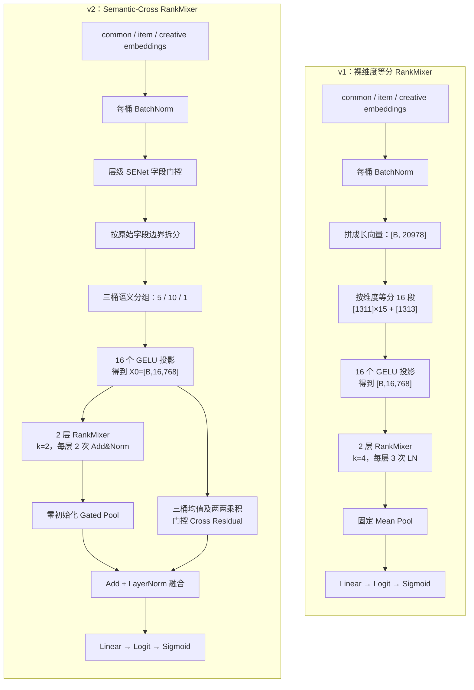
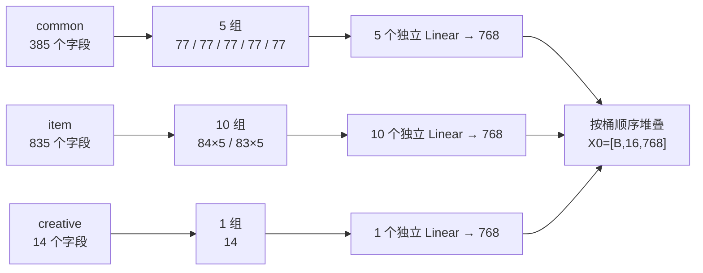
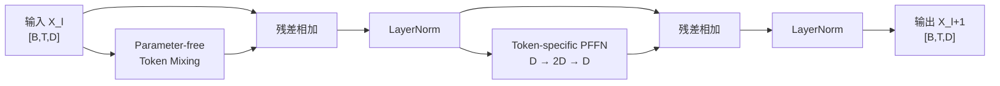
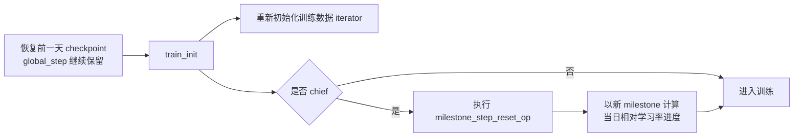
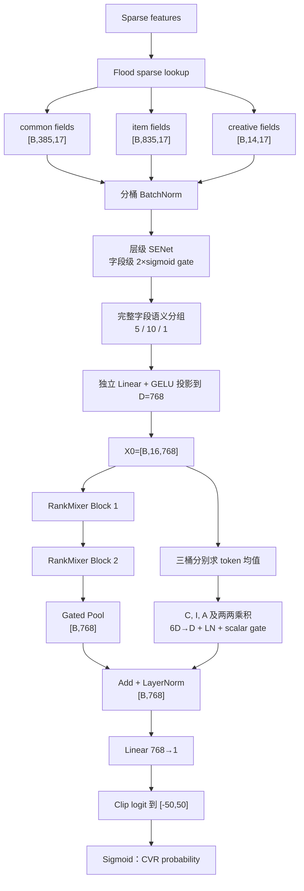

# Semantic-Cross RankMixer v2 方案说明

本文对比以下两个实际实现：

- v1：[cvr_bn_rankmixer_v1.py](../src/models/rankmixer/cvr_bn_rankmixer_v1.py)
- v2：[cvr_bn_rankmixer_v2.py](../src/models/rankmixer/cvr_bn_rankmixer_v2.py)
- 当前 v2 启动配置：[set-rankmixer-v2.txt](../bash/set-rankmixer-v2.txt)

文中的默认运行参数以当前 v2 启动脚本为准。当前特征版本只包含 `common`、`item`、`creative` 三个桶，共 1,234 个字段；每个字段的 embedding 维度为 17。

> 核心结论：v2 不是单纯缩小 v1，而是把 v1 的“裸维度等分 RankMixer”重构成“字段对齐的 Semantic-Cross RankMixer”。它保留三桶和字段边界，引入字段级 SENet、自适应 token 汇聚和三桶显式乘性交叉，同时把 RankMixer block 恢复为两次 Add&Norm，并将主干参数量从约 167.25M 控制到约 95.77M。

---

# 第一部分：v2 与 v1 的不同

## 1. 差异总览

| 对比项 | v1 | v2 | 主要意义 |
|---|---|---|---|
| 输入范围 | 实际使用三桶，但没有检查其他桶是否非空 | 明确只接受 `common/item/creative`，其他桶非空时直接报错 | 防止配置变化后特征被静默忽略 |
| token 划分依据 | 三桶拼成长向量后按裸维度近似等分 | 先按桶，再按完整字段分组 | 保留业务语义和字段边界 |
| 当前 16 个 token | `[1311] × 15 + [1313]` 维 | `common/item/creative = 5/10/1` 个 token | creative 获得独立 token，不再混入 item |
| token 投影 | 默认 GELU 非线性投影 | 默认 `gelu_2` 非线性投影，仍可配置 | 与 v1 对齐；v2 的差异集中在字段分组方式 |
| 字段重要性 | `use_senet` 参数存在，但主塔没有使用 SENet | 可选层级 SENet；当前脚本已启用 | 恢复样本级字段重标定能力 |
| Token Mixing | 无参数 reshape/transpose/reshape | 保留同一无参数 mixing，并强制 `H == T` | 保持 RankMixer 的低成本跨 token 信息交换 |
| Per-token FFN | Python 循环创建每个 token 的 FC | token-major batched matmul | 参数仍按 token 独立，但计算图更规整 |
| FFN 扩张倍数 | 默认 `k=4` | 默认及当前配置 `k=2` | 主导参数和计算量约减半 |
| 每层归一化 | 3 次 LN：mix 后、PFFN 前、PFFN 后 | 2 次 LN：两次 Add&Norm | 恢复标准 RankMixer block 路径 |
| token 汇聚 | 固定 mean pooling | 零初始化 gated pooling | 初始等价于均值，随后可按样本学习 token 权重 |
| 三桶显式交叉 | 无 | `C⊙I`、`C⊙A`、`I⊙A` 乘积支路 | 补充显式二阶桶间交互 |
| 交叉支路融合 | 无 | 小门控残差加到主干 context 后再 LN | 让新增支路从较弱影响开始训练 |
| 热启动学习率 | `train_init` 不执行 milestone reset | chief 在 `train_init` 中执行 reset 并打印 milestone | 每日热启动时重新建立相对学习率进度 |
| 输出头变量名 | `rm_out` | `rm_out_v2` | 明确区分两代 dense head，避免误恢复 |
| 核心稠密参数量 | 约 167.25M | 约 95.77M | v2 为 v1 的约 57.3%，更接近原项目的参数预算 |

## 2. 两代方案主流程对比



## 3. 差异详解

### 3.1 从“静默忽略”改为明确的三桶输入契约

v1 会从 lookup 结果中收集 `common`、`item`、`creative`，其他类型的特征即使存在，也不会进入 RankMixer 主塔。配置发生变化时，这种行为可能造成特征被静默丢弃。

v2 在初始化时检查以下额外桶：

- `coupon`
- `dense`
- `sequence`
- `gattr`
- `din`

只要其中任意一个非空，v2 就停止建图并报告实际非空桶。它还会检查：

1. 三个目标桶都必须非空；
2. `rm_bucket_token_counts` 必须恰好包含三个整数；
3. 三个 token 数之和必须等于 `rm_token_num`；
4. 每个桶至少分到一个 token；
5. 一个桶的 token 数不能超过该桶的字段数；
6. `rm_head_num` 必须等于 `rm_token_num`。

这类检查不改变模型表达能力，但可以把配置错误提前到建图阶段暴露出来。

### 3.2 从裸维度等分改为字段对齐的语义 token

当前输入规模为：

| 桶 | 字段数 | 每字段维度 | 展平维度 |
|---|---:|---:|---:|
| common | 385 | 17 | 6,545 |
| item | 835 | 17 | 14,195 |
| creative | 14 | 17 | 238 |
| 合计 | 1,234 | 17 | 20,978 |

#### v1 的做法

v1 先得到：

```text
long_vec = concat(common, item, creative)  # [B, 20978]
segments = [1311] * 15 + [1313]
```

这一切法有两个直接问题：

- `1311 mod 17 = 2`，因此前 15 个切点都没有落在完整字段边界上；同一个字段的 17 维 embedding 会被拆到相邻 token。
- 第 5 个 token 同时含有 common 和 item；最后一个 token 同时含有 item 和全部 creative。creative 只有 14 个字段，无法形成独立语义空间。

#### v2 的做法

v2 保留每个原始字段 tensor，先在桶内按字段数均衡分组，再把每组完整字段投影为一个 token。当前脚本显式配置：

```text
rm_bucket_token_counts = [5, 10, 1]
```

具体分组为：

| 桶 | token 数 | 每个 token 包含的完整字段数 | 投影前维度 |
|---|---:|---|---|
| common | 5 | `[77, 77, 77, 77, 77]` | 每个 1,309 |
| item | 10 | `[84,84,84,84,84,83,83,83,83,83]` | 前五个 1,428，后五个 1,411 |
| creative | 1 | `[14]` | 238 |

所有分组都满足：

- 一个字段只属于一个 token；
- 一个 token 只属于一个桶；
- 三桶顺序稳定为 `common → item → creative`；
- 16 个 token 投影后统一为 `D=768`。



当没有显式传入 `[5,10,1]` 时，v2 会先为每个桶保留一个 token，再按字段数比例和最大余数法分配剩余 token。当前生产脚本已显式固定数量，因此运行结果不会依赖自动分配。

### 3.3 token 投影保持与 v1 一致的 GELU

v1 对每个切片执行：

```text
token = GELU(segment × W + b)
```

v2 当前执行：

```text
token = GELU(semantic_group × W + b)
```

即 `rm_token_proj_act="gelu_2"`。v1 与 v2 的投影激活保持一致；两者的核心区别是 v1 输入裸维度切片，而 v2 输入按桶、按完整字段形成的语义组。代码仍保留 `identity`/`linear` 配置，便于后续消融，但它们不再是默认值或当前启动配置。

v1 和 v2 的投影参数总量基本相同：所有输入字段仍只进入一个投影，变化的是分组边界，而不是通过增加投影参数获得收益。GELU 本身不增加可训练参数。

### 3.4 v2 真正接入了层级 SENet

v1 虽然读取 `use_senet`、`use_senet_bn` 和 `senet_hidden_size`，但 RankMixer 主塔没有调用 SENet。

v2 在每桶 BatchNorm 后、语义分组前执行字段级门控。对每个字段先在 embedding 维度取均值，再按层级上下文产生 gate：

```text
common gate   ← common 字段统计
item gate     ← common + item 字段统计
creative gate ← common + item + creative 字段统计
```

门控形式为：

```text
gate = 2 × sigmoid(W_out × tanh(BN(optional)(field_summary × W_in)))
output_field = input_field × gate
```

`gate` 的范围为 `(0, 2)`。当门控 logit 接近 0 时，gate 接近 1，因此网络可以从接近恒等映射的状态学习增强或抑制字段。当前启动脚本设置：

```text
use_senet = true
use_senet_bn = true
senet_hidden_size = 128
```

需要注意：类构造函数中的 `use_senet` 默认值仍是 `False`。只有使用当前脚本或显式传入 `true` 时，完整 v2 的 SENet 路径才会启用。

### 3.5 RankMixer block：保留无参数 mixing，重写 PFFN 和归一化路径

#### 无参数 Multi-Head Token Mixing

v1 与 v2 都使用同一类参数无关变换：

```text
[B,T,D]
→ reshape [B,T,H,D/H]
→ transpose [B,H,T,D/H]
→ reshape [B,T,D]
```

它不是 self-attention：

- 没有 Q、K、V；
- 没有 token 两两点积；
- 没有 attention matrix；
- 只通过 reshape 和 transpose 让不同 token 的通道发生确定性交换。

v2 进一步在建图前约束 `H == T`。当前 `T=H=16`，`D=768`，因此每个 head 的维度为 `48`。

#### Per-token FFN 从循环 FC 改为 batched matmul

v1 对每层的 16 个 token 逐个创建两层 FC。v2 将 batch 转成 token-major：

```text
input: [B,T,D] → [T,B,D]
W1:    [T,D,kD]
W2:    [T,kD,D]
```

随后用 batched matmul 一次处理全部 token。每个 token 仍有独立的 `W1/W2/b1/b2`，所以这不是参数共享；变化的是执行拓扑和变量布局。

#### 扩张倍数从 4 降为 2

PFFN 的主导参数量近似为：

```text
P_PFFN ≈ 2 × L × T × k × D²
```

在 `L=2,T=16,D=768` 下，将 `k` 从 4 降到 2，PFFN 参数由约 151.12M 降到约 75.57M，也近似减半该部分的主要矩阵乘计算量。

#### 每层由三次 LN 改为两次 Add&Norm

v1 每层实际执行：

```text
S  = LN(Mix(X) + X)
S' = LN(S)
Y  = LN(PFFN(S') + S)
```

v2 每层执行：

```text
S = LN(Mix(X) + X)
Y = LN(PFFN(S) + S)
```



### 3.6 固定均值池化改为零初始化 gated pooling

v1 对 16 个隐藏 token 直接求均值：

```text
context = mean(H, axis=token)
```

v2 为每个 token 计算一个标量分数：

```text
score_t = wᵀ h_t
alpha = softmax(score, token_axis)
context = Σ alpha_t × h_t
```

`w` 使用全零初始化，因此训练开始时所有 `score_t=0`，有：

```text
alpha_t = 1 / T
```

也就是说，v2 在初始化时严格退化为 v1 的 mean pooling，之后才逐步学习样本相关的 token 权重。这个模块只产生单 token 分数，不构造 token-token attention。

### 3.7 增加三桶显式乘性交叉残差

v2 从输入语义 token `X0` 中分别对三个桶求均值：

```text
C = mean(common tokens)
I = mean(item tokens)
A = mean(creative tokens)
```

然后构造：

```text
[C, I, A, C⊙I, C⊙A, I⊙A]  # [B, 6D]
```

经 `6D → D` 投影、GELU 和 LayerNorm 后，再乘一个可学习标量门控：

```text
cross = sigmoid(g) × LN(GELU(Linear(cross_input)))
```

当前 `g` 初始化为 `-2.0`，所以初始系数为：

```text
sigmoid(-2) ≈ 0.1192
```

最后与 RankMixer 主干汇聚结果融合：

```text
fused_context = LN(gated_pool_context + cross)
```

这样既保留 RankMixer 的隐式高阶变换，又用较弱初始化的显式支路补充三桶间二阶乘性交互。

### 3.8 热启动时主动重置学习率 milestone

v1 在构建学习率图时创建了 milestone reset op，但 `train_init` 没有真正执行它。恢复前一天 checkpoint 后，学习率可能继续沿用旧 milestone 对应的衰减进度。

v2 在 chief worker 的 `train_init` 中执行：

```text
reset train iterator
reset learning-rate milestone to the restored current step
print milestone step
```



这个修改不会把 `global_step` 清零，也不会修改已经训练完成的历史权重；它只影响本次启动之后学习率曲线的参考起点。冷启动时 checkpoint step 通常较小，差异有限；逐日热启动时影响更明显。

### 3.9 参数量变化来自哪里

以下为当前三桶规模与当前 v2 配置下的核心稠密参数估算，不包含巨大的稀疏 embedding 表，也不把非训练态 BN moving statistics 计入主参数：

| 组件 | v1 | v2 |
|---|---:|---:|
| 16 个 token 输入投影 | 16.123M | 16.123M |
| 两层 Per-token FFN | 151.118M (`k=4`) | 75.571M (`k=2`) |
| SENet | 无 | 约 0.522M |
| 三桶 cross projection 与 gate | 无 | 约 3.541M |
| Pool、LN、输出头等 | 约 0.010M | 约 0.010M |
| 核心合计 | **约 167.251M** | **约 95.767M** |

v2 约为 v1 的 `57.3%`，即减少约 `42.7%`。主要原因是 PFFN 的 `k=4 → 2`，而不是语义 tokenization 本身；SENet 和显式 cross 虽然增加参数，但体量远小于 PFFN 节省的部分。

### 3.10 checkpoint 兼容性变化

v2 的 dense 变量作用域有意与 v1 区分：

- token 投影由 `rm_tok_proj_*` 改为 `rm_semantic_tokenize/{bucket}_token_*/projection`；
- PFFN 由每个 token 的 `rm_pffn_t*` 改为 `rm_pffn_batched/w1,w2,b1,b2`；
- 输出头由 `rm_out` 改为 `rm_out_v2`；
- 新增 `senet`、`rm_gated_pool`、`rm_bucket_cross`、`rm_fusion_norm`。

因此，不能把 v1 dense checkpoint 当作 v2 dense 参数的同名续训。当前冷启动配置忽略旧 dense checkpoint、保留 sparse embedding 热启，是更清晰的架构比较方式。以后若要复用同名的 BN/SENet，需要作为单独的 warm-start 实验记录。

## 4. v1 与 v2 保持不变的部分

为了把效果变化主要限定在新塔结构，v2 保留了 v1 的大部分项目生命周期：

- 同样使用 `flood_lookup_psv2` 获取 sparse embedding；
- 同样使用 `fst_cvr_label` 单任务标签；
- 同样使用 `tf.losses.log_loss`；
- 同样经过 Flood optimizer 包装和同类学习率 schedule；
- 同样统计 ROC-AUC、COPC、PR-AUC、Bucket Error 等指标；
- 同样输出裁剪后的 logit 和 sigmoid 概率；
- 同样保留 train、test、predict、export 与 Flood hook 接口。

两个实现的训练 AUC 周期重置条件仍然都是 `self.task_index == 0`。v2 没有改动这一点；它只改变训练 AUC 的统计窗口，不参与 loss、梯度或前向预测。

另外，`use_rankmixer` 在两份代码中都是兼容性配置字段，当前 `model_fn` 没有用它做条件分支。也就是说，不能仅将该值设为 `False` 来关闭 RankMixer 主塔。

---

# 第二部分：当前 v2 方案的精炼介绍

## 5. 一句话定义

**Semantic-Cross RankMixer v2** 是一个仅使用 `common/item/creative` 三桶 sparse embedding 的 CVR 模型：先通过层级 SENet 调整字段权重，再把完整字段组成 16 个语义 token，用两层参数无关 Token Mixing + token 独立 FFN 建模，最后融合动态 token 汇聚与三桶显式乘积支路，输出 CVR 概率。

## 6. 当前实际配置

| 参数 | 当前值 | 含义 |
|---|---:|---|
| `embedding_size` | 17 | 每个字段 embedding 维度 |
| `rm_token_num` | 16 | token 数 `T` |
| `rm_head_num` | 16 | mixing head 数 `H` |
| `rm_hidden_dim` | 768 | token 隐藏维度 `D` |
| `rm_layer_num` | 2 | RankMixer block 数 `L` |
| `rm_ffn_expand` | 2 | PFFN 扩张倍数 `k` |
| `rm_bucket_token_counts` | `[5,10,1]` | common/item/creative token 数 |
| `rm_token_proj_act` | `gelu_2` | token 投影默认使用 GELU，与 v1 对齐 |
| `rm_proj_ln` | `false` | token 投影后不额外做 LN |
| `use_senet` | `true` | 启用字段级层级 SENet |
| `use_senet_bn` | `true` | SENet hidden 使用 BN |
| `rm_use_gated_pool` | `true` | 启用动态 token 汇聚 |
| `rm_use_bucket_cross` | `true` | 启用三桶显式交叉支路 |
| `rm_cross_gate_init` | `-2.0` | cross 初始门控约 0.1192 |
| `learning_rate` | `2e-5` | dense 初始学习率 |

## 7. 端到端流程与张量形状



关键张量形状汇总：

| 阶段 | 张量形状 |
|---|---|
| common 展平输入 | `[B, 6545]` |
| item 展平输入 | `[B, 14195]` |
| creative 展平输入 | `[B, 238]` |
| 语义 token `X0` | `[B, 16, 768]` |
| 两层 RankMixer 输出 | `[B, 16, 768]` |
| gated pooling context | `[B, 768]` |
| bucket cross residual | `[B, 768]` |
| 融合 context | `[B, 768]` |
| logit / prediction | `[B] / [B]` |

## 8. 核心数学表达

### 8.1 语义 token

对桶 `b` 的第 `t` 个完整字段组：

```text
X0[b,t] = GELU(Concat(fields[b,t]) × W_proj[b,t] + b_proj[b,t])
```

当前默认使用 `gelu_2` 激活，但不在该投影后额外使用 LayerNorm。

### 8.2 RankMixer block

第 `l` 层：

```text
S_l     = LN(TokenMix(X_l) + X_l)
X_{l+1} = LN(PFFN_l(S_l) + S_l)
```

每个 token `t` 的 PFFN 参数独立：

```text
PFFN_l,t(s) = GELU(s × W1_l,t + b1_l,t) × W2_l,t + b2_l,t
```

### 8.3 动态池化

```text
alpha_t = softmax(wᵀX_L,t)
P = Σ alpha_t × X_L,t
```

其中 `w=0` 初始化，因此初始 `alpha_t=1/16`。

### 8.4 显式三桶交叉与融合

```text
C, I, A = MeanByBucket(X0)
U = [C, I, A, C⊙I, C⊙A, I⊙A]
R = sigmoid(g) × LN(GELU(U × W_cross + b_cross))
Z = LN(P + R)
prediction = sigmoid(clip(Z × w_out + b_out, -50, 50))
```

## 9. 伪代码

### 9.1 完整前向流程

```text
function V2_FORWARD(features, labels, mode, export):
    is_train = (mode == "train")

    # 1. 与 v1 相同的 Flood sparse lookup
    sparse_embeddings = FLOOD_LOOKUP_PSV2(features, labels, mode)

    # 2. 严格按三桶收集字段，保持字段级 tensor 与原始顺序
    bucket_fields = {
        common:   [],
        item:     [],
        creative: []
    }
    for column, embedding in zip(all_feature_columns, sparse_embeddings):
        key = GET_SPARSE_FEATURE_KEY(column)
        if key belongs to common:
            bucket_fields.common.append(embedding)
        else if key belongs to item:
            bucket_fields.item.append(embedding)
        else if key belongs to creative:
            bucket_fields.creative.append(embedding)

    ASSERT all three buckets are non-empty

    # 3. 每桶展平并独立 BN
    for bucket in [common, item, creative]:
        flat[bucket] = CONCAT(bucket_fields[bucket], axis=feature_dim)
        normalized[bucket] = BATCH_NORM(flat[bucket], is_train, export)

    # 4. 可选层级 SENet；当前配置开启
    if use_senet:
        gated = HIERARCHICAL_SENET(
            normalized.common,
            normalized.item,
            normalized.creative
        )
    else:
        gated = normalized

    # 5. 按原始字段宽度重新拆开，确保不切断 embedding
    for bucket in [common, item, creative]:
        field_dims = ORIGINAL_FIELD_DIMS(bucket_fields[bucket])
        gated_fields[bucket] = SPLIT(gated[bucket], field_dims)

    # 6. 形成 5 + 10 + 1 个语义 token
    X0 = SEMANTIC_TOKENIZE(
        gated_fields,
        token_counts=[5, 10, 1],
        output_dim=768
    )                                               # [B,16,768]

    # 7. 两层 RankMixer
    X = X0
    repeat layer_index in [0, 1]:
        mixed = PARAMETER_FREE_TOKEN_MIX(X, heads=16)
        S = LAYER_NORM(X + mixed)
        transformed = TOKEN_SPECIFIC_BATCHED_PFFN(S, expansion=2)
        X = LAYER_NORM(S + transformed)

    # 8. 主干动态汇聚；零初始化时等价于 mean pooling
    if use_gated_pool:
        scores = LINEAR_EACH_TOKEN(X, output_dim=1, zero_init=true)
        weights = SOFTMAX(scores, axis=token)
        context = SUM(weights * X, axis=token)
    else:
        context = MEAN(X, axis=token)

    # 9. 从输入语义 token 构造三桶显式交叉残差
    if use_bucket_cross:
        C = MEAN(X0.common_tokens, axis=token)
        I = MEAN(X0.item_tokens, axis=token)
        A = MEAN(X0.creative_tokens, axis=token)
        cross_input = CONCAT(C, I, A, C*I, C*A, I*A)
        cross = GELU(LINEAR(cross_input, output_dim=768))
        cross = LAYER_NORM(cross)
        cross = SIGMOID(cross_gate_logit) * cross
        context = LAYER_NORM(context + cross)

    # 10. CVR 输出
    logit = LINEAR(context, output_dim=1)
    logit = CLIP(RESHAPE_TO_VECTOR(logit), -50, 50)
    probability = SIGMOID(logit)

    return {logits: logit, pred: probability}
```

### 9.2 语义 tokenization

```text
function SEMANTIC_TOKENIZE(bucket_fields, token_counts, output_dim):
    tokens = []

    for bucket, token_count in zip(
        [common, item, creative],
        token_counts
    ):
        field_count = LENGTH(bucket_fields[bucket])
        group_sizes = BALANCED_CONTIGUOUS_GROUPS(field_count, token_count)

        cursor = 0
        for token_index, group_size in enumerate(group_sizes):
            group = bucket_fields[bucket][cursor : cursor + group_size]
            cursor += group_size

            token_input = CONCAT(group, axis=feature_dim)
            token = GELU(
                LINEAR_WITH_INDEPENDENT_PARAMETERS(
                    token_input,
                    output_dim=768,
                    scope=(bucket, token_index)
                )
            )
            tokens.append(token)

    return STACK(tokens, axis=token)  # [B,16,768]
```

### 9.3 Token-specific batched PFFN

```text
function TOKEN_SPECIFIC_BATCHED_PFFN(X, expansion=2):
    # X: [B,T,D]
    X_token_major = TRANSPOSE(X, [T,B,D])

    W1 = parameter[T,D,2D]
    b1 = parameter[T,1,2D]
    W2 = parameter[T,2D,D]
    b2 = parameter[T,1,D]

    hidden = GELU(BATCH_MATMUL(X_token_major, W1) + b1)
    output = BATCH_MATMUL(hidden, W2) + b2

    return TRANSPOSE(output, [B,T,D])
```

## 10. 训练与推理时的行为

### 冷启动

- sparse embedding 可以从指定 checkpoint 恢复；
- v2 新 dense tower 按新变量初始化；
- milestone reset 对低 global step 通常影响较小；
- gated pool 从严格均值开始，cross 支路从约 0.1192 的门控开始。

### 逐日热启动

- 恢复前一天 checkpoint 中已经训练好的 v2 sparse/dense 参数；
- 保留 checkpoint 的 `global_step`；
- chief 将学习率 milestone 更新到本次启动点；
- 后续学习率按“当天相对 step”推进，而不是继续沿用更早日期的衰减阶段。

### 测试与导出

- 使用同一 `model_fn` 和同一组模型参数；
- BN/LN 通过 `is_train` 与 `export` 控制训练/导出实现；
- 最终只导出名为 `cvr` 的 sigmoid 概率。

## 11. 方案的设计目标与边界

### 设计目标

1. **语义稳定**：不再切断字段，不再跨桶组成 token。
2. **小桶可见**：creative 具有独立 token 和层级门控。
3. **隐式与显式交互互补**：RankMixer 主干学习复杂组合，cross 支路补充桶间乘积。
4. **训练平稳**：gated pool 从 mean 开始，cross 以小门控加入，热启动重置 LR milestone。
5. **预算可控**：以 `k=2` 把主导 PFFN 规模减半，同时保留 `D=768,T=16,L=2`。
6. **工程可执行**：PFFN 使用 batched matmul，并保留项目原有 Flood/TF1 生命周期。

### 明确边界

- v2 不是 self-attention，也不包含 Q/K/V。
- v2 当前不接收 dense、sequence、gattr、DIN、coupon 特征。
- v2 的三桶 cross 是桶级二阶乘积，不等价于完整 DCN/DCNv2。
- `use_senet=False` 时会退化为无 SENet 的 v2，不再是当前启动脚本定义的完整方案。
- 静态代码和参数分析不能证明 AUC 一定提升；最终效果必须由同数据、同 checkpoint 协议、同训练 step 的消融实验验证。

## 12. 实现位置速查

| 功能 | v2 方法 |
|---|---|
| 参数与输入约束 | `MLPModel.__init__` |
| 自动分配三桶 token | `_allocate_bucket_tokens` |
| 桶内完整字段均衡分组 | `_balanced_group_sizes` |
| 热启动学习率 milestone | `train_init` |
| 层级字段门控 | `senet_layer` |
| 单个语义组投影 | `_project_semantic_group` |
| 三桶语义 tokenization | `_semantic_tokenize` |
| 无参数 Token Mixing | `_rm_multi_head_token_mixing` |
| batched 独立 PFFN | `_rm_per_token_ffn` |
| 两次 Add&Norm block | `_rm_block` |
| 动态 token 汇聚 | `_pool_tokens` |
| 三桶显式交叉 | `_bucket_cross_residual` |
| 完整前向图 | `model_fn` |
