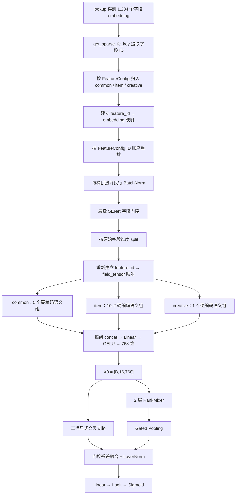

# Semantic RankMixer v3 方案简介

本文以当前项目中的实际代码和启动配置为准，对比以下两个版本：

- v2：[cvr_bn_rankmixer_v2.py](../src/models/rankmixer/cvr_bn_rankmixer_v2.py)
- v3：[cvr_bn_rankmixer_v3.py](../src/models/rankmixer/cvr_bn_rankmixer_v3.py)
- v3 完整启动脚本：[set-rankmixer-v3.txt](../bash/set-rankmixer-v3.txt)
- v3 参数提取脚本：[set-rankmixer-v3-args.txt](../bash/set-rankmixer-v3-args.txt)
- 三桶字段与语义清单：[rankmixer_v2_三桶数据特征清单.txt](../docs/数据特征清单/rankmixer_v2_三桶数据特征清单.txt)
- 字段语义来源：[USER_COM.txt](../docs/数据特征清单/USER_COM.txt)

当前运行配置使用 `data.cvr.cvr_fea_v10_base_cold`，输入为：

| 桶 | 字段数 | 每字段 embedding 维度 | 展平维度 | token 数 |
|---|---:|---:|---:|---:|
| common | 385 | 17 | 6,545 | 5 |
| item | 835 | 17 | 14,195 | 10 |
| creative | 14 | 17 | 238 | 1 |
| 合计 | 1,234 | 17 | 20,978 | 16 |

> 核心结论：v3 保留 v2 的 RankMixer 主体、SENet、Gated Pooling 和三桶显式交叉，只替换 token 的组织方式。v2 按桶内字段顺序做连续均分；v3 根据字段业务含义，把 1,234 个字段固定划分为 16 个可解释语义组，再将每个语义组投影为一个 token。

---

## 1. v3 相比 v2 的核心变化

| 对比项 | v2 | v3 |
|---|---|---|
| token 划分依据 | 桶内字段顺序和字段数量 | 字段 ID 对应的业务语义 |
| 分组方式 | 连续、均衡切分 | 16 组硬编码语义映射 |
| common 分组 | 5 组，每组 77 个字段 | 5 个不同含义的语义组，字段数为 `16/90/92/85/102` |
| item 分组 | 10 组，字段数为 `84×5 + 83×5` | 10 个不同含义的语义组，字段数为 `98/71/58/60/126/73/46/134/33/136` |
| creative 分组 | 1 组，14 个字段 | 1 个创意展示与促销表达组，14 个字段 |
| token 身份 | 依赖字段声明顺序和切分位置 | 由语义组名称和字段 ID 明确定义 |
| lookup 对齐 | 按 lookup 返回顺序收集 | 先建立 `feature_id → embedding` 映射，再按 ID 精确取回 |
| 配置约束 | `[5,10,1]` 可配置，也可以自动分配 | 由硬编码语义组确定为 `[5,10,1]`；外部配置必须与其一致 |
| 完整性检查 | 检查桶和 token 数量 | 额外检查缺失 ID、未知 ID、重复 ID、跨桶 ID 和重复组名 |
| 可解释性 | token 只表示一段连续字段 | 每个 token 对应明确业务主题 |

v3 中的“语义分割”不是通过 NLP 模型在线学习得到的，也不是运行时读取外部配置文件。它是根据 `USER_COM.txt` 中记录的字段名称和构造含义，人工确定字段所属主题，然后把字段 ID 列表直接写入 `_build_semantic_feature_groups()`。因此，同一份代码在每次建图时都会得到完全相同的分组。

---

## 2. v2 原有的字段分组方式

v2 已经解决了 v1 将单个 embedding 从中间切断的问题：它会先恢复完整字段，再在每个桶内部按字段顺序连续切分。

当前 `[5,10,1]` 配置下，v2 的分组为：

```text
common:   385 个字段 → [77,77,77,77,77]
item:     835 个字段 → [84,84,84,84,84,83,83,83,83,83]
creative:  14 个字段 → [14]
```

这种方式具有分组均衡、实现简单的优点，但它只看字段位置，不看字段含义。例如，同一个 v2 token 中可能同时出现价格、图像、统计和召回类字段；相邻且含义接近的字段也可能正好落在切分点两侧。

v3 没有改变 token 总数，而是把“第几个字段到第几个字段属于某个 token”改为“哪些明确的字段 ID 属于某个业务主题”。

---

## 3. v3 如何进行语义分割

### 3.1 分割依据

语义分组同时使用三类信息：

1. `FeatureConfig` 决定字段属于 `common`、`item` 还是 `creative` 桶；
2. `USER_COM.txt` 提供字段名称、构造方式和业务含义；
3. `_build_semantic_feature_groups()` 固定记录每个语义组包含的字段 ID。

第一层边界仍然是三桶，任何字段都不会因为语义接近而跨桶移动。例如，common 中的用户价格画像不会被放进 item 的价格组；它仍是 common 字段，只在 common 内选择最合适的语义组。

### 3.2 16 个固定语义组

每个语义组最终生成一个 token。下表中的“投影前维度”按照当前每字段 17 维计算。

| 全局 token | 桶 | 代码中的语义组名称 | 字段数 | 投影前维度 | 主要语义与代表字段 |
|---:|---|---|---:|---:|---|
| 0 | common | `common_profile_device` | 16 | 272 | 用户身份、城市、设备、年龄性别和基础环境，如 `user_id`、`city_level`、`user_phone_info` |
| 1 | common | `common_purchase_value` | 90 | 1,530 | 下单、购买、消费能力、价格价值和长期交易统计，如支付订单数、历史购买商品 |
| 2 | common | `common_interest_history` | 92 | 1,564 | 长期浏览、点击、收藏、类目和品牌兴趣历史，如 `top_action_cat` |
| 3 | common | `common_query_intent_retrieval` | 85 | 1,445 | 查询词、NER、检索意图、召回来源和查询上下文，如 `query_seg_add` |
| 4 | common | `common_realtime_session_funnel` | 102 | 1,734 | 当前会话、近期曝光、点击/未点击和短期漏斗，如 `page_el_sn_7d` |
| 5 | item | `item_static_identity_quality` | 98 | 1,666 | 商品、类目、店铺身份，静态属性和质量信息 |
| 6 | item | `item_text_relevance` | 71 | 1,207 | 标题、查询词、NER、文本匹配和相关性统计，如商品搜索词 CTR |
| 7 | item | `item_multimodal` | 58 | 986 | 图片、视频、向量及多模态相似性，如图像 cosine 相似度 |
| 8 | item | `item_price_offer` | 60 | 1,020 | 当前价格、优惠券、折扣和促销供给 |
| 9 | item | `item_price_preference` | 126 | 2,142 | 用户价格偏好、价格差、价格区间和价格排序，如购买力与价格交叉 |
| 10 | item | `item_global_statistics` | 73 | 1,241 | 商品、类目、店铺的全局曝光、点击、转化和质量统计 |
| 11 | item | `item_positive_preference` | 46 | 782 | 购买、下单、收藏等明确正向偏好，如收藏类目与当前商品交叉 |
| 12 | item | `item_exposure_engagement` | 134 | 2,278 | 曝光、浏览、点击、未点击、停留及互动行为 |
| 13 | item | `item_session_context` | 33 | 561 | 当前页面、会话位置、已展示候选和局部上下文 |
| 14 | item | `item_retrieval_graph` | 136 | 2,312 | i2i、u2i、召回、图关系和排序信号，如历史购买商品命中 i2i |
| 15 | creative | `creative_offer` | 14 | 238 | 创意展示、图片标识、优惠券和促销表达 |

分组后仍满足：

```text
5 个 common token + 10 个 item token + 1 个 creative token = 16 个 token
```

每个语义组内部字段数不再追求相等。例如 `item_session_context` 只有 33 个字段，而 `item_retrieval_graph` 有 136 个字段。这是有意设计：v3 优先保证同一 token 的业务含义集中，而不是保证投影前输入宽度完全相同。

### 3.3 从 lookup embedding 到语义 token 的完整过程

v3 没有直接依赖 lookup 返回列表的位置来判断字段身份，而是执行以下步骤。

#### 第一步：按字段 ID 建立 embedding 映射

模型遍历 lookup 使用的所有列，通过 `get_sparse_fc_key(column)` 得到字段 ID，并根据 `FeatureConfig` 判断它属于哪个桶：

```text
bucket_embedding_maps[bucket][feature_id] = sparse_embedding
```

如果同一字段 ID 被 lookup 两次，模型立即报错，避免后一个 tensor 静默覆盖前一个 tensor。

#### 第二步：按 FeatureConfig 顺序重排

模型分别取得：

```text
common_fea_map.keys()
item_fea_map.keys()
creative_fea_map.keys()
```

然后逐个 ID 从映射表中取回 embedding。这样可以保证后续 BN、SENet 和字段拆分使用的是稳定的 `FeatureConfig` 顺序，而不是依赖 lookup 实现是否改变了返回顺序。

#### 第三步：桶内归一化和字段门控

每桶 embedding 按稳定顺序拼接，执行与 v2 相同的 BatchNorm；当前启动参数还会启用层级 SENet，对字段做样本级重标定：

```text
common/item/creative embeddings
→ bucket BatchNorm
→ hierarchical SENet
```

#### 第四步：重新拆回独立字段并绑定 ID

经过 BN/SENet 后，模型按照每个原始 embedding 的静态维度执行 `tf.split`，重新获得完整字段 tensor，再构建：

```text
bucket_field_maps[bucket][feature_id] = field_tensor
```

因此，语义列表中的每个 ID 都能精确取到自己的 tensor，而不会因为字段顺序变化取错 embedding。

#### 第五步：按照硬编码语义列表取字段

`_semantic_tokenize()` 按固定顺序遍历：

```text
common 的 5 组 → item 的 10 组 → creative 的 1 组
```

对每个组，根据字段 ID 列表从 `bucket_field_maps` 中取出字段 tensor，并在最后一维拼接。

#### 第六步：每组独立投影为 768 维 token

每个语义组拥有独立的全连接投影：

```text
semantic_group_fields
→ concat
→ Linear(input_dim, 768)
→ GELU
→ semantic token
```

16 个投影结果按顺序堆叠为：

```text
X0 = [B, 16, 768]
```

投影变量作用域直接使用语义组名称，例如：

```text
rm_semantic_tokenize/common_profile_device/projection
rm_semantic_tokenize/item_multimodal/projection
rm_semantic_tokenize/creative_offer/projection
```

这使 checkpoint 和日志中的 token 身份也具有可读语义。

### 3.4 流程图



### 3.5 建图时的语义映射校验

硬编码映射最大的风险是字段版本变化后列表过期。v3 因此在建图前执行严格校验：

1. `common`、`item`、`creative` 都必须拥有非空语义组；
2. 同一桶内语义组名称不能重复；
3. 任一语义组不能为空；
4. 单个语义组内部不能出现重复字段 ID；
5. 同一桶的字段不能被多个语义组重复使用；
6. 语义列表必须完整覆盖当前 `FeatureConfig` 中该桶的全部字段；
7. 语义列表不能包含当前 `FeatureConfig` 不存在的未知字段；
8. 同一个字段 ID 不能跨桶出现；
9. 外部传入的 `rm_bucket_token_counts` 必须等于硬编码分组数 `[5,10,1]`；
10. 16 个语义组总数必须等于 `rm_token_num=16`。

因此，当前三桶数据不会报错；只有特征版本发生增删、字段分桶变化或映射被错误修改时，模型才会明确报告 `missing`、`unknown` 或 `duplicated` 字段，避免在错误语义下继续训练。

### 3.6 伪代码

```python
semantic_groups = {
    "common": [common_group_0, ..., common_group_4],
    "item": [item_group_0, ..., item_group_9],
    "creative": [creative_group_0],
}

validate_exact_coverage(semantic_groups, FeatureConfig)

lookup_embeddings = flood_lookup_psv2(features)

embedding_by_id = {"common": {}, "item": {}, "creative": {}}
for column, embedding in zip(lookup_columns, lookup_embeddings):
    feature_id = get_sparse_fc_key(column)
    bucket = find_bucket_in_feature_config(feature_id)
    embedding_by_id[bucket][feature_id] = embedding

for bucket in ["common", "item", "creative"]:
    ordered_ids = list(FeatureConfig[bucket].keys())
    ordered_embeddings = [embedding_by_id[bucket][fid] for fid in ordered_ids]
    normalized = batch_norm(concat(ordered_embeddings))
    gated = hierarchical_senet(normalized)
    field_tensors = split_by_original_embedding_dims(gated)
    field_by_id[bucket] = dict(zip(ordered_ids, field_tensors))

tokens = []
for bucket in ["common", "item", "creative"]:
    for group_name, feature_ids in semantic_groups[bucket]:
        group_fields = [field_by_id[bucket][fid] for fid in feature_ids]
        token = GELU(linear(concat(group_fields), output_dim=768))
        tokens.append(token)

X0 = stack(tokens, axis=1)  # [B, 16, 768]
```

---

## 4. v3 与 v2 保持相同的部分

除语义分组和字段 ID 对齐外，v3 主要沿用 v2：

- 输入仍只使用 `common/item/creative` 三桶；当前 cold 特征版本的其他桶为空；
- 每桶仍执行 BatchNorm，并可启用层级 SENet；
- token 投影仍默认使用 `gelu_2`；
- RankMixer 仍采用 `T=16、H=16、D=768、L=2、k=2`；
- Multi-Head Token Mixing 仍是无参数 reshape/transpose mixing；
- 每层仍是两次残差 Add&Norm；
- Per-token FFN 仍使用 token-major batched matmul；
- token 汇聚仍使用零初始化 Gated Pooling；
- 仍计算 `common×item`、`common×creative`、`item×creative` 三组显式乘性交叉；
- 交叉支路仍通过小门控残差与主 context 融合，再执行 LayerNorm；
- 输出层继续使用 `rm_out_v2` scope，以兼容当前 `skip_tensors/warm_up_tensors` 配置；
- 数据读取、训练生命周期、优化器、AUC、checkpoint 和热启动学习率处理均保持项目原有写法。

---

## 5. 语义分割带来的影响

### 5.1 主要优点

1. **token 语义更集中**：价格字段主要在价格 token 中交互，图像向量主要在多模态 token 中交互，减少无关字段在投影前过早混合。
2. **token 身份稳定**：只要字段 ID 映射不变，字段声明顺序或 lookup 返回顺序变化不会改变 token 含义。
3. **可解释性更强**：可以按语义组观察参数、梯度、消融结果和异常，而不再只能解释“第 7 段字段”。
4. **creative 保持独立**：14 个 creative 字段仍形成一个完整 token，不会混入 item。
5. **错误更容易暴露**：字段缺失、重复、跨桶或新增未映射字段会在建图时直接被发现。

### 5.2 参数量和计算量

v3 没有增加新的网络分支。所有字段仍然只进入一个 token 投影，因此 token 投影权重总量仍为：

```text
20,978 × 768 = 16,111,104
```

16 个投影的总 bias 数也仍为 `16 × 768`。其余 RankMixer、Pooling、Cross 和输出层与 v2 相同，所以在相同启动参数下，v3 的理论参数量和主要矩阵乘 FLOPs 与 v2 基本一致。改变的是各投影矩阵的宽度分布和字段组合，不是通过堆叠更多参数实现语义分割。

### 5.3 训练与 checkpoint

v3 的语义投影 scope 名称和每个投影的输入宽度都与 v2 不同，因此 v2 的 token 投影权重不能直接作为 v3 的同构 dense 权重恢复。

建议使用方式与当前配套脚本一致：

```text
第一次训练 v3：从 base checkpoint 冷启动，ignore_dense_checkpoint=True
后续每日训练：从前一天的 v3 checkpoint 热启动，ignore_dense_checkpoint=False
```

冷启动会重新学习 v3 的 dense 塔；一旦形成第一个 v3 checkpoint，后续 v3 → v3 热启动的变量名称和形状保持稳定。

### 5.4 维护成本

硬编码语义映射意味着它与当前特征版本绑定。如果未来 `FeatureConfig` 增加、删除或移动字段，需要同步更新 `_build_semantic_feature_groups()`。这是 v3 用人工可解释性和稳定语义换来的维护成本，严格校验可以确保遗漏不会被静默带入训练。

---

## 6. 简要总结

v2 的核心是“完整字段、按桶均衡分组”；v3 的核心是“完整字段、按 ID 对齐、按业务语义固定分组”。

v3 不改变 RankMixer 主体，也不依赖增加参数量，而是改变进入 16 个 token 之前的字段组织方式：

```text
v2：字段顺序 → 连续均分 → 16 token
v3：字段 ID → 业务语义映射 → 16 个可解释 token
```

因此，v3 最主要的实验目标是验证：在参数量和主干结构基本不变的条件下，更纯净、更稳定的 token 语义能否提升模型对用户、查询、商品、价格、多模态、召回和创意信号的建模效果。
