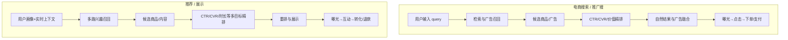
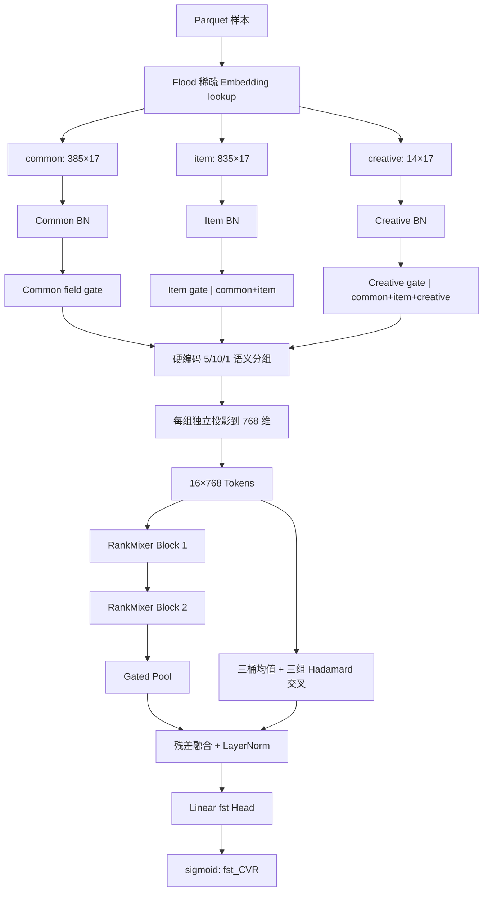
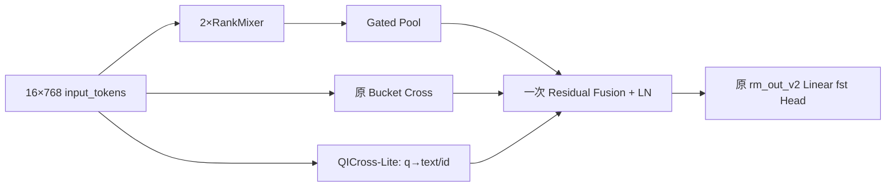
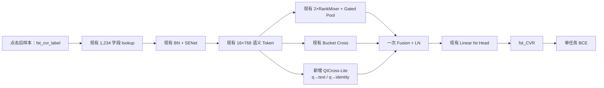

# RankMixer v3 搜索 CVR：与推荐/展示 CVR 的业务差异及 `fst_AUC` 提升设计

> 目标模型：[cvr_bn_rankmixer_v3.py](../src/models/rankmixer/cvr_bn_rankmixer_v3.py)  
> v3 实际启动脚本：[set-rankmixer-v3.txt](../bash/set-rankmixer-v3.txt)  
> 当前特征配置：[cvr_fea_v10_base_cold.py](../src/data/cvr/cvr_fea_v10_base_cold.py)  
> 三桶特征清单：[rankmixer_v2_三桶数据特征清单.txt](../docs/数据特征清单/rankmixer_v2_三桶数据特征清单.txt)  
> 对比模型：[recommend_cvr.py](../src/models/reference/recommend_cvr.py) 与 [mlp_mixer_swiglu_fuse.py](../src/models/reference/mlp_mixer_swiglu_fuse.py)  
> 相关基础说明：[Semantic RankMixer v3 方案简介](rankmixer_v3_introduction.md) 与 [Reference CVR 完整拆解](reference_cvr_algorithm_detailed_introduction.md)

本文面向推广搜部门的新同学，回答四个问题：

1. 当前 RankMixer v3 和 reference 模型分别服务什么业务；
2. 两边都从同一家公司的向量/特征存储取数据，为什么仍不能直接共用模型；
3. `cvr_bn_rankmixer_v3.py` 当前到底学了什么、哪里可能限制 `fst_CVR` 预测；
4. 应按什么顺序修改数据、标签、训练和网络，才有较大概率稳定提高验证集 `fst_AUC`。

阅读边界：当前工作区没有生产样本、标签 SQL、平台展开后的完整任务配置、v3 训练日志和线上延迟数据，也没有生产 Flood/Cayman 运行时。reference 导入的部分模块来自部署包路径，本地同名副本未必与线上版本完全一致。因此，本文会区分“源码可确定事实”“高可信业务推断”和“必须通过实验验证的方案”。

### 已确认的本轮业务决策

以下业务约束已经由业务方确认，优先级高于本文后续仍保留的通用候选建议：

1. **样本空间固定为点击后 CVR**。本轮模型学习的是
   $P(Y_{fst}=1\mid click=1,u,q,i,c)$，不尝试 ESMM，也不扩展到曝光空间联合建模；
2. **保持纯单任务 `fst_cvr`**。训练只使用 `fst_cvr_label` 的 BCE，不增加 last、delay、行为辅助头，也不增加 pairwise/listwise 排序损失；
3. **本轮唯一新增的建模模块是定向 Query–Item Cross**。不同时修改 Token 数、语义分组、SENet、RankMixer 层数、池化和输出头；
4. **`search_id` 只用于请求内离线评价**，不进入特征、Embedding、Cross 或 loss。它是请求标识，不是可泛化的业务信号；
5. 当前 1,234 个字段、17 维稀疏 Embedding、16×768 Token 和两层 RankMixer 主干全部保持不变。

因此，本轮候选版本统一命名为 **RankMixer v4**。后文关于多任务、序列、DCNM、任务 Head 等内容只保留为背景分析，不属于 v4 的提交范围。

---

## 0. 结论先行

### 0.1 两种业务的本质区别

当前 v3 是**电商搜索/推广搜索候选排序中的首次转化率预估模型**。它回答的问题近似是：

> 在用户发起当前搜索请求、并点击候选商品或广告的条件下，这个候选发生 `fst` 口径转化的概率是多少？

reference 则更像**推荐/展示流量中的候选商品多目标 CVR 精排模型**。它回答的问题近似是：

> 在弱显式意图或没有 query 的展示场景下，这个用户看到当前候选后，会不会在不同归因和退款口径下转化？

两边都属于“候选排序”，都可以使用用户、商品、上下文和行为特征；但搜索侧的最强条件通常是**当前 query 以及 query-item 匹配**，推荐侧的最强条件通常是**用户当前/长期兴趣以及候选相关行为序列**。

### 0.2 同一个向量数据库不等于同一个学习任务

即使两边从同一套特征平台、向量库或参数服务器取数，也只说明底层基础设施可共享，并不意味着以下内容相同：

- 曝光样本来自什么页面和排序策略；
- 候选集合如何产生；
- 正负样本如何定义和采样；
- `fst`、`lst`、退款过滤等标签的归因窗口；
- query 是否存在、是否是强意图；
- 哪些字段在训练时可见、线上是否能实时取到；
- 预测值最终与 CTR、出价、价格或 GMV 如何组合。

数学上，两边学习的是不同条件分布：

$$
P_{search}(Y_{fst}=1\mid click=1,u,q,i,a,c)
\neq
P_{display}(Y=1\mid u,i,a,c,h),
$$

其中 $u$ 是用户，$q$ 是 query，$i$ 是候选商品，$a$ 是广告/创意，$c$ 是上下文，$h$ 是历史行为。底层字段可能来自同一库，但样本分布和条件集合不同。

### 0.3 当前 v3 的优点与主要短板

当前 v3 已经解决了 v1 中最明显的字段切割问题：1,234 个稀疏字段保持完整，按业务语义组成 16 个 Token；它还包含分桶 BN、分层 SENet、两层 RankMixer、可学习池化和桶间交叉。按当前配置，固定稠密参数约 **95.81M**，不算稀疏 lookup 的单样本固定前向量约 **192.55M FLOPs**。

但从源码看，影响 `fst_AUC` 的高价值问题更可能是：

1. **请求内评价协议尚未落地**：`search_id` 已被保留，但当前源码只计算全局 AUC/COPC；
2. **搜索特有的 query-item 交互仍较粗**：query 相关信号被压进大组，桶交叉又先对整个桶求均值；
3. **点击样本空间中的有效请求覆盖率未知**：很多 `search_id` 可能只有一个点击商品，或组内标签全相同，无法计算请求内 AUC；
4. **若干大组包含 102～136 个字段，却各压成一个 Token**，组内信息可能被过早汇总；
5. **L2、梯度裁剪和多个配置项在当前文件中没有真正进入优化路径**；
6. **当前 cold 配置明确删除 sequence、DIN、dense 和 gattr**，但这些能力不在本轮单任务 QICross 的修改范围内。

“只训练一个 `fst_cvr_label`”在本轮是明确的产品约束，不再视为模型缺陷。是否使用 delay 标签修正样本成熟度仍可作为数据审计问题，但不能通过新增辅助任务解决。

### 0.4 推荐优先级

本轮实际执行顺序收敛为：

```text
P0  固化点击后 fst 标签、时间切分和真实 v3 入口
 ↓
P0  导出 search_id/example_id/label/pred，建立请求内评价基线
 ↓
P1  只增加 q→item_text 定向 Cross
 ↓
P1  单独验证 q→item_identity，再验证二者组合
 ↓
P1  比较“保留 Bucket Cross”与“由 QICross 替代 Bucket Cross”
 ↓
P2  胜出结构做第二时间窗/第二 seed 复验和线上延迟评估
```

本轮不把 Projection LN、任务 Head、重新分组、多任务、pairwise loss 或序列与 QICross 同时提交，避免无法归因增益。

任何一项都只能被称为“有机制依据的候选方案”，不能在真实训练前宣称一定提高 AUC。仓库中没有 v3 的训练日志和最终 `fst_AUC`，所以本文不会虚构 v3 基准或预计增益。

---

## 1. 先理解 `fst_CVR`、损失和 AUC

### 1.1 当前模型实际预测什么

`parse_examples` 只取出 `fst_cvr_label`，`model_fn` 输出一个 sigmoid 概率：

$$
\hat p=\sigma(z).
$$

本轮已确认样本空间是点击后样本，因此模型的统计目标应写为：

$$
\hat p_{fst}=P(Y_{fst}=1\mid click=1,u,q,i,a,c).
$$

这不是曝光后联合转化率 $P(click=1,Y_{fst}=1\mid exposure)$，也不是点击率。若排序公式同时使用 pCTR，典型组合关系是由 pCTR 负责“是否点击”，本模型负责“点击后是否发生 fst 转化”；具体线上公式仍以业务配置为准。

源码能够确认输出是 `fst_cvr_label` 的二分类概率；但源码中没有标签生产 SQL，因此以下内容仍必须向数据同学确认：

- `fst` 是否严格表示 first-touch attribution；
- 转化事件是下单、支付还是其他行为；
- 归因窗口是几小时、几天；
- 退款订单是否仍算正样本；
- 尚未等到归因窗口结束的样本如何处理。

因此当前最严谨的描述是：

> v3 在点击样本空间预测上游数据产出的 `fst_cvr_label`；模型代码本身不定义“首次转化”的事件和归因窗口。

### 1.2 当前训练目标

当前损失是二元交叉熵：

$$
\mathcal L_{BCE}
=-\frac{1}{N}\sum_{n=1}^{N}
\left[y_n\log \hat p_n+(1-y_n)\log(1-\hat p_n)\right].
$$

它鼓励概率接近真实标签，同时兼顾概率校准。代码没有直接优化 AUC；AUC 是由预测排序结果计算出的评估指标。

### 1.3 AUC 在这里表示什么

ROC-AUC 可以理解为：随机抽一个正样本和一个负样本，模型把正样本打得更高的概率：

$$
\mathrm{AUC}=P(s(x^+)>s(x^-)).
$$

这与普通“分类准确率”不同。转化样本很稀疏时，把所有样本都预测为 0 也可能得到很高 accuracy，却没有排序价值。因此本文所说“提高预测准确率”主要指同时改善：

- `fst_AUC`：正负候选区分能力；
- Logloss：概率质量；
- PR-AUC：稀疏正样本下的识别能力；
- COPC、分桶误差或 ECE：校准；
- 搜索请求内 GAUC/Pairwise AUC：同一个 query 请求内的候选排序能力。

只优化全局 AUC 可能让高频样本主导结果。本轮不增加 pairwise 训练损失，但会把同一 `search_id` 内正负点击商品组成的 pair 作为**评价单位**，同时监控全局概率质量和请求内排序。

需要特别区分：点击样本空间上的 SearchGAUC 只衡量“同一请求中多个已点击商品之间”的转化排序。它看不到未点击候选，不能代表完整曝光候选列表的排序效果。有效请求覆盖率必须与指标一起报告。

---

## 2. 搜索 CVR 与推荐/展示 CVR 的逐项业务对比

### 2.1 两条典型漏斗



两边都有召回、粗排、精排和反馈回流，但当前意图来源不同。搜索中，用户刚输入的 query 是强约束；推荐中，模型通常要从画像、上下文和历史行为推断“此刻想看什么”。

### 2.2 详细对比表

| 维度 | 当前推广搜 RankMixer v3 | reference 推荐/展示 CVR | 对建模的影响 |
|---|---|---|---|
| 当前意图 | query、检索词、召回上下文很强 | 画像、近期兴趣、上下文更强 | 搜索应优先建模 query-item 匹配 |
| 样本粒度 | 已确认是点击样本，以 `search_id × clicked candidate` 组织 | 更像 `user/request × displayed candidate` | 只有多点击且标签有正有负的搜索请求可计算请求内 AUC |
| 候选来源 | 搜索/广告召回、文本与图关系、排序上下文 | 推荐 recall type、trigger、多路兴趣召回 | 负样本难度和分布不同 |
| 主要目标 | 一个 `fst_cvr_label` | fst/lst × all/nrfnd 四个主目标 | reference 的标签头不能原样照搬 |
| 辅助目标 | 当前 v3 未使用 | 相似点击、收藏，可选停留/多行为 | 搜索侧可借鉴“共享表示”，但任务应重选 |
| 静态特征 | common/item/creative 1,234 个稀疏字段 | user/item/creative/coupon 等另一套字段 | 同库字段可复用，字段组合仍属业务协议 |
| query 特征 | 明确有 query/检索语义组 | 没有典型 query 主塔证据 | 搜索应给 query 独立容量和交互路径 |
| 行为序列 | cold 配置全部清空 | 四路行为序列、通用序列、DIN | 当前 v3 难表达瞬时兴趣变化 |
| Token | 5 common + 10 item + 1 creative，共 16×768 | 11 user + 18 item + 2 seq + 1 DIN，共 32×512 | Token 数来自各自字段和预算，不应复制 |
| Mixer | 2 层固定 Mix + per-token GELU FFN，扩张 2 | 3 层固定 Mix + per-token SwiGLU，扩张 4 | reference 更大，但大不等于适合搜索 |
| Pool 后结构 | gated pool + bucket cross + 单线性头 | mean pool + creative/coupon + Dense256 + 多头 | v3 的主任务读出较轻 |
| 在线复用 | 用户静态部分可复用；query 每请求变化 | user graph 与 rank graph 可拆 | 搜索不能把 query 依赖部分预计算成纯 user graph |
| 主要偏差 | 位置偏差、query 头尾、广告竞价/混排、点击选择 | 展示策略偏差、兴趣漂移、召回偏差 | 切片、校准和反偏方案不同 |
| 下游使用 | 可能与 pCTR、出价、商品价值等组合 | 可能与 CTR、时长、GMV、多样性等组合 | AUC 之外还必须保证概率和分桶稳定 |

### 2.3 为什么 reference 不是传统搜索模型

本地证据包括：

- 类名为 `DisplayCvrFstLst`，文件名为 `recommend_cvr.py`；
- 主干依赖四路历史行为和候选相关 DIN；
- user/rank 分图导出适合一个用户对许多候选复用；
- 没有看到以当前 query 文本编码和 query-document relevance 为中心的主目标；
- 多个目标强调不同转化归因、退款口径和互动行为。

因此最稳妥的叫法是“推荐/展示侧 CVR”，而不是断言它服务某一个具体页面。代码不足以判断它是否也覆盖某些广告展示流量。

### 2.4 同一向量库里，什么可以共享

可以在经过 schema 核验后共享：

- 相同 namespace、相同 hash 规则的 user/item/category/shop 等稀疏 Embedding；
- 用户长期画像、商品静态属性、价格和历史统计等通用字段；
- 特征获取、PS 分片、稀疏优化器、checkpoint 管理等基础设施；
- 某些与业务入口无关的预训练文本或图像向量；
- 通用的 BN、门控、Token 化和多任务训练方法。

不能默认共享：

- 整个 dense tower checkpoint；
- 不同部门手写的字段组和 Token 顺序；
- 推荐侧的 fst/lst/nrfnd 标签口径；
- BN moving statistics 和最终 calibration；
- 推荐 user graph 的拆分边界；
- reference 的 32 Token、512 维、3 层和 SwiGLU 超参数结论。

即使两个字段 ID 相同，也要确认它们的取值时点、hash 空间、缺失值、multi-value pooling 和 embedding_size 完全一致，再决定是否 warm start。

---

## 3. 当前 RankMixer v3 的完整数据和前向流程

### 3.1 先辨认正确的 v3 启动入口

用户早期使用的 [scripts/set-x-rank_v1.txt](../scripts/set-x-rank_v1.txt) 在模型入口处指向旧 v1，且 v1 参数是 `rm_ffn_expand=4`、`use_senet=false`。它不能代表 v3 的实际训练配置。

当前仓库中与目标文件一致的入口是 [bash/set-rankmixer-v3.txt](../bash/set-rankmixer-v3.txt)，其中明确设置：

```text
models.rankmixer.cvr_bn_rankmixer_v3.MLPModel
feature_version=data.cvr.cvr_fea_v10_base_cold
use_senet=true
use_senet_bn=true
T=16, H=16, D=768, L=2, expansion=2
gated_pool=true
bucket_cross=true
optimizer=flood_adam
dense learning_rate=2e-5
sparse learning_rate=0.05
batch_size=2048
```

脚本首次以 `change_fea='cold'` 启动：稠密塔随机初始化，稀疏 embedding 从旧 checkpoint 热启。后续若从 v3 前一天 checkpoint 继续训练，必须同步修改 `change_fea`、checkpoint 路径和跳过变量范围，不能把 cold 与 warm 结果混报。

### 3.2 当前真正可用的特征

`cvr_fea_v10_base_cold.py` 继承完整 v10 配置，但主动清空：

- `dense_fea_map`；
- `seq_fea_map`；
- `gattr_fea_map`；
- `din_fea_map`。

v3 初始化时还会拒绝非空的 coupon/dense/sequence/gattr/din 桶。因此当前主干只接受：

| 桶 | 字段数 | 默认 Embedding 维度 | 展平宽度 | 占全部字段 |
|---|---:|---:|---:|---:|
| common | 385 | 17 | 6,545 | 31.20% |
| item | 835 | 17 | 14,195 | 67.67% |
| creative | 14 | 17 | 238 | 1.13% |
| 合计 | 1,234 | 17 | 20,978 | 100% |

这里的 item 不是“纯商品静态属性”。它同时包含候选身份、用户—候选偏好、query—候选相关性、价格、统计、曝光互动、会话位置、召回和图关系。因此搜索模型的真实关系更接近：

```text
用户/请求状态
 × 当前 query 与召回条件
 × 候选商品/广告
 × 已构造的相关性和亲和交叉
 × 价格、统计和素材表达
```

### 3.3 16 个语义 Token

v3 硬编码的组如下：

| 桶 | Token | 字段数 | 输入宽度 |
|---|---|---:|---:|
| common | profile/device | 16 | 272 |
| common | purchase/value | 90 | 1,530 |
| common | interest/history | 92 | 1,564 |
| common | query/intent/retrieval | 85 | 1,445 |
| common | realtime/session/funnel | 102 | 1,734 |
| item | static/identity/quality | 98 | 1,666 |
| item | text/relevance | 71 | 1,207 |
| item | multimodal | 58 | 986 |
| item | price/offer | 60 | 1,020 |
| item | price/preference | 126 | 2,142 |
| item | global/statistics | 73 | 1,241 |
| item | positive/preference | 46 | 782 |
| item | exposure/engagement | 134 | 2,278 |
| item | session/context | 33 | 561 |
| item | retrieval/graph | 136 | 2,312 |
| creative | offer | 14 | 238 |

构造阶段有严格校验：字段必须在正确桶中恰好出现一次，不能缺失、重复或跨桶。这是 v3 比任意等宽裸切片更可靠的地方。

### 3.4 一条样本经过模型的全过程



### 3.5 分桶 BN 与分层 SENet

启动脚本开启 `use_senet=true` 和 `use_senet_bn=true`。SENet 先把每个 17 维字段求均值，再计算字段级 gate：

$$
g=2\sigma(W_2\tanh(W_1s)).
$$

条件关系为：

- common gate 只看 common；
- item gate 看 common + item；
- creative gate 看 common + item + creative。

这符合“当前用户/query 决定哪些候选字段更可靠”的直觉。它是字段级选择，不是对每个 embedding 维分别加权。

需要注意，当前六个 SENet 权重矩阵都是 Glorot 随机初始化。虽然 `2×sigmoid` 的平均量级接近 1，但训练开始时并不是严格恒等映射。

### 3.6 语义投影

每个组拼接后独立映射为 768 维：

$$
t_g=\operatorname{GELU}(x_gW_g+b_g).
$$

当前实际参数 `rm_proj_ln=false`，因此组投影后不做独立 LayerNorm。初始化使用 $1/\sqrt{d_{in}}$，能够部分平衡输入宽度；但字段相关性、稀疏度和 SENet gate 仍可能使不同 Token 的输出尺度不一致。

### 3.7 RankMixer Block

Token Mixing 不含可学习参数。它把 `[B,T,H,D/H]` 的中间两维交换，再恢复 `[B,T,D]`。当前 $T=H=16,D=768$，所以每个新 Token 都从全部旧 Token 获得一部分通道。

每个 Block 为 post-norm：

$$
S_l=\mathrm{LN}(X_l+\mathrm{FixedMix}(X_l)),
$$

$$
X_{l+1}=\mathrm{LN}(S_l+\mathrm{PFFN}(S_l)).
$$

PFFN 对 16 个 Token 分别使用独立参数，结构为：

```text
768 → 1536 → 768，激活为 GELU
```

两层 PFFN 贡献约 75.57M 权重，是主塔参数量最大的部分。

### 3.8 Gated Pool 与 Bucket Cross

Gated Pool 为每个 Token 计算一个 softmax 权重。打分权重全零初始化，所以初始行为严格等于 mean pooling，之后可按样本学习不同 Token 权重。

Bucket Cross 先对 5 个 common Token、10 个 item Token 和 1 个 creative Token分别求均值，形成 $c,i,a$，再拼接：

$$
[c,i,a,c\odot i,c\odot a,i\odot a],
$$

映射回 768 维，并乘一个全局标量 gate：

$$
\sigma(-2)\approx0.1192.
$$

这个残差提供了桶级显式乘性交互，但它把整个 common 和 item 桶先平均，无法精准区分 query×标题、query×价格、用户购买力×价格等关系；而且 gate 对所有样本共享。

### 3.9 输出、损失、训练和评估

当前输出只有：

```text
context[768] → Linear(1) → clip[-50,50] → sigmoid
```

训练只用 `fst_cvr_label` 的 BCE。脚本使用 FloodAdam，dense LR 为 `2e-5`，sparse LR 为 `0.05`；稠密塔首次 cold，稀疏表 warm start。

代码内评估包含：

- 2,000 阈值的近似 ROC-AUC；
- PR-AUC；
- COPC；
- bucket error；
- sample count。

`search_id` 已在 `parse_examples` 中单独保留，`test()` 在开启 `save_predict_result` 后也会写出
`search_id / example_id / label / pred`。但当前源码没有按 `search_id` 聚合指标，v3 脚本还设置了
`save_predict_result=false`。脚本虽然设置 `enable_gauc=True`，外部 validator 究竟按 user、query 还是
`search_id` 分组无法由本地源码证明，因此 v4 必须建立独立、可复现的离线请求评价器。

---

## 4. Reference 模型做了什么，以及哪些能力值得迁移

### 4.1 reference 主路径摘要

reference 的主塔可以概括为：

```text
user/item/creative/coupon 稀疏特征
 + 四路行为序列
 + 候选相关 Top-K sequence
 + DIN-style 候选兴趣
 → 条件 SENet
 → 11 user + 18 item + 2 sequence + 1 DIN = 32 Tokens
 → 32×512，3 层 fixed mix + per-token SwiGLU
 → Mean Pool + Creative/Coupon + Dense256
 → fst/lst × all/nrfnd 四个主头
 → Flatten Wide MLP → 三个辅助行为头
```

它比 v3 更复杂的主要原因不是“推荐一定要更大”，而是：

- 标签更多；
- 行为序列和候选相关兴趣更丰富；
- 主/辅任务读出不同；
- 需要分阶段训练和 user/rank 分图上线；
- 目标模型本身约有数亿级 Mixer 权重。

### 4.2 最值得迁移的设计思想

| reference 思想 | 对搜索 v3 的合理迁移 | 不应照搬的部分 |
|---|---|---|
| 稳定语义 Token | 保留字段完整性，按 query/user/item/price/context 重构组 | 直接复制 11+18 组字段 ID |
| 候选条件门控 | 用 user+query 条件选择 item/creative 字段 | 直接复用推荐 gate checkpoint |
| 候选相关序列 | 用 query+item 从搜索行为历史中选择相关行为 | 只用 item 相似度，忽略当前 query |
| 多任务共享表示 | 加入经过验证的 last/delay/行为辅助头 | 复制 fst/lst/nrfnd 的业务权重 |
| Pool 后任务层 | 在 768 context 后加轻量 Dense256 | 复制整个四层 wide MLP |
| 稳定残差初始化 | 新分支从零或近恒等开始 | 直接把主干改成 3 层 k=4 |
| 分图导出 | 预计算纯用户静态部分，query/candidate 在线计算 | 把 query 依赖表示放入 user graph |

### 4.3 为什么不应先复制 SwiGLU 和更大模型

reference 的 per-token SwiGLU、32 Token、3 层、扩张 4 带来很大的参数量。当前 v3 已有约 95.81M 固定 dense 参数，且第一次训练是 dense cold。若 AUC 瓶颈来自标签延迟、query 交互过粗或评估泄漏，继续扩参只会增加成本并掩盖根因。

[RankMixer 原论文](https://arxiv.org/abs/2507.15551)支持的是“稳定 feature cluster、固定高效 Token Mixing 和 per-token FFN 适合工业扩展”的机制，并不证明任意业务把 Token、层数或参数翻倍都会提升 AUC。

---

## 5. 当前源码中的问题与风险审计

下面把问题分为“确定性代码事实”和“需要生产环境确认的风险”。

### 5.1 P0：必须先处理或核查

| 项目 | 源码证据 | 当前影响判断 | 建议 |
|---|---|---|---|
| v1/v3 入口混淆 | 旧脚本指向 v1；v3 脚本才指向目标文件 | 用错入口会使所有实验结论失效 | 平台任务保存最终展开后的 model class、commit、args |
| 时间区间可能重叠 | v3 脚本对 `02:07` 生成 `test_date=03:08` | 若平台一次性训练全区间再测全 test，会发生 train/test 日期重叠；若逐日滚动则可能合理 | 以实际展开文件清单确认；最终 held-out 必须晚于最大训练时点 |
| `create_click_prob` 键写错 | `get_features_conf` 把 click 值写入 `create_nonclk_prob` | 确定性 bug；当前 cold 配置没有逐字段该覆盖，且全局正负值都为 0.003，故很可能暂时休眠 | 改为 `stats_param["create_click_prob"]`，并做展开配置 diff |
| L2 是否生效不明确 | Dense 层传了 regularizer，但 `self.loss` 未显式加 `REGULARIZATION_LOSSES` | 本文件看不到 L2 进入优化；外部框架可能注入 | 先打印 collection 和总 loss 组成，避免重复添加 |
| 梯度裁剪未生效 | 注册 `grad_clip_value=15`，apply 前没有 clip | 95.8M dense cold 时可能有梯度尖峰 | 记录 dense global norm；只在确有尖峰时做 dense scope clipping |
| 标签有效性未校验 | loss 直接假设 label 为 0/1 | 默认值、未成熟或无效标签若混入会污染训练 | 上游统计 label 值域、缺失率和成熟度；必要时 mask |
| AUC 精度 | 模型用 2,000 thresholds 近似 | 小幅实验差异可能受分桶近似影响 | 保存同一验证集预测，离线计算 exact AUC 和 paired CI |

### 5.2 P1：高价值建模瓶颈

| 项目 | 当前实现 | 可能的限制 |
|---|---|---|
| 单目标 | 只取 `fst_cvr_label` | 本轮有意保持纯单任务，不视为待修复问题 |
| 延迟反馈 | v3 不使用 `delay_2d_fst_cvr_label` | 只做标签成熟度审计，不增加 delay 辅助头 |
| 过粗 query 交互 | query 85 字段为单 Token；bucket cross 对整桶均值 | query×标题/类目/价格关系可能被稀释 |
| 大组压缩 | 最大组 136 字段压成 1×768 | 组内多个子语义共享一个投影和一个 Token 身份 |
| 投影未归一化 | `rm_proj_ln=false` | 不同覆盖率和输入宽度的 Token 尺度可能不一致 |
| SENet 非恒等起步 | output 权重随机 | cold dense 初期先随机扰动所有字段，再学习主干 |
| 任务 Head 太轻 | pool 后直接 Linear(1) | 共享 context 缺少 fst 专用非线性组合 |
| Bucket gate 粗 | 只有一个全局标量 | 不同 query/用户无法决定何时需要 cross residual |
| 无序列 | cold 配置和 v3 校验共同禁止 seq/DIN | 难捕获“刚刚在搜什么、看什么、买什么” |

### 5.3 P2：工程一致性问题

以下参数存在，但在当前主路径中不起控制作用：

- `use_rankmixer`：无论真假都进入 RankMixer；
- `batch_norm`：三桶 BN 无条件执行；
- `dropout`：主路径没有使用；
- `dense_scale`、`dense_global_norm`、`dense_clip_threshold`：优化器未读取；
- `grad_clip_value`：优化器未读取。

这不一定直接降低 AUC，但会让实验参数与实际图不一致。应把无效参数删除、接入实现，或在初始化时显式报错，避免“以为只改了一个变量，实际什么也没变”。

---

## 6. 数据与标签审计背景：本轮固定任务口径

结构升级之前，标签和样本质量通常是 CVR 增益最大的来源。本节除 6.1 的已确认口径外均作为数据审计
背景；v4 不改变标签、样本权重或负例构造。

### 6.1 固化样本空间：到底预测曝光后 CVR 还是点击后 CVR

本轮已经确认：训练与离线验证都限定在**点击后样本空间**，主目标是：

$$
P(Y_{fst}=1\mid click=1,u,q,i,c).
$$

因此本轮明确不实施 ESMM，不把未点击候选补为 CVR 负例，也不增加 CTR 子任务。为了保证不同实验可比，必须固化：

```text
样本过滤条件 = click == 1
标签            = fst_cvr_label
负例            = 已点击但未发生 fst 转化
主损失          = 单任务 BCE
请求评价分组    = sample_date + search_id
```

仍需记录线上模型在哪个阶段调用。如果 pCVR 被用于曝光前排序，这是一个已知的点击选择偏差边界，但不在 v4 的解决范围内，不能在本轮实验中悄悄改变样本定义。

### 6.2 审计延迟转化

仓库已经存在 `delay_2d_fst_cvr_label`，旧 base 也保留 delay train 分支，v3 warm-start checkpoint 名中还出现 `fst_delay_v1`。这是比“换激活函数”更强的本地信号：团队历史上显然关注过延迟转化。

推荐先做四张表：

1. 按曝光/点击后经过时长统计累计转化比例；
2. 按 query 频次、类目、价格带统计转化延迟分布；
3. 比较当日临时标签与 2 日/7 日成熟标签的翻转率；
4. 在同一预测上分别计算 early-label AUC 与 mature-label AUC。

候选方案按复杂度排序：

1. **成熟窗口训练/评估**：训练只使用已走完归因窗口的旧样本，先建立无偏基准；
2. **双头方案**：共享 v3 主干，分别预测 early fst 与 mature/delay fst，线上只使用业务指定头；
3. **样本加权或反馈校正**：依据已观察时长和延迟分布修正 recent negative；
4. **更复杂的延迟模型**：只有前面方案有效且时效要求严格时再做。

[Feedback Shift Correction](https://arxiv.org/abs/2002.02068)和[Unbiased Delayed Feedback Label Correction](https://arxiv.org/abs/2307.12756)说明延迟会把尚未发生的正样本当成负样本，并给出加权或标签校正思路。论文提供的是机制依据，具体权重必须由公司标签延迟数据估计。

### 6.3 核查三路数据源的混合与去重

v3 脚本同时读取三条 HDFS 数据源。需要记录：

- 每条源的样本数、正例率和时间范围；
- `pk/search_id/example_id` 是否重复；
- 相同样本的标签是否冲突；
- 不同来源是否代表不同流量域或补数阶段；
- 每日混合比例是否漂移。

如果三路源分布不同，应把 source 作为诊断切片；只有线上也可获得且语义稳定时，才把 source ID 作为模型特征。不要让模型通过“数据管道来源”学习到只在离线存在的捷径。

### 6.4 核查时间泄漏

当前 item 桶包含大量 CTR/CVR、销量、停留、实时行为和排序统计。每个统计字段都需要以下数据契约：

```text
feature_cutoff_time < candidate_exposure_time
label_window_start >= candidate_exposure_time
```

特别检查：

- 当天累计转化统计是否包含当前样本之后的事件；
- query-item CTR/CVR 是否按正确时间截断；
- 排序后产生的特征是否被错误回填到排序前模型；
- 标签 join 是否跨天重复或使用未来退款结果而训练特征未对齐。

时间泄漏可能让 AUC 看似大幅提高，却无法在线复现。

### 6.5 负采样与概率校正

源码默认正负采样率都是 1，`sampler_label_name` 为空；但最终行为应以平台展开参数为准。如果训练时下采样负例，至少要保存采样概率。

若正例保留率为 $r_1$、负例保留率为 $r_0$，采样后 odds 与真实 odds 满足：

$$
\operatorname{logit}(p_{sample})
=\operatorname{logit}(p_{true})+\log\frac{r_1}{r_0}.
$$

均匀采样在理想情况下不改变排序，但会改变概率；非均匀、按 query/位置/来源采样还会改变训练分布并影响 AUC。需要按真实 sampling policy 做 loss weight 或 logit correction，并在未采样的验证集上评估。

### 6.6 构造搜索请求内 hard negatives

全局随机负例往往过于简单。搜索排序最有价值的负例是：

- 同一个 `search_id` 下被召回、语义相关但未转化的商品；
- 同 query、同类目、相似价格带的竞争候选；
- 模型当前高分但最终未转化的候选。

这能迫使模型学习 query-item、价格、质量和素材的细粒度差异。但需要同时控制：

- 曝光位置偏差；
- 未曝光候选不能简单当成真实负例；
- 多次出现的同一商品去重；
- hard negative 比例，避免训练分布过度偏难。

在已确认的点击样本空间中，合法负例只能是已点击但未发生 fst 转化的商品；未点击、未曝光候选都不能
直接补成 CVR 负例。本轮保持原样本分布，不实施 hard-negative 重采样，也不增加 pairwise loss。本节仅
说明若未来另开数据实验，应优先在相同 `search_id` 的合法点击负例内进行，并单独评估概率偏移。

### 6.7 用数据而不是组名判断特征价值

对每个 field 和语义组至少统计：

```text
field_id / semantic_group / bucket / owner
non_empty_rate / multi_value_length
ID frequency quantiles / OOV rate
positive vs negative coverage
day-over-day drift
permutation ΔAUC
drop-group retrain ΔAUC（只对重点组）
```

手写的组名是很好的初始先验，但不等于已经证明组内字段互相适合。Permutation 只能说明敏感性，最终仍需 drop-group 重训练确认。

---

## 7. 其他低风险代码和训练候选：不与本轮 QICross 同改

这些方案不要求增加线上特征，但均应另开单变量实验；v4 本轮不同时修改它们。

### 7.1 修复稀疏创建概率键

当前错误逻辑为：

```python
stats_param["create_nonclk_prob"] = create_click_prob
```

应改为：

```python
stats_param["create_click_prob"] = create_click_prob
```

由于当前全局脚本把 click/nonclick 都设为 0.003，且 FeatureConfig 没有查到逐字段覆盖，这个修复预计主要是消除未来风险，不应预先计为当前 AUC 增益。修复后应比较平台最终下发的 feature config JSON，而不是只看 Python 字典。

### 7.2 让 SENet 从严格恒等映射起步

保留输入矩阵随机初始化，把三个输出矩阵初始化为 0：

```text
common_weight_out
item_weight_out
creative_weight_out
```

则初始 gate 为：

$$
2\sigma(0)=1.
$$

好处是模型开始时先保持 BN 后特征不变，再逐渐学习字段选择，适合 95.8M dense cold 的场景。这是一次独立实验；从已有 v3 checkpoint warm start 时，初始化不会再生效，因此要在相同 cold 协议下对比。

[FiBiNET 原论文](https://arxiv.org/abs/1905.09433)支持用 SENet 动态学习字段重要性的思想；“输出层零初始化”则是针对本仓库 cold-start 稳定性的工程改造，收益必须由本地实验验证。

### 7.3 开启语义 Token 投影后的 LayerNorm

首个低成本实验可以只把：

```text
rm_proj_ln=false → true
```

其目的不是增加容量，而是让 16 个来源、覆盖率和宽度差异很大的 Token 在进入 fixed mixing 前尺度更可比。

需要同时记录：

- 每个 Token 投影后的均值、方差和范数；
- gated-pool 权重；
- train/test AUC 和 Logloss；
- 是否出现某些 Token 长期主导池化。

若当前投影尺度本就稳定，LayerNorm 可能没有增益甚至损伤幅度信息，因此必须作为单变量实验。

### 7.4 增加轻量 `fst` 任务 Head

当前 768 维 context 直接接一个线性输出。可以单独尝试：

```text
context[768]
 → Dense(256)
 → LayerNorm 或 BatchNorm
 → GELU
 → Linear(1)
```

新增权重约 0.2M，相对 95.8M 主干很小。它允许共享 RankMixer 表示在输出前做 fst 专用组合，也与 base/reference 在 pooling 后保留任务层的本地设计一致。

首轮不要同时加 dropout、残差和多层 MLP，否则无法判断增益来自哪里。只有观察到 train AUC 高而 test AUC 下降，再单独比较 L2 或 dropout。

### 7.5 明确加入正则项，或明确禁用

当前 token projection、bucket cross 和 output head 都传了 L2 regularizer，但 `build_loss_op` 只优化 BCE。建议在建图日志中先打印：

```python
tf.get_collection(tf.GraphKeys.REGULARIZATION_LOSSES)
```

如果外部框架没有自动加入，再显式构造：

$$
\mathcal L=\mathcal L_{BCE}+\lambda\sum_j\lVert W_j\rVert_2^2.
$$

但应注意当前 per-token FFN 的 `tf.get_variable` 没传 regularizer；若只给小部分 Dense 加 L2，正则覆盖并不完整。更稳妥的实验是按变量 scope 明确选择权重，并先从较小 $lambda$ 开始。

### 7.6 记录并裁剪 dense 梯度

先记录每个主要 scope 和总 dense gradient norm：

```text
rm_semantic_tokenize
senet
rm_block_0 / rm_block_1
rm_bucket_cross
task_head
```

如果 cold 前期出现尖峰、NaN 或极端长尾，再仅对 dense 梯度做 `clip_by_global_norm`。不要把 Flood 稀疏表和 dense tower 粗暴地放进同一个 global norm，因为两者更新机制和学习率不同。

首轮可比较“无裁剪”与“阈值 15”，阈值来自当前已注册但未使用的 `grad_clip_value`；最终阈值应依据真实 norm 分布，而不是只因为参数存在。

### 7.7 对齐 cold/warm、步数和学习率

当前第一次 v3 训练只 warm sparse，所有语义投影、75M PFFN、bucket cross 和 head 都是随机初始化。必须按**实际处理样本数**画：

- BCE；
- train AUC；
- held-out AUC；
- dense LR；
- gradient norm；
- Token/pool 统计。

只有 loss 仍在稳定下降、验证 AUC 尚未饱和时，延长训练才有意义。建议先固定所有协议，再对 dense LR 做小范围单变量比较，例如 `1e-5 / 2e-5 / 5e-5`；不要同时改 warmup、层数和 FFN expansion。

### 7.8 精确离线 AUC 与置信区间

2,000 阈值的 streaming AUC适合日常监控，但不适合判定极小 lift。实验阶段建议在固定验证集保存：

```text
search_id, example_id, label, prediction, date, source
```

然后计算：

- exact ROC-AUC；
- PR-AUC；
- Logloss；
- COPC/ECE；
- 以 `search_id` 或 `search_id×day` 为 block 的 paired bootstrap 95% CI。

同一请求中的候选高度相关，不能把每条候选当成完全独立样本来计算显著性。

---

## 8. 第三优先级：搜索特有的表示和交互升级

### 8.1 分组与 Token 数背景：不在本轮修改

当前最大五个组是：

```text
item_retrieval_graph       136 fields
item_exposure_engagement   134 fields
item_price_preference      126 fields
common_realtime_funnel     102 fields
item_static_quality         98 fields
```

搜索业务还把 85 个 query/intent/retrieval 字段压成一个 Token。建议先基于 registry 和 utility 重新审查以下边界：

- 当前 query 词/意图 vs 召回来源/检索上下文；
- query-item 文本相关性 vs NER/类目相关性；
- 当前价格/优惠 vs 用户价格偏好/价格差；
- 曝光/点击 vs 停留/深度互动；
- 召回通道 vs i2i/u2i/图关系 vs 旧排序分数；
- 用户长期兴趣 vs 当前会话短期行为。

首轮保持 $T=16$，只做数据驱动的 split/merge，避免把 Token 数和语义分组同时改变。

若诊断显示单 Token 内仍过于异质，再比较容量匹配的更大 Token 数。PFFN 参数近似正比于 $T D^2$，因此可以用：

| 方案 | T | D | D 是否可被 T 整除 | 相对 `T×D²` |
|---|---:|---:|---:|---:|
| 当前 | 16 | 768 | 是 | 1.000 |
| 候选 A | 20 | 680 | 是 | 约 0.980 |
| 候选 B | 24 | 624 | 是 | 约 0.990 |

这样可以把“更多语义槽位”的效果与“单纯增加参数”的效果区分开。RankMixer 当前要求 `H=T`，修改 T 时必须同步修改 H、组数、导出和 checkpoint 协议。

### 8.2 增加定向 query-item Cross

#### 8.2.1 本轮采用哪三个 Token

v3 的 16 个 Token 顺序由 `_build_semantic_feature_groups()` 固定。Cross 必须读取 **Mixer 之前的
`input_tokens`**，因为两层 RankMixer 的 fixed token mixing 之后，某个位置已经不再是纯 query 或纯 item
语义。当前稳定映射为：

| 角色 | 语义组名 | 全局 Token 索引 | Shape | 本轮用途 |
|---|---|---:|---|---|
| Query | `common_query_intent_retrieval` | 3 | `[B,768]` | 唯一 Cross source |
| Item identity | `item_static_identity_quality` | 5 | `[B,768]` | 候选身份、类目、店铺和静态质量 |
| Item text | `item_text_relevance` | 6 | `[B,768]` | 标题、query 词、NER 和相关性 |

实现时不能直接散落 `3/5/6` 三个魔法数字。初始化阶段应由语义组顺序构造
`semantic_token_index_by_name`，并断言三个组存在且索引唯一。这样后续调整分组顺序时不会静默拿错 Token。

`item_text_relevance` 中已经包含 `norm_query_hash_x_cat`、`query_term_hit_title`、
`query_word_x_goods`、`title_word_x_query_hash` 等人工 query-item 交叉。新分支的定位不是重复原始字段
Cross，而是在 71 个文本/相关字段被压成表示后，学习“当前 query 表示应该如何条件化候选文本表示”。
是否仍有增量必须由消融实验回答。

同时，`common_query_intent_retrieval` 并不是纯文本 Query Encoder，它混合了当前 query、意图、用户查询
历史和召回上下文。因此更精确的叫法是“query/request → item 的定向语义 Cross”。本轮为保持 16 Token
和归因纯净不再拆组；若 E1/E2 无增益，首先检查这个 source 是否过于混杂，而不是立刻增加更多 Cross 边。

#### 8.2.2 推荐的 QICross-Lite 结构

为控制额外成本，先把 768 维 Token 投影到低秩空间 $r=128$。Query 投影在两个目标之间共享，Item
投影和交互层按目标独立：

$$
q=\operatorname{LN}(T_{query}),\qquad i_k=\operatorname{LN}(T_k),
$$

$$
\tilde q=W_q q,\qquad \tilde i_k=W_{i,k}i_k,\qquad k\in\{text,id\},
$$

$$
m_k=[\tilde q,\tilde i_k,\tilde q\odot\tilde i_k,\tilde q-\tilde i_k],
$$

$$
h_k=\operatorname{GELU}(W_{h,k}m_k+b_{h,k}),
$$

$$
g_k=\sigma\left(w_{g,k}^{T}
[\tilde q,\tilde i_k,\tilde q\odot\tilde i_k]+b_{g,k}\right),
$$

$$
r_k=g_k\cdot(W_{o,k}h_k+b_{o,k}),\qquad
z_{qi}=r_{text}+r_{id}.
$$

这里使用有符号的 $\tilde q-\tilde i_k$，而不是只有 $|\tilde q-\tilde i_k|$，从算子上保留
“query 条件化 item”的方向性。方向性还来自共享的 Query source 和只允许的两条边：

```text
query → item_text
query → item_identity
```

不构造 item→query，不做 16×16 全连接 Cross，也不把 price、session、creative 一次性加入。

#### 8.2.3 与现有 RankMixer 的融合

Cross 与 RankMixer 主干并行，保持原 16 个 Token 和两层 Mixer 完全不变：



融合公式为：

$$
z=\operatorname{LN}(z_{pool}+z_{bucket}+z_{qi}),
$$

然后继续使用原来的 `rm_out_v2: 768→1`。本轮不增加 Dense256 Head，也不改变 `fst` 输出 scope。
实现时应把现有 `rm_fusion_norm` 保持为一次 LayerNorm，避免先融合 Bucket Cross、再融合 QICross
而额外引入第二个归一化变量。

对应到当前 `model_fn` 的伪代码是：

```python
input_tokens = self._semantic_tokenize(bucket_field_maps, export)  # [B,16,768]
hidden_tokens = self._rm_stack(input_tokens, self.rm_layer_num, export, mode)
pooled_context = self._pool_tokens(hidden_tokens)                   # [B,768]

residuals = []
if self.rm_use_bucket_cross:
    residuals.append(self._bucket_cross_residual(input_tokens, export))
if self.rm_use_query_item_cross:
    residuals.append(self._query_item_cross_residual(input_tokens, export))

context = pooled_context
if residuals:
    context = layer_norm(context + tf.add_n(residuals), name="rm_fusion_norm/ln")

logits = self._existing_rm_out_v2(context)
loss = fst_bce(labels, sigmoid(logits))
```

该伪代码强调两个约束：QICross 从 `input_tokens` 取纯语义表示；所有残差只做一次融合归一化。

`W_{o,k}` 和 `b_{o,k}` 零初始化，gate kernel 零初始化、gate bias 初始化为 `-2`。因此新分支建图后的
第 0 步严格输出 0，加载旧 v3 checkpoint 时主路径预测保持一致；训练后再逐步学出残差。零初始化会使
第一步主要更新 output projection，随后梯度再进入低秩交互层，这是可接受的稳定 warm-start 行为。

按 $D=768,r=128$、两个 target 估算，新增参数约 **0.626M**，约占当前 95.81M dense 参数的
**0.65%**；新增乘加量约 **1.25M FLOPs/样本**，远小于当前约 192.55M FLOPs。该数字不含极小的
LayerNorm、bias 和 sigmoid 开销，最终以建图变量统计为准。

#### 8.2.4 配置和变量 scope

建议只增加以下配置：

```json
{
  "rm_use_query_item_cross": true,
  "rm_qi_cross_dim": 128,
  "rm_qi_cross_targets": [
    "item_text_relevance",
    "item_static_identity_quality"
  ],
  "rm_qi_cross_gate_init": -2.0,
  "rm_qi_cross_zero_init": true
}
```

所有新增变量放在 `Cvr-task-part/rm_query_item_cross/` 下，子 scope 使用稳定语义名：

```text
query_projection
q_to_item_text_relevance
q_to_item_static_identity_quality
```

首次从严格 v3 checkpoint 热启时，只允许这一新 scope 缺失/初始化；原语义投影、Mixer、Pool、Bucket
Cross、BN、SENet 和 `rm_out_v2` 都必须成功恢复。提交脚本需把新 scope 纳入对应的 warm-start
allowlist/skip 配置，并通过加载日志核对，不能因为新增一个分支而把整个 dense tower 冷启。

#### 8.2.5 明确不做的事情

- 不把 `search_id` 作为特征；
- 不改变 `fst_cvr_label`、点击样本过滤或 BCE；
- 不增加 pairwise/listwise loss；
- 不增加辅助任务；
- 不把 Cross 回写到 sparse Embedding 表；
- 不同时开启 Projection LN、任务 Head、重新分组或更多 Mixer 层；
- 不在第一版加入 `q×price`、`q×session`、`q×creative` 或全 Token Cross。

训练日志新增 `q_text_gate_mean`、`q_id_gate_mean`、`qi_residual_norm`、
`qi_to_pool_norm_ratio` 即可。若残差长期接近 0，说明分支没有被使用；若残差很快远大于 pooled context，
说明 gate/学习率或归一化存在风险。

### 8.3 后续候选：与 Base 同构 DCNM 做强对照

同一三桶数据上的 base 使用两层 `20,978→500→20,978` DCNM 显式交叉。可以在 SENet 后、语义 Token 化前恢复相同 Cross，作为强本地对照：

$$
x_{l+1}=\mathrm{LN}(x_0\odot W^{up}_lW^{down}_lx_l+x_l).
$$

[DCN-V2 原论文](https://arxiv.org/abs/2008.13535)支持用低秩/混合低秩 Cross 高效学习有界阶特征交互。对本任务而言，真正的问题是：item 桶已经有大量人工交叉后，DCNM 还有没有增量。

实验顺序应为：

1. 当前 v3；
2. 只加定向 query-item Token Cross；
3. 另一个分支只加 Base 同构 DCNM；
4. 比较 AUC、成本和切片，不默认把两者叠加。

若 DCNM 有增益但成本过高，再尝试 bottleneck 500→256 或只对高 utility 组做 Cross。

### 8.4 后续候选：让池化显式感知 query

当前 gated pool 的 score 只读每个已经混合后的 Token：

$$
\alpha_j=\operatorname{softmax}(w^Tt_j).
$$

可以改成 query-conditioned pooling。这里的 $q$ 应从 **Mixer 之前的原始 query 语义 Token** 单独传入，而不是把 Mixer 后同一位置的 Token 当成纯 query 表示，因为 fixed mixing 已经交换了不同 Token 的通道：

$$
\alpha_j=\operatorname{softmax}
\left(\operatorname{MLP}([t_j,q,t_j\odot q])\right).
$$

打分输出层继续零初始化，使初始权重仍为均匀分布。训练时监控：

- 权重熵；
- 最大 Token 权重；
- effective token count；
- query 头部/尾部的权重差异。

只有出现池化塌缩且 AUC 受损时，才加很小的 entropy regularization；不要为了让权重“看起来平均”而强行约束有效的稀疏选择。

### 8.5 后续候选：把全局 Bucket Gate 改为实例条件 Gate

当前 bucket cross 的 `gate_logit` 是一个标量，对所有样本相同。可替换为：

$$
g(x)=\sigma(\mathrm{MLP}([c,i,a])).
$$

或者输出 768 维 channel gate。首轮推荐标量的实例 gate，输出层 bias 初始化为 -2，并把权重初始化为 0，从而复现当前约 0.119 的起始强度。

这项和“定向 query-item Cross”功能重叠，先分别实验；如果定向 Cross 已充分提升，不必再让 bucket gate 复杂化。

### 8.6 后续候选：增加 query-aware 行为序列

当前完整 v10 配置中存在 seq/DIN 定义，但 cold 配置清空它们，v3 又显式拒绝非空 extra buckets。要加序列，必须同时修改：

1. 新 FeatureConfig，不再清空选定序列；
2. v3 的 unsupported bucket 校验；
3. 序列 lookup、mask、train/export 等价实现；
4. 语义 Token 数和 checkpoint 协议。

对搜索侧更合适的序列不是简单平均历史，而是“当前 query+候选相关”的历史：

```text
历史点击/购买/收藏商品
 → 与当前 query、类目、候选商品计算匹配
 → Top-K 或 attention 聚合
 → 1～2 个 sequence Tokens
```

[DIN 原论文](https://arxiv.org/abs/1706.06978)的核心思想正是让历史兴趣表示随当前候选变化。迁移到搜索时，应让激活条件同时包含 query 和 item，而不是只复制推荐侧的 item-conditioned attention。

这通常对以下切片更可能有价值：

- 多意图用户；
- 当前会话意图与长期偏好不同；
- 尾部 query 但用户历史充分；
- 同 query 下多个相似候选需要细分。

### 8.7 后续候选：为 query/item 多模态向量保留独立 Token

当前 item 中虽有 58 个 multimodal 字段，但都按普通 17 维 sparse field 进入一个组；cold 配置还删除了 64 维预训练/序列相关输入。

如果同一向量库已有稳定的 query 文本向量、商品标题/图像向量，可以在保证线上可取的前提下增加：

- query semantic Token；
- item text Token；
- item image Token；
- query-item cosine/dot/MLP Cross。

它对尾部 query 和词法不完全匹配商品可能更有价值。但必须验证向量生成时间、版本、缺失率和在线延迟；不能把训练后才能生成的标签相关向量当特征。

---

## 9. 本轮训练目标与 `search_id` 请求内评价

### 9.1 训练目标保持纯单任务

v4 不修改 `parse_examples` 和 `build_loss_op` 的任务口径：

$$
\mathcal L=\mathcal L_{fst\_BCE}
=-\frac{1}{N}\sum_n
\left[y_n\log p_n+(1-y_n)\log(1-p_n)\right].
$$

训练图中不读取 `search_id`，不增加 auxiliary loss、pairwise loss、listwise loss 或请求权重。这样 Cross
实验只回答一个问题：在相同点击样本和相同 `fst` 监督下，定向 query-item 表示是否提高预测和排序能力。

### 9.2 为什么请求指标必须离线全量计算

当前 `test()` 已能在 `save_predict_result=true` 时写出：

```text
search_id    example_id    fst_cvr_label    prediction
```

当前 `parse_examples` 直接读取 `features["search_id"].values` 和 `example_ids.values`，隐含假设每条样本
恰好各有一个非空 ID。正式评价前必须统计并断言这一条件；若存在缺失或多值，稀疏 Tensor 的 `.values`
会丢掉行位置，可能让 ID 与 label/pred 错位，应按 sparse indices 恢复逐行值后再导出。

但测试样本分散在多个 worker、文件和 batch；同一个 `search_id` 不保证落在同一 batch 或同一 worker。
因此不能在单个 TensorFlow batch 内计算 GAUC，也不能对每个 worker 的 GAUC 再简单求平均。正确流程是：

1. v3 baseline 和 QICross 使用完全相同的 held-out 文件；
2. 开启 `save_predict_result=true`，收齐所有 worker 输出；
3. 若一次验证包含多个日期，按 `sample_date + search_id` 组成请求键；当前输出没有日期时，应逐日评价，
   或由离线读取任务从分区路径补上日期；
4. 以 `sample_date + search_id + example_id` 去重，标签冲突的重复样本单独报警，不静默取平均；
5. 聚合完成后再计算 exact 全局指标和请求内指标。

`search_id` 只出现在评价产物，不进入 export serving signature。

### 9.3 有效请求定义

对请求 $g$，令点击样本数为 $n_g$，正例数为 $P_g$，负例数为 $N_g$。只有同时满足以下条件的请求
才有请求内排序信息：

$$
n_g\ge2,\qquad P_g\ge1,\qquad N_g\ge1.
$$

请求内 exact AUC 定义为：

$$
AUC_g=\frac{
\sum_{p\in g^+}\sum_{n\in g^-}
\left[\mathbb I(s_p>s_n)+0.5\mathbb I(s_p=s_n)\right]
}{P_gN_g}.
$$

所有单样本请求、全正请求和全负请求都不能人为记为 0.5；它们应从 GAUC 分母排除，同时进入覆盖率
统计。必须输出：

```text
total_request_count
valid_request_count
valid_request_ratio
valid_sample_count / total_sample_count
group_size p50/p90/p99
positive_count 与 negative_count 分布
```

点击后 CVR 很可能只有少量多点击且正负混合的请求。若有效覆盖率很低，SearchGAUC 只能代表“多点击
请求”这一偏置切片，不能替代全局 fst_AUC。

### 9.4 三个不混淆的请求指标

建议同时输出并使用明确名称，避免平台上的笼统 `GAUC` 含义不明：

$$
SearchAUC_{macro}=\frac{1}{|G_v|}\sum_{g\in G_v}AUC_g,
$$

$$
SearchGAUC_{click}=\frac{\sum_{g\in G_v}n_gAUC_g}{\sum_{g\in G_v}n_g},
$$

$$
SearchPairAUC=\frac{\sum_{g\in G_v}P_gN_gAUC_g}{\sum_{g\in G_v}P_gN_g}.
$$

- `SearchAUC_macro`：每个有效请求权重相同，更敏感于小请求；
- `SearchGAUC_click`：按点击样本数加权，适合作为本轮主请求指标；
- `SearchPairAUC`：每个正负 pair 权重相同，更容易被大请求主导。

模型晋级时以 `SearchGAUC_click` 为主请求指标，以 exact 全局 `fst_AUC`、Logloss、COPC/ECE 为概率
质量护栏，同时报告另外两个请求指标。最终主指标名称和权重若团队已有统一规范，应映射到统一规范，
但公式必须在实验记录中固定。

### 9.5 显著性与公平比较

baseline 与 QICross 必须在相同去重后的请求交集上做 paired comparison。置信区间以
`sample_date + search_id` 为 cluster 做 paired bootstrap，不能按独立样本 bootstrap。每次重采样完整请求，
计算：

```text
Δ exact_fst_AUC
Δ SearchGAUC_click
Δ SearchAUC_macro
Δ SearchPairAUC
Δ Logloss / COPC / ECE
```

还应检查增益是否集中在文本弱相关、query 尾部、同类目相似商品等符合 QICross 机制的切片。若全局
AUC 上升但 `SearchGAUC_click` 稳定下降，则不能把该版本解释为搜索请求内排序改进。

---

## 10. 最后才考虑的 Mixer 结构升级

### 10.1 Pre-Norm 与零初始化残差

当前只有 2 层 post-norm，未必存在深层优化问题。只有出现以下现象才试 Pre-Norm 或 zero-init FFN output：

- 增加层数后梯度明显不稳定；
- layer-wise 表示相关性快速升高；
- effective rank 持续下降；
- train loss 长期不降，而数据和 LR 已排除。

零初始化 PFFN 的第二层权重可使新残差分支初始接近恒等，但会改变当前 cold 收敛路径，必须单独比较。

### 10.2 GELU FFN 改 SwiGLU

SwiGLU 形式为：

$$
\operatorname{SwiGLU}(x)
=W_o(\operatorname{Swish}(W_gx)\odot W_vx).
$$

它增加一条投影，参数和计算量高于当前两层 GELU FFN。若要比较，应做参数匹配，例如降低 expansion，使总参数接近，而不是直接复制 reference 的 expansion=4。

### 10.3 固定 Mixing 改可学习 Mixing

当前 fixed mix 提供廉价、确定性的跨 Token 通道交换。只有当诊断发现：

- query Token 无法稳定影响相关 item Token；
- 定向 Cross 也无效；
- Token 间相关结构需要样本无关但可学习的拓扑；

才尝试低秩可学习 Token matrix。不要直接引入完整 $TD×TD$ 矩阵或 self-attention，以免计算和延迟失控。

### 10.4 不建议优先做的事情

- 直接把 L 从 2 改到 6；
- 直接把 expansion 从 2 改到 4；
- 同时增加 Token、维度、层数和多任务；
- 只看训练 AUC 决定模型更好；
- 因为 reference 更大就复制其全部结构；
- 用 focal loss 代替 BCE，却不先处理采样和延迟标签；
- 用 attention 可视化或 gate 波动代替真实 AUC/Logloss 实验。

---

## 11. RankMixer v4 最终结构

### 11.1 训练与前向图



与 strict-v3 相比只有 `QICross-Lite` 是新增表示模块；字段、Embedding、Token、Mixer、Pool、Head 和 loss
均保持一致。`search_id` 不进入上图，它只跟随测试预测进入离线评价。

### 11.2 代码开关与回退

`rm_use_query_item_cross=false` 时必须恢复 strict-v3 的完全相同计算图行为和预测。上线包保留该开关，
可在异常时关闭 Cross 分支；关闭后不应改变输入 schema 或 sparse checkpoint。

模型 checkpoint 兼容关系为：

```text
strict-v3 checkpoint
  ├─ 恢复全部旧 dense/sparse 变量
  └─ 仅初始化 rm_query_item_cross 新变量

v4 checkpoint
  ├─ 可继续热启 QICross
  └─ 关闭 QICross 时旧主路径仍可导出
```

### 11.3 本轮结束条件

本轮只回答三件事：

1. `q→item_text` 是否提高全局 fst 预测与请求内排序；
2. `q→item_identity` 是否有独立增量；
3. QICross 与原 Bucket Cross 是互补还是重复。

多任务、delay 辅助头、pairwise loss、任务 Head、序列、DCNM、更多 Token 和更深 Mixer 均不进入本轮
commit。即使它们在背景分析中有价值，也必须另开实验方案，不能混入 QICross 的效果归因。

---

## 12. 推荐实验矩阵

### 12.1 实验前的固定协议

所有实验必须固定：

- 同一 model class 和 commit；
- 同一 train/test 文件清单，严格时间隔离；
- 同一三路数据源混合比例和去重规则；
- 同一 label 版本与成熟窗口；
- 同一 sparse checkpoint、dense cold/warm 策略；
- 同一 batch size、样本数、optimizer steps 和 LR schedule；
- 同一 exact-AUC 验证集；
- 同一 seed；晋级模型再用第二 seed 或相邻时间窗复验。

### 12.2 单变量实验顺序

| 阶段 | 实验 | 相对上一基准的唯一变化 | 主要回答 |
|---:|---|---|---|
| E0 | strict-v3 | 固化当前 v3 | 得到可信 baseline |
| V0 | eval-replay | 不训练；E0 预测重放两次 | 离线 exact/SearchGAUC 是否确定可复现 |
| E1 | qi-text | E0 只开启 `q→item_text` | 文本/NER/相关表示是否需要 query 条件化 |
| E2 | qi-id | E0 只开启 `q→item_identity` | 商品/类目/店铺身份是否有独立 Cross 增量 |
| E3 | qi-text-id | E0 同时开启两条边 | 两类定向 Cross 是否互补 |
| E4 | qi-text-id-no-bucket | E3 只关闭原 Bucket Cross | 定向 Cross 能否替代粗粒度桶交叉 |
| R1 | winner-reseed | 最优结构只换第二 seed/时间窗 | 增益是否稳定而非初始化或日期偶然 |

E1 与 E2 都直接对 E0；E3 对 E0 和单边最优版本同时比较；E4 只相对 E3 关闭一个模块。这样可以回答
每条边的边际价值及与 Bucket Cross 的重叠程度。

### 12.3 资源只够六次完整训练时

推荐：

```text
1. E0：严格时间隔离的当前 v3
2. V0：不训练，先验证 search_id 评价链路可复现
3. E1：只做 q→item_text
4. E2：只做 q→item_identity
5. E3：两条边组合
6. R1：最优版本第二 seed 或相邻时间窗复验
```

若 E3 明显优于 E1/E2 且还有一次资源，再用 E4 检查是否应保留 Bucket Cross；否则优先复验，不继续扩展
到 price/context。

### 12.4 每次实验必须保存的结果

```text
experiment_id / git_commit / model_class
expanded_model_args / feature_version / label_version
train_files / test_files / source_mix
checkpoint_source / dense_cold_or_warm
samples_seen / optimizer_steps / wall_time
exact_fst_auc / pr_auc / logloss / copc / ece
search_auc_macro / search_gauc_click / search_pair_auc
total_request_count / valid_request_count / valid_request_ratio
request_group_size_distribution / query-head-tail auc
new-old user/item auc
gradient_norm / token_norm / pool_entropy
q_text_gate_mean / q_id_gate_mean / qi_to_pool_norm_ratio
params / FLOPs / p50-p95-p99 latency
request-cluster paired delta / 95% CI
```

---

## 13. 评估切片与晋级标准

### 13.1 必看业务切片

| 方向 | 切片 |
|---|---|
| query | 头/腰/尾频次、长度、意图类目、改写/纠错、空或异常 query |
| user | 新老、活跃度、历史购买频次、是否有行为序列 |
| item | 新老商品、类目、店铺、头尾曝光、库存/质量状态 |
| price | 价格带、优惠强度、用户价格偏好命中/不命中 |
| relevance | 文本强/弱相关、多模态相关、有无 query-item 交叉命中 |
| context | 位置、页面、时段、设备、地域、召回通道 |
| creative | 新老素材、生成素材、缺失素材、素材频次 |
| data | 日期、小时、三路 source、延迟成熟程度 |

### 13.2 晋级条件

一个候选只有同时满足以下条件才晋级：

1. exact `fst_AUC` 相对 E0 在至少两个 seed 或相邻时间窗稳定不退化，并达到团队预设增益门槛；
2. `SearchGAUC_click` 在相同有效请求交集上稳定提升，同时披露有效请求/样本覆盖率；
3. request-cluster paired bootstrap CI 支持增益不是请求组成变化；
4. Logloss 不显著恶化；
5. COPC/ECE 在业务允许区间；
6. 关键 query 尾部、新用户、新商品切片无不可接受退化；
7. 增益与预设机制相符，例如 query-item Cross 主要改善相关性困难切片；
8. 训练成本和线上延迟满足预算。

不能因为训练 AUC 更高、gate 更“有区分度”、effective rank 更高或 loss 更低就直接上线。

### 13.3 停止条件

- 同一个模块两次严格 paired 实验均无稳定增益，停止扩参；
- 只提升全局 AUC、显著损伤 `SearchGAUC_click`，重新审视 Cross 结构；
- AUC 提升来自疑似未来统计或日期重叠，立即停止并审计数据；
- QICross 残差快速压过 pooled context 且 Logloss/COPC 恶化，降低 gate 或检查归一化；
- 有效请求覆盖率过低时，不用请求指标替代全局 fst 指标，也不宣称完整候选排序提升；
- 结构增益小于 exact/approx AUC 的测量误差，不做结论。

---

## 14. 对应到源码，具体应改哪里

| 目标 | 文件/方法 | 修改点 |
|---|---|---|
| 新增参数 | `cvr_bn_rankmixer_v4.py` 的 `__init__` | 注册 QICross enable、低秩维度、targets 和 gate init；output projection 固定零初始化 |
| Token 名称索引 | `_validate_semantic_feature_groups` 后 | 从稳定语义组名生成 index map，断言 query/text/id 均存在且唯一 |
| 定向 Cross | `_bucket_cross_residual` 后新增 `_query_item_cross_residual` | 读取 Mixer 前 Token 3/5/6，执行两条低秩有向 Cross |
| 一次融合 | `model_fn`，约 1528～1534 行 | `pool + bucket_residual + qi_residual` 后只做一次 `rm_fusion_norm` |
| Cross 监控 | QICross 方法 / `build_summary` | 记录两路 gate、残差范数及相对 pooled context 范数 |
| 输出与损失 | `rm_out_v2`、`build_loss_op` | 保持原 Linear fst Head 和单任务 BCE，不修改 |
| 请求明细 | `parse_examples` / `test()`，约 735～760、920～1008 行 | 断言每样本恰有一个 search/example ID；保留四列输出；开启保存并固定目录 |
| 请求评价器 | 新增独立离线工具 | 汇总所有 worker，按日期+search_id 去重/分组，输出三个请求指标和覆盖率 |
| 训练入口 | `bash/set-rankmixer-v4.txt` | 增加 QICross 参数；warm-start 作用域包含新分支；记录 commit 和预测路径 |
| 已知独立 bug | `get_features_conf`，约 624～627 行 | `create_click_prob` 被写入错误键；应单独修复，不计入 QICross 增益 |

本轮明确不改 `parse_examples` 的 label、`build_loss_op`、SENet、Projection LN、Token 分组、Pool、
`rm_out_v2` 或 FeatureConfig。为新模块增加建图断言和日志：输入 shape、语义组名/索引、变量 scope、
train/test/export 三图是否一致。搜索排序模型最怕“训练图有效，导出图少了一个条件分支”。

---

## 15. 作为实习生，最应该向团队追问的 15 个问题

1. `fst_cvr_label` 的业务定义、归因规则和窗口是什么？
2. 已确认是点击样本；上游精确的 `click==1` 过滤字段和去重规则是什么？
3. 模型线上在哪个漏斗阶段调用，打分所有候选还是点击后候选？
4. `fst_CVR` 最终怎样与 pCTR、出价、商品价格或 GMV 组合？
5. 三路 HDFS 数据分别是什么流量，如何 join 和去重？
6. 当前是否做负采样，真实保留概率是多少？
7. 2026-07-02:07 的 train 与 03:08 的 test 在平台上是逐日滚动还是全量加载？
8. delay 2d 标签与 fst 标签的翻转率是多少？
9. 1,234 个字段的 owner、业务解释、时间截断和线上可用性在哪里查？
10. 当前 v3 的真实 exact AUC、Logloss、`SearchGAUC_click`、有效请求覆盖率和主要切片结果是多少？
11. base/v1/v2/v3 是否使用完全相同的样本数、日期和 checkpoint 策略？
12. 平台是否自动把 `REGULARIZATION_LOSSES` 加入总 loss？
13. `enable_gauc=True` 最终按 user、query 还是 search_id 聚合？
14. 线上 dense 参数、FLOPs 和 p99 latency 预算是多少？
15. 同向量库跨部门共享 embedding 时，namespace、hash、维度和更新权限是否一致？

把这些问题问清，比先争论 GELU 还是 SwiGLU 更能帮助你理解业务，也更可能找到真实 AUC 瓶颈。

---

## 16. 推荐阅读及其在本方案中的用途

以下均为论文原始页面或作者机构页面；它们只解释机制，不替代本地实验。

1. [RankMixer: Scaling Up Ranking Models in Industrial Recommenders](https://arxiv.org/abs/2507.15551)  
   用于理解 feature cluster、fixed multi-head token mixing、per-token FFN 和硬件效率。

2. [FiBiNET: Combining Feature Importance and Bilinear Feature Interaction](https://arxiv.org/abs/1905.09433)  
   用于理解 SENet 在稀疏排序特征上的实例级字段重要性。

3. [DCN V2: Improved Deep & Cross Network](https://arxiv.org/abs/2008.13535)  
   用于理解显式有界阶 Cross 和低秩交互。

4. [Deep Interest Network](https://arxiv.org/abs/1706.06978)  
   用于理解“历史兴趣表示应随当前候选变化”；搜索迁移时还应加入 query 条件。

5. [Entire Space Multi-Task Model](https://arxiv.org/abs/1804.07931)  
   仅用于理解 post-click CVR 的样本选择偏差；本轮已明确不采用 ESMM。

6. [A Feedback Shift Correction in Predicting Conversion Rates under Delayed Feedback](https://arxiv.org/abs/2002.02068) 与 [Unbiased Delayed Feedback Label Correction](https://arxiv.org/abs/2307.12756)  
   用于理解 recent negative 中的延迟正样本和标签校正。

7. [Learning to Rank using Gradient Descent](https://www.microsoft.com/en-us/research/wp-content/uploads/2005/08/icml_ranking.pdf)  
   用于理解请求内正负 pair 的排序含义；本轮只评价 pair，不把 pairwise loss 加入训练。

8. [GradNorm](https://arxiv.org/abs/1711.02257) 与 [PCGrad](https://arxiv.org/abs/2001.06782)  
   属于多任务背景阅读；本轮纯单任务方案不使用。

---

## 17. 最终建议

本轮方案已经收敛为三条明确主线：

1. **任务主线**：严格使用点击后 `fst_cvr_label`，保持单任务 BCE，不增加任何辅助头或排序损失；
2. **搜索主线**：在 Mixer 前语义 Token 上增加低秩 `q→item_text`、`q→item_identity` Cross；
3. **评价主线**：汇总全量 worker 预测，以日期+`search_id` 做 exact 请求内评价，同时保留全局 AUC、Logloss 和校准护栏。

reference 最值得借鉴的是“稳定语义分组、候选条件交互和工程化训练”，而不是它的字段清单、模型规模或多任务头。对当前 v4，一个可信的改进结论必须是：

> 在完全相同的点击样本、`fst` 标签、日期、checkpoint 和计算预算下，只增加定向 QICross，
> exact `fst_AUC` 与 `SearchGAUC_click` 在多个时间窗稳定改善，Logloss/COPC 不发生不可接受退化，
> 且增益主要出现在 query-item 相关性困难切片。

这才是可以从离线实验走向线上 A/B 的方案。
