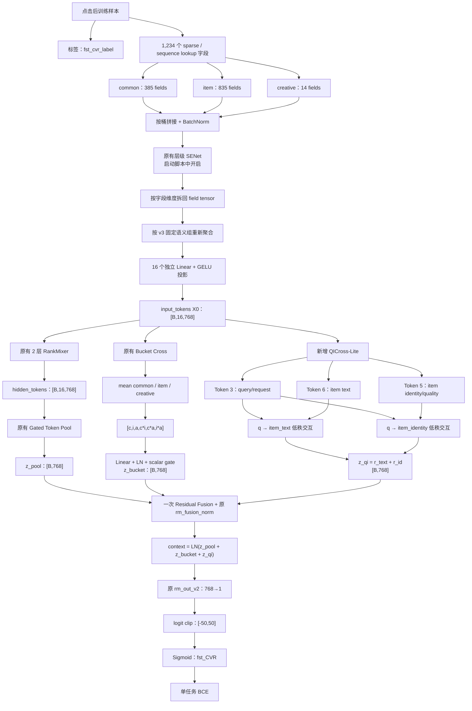
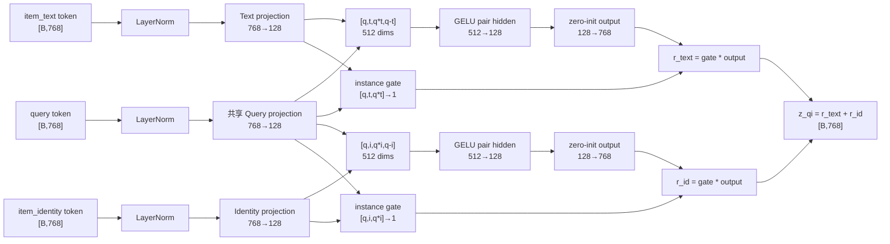

# Semantic RankMixer v4：QICross-Lite 搜索首次转化率模型介绍

本文以仓库中的实际实现和启动参数为准，介绍 RankMixer v4 的业务目标、完整前向流程、核心伪代码、
新增 QICross-Lite 模块及其设计理由。

- v4 模型：[cvr_bn_rankmixer_v4.py](../src/models/rankmixer/cvr_bn_rankmixer_v4.py)
- v3 基线：[cvr_bn_rankmixer_v3.py](../src/models/rankmixer/cvr_bn_rankmixer_v3.py)
- v4 启动脚本：[set-rankmixer-v4.txt](../bash/set-rankmixer-v4.txt)
- v4 展开参数：[set-rankmixer-v4-args.txt](../bash/set-rankmixer-v4-args.txt)
- v3 语义分组说明：[rankmixer_v3_introduction.md](rankmixer_v3_introduction.md)
- 详细设计与实验方案：[rankmixer_v3_search_cvr_fst_auc_improvement.md](rankmixer_v3_search_cvr_fst_auc_improvement.md)

---

## 1. 一句话说明 v4 在做什么

RankMixer v4 是推广搜索场景中的点击后首次转化率模型：在用户已经点击某个搜索候选商品的样本空间中，
模型根据用户、当前查询、商品、上下文和创意等特征，预测该点击后续发生首次转化的概率 `fst_CVR`。

模型仍然只有一个输出：

$$
\hat y=P(\text{fst conversion}=1\mid\text{clicked sample features}).
$$

v4 在 v3 的 16 个语义 Token、RankMixer、Gated Token Pool、Bucket Cross 和单任务输出头基础上，
只增加一个轻量的定向 Query-Item 交互分支 `QICross-Lite`：

```text
query/request context → item text relevance
query/request context → item identity/quality
```

它解决的是搜索排序中的一个明确问题：同一个商品是否容易转化，不仅取决于商品本身，还取决于它和当前
query 的匹配关系。v3 可以隐式学习这种关系，但缺少一条保留 query 方向、针对关键商品语义的显式路径。

---

## 2. 任务边界

### 2.1 保持不变的训练目标

v4 严格保持 v3 的任务定义：

- 样本空间：点击后的 CVR 样本；
- 标签：`fst_cvr_label`；
- 输出：一个 `fst_CVR` 概率；
- 损失：单任务二分类交叉熵；
- 不增加 last-CVR、delay、行为辅助任务；
- 不增加 pairwise 或 listwise 排序损失；
- `search_id` 不作为模型特征，也不进入训练损失。

训练损失仍为：

$$
\mathcal L_{fst}
=-\frac{1}{N}\sum_{n=1}^{N}
\left[y_n\log \hat y_n+(1-y_n)\log(1-\hat y_n)\right].
$$

### 2.2 这是搜索模型还是推荐模型

该代码位于推广搜索链路，包含当前查询词、NER、搜索方法、召回上下文、query-item 文本命中和商品候选
等搜索特征。因此它的业务定位是推广搜索中的点击后转化率预估，而不是一个脱离 query 的通用推荐模型。

模型代码只能证明它输出 `fst_CVR`。线上最终如何与 pCTR、出价、价格或 GMV 组合，需要以排序链路配置
为准，不能仅从该模型文件推断。

---

## 3. v3 与 v4 对比

| 对比项 | v3 | v4 |
|---|---|---|
| 输入字段 | 1,234 个既有字段 | 完全相同 |
| 三桶结构 | common / item / creative | 完全相同 |
| 语义 Token | 5 + 10 + 1，共 16 个 | 完全相同 |
| Token 维度 | 768 | 完全相同 |
| RankMixer | 2 层，16 heads，FFN expansion=2 | 完全相同 |
| Gated Token Pool | 保留 | 保留 |
| Bucket Cross | common/item/creative 粗粒度交互 | 保留 |
| Query-Item 显式交互 | 无独立定向分支 | 新增 QICross-Lite |
| 最终融合 | `LN(pool + bucket)` | `LN(pool + bucket + qi)` |
| 输出头 | `rm_out_v2: 768→1` | 完全相同 |
| 标签与损失 | `fst_cvr_label` + BCE | 完全相同 |
| 新增参数 | 无 | 约 0.63M |
| 回退方式 | — | 关闭 `rm_use_query_item_cross` 即恢复 v3 路径 |

v4 的效果归因因此非常明确：如果严格固定数据、checkpoint、随机种子和训练参数，v3 与 v4 的主要算法
差别只有 QICross-Lite 及其进入最终残差融合的路径。

---

## 4. 输入特征与 16 个语义 Token

当前 `data.cvr.cvr_fea_v10_base_cold` 配置使用 1,234 个字段，每字段默认 embedding 维度为 17：

| 桶 | 字段数 | 展平维度 | 语义 Token 数 |
|---|---:|---:|---:|
| common | 385 | 6,545 | 5 |
| item | 835 | 14,195 | 10 |
| creative | 14 | 238 | 1 |
| 合计 | 1,234 | 20,978 | 16 |

v4 完整继承 v3 的语义分组：

| Token | 语义组 | 字段数 | 投影前维度 | QICross 是否使用 |
|---:|---|---:|---:|---|
| 0 | `common_profile_device` | 16 | 272 | 否 |
| 1 | `common_purchase_value` | 90 | 1,530 | 否 |
| 2 | `common_interest_history` | 92 | 1,564 | 否 |
| 3 | `common_query_intent_retrieval` | 85 | 1,445 | Query source |
| 4 | `common_realtime_session_funnel` | 102 | 1,734 | 否 |
| 5 | `item_static_identity_quality` | 98 | 1,666 | Item target |
| 6 | `item_text_relevance` | 71 | 1,207 | Item target |
| 7 | `item_multimodal` | 58 | 986 | 否 |
| 8 | `item_price_offer` | 60 | 1,020 | 否 |
| 9 | `item_price_preference` | 126 | 2,142 | 否 |
| 10 | `item_global_statistics` | 73 | 1,241 | 否 |
| 11 | `item_positive_preference` | 46 | 782 | 否 |
| 12 | `item_exposure_engagement` | 134 | 2,278 | 否 |
| 13 | `item_session_context` | 33 | 561 | 否 |
| 14 | `item_retrieval_graph` | 136 | 2,312 | 否 |
| 15 | `creative_offer` | 14 | 238 | 否 |

每个语义组内部的字段 embedding 拼接后，通过独立的 `Linear + GELU` 投影到 768 维，最终得到：

```text
input_tokens = X0 ∈ R[B,16,768]
```

v4 新增了 `group_name → global token index` 映射，并在建图时校验名称唯一、数量等于 16、QICross
所需语义组存在。代码不直接写死 `3/5/6`，而是通过稳定的语义名称查找索引，防止将来调整分组顺序后
静默读取错误 Token。

---

## 5. 完整算法流程图



这张图中的三条表示分支是并行关系：

1. RankMixer + Gated Pool 是全局主表示；
2. Bucket Cross 是三大特征桶之间的粗粒度显式交互；
3. QICross-Lite 是当前 query 到关键商品语义的细粒度定向交互。

三条分支不会串行改写彼此的输出，而是在最终上下文处相加并只执行一次 LayerNorm。

---

## 6. v3 主干模块

### 6.1 语义 Token 化

v4 沿用 v3 的字段安全对齐流程：

```text
lookup tensor
→ get_sparse_fc_key 获取字段 ID
→ feature_id → embedding 映射
→ 按 FeatureConfig 顺序重排
→ 每桶 BN / SENet
→ split 回完整字段
→ 按语义字段 ID 列表聚合
→ 独立投影为 16×768 Token
```

这样做避免依赖 lookup 返回顺序，也避免把某个字段 embedding 从中间切断。

### 6.2 RankMixer 主塔

启动参数为：

```text
T = 16 tokens
H = 16 heads
D = 768 hidden dim
L = 2 blocks
k = 2 FFN expansion
```

每个 RankMixer block 包含：

```text
Multi-Head Token Mixing（reshape / transpose，无 K-Q attention 参数）
→ Add & LayerNorm
→ 每个 Token 独立的 768→1536→768 PFFN
→ Add & LayerNorm
```

输出为：

```text
hidden_tokens ∈ R[B,16,768]
```

### 6.3 Gated Token Pool

Gated Pool 为每个 Mixer 后 Token 计算一个标量分数：

$$
s_j=w^Th_j,\qquad
\alpha_j=\operatorname{softmax}(s_j),\qquad
z_{pool}=\sum_{j=1}^{16}\alpha_jh_j.
$$

打分权重零初始化，因此训练第 0 步的 16 个分数相同，初始行为严格等价于 mean pooling；训练后才逐渐
学习不同样本应该重点使用哪些 Token。

### 6.4 Bucket Cross Residual

Bucket Cross 直接读取 Mixer 前的 `input_tokens`。它先分别对 5 个 common、10 个 item 和 1 个
creative Token 求均值：

$$
c=\operatorname{mean}(X_{common}),\quad
i=\operatorname{mean}(X_{item}),\quad
a=\operatorname{mean}(X_{creative}).
$$

随后构造：

$$
x_{bucket}=[c,i,a,c\odot i,c\odot a,i\odot a]\in\mathbb R^{4608},
$$

并执行：

$$
z_{bucket}=\sigma(g_b)\cdot
\operatorname{LN}(\operatorname{GELU}(W_bx_{bucket}+b_b)).
$$

其中 `gate_logit` 初始为 `-2`，所以初始门控约为 `0.1192`。

Bucket Cross 的优点是便宜、覆盖面广；局限是 query Token 会和另外 4 个 common Token 一起平均，
item text 和 identity 也会和其他 8 个 item Token 一起平均，因此当前查询和特定商品语义可能被稀释。

---

## 7. 新增模块：QICross-Lite

### 7.1 为什么要增加显式 Query-Item Cross

推广搜索排序天然是一个条件匹配问题：

```text
当前 query 不同
→ 用户当前意图不同
→ 同一个商品的相关性、吸引力和转化概率不同
```

v3 已经存在两种交互：

- RankMixer 在 16 个 Token 之间交换通道，提供全局隐式交互；
- Bucket Cross 在 common/item/creative 均值之间做显式乘积，提供粗粒度交互。

但两者都没有单独保证“当前 query 表示以保留方向的方式直接影响商品文本和身份表示”。QICross-Lite
因此不替换原主干，而是增加一条目标明确的残差路径。

### 7.2 QICross 使用哪些特征

QICross 不新增字段，也不读取原始字符串 query。它从现有的三个语义 Token 中取值：

| 角色 | Token 名称 | 字段数 | 主要内容 |
|---|---|---:|---|
| Query source | `common_query_intent_retrieval` | 85 | 查询词、NER、query 长度、搜索方法、查询统计、近期搜索行为、召回和 top200 上下文 |
| Text target | `item_text_relevance` | 71 | query 命中标题、query-item/category 交叉、NER 命中、词法及文本相关性 |
| Identity target | `item_static_identity_quality` | 98 | goods/category/mall/brand/ad/plan ID、静态属性、质量和部分既有用户-商品匹配特征 |

因此 QICross 间接利用 254 个既有字段，但只对三个 768 维语义表示做低秩交互，不会枚举
`85×71` 或 `85×98` 个字段对。

### 7.3 为什么读取 Mixer 前的 Token

QICross 使用：

```text
input_tokens，而不是 hidden_tokens
```

原因是 `input_tokens[:,3,:]` 在 Mixer 前仍明确代表 query/request 语义；经过 fixed token mixing 后，
同一位置已经混入其他 Token 通道，不能再视为纯 query。显式 Cross 如果从混合后的 Token 读取，会降低
模块可解释性，也难以确认学到的是哪一条业务关系。

### 7.4 QICross 内部结构图



### 7.5 低秩投影

首先在 QICross 分支内部独立归一化，再从 768 维投影到低秩空间 `r=128`：

$$
\tilde q=P_q\operatorname{LN}(q),
$$

$$
\tilde i_{text}=P_{text}\operatorname{LN}(i_{text}),\qquad
\tilde i_{id}=P_{id}\operatorname{LN}(i_{id}).
$$

Query projection 在两条边之间共享，两个 item target 使用独立投影。共享 Query projection 可以让两条边
使用一致的查询语义空间；独立 item projection 则允许文本相关性和商品身份学习不同变换。

选择 128 维而不是直接在 768 维构造大 Cross，主要是为了：

- 控制参数量和线上计算成本；
- 降低在稀疏点击后转化标签上的过拟合风险；
- 保持 QICross 是主干旁边的轻量残差，而不是另一个大模型。

### 7.6 成对交互特征

对于目标 $k\in\{text,id\}$，构造：

$$
m_k=[\tilde q,\tilde i_k,\tilde q\odot\tilde i_k,\tilde q-\tilde i_k]
\in\mathbb R^{512}.
$$

四部分分别表示：

| 部分 | 作用 |
|---|---|
| $\tilde q$ | 保留当前请求自身的意图信息 |
| $\tilde i_k$ | 保留候选商品目标语义 |
| $\tilde q\odot\tilde i_k$ | 显式建模逐维共同激活和匹配 |
| $\tilde q-\tilde i_k$ | 保留 query→item 的有符号差异和方向 |

这里使用有符号差，而不是只使用绝对差。`q-i` 与 `i-q` 不相同，因此模型能够区分“用 query 条件化
item”和无方向的距离关系。

交互特征再经过：

$$
h_k=\operatorname{GELU}(W_{h,k}m_k+b_{h,k}),\qquad 512\rightarrow128.
$$

### 7.7 样本级 Gate

每条边都有独立的样本级标量 Gate：

$$
g_k=\sigma\left(W_{g,k}[\tilde q,\tilde i_k,\tilde q\odot\tilde i_k]+b_{g,k}\right).
$$

它允许模型按样本决定是否需要该交互。例如：

- query 和标题已经高度匹配时，文本 Cross 可能更重要；
- 品牌、类目或店铺身份决定购买意图时，identity Cross 可能更重要；
- query 信息缺失或噪声较大时，模型可以降低相应残差强度。

Gate kernel 零初始化，bias 初始化为 `-2`，所以初始值为：

$$
g_k^{(0)}=\sigma(-2)\approx0.1192.
$$

### 7.8 零初始化残差输出

每条边最后执行：

$$
r_k=g_k(W_{o,k}h_k+b_{o,k}),\qquad128\rightarrow768.
$$

`W_{o,k}` 和 `b_{o,k}` 都初始化为 0，因此只要输入为有限值：

$$
r_k^{(0)}=0,\qquad z_{qi}^{(0)}=r_{text}^{(0)}+r_{id}^{(0)}=0.
$$

这样设计的理由是保护 v3 主路径：从 v3 checkpoint 恢复时，新模块在训练第 0 步不会改变原预测。
第一步主要更新 output projection；当 output 不再为 0 后，梯度再逐步传回 pair hidden、低秩投影和 Gate。

### 7.9 参数量与作用域

在 `D=768、r=128、两个 target` 下：

| 参数部分 | 参数量 |
|---|---:|
| Query + 两个 item 低秩投影 | 295,296 |
| 两个 pair hidden | 131,328 |
| 两个 scalar gate | 770 |
| 两个 128→768 output projection | 198,144 |
| 三个 LayerNorm | 4,608 |
| 合计 | 约 630,146 |

即约 0.63M 新参数。矩阵乘法约为 0.62M MACs/样本；若一次乘法和一次加法分别计 FLOP，约为
1.25M FLOPs/样本。

新增变量统一位于：

```text
Cvr-task-part/rm_query_item_cross/
├── query_ln
├── query_projection
├── q_to_item_text_relevance/
│   ├── item_ln
│   ├── item_projection
│   ├── pair_hidden
│   ├── gate
│   └── output
└── q_to_item_static_identity_quality/
    ├── item_ln
    ├── item_projection
    ├── pair_hidden
    ├── gate
    └── output
```

使用语义名称而不是 `target_0/target_1`，可以保证 checkpoint 和日志中的变量含义稳定、可读。

---

## 8. 三条分支如何融合

v4 的最终上下文为：

$$
z_{v4}=\operatorname{LN}(z_{pool}+z_{bucket}+z_{qi}).
$$

实现中先收集已开启的残差：

```text
residuals = []
bucket enabled → append z_bucket
QICross enabled → append z_qi
```

然后执行一次：

```text
total_residual = sum(residuals)
context = rm_fusion_norm(z_pool + total_residual)
```

不采用下面的串行方式：

```text
LN(LN(z_pool + z_bucket) + z_qi)
```

因为串行融合会新增第二套 LayerNorm 参数、改变 v3 的主路径尺度，也让增益难以归因。一次统一融合既保留
现有 `rm_fusion_norm` scope，又让 QICross 作为真正的并行残差接入。

当 `rm_use_query_item_cross=false` 且 Bucket Cross 开启时，代码仍然走：

$$
\operatorname{LN}(z_{pool}+z_{bucket}),
$$

与 v3 的计算行为一致。

---

## 9. 完整前向伪代码

### 9.1 模型级伪代码

```python
def forward(features, fst_cvr_label, mode):
    # 1. 沿用 v3：lookup 与三桶对齐
    embeddings = flood_lookup_psv2(features)
    embedding_by_id = map_embedding_by_feature_id(embeddings)

    common = concat_in_feature_config_order(embedding_by_id["common"])
    item = concat_in_feature_config_order(embedding_by_id["item"])
    creative = concat_in_feature_config_order(embedding_by_id["creative"])

    # 2. 沿用 v3：桶内归一化和字段门控
    common = batch_norm(common)
    item = batch_norm(item)
    creative = batch_norm(creative)

    if use_senet:
        common, item, creative = hierarchical_senet(common, item, creative)

    # 3. 沿用 v3：拆回字段，按固定语义组生成 16 个 Token
    field_by_id = split_and_bind_feature_ids(common, item, creative)
    input_tokens = []
    for semantic_group in fixed_16_semantic_groups:
        group_fields = [field_by_id[fid] for fid in semantic_group.feature_ids]
        token = GELU(linear(concat(group_fields), output_dim=768))
        input_tokens.append(token)

    input_tokens = stack(input_tokens, axis=1)          # [B,16,768]

    # 4. 原 RankMixer 主路径
    hidden_tokens = rankmixer_stack(input_tokens, L=2)  # [B,16,768]
    z_pool = gated_token_pool(hidden_tokens)             # [B,768]

    # 5. 并行残差路径
    residuals = []
    if rm_use_bucket_cross:
        z_bucket = bucket_cross_residual(input_tokens)   # [B,768]
        residuals.append(z_bucket)

    if rm_use_query_item_cross:
        z_qi, qi_gates = query_item_cross(input_tokens)  # [B,768]
        residuals.append(z_qi)
        record_qi_diagnostics(z_qi, z_pool, qi_gates)

    # 6. 所有残差只融合一次
    context = z_pool
    if residuals:
        context = layer_norm(z_pool + sum(residuals))     # [B,768]

    # 7. 原有单任务输出头
    logit = linear(context, output_dim=1, scope="rm_out_v2")
    logit = clip(reshape(logit, [-1]), -50, 50)
    fst_cvr = sigmoid(logit)

    # 8. 原有单任务损失
    loss = mean(binary_cross_entropy(fst_cvr_label, fst_cvr))
    return fst_cvr, loss
```

### 9.2 QICross-Lite 伪代码

```python
def query_item_cross(input_tokens):
    # 按名称取索引，当前分别为 query=3、identity=5、text=6
    q = input_tokens[:, token_index["common_query_intent_retrieval"], :]

    q = layer_norm(q)
    q_low = linear(q, 128, scope="query_projection")

    residuals = []
    gate_means = {}

    for target_name in [
        "item_text_relevance",
        "item_static_identity_quality",
    ]:
        item = input_tokens[:, token_index[target_name], :]
        item = layer_norm(item)
        item_low = linear(item, 128, scope=target_name + "/item_projection")

        product = q_low * item_low

        pair_input = concat([
            q_low,
            item_low,
            product,
            q_low - item_low,
        ])                                                # [B,512]

        pair_hidden = GELU(linear(pair_input, 128))       # [B,128]

        gate_input = concat([q_low, item_low, product])   # [B,384]
        gate = sigmoid(linear(
            gate_input,
            1,
            kernel_init=zeros,
            bias_init=-2.0,
        ))                                                # [B,1]

        output = linear(
            pair_hidden,
            768,
            kernel_init=zeros,
            bias_init=zeros,
        )                                                 # [B,768]

        residuals.append(gate * output)
        gate_means[target_name] = mean(gate)

    return sum(residuals), gate_means                     # [B,768]
```

---

## 10. 启动配置

v4 启动脚本在 v3 参数基础上新增：

```json
{
  "rm_use_query_item_cross": true,
  "rm_qi_cross_dim": 128,
  "rm_qi_cross_targets": [
    "item_text_relevance",
    "item_static_identity_quality"
  ],
  "rm_qi_cross_gate_init": -2.0
}
```

其余核心参数保持：

```json
{
  "use_senet": true,
  "use_senet_bn": true,
  "rm_token_num": 16,
  "rm_hidden_dim": 768,
  "rm_layer_num": 2,
  "rm_ffn_expand": 2,
  "rm_head_num": 16,
  "rm_use_gated_pool": true,
  "rm_use_bucket_cross": true,
  "rm_cross_gate_init": -2.0,
  "optimizer": "flood_adam",
  "learning_rate": 0.00002,
  "embedding_size": 17,
  "batch_size": 2048
}
```

代码中的 `rm_use_query_item_cross` 默认值是 `false`，用于兼容旧配置；v4 启动脚本显式将其设为
`true`。因此紧急回退时可以关闭该开关，而不需要修改输入 schema、FeatureConfig 或 sparse checkpoint。

启动脚本还把 `rm_query_item_cross` 加入 `skip_tensors` 和 `warm_up_tensors` 的作用域列表。

当前脚本默认 `change_fea='cold'`，即 dense 塔冷启动、sparse embedding 按原方案恢复。如果要从一个已训练
的 strict-v3 checkpoint 热启动 v4，需要替换 `checkpoint_import_dir`、调整 cold/warm 配置，并通过服务器
恢复日志确认：所有旧变量成功恢复，只有 QICross 新变量及相应 optimizer slot 初始化。

---

## 11. 训练诊断

v4 在原 AUC、loss、COPC summary 之外增加：

| 指标 | 含义 | 异常信号 |
|---|---|---|
| `item_text_relevance/gate_mean` | 文本 Cross 的平均门控 | 长期完全不变可能未学习 |
| `item_static_identity_quality/gate_mean` | 身份 Cross 的平均门控 | 长期完全不变可能未学习 |
| `qi/residual_norm` | QICross 输出范数 | 长期接近 0 表示分支未被使用 |
| `qi/pooled_context_norm` | RankMixer 主表示范数 | 用于建立尺度基准 |
| `qi/residual_to_pool_ratio` | QI 残差与主表示的相对强度 | 快速远大于 1 可能破坏主干 |

零初始化下，第 0 步 `qi/residual_norm` 为 0 是正常现象。应观察若干优化步骤后的变化，而不是因为第一个
step 为 0 就判断模块失效。

---

## 12. 离线评价与 search_id

v4 的预测目标仍然只有 `fst_CVR`。离线评价不是新任务，也不会改变训练图。

建议继续把全局指标作为主指标：

- exact `fst_AUC`；
- Logloss；
- COPC / 校准；
- PR-AUC；
- 关键 query、用户和商品切片。

如果需要诊断同一次搜索请求内的排序，可以在测试阶段保存：

```text
search_id    example_id    fst_cvr_label    prediction
```

汇总所有 worker 后，再按 `sample_date + search_id` 分组计算请求内 AUC/GAUC。`search_id` 只用于离线
分组，不进入模型输入或损失。

由于训练样本已经限定为点击后样本，请求内指标只能覆盖同一请求中具有多个点击、并且标签同时包含正负例
的请求，所以不能用它替代全局 `fst_AUC`。当前启动脚本的 `save_predict_result=false`，需要做请求评价时
应在独立评估任务中开启并固定输出目录。

---

## 13. 为什么第一版只做两条 Cross

第一版没有加入 `q×price`、`q×session`、`q×creative` 或 16×16 全 Token Cross，理由是：

1. 商品文本相关性是搜索 query 与候选最直接的关系；
2. 商品/类目/店铺身份可以补充标题之外的意图匹配；
3. 两条边足以验证“显式 query 条件化”是否有效；
4. 边数少，参数量、延迟和过拟合风险更可控；
5. 可以通过 text-only、identity-only、两者组合做清晰消融；
6. 若一次加入过多 Cross，即使 AUC 上升也无法判断是哪条关系产生增益。

推荐实验顺序：

| 实验 | Text Cross | Identity Cross | Bucket Cross | 目的 |
|---|---:|---:|---:|---|
| E0 strict-v3 | 关 | 关 | 开 | 基线 |
| E1 qi-text | 开 | 关 | 开 | 文本 Cross 的独立增量 |
| E2 qi-id | 关 | 开 | 开 | 身份 Cross 的独立增量 |
| E3 v4 | 开 | 开 | 开 | 完整 v4 候选 |
| E4 v4-no-bucket | 开 | 开 | 关 | 判断 QI 与 Bucket Cross 是否重复 |

---

## 14. 预期收益、风险与停止条件

### 14.1 更可能获得收益的切片

- query 文本和商品标题不是完全字面匹配；
- 尾部 query；
- 同类目多个相似商品需要进一步区分；
- 品牌、店铺或商品身份与意图强相关；
- v3 Bucket mean 容易稀释 query 信号的请求。

### 14.2 主要风险

- item text Token 已包含不少人工 query-item 交叉，QICross 可能重复建模；
- 点击后 CVR 标签比点击标签更稀疏，新分支可能过拟合；
- QI 残差过大可能破坏原主表示和校准；
- 热启动配置错误可能导致整个 dense 塔意外冷启；
- 全局 AUC 增益不一定意味着每个请求内排序都改善。

### 14.3 停止或回退条件

- 多个时间窗/随机种子均没有稳定 `fst_AUC` 增益；
- Logloss、COPC 或关键业务切片明显退化；
- `qi/residual_to_pool_ratio` 快速异常增大；
- 增益只来自疑似时间穿越或数据重叠；
- 线上延迟不满足预算；
- 出现异常时关闭 `rm_use_query_item_cross`，恢复 v3 计算路径。

---

## 15. 代码位置速查

| 功能 | v4 代码位置 |
|---|---|
| QICross 配置与校验 | `MLPModel.__init__` |
| 稳定语义名称索引 | `_build_semantic_token_index()` |
| 16 个语义 Token | `_semantic_tokenize()` |
| RankMixer 主塔 | `_rm_stack()` / `_rm_block()` |
| Gated Pool | `_pool_tokens()` |
| Bucket Cross | `_bucket_cross_residual()` |
| QICross-Lite | `_query_item_cross_residual()` |
| 三分支融合 | `model_fn()` |
| QI 训练诊断 | `build_summary()` |
| 单任务 BCE | `build_loss_op()` |
| 启动入口 | `bash/set-rankmixer-v4.txt` |

---

## 16. 总结

RankMixer v4 不是对 v3 的全面重构，而是一次范围严格受控的搜索条件交互升级：

```text
保留 v3 的全部主能力
+ 从 Mixer 前语义 Token 读取 query/text/identity
+ 两条 128 维低秩定向 Cross
+ 样本级 Gate
+ 零初始化 768 维残差
+ 与 Pool、Bucket Cross 一次融合
= 单任务 fst_CVR 的 RankMixer v4
```

其核心思想不是“让模型更大”，而是给推广搜索中最重要的 query-item 关系一条更短、更明确、可控且可回退
的学习路径，同时保持样本、标签、特征、主塔和输出目标不变。
