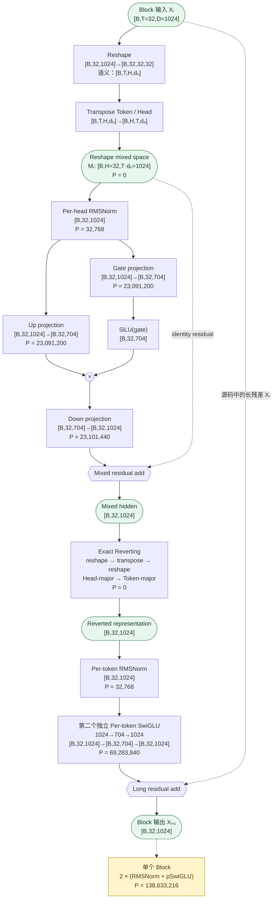

按当前 v5 启动参数核算，这个模型可由源码确定的 Dense 可训练参数量为：

**348,432,486（348.432M）**

因此它实际更接近“RM-v5-348M”，位于原先规划的 320–350M 区间上沿。其中 **79.58% 参数来自两层 RankMixer 中的 4 个 Per-token SwiGLU**。

核算依据包括 [核心配置](/Users/goku/Documents/Codex/RSA_code_0816/src/models/rankmixer/cvr_bn_rankmixer_v5.py:150)、[Token 构造](/Users/goku/Documents/Codex/RSA_code_0816/src/models/rankmixer/cvr_bn_rankmixer_v5.py:1384)、[RankMixer Block](/Users/goku/Documents/Codex/RSA_code_0816/src/models/rankmixer/cvr_bn_rankmixer_v5.py:1599) 和 [完整前向流程](/Users/goku/Documents/Codex/RSA_code_0816/src/models/rankmixer/cvr_bn_rankmixer_v5.py:1752)。

## 一、计算口径

按照当前启动配置：

- 字段数：Common 385、Item 835、Creative 14
- 每字段 Embedding 维度：17
- `T=32`：31 个 Local Token + 1 个 Global Token
- `H=32`
- `D=1024`
- `L=2`
- SwiGLU 中间维度 `M=704`
- Pool Query/Key 维度 `Q=128`
- Flatten Readout 维度 `F=512`
- 任务塔：`2560 → 2048 → 2048 → 256 → 1`
- `use_senet=true`
- `use_senet_bn=true`
- `batch_norm=true`

计入：

- Dense 权重和 Bias
- RMSNorm gamma
- BN 的可训练 gamma、beta
- Flatten scalar gate

不计入：

- 分布式稀疏 Embedding 表：其大小依赖 PS 中各字段实际 Key 数量，不能由该 Python 文件静态确定
- Adam 一、二阶动量
- BN moving mean/variance
- AUC、global step 等运行状态变量

## 二、参数总表

| 模块 | 可训练参数 | 占比 |
|---|---:|---:|
| 三个输入 Bucket BN | 41,956 | 0.0120% |
| Hierarchical SENet | 522,112 | 0.1498% |
| 31 个 Local Token 投影 | 21,544,960 | 6.1834% |
| Global Token MLP | 22,533,120 | 6.4670% |
| 2 个 RankMixer Block | 277,266,432 | 79.5754% |
| Final RMSNorm | 32,768 | 0.0094% |
| Global-conditioned Pool | 262,400 | 0.0753% |
| Flatten Readout | 16,253,953 | 4.6649% |
| CVR Task Head | 9,974,785 | 2.8628% |
| **总计** | **348,432,486** | **100%** |

FP32 只存模型参数约需要：

- 1.394 GB，或 1.298 GiB
- BF16/FP16 约 0.697 GB

这不包含梯度、优化器状态和激活。

---

## 三、输入 BN 与 SENet

### 3.1 Bucket 输入

| Bucket | 概念形状 | 代码中的拼接形状 |
|---|---|---|
| Common | `[B,385,17]` | `[B,6545]` |
| Item | `[B,835,17]` | `[B,14195]` |
| Creative | `[B,14,17]` | `[B,238]` |

总输入维度：

\[
385\times17+835\times17+14\times17=20,978
\]

### 3.2 输入 BN

每个维度有 gamma 和 beta：

| Bucket | 计算 | 参数量 |
|---|---:|---:|
| Common BN | `2×6545` | 13,090 |
| Item BN | `2×14195` | 28,390 |
| Creative BN | `2×238` | 476 |
| **合计** | `2×20978` | **41,956** |

### 3.3 Hierarchical SENet

SENet 中没有 Dense Bias。

| 路径 | 计算 | 参数量 |
|---|---:|---:|
| Common input | `385×128` | 49,280 |
| Common output | `128×385` | 49,280 |
| Common SENet 小计 |  | **98,560** |
| Common+Item input | `(385+835)×128` | 156,160 |
| Item output | `128×835` | 106,880 |
| Item SENet 小计 |  | **263,040** |
| All-fields input | `(385+835+14)×128` | 157,952 |
| Creative output | `128×14` | 1,792 |
| Creative SENet 小计 |  | **159,744** |
| 3 个 hidden BN | `3×2×128` | 768 |
| **SENet 合计** |  | **522,112** |

因此整个输入预处理部分为：

\[
41,956+522,112=\boxed{564,068}
\]

---

## 四、31 个 Local Token

字段分组已经硬编码在 `_build_semantic_feature_groups()` 中：

- Common：5 组 39 字段，5 组 38 字段
- Item：15 组 42 字段，5 组 41 字段
- Creative：1 组 14 字段

同输入宽度的 Token 使用一次 batched GEMM，但权重形状为 `[N,I,D]`，所以每个 Token 仍然拥有独立参数，不是共享投影。

对于包含 `N` 个 Token、输入宽度为 `I` 的 family：

\[
P=N\times I\times D+N\times D
\]

| Token family | N | 输入宽度 I | Weight | Bias | 合计 |
|---|---:|---:|---:|---:|---:|
| Common 39 字段 | 5 | `39×17=663` | 3,394,560 | 5,120 | 3,399,680 |
| Common 38 字段 | 5 | `38×17=646` | 3,307,520 | 5,120 | 3,312,640 |
| Item 42 字段 | 15 | `42×17=714` | 10,967,040 | 15,360 | 10,982,400 |
| Item 41 字段 | 5 | `41×17=697` | 3,568,640 | 5,120 | 3,573,760 |
| Creative 14 字段 | 1 | `14×17=238` | 243,712 | 1,024 | 244,736 |
| **投影合计** | 31 |  | **21,481,472** | **31,744** | **21,513,216** |

投影后：

\[
[B,31,1024]
\]

Per-token RMSNorm gamma：

\[
31\times1024=31,744
\]

所以 Local Token 模块总参数：

\[
21,513,216+31,744
=\boxed{21,544,960}
\]

---

## 五、Global Token

Global Token 使用全部 SENet 输出：

\[
[B,6545]\oplus[B,14195]\oplus[B,238]
=[B,20978]
\]

| 层 | 计算 | 参数量 |
|---|---:|---:|
| FC1 | `20978×1024+1024` | 21,482,496 |
| FC2 | `1024×1024+1024` | 1,049,600 |
| RMSNorm | `1024` | 1,024 |
| **合计** |  | **22,533,120** |

数据变化：

\[
[B,20978]\rightarrow[B,1024]\rightarrow[B,1024]
\rightarrow[B,1,1024]
\]

Local 和 Global 拼接后：

\[
[B,31,1024]\oplus[B,1,1024]
=[B,32,1024]
\]

---

## 六、RankMixer Block

由于：

\[
d_h=D/H=1024/32=32
\]

Mixing 的数据变化是：

\[
[B,T,D]
\rightarrow[B,T,H,d_h]
\rightarrow[B,H,T,d_h]
\rightarrow[B,H,Td_h]
\]

代入当前参数：

\[
[B,32,1024]\rightarrow[B,32,32,32]
\rightarrow[B,32,32,32]\rightarrow[B,32,1024]
\]

虽然数值 Shape 没变，但第二维语义已经从 Token 变成了 Head。Mixing 和 Reverting 都只是 reshape/transpose，因此参数量为 0。

### 单个 RMSNorm + Per-token SwiGLU Stage

Per-token SwiGLU 为每个 Token/Head 使用独立权重。

| 变量 | Shape | 参数量 |
|---|---|---:|
| RMS gamma | `[32,1024]` | 32,768 |
| `W_up` | `[32,1024,704]` | 23,068,672 |
| `b_up` | `[32,1,704]` | 22,528 |
| `W_gate` | `[32,1024,704]` | 23,068,672 |
| `b_gate` | `[32,1,704]` | 22,528 |
| `W_down` | `[32,704,1024]` | 23,068,672 |
| `b_down` | `[32,1,1024]` | 32,768 |
| **单 Stage 合计** |  | **69,316,608** |

一个 RankMixer Block 包含：

1. Mixed-space RMSNorm + SwiGLU
2. Original-space RMSNorm + SwiGLU

所以：

\[
P_{\text{block}}
=2\times69,316,608
=138,633,216
\]

两层使用独立参数：

\[
P_{\text{2 blocks}}
=2\times138,633,216
=\boxed{277,266,432}
\]

注意源码中第二次残差为：

\[
X_{l+1}=X_l+\operatorname{SwiGLU}
\left(
\operatorname{RMSNorm}
\left(
\operatorname{Revert}
\left(
\operatorname{Mix}(X_l)+\Delta_{\text{mix}}
\right)
\right)
\right)
\]

并不是 `reverted + original_update`。

---

## 七、Readout 和任务头

### 7.1 Final RMSNorm

\[
32\times1024=\boxed{32,768}
\]

### 7.2 Global-conditioned Pool

拆分：

- Local：`[B,31,1024]`
- Global：`[B,1024]`

Query：

\[
[B,1024]\rightarrow[B,128]
\]

Key：

\[
[B,31,1024]\rightarrow[B,31,128]
\]

| 投影 | 参数量 |
|---|---:|
| Query | `1024×128+128=131,200` |
| Key | `1024×128+128=131,200` |
| **合计** | **262,400** |

这里没有 Value 投影，直接对原始 Local Token 做加权求和：

\[
[B,31]\times[B,31,1024]\rightarrow[B,1024]
\]

### 7.3 Flatten Readout

\[
[B,31,1024]\rightarrow[B,31744]\rightarrow[B,512]
\]

| 变量 | 参数量 |
|---|---:|
| Projection weight | `31744×512=16,252,928` |
| Projection bias | 512 |
| RMSNorm gamma | 512 |
| Scalar gate | 1 |
| **合计** | **16,253,953** |

三个上下文拼接：

\[
[B,1024]_{\text{global}}
\oplus[B,1024]_{\text{pool}}
\oplus[B,512]_{\text{flatten}}
=[B,2560]
\]

### 7.4 Task Head

| 层 | Affine 参数 | BN 参数 | 合计 |
|---|---:|---:|---:|
| `2560→2048` | 5,244,928 | 4,096 | 5,249,024 |
| `2048→2048` | 4,196,352 | 4,096 | 4,200,448 |
| `2048→256` | 524,544 | 512 | 525,056 |
| `256→1` | 257 | 0 | 257 |
| **合计** | **9,966,081** | **8,704** | **9,974,785** |

最后执行：

\[
[B,1]\rightarrow[B]\rightarrow\operatorname{clip}(-50,50)
\rightarrow\operatorname{sigmoid}\rightarrow[B]
\]

损失保持与 Base 一致：

\[
\mathcal L_{\mathrm{BCE}}
=-\frac1B\sum_i
\left[y_i\log p_i+(1-y_i)\log(1-p_i)\right]
\]

---

# 八、端到端算法流程图

为避免一张图过密，下面将同一算法分成“端到端总图”和“RankMixer Block 块内展开图”。

```mermaid
flowchart TD
    A[/"稀疏 Embedding Lookup<br/>1234 个字段，每字段 17 维<br/>概念形状：[B,1234,17]"/]

    A --> B["按 Bucket 拼接<br/>Common: [B,6545]<br/>Item: [B,14195]<br/>Creative: [B,238]"]

    B --> BN["3 个独立 Input BN<br/>形状保持不变<br/>P = 41,956"]

    BN --> SE["Hierarchical SENet<br/>Common: 385→128→385<br/>Item: 1220→128→835<br/>Creative: 1234→128→14<br/>gate = 2·sigmoid(·)<br/>P = 522,112"]

    SE --> GB(["门控后的三个 Bucket<br/>[B,6545] / [B,14195] / [B,238]"])

    GB --> LG["硬编码均衡分组<br/>Common: 5×663 + 5×646<br/>Item: 15×714 + 5×697<br/>Creative: 1×238"]

    LG --> LP["Family-batched 独立投影 + GELU<br/>[B,N,I] × [N,I,1024]<br/>投影 P = 21,513,216"]

    LP --> LT(["Stack + Per-token RMSNorm<br/>Local Tokens: [B,31,1024]<br/>RMS P = 31,744"])

    GB --> GC["Concat all buckets<br/>[B,20978]"]

    GC --> GM["Global MLP<br/>20978→1024→1024<br/>GELU + RMSNorm<br/>P = 22,533,120"]

    GM --> GT(["Global Token<br/>[B,1,1024]"])

    LT --> CAT{{"Token Concat"}}
    GT --> CAT
    CAT --> X0(["X₀: [B,32,1024]"])

    X0 --> RM["2 × RankMixer Block<br/>Mixing → RMS → pSwiGLU → Residual<br/>Revert → RMS → pSwiGLU → Long Residual<br/>每层输出均为 [B,32,1024]<br/>P = 277,266,432"]

    RM --> X2(["X₂: [B,32,1024]"])
    X2 --> FR["Final Per-token RMSNorm<br/>[B,32,1024]<br/>P = 32,768"]

    FR --> SPLIT{{"按 Token 轴切分"}}
    SPLIT --> GL(["Global: [B,1024]"])
    SPLIT --> LL(["Locals: [B,31,1024]"])

    GL --> Q["Query projection<br/>[B,1024]→[B,128]"]
    LL --> K["Key projection<br/>[B,31,1024]→[B,31,128]"]

    Q --> SCORE["Scaled dot product<br/>scores: [B,31]"]
    K --> SCORE
    SCORE --> W["Softmax<br/>weights: [B,31]"]

    LL --> POOL["Weighted sum"]
    W --> POOL
    POOL --> PC(["Pooled context<br/>[B,1024]<br/>P = 262,400"])

    LL --> FL0["Flatten<br/>[B,31,1024]→[B,31744]"]
    FL0 --> FL1["31744→512 + GELU + RMSNorm<br/>× sigmoid(scalar gate)<br/>P = 16,253,953"]
    FL1 --> FC(["Flatten context<br/>[B,512]"])

    GL --> CTX{{"Concat"}}
    PC --> CTX
    FC --> CTX
    CTX --> C(["Context: [B,2560]"])

    C --> H0["FC + BN + GELU<br/>2560→2048"]
    H0 --> H1["FC + BN + GELU<br/>2048→2048"]
    H1 --> H2["FC + BN + GELU<br/>2048→256"]
    H2 --> OUT["Linear<br/>256→1<br/>Task Head P = 9,974,785"]

    OUT --> LOGIT(["Logits: [B]"])
    LOGIT --> CLIP["Clip to [-50,50]"]
    CLIP --> PRED(["Sigmoid prediction p: [B]"])

    Y[/"fst_cvr_label y: [B]"/] --> BCE["Mean BCE<br/>与 Base 模型保持一致"]
    PRED --> BCE

    classDef data fill:#e8f1ff,stroke:#4776b5,color:#172b4d;
    classDef state fill:#e8f7ed,stroke:#398452,color:#173b24;
    classDef loss fill:#fff0df,stroke:#c86e20,color:#4a2b10;

    class A,Y data;
    class GB,LT,GT,X0,X2,GL,LL,PC,FC,C,LOGIT,PRED state;
    class BCE loss;
```

## 九、RankMixer Block 块内展开图

最终参数恒等式为：

\[
\boxed{
41,956+
522,112+
21,544,960+
22,533,120+
277,266,432+
32,768+
262,400+
16,253,953+
9,974,785
=
348,432,486
}
\]

另外，若按普通 BN 的 moving mean/variance 计算，还约有 51,428 个非训练状态参数；由于当前使用服务器侧 Flood Riemann BN，这部分应以服务器构图后的 `GLOBAL_VARIABLES` 为最终准值。