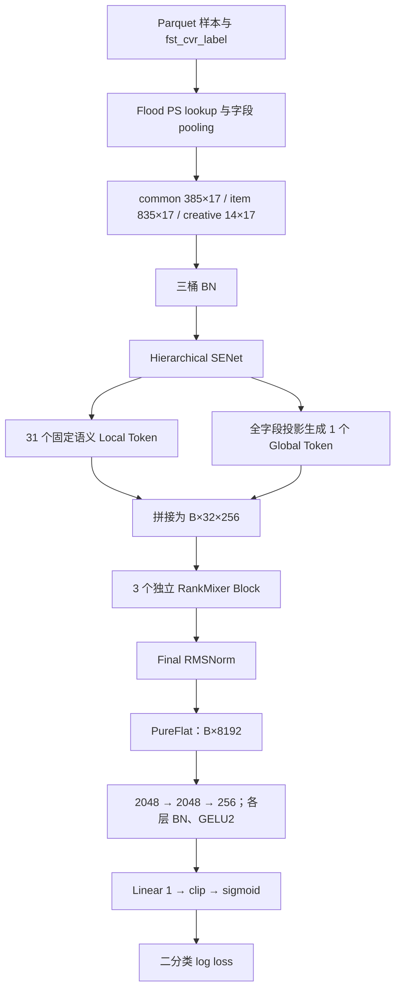

# 从零学习 RankMixer v6-E2-Small-3：从样本到参数更新

本文依据 2026-09-08 工作区中的实际代码和参数编写。模型代码及你已修改的参数文件保持原样。

- 模型：[cvr_bn_rankmixer_v6_e2_small_3.py](../src/models/rankmixer/cvr_bn_rankmixer_v6_e2_small_3.py)
- 参数：[set-rankmixer-v6-e2-small-3-args.txt](../bash/set-rankmixer-v6-e2-small-3-args.txt)
- 公共实现：[model_base.py](../src/models/model_base.py)
- 启动入口：[main.py](../src/main.py)
- 评估汇总：[accumulated_validator_cvr_psv2.py](../src/validator/accumulated_validator_cvr_psv2.py)

阅读时区分三种证据：**源码已确定**是本仓库直接执行的逻辑；**数学教学模型**是帮助理解的公式；**服务器待核实**表示实现位于缺失的 Flood/业务依赖中。不能用教学公式替代私有框架的真实行为。

本地没有 TensorFlow、Flood、NumPy，也没有 `data.feature`、特征配置、`utils.learning_rate` 和 warmup hook 等业务依赖。本文没有声称已在本地或服务器完成训练。

## 1. 先理解训练究竟在做什么

模型输入是一条样本的用户、查询、商品、创意等特征，输出一个介于 0 和 1 之间的数。代码把它当作 `fst_cvr_label` 为 1 的概率，并用这个 label 训练。`first_cvr` 的精确业务定义、转化归因窗口、样本是否条件于点击，需要查看上游产样本逻辑，不能由模型文件名推断。

例如，一条样本描述“某用户在某次搜索中看到某商品”。训练时同时知道 label；线上预测时只有特征。label 用来判断预测偏差，不应作为预测特征泄漏进入网络。

设参数为 Θ，输入为 x，标签为 y，模型给出 p=f(x;Θ)。训练反复做：

1. **前向传播**：拿当前参数计算 p 和损失 L。
2. **反向传播**：计算每个参数对损失的影响，即梯度 ∂L/∂Θ。
3. **优化器更新**：根据梯度、学习率和历史状态改变参数。

梯度不是参数本身，也不是参数变化量。最简单的 SGD 使用 ΔΘ=−η∂L/∂Θ；Adam 还会使用历史梯度。

`batch_size=2048` 表示此模型的数据读取调用一次取 2048 条训练样本。它不是特征数、Token 数或参数量。每个 worker 的 batch 与整个集群的有效 batch 之间怎样换算，取决于同步/异步训练协议。

**四种对象务必分开：**

| 对象 | 此模型中的例子 | 如何变化 |
|---|---|---|
| 输入数据 | 特征 ID、标签 | 随样本变化 |
| 中间激活 | `[B,32,256]` Token | 每次前向重新计算 |
| 可训练参数 | Embedding 行、投影矩阵、BN γ/β、RMSNorm γ | 优化器更新 |
| 非梯度状态 | BN moving mean/variance、Adam m/v、global step、统计指标 | 各自状态更新规则 |

## 2. Sparse 参数和 Dense 参数

**Sparse 参数**通常是按离散 key 索引的 Embedding 表。以“商品 ID”字段为例，不同商品值有不同向量。字段标识和字段取值不是同一回事：源码里的 `'10003'` 等字符串用来标识字段，该字段在某条样本中的商品 key 才决定查哪一行。

设字段 f 的表为 E_f，某个 key 是 k，则查表得到 `E_f[k]`。代码要求参与本模型的每个字段查表输出为 17 维。不能擅自解释成“16 维向量加 1 维独立 LR bias”；本模型把全部 17 维送进同一个 Dense 主干，没有显式 wide/LR 分支。

一个字段可能有多个 key。例如历史点击商品列表 `[a,b,c]`。`get_features_conf()` 默认配置 `SUM_POOLING`，但允许特征配置覆盖，因此常见教学形式为：

$$
e_f=\sum_{k\in K_f}E_f[k]\in\mathbb R^{17}.
$$

实际是否带权、截断、共享表、缺失值默认行、常量行，分别要看 FeatureConfig、FeatureColumnBuilder 和 Flood lookup。`features_share_map` 明确支持共享 Embedding 配置。

**Dense 参数**是投影矩阵、全连接矩阵、偏置、归一化参数等。它们通常参与每个 batch 的计算，不是按特征 key 动态选择少数行更新。

“没有 dense 原始特征”不等于“没有 Dense 参数”。此模型拒绝非空 `dense_fea_map`，但拥有 **137,081,957 个 Dense 可训练参数**。

Sparse 表并不是一张 `1234×17` 的参数表。1234 是字段数；Sparse 参数量取决于所有字段的活跃 key 数以及共享方式。`1234×17=20978` 是一条样本在 pooling 之后的输入宽度。

## 3. 整个前向网络的形状地图

约定 B=batch，F=字段数，T=Token 数，D=每个 Token 的宽度，H=拆分组数，M=SwiGLU 中间宽度。



| 位置 | 每批形状 | 含义 |
|---|---|---|
| common 输入 | `[B,6545]` | 385×17 |
| item 输入 | `[B,14195]` | 835×17 |
| creative 输入 | `[B,238]` | 14×17 |
| 合并字段宽度 | `[B,20978]` | 1234×17 |
| Local Tokens | `[B,31,256]` | common 10、item 20、creative 1 |
| Global Token | `[B,256]` | 全部字段的一条压缩表示 |
| 每个 Block 输入/输出 | `[B,32,256]` | 维度不变，内容改变 |
| PureFlat | `[B,8192]` | 32×256，保留 Token 位置 |
| 三层任务头 | `[B,2048]→[B,2048]→[B,256]` | 每层 Dense→BN→GELU2 |
| logit / pred | `[B]` | 分别为实数分数与概率 |

这是单任务前向路径。它没有 Q/K/V 注意力、attention softmax、多任务 loss、DIN 或显式序列塔。数据源名称带 `seq` 不代表此网络会构造序列模块；构造器明确拒绝非空 sequence bucket。

## 4. 输入 BN：先让不同字段的尺度更可控

定位：模型 `model_fn()` 第 1984 行附近；公共实现 `ModelBase.batch_norm_layer_v2()` 第 477 行。

每个桶独立做 BN。教学上，对某一输入坐标 j：

$$
\mu_j=\frac1B\sum_bx_{bj},\quad
v_j=\frac1B\sum_b(x_{bj}-\mu_j)^2,
$$

$$
\hat x_{bj}=\frac{x_{bj}-\mu_j}{\sqrt{v_j+\epsilon_{BN}}},\quad
y_{bj}=\gamma_j\hat x_{bj}+\beta_j.
$$

γ 和 β 可以训练；均值和方差不是通过 Adam 求梯度学习出来的。通常训练使用 batch 统计，推理使用移动统计。这里显式传入 `decay=0.9`、`center=True`、`scale=True`、`renorm=False`。

移动均值的常见解释是 `moving←0.9×moving+0.1×batch_mean`，但本配置实际走 Flood 的 `batch_normalization.batch_norm`：其 epsilon、方差估计、分布式聚合、导出融合与更新执行顺序，需要查安装版本。不要把 `use_riemann_bn=true` 自动等同于某种公开 Riemannian 优化算法。

当前 `embed_use_renorm` 默认 false，因此公共函数传 `updates_collections=None`。若后续改为 renorm=true，则会切到 `UPDATE_OPS` 集合，需要确认训练图会执行它；当前模型的优化器函数没有显式收集该集合。

## 5. Hierarchical SENet：学会给字段调节强度

定位：`senet_layer()` 第 1427 行。

第一步，对每个字段 17 个坐标求均值：

$$
s_{b,f}=\frac1{17}\sum_d e_{b,f,d}.
$$

注意，这是沿 Embedding 维求平均，不是沿 batch 求平均。得到 common 的 385 维摘要、item 的 835 维摘要和 creative 的 14 维摘要。

三条 gate 的依赖为：

$$
g_c=2\sigma\big(\tanh(BN(s_cW_{c,in}))W_{c,out}\big),
$$

$$
g_i=2\sigma\big(\tanh(BN([s_c,s_i]W_{i,in}))W_{i,out}\big),
$$

$$
g_r=2\sigma\big(\tanh(BN([s_c,s_i,s_r]W_{r,in}))W_{r,out}\big).
$$

各中间层宽度都是 128。输出为 `e'_{b,f,d}=g_{b,f}e_{b,f,d}`。

gate 在 (0,2) 内：接近 0 抑制字段，接近 1 基本保留，接近 2 放大字段。同一字段 17 个坐标共享一个 gate。它不是对字段做 softmax，各字段 gate 不要求和为 1。

“Hierarchical”体现在依赖范围：item gate 可以由用户/查询信息调节；creative gate 可以参考全部三桶。代码使用的是原始三桶摘要，不是先算 common gate、再把 gated common 输入 item gate 的串行结构。

门控矩阵无显式 bias，隐藏 BN 自带 β。SENet 权重使用 Glorot uniform，其余 RankMixer 大部分权重使用专门的正态初始化。

## 6. 把 1234 个字段组织成 32 个 Token

定位：固定组定义第 404 行，组校验第 681 行，`_semantic_tokenize()` 第 1595 行，Global Token 第 1666 行。

**Local Token**：每个语义组把组内字段向量串接，乘该组独有的投影矩阵，加 bias，做 GELU2，最后 RMSNorm。

$$
t_f=RMSNorm_f\big(GELU2([e'_{i_1};\ldots;e'_{i_k}]W_f+b_f)\big).
$$

| 桶 | 分组 | 投影前宽度 |
|---|---|---|
| common | 5 组×39 字段、5 组×38 字段 | 663 或 646 |
| item | 15 组×42 字段、5 组×41 字段 | 714 或 697 |
| creative | 1 组×14 字段 | 238 |

组按用户画像、购买、query 意图、实时行为、商品属性、相关性、价格促销等进行固定组织。字段名单和顺序由代码冻结，并用覆盖检查、重复检查、字段数检查和 SHA256 校验。**字段的运行时 ID 查表是动态的，字段属于哪个 Token 是固定的。**

实现把相同输入宽度的组归为一个 family，用 batched matmul 提高执行效率。一共有 `(238,1)、(646,5)、(663,5)、(697,5)、(714,15)` 五种 `(输入宽度,Token 数)`。

某个 family 的形状：

```text
输入 [B,N,I] → transpose [N,B,I]
权重 [N,I,256]，bias [N,1,256]
批量矩阵乘 → [N,B,256] → transpose [B,N,256]
```

N 个 Token 各有自己的权重。合并计算不意味着共享权重。

`rm_optimize_tokenize=true` 使用一次 `tf.unstack` 分离一个 family 的 Token。参考路径对每个 Token 做切片；反向时每个切片可能生成完整大小的 `StridedSliceGrad` 回填张量再相加。Unstack 的梯度可以一次 Pack，减少重复回填。该开关不减少参数量、不更改语义组、不改变网络设计；浮点结果和实际性能仍应在目标 TensorFlow/Flood 环境验证。

**Global Token**不是一个可训练的常量 CLS 向量，也不是 Local Token 的平均值。它直接看 SENet 后全部字段：

$$
t_g=RMSNorm\big(GELU2(e'_{all}W_1+b_1)W_2+b_2\big),
$$

其中 `W1:[20978,256]`，`W2:[256,256]`，第二层为线性层。它被放在 31 个 Local Token 之后，成为第 32 个 Token。

每个输入字段同时参与自己的 Local Token 和 Global Token，因此反向会汇合两条路径的梯度。

## 7. RMSNorm：按每个样本、每个 Token 的坐标归一化

定位：`_rm_rms_norm()` 第 1526 行。

$$
r=\sqrt{\frac1D\sum_{j=1}^Dx_j^2+\epsilon},\quad
y_j=\gamma_j\frac{x_j}{r},\quad\epsilon=10^{-6}.
$$

RMSNorm 不减均值，没有 β，不使用 batch 统计，没有 moving mean/variance。训练和导出执行同一个公式。

Local 的 γ 形状为 `[31,256]`，Block 内和 Final 的 γ 为 `[32,256]`，Global 的 γ 为 `[256]`。`per_token` 表示不同 Token 有不同 γ，所有样本共享同一组 γ；它不是每条样本都有自己的可训练参数。

与 BN 对比：BN 主要在 batch 方向统计，每个坐标一组 γ/β；这里 RMSNorm 在单个 Token 的 256 个坐标上统计，每个 Token/坐标一组 γ。两者作用位置不同，因此同时存在。

## 8. Mixing/Reverting：没有参数的坐标重排

定位：`_rm_mix_tokens()` 第 1712 行，逆操作第 1738 行。

`T=H=32，D=256`，所以每个 Token 分成 32 段，每段 8 维：

```text
[B,32,256]
→ reshape [B,T=32,H=32,8]
→ transpose [B,H=32,T=32,8]
→ reshape [B,32,256]
```

精确坐标映射为：

$$
\operatorname{Mix}(X)_{b,h,8t+k}=X_{b,t,8h+k},\quad 0\leq k<8.
$$

直观看一个教学用小例子，取 T=H=2、D=4：

```text
输入 Token A = [a0,a1,a2,a3]
输入 Token B = [b0,b1,b2,b3]

Mix 后行 0  = [a0,a1,b0,b1]
Mix 后行 1  = [a2,a3,b2,b3]
```

原来一行只有一个 Token 的内容，Mix 后一行包含所有 Token 的一部分。后续对这一行应用带参数的非线性网络，才发生可学习的跨 Token 交互。

重排可视作置换矩阵 P。`Revert= P^{-1}=P^T`，所以在没有插入非线性变化时 `Revert(Mix(X))=X`。它不平均、不丢维度、不产生注意力权重；反向只是用逆置换把梯度送回原坐标。

`rm_head_num` 在这里是重排的分组数。虽然叫 head，它不含 Transformer attention head 的 Q/K/V 运算。

## 9. Per-token SwiGLU：真正负责学习交互的模块

定位：`_rm_per_token_swiglu()` 第 1762 行。

对第 t 个 Token，输入 `x:[B,256]`：

$$
u=xW_{up,t}+b_{up,t},\quad a=xW_{gate,t}+b_{gate,t},
$$

$$
s=SiLU(a)=a\sigma(a),\quad h=u\odot s,
$$

$$
F_t(x)=hW_{down,t}+b_{down,t}.
$$

| 参数 | 全部 Token 合起来的形状 |
|---|---|
| `w_up`、`w_gate` | `[32,256,704]` |
| `b_up`、`b_gate` | `[32,1,704]` |
| `w_down` | `[32,704,256]` |
| `b_down` | `[32,1,256]` |

up 分支提供内容，gate 分支根据输入调节内容。SiLU 可以输出负数，不能把这个 gate 当作 (0,1) 的概率。

每个 Token 独立权重；mixed-space 与 original-space 两个 SwiGLU 也独立；3 个 Block 之间同样不共享权重。这个“处处独立”正是 Dense 参数多的主要原因。

初始化：up/gate 使用 `std=1/sqrt(256)=0.0625`；down 使用 `std=0.01/sqrt(704)≈0.0003769`；bias 全零；RMSNorm γ 全一。down 初始很小，让残差分支开始时较弱，有助于保留主路径。它仍然可训练，后续权重大小不被限制为 0.01。

`rm_down_init_scale=0.01` 与 `dense_scale=0.01` 是两个不同参数，不能混为一谈。

## 10. 一个 Block 的准确公式，尤其是长残差

定位：`_rm_block()` 第 1821 行。

$$
U=P(X),\quad A=U+F_m(RMS_m(U)),
$$

$$
V=P^{-1}(A),\quad Y=X+F_o(RMS_o(V)).
$$

这里最后一行是 **Y=X+update**。代码没有写 `Y=V+update`。Mixed 分支的结果经 Revert 后用于生成 original 分支的更新；最终存在一条从最初 X 直接到 Y 的恒等路径。

如果你手写复现时最后加到 V 上，就改变了算法。

用 F、G 分别简写含 Norm 的 mixed/original 分支，则：

$$
\frac{\partial Y}{\partial X}
=I+J_G P^{-1}(I+J_F)P.
$$

I 是恒等路径的梯度，提供一条不必连续穿过非线性层的回传通道。它有助于训练，但不能保证永远不会梯度消失/爆炸。

由于 down 小初始化，某些深入分支的初始梯度也会受到小权重的缩放。尤其 mixed 分支参数到 loss 还要穿过 original 分支；两条分支初始更新强度可能不同，应从梯度日志/采样统计确认，不能只凭有残差就断言各处梯度相同。

3 个 Block 顺序执行后再做 Final RMSNorm。`Small-3` 的构造器强制 L=3，改 args 中 L=2 或 L=4 会直接报错。

## 11. PureFlat 任务头、GELU2 与损失

定位：`_task_head()` 第 1872 行，`build_loss_op()` 第 1050 行。

Final Tokens 直接 reshape 为 `[B,8192]`，不做均值池化。随后 3 次 `Dense→BN→GELU2`，宽度依次为 2048、2048、256。最后线性层输出一个 logit。

GELU2 在公共基类中明确实现为：

$$
GELU2(x)=\frac{x}{2}\left[1+\tanh\left(\sqrt{2/\pi}(x+0.044715x^3)\right)\right].
$$

参数文件虽有 `act_type=prelu`，此主干投影和任务头实际使用 `rm_token_proj_act=gelu_2` 与 `mlp_act_type=gelu_2`，SwiGLU 内使用 SiLU，SENet 内使用 tanh/sigmoid。不能把整个模型概括成 PReLU 网络。

输出路径为 `raw_logit→clip[-50,50]→sigmoid→p`。预测概率与 logit 的区别：logit 可以是任意实数，sigmoid 把它映射到 (0,1)。

二分类交叉熵教学公式：

$$
L=-\frac1B\sum_b\{y_b\log p_b+(1-y_b)\log(1-p_b)\}.
$$

本文件实际调用 `tf.losses.log_loss(predictions=pred,labels=labels)`；TF1 默认 `epsilon=1e-7`，给 log 的输入加 epsilon，默认已经归约成标量，外层 `reduce_mean` 通常不会再次除以 B。这也意味着它与 fused 的 `sigmoid_cross_entropy_with_logits` 在数值极端处有差异。[TensorFlow log_loss 文档](https://www.tensorflow.org/api_docs/python/tf/compat/v1/losses/log_loss)

代码没有给该损失增加显式类别权重、L2 正则项或多任务项。`l2_deep=1e-6` 虽有默认属性，但本文件损失没有引用它。不能仅凭参数名认定正则化已生效。

## 12. 从损失反向走一遍：Dense 梯度怎么来

为了读懂反向，先掌握“上游梯度”：某个中间张量 z 收到的上游梯度记作 G=∂L/∂z。每个算子用自己的局部导数，把 G 继续传给输入和参数。这就是链式法则。

### 12.1 输出层：预测错误怎样变成梯度

忽略 epsilon、clip 和有限精度时，sigmoid+BCE 的经典结果是：

$$
\delta_b=\frac{\partial L}{\partial z_b}=\frac{p_b-y_b}{B}.
$$

若 y=1、p=0.2，δ 为负，梯度下降倾向于提高该样本 logit；若 y=0、p=0.8，δ 为正，倾向于降低 logit。实际共享参数更新同时受到整个 batch 的样本影响。

为了和本实现精确对齐，设 q 为 raw logit，z=clip(q)，p=σ(z)，忽略浮点舍入则：

$$
\frac{\partial L}{\partial q_b}
=\frac1B\left(-\frac{y_b}{p_b+\epsilon_L}
+\frac{1-y_b}{1-p_b+\epsilon_L}\right)p_b(1-p_b)
\frac{\partial clip(q_b)}{\partial q_b}.
$$

clip 区间内部导数为 1，严格超出区间时为 0；边界处按 TF 实现处理。`ε_L=1e-7` 与 `rm_rms_epsilon=1e-6` 不是同一个 epsilon。

因此 `(p−y)/B` 是理解方向的理想公式，不是当前实现对所有极端输入都严格满足的等式。FP32 下 sigmoid 在很大正 logit 时还可能提前饱和。

### 12.2 线性层：一次掌握大多数矩阵梯度

设 Z=XW+b，形状为 X:[B,I]、W:[I,O]、Z:[B,O]，上游 G:[B,O]：

$$
\nabla_WL=X^TG,\quad
\nabla_bL=\sum_bG_b,\quad
\nabla_XL=GW^T.
$$

这解释了为什么每层既能学习自己的 W/b，又能把错误传给前一层。若 G 已来自平均损失，上式不应额外再除一次 B。

投影层、任务头、Global Token 两层，以及每个 Token 的 SwiGLU 矩阵，都复用这套公式。对于 per-token 权重，对每个 Token 分别沿 batch 求和，不沿 Token 维把独立权重混成一套。

### 12.3 GELU2 的反向

记 c=√(2/π)、a=0.044715、r=c(x+ax³)，则：

$$
GELU2'(x)=\tfrac12(1+\tanh r)
+\tfrac12x(1-\tanh^2r)c(1+3ax^2).
$$

反向就是把上游梯度逐元素乘这个导数。激活层没有可训练参数，只改变梯度如何传播。

### 12.4 SwiGLU 的两条支路都收到梯度

沿用 u、a、s、h，设输出上游梯度为 G：

$$
\nabla_{W_d}L=h^TG,\quad\nabla_{b_d}L=\sum_bG_b,
\quad G_h=GW_d^T,
$$

$$
G_u=G_h\odot SiLU(a),
$$

$$
G_a=G_h\odot u\odot[\sigma(a)+a\sigma(a)(1-\sigma(a))],
$$

$$
\nabla_{W_u}L=x^TG_u,\quad\nabla_{W_g}L=x^TG_a,
$$

$$
\nabla_xL=G_uW_u^T+G_aW_g^T.
$$

up/gate 的 bias 梯度分别是对应 G 沿 batch 求和。最后一式出现加法，因为同一个输入被两条分支使用；**多处使用同一张量，其梯度贡献会相加**。

### 12.5 RMSNorm 的反向

对单个 Token，r=√(Σx²/D+ε)、y=γ⊙x/r，令 g=∂L/∂y、q=g⊙γ：

$$
\frac{\partial L}{\partial x_j}
=\frac{q_j}{r}-\frac{x_j}{Dr^3}\sum_iq_ix_i.
$$

γ 的梯度为 `Σ_b g_{b,j}x_{b,j}/r_b`，per-token γ 对每个 Token 分别累计。注意归一化分母依赖所有坐标，所以不能把它当常量、只保留第一项。

RMSNorm 没有跨样本统计，某个样本对输入的梯度不因这个 Norm 直接依赖其他样本；γ 的参数梯度仍然要跨样本汇总。

### 12.6 BN 的反向与状态更新

标准训练 BN、按有偏 batch 方差的教学公式如下。设上游 g_b，归一化值 x̂_b，γ 对 batch 共享：

$$
\nabla_\beta L=\sum_bg_b,\quad
\nabla_\gamma L=\sum_bg_b\hat x_b,
$$

$$
\nabla_{x_b}L=\frac{\gamma}{\sqrt{v+\epsilon_{BN}}}
\left[g_b-\overline g-\hat x_b\overline{g\hat x}\right].
$$

横线表示沿 batch 求平均。与 RMSNorm 不同，BN 的输入梯度依赖同 batch 其他样本，因此改变 batch 构成/大小可能改变训练行为。

γ/β 接收优化器更新；moving mean/variance 按 BN 状态规则更新。Flood BN 的实际 kernel、分布式统计和数值细节待核实；上述是理解标准 BN 的推导。

### 12.7 SENet：原始字段既走乘法，也走 gate 网络

设某字段输出 y_d=e_d g，损失上游为 q_d：

$$
\left.\nabla_{e_d}L\right|_{direct}=q_dg,
\quad \nabla_gL=\sum_dq_de_d.
$$

gate 的梯度继续通过 `2σ→线性层→tanh→BN→线性层→字段均值`，传回所有参与该 gate 的字段。均值算子的梯度平均分给 17 个坐标。

common 字段能通过 common、item、creative 的 gate 网络收到间接梯度；item 字段能通过 item、creative gate 收到间接梯度；creative 字段参与 creative gate。再加上各字段自身输出的直接梯度。

### 12.8 reshape、concat、split 和残差

reshape 的反向恢复原形状；transpose 的反向逆转置；concat 的反向按原输入宽度 split；split/unstack 的反向拼回去；`y=x+u` 把同一份上游梯度传向 x 和 u。

完整 Dense 反向顺序为：

```text
loss → sigmoid/clip → 输出线性层
→ 任务头 GELU2/BN/Dense（从后向前）
→ unflatten → Final RMSNorm
→ Block 2 → Block 1 → Block 0
→ Local / Global 两条 Token 构造路径
→ SENet → 三桶 BN → pooled Embedding
```

TensorFlow 根据前向图构造这些梯度；代码没有逐层手写上述导数。

## 13. Sparse 反向：为什么只涉及本批命中的 key

定位：`flood_lookup_psv2()` 调用第 1925 行；`FloodOptimizer` 包装第 1103 行。

以 sum pooling 为教学例子：`e_f=E_f[a]+E_f[b]`，若上游向量为 g_f，则 a、b 两行分别收到 g_f。若同一个 key 在多个样本/位置出现，则对该行的各项梯度贡献相加：

$$
\nabla_{E_f[k]}L=\sum_{b,j:key_{b,f,j}=k}w_{b,f,j}\nabla_{e_{b,f}}L.
$$

无权 sum pooling 时 w=1；mean pooling 时包含计数分母；若底层预先去重、带权或有其他 pooling，按实际定义调整。同一 key 出现两次时，只有在两次都保留于 pooling 中的条件下才贡献两次梯度。

没在 batch 中被引用的行，没有来自本 batch 预测损失的数据梯度。这不等于所有优化器都绝不改变未命中行：动量状态衰减、正则化和 PS 生命周期规则可能产生其他变化。Flood 当前实现必须单独核查。

逻辑上的 Sparse 训练闭环：

```text
worker 解析本批 key
→ 按字段/共享表映射向 Sparse PS 拉取向量
→ pooling 后作为可微张量进入 Dense 网络
→ 反向得到 pooled Embedding 梯度
→ lookup/pooling 的反向把梯度分配到 key
→ 按 key 汇总、可能缩放/压缩、推送到 PS
→ PS accessor/optimizer 更新对应向量及统计状态
```

这是接口层面应有的链路。自定义梯度注册、push 的执行依赖、合并顺序、均值还是求和、缓存一致性、同步/异步都位于缺失的 Flood 代码；目前不能证明其每个实现细节。

`no_update_fea_names` 取自 `const_fea_map`，声明不更新特征。它们可以贡献预测输入，即使 Sparse 行不训练，下游 Dense 矩阵仍然能训练。

lookup 的 `clicks` 参数实际传入的是此模型的 labels，即 `fst_cvr_label`，不是这里另外解析出来的点击标签。PS 的 `click/nonclk` 统计怎样解释这个输入，要查框架和产样本约定。

## 14. 优化器：本次用什么，其他选项有什么差别

定位：`get_optimizer()` 第 1128 行。字符串区分大小写。

| model_args.optimizer | 构造的优化器 | 代码给出的参数 |
|---|---|---|
| `flood_adam`（当前） | FloodAdamOptimizer | lr=调度后值，β₁=0.9，β₂=0.999，ε=1e-8 |
| `Adam` | tf.train.AdamOptimizer | 同上 |
| `Adagrad` | tf.train.AdagradOptimizer | initial_accumulator_value=1e-8 |
| `Momentum` | tf.train.MomentumOptimizer | momentum=0.95，未指定 Nesterov |
| `ftrl` | tf.train.FtrlOptimizer | 只显式传 learning_rate |
| `lazyAdam` | tf.contrib.opt.LazyAdamOptimizer | β₁=0.9，β₂=0.999，ε=1e-8 |
| `SGD` | tf.train.GradientDescentOptimizer | learning_rate |

这些是模型构造的基础优化器，之后统一被 `FloodOptimizer` 包装。`sparse_optimizer=downpour_sgd_opt` 并不属于上面这个分支，当前模型方法也没有直接读取这个属性。

### 14.1 SGD：沿当前梯度走一步

$$
\theta_t=\theta_{t-1}-\eta_tg_t.
$$

历史状态少、易于理解，但不同坐标/频次的尺度都由同一学习率控制。一个 key 很少出现时，它获得的更新次数也少。

### 14.2 Momentum：累积方向

$$
v_t=\mu v_{t-1}+g_t,\quad
\theta_t=\theta_{t-1}-\eta_tv_t,\quad\mu=0.95.
$$

持续同方向的梯度会积累；来回变化的梯度部分抵消。要保存 v；切换优化器或恢复时丢失它，会改变后续轨迹。

### 14.3 Adagrad：历史平方梯度大的坐标走小一点

$$
s_t=s_{t-1}+g_t^2,\quad
\theta_t=\theta_{t-1}-\eta_t\frac{g_t}{\sqrt{s_t}}.
$$

当前 Dense Adagrad 构造器给 `s₀=1e-8`。随累计量增长，有效步长下降，适合用来理解不同坐标/稀疏频次的自适应，但并不自动保证优于 Adam。

外层 `initial_g2sum=0.035` 没有传给这里的 Dense Adagrad 构造器，不能把两个初值混写。

### 14.4 Adam：同时看方向和平方尺度

标准一阶、二阶状态为：

$$
m_t=0.9m_{t-1}+0.1g_t,
\quad v_t=0.999v_{t-1}+0.001g_t^2.
$$

TensorFlow 1 的 Adam 写法是：

$$
\alpha_t=\eta_t\frac{\sqrt{1-0.999^t}}{1-0.9^t},
\quad\theta_t=\theta_{t-1}-\alpha_t\frac{m_t}{\sqrt{v_t}+10^{-8}}.
$$

此处 epsilon 放在未校正 v 的平方根之后；不能直接与所有框架的“偏差校正 m̂/v̂ 后加同一 epsilon”公式视为逐位一致。[TensorFlow 1.15.5 Adam 源码](https://raw.githubusercontent.com/tensorflow/tensorflow/v1.15.5/tensorflow/python/training/adam.py)

η_t 是学习率调度器输出；α_t 还包含 Adam 的偏差校正。学习率 warmup 与 Adam 偏差校正是不同机制。

当前实例是 FloodAdam，因此可确认传入的 β、ε 和 lr，但其 sparse handling、锁、算子融合与精确公式仍需对照服务器实现。标准 Adam 公式用于理解，不能冒充 Flood 已验证行为。

### 14.5 LazyAdam：只处理当前稀疏索引的动量状态

TF1 LazyAdam 在 sparse 分支只更新当前出现的索引及其 m/v。TF1 普通 Adam 的 sparse 分支则具有更广的动量衰减/更新语义，所以两者可能得到不同训练轨迹。它是语义差异，不只是提速开关。[TensorFlow 1.15.5 LazyAdam 源码](https://raw.githubusercontent.com/tensorflow/tensorflow/v1.15.5/tensorflow/contrib/opt/python/training/lazy_adam_optimizer.py)

把这里的 Dense optimizer 改成 `lazyAdam`，不能据此认定 Flood 远端 Sparse PS 就切换为 LazyAdam；包装器和 PS 优化器配置仍是另一层。

### 14.6 FTRL：通过累计状态求一个带正则约束的更新

用常见 FTRL-Proximal 教学记法，逐坐标保存 n、z，更新：

$$
n'=n+g^2,\quad \sigma=(\sqrt{n'}-\sqrt n)/\alpha,
\quad z'=z+g-\sigma w,
$$

$$
w'=\begin{cases}
0,&|z'|\leq\lambda_1,\\
-\dfrac{z'-\operatorname{sign}(z')\lambda_1}
{(\beta+\sqrt{n'})/\alpha+\lambda_2},&\text{otherwise}.
\end{cases}
$$

此教学式采用 `λ₂‖w‖²/2` 的正则系数约定，TensorFlow 参数命名与系数转换需按源码对应。这里构造器没有指定 L1/L2；公开 TF 接口默认两者都是 0，不能说“选 ftrl 就已经启用了 L1 稀疏化”。FTRL 中的 β 也不是 Adam β₁/β₂。[TensorFlow FTRL 文档](https://www.tensorflow.org/api_docs/python/tf/compat/v1/train/FtrlOptimizer)

### 14.7 本次 Sparse 更新的已知和未知

当前配置有：

```text
model_args.sparse_optimizer = downpour_sgd_opt
model_args.sparse_lr        = 0.05
外层 flood_lr               = 0.05
外层 initial_g2sum          = 0.035
accessor.sparse_sgd_param.enable_g_scale = true
```

可以确定它们被写进配置；不能仅凭名称证明 PS 最终使用普通 SGD、Adagrad 或某种变体，也不能确定两个 lr 的覆盖顺序。

`initial_g2sum` 的名称提示可能涉及累计平方梯度初值，但这只是待验证线索。若实际为普通 SGD，教学式为 `E←E−0.05g`；若为自适应算法，还会除以某种历史尺度。`enable_g_scale` 的缩放公式也不能猜成乘 B、除 B 或乘 `dense_scale`。

为什么 Dense lr=2e-5 而 Sparse lr=0.05？两类参数的更新频次、尺度、优化器与可能的缩放不同，两个名义学习率差 2500 倍，不代表 Embedding 实际更新量必然大 2500 倍。真实比较应看 `‖Δ参数‖/‖参数‖`、梯度分布和命中频次。

## 15. 学习率、warmup、初始化和正则化

`learning_rate=2e-5` 是基准值。`decay` 未设，默认空字符串，于是进入 `_build_lr_schedule()`，默认配置为：

```json
{"type":"gauss_decay","warmup_steps":60000,"decay_steps":40000,"min_rate":0.1}
```

实际曲线由缺失的 `utils.learning_rate.learning_rate_schedule` 决定。不能凭名字给出高斯曲线、峰值时刻，或说训练全程恒定 2e-5。若该库将 min_rate 解释为基准学习率的倍率，下限对应 2e-6；这需要核实实现后才可作为运行结论。

`train_init()` 在 chief 上重置 milestone，`test()` 开始还会调用 `train_init()`。因此需要特别观察评估前后 learning_rate 和 milestone 是否重启；目前不能把 60000 步直接等同于整个作业从零开始的一次 warmup，也不能换算固定样本量。

`enable_dense_warmup=false` 控制 `Senet2NewWarmupHook` 是否加入 hooks。它不会跳过上述学习率调度。`skip_tensors` 与 `warm_up_tensors` 是 scope 名匹配配置；当前该 hook 不创建，其在外部恢复逻辑中是否另有用途待核实。

若显式选择其他 decay 分支，代码支持：

- 名称包含 `circle_restart`：cosine decay restarts，首次 800000 步，周期倍数 2，幅度倍数 1，alpha=5e-6。
- 否则名称包含 `exp`：exponential decay，decay_steps=500000，decay_rate=0.98，非 staircase。
- 其他情况：进入 schedule_config。

`init_type=normal` 在本模型主干中没有被读取来选择初始化；投影和任务头调用 `get_init(fan_in)`，SENet 单独使用 Glorot uniform，down 单独乘 0.01。这些显式初始化才是本次事实。

`grad_clip_value=15`、`dense_global_norm=true`、`dense_clip_threshold=[-2000000,2000000]`、`dense_scale=0.01` 是可见属性，但当前优化器函数没有直接使用它们做裁剪/缩放。Flood wrapper 是否消费这些属性需查框架。输出 `clip[-50,50]` 是 logit clipping，不是 gradient clipping。

同理，设置一个未被执行路径消费的 `dropout` 或 `l2_deep` 数值不会自动获得 Dropout/L2。调参先问“哪个函数在哪一行读取这个参数”，再讨论数值。

## 16. 参数量、显存/内存、运算成本

定位：解析计数第 751 行，真实计算图计数第 819 行。

| 部分 | Dense 可训练参数量 |
|---|---:|
| 三桶输入 BN γ/β | 41,956 |
| SENet 矩阵及隐藏 BN | 522,112 |
| Local 投影、bias、RMSNorm | 5,386,240 |
| Global 两层投影、bias、RMSNorm | 5,436,672 |
| 3 个 RankMixer Block | 104,177,664 |
| Final RMSNorm | 8,192 |
| PureFlat 后任务头及 BN | 21,509,121 |
| **合计** | **137,081,957** |

单个 SwiGLU：

$$
32(3\times256\times704+2\times704+256)=17,354,752.
$$

单个 Block 有两个 SwiGLU 和两个 RMSNorm：

$$
2\times17,354,752+2\times32\times256=34,725,888.
$$

3 层比原 2 层 Small 多 34,725,888 个 Dense 参数。PureFlat 后第一层单是 kernel 就有 `8192×2048=16,777,216` 个权重。

以 FP32 为估算前提：权重本身约 522.93 MiB；若加同规模梯度和 Adam m/v，四份约 2.04 GiB，尚未计入激活、临时缓冲、Sparse 表、BN 状态、通信、分片复制和运行时开销。参数可能分布于多个设备，不能把这个数字直接作为单卡显存占用。

在 B=2048 时，一份 `[B,32,256]` 激活约 64 MiB，一份 `[B,32,704]` 激活约 176 MiB，一份 pooled Embedding `[B,20978]` 约 163.89 MiB。反向通常还需保留多个前向中间量，不能把“一份激活”的大小当总峰值。

以乘加次数粗估，一个 SwiGLU 的三次线性层每样本约 `3TDM` 次 MAC；6 个 SwiGLU 合计约 `18TDM≈1.038亿` 次 MAC/样本，另有输入投影和任务头。MAC 若按一次乘法加一次加法算 FLOPs，需乘 2。实际吞吐依赖 kernel、内存流量、并行方式和设备，不由参数量单独决定。

## 17. 当前 model_args 的逐项阅读

以下是当前文件值。标注“外部”表示本模型未直接消费，需要 Flood/runner/业务配置解释。

| 参数 | 当前值 | 作用与边界 |
|---|---|---|
| use_rankmixer | true | 必须为 true |
| use_senet / use_senet_bn / batch_norm | 全 true | 三者均受固定结构校验 |
| senet_hidden_size | 128 | 固定门控隐藏宽度 |
| rm_token_num / rm_local_token_num | 32 / 31 | 固定总 Token / Local 数 |
| rm_hidden_dim / rm_head_num | 256 / 32 | 固定 Token 宽度 / 重排组数 |
| rm_layer_num | 3 | 固定 3 层，不能仅改 args 做深度消融 |
| rm_swiglu_hidden_dim | 704 | 固定 SwiGLU 中间宽度 |
| rm_down_init_scale | 0.01 | 固定 down 初始化倍率 |
| rm_rms_epsilon | 1e-6 | RMSNorm 分母稳定项，必须正数 |
| rm_token_proj_act | gelu_2 | Local、Global 第一层投影激活，强制 GELU2 |
| rm_norm_type / rm_readout_type | rms_norm / pure_flat | 强制 RMSNorm 与展平读出 |
| rm_bucket_token_counts | [10,20,1] | 必须匹配固定语义分组 |
| rm_group_version | rankmixer_v6_semantic_balanced_v1 | 必须匹配冻结映射版本 |
| rm_optimize_tokenize | true | JSON bool；Unstack 路径优化，false 为参考路径 |
| cvr_layers | [2048,2048,256] | 固定任务塔形状 |
| embedding_size | 17 | 所有实际 lookup 字段维度也必须等于 17 |
| feature_version / feature_version_old | data.cvr.cvr_fea_v10_base_cold | 当前/旧特征配置相同；模块需在服务器可导入 |
| use_riemann_bn | true | 使用 Flood BN 实现 |
| optimizer | flood_adam | 当前基础 Dense 优化器，再由 FloodOptimizer 包装 |
| learning_rate | 2e-5 | 调度前基准 lr，不是所有 step 的实测值 |
| sparse_optimizer / sparse_lr | downpour_sgd_opt / 0.05 | 外部 Sparse 优化器入口/名义 lr |
| dense_scale | 0.01 | 本模型未直接用于初始化或梯度缩放；外部待查 |
| enable_dense_warmup | false | 不创建 Senet2NewWarmupHook，LR schedule 仍会建立 |
| skip_tensors / warm_up_tensors | 见下方列表 | scope 匹配配置；不是已证明冻结了这些权重 |
| opt_goal | first_cvr | 存储的目标名；实际 parse/loss 已固定使用 fst 标签 |
| act_type | prelu | 当前主干未读取该属性选择激活 |
| mlp_act_type | gelu_2 | 任务头每层的实际激活，强制 GELU2 |
| init_type | normal | 主干使用显式 get_init/Glorot/down 初始化，未用此字段切换 |
| batch_size / eval_batch_size | 2048 / 2048 | 原意为训练/测试 batch；读取调用的 mode 问题见第 20 节 |
| epochs | 1 | `get_dataset()` 传给 reader 的 epochs 实际写死为 1 |
| compression_type / sample_format | GZIP / parquet | 此模型直接调用 parquet reader，未读取这两个属性选择分支；压缩解释由外部 reader 决定 |
| drop_last_files | 2 | get_dataset 的 train 分支传 2；不是 drop 2 条样本 |
| prefetch_num | 100 | 传给 reader 的预取参数；外层 dataset 还 prefetch(1)，内部计量单位待 reader 确认 |
| interleave / test_interleave | 6 / 8 | reader 训练/测试分支并行读取参数；实际选择受 mode 调用影响 |
| lookup_fuse_num | 20 | 本模型没有显式传给 lookup；外部是否读取待查 |
| example_default_value | null | 本模型无直接使用，缺失特征处理需看 reader/配置 |
| train_reset_interval | 10000 | 训练 AUC 状态重置参数，不是重置模型权重或 Embedding |
| save_predict_result | true | 测试写出 search_id、example_id、label、pred 并上传 HDFS |
| upload_log | true | 测试结束时按条件上传 worker0 日志 |

`skip_tensors` 和 `warm_up_tensors` 当前都是下面以分号连接的前缀：

```text
rm_local_tokenize;rm_global_token;rm_block;rm_final_rms_norm;
rm_v5_mlp;rm_v5_bn;rm_v5_out;bn_input;senet
```

固定结构参数改变后可能触发 shape、语义组 checksum、参数总量三重校验。真正做结构消融需要新模型版本及同步更新的校验，不应靠删掉断言强行启动。

## 18. 外层启动参数：数据、恢复、PS 与评估

args 第一行是模型类路径，后面是启动程序参数。这个 `.txt` 是参数清单，不能当 Shell 脚本执行；第一行也不是可执行文件。

### 18.1 当前日期与数据来源

| 参数 | 当前值/含义 |
|---|---|
| train_dates | 2026-08-15:2026-08-15 |
| test_date | 2026-08-16:2026-08-16 |
| additional_checkpoint_dates | 2026-08-14:2026-08-14 |
| checkpoint_import_dir | 原配置 HDFS 路径下的 `pt=2026-08-14/checkpoint` |
| additional_checkpoint_dir | `flood_ctr_multitable_deepmatch_hourly/pt=%s/item_embedding/checkpoint` |
| data_dir | 三个 HDFS 数据源用 `+` 串联，均含 `pt=%s` 占位 |

日期范围、`+` 数据源和 `%s` 占位由 runner 解释，Python 模型接收的是展开后的路径列表。仅凭这里不能认定三个源是 union、join 或固定比例混合。`get_parquet_data()` 还传入 `join_key_name='pk'`；真正数据拼接语义必须看 reader。

仓库旧 introduction 的 08-14/08-15 和 07-01 checkpoint 说明已落后于你当前文件。日期是否可读、数据是否完整、标签是否成熟，需要在服务器核对。

### 18.2 恢复、保存和生命周期

| 参数 | 当前值 | 如何理解 |
|---|---|---|
| ignore_dense_checkpoint | True | 配置意图是跳过 Dense 恢复；实际恢复范围看 runner |
| ignore_sparse_checkpoint | False | 配置意图是允许 Sparse 恢复 |
| auto_load_cp | true | 自动加载策略交给 runner；与显式 import 谁优先待查 |
| schedule_incr_mode | true | 调度/增量框架选项；不是模型内 LR schedule 开关 |
| save_flood / export_model | True / True | 请求保存 Flood 状态与导出预测模型；路径/触发看框架 |
| sync_at_exit | true 与 True 两次 | 同名同值重复，保留原文件；是否允许重复取决于解析器 |
| del_old | False | 外部旧结果清理策略；不等于 Sparse key 永不淘汰 |
| save_with_part_id | false | 保存分片命名策略，外部定义 |
| shrink_index / shrink_only_config | 1 / shrink-fq | 稀疏表收缩相关入口，具体作用待查 |
| fq_default | 10 | 频次相关框架配置，不能直接解释成“所有 key 至少出现 10 次才创建” |
| ps_shrink_feas_threshold | 60e8 | 数值为 6,000,000,000；对象、单位、触发逻辑需查 PS |

按当前配置意图，这是 **Sparse 热启动、Dense 重新初始化** 的实验。Sparse 向量来自旧网络，而 Dense 及 BN 状态可能重新建立，训练初期分布适配尤其重要。

新增第 3 个 Block 导致老两层 checkpoint 缺少 `rm_block_2`。当前不能把“自动加载”理解为能无条件恢复两层 Dense。后续真正续训，应使用本版本自身 checkpoint，并确认 Dense 权重、BN moving statistics、optimizer slots、global step/milestone 的恢复策略。恢复权重而丢弃 Adam 状态不等于完全续训。

参数文件没有显式 `model_dir`、`checkpoint_export_dir`。训练平台必须给出本实验独立的输出位置，才能确定保存/预测上传目标。

### 18.3 计算与分布式资源

| 参数 | 当前值 | 作用边界 |
|---|---|---|
| runner_type / mode | flood / train | main.py 选择 FloodDistributedRunner 并执行训练 |
| hybrid_deploy_type | true | 外部部署模式，不由模型内定义 |
| use_dynamic | True | 外部动态读取选项；模型 build_dataset_op 另有 mode/date 判定 |
| fast_matmul | true | 框架/kernel 优化选项，不证明混合精度或具体硬件 |
| worker_numa_strategy | select | 外部 NUMA 绑核/内存策略 |
| tf_config_proto_args.intra_op_parallelism_threads | 32 | 单个算子内部并行线程配置 |
| tf_config_proto_args.inter_op_parallelism_threads | 8 | 不同算子的并行调度线程配置 |
| libhdfs_opt_worker | -Xms1024m+-Xmx8192m | HDFS JVM 堆配置；`+` 的拆分由 launcher 负责 |
| opt_level / train_fuse_bn | v1 / false | 外部图优化与训练 BN 融合开关 |

`num_ps`、`num_worker` 来自注入的 tf_config。模型通过 `tf.min_max_variable_partitioner(max_partitions=num_ps,min_slice_size=1024000)` 等设置进行 Dense 变量分片；最大分片数还可受 max_partitions 限制。输出线性层的构造明确放在 `/job:ps/task:0` 下；其余放置仍受 runner 的 device 策略影响。

不能据 `num_worker_per_pod=8` 断言总共有 8 个 worker，也不能据配置里的 shard 数 467 断言有 467 台 PS。不能因 `sync_at_exit=true` 推断每一个训练 step 都同步。

### 18.4 PS 配置与 Sparse 生命周期

`ps_config_args` 包含以下原始值：

| 参数 | 值 | 可确定范围 |
|---|---|---|
| force_row_group | true | PS 规划选项；物理布局需查框架 |
| ignore_miss_feature | false | 缺失特征处理选项，具体“缺失”对象需查定义 |
| export_binary_mode | true | 导出格式选项 |
| num_worker_per_pod | 8 | 每 pod worker 配置，非总 worker 数 |
| default_config_class | task_exclusive | PS 配置策略名 |
| plan_strategy_args.re_shard | true | 请求重分片规划 |
| topk_num_set_max | 32 | PS 规划限制；与 RankMixer T=32 无直接关系 |
| allow_added_feas | true | 允许新增特征的规划选项 |
| max_key_ratio_per_ps | 0.03 | key 负载比例相关限制；精确算法待查 |
| compute_bias_threshold | 2.5 | 负载偏斜阈值相关选项；单位待查 |
| assign_fea_shard_num | 指定字段均映射为 467 | 字段级分片规划，非 Embedding 维度 |
| assign_fea_span_num | 指定字段均映射为 20 | 字段级 span 规划；具体 span 定义待查 |

`feature_parameter_args.accessor.stats_param`：

| 参数 | 值 | 解释边界 |
|---|---|---|
| create_click_prob / create_nonclk_prob | 0.003 / 0.003 | 创建相关概率配置；不能直接当训练样本采样率 |
| click_coeff / nonclk_coeff | 1 / 1 | 统计贡献系数；不是本模型 BCE 的类别权重 |
| delete_threshold | 20 | 删除阈值，基于什么统计需看 accessor |
| show_clip_threshold | 100000000 | 计数裁剪配置；不是梯度阈值 |
| show_click_decay_rate | 0.99 | show/click 统计衰减；时间单位待查，非 Dense LR 衰减 |
| delta_keep_days | 45 | delta 保留相关天数，具体保留对象待查 |

另有 `sparse_sgd_param.enable_g_scale=true`，实际梯度缩放方式待查。每个字段还可能通过 FeatureConfig 覆盖 embedding_size、pooling_type、constant_feature 和部分生命周期参数；全局值不一定是每个字段的最终值。

### 18.5 评估与日志

| 参数 | 值 | 解释边界 |
|---|---|---|
| eval_every_steps | 5000 | 外部评估间隔请求；实际触发受 runner 和 hook 开关影响 |
| enable_evaluate_hook | False | 关闭哪一个评估 hook 需查 runner，不能保证每 5000 步一定调用 model.test |
| validator_class | validator.accumulated_validator_cvr_psv2.AccumulatedValidatorCVR | 聚合各 worker 的指标 |
| test_batch_num | -1 | 若传入模型则不设置正数 batch 上限；不等于整个测试目录必然全读 |
| test_file_num | 600 | 外部测试文件选择限制/数量配置，作用域待查 |
| strict_test_date / order_by_date | True / true | 测试动态路径判定条件之一 |
| drop_last_files | 2 | 外层又配置一次，与 model_args 值一致；合并规则待查 |
| predict_sample_ctr | True | 外部样本统计/预测选项；不会自动增加 CTR 任务头 |
| enable_gauc | True | 请求框架 GAUC；当前 model.test 返回列表没有显式 GAUC |
| early_quit_process | 0.99 | 外部提前结束条件，不是“达到 99% 准确率停止” |
| log_gflags | True | 打印最终配置，提交后应核对 |
| enable_check_shard_num | True | 外部分片检查 |
| 1enable_check_model_size / 1ignore_feas_check_model | False / True | 以数字 1 开头的原始 flag 名；待确认平台是否识别 |

`--1enable_check_model_size` 和 `--1ignore_feas_check_model` 不是 Shell 注释。若平台用前缀 `1` 表示停用配置，需要确认平台确实过滤；直接交给未注册这些名称的 flag parser 可能报 unknown flag。未经平台确认，不应擅自去掉前缀让它们变成另一组生效参数。

## 19. 怎样判断这次训练真的学到了东西

`train()` 每步通过一次 session.run 请求 train_op、loss、global_step、预测均值、正样本计数、AUC、COPC、learning_rate。Python 的 `train_count` 是本 worker 的调用次数，global_step 是图中的计数，两者在分布式下不应混淆。多个 fetch 的返回也不应自动理解为严格“更新后重新算了一遍 loss”。

| 指标 | 含义 | 观察方式 |
|---|---|---|
| loss | 概率预测与标签的差异 | 初期是否有限、总体是否能下降；跨不同采样分布不直接比较 |
| ROC AUC | 正样本排在负样本前面的能力 | 排序能力，不等于概率校准或准确率 |
| PR AUC | precision-recall 曲线面积 | 对正样本率敏感，比较时保持评估样本一致 |
| COPC | `sum(pred)/(sum(label)+1e-8)` | 大于 1 表示总预测量偏高，小于 1 偏低；接近 1 也可能分桶失准 |
| pred_mean | 平均预测概率 | 与 label 正样本率一起看 |
| labels_pos_cvr_count | 本 batch 正样本计数 | 区分模型异常与样本分布变化 |
| sample_cnt | 评估样本数 | 确认不同实验在同一评估覆盖范围比较 |
| bucket_error | 分桶误差 | 具体分桶与公式在缺失的 accumulated_metrics 中，不能猜 |

AUC 使用 2000 个阈值。训练 AUC 是带状态指标，`train_reset_interval` 的实际逻辑还乘 num_worker，并在 chief 上重置；不是简单每个 worker 恰好 10000 步的固定窗口。

`test()` 维护 ROC AUC、PR AUC、COPC、bucket_error、sample_cnt 的累积对象。validator 先 barrier/gather，再归并各 worker 的统计。不能把 worker AUC 简单算术平均当全局 AUC，因为不同 worker 的正负样本之间也有排序关系。

当前显式评估结果没有 GAUC 键。即便 `enable_gauc=True`，也需要日志证明框架额外计算了 GAUC，并明确按 user/search 还是其他键分组及其权重。

首次训练建议保留当前算法/优化器组合，先确认数据、恢复、梯度和指标路径；之后每次改一个有依据的因素。例如检验 LR 调度是否重启、batch 变化是否影响 BN、Sparse 热启动是否带来收益。不能在同时换日期、checkpoint、采样和优化器后，把全部 AUC 变化归因于第三个 Block。

更有判断力的运行统计包括：有效样本/秒、step 时间及其尾部、PS pull/push 时间、内存峰值、实际 lr、各模块梯度范数/更新比例、Sparse 新建/命中 key 数、归一化输出尺度。具体采集方式沿用平台已有监控，避免给每个巨大张量无限制增加日志。

## 20. 源码中需要带着问题核实的地方

这些是本次阅读的具体发现。本文没有修改训练代码，也没有把“本地静态发现”升级成“已在服务器复现”。

**A. 测试 reader 收到了训练 mode。**

调用链：`build(mode='train')→build_dataset_op(mode='test',flood_mode='train')→get_dataset(data_paths,flood_mode,...)`。

第 998 行附近传入的是 `flood_mode`，所以构建测试 dataset 时 `get_dataset()` 的 mode 也为 train。由本文件可直接确定，传给 reader 的会是训练 batch、`shuffle=True`、`drop_last_files=2`、`drop_remainder=True`、`interleave=6`、`take_batch_num=0`。测试的 model_fn 仍以 `mode='test'` 建图，因此“测试 BN 是推理模式”和“测试 reader 使用训练选项”可以同时发生。

当前 train/eval batch 都是 2048，batch 大小问题暂时被掩盖，但打乱、尾部丢弃、reader 的 take_batch_num 差异仍然存在。顶层 `test_file_num=600` 又在外部生效，故不能称为“完整无丢弃的全量评估”。实际 reader 是否进一步覆盖选项，需要运行证据。修复应单独记录为评估语义变更，以免和模型实验混淆。

**B. 单字段 create_click_prob 赋值存在可疑键名。**

`get_features_conf()` 中 `if 'create_click_prob' in v_map` 的分支，把值写入了 `stats_param['create_nonclk_prob']`。若存在相应字段覆盖，会影响其预期语义；全局两个概率当前相同不代表所有字段覆盖也相同。需查看服务器 FeatureConfig。

**C. 定义属性不代表执行了功能。**

本文件不存在 `self.sparse_lr`、`self.sparse_optimizer`、`self.dense_scale`、`self.grad_clip_value` 等属性的直接读取；前两者还来自开头通用 setattr。它们可能被外部框架读取，但当前仓库证据不支持给出具体效果。调试时打印最终 PS 配置和 optimizer 类比只看 args 更可靠。

**D. 测试前 train_init 会重置训练 iterator 和 milestone。**

`test()` 第一行调用 `train_init()`；它初始化训练 iterator，chief 重置 milestone。之后恢复训练是否重复数据、是否重启 LR，取决于 runner 和动态 reader 协议。需要核对评估前后日志和样本覆盖。

**E. 旧测试把外层日期也当作不可变结构。**

当前 7 项离线测试中 6 项通过，`test_bash_changes_only_model_entry_and_layer_count` 失败，因为它要求 Small 与 Small-3 的所有外层参数完全相同。你已经改了 checkpoint 日期和三组数据日期。失败说明该断言与当前实验配置不匹配，不是发现模型第 3 层公式错误；不能报告“7 项全过”，也不应为了让它通过撤销你的日期配置。

## 21. 上传和启动：已有入口，仍需明确目标服务器

`src/main.py` 读取第一个位置参数，通过 `pydoc.locate` 加载模型类，再选择 `FloodDistributedRunner` 执行。它还会把 `/opt/jarvis/src` 放到 sys.path 前面，并导入多个现有模型/框架包。因此把这一个模型文件复制到一台普通机器并安装最新 TensorFlow，不构成可运行环境；实际应在原训练镜像/完整项目里做增量上传。

当前尚缺服务器 SSH 地址/别名、目标目录和作业提交入口，不能替用户猜测目标并提交作业。下面提供可审阅的流程模板；这些命令尚未在目标服务器执行。

### 21.1 本地可先完成的检查

```bash
python3 -m unittest discover -s src/models/rankmixer/tests \
  -p 'test_rankmixer_v6_e2_small_3.py' -v
```

当前预期是上节说明的 6 通过、1 个配置一致性失败。独立的语法和参数检查无需导入 TF：

```bash
python3 - <<'PY'
import ast, json, pathlib, shlex
root = pathlib.Path.cwd()
model = root / 'src/models/rankmixer/cvr_bn_rankmixer_v6_e2_small_3.py'
args = root / 'bash/set-rankmixer-v6-e2-small-3-args.txt'
ast.parse(model.read_text(encoding='utf-8'))
tokens = shlex.split(args.read_text(encoding='utf-8'))
for key in ('model_args', 'ps_config_args', 'tf_config_proto_args',
            'feature_parameter_args'):
    value = next(t.split('=', 1)[1] for t in tokens if t.startswith('--'+key+'='))
    json.loads(value)
    print(key, 'JSON OK')
print('entry:', tokens[0])
PY
```

不要使用 `eval` 拼接整份参数；JSON、分号和引号很容易被 Shell 二次解释。

### 21.2 在原项目上传两个运行文件

目标目录应是本次实验的完整项目/发布目录，其余业务依赖已经存在。以下 `SERVER`、`REMOTE_PROJECT` 需要替换为实际值；不是已确认的服务器配置。

```bash
SERVER='实际的SSH别名或user@host'
REMOTE_PROJECT='/实际的实验项目目录'
rsync -av src/models/rankmixer/cvr_bn_rankmixer_v6_e2_small_3.py \
  "${SERVER}:${REMOTE_PROJECT}/src/models/rankmixer/"
rsync -av bash/set-rankmixer-v6-e2-small-3-args.txt \
  "${SERVER}:${REMOTE_PROJECT}/bash/"
```

上传后的重要检查是实际 import 来源。若 `/opt/jarvis/src` 里有另一份 `models`，优先级可能让上传代码未被加载。必须打印实际模块 `__file__` 和文件 hash，再确认平台打包的版本。

### 21.3 在同一训练镜像中做只读依赖定位

从服务器项目根目录执行下面的只读代码，模拟 main.py 的关键 import 优先级：

```bash
python - <<'PY'
import hashlib, importlib, inspect, pathlib, sys
sys.path.insert(0, str(pathlib.Path('src').resolve()))
sys.path.insert(0, '/opt/jarvis/src')
names = [
    'tensorflow', 'flood',
    'models.rankmixer.cvr_bn_rankmixer_v6_e2_small_3',
    'data.cvr.cvr_fea_v10_base_cold',
    'flood.python.training.optimizer',
    'flood.python.training.adam_optimizer',
    'flood.python.utils.lookup_utils',
    'flood.python.layers.batch_normalization',
    'flood.python.framework.flood_dist_runner',
    'utils.learning_rate',
]
for name in names:
    module = importlib.import_module(name)
    path = getattr(module, '__file__', None)
    print(name, 'version=', getattr(module, '__version__', 'n/a'), 'file=', path)
    if name.endswith('cvr_bn_rankmixer_v6_e2_small_3') and path:
        print('model_sha256=', hashlib.sha256(pathlib.Path(path).read_bytes()).hexdigest())
PY
```

这只是定位依赖，不会建立完整训练图，也不能替代集群运行。不要根据这段导入成功就声称“Sparse 前后向验证通过”。

随后查看实际文件中的 `FloodOptimizer.compute_gradients/apply_gradients`、FloodAdam 更新、lookup 自定义梯度、PS sparse optimizer 注册和学习率调度，确认：Sparse/Dense 参数分流、lr 优先级、enable_g_scale 公式、g2sum 单位、同步协议、BN 状态更新、checkpoint 恢复范围。

### 21.4 核对数据、输出和提交上下文

需要在同一个作业身份下确认当前 08-15 的三路数据、08-16 测试数据、08-14 checkpoint 可读，并且特征配置确实为 385/835/14 个字段、每个字段 17 维。路径存在不代表数据完整，应检查分区完成标识或平台产出状态。

沿用平台现有作业模板，填写本实验独立的 model_dir/checkpoint_export_dir、worker/PS 资源及运行镜像，再将参数清单切换到本文件。`num_worker_per_pod` 和模型维度不能替代资源申请配置。

只有在平台已经配置 TF_CONFIG、PS、HDFS 等上下文，并确认数字前缀 flag 的处理方式后，底层入口形式才可写成：

```bash
python - <<'PY'
import pathlib, shlex, subprocess, sys
args_path = pathlib.Path('bash/set-rankmixer-v6-e2-small-3-args.txt')
args = shlex.split(args_path.read_text(encoding='utf-8'))
subprocess.run([sys.executable, 'src/main.py', *args], check=True)
PY
```

这段表达的是正确保留 JSON 引号的 argv 传递方式，不是创建 worker/PS 的集群提交器。若平台会预处理 flags，应使用原平台命令，不要绕过预处理。

### 21.5 启动后如何逐层验收

首先看模型入口/模块路径、最终 flags、checkpoint 加载日志；然后看三桶字段数、语义 checksum、31 个 Local Token 的日志，确认 input_tokens/hidden_tokens 为 `[?,32,256]`，context 为 `[?,8192]`，实际图 Dense 参数数为 137081957。

随后确认每个 worker 至少完成真实 train step：loss/lr/预测有限，global step 推进，Sparse pull/push 与更新确实发生，非冻结样本 key 的向量可随训练改变。以平台支持的短跑/调试作业模式先验证这些事实；不能臆造一个本入口未定义的 `--max_steps`。

接着检查验证集覆盖、AUC/COPC/sample_cnt，确认测试 reader 的模式问题如何处理；最后确认退出同步、checkpoint 完整性、导出的 `example→cvr` 签名和恢复后的预测。导出构图走 `tf.parse_example`，训练走 Parquet parser，要核对两侧特征编码及 Sparse 取值一致。

## 22. 建议的学习顺序和小练习

不必第一遍背下 1234 个字段 ID。先按下面 6 次学习把“每一步输入、输出、参数、梯度”说清楚，再回看源码细节。

| 次序 | 阅读重点 | 完成标准 |
|---|---|---|
| 1 | 本文 1–3、11 节 | 能解释样本、label、Embedding、logit、概率、loss |
| 2 | 4–7 节 | 能画出三桶 BN、SENet、Local/Global Token 的形状 |
| 3 | 8–10 节 | 能手工写出 2 Token 的 Mix/Revert，并写对长残差 |
| 4 | 12–13 节 | 能从 loss 推出一层 W 梯度和一个命中 key 的梯度 |
| 5 | 14–18 节 | 能区分 Dense/Sparse 优化器、两种 warmup、显式/外部参数 |
| 6 | 19–21 节 | 能定位一次训练的代码版本、数据、恢复策略和真实结果 |

配套 [learning_demo.py](rankmixer_v6_e2_small_3_learning_demo.py) 只用 Python 标准库，演示一个很小的 Embedding→线性层→sigmoid→BCE 模型，并手算/有限差分核对梯度，再分别用 Dense/Sparse 学习率更新。它也演示 Mix/Revert。它是教学缩小模型，没有声称复现完整 RankMixer 或 Flood 更新。

```bash
python3 introduce/rankmixer_v6_e2_small_3_learning_demo.py
```

自测与答案：

1. “1234×17 是全部 Sparse 参数量吗？”不是，它是一条样本 pooling 后的输入宽度，表参数量取决于 key 数。
2. “Mixing 的参数在哪里？”没有参数；跨 Token 的可学习变换在混合空间 SwiGLU。
3. “同宽度 Token 一起 matmul 是否共享 W？”不共享，W 的第一维就是独立 Token 索引。
4. “最后的残差应该加 X 还是 Revert 结果？”加 Block 原输入 X。
5. “enable_dense_warmup=false 是否没有 lr warmup？”不是，默认 gauss_decay schedule 仍会建立。
6. “设置 l2_deep=1e-6 是否已在 loss 中正则化？”本模型没有接入这个属性。
7. “没命中的 Embedding 行一定绝不会变吗？”本批 loss 不给它数据梯度；动量、正则、PS 清理等另论。
8. “Sparse lr 比 Dense lr 大 2500 倍，更新也大 2500 倍吗？”不能这样推出，要看梯度尺度、优化器与缩放。
9. “enable_gauc=true 是否已拿到 GAUC？”需结果日志和实现证明，本模型显式测试结果没有 GAUC。
10. “test_batch_num=-1 是否就是无丢弃全量测试？”不是，还受 test_file_num、reader 模式与丢尾影响。

## 23. 本次检查记录与复现边界

实际完成：模型 AST 语法解析；args 的 shlex 分词；4 个 JSON 解析；按源码公式复算 Dense 参数量；执行现有 Small-3 的 7 项离线测试（6 通过，1 项因日期/checkpoint 与旧配置不同而失败）。

离线结构测试使用替代特征配置执行构造器和参数计数，不是原 TensorFlow/Flood 完整训练。配套教学脚本的梯度验证也只验证其公开写出的教学函数。

本次没有连接/上传服务器，没有提交训练，没有验证真实 HDFS、PS、BN kernel、FloodAdam、自定义 Sparse 梯度或线上指标。实际运行还需要明确目标服务器/作业平台。

文档依据的原文件 SHA256：

```text
model 0998d8e70a32a5ab63e7a8bf1ae6cffc33cabe60b3b20be800200c55ddd95d78
args  1d421c28b4ff5d544b19d254b00466c206706ca3c7a76b2255788f8720b9e8a2
```

若之后编辑模型或 args，本文中的“当前值”和行号需要重新核对。公式以本文件的算法路径为准；公开 TensorFlow 文档用于解释通用算子/优化器，不能替代服务器 Flood 版本的证据。
