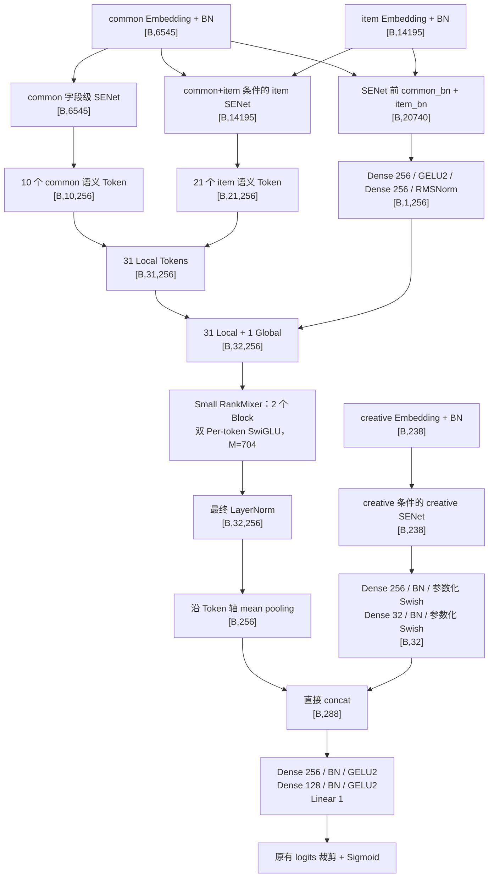

# cvr_bn_rankmixer_v6_e4：由 v6_e2_small 发展的 common/item 主干与 creative 旁路

模型代码：`src/models/rankmixer/cvr_bn_rankmixer_v6_e4.py`。
启动参数：`bash/set-rankmixer-v6-e4-args.txt`。
验证代码：`src/models/rankmixer/tests/test_rankmixer_v6_e4.py`。

## 1. 来源与实现边界

**v6-E4 由 `cvr_bn_rankmixer_v6_e2_small.py` 发展而来。**源文件开头明确记录了
这一来源。E4 是完整独立实现，原 v6-E2、v6-E2-Small 及其启动参数保持原样。

保留 Small 的三桶输入 BN、字段级 SENet、D=256、H=T=32、L=2、M=704 的双
Per-token SwiGLU、Mixing/Reverting、长残差、初始化和局部投影优化。

借用 `cvr_senet_mature_rankmixer_v5.py` 的 10 个 common + 21 个 item 语义字段分组。
读出参照 `cvr_senet_mixer_new_rk_distill_seq_aux_v5_replay.py`：RankMixer 末端
LayerNorm 后做 mean pooling，creative 经过两层 Dense/BN/参数化 Swish 后直接
拼接，再进入带 BN 的任务塔。

这是结构实验，不能把 E4 与 Small 的预测或 AUC 视为等价。

## 2. 固定配置与 Small 的变化

| 模块 | v6-E2-Small | v6-E4 |
|---|---|---|
| 字段 / Embedding | common 385、item 835、creative 14；E=17 | 相同 |
| 输入 BN | 三桶各自 BN | 相同 |
| SENet 粒度 | 每字段一个门控，隐层 128 | 相同 |
| common 门控条件 | common | common |
| item 门控条件 | common + item | common + item |
| creative 门控条件 | common + item + creative | **creative** |
| Local Token | 10 common + 20 item + 1 creative | **10 common + 21 item** |
| Local 投影 | 独立 Linear → GELU2 → RMSNorm | 相同 |
| Global 输入 | SENet 后的三桶全体字段，20978 维 | **SENet 前、BN 后的 common+item，20740 维** |
| Global 投影 | 输入 → 256 → 256 → RMSNorm | 相同结构 |
| 主干 | T=H=32，D=256，L=2，双 SwiGLU，M=704 | 相同 |
| Block 内归一化 | Per-token RMSNorm | 相同 |
| 最终归一化 | gamma 为 [32,256] 的 RMSNorm | **共享 gamma/beta [256] 的 LayerNorm** |
| 主干读出 | PureFlat，8192 维 | **32-token mean pooling，256 维** |
| creative 旁路 | 无 | **238 → 256 → 32** |
| CVR 任务塔 | 8192 → 2048 → 2048 → 256 → 1 | **288 → 256 → 128 → 1** |

E4 不采用 mature v5 的 Embedding 分量级 excitation2 SENet，也不替换成其 pSiLU
主干。这里的 SENet 和双 SwiGLU 均来自 Small。

## 3. 端到端流程与维度



### 3.1 字段级 SENet

三桶 BN 后分别 reshape 为 `[B,385,17]`、`[B,835,17]`、`[B,14,17]`，
沿 Embedding 轴取均值，得到 `m_u[B,385]`、`m_i[B,835]`、`m_c[B,14]`。

\[
q_u=m_u,\qquad q_i=[m_u,m_i],\qquad q_c=m_c,
\]

\[
h_b=\tanh(\operatorname{BN}(q_bW_{b,1})),\qquad
a_b=2\sigma(h_bW_{b,2}),\qquad
\widetilde E_{b,j,k}=E_{b,j,k}a_{b,j}.
\]

| 分支 | 第一层权重 | 第二层权重 | 门控输出 |
|---|---|---|---|
| common | [385,128] | [128,385] | [B,385] |
| item | [1220,128] | [128,835] | [B,835] |
| creative | [14,128] | [128,14] | [B,14] |

item 的门控条件来自 SENet 前的 common/item 摘要，加权目标只有 item。
creative 加权输出只供旁路使用。

### 3.2 语义 Token 与字段顺序

入口桶内顺序继续使用特征配置的字典顺序。SENet 后先按该顺序恢复
`feature_id -> [B,17]` 映射，再按 v5 的显式语义组 ID 收集字段。

| Token 下标 | 来源 | 每组字段数 | 组数 | 单组输入维度 |
|---|---|---:|---:|---:|
| 0–4 | common | 39 | 5 | 663 |
| 5–9 | common | 38 | 5 | 646 |
| 10–14 | item | 42 | 5 | 714 |
| 15–20 | item | 35 | 6 | 595 |
| 21–25 | item | 42 | 5 | 714 |
| 26–30 | item | 41 | 5 | 697 |
| 31 | global | common+item 全部字段 | 1 | 20740 |

每个局部组有独立的 `W_t[17*n_t,256]`、bias `[256]` 和 RMSNorm gamma `[256]`：

\[
z_t=\operatorname{RMSNorm}_t(\operatorname{GELU2}(x_tW_t+b_t)).
\]

同宽度组以五个 family 执行批量 MatMul：595/6、646/5、663/5、697/5、714/10。
第二个数字是该 family 的 Token 数。保留 Small 的投影前后转置和 `tf.unstack`
梯度优化；`rm_optimize_tokenize=false` 可以切回同一 E4 模型的逐 Token 切片路径。

源码仍保存 creative 的 14 字段清单，用于复用三桶完整性校验。它不生成 Local Token：
`_LOCAL_BUCKET_NAMES=('common','item')`，实际 `rm_bucket_token_counts=[10,21,0]`。
字段覆盖、重复、分组尺寸和冻结顺序 checksum 在构造阶段校验。

### 3.3 Global 与 RankMixer

Global 使用 `normalized_buckets` 中的 common/item，宽度为 `20740`：

\[
g=\operatorname{RMSNorm}
\left(\operatorname{GELU2}([U_{BN},I_{BN}]W_{g1}+b_{g1})W_{g2}+b_{g2}\right),
\]

其中 `W_g1[20740,256]`、`W_g2[256,256]`。

拼接为 `[B,32,256]` 后，Mixing 的维度变化为：

```text
[B,32,256] → [B,32,32,8] → 交换 Token/Head 轴 → [B,32,256]
```

每个 Block 保留 Small 的精确残差连接：

\[
U=Mix(X),\quad V=U+F_m(RMSNorm(U)),\quad R=Revert(V),
\]

\[
X'=X+F_o(RMSNorm(R)).
\]

两套独立 SwiGLU 都是 `256→704→256`，每套有 `W_up/W_gate[32,256,704]`
和 `W_down[32,704,256]`。上投影初始化保持 `1/sqrt(256)`，下投影保持
`rm_down_init_scale/sqrt(704)`，其中 `rm_down_init_scale=0.01`。

### 3.4 LayerNorm、池化、creative 与直接拼接

最终 LayerNorm 对每个 Token 的 256 个分量计算均值和方差：

\[
Y_{b,t,d}=\gamma_d\frac{X_{b,t,d}-\mu_{b,t}}
{\sqrt{v_{b,t}+10^{-8}}}+\beta_d.
\]

32 个 Token 共用 `gamma[256]` 和 `beta[256]`，分别初始化为 1 和 0。
Block 内的 RMSNorm 仍使用原来的 `rm_rms_epsilon=1e-6`。

\[
p=\frac1{32}\sum_{t=0}^{31}Y_{:,t,:}\in\mathbb R^{B\times256}.
\]

creative 的两层分别使用 `W_c1[238,256]` 和 `W_c2[256,32]`，每层顺序为
`Dense → BN → 参数化 Swish`：

\[
Swish_{\beta}(x)=x\odot\sigma(\beta\odot x).
\]

两层 Swish beta 是 `[256]`、`[32]` 的可训练变量，初始值为 `1.702`。
池化结果和最后一个 Swish 的输出直接拼接为 `[B,288]`。这里不额外增加分支
RMSNorm、LayerNorm 或缩放系数，与确认的 replay-v5 融合方式一致。

任务塔为 `288→256→128→1`。两个隐藏层都是 `Dense→BN→GELU2`；输出继续使用
Small 的 logits 裁剪、Sigmoid、fst-CVR 损失和评估协议。

## 4. 参数量

| 模块 | v6-E2-Small | v6-E4 |
|---|---:|---:|
| 输入 BN | 41,956 | 41,956 |
| 字段级 SENet | 522,112 | 365,952 |
| Local 投影与 RMSNorm | 5,386,240 | 5,325,312 |
| Global Token | 5,436,672 | 5,375,744 |
| 两个 RankMixer Block | 69,451,776 | 69,451,776 |
| 最终归一化 | 8,192 | 512 |
| Creative 旁路 | 0 | 70,272 |
| 任务塔 | 21,509,121 | 107,777 |
| **总计** | **102,356,069** | **80,739,301** |

Dense 可训练参数减少 **21,616,768，约 21.12%**。口径包括权重、bias、BN 的
gamma/beta、RMSNorm/LayerNorm 参数和 Swish beta，不含稀疏表、优化器状态、
指标变量与 BN moving statistics。

模型同时执行解析参数量校验和实际建图后的 trainable variable 总量校验；
预期总量为 `80739301`。两层 RankMixer 的主计算量保持原样，实际提速需要在
原服务器上测量，不能用参数减少比例直接折算整日训练时间。

## 5. 启动参数与原服务器环境

新参数入口为：

```text
models.rankmixer.cvr_bn_rankmixer_v6_e4.MLPModel
```

使用 `bash/set-rankmixer-v6-e4-args.txt` 提交独立 E4 任务。相对 Small 的 model_args
变化集中在以下配置：

```json
{
  "rm_readout_type": "mean_pool_creative",
  "rm_bucket_token_counts": [10, 21, 0],
  "rm_group_version": "rankmixer_v6_e4_common_item_semantic_v1",
  "rm_final_norm_type": "layer_norm",
  "rm_final_ln_epsilon": 1e-8,
  "creative_hidden_dim": 256,
  "creative_output_dim": 32,
  "cvr_layers": [256, 128]
}
```

`skip_tensors` / `warm_up_tensors` 的最终归一化 scope 更新为
`rm_final_layer_norm`，并加入 `rm_creative`；`enable_dense_warmup=false` 保持原值。
其余 model_args 不变。model_args 之外的参数逐行保留，包括原有训练/测试日期、
数据和 checkpoint 路径、batch size 2048、线程 32/8、PS 配置、NUMA、
`fast_matmul=true`、`opt_level=v1` 和 Flood 运行配置。

生产代码的 import 与 Small 相同，使用现有 Python 3 / TensorFlow 1.x / Flood。
LayerNorm 使用原生 `tf.nn.moments`、`tf.get_variable` 和 `tf.sqrt`；新增 Dense/BN
复用现有 `tf.contrib.layers.fully_connected` 与 `ModelBase.batch_norm_layer_v2`。
没有新增依赖，也没有导入参考文件里的 fused、phalanx 或 cayman 实现。

首次 E4 使用独立模型目录，参数保留 `ignore_dense_checkpoint=True` 和
`ignore_sparse_checkpoint=False`。由于字段分组、Global 输入和任务塔改变，
旧 Small 的 Dense checkpoint 不用于 E4 的整体热启动。后续 E4 续训沿现有 runner
协议加载 E4 自己的 checkpoint；稀疏表继续按原协议处理。

## 6. 验证范围与复现

在项目根目录运行：

```bash
python -m unittest discover -s src/models/rankmixer/tests \
  -p 'test_rankmixer_v6_e4.py' -v
```

本地在隔离的 Python 3.11.16 / TensorFlow 2.16.2 compat.v1 / FP32 CPU 环境完成
11 项测试，使用 32/8 线程。验证环境未安装到服务器。

- 8 项静态/契约测试：确认来源、原有 import、未改动的主干和生命周期方法、
  v5 精确语义分组、冻结字段顺序、参数量、Global 的 pre-SENet 输入、
  直接拼接、creative 两层 BN/Swish，以及启动参数的限定差异。
- 末端 LayerNorm：提取 replay 参考函数与 E4 的实际方法，使用相同的非默认
  gamma/beta，在随机输入和常量输入下逐数组严格比较，结果一致。
- SENet：单独关闭 BN，检查真实 TensorFlow 门控图的依赖关系为
  `common→common`、`common+item→item`、`creative→creative`；改变 creative
  输入不会改变另外两路的输出。该测试只验证门控路由，未覆盖 Flood BN 数值。
- Local Token：使用 3 个最大变量分片，覆盖 batch 1、3、7；同一 E4 参数下比较
  Unpack 路径与逐 Token 切片路径的输出、输入梯度和全部投影参数梯度。
  比较不使用 atol/rtol 容差，结果一致，优化路径没有 StridedSliceGrad。

数值测试直接执行源码方法和真实 TensorFlow 算子，未替换 TensorFlow 内核。
没有 TensorFlow 时数值测试会显示 skipped；只有 replay 参考文件缺失时，
对应的 LayerNorm 对照测试会显示 skipped。生产模型本身不依赖该参考文件。

这些结果不包含服务器完整 TF1/Flood 建图、BN 更新、HDFS/稀疏 PS、完整训练步、
checkpoint 导出或实际 AUC/吞吐验证。服务器首次运行应核对模型日志中的
`input_tokens=[B,32,256]`、`pooled=[B,256]`、`creative=[B,32]`、`context=[B,288]`
和实际 Dense 参数量 `80739301`，再按原评估协议记录训练吞吐和模型指标。
