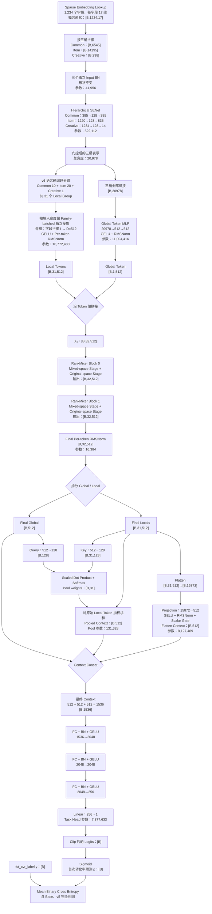
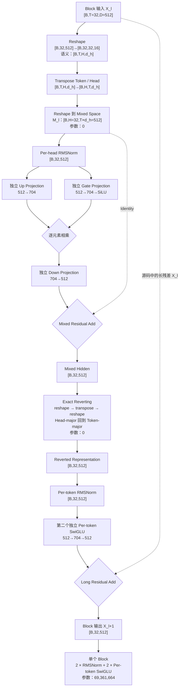

# RankMixer v6：语义分组与 512 维主干

## 1. 模型概览

RankMixer v6 是面向搜索场景首次转化率预估的单任务模型。它与 v5 使用完全相同的 1,234 个稀疏输入字段、`fst_cvr_label` 和 BCE 目标，主要改动只有两项：

1. Local Token 的字段成员由 v5 的“稳定哈希均衡混合”改为“语义约束、容量均衡”的硬编码分组。
2. RankMixer hidden dimension 从 `D=1024` 降为 `D=512`，其余主干超参数保持不变。

当前核心配置如下：

| 配置项 | v6 取值 |
|---|---:|
| 输入字段 | Common 385 + Item 835 + Creative 14 = 1,234 |
| Field Embedding | 17 |
| Local / Global Token | 31 / 1 |
| 总 Token 数 `T` | 32 |
| Head 数 `H` | 32 |
| Token hidden dimension `D` | 512 |
| Head dimension `d_h=D/H` | 16 |
| RankMixer Block 数 `L` | 2 |
| Per-token SwiGLU hidden `M` | 704 |
| Pool Query/Key dimension | 128 |
| Flatten Readout dimension | 512 |
| CVR Task Head | `1536 → 2048 → 2048 → 256 → 1` |
| 训练目标 | 单一 first-CVR BCE |
| Dense 可训练参数量 | **177,217,126（177.217126M）** |

对应实现：

- [`cvr_bn_rankmixer_v6.py`](../src/models/rankmixer/cvr_bn_rankmixer_v6.py)
- [`set-rankmixer-v6-args.txt`](../bash/set-rankmixer-v6-args.txt)

---

## 2. v6 端到端算法流程图

关键的数据形状主链为：

\[
[B,1234,17]
\rightarrow [B,31,512]\oplus[B,1,512]
\rightarrow [B,32,512]
\rightarrow [B,32,512]
\rightarrow [B,1536]
\rightarrow [B,1]
\]

---

## 3. v6 的 31 个语义 Local Token

v6 不在运行时进行哈希、排序或重新分组。下面的字段成员和 Token 顺序直接冻结在 Python 代码中，属于模型输入 ABI。

### 3.1 Common：10 个 Token

| 序号 | 硬编码组名 | 语义 | 字段数 |
|---:|---|---|---:|
| C0 | `common_user_profile_device_geo_lifecycle` | 用户画像、设备、地域和生命周期 | 39 |
| C1 | `common_user_order_consumption_value` | 用户下单、购买和消费价值 | 39 |
| C2 | `common_user_purchase_price_recency` | 历史购买价格、行为时距和复购 | 39 |
| C3 | `common_longterm_view_exposure_interest` | 长期浏览、曝光和实体兴趣 | 39 |
| C4 | `common_longterm_click_fav_interest` | 长期点击、收藏、停留和行为兴趣 | 39 |
| C5 | `common_query_text_intent` | Query 文本、NER、词项和搜索意图 | 38 |
| C6 | `common_query_retrieval_relevance` | Query 召回、命中和相关性上下文 | 38 |
| C7 | `common_realtime_session_action` | 实时会话动作和短周期行为 | 38 |
| C8 | `common_shortterm_candidate_funnel` | 短期曝光、点击和候选漏斗 | 38 |
| C9 | `common_shortterm_funnel_page_context` | 页面、位置、时间和搜索会话上下文 | 38 |

### 3.2 Item：20 个 Token

| 序号 | 硬编码组名 | 语义 | 字段数 |
|---:|---|---|---:|
| I0 | `item_goods_category_brand_identity` | 商品、类目、品牌和候选身份 | 42 |
| I1 | `item_shop_static_quality_service` | 店铺静态质量和服务 | 42 |
| I2 | `item_title_query_lexical_ner` | 标题、Query 词法和 NER | 42 |
| I3 | `item_semantic_category_relevance` | 语义、类目和相关性 | 42 |
| I4 | `item_image_video_embedding_similarity` | 图片、视频、Embedding 相似度 | 42 |
| I5 | `item_current_price_supply` | 当前价格、购买力和供给 | 42 |
| I6 | `item_coupon_promotion_discount` | 优惠券、活动、促销和折扣 | 42 |
| I7 | `item_user_purchase_price_preference` | 用户购买价格偏好 | 42 |
| I8 | `item_user_view_click_price_preference` | 用户浏览、点击价格偏好 | 42 |
| I9 | `item_price_gap_rank_competitiveness` | 价格差、价格排序和商品竞争力 | 42 |
| I10 | `item_goods_category_global_funnel` | 商品、类目全局漏斗统计 | 42 |
| I11 | `item_shop_brand_global_quality` | 店铺、品牌全局质量 | 42 |
| I12 | `item_purchase_order_fav_affinity` | 购买、下单、收藏亲和度 | 42 |
| I13 | `item_longterm_exposure_view_affinity` | 长期曝光、浏览亲和度 | 42 |
| I14 | `item_click_stay_engagement` | 点击、停留和参与度 | 42 |
| I15 | `item_shortterm_candidate_funnel` | 短期候选曝光点击漏斗 | 41 |
| I16 | `item_session_page_position_context` | 当前会话、页面和位置上下文 | 41 |
| I17 | `item_i2i_graph_neighbor_recall` | i2i、图关系和邻居召回 | 41 |
| I18 | `item_u2i_q2i_query_recall` | u2i、q2i 和 Query 触发召回 | 41 |
| I19 | `item_recall_source_hit_rank_path` | 召回源、命中、排序和路径 | 41 |

### 3.3 Creative：1 个 Token

| 序号 | 硬编码组名 | 语义 | 字段数 |
|---:|---|---|---:|
| A0 | `creative_display_offer` | 创意图片、展示形态和促销表达 | 14 |

分组满足以下约束：

- Common / Item / Creative 桶边界不变，不允许跨桶。
- 1,234 个字段恰好出现一次，无缺失、无重复。
- Token 容量与 v5 完全相同，因此分组变化不会引入由组宽失衡导致的额外参数差异。
- 启动参数通过 `rm_group_version=rankmixer_v6_semantic_balanced_v1` 固定分组版本。
- 模型启动时同时检查组大小、字段覆盖关系和字段顺序 SHA256。

当前校验和：

| Bucket | SHA256 |
|---|---|
| Common | `61602847a993a6103b9c21b4d6ff2d1817a848d8717e7b201eea4be6fc29bda3` |
| Item | `0517491a05e73f3aac890cc3f9ab900b795da05011914c842c2715ff30af49e3` |
| Creative | `956056a173d6daa8b62602b62bf9bd83c638e362c6824aa9cd2ef1300490d10c` |

---

## 4. RankMixer Block 块内流程图

v6 与 v5 使用相同的 Block 算法，只把 `D` 从 1024 改为 512。由于仍然满足 `H=T=32`，Mixing 后最后一维仍为 512。

块内公式为：

\[
M_l=\operatorname{Mix}(X_l)
\]

\[
\widetilde M_l=M_l+
\operatorname{SwiGLU}_{mix}
\left(\operatorname{RMSNorm}_{mix}(M_l)\right)
\]

\[
R_l=\operatorname{Revert}(\widetilde M_l)
\]

\[
X_{l+1}=X_l+
\operatorname{SwiGLU}_{token}
\left(\operatorname{RMSNorm}_{token}(R_l)\right)
\]

需要特别注意：最终长残差来自原始块输入 `X_l`，不是 `R_l`。`R_l` 负责为第二个 SwiGLU 提供融合后的条件信息。

单个 Per-token SwiGLU 的参数量为：

\[
32\times
\left(3\times512\times704+2\times704+512\right)
=34,664,448
\]

加上 `[32,512]` 的 RMSNorm gamma 后，一个 Stage 为 `34,680,832`；一个 Block 有两个 Stage，因此为 `69,361,664`；两层 Block 合计：

\[
2\times69,361,664=\boxed{138,723,328}
\]

---

## 5. v6 与 v5 的主要区别

| 对比项 | v5 | v6 | 直接影响 |
|---|---|---|---|
| 字段分组依据 | 先用固定盐稳定哈希做容量均衡，最终字段列表冻结在代码中；Token 内语义是混合的 | 依据用户、Query、价格、行为、召回等语义人工划分，并将字段成员直接硬编码 | 每个 Local Token 具有稳定、可解释的业务语义，降低不相关字段在投影前过早混合的风险 |
| 分组版本 | `rankmixer_v5_balanced_v1` | `rankmixer_v6_semantic_balanced_v1` | 防止启动配置误用另一套字段 ABI |
| Local Token 数量 | 31 | 31 | 不变 |
| 每组容量 | Common 39/38；Item 42/41；Creative 14 | 完全相同 | 参数变化只来自 `D`，不是字段数量或组宽变化 |
| Hidden dimension `D` | 1024 | 512 | 主干宽度减半 |
| Head dimension `D/H` | 32 | 16 | 每个 Head 承载的子空间宽度减半 |
| 主干 Token 形状 | `[B,32,1024]` | `[B,32,512]` | RankMixer 激活和投影宽度下降 |
| Local Token 形状 | `[B,31,1024]` | `[B,31,512]` | Local 投影参数约减半 |
| Global Token 形状 | `[B,1,1024]` | `[B,1,512]` | Global MLP 中 `D²` 部分下降更明显 |
| Flatten 输入 | `[B,31744]` | `[B,15872]` | Flatten 投影参数约减半 |
| 最终 Context | 1024 + 1024 + 512 = 2560 | 512 + 512 + 512 = 1536 | 任务头第一层输入减少 1024 维 |
| Task Head | `2560→2048→2048→256→1` | `1536→2048→2048→256→1` | 后三层不变，第一层减少 2,097,152 个参数 |
| Dense 可训练参数 | 348,432,486 | **177,217,126** | 减少 171,215,360，下降 **49.14%** |
| FP32 参数存储 | 约 1.394 GB | 约 0.709 GB | 仅参数本体减少约 0.685 GB，不包含梯度和优化器状态 |

### 5.1 分模块参数变化

| 模块 | v5 | v6 | 变化 |
|---|---:|---:|---:|
| 三个输入 Bucket BN | 41,956 | 41,956 | 0 |
| Hierarchical SENet | 522,112 | 522,112 | 0 |
| 31 个 Local Token | 21,544,960 | 10,772,480 | -10,772,480 |
| Global Token MLP | 22,533,120 | 11,004,416 | -11,528,704 |
| 2 个 RankMixer Block | 277,266,432 | 138,723,328 | -138,543,104 |
| Final RMSNorm | 32,768 | 16,384 | -16,384 |
| Global-conditioned Pool | 262,400 | 131,328 | -131,072 |
| Flatten Readout | 16,253,953 | 8,127,489 | -8,126,464 |
| CVR Task Head | 9,974,785 | 7,877,633 | -2,097,152 |
| **总计** | **348,432,486** | **177,217,126** | **-171,215,360** |

v6 的参数下降主要来自两层 RankMixer Block。虽然 `M=704` 不变，但 SwiGLU 的三组主权重都与 `D` 成线性关系，因此 `D` 减半后 Block 参数接近减半。

---

## 6. 与 v5 相同的部分

以下部分只做简要列举：

- 输入字段集合、每字段 17 维 Embedding、Common/Item/Creative 三桶边界不变。
- 三桶 Input BN 和 Hierarchical SENet 不变。
- `T=32`、`H=32`、`L=2`、`M=704` 不变。
- Mixing/Reverting 仍然是零参数的 reshape 与 transpose。
- 每个 Block 仍包含 Mixed-space 和 Original-space 两个独立 Per-token SwiGLU Stage。
- 仍使用 PreNorm、RMSNorm、Mixed residual 和从 `X_l` 出发的 long residual。
- Global-conditioned Pool、Flatten Readout 和 scalar gate 的算法不变。
- Task Head 的隐藏层 `[2048,2048,256]`、BN、GELU 和单 Logit 输出不变。
- 输入、输出和训练任务不变；损失仍只有与 Base 一致的 first-CVR BCE，没有增加辅助损失或多任务目标。

---

## 7. 设计意图与实验解释

v6 同时引入了“语义分组”和“主干降维”两项变化，因此相对 v5 的 AUC 变化不能直接归因于其中某一项：

- 语义分组的目标是让每个 Local Token 的初始投影在相对一致的业务子空间内学习，减少稳定哈希带来的语义碰撞。
- `D=512` 的目标是在保留 32 Token、两层双 Stage RankMixer 的前提下，降低优化难度、显存和单步计算开销。
- 512 维并没有减少字段、Token、Block 或 SwiGLU 中间维度，模型仍保留完整的跨 Token Mixing 路径和增强读出路径。

如果需要严格判断收益来源，后续最干净的消融矩阵是：

| 实验 | 分组 | D | 用途 |
|---|---|---:|---|
| v5 | 稳定哈希均衡 | 1024 | 当前参照 |
| v6 | 语义均衡 | 512 | 当前方案 |
| v6-group-only | 语义均衡 | 1024 | 单独测量语义分组收益 |
| v6-width-only | 稳定哈希均衡 | 512 | 单独测量降维影响 |

当前优先目标是快速验证 v6 是否超过 Base，因此可先训练正式 v6；只有在 AUC 结果难以解释或接近噪声区间时，再补两个消融实验。

---

## 8. Checkpoint 注意事项

v6 不应直接恢复旧 v5 或旧分组 v6 的 Dense 权重：

- `D` 从 1024 变为 512，多个变量 Shape 已发生变化。
- 即使部分变量 Shape 相同，语义分组改变后，相同 Token index 的字段含义也已经不同。
- 稀疏 Embedding 的字段 ID 和维度没有变化，可以继续复用符合现有训练流程的稀疏参数。
- RankMixer、BN、SENet、Readout 和任务头应按照当前启动配置冷启动，并使用新的实验目录或任务标识，避免 `auto_load_cp` 命中旧 v6 checkpoint。

