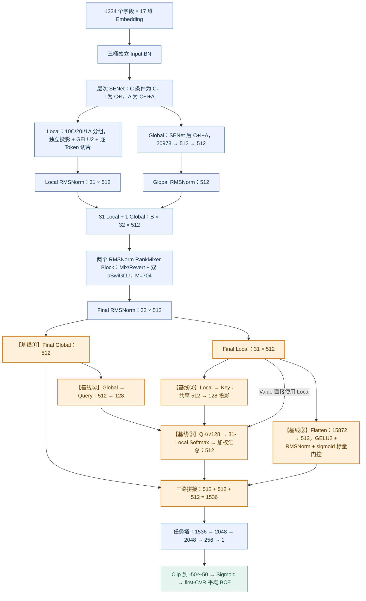
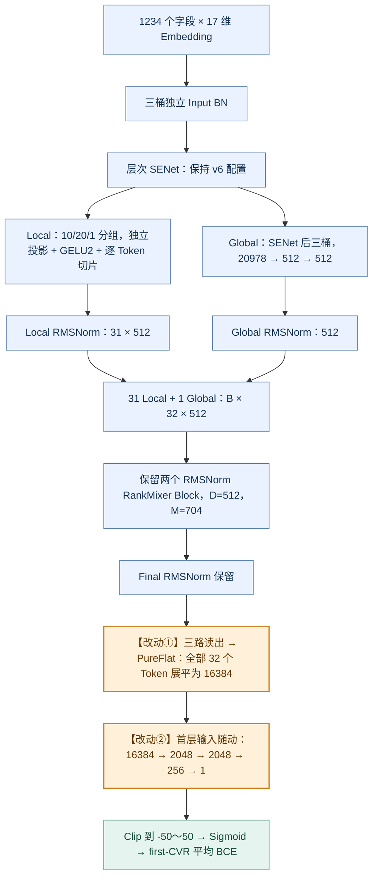
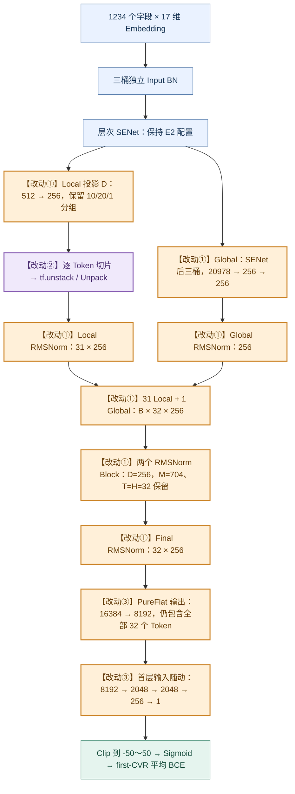
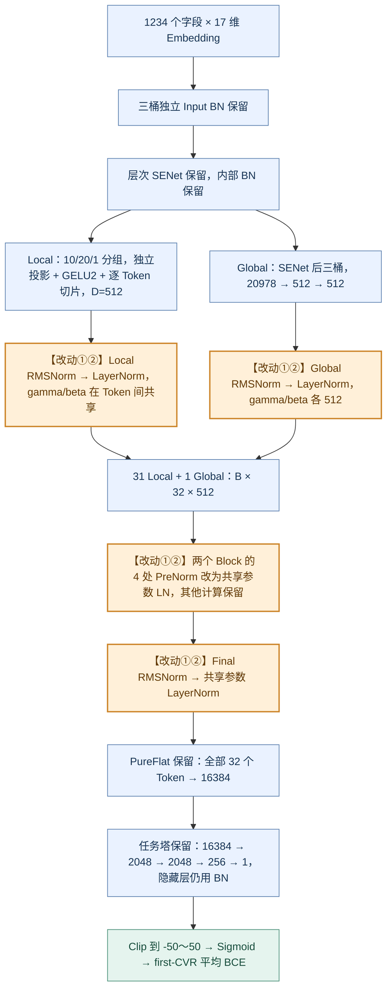
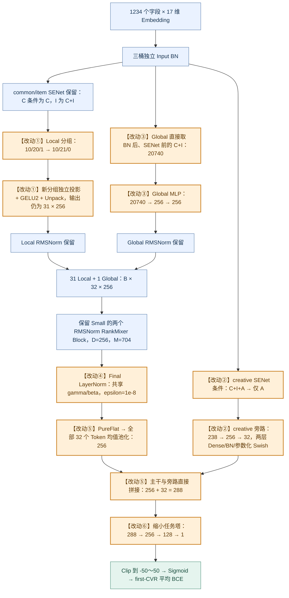

# RankMixer v6 系列：方案差异与整体流程

| 方案 | 直接对照 | 核心改动 | D / Context 维度 | 任务塔隐藏层 | Dense 可训练参数 |
|---|---|---|---|---|---:|
| **v6** | 本组基线 | Global、条件 Pool、门控 Flatten 三路读出 | 512 / 1536 | 2048 → 2048 → 256 | 177,217,126 |
| **v6-E2** | v6 | 三路读出替换为 PureFlat，任务塔首层输入随之改变 | 512 / 16384 | 2048 → 2048 → 256 | 199,367,013 |
| **v6-E2-Small** | E2 | D 从 512 缩为 256；增加 Unpack 执行优化 | 256 / 8192 | 2048 → 2048 → 256 | 102,356,069 |
| **v6-E3** | E2 | 7 处 RMSNorm 替换为 LayerNorm，并改变仿射参数共享方式 | 512 / 16384 | 2048 → 2048 → 256 | 199,275,877 |
| **v6-E4** | E2-Small | 重组 Local/Global 输入与 creative 旁路； Final LN + Mean Pool + 小任务塔 | 256 / 288 | 256 → 128 | 80,739,301 |

**共同设置：**C、I、A 分别表示 common、item、creative，字段数为 385、835、14；每字段 Embedding 为 17 维。五版均使用 31 个 Local Token + 1 个 Global Token、2 个 RankMixer Block、T=H=32、SwiGLU 中间维度 M=704，预测 first-CVR。训练日期按运行时已统一处理。参数量包括 Dense 权重、bias、BN/Norm 仿射参数及可训练门控/激活参数，不包括 Sparse Embedding 表、优化器状态和 BN 移动统计量。

**读图方式：**蓝色表示保留的算子与配置，橙色表示结构或维度变化，紫色表示执行优化，绿色表示共用预测与损失。图中“改动①、②……”与该章说明逐项对应；v6 作为基线，用橙色标出后续被 E2 替换的读出部分。任务塔隐藏层均为 Dense → BN → GELU2，输出层为 Linear。GELU2 指源码中的 tanh 近似 GELU。

## 1. v6：增强三路读出基线

**改动说明**

v6 是本组比较的起点，后续 E2 主要替换它的三路读出。

- **基线①：Final Global。**直接取第 32 个 Token，得到 512 维表示。
- **基线②：Global-conditioned Pool。**Global 生成 128 维 Query，31 个 Local 通过共享投影生成 128 维 Key；对 31 个 Local 做 Softmax 加权汇总，得到 512 维表示。Value 直接使用 Local Token。
- **基线③：门控压缩 Flatten。**31 个 Local 按固定顺序展平为 15872 维，经过 15872→512 投影、GELU2、RMSNorm，再乘一个可训练标量门控。三路拼接为 1536 维 Context。

令最终 Norm 输出为 $Y=[y_0,\ldots,y_{30},y_g]$，$Y_L=[y_0,\ldots,y_{30}]$。读出公式为：

$$
\begin{aligned}
q&=y_gW_Q+b_Q,\qquad k_t=y_tW_K+b_K,\qquad W_Q,W_K\in\mathbb R^{512\times128},\\
\alpha_t&=\operatorname{softmax}_t\!\left(\frac{qk_t^\top}{\sqrt{128}}\right),\qquad
c_{\rm pool}=\sum_{t=0}^{30}\alpha_ty_t,\\
c_{\rm flat}&=\sigma(a)\operatorname{RMSNorm}\!\left(\operatorname{GELU2}(\operatorname{vec}(Y_L)W_F+b_F)\right),\\
c_{\rm v6}&=[y_g;c_{\rm pool};c_{\rm flat}]\in\mathbb R^{B\times1536}.
\end{aligned}
$$

其中 $W_F\in\mathbb R^{15872\times512}$，$a$ 为可训练标量，初始值为 −2。

作为后续方案保留或调整的主干，一个 Block 的实际计算为：

$$
\begin{aligned}
U&=P(X),\\
R&=P^{-1}\!\left(U+F_{\rm mix}(N_{\rm mix}(U))\right),\\
X_{\rm next}&=X+F_{\rm orig}(N_{\rm orig}(R)).
\end{aligned}
$$

$P/P^{-1}$ 分别为 Mixing/Reverting，v6 中 $N$ 为 RMSNorm。两套 $F$ 均为逐 Token 独立的 SwiGLU：$F(h)=[(hW_u+b_u)\odot\operatorname{SiLU}(hW_g+b_g)]W_d+b_d$，宽度为 512→704→512；两套参数独立，末次加法使用该 Block 的原始输入 $X$。两层 Block 后再做 Final RMSNorm。

**整体流程图**

## 2. v6-E2：三路读出替换为 PureFlat

**改动说明**

直接对照 **v6**。

- **改动①：整体替换读出。**删除 v6 的 Q/K 条件 Pool、压缩 Flatten 分支及其 RMSNorm/标量门控、三路拼接，改为将最终全部 32 个 Token 展平。最后一个 Global Token 也包含在内。
- **改动②：任务塔输入随动。**Context 从 1536 变为 16384，因此首层权重由 1536×2048 改为 16384×2048；隐藏层仍为 2048/2048/256。

$$
c_{\rm E2}=\operatorname{vec}(Y)\in\mathbb R^{B\times(32\cdot512)}
=\mathbb R^{B\times16384}.
$$

输入、SENet、分组、两个 Block 与全部 RMSNorm 沿用 v6。**这条对照衡量完整读出接口替换的效果，包含任务塔首层容量随接口变化的影响。**

**整体流程图**

## 3. v6-E2-Small：D 减半与 Unpack 执行优化

**改动说明**

直接对照 **E2**。

- **改动①：D 从 512 缩为 256。**Local 投影、Global MLP、各处 RMSNorm 参数形状以及 Block 输入/输出宽度同步改变。T=H=32、Block 数为 2、M=704 保留，因此每 Head 宽度为 16→8，SwiGLU 为 512→704→512 改成 256→704→256。
- **改动②：Token 拆分执行优化。**相同输入宽度的分组先批量计算投影，再由 `tf.unstack(..., axis=1)` 拆出 Token，替代逐 Token `[:, j, :]` 切片；投影权重仍逐 Token 独立。默认开启，`rm_optimize_tokenize=false` 可恢复切片路径。
- **改动③：读出与任务塔接口随动。**仍使用全部 32 个 Token 的 PureFlat，Context 为 16384→8192；任务塔隐藏层宽度保留，仅首层输入随之减半。

$$
c_{\rm Small}=\operatorname{vec}(Y_{256})\in\mathbb R^{B\times8192},
\qquad W_{u,t},W_{g,t}\in\mathbb R^{256\times704},\quad W_{d,t}\in\mathbb R^{704\times256}.
$$

对于 family 输出 $Z\in\mathbb R^{B\times N\times256}$，Unpack 满足 $\operatorname{Unpack}(Z)_j=Z[:,j,:]$。**数值等价是指相同 D=256、输入与权重下的两种拆分方式；比较吞吐时，D 缩小与 Unpack 应分别归因。**

**整体流程图**

## 4. v6-E3：RMSNorm 替换为 LayerNorm

**改动说明**

直接对照 **E2**，D 保持 512。

- **改动①：替换 7 处 Norm 调用。**Local 1 处、Global 1 处、两个 Block 内各 2 处、Final 1 处，全部由 RMSNorm 改为 LayerNorm。Block 中的 Mixing、SwiGLU 与残差连接保留。
- **改动②：改变仿射参数共享。**多 Token Norm 的逐 Token `gamma[T,D]` 改为 Token 间共享的 `gamma[D]+beta[D]`；Global Norm 由 `gamma[D]` 改为 `gamma[D]+beta[D]`。Norm 总参数减少 91,136。

以多 Token 输入的第 t 个 Token 为例，归一化沿 D 维计算：

$$
\begin{aligned}
\operatorname{RMSNorm}(x_t)
&=\gamma_t\odot\frac{x_t}{\sqrt{\frac1D\sum_d x_{t,d}^2+10^{-6}}},\\
\operatorname{LayerNorm}(x_t)
&=\gamma\odot\frac{x_t-\mu_t}{\sqrt{\frac1D\sum_d(x_{t,d}-\mu_t)^2+\epsilon_{\rm backend}}}+\beta,
\qquad \mu_t=\frac1D\sum_d x_{t,d}.
\end{aligned}
$$

E3 的实际 epsilon 使用 LayerNorm 后端默认值，`rm_rms_epsilon` 不决定该路径。三桶 Input BN、SENet 内部 BN、任务塔 BN 均保留，读出仍为 $c_{\rm E3}=\operatorname{vec}(Y_{\rm LN})\in\mathbb R^{B\times16384}$。**这条对照比较整套 Norm 方案，包含中心化、仿射参数共享、beta 以及 epsilon/实现后端的变化。**

**整体流程图**

## 5. v6-E4：common/item 主干与 creative 旁路重组

**改动说明**

直接对照 **E2-Small**。

- **改动①：Local 分组变为 10/21/0。**creative 不再生成 Local Token，主干使用 1220 个 common/item 字段。原有 5 个各含 42 字段的 item 组分别保留前 35 字段，将各组末尾 7 字段汇成新的 35 字段组；因此 item 为 20→21 组，Local 总数仍为 31。分组投影的输入宽度和语义随之改变，输出 D=256 保留。
- **改动②：creative 改走独立旁路。**其 SENet 条件由 C+I+A 改为仅 A；SENet 后的 238 维 creative 经过 238→256→32 两层 Dense/BN/参数化 Swish，在读出后与主干融合。Swish 的逐通道参数可训练，初始值为 1.702。
- **改动③：Global 输入改为 SENet 前的 C+I。**从 Input BN 后直接取 20740 维 common/item，替代 Small 的 SENet 后 C+I+A 共 20978 维；Global MLP 变为 20740→256→256。
- **改动④：仅 Final Norm 改为 LayerNorm。**使用共享 `gamma[256]+beta[256]`，epsilon=1e−8。Local、Global、两个 Block 内仍为 RMSNorm。
- **改动⑤：PureFlat 改为均值池化与旁路拼接。**全部 32 个 Token，包括 Global，平均成 256 维；与 creative 旁路的 32 维直接拼为 288 维 Context，拼接前没有额外分支 Norm 或门控。
- **改动⑥：缩小任务塔。**8192→2048→2048→256→1 改为 288→256→128→1，隐藏层数量和宽度同时改变。

令 $X^{(2)}$ 为两层 RMSNorm Block 的输出，$\widetilde x^A$ 为 creative-only SENet 的输出，则：

$$
\begin{aligned}
Y_{\rm E4}&=\operatorname{LayerNorm}_{\epsilon=10^{-8}}(X^{(2)}),\\
c_{\rm main}&=\frac1{32}\sum_{t=0}^{31}Y_{{\rm E4},:,t,:}\in\mathbb R^{B\times256},\\
r_1&=\operatorname{Swish}_{\beta_1}\!\left(\operatorname{BN}_1(\widetilde x^AW_1+b_1)\right)\in\mathbb R^{B\times256},\\
r_2&=\operatorname{Swish}_{\beta_2}\!\left(\operatorname{BN}_2(r_1W_2+b_2)\right)\in\mathbb R^{B\times32},\\
c_{\rm E4}&=[c_{\rm main};r_2]\in\mathbb R^{B\times288},\qquad
\operatorname{Swish}_{\beta}(x)=x\odot\sigma(\beta\odot x).
\end{aligned}
$$

两个 RankMixer Block 的 D=256、M=704、H=T=32、SwiGLU 与残差结构沿用 Small。**E4 同时实施以上六组结构变化，属于整体方案对照；其效果需要由补充的中间对照拆分到具体组件。**

**整体流程图**

