# Semantic RankMixer v7：门控残差 MLP Task Adapter 方案介绍

本文以当前仓库中的实际实现和默认启动参数为准：

- v7 模型：[cvr_bn_rankmixer_v7.py](../src/models/rankmixer/cvr_bn_rankmixer_v7.py)
- v3 基线：[cvr_bn_rankmixer_v3.py](../src/models/rankmixer/cvr_bn_rankmixer_v3.py)
- v7 参数：[set-rankmixer-v7-args.txt](../bash/set-rankmixer-v7-args.txt)
- v3 详细说明：[rankmixer_v3_introduction.md](./rankmixer_v3_introduction.md)

默认结构超参数如下：

```text
Token 数 T = 16
隐藏维度 D = 768
RankMixer 层数 L = 2
Head 数 H = 16
PFFN 扩张倍数 = 2，即 768 → 1,536 → 768
Task Adapter 瓶颈维度 A = 256
```

> 核心结论：v7 是对 v3 的直接升级。v3 从特征 lookup 到 `Residual Fusion` 的全部结构保持不变；v7 只在融合后的 `context [B,768]` 与原输出层 `rm_out_v2` 之间，增加一个 `768 → 256 → 768` 的门控残差 MLP Task Adapter。

---

## 1. v7 与 v3 的区别

| 对比项 | v3 | v7 |
|---|---|---|
| RankMixer 后处理 | `Residual Fusion → Linear(768,1)` | `Residual Fusion → Task Adapter → Linear(768,1)` |
| 融合后输入 | `z ∈ ℝ^(B×768)` | `z ∈ ℝ^(B×768)` |
| 新增非线性变换 | 无 | `768 → 256 → 768` |
| Adapter 激活 | 无 | `GELU2` |
| Adapter 残差 | 无 | `z + α · r` |
| Adapter 门控 | 无 | `α = sigmoid(gate_logit)` |
| 门控初值 | 无 | `gate_logit = -3.0`，`α₀ ≈ 0.0474` |
| Adapter 归一化 | 无 | 上投影后 LayerNorm；残差相加后再 LayerNorm |
| 输出层 | `rm_out_v2: 768 → 1` | 完全保留 `rm_out_v2: 768 → 1` |
| 新增变量 scope | 无 | `rm_task_adapter/*` |
| 新增固定稠密参数 | 0 | **397,313** |
| 关闭新增能力 | 不适用 | `rm_use_task_adapter=false`，主路径退化为 v3 |

v3 在 `Residual Fusion` 后直接使用一个线性层输出 logit。这个线性层只能对 768 个融合特征做一次线性加权。v7 的 Task Adapter 则允许模型在输出前学习一组任务相关的非线性特征组合，同时通过小初值门控和残差连接保护已经验证有效的 v3 表示。

### 1.1 v3 输出路径

```text
Residual Fusion
z [B,768]
    ↓ Linear(768,1)
logit [B,1]
    ↓ reshape + clip
logits [B]
    ↓ sigmoid
prediction [B]
```

### 1.2 v7 输出路径

```text
Residual Fusion
z [B,768]
    ↓ 门控残差 MLP Task Adapter：768 → 256 → 768
z_v7 [B,768]
    ↓ 原 rm_out_v2：Linear(768,1)
logit [B,1]
    ↓ reshape + clip
logits [B]
    ↓ sigmoid
prediction [B]
```

---

## 2. v3 与 v7 相同的部分（简述）

v7 完整保留 v3 的以下结构和默认维度：

| 模块 | v3 / v7 共用的数据流 |
|---|---|
| 稀疏特征 | 1,234 个字段，每字段 embedding 维度为 17 |
| 三桶输入 | common：`[B,6545]`；item：`[B,14195]`；creative：`[B,238]` |
| 输入处理 | 每桶 BatchNorm；默认启用层级 SENet |
| 语义分组 | common 5 组 + item 10 组 + creative 1 组，共 16 组 |
| Token 投影 | 每个语义组独立投影到 768 维 |
| Token 序列 | `X₀ = [B,16,768]` |
| RankMixer | 2 个 Block；每个 Block 都保持 `[B,16,768]` |
| Token Mixing | 纯 reshape / transpose，不做 K-Q 注意力、不增加参数 |
| Per-token FFN | 每个 token 独立执行 `768 → 1536 → 768` |
| 聚合主路 | Gated Pooling：`[B,16,768] → [B,768]` |
| 显式交叉支路 | Bucket Cross：`[B,16,768] → [B,4608] → [B,768]` |
| Residual Fusion | `LayerNorm(pool_context + cross_residual) → [B,768]` |
| 输出与训练 | 保留 `rm_out_v2`、logit clip、sigmoid、原损失和指标 |

v7 也没有引入 v4、v5 或 v6 的其他结构，因此本文件中的版本号表示“以 v3 为基线增加 Task Adapter”，不是把 v4～v6 的改动累计进来。

---

## 3. v7 完整算法流程图

图中 `B` 表示 batch size。蓝色节点是 v3 与 v7 完全共用的主干，紫色节点是新旧版本的分界点 `Residual Fusion`，橙色节点是 v7 新增的 Task Adapter。

```mermaid
flowchart TB
    A["Feature Lookup<br/>1,234 个稀疏字段 × 17 维"]

    subgraph SHARED_INPUT["v3 / v7 共用：三桶输入与语义 Token 化"]
        direction TB
        B1["common<br/>385 × 17 = 6,545<br/>[B,6545]"]
        B2["item<br/>835 × 17 = 14,195<br/>[B,14195]"]
        B3["creative<br/>14 × 17 = 238<br/>[B,238]"]

        C1["BatchNorm + Hierarchical SENet<br/>[B,6545] → [B,6545]"]
        C2["BatchNorm + Hierarchical SENet<br/>[B,14195] → [B,14195]"]
        C3["BatchNorm + Hierarchical SENet<br/>[B,238] → [B,238]"]

        D1["common：5 个语义组<br/>输入宽度 272 / 1530 / 1564 / 1445 / 1734"]
        D2["item：10 个语义组<br/>输入宽度 1666 / 1207 / 986 / 1020 / 2142<br/>1241 / 782 / 2278 / 561 / 2312"]
        D3["creative：1 个语义组<br/>输入宽度 238"]

        E1["5 个独立 Linear + GELU2<br/>每组 [B,dᵢ] → [B,768]"]
        E2["10 个独立 Linear + GELU2<br/>每组 [B,dᵢ] → [B,768]"]
        E3["1 个独立 Linear + GELU2<br/>[B,238] → [B,768]"]

        F["按固定顺序 stack<br/>X₀ = [B,16,768]"]
    end

    A --> B1
    A --> B2
    A --> B3
    B1 --> C1 --> D1 --> E1 --> F
    B2 --> C2 --> D2 --> E2 --> F
    B3 --> C3 --> D3 --> E3 --> F

    subgraph SHARED_RM["v3 / v7 共用：2 层 RankMixer 主路"]
        direction TB
        G1["Multi-Head Token Mixing<br/>[B,T=16,D=768]<br/>→ [B,T,H=16,48]<br/>→ [B,H,T,48]<br/>→ [B,16,768]"]
        G2["Residual Add + LayerNorm<br/>[B,16,768]"]
        G3["Per-token FFN<br/>[B,16,768] → [B,16,1536]<br/>→ [B,16,768]"]
        G4["Residual Add + LayerNorm<br/>Block 1 输出 [B,16,768]"]
        G5["Block 2：重复 Token Mixing + PFFN<br/>[B,16,768] → [B,16,768]"]
        G6["Gated Pooling 打分<br/>Linear 768 → 1<br/>scores [B,16,1]"]
        G7["沿 16 个 Token 做 Softmax<br/>weights [B,16,1]"]
        G8["加权求和<br/>pool_context [B,768]"]
    end

    F --> G1 --> G2 --> G3 --> G4 --> G5 --> G6 --> G7 --> G8

    subgraph SHARED_CROSS["v3 / v7 共用：三桶显式交叉支路"]
        direction TB
        H1["对原始 Token 分桶求均值<br/>common / item / creative<br/>3 × [B,768]"]
        H2["三组逐元素乘积<br/>common×item / common×creative / item×creative<br/>3 × [B,768]"]
        H3["拼接 3 个桶向量 + 3 个交叉向量<br/>[B,6×768] = [B,4608]"]
        H4["Projection + GELU2<br/>[B,4608] → [B,768]"]
        H5["LayerNorm + sigmoid(cross_gate)<br/>cross_residual [B,768]"]
    end

    F --> H1
    H1 --> H2
    H1 --> H3
    H2 --> H3
    H3 --> H4 --> H5

    I["Residual Fusion（v3 原有）<br/>z = LayerNorm(pool_context + cross_residual)<br/>[B,768] + [B,768] → [B,768]"]
    G8 --> I
    H5 --> I

    subgraph V7_ADAPTER["v7 新增：Gated Residual MLP Task Adapter"]
        direction TB
        J0["Adapter 输入 z<br/>[B,768]"]
        J1["Down Projection + GELU2<br/>W_down [768,256]，b_down [256]<br/>[B,768] → h [B,256]"]
        J2["Up Projection（Linear）<br/>W_up [256,768]，b_up [768]<br/>[B,256] → [B,768]"]
        J3["Residual LayerNorm<br/>r [B,768]"]
        J4["标量门控<br/>α = sigmoid(gate_logit)<br/>gate_logit 初值 -3.0，α₀ ≈ 0.0474"]
        J5["缩放 Adapter 分支<br/>α · r [B,768]"]
        J6["Residual Add<br/>z + α · r<br/>[B,768] + [B,768] → [B,768]"]
        J7["Adapter Fusion LayerNorm<br/>z_v7 [B,768]"]
    end

    I --> J0
    J0 --> J1 --> J2 --> J3 --> J4 --> J5 --> J6
    J0 --> J6
    J6 --> J7

    K1["原 v3 输出层 rm_out_v2<br/>Linear 768 → 1<br/>[B,768] → [B,1]"]
    K2["reshape + clip<br/>logits [B]"]
    K3["sigmoid<br/>CVR prediction [B]"]

    J7 --> K1 --> K2 --> K3

    classDef shared fill:#e8f2ff,stroke:#3977b8,color:#102a43,stroke-width:1px;
    classDef adapter fill:#fff0df,stroke:#d97706,color:#4a2b00,stroke-width:2px;
    classDef fusion fill:#f1ebff,stroke:#7657b5,color:#241542,stroke-width:2px;
    class B1,B2,B3,C1,C2,C3,D1,D2,D3,E1,E2,E3,F,G1,G2,G3,G4,G5,G6,G7,G8,H1,H2,H3,H4,H5,K1,K2,K3 shared;
    class J0,J1,J2,J3,J4,J5,J6,J7 adapter;
    class I fusion;
```



### 3.1 主干各阶段维度汇总

| 阶段 | 输入维度 | 输出维度 | 是否为 v7 新增 |
|---|---|---|---|
| Sparse embedding lookup | 1,234 个字段 ID | 1,234 个 17 维 embedding | 否 |
| 三桶拼接 | 385 / 835 / 14 个 embedding | `[B,6545]` / `[B,14195]` / `[B,238]` | 否 |
| BN + SENet | 三桶展平张量 | 维度不变 | 否 |
| 16 个语义组投影 | 每组 `[B,dᵢ]` | 16 个 `[B,768]` | 否 |
| Token stack | 16 个 `[B,768]` | `[B,16,768]` | 否 |
| RankMixer × 2 | `[B,16,768]` | `[B,16,768]` | 否 |
| Gated Pooling | `[B,16,768]` | `[B,768]` | 否 |
| Bucket Cross | `[B,16,768]` | `[B,4608] → [B,768]` | 否 |
| Residual Fusion | 两个 `[B,768]` | `[B,768]` | 否 |
| Task Adapter Down | `[B,768]` | `[B,256]` | **是** |
| Task Adapter Up | `[B,256]` | `[B,768]` | **是** |
| Gated Residual + LN | 两个 `[B,768]` | `[B,768]` | **是** |
| `rm_out_v2` | `[B,768]` | `[B,1]` | 否 |
| reshape + sigmoid | `[B,1]` | `[B]` | 否 |

---

## 4. Task Adapter 的具体计算

设 v3 `Residual Fusion` 的输出为：

```text
z ∈ ℝ^(B×768)
```

v7 依次计算：

```text
h = GELU2(z · W_down + b_down)
r = LayerNorm(h · W_up + b_up)
α = sigmoid(gate_logit)
z_v7 = LayerNorm(z + α · r)
logit = z_v7 · W_out + b_out
```

参数形状为：

```text
W_down ∈ ℝ^(768×256)
b_down ∈ ℝ^256
W_up   ∈ ℝ^(256×768)
b_up   ∈ ℝ^768
gate_logit ∈ ℝ（单个可学习标量）
W_out   ∈ ℝ^(768×1)（v3 原有）
b_out   ∈ ℝ^1       （v3 原有）
```

其中：

- `Down Projection` 把 768 维融合表示压缩到 256 维，形成低维任务子空间；
- `GELU2` 提供 v3 输出层缺少的非线性特征组合；
- `Up Projection` 把任务增量映射回 768 维，以便与原表示逐元素相加；
- 第一层 LayerNorm 约束 Adapter 分支的尺度；
- 标量门控控制整个 Adapter 分支对 v3 表示的影响强度；
- 第二层 LayerNorm 稳定残差融合后的输出分布；
- 原 `rm_out_v2` 的 scope 和 `768 → 1` 形状保持不变。

### 4.1 为什么门控初始化为 -3.0

默认配置下：

```text
α₀ = sigmoid(-3.0) ≈ 0.0474259
```

因此训练初期 Adapter 分支只以约 4.74% 的尺度注入主路。它不是完全关闭，仍能获得梯度并逐步学习；同时不会在初始化时用一个随机 MLP 大幅覆盖 v3 已验证的融合表示。后续训练可以自动增大或减小 `gate_logit`。

### 4.2 为什么使用 256 维瓶颈

`768 → 256 → 768` 相当于对 768 维表示学习一个受约束的非线性修正：

- 比直接使用 `768 → 768 → 768` 更节省参数和计算；
- 比只保留 `768 → 1` 线性输出具有更强表达能力；
- Adapter 只负责输出前的任务适配，不重复 RankMixer 已完成的大规模特征交互；
- 瓶颈、残差和门控共同降低新增模块破坏 v3 表示的风险。

---

## 5. 新增参数量

默认 `D=768`、`A=256` 时，Task Adapter 的参数量如下：

| 新增组件 | 计算方式 | 参数量 |
|---|---:|---:|
| Down Projection 权重与偏置 | `768×256 + 256` | 196,864 |
| Up Projection 权重与偏置 | `256×768 + 768` | 197,376 |
| Residual LayerNorm | `gamma 768 + beta 768` | 1,536 |
| `gate_logit` | 标量 | 1 |
| Fusion LayerNorm | `gamma 768 + beta 768` | 1,536 |
| **合计** | 以上相加 | **397,313** |

固定稠密参数对比：

```text
v3 固定稠密参数： 95,809,126
v7 新增参数：        397,313
v7 固定稠密参数： 96,206,439
相对 v3 增幅：       0.4147%（约 0.415%）
```

若以 `U` 表示稀疏特征词表中实际存在的唯一 ID 数，embedding 维度为 17，则：

```text
v3 总可训练参数 = 17U + 95,809,126
v7 总可训练参数 = 17U + 96,206,439
```

稀疏 embedding 部分没有变化；`rm_out_v2` 的 769 个参数也是 v3 原有参数，不计入新增量。

---

## 6. v7 新增配置

v7 参数文件默认启用以下配置：

```json
{
  "rm_use_task_adapter": true,
  "rm_task_adapter_dim": 256,
  "rm_task_adapter_act": "gelu_2",
  "rm_task_adapter_gate_init": -3.0
}
```

| 参数 | 默认值 | 作用 |
|---|---:|---|
| `rm_use_task_adapter` | `true` | 是否启用 Task Adapter |
| `rm_task_adapter_dim` | `256` | MLP 瓶颈宽度 A，必须大于 0 |
| `rm_task_adapter_act` | `gelu_2` | Down Projection 的激活函数 |
| `rm_task_adapter_gate_init` | `-3.0` | Adapter 标量门控的 logit 初值 |

消融实验可直接设置：

```json
{"rm_use_task_adapter": false}
```

此时 `_task_adapter()` 原样返回 `context`，v7 的模型主路径等价于 v3：

```text
Residual Fusion [B,768] → rm_out_v2 [B,1]
```

---

## 7. Checkpoint 兼容性与训练说明

v7 为已有模块保留了 v3 的变量 scope 和张量形状，新增变量集中在：

```text
rm_task_adapter/down_projection/*
rm_task_adapter/up_projection/*
rm_task_adapter/residual_ln/*
rm_task_adapter/gate_logit
rm_task_adapter/fusion_ln/*
```

因此，从结构上看，v3 checkpoint 中的语义投影、RankMixer、Gated Pooling、Bucket Cross、Residual Fusion 和 `rm_out_v2` 权重都可以与 v7 对齐；只有 `rm_task_adapter/*` 需要新初始化。

需要注意：当前 [set-rankmixer-v7-args.txt](../bash/set-rankmixer-v7-args.txt) 仍设置了：

```text
--ignore_dense_checkpoint=True
```

这表示当前参数方案会忽略稠密 checkpoint，属于稠密参数冷启动配置。若要执行“v3 稠密权重 → v7 热启动”，需要在对应训练流程中关闭该选项，并确认框架允许 v3 中不存在的 `rm_task_adapter/*` 变量使用新初始化值。

---

## 8. 建议重点观察的训练指标

除原有 CVR AUC、GAUC、LogLoss、COPC 和分桶指标外，建议额外记录：

| 监控项 | 目的 |
|---|---|
| `sigmoid(rm_task_adapter/gate_logit)` | 判断模型实际使用 Adapter 的强度 |
| `||z||₂` 与 `||αr||₂` | 比较 v3 主表示与新增修正量的尺度 |
| Adapter 输入/输出均值与方差 | 检查两次 LayerNorm 前后的数值稳定性 |
| Train/Test AUC 差值 | 判断新增表达能力是否造成过拟合 |
| v7 与关闭 Adapter 的消融对比 | 确认收益来自 Task Adapter，而非训练波动 |

若 gate 长期接近初值且 v7 无明显收益，说明 Adapter 分支没有被充分利用；若 gate 快速增大且训练集收益明显高于测试集，则需要关注过拟合或学习率过大。

---

## 9. 代码位置

| 内容 | 文件位置 |
|---|---|
| v7 更新说明 | [cvr_bn_rankmixer_v7.py](../src/models/rankmixer/cvr_bn_rankmixer_v7.py) 文件顶部 |
| Adapter 配置读取 | `MLPModel.__init__()` 中的 `v7 gated residual MLP task adapter conf` |
| Adapter 实现 | `_task_adapter()` |
| Adapter 接入位置 | `model_fn()` 中 `Residual Fusion` 之后、`rm_out_v2` 之前 |
| v7 启动参数 | [set-rankmixer-v7-args.txt](../bash/set-rankmixer-v7-args.txt) |

---

## 10. 一句话总结

v7 保留 v3 的全部已验证数据流，在最终 `[B,768]` 融合表示与线性输出层之间增加一个仅占约 **0.415%** 固定稠密参数的 `768 → 256 → 768` 门控残差 MLP，使模型能够在输出前完成任务相关的非线性表达增强，同时通过残差、小门控初始化和 LayerNorm 控制升级风险。
