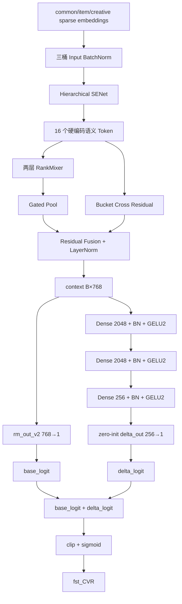

# Semantic RankMixer v7：并行深度残差任务头

本文以当前仓库中的实际实现和默认启动参数为准：

- 模型：[`cvr_bn_rankmixer_v7.py`](../src/models/rankmixer/cvr_bn_rankmixer_v7.py)
- 参数：[`set-rankmixer-v7-args.txt`](../bash/set-rankmixer-v7-args.txt)
- 基线版本：[`cvr_bn_rankmixer_v3.py`](../src/models/rankmixer/cvr_bn_rankmixer_v3.py)

## 1. 核心设计

v7 完整保留 v3 从特征 lookup 到 `Residual Fusion context [B,768]` 的全部主干，并保留原有线性输出层 `rm_out_v2` 作为 `base_logit`。

在同一个 `context` 上新增与 Base 任务塔宽度对齐的并行深度分支：

```text
context [B,768]
→ Dense 2048 → BatchNorm → GELU2
→ Dense 2048 → BatchNorm → GELU2
→ Dense 256  → BatchNorm → GELU2
→ Dense 1
→ delta_logit
```

最终输出为：

```text
final_logit = base_logit + delta_logit
prediction = sigmoid(clip(final_logit))
```

`delta_out` 的权重和偏置默认全零初始化，因此模型初始化时满足：

```text
delta_logit = 0
final_logit = base_logit
```

这使新任务头不会在初始化时改变 v3 主路径，同时避免旧版 `768→256→768` Task Adapter 中额外 Fusion LayerNorm 对 `context` 的直接扰动。

## 2. v3、旧版 v7 与当前 v7 对比

| 对比项 | v3 | 旧版 v7 | 当前 v7 |
|---|---|---|---|
| RankMixer 主干 | 16 Token、D=768、L=2 | 与 v3 相同 | 与 v3 相同 |
| Pool/Cross | Gated Pool + Bucket Cross | 与 v3 相同 | 与 v3 相同 |
| 原输出路径 | `768→1` | Adapter 后 `768→1` | 原 `768→1` 完整保留 |
| 新增模块 | 无 | `768→256→768` Adapter | `[2048,2048,256]→1` 深任务分支 |
| 新增 Fusion LN | 无 | 有 | 无 |
| 初始化时是否严格等价于 v3 路径 | 是 | 否 | 是 |
| 新增固定 dense 参数 | 0 | 397,313 | **6,304,769** |
| 固定 dense 总参数 | 95,809,126 | 96,206,439 | **102,113,895** |

当前 v7 的目标只验证一个核心假设：v3 在 768 维融合表示后直接线性输出，是否限制了 CVR 任务相关的非线性表达能力。

## 3. 完整前向流程



## 4. 新任务头计算

设 v3 融合输出为：

```text
h0 ∈ R^768
```

三个隐藏层依次为：

```text
h1 = GELU2(BN(W1 h0 + b1)),  h1 ∈ R^2048
h2 = GELU2(BN(W2 h1 + b2)),  h2 ∈ R^2048
h3 = GELU2(BN(W3 h2 + b3)),  h3 ∈ R^256
```

两条输出路径为：

```text
base_logit  = Wbase h0 + bbase
delta_logit = Wdelta h3 + bdelta
final_logit = base_logit + delta_logit
```

默认初始化：

```text
Wdelta = 0
bdelta = 0
```

第一步反向传播会先更新 `delta_out`；当其权重离开零点后，梯度继续进入三个隐藏层。相对每天约二十多万训练 step，一次更新的延迟可以忽略。

## 5. 参数量

默认 `rm_deep_task_layers=[2048,2048,256]` 且开启 BatchNorm：

| 模块 | 计算方式 | 参数量 |
|---|---:|---:|
| `768→2048` + BN | `768×2048 + 2048 + 2×2048` | 1,579,008 |
| `2048→2048` + BN | `2048×2048 + 2048 + 2×2048` | 4,200,448 |
| `2048→256` + BN | `2048×256 + 256 + 2×256` | 525,056 |
| `256→1` | `256×1 + 1` | 257 |
| **新增合计** |  | **6,304,769** |

因此：

```text
v3 固定 dense 参数：       95,809,126
v7 新增任务头参数：         6,304,769
v7 固定 dense 参数：      102,113,895
```

若动态稀疏 embedding 的实际唯一 ID 数量为 `U`，则总可训练参数为：

```text
17U + 102,113,895
```

新增主矩阵乘计算量约为 12.58M FLOPs/样本，不含 BN、GELU 和反向传播。

## 6. 新增配置

默认 args：

```json
{
  "rm_use_deep_task_head": true,
  "rm_deep_task_layers": [2048, 2048, 256],
  "rm_deep_task_act": "gelu_2",
  "rm_deep_task_use_bn": true,
  "rm_deep_task_zero_init": true
}
```

| 参数 | 默认值 | 作用 |
|---|---|---|
| `rm_use_deep_task_head` | `true` | 是否启用并行深度残差任务头 |
| `rm_deep_task_layers` | `[2048,2048,256]` | 三个隐藏层宽度 |
| `rm_deep_task_act` | `gelu_2` | 隐藏层激活函数 |
| `rm_deep_task_use_bn` | `true` | 每个隐藏层是否使用 BatchNorm |
| `rm_deep_task_zero_init` | `true` | `delta_out` 是否零初始化 |

设置：

```json
{"rm_use_deep_task_head": false}
```

时，`delta_logit` 为零，模型前向路径退化为 v3。

## 7. Dense 冷启动配置

当前展开参数明确设置：

```text
--ignore_dense_checkpoint=True
--ignore_sparse_checkpoint=False
```

因此本轮训练口径是：

- v7 的 RankMixer、BN、SENet、Bucket Cross、`rm_out_v2` 和新深度任务头全部 dense 冷启动；
- sparse embedding 仍按既有流程从指定 checkpoint 恢复；
- `delta_out` 在 dense 冷启动基础上额外使用全零初始化；
- `enable_dense_warmup=false`，不执行新分支热启 warmup。

由于 args 仍设置 `auto_load_cp=true`，服务器训练必须使用全新的 v7 模型目录或先确认目标目录不存在历史 v7 checkpoint，避免自动续训命中旧模型而破坏 dense 冷启动口径。

## 8. 新增变量 scope

新变量集中在：

```text
rm_deep_task_head/mlp0/*
rm_deep_task_head/bn_0/*
rm_deep_task_head/mlp1/*
rm_deep_task_head/bn_1/*
rm_deep_task_head/mlp2/*
rm_deep_task_head/bn_2/*
rm_deep_task_head/delta_out/*
```

原有 `rm_out_v2` scope、形状和计算含义保持不变。

## 9. 训练诊断

除原有 AUC、Loss、COPC 外，v7 新增以下 summary：

| Summary | 含义 |
|---|---|
| `rm_v7/base_logit_rms` | v3 线性主路径的 logit RMS |
| `rm_v7/delta_logit_rms` | 新深度任务分支的 logit RMS |
| `rm_v7/delta_to_base_ratio` | 新分支与原分支输出尺度之比 |

重点关注：

- `delta_to_base_ratio` 长期接近零：新任务头未充分学习；
- 该比例快速远大于 1 且测试 AUC 下降：新分支可能过强或过拟合；
- 比例逐步增长且测试 AUC 改善：新任务头正在学习 v3 线性头之外的重排能力。

## 10. 一句话总结

当前 v7 在完全保留 v3 主路径的基础上，增加一个 `[2048,2048,256]→1` 的 Base 对齐深度任务分支，并通过零初始化 `delta_out` 形成严格的残差 logit 学习；默认训练配置为 dense 全冷启动、sparse embedding 继续恢复。
