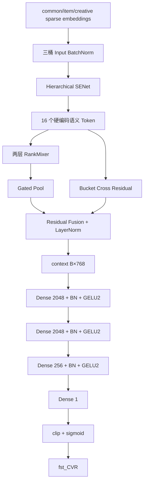

# Semantic RankMixer v7：单路径深度任务头

本文以当前仓库中的实际实现和默认启动参数为准：

- 模型：[`cvr_bn_rankmixer_v7.py`](../src/models/rankmixer/cvr_bn_rankmixer_v7.py)
- 参数：[`set-rankmixer-v7-args.txt`](../bash/set-rankmixer-v7-args.txt)
- 基线版本：[`cvr_bn_rankmixer_v3.py`](../src/models/rankmixer/cvr_bn_rankmixer_v3.py)
- 统一实验协议：[`background.md`](../docs/background.md)

## 1. 实验目标与边界

v7 用于验证一个独立的架构假设：

> v3 在 768 维 RankMixer 融合表示后直接线性输出，是否限制了 CVR 任务相关的非线性表达能力。

为隔离这一变量，v7 完整保留 v3 从特征 lookup 到 `Residual Fusion context [B,768]` 的全部主干，仅替换最终任务头。

v7 是一个全新、独立训练的 RankMixer 方案，不以加载 v3 `dense` checkpoint 为设计目标，也不为旧 checkpoint 兼容保留 v3 线性输出路径。

## 2. 核心设计

v3 的输出是：

```text
context [B,768] → rm_out_v2 768→1 → logit
```

v7 将其替换为单路径深度任务头：

```text
context [B,768]
→ Dense 2048 → BatchNorm → GELU2
→ Dense 2048 → BatchNorm → GELU2
→ Dense 256  → BatchNorm → GELU2
→ Dense 1（正常随机初始化）
→ task_logit
```

最终预测为：

```text
prediction = sigmoid(clip(task_logit))
```

v7 不再计算 `base_logit`、`delta_logit` 或两者的残差和。最后一层不使用零初始化，因此从首个训练 step 开始，梯度就可以进入三个隐藏层。

该任务头只在隐藏层宽度、BatchNorm 和 GELU2 组合上参考 Base；Base 的输入是高维 DCNM 表示，v7 的输入是 768 维 RankMixer context，两者不是完全相同的输出头。

## 3. v3、修改前 v7 与当前 v7 对比

| 对比项 | v3 | 修改前 v7 | 当前 v7 |
|---|---|---|---|
| RankMixer 主干 | 16 Token、D=768、L=2 | 与 v3 相同 | 与 v3 相同 |
| Pool/Cross | Gated Pool + Bucket Cross | 与 v3 相同 | 与 v3 相同 |
| 输出路径 | `768→1` | `768→1` + 并行深度残差头 | 单路径 `768→2048→2048→256→1` |
| 最后一层初始化 | 正常初始化 | `delta_out` 零初始化 | 正常随机初始化 |
| v3 线性捷径 | 有 | 有 | **无** |
| `2026-07-01` dense 启动 | 冷启动 | 冷启动 | **独立冷启动** |
| 方案定位 | v3 基线 | 学习 v3 logit 的残差修正 | 验证深度任务头本身 |
| 固定 dense 总参数 | 95,809,126 | 102,113,895 | **102,113,126** |

## 4. 完整前向流程



## 5. 任务头计算

设 v3 主干的融合输出为：

```text
h0 ∈ R^768
```

v7 的任务头为：

```text
h1 = GELU2(BN(W1 h0 + b1)),  h1 ∈ R^2048
h2 = GELU2(BN(W2 h1 + b2)),  h2 ∈ R^2048
h3 = GELU2(BN(W3 h2 + b3)),  h3 ∈ R^256
task_logit = Wout h3 + bout
```

`Wout` 按 256 维输入使用与其他 dense 层一致的初始化函数，`bout` 初始化为零。

## 6. 参数量

默认 `rm_deep_task_layers=[2048,2048,256]` 且开启 BatchNorm：

| 模块 | 计算方式 | 参数量 |
|---|---:|---:|
| `768→2048` + BN | `768×2048 + 2048 + 2×2048` | 1,579,008 |
| `2048→2048` + BN | `2048×2048 + 2048 + 2×2048` | 4,200,448 |
| `2048→256` + BN | `2048×256 + 256 + 2×256` | 525,056 |
| `256→1` | `256×1 + 1` | 257 |
| **深度任务头合计** |  | **6,304,769** |

v7 用深度任务头替换 v3 原有的 `768→1` 线性层，因此：

```text
v3 固定 dense 参数：          95,809,126
减去 v3 rm_out_v2：                    -769
加上 v7 深度任务头：          +6,304,769
v7 固定 dense 参数：         102,113,126
v7 相对 v3 增量：              6,304,000
```

若动态稀疏 embedding 的实际唯一 ID 数量为 `U`，则总可训练参数为：

```text
17U + 102,113,126
```

## 7. 配置与变量 scope

默认任务头配置：

```json
{
  "rm_deep_task_layers": [2048, 2048, 256],
  "rm_deep_task_act": "gelu_2",
  "rm_deep_task_use_bn": true
}
```

v7 不再提供 `rm_use_deep_task_head` 退化开关；需要线性头对照时直接使用 v3，避免同一个 v7 名称对应两种不同架构。

任务头变量集中在：

```text
rm_deep_task_head/mlp0/*
rm_deep_task_head/bn_0/*
rm_deep_task_head/mlp1/*
rm_deep_task_head/bn_1/*
rm_deep_task_head/mlp2/*
rm_deep_task_head/bn_2/*
rm_deep_task_head/out/*
```

v7 图中不再创建 `rm_out_v2` 变量。

## 8. 统一 Dense 冷启动与逐日热启动

### 8.1 `2026-07-01`：独立 dense 冷启动

当前展开参数为：

```text
--train_dates=2026-07-01:2026-07-01
--test_date=2026-07-02:2026-07-02
--ignore_dense_checkpoint=True
--ignore_sparse_checkpoint=False
```

同时 `enable_dense_warmup=false`。因此：

- RankMixer、BN、SENet、Bucket Cross 和深度任务头的全部 dense 参数随机初始化；
- `checkpoint_import_dir` 只用于按统一实验口径恢复 sparse embedding，不得恢复其中的 dense 参数；
- 必须使用全新或已确认为空的 v7 输出目录，防止 `auto_load_cp=true` 命中历史 v7 checkpoint。

### 8.2 `2026-07-02` 及以后：同版本逐日 dense 热启动

从第二个训练日开始：

```text
--ignore_dense_checkpoint=False
enable_dense_warmup=false
checkpoint_import_dir=同一 v7 前一日产出的 checkpoint
```

训练链必须为：

```text
v7@2026-07-01 → v7@2026-07-02 → v7@2026-07-03 → ...
```

禁止在后续日期从 v3、Base 或其他 RankMixer 版本热启动 v7 dense 参数。

## 9. 训练诊断

除原有 AUC、Loss 和 COPC 外，v7 保留一个与当前单路径设计相匹配的 summary：

| Summary | 含义 |
|---|---|
| `rm_v7/task_logit_rms` | 深度任务头最终 logit 的 RMS，用于监控输出尺度 |

修改前的 `base_logit_rms`、`delta_logit_rms` 和 `delta_to_base_ratio` 已删除，因为当前 v7 不再存在两条 logit 分支。

## 10. 一句话总结

v7 完整保留 v3 RankMixer 主干，但用正常随机初始化的 `768→2048→2048→256→1` 单路径深度任务头替换 `rm_out_v2`；所有 dense 参数在 `2026-07-01` 独立冷启动，之后只沿同一 v7 训练链逐日热启动。
