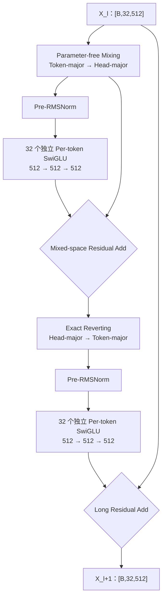

# RankMixer v8：Semantic Masked-Cross RankMixer

## 1. 模型概览

RankMixer v8 面向搜索场景首次转化率预估，保留 v6 已实现并通过静态审计的 31 组语义硬编码 Token、Raw Global Token、两层 TokenMixer-Large 和增强读出，同时在语义压缩前增加两层全字段 Masked Low-Rank DCN。

设计目标：

1. 继续使用业务语义硬编码划分 Token，不使用顺序切分、运行时哈希或随机分组。
2. 在完整 `20,978` 维字段空间恢复显式交叉，再进行语义压缩。
3. 保留原始全局视图、显式交叉视图和 TokenMixer 隐式交互的互补信息。
4. Dense 可训练参数严格低于 `200M`。
5. 保持 TensorFlow 1.x、Flood 训练生命周期、模型导出和服务器启动参数风格与 v6 一致。

对应文件：

- 模型：[`cvr_bn_rankmixer_v8.py`](../src/models/rankmixer/cvr_bn_rankmixer_v8.py)
- 参数：[`set-rankmixer-v8-args.txt`](../bash/set-rankmixer-v8-args.txt)

## 2. 核心配置

| 配置项 | v8 取值 |
|---|---:|
| 输入字段 | Common 385 + Item 835 + Creative 14 = 1,234 |
| Field Embedding | 17 |
| 全字段输入宽度 | 20,978 |
| ML-DCN 层数 | 2 |
| ML-DCN rank `r` | 500 |
| Mask bottleneck `k` | 250 |
| Mask ratio `k/r` | 0.5 |
| Local / Global Token | 31 / 1 |
| 总 Token 数 `T` | 32 |
| Head 数 `H` | 32 |
| Token hidden dimension `D` | 512 |
| Head dimension `D/H` | 16 |
| TokenMixer-Large Block 数 | 2 |
| Per-token SwiGLU hidden `M` | 512 |
| Pool Query/Key dimension | 128 |
| Flatten Readout dimension | 512 |
| Task Head | `1536 → 2048 → 2048 → 256 → 1` |
| 训练目标 | 单一 first-CVR BCE |
| Dense 可训练参数 | **192,242,606（192.243M）** |

## 3. 端到端流程图

```mermaid
flowchart TD
    E["Sparse Embedding Lookup<br/>1,234 个字段，每字段 17 维"]

    E --> B["按三桶拼接<br/>Common 6,545<br/>Item 14,195<br/>Creative 238"]
    B --> BN["三个独立 Input BatchNorm<br/>参数 41,956"]
    BN --> SE["Hierarchical SENet<br/>字段级样本条件重标定<br/>参数 522,112"]
    SE --> X0["Raw Full-field x₀<br/>[B,20,978]"]

    X0 --> D1["ML-DCN Layer 1<br/>20,978 → r=500 → 20,978<br/>Mask 20,978 → k=250 → 500"]
    X0 -. "固定交叉锚点" .-> D1
    D1 --> X1["Residual Add + LayerNorm<br/>x₁：[B,20,978]"]
    X1 --> D2["ML-DCN Layer 2<br/>20,978 → r=500 → 20,978<br/>Mask 20,978 → k=250 → 500"]
    X0 -. "固定交叉锚点" .-> D2
    D2 --> X2["Residual Add + LayerNorm<br/>x₂：[B,20,978]"]

    X2 --> SG["按原字段坐标做 v8 语义硬编码切分<br/>Common 10 + Item 20 + Creative 1"]
    SG --> LP["31 组独立 Projection<br/>组内 Concat → Dense 512<br/>GELU + Per-token RMSNorm"]
    LP --> LT["Crossed Local Tokens<br/>[B,31,512]"]

    X0 --> GM["Raw Global Token MLP<br/>20,978 → 512 → 512<br/>GELU + RMSNorm"]
    GM --> GT["Raw Global Token<br/>[B,1,512]"]

    LT --> TC{"Token-axis Concat"}
    GT --> TC
    TC --> TI["TokenMixer 输入<br/>[B,32,512]"]

    TI --> R0["TokenMixer-Large Block 0<br/>Mixing → SwiGLU → Reverting → SwiGLU<br/>Pre-RMSNorm + Long Residual"]
    R0 --> R1["TokenMixer-Large Block 1<br/>Mixing → SwiGLU → Reverting → SwiGLU<br/>Pre-RMSNorm + Long Residual"]
    R1 --> FN["Final Per-token RMSNorm<br/>[B,32,512]"]

    FN --> SP{"拆分 Global / Local"}
    SP --> FG["Final Global<br/>[B,512]"]
    SP --> FL["Final Locals<br/>[B,31,512]"]

    FG --> Q["Query 512 → 128"]
    FL --> K["Keys 512 → 128"]
    Q --> PW["Scaled Dot Product + Softmax"]
    K --> PW
    PW --> POOL["Global-conditioned Pool<br/>[B,512]"]
    FL --> POOL

    FL --> FF["Flatten 15,872 → 512<br/>GELU + RMSNorm<br/>Scalar Gate 初始 sigmoid(-2)"]

    FG --> C{"异构表示 Concat"}
    POOL --> C
    FF --> C
    C --> CTX["Context：[B,1,536]"]
    CTX --> H0["FC 1536 → 2048<br/>BN + GELU"]
    H0 --> H1["FC 2048 → 2048<br/>BN + GELU"]
    H1 --> H2["FC 2048 → 256<br/>BN + GELU"]
    H2 --> O["Linear 256 → 1"]
    O --> P["Sigmoid first-CVR Prediction"]
    O --> L["Mean Binary Cross-Entropy"]
```



主数据形状：

```text
[B,1234,17]
→ x₀ [B,20978]
→ x₂ [B,20978]
→ Local [B,31,512] + Global [B,1,512]
→ [B,32,512]
→ [B,1536]
→ [B,1]
```

## 4. Masked Low-Rank DCN

第 `l` 层使用固定的原始输入 `x₀` 和上一层表示 `x_l`：

```text
z_l    = Dense_r(x_l)
mask_l = Dense_r(ReLU(Dense_k(x_l)))
u_l    = Dense_d(z_l * mask_l)
x_l+1  = LayerNorm(x_l + x₀ * u_l)
```

其中：

- `d=20,978`
- `r=500`
- `k=250`
- `*` 表示逐元素乘法。
- Mask 输出层权重采用 `0.01 / sqrt(k)` 标准差的小随机初始化。
- Mask 输出 bias 初始化为 `1.0`，所以训练初期 `mask≈1`，首先近似普通低秩 DCN。
- 两层都保留输入残差和 LayerNorm。
- ML-DCN 输出的每个坐标仍和原始字段坐标对齐，因此可以安全地按字段边界切回 31 个语义组。

## 5. 语义 Token ABI

v8 使用与 v6 完全相同的 31 组字段成员和顺序，但版本号升级为：

```text
rankmixer_v8_semantic_balanced_v1
```

分组约束：

- Common 10 组，大小为 `39/38`。
- Item 20 组，大小为 `42/41`。
- Creative 1 组，大小为 `14`。
- 1,234 个字段恰好出现一次。
- 不允许跨 common/item/creative 桶。
- 启动时检查字段覆盖、组大小和字段顺序 SHA256。

SHA256 与 v6 保持一致：

| Bucket | SHA256 |
|---|---|
| Common | `61602847a993a6103b9c21b4d6ff2d1817a848d8717e7b201eea4be6fc29bda3` |
| Item | `0517491a05e73f3aac890cc3f9ab900b795da05011914c842c2715ff30af49e3` |
| Creative | `956056a173d6daa8b62602b62bf9bd83c638e362c6824aa9cd2ef1300490d10c` |

## 6. TokenMixer-Large Block

每个 Block 执行：



Residual Add 只用于形状相同、坐标语义对齐的表示。最终 Global、Pool 和 Flatten 是不同类型的摘要，因此使用 Concat，而不是直接相加。

## 7. 参数量

| 模块 | Dense 可训练参数 |
|---|---:|
| 三桶 Input BN | 41,956 |
| Hierarchical SENet | 522,112 |
| 两层 Low-Rank DCN 主体 | 42,082,868 |
| 两层 Mask MLP | 10,740,500 |
| 31 个 Local Token 投影 | 10,772,480 |
| Raw Global Token MLP | 11,004,416 |
| 两层 TokenMixer-Large | 100,925,440 |
| Final RMSNorm | 16,384 |
| Global-conditioned Pool | 131,328 |
| Flatten Readout | 8,127,489 |
| CVR Task Head | 7,877,633 |
| **合计** | **192,242,606** |

该口径不包含：

- 动态稀疏 Embedding 表。
- 优化器 slot 和梯度。
- BN moving mean / variance。
- 指标和诊断变量。

FP32 Dense 权重本体约为 `0.769 GB`。

## 8. 训练与启动约束

配套 args 固定：

- `optimizer=flood_adam`
- `learning_rate=0.00002`
- `batch_size=2048`
- `epochs=1`
- `embedding_size=17`
- `batch_norm=true`
- `use_senet=true`
- `use_senet_bn=true`
- `ignore_dense_checkpoint=True`
- `ignore_sparse_checkpoint=False`

首日只复用与 Base 相同来源的 Sparse Embedding，所有 v8 Dense 参数冷启动。后续日期只能恢复同一 v8 前一天的 checkpoint。

模型构造函数会校验关键架构值，避免提交时误用：

- `T/H=32`
- `D=512`
- `L=2`
- `M=512`
- ML-DCN `layers/r/k=2/500/250`
- 任务头 `[2048,2048,256]`
- 语义分组版本和 checksum
- Dense 参数设计上限 `<200M`

## 9. 只读诊断张量

v8 暴露以下诊断，不进入 BCE：

- `rm_ml_dcn_mask_mean`
- `rm_ml_dcn_mask_std`
- `rm_ml_dcn_mask_near_zero_ratio`
- `rm_ml_dcn_mask_large_ratio`
- `rm_ml_dcn_cross_rms_ratios`
- `rm_pool_entropy`
- `rm_flatten_gate`

这些张量用于识别 Mask 消失/爆炸、Cross 分支过强以及最终 Pool/Flatten 路由退化。
