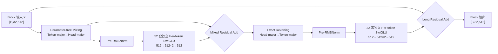

# RankMixer v9-Small：Base DCNM + Raw/Cross TokenMixer + DCNM Shortcut

> 实现状态：模型代码、训练 args 和静态测试已经完成；尚未在生产 TensorFlow 1.x、Flood、Cayman 集群完成建图或训练，因此当前没有 v9 AUC 结果。

## 1. 模型概览

RankMixer v9-Small 是面向电商搜索首次转化率 `fst_CVR` 预估的单任务精排模型。它不是旧版 v9 Base-Anchored Residual 方案的继续扩展，而是一次重新设计：保留 Base 已长期验证有效的分层 SENet 和精确两层 DCNM500，同时将 DCNM 输出送入 Raw/Cross 双视图 RankMixer，并保留一条 512 维 DCNM 直接路径。

最终结构为：

```text
三桶 Embedding
→ Input Riemann BN
→ Hierarchical SENet
→ x0 [B,20978]
→ 2×Base DCNM500
→ x2 [B,20978]
   ├─ Raw/Cross 31 Local Token + 1 Global Token
   │  → 2×TokenMixer-Large
   │  → Global512 + Pool512 + Gated Flatten256
   │  → RankMixer Context 1280
   └─ Dense512 + Riemann BN + GELU2
      → DCNM Shortcut 512
→ Concat 1792
→ 2048 → 2048 → 256 → 1
→ Sigmoid fst_CVR
```

对应实现：

- 模型：[`cvr_bn_rankmixer_v9.py`](../src/models/rankmixer/cvr_bn_rankmixer_v9.py)
- 训练参数：[`set-rankmixer-v9-args.txt`](../bash/set-rankmixer-v9-args.txt)
- 静态测试：[`test_rankmixer_v9_static.py`](../src/models/rankmixer/tests/test_rankmixer_v9_static.py)
- 完整设计：[`rankmixer_v9_small_design.md`](../docs/rankmixer_v9_small_design.md)
- 统一实验背景：[`background.md`](../docs/background.md)

## 2. 设计依据与目标

固定特征、固定训练日期下，当前最重要的本地实验结果为：

| 模型 | 已完成训练天数 | 相对同日 Base 的结果 |
|---|---:|---:|
| Base | 15 | 最高 AUC `0.869715` |
| v3 | 6 | 平均 `auc_diff=-0.001230` |
| v5 | 3 | 平均 `auc_diff=-0.000700` |

这些结果说明：

1. Base 的 SENet、显式 DCNM 交叉和深任务头是当前最强的本地正向证据，不能轻易移除。
2. v5 的 `32 Token + Global Token + Mixing-Reverting + Per-token SwiGLU + 三路增强读出`，是当前 RankMixer 中最接近 Base 的组合。
3. 继续仅靠扩大 RankMixer 参数量没有充分证据；v5 已达到 `348.432M` Dense 参数，但仍未超过只有 `90.342M` Dense 参数的 Base。
4. v9-Small 首先验证“Base 显式交叉归纳偏置 + RankMixer 隐式交互 + DCNM 直接保真路径”是否能进一步缩小 AUC 差距。

最终目标是在相同训练日和相同评估样本上超过 Base；小模型阶段主要用于低成本筛选结构方向，不把其 AUC 当作完整 v9 的容量上限。

## 3. 核心配置

| 配置项 | v9-Small 取值 |
|---|---:|
| Common 字段 | 385 |
| Item 字段 | 835 |
| Creative 字段 | 14 |
| 字段总数 | 1,234 |
| Field Embedding | 17 |
| SENet 后全字段宽度 | 20,978 |
| DCNM 层数 / rank | 2 / 500 |
| DCNM 激活 | 无 |
| DCNM LayerNorm | 开启 |
| Local / Global Token | 31 / 1 |
| Token 数 `T` | 32 |
| Head 数 `H` | 32 |
| Token hidden `D` | 512 |
| Head dimension `D/H` | 16 |
| TokenMixer-Large Block 数 `L` | 2 |
| Per-token SwiGLU hidden `M` | 512 |
| Pool Query/Key dimension | 128 |
| Flatten Readout dimension | 256 |
| DCNM Shortcut dimension | 512 |
| RankMixer Context | 1,280 |
| 最终融合 Context | 1,792 |
| Task Head | `1792→2048→2048→256→1` |
| 训练目标 | 单一 first-CVR BCE |
| Dense 可训练参数 | **199,445,658（199.446M）** |

## 4. 端到端算法流程图

```mermaid
flowchart TD
    E["Sparse Embedding Lookup<br/>1,234 个字段，每字段 17 维"]

    E --> B["按三桶拼接<br/>Common 6,545<br/>Item 14,195<br/>Creative 238"]
    B --> BN["三个独立 Input Riemann BN<br/>输出宽度不变"]
    BN --> SE["Hierarchical SENet<br/>Common / Item / Creative 分层条件化<br/>2×sigmoid Gate"]
    SE --> X0["Raw View x0<br/>[B,20,978]"]

    X0 --> D1["Base DCNM Layer 1<br/>20,978→500→20,978<br/>Cross Residual + LayerNorm"]
    D1 --> X1["x1<br/>[B,20,978]"]
    X1 --> D2["Base DCNM Layer 2<br/>20,978→500→20,978<br/>Cross Residual + LayerNorm"]
    X0 -. "固定乘性交叉输入" .-> D1
    X0 -. "固定乘性交叉输入" .-> D2
    D2 --> X2["Crossed View x2<br/>[B,20,978]"]

    X0 --> RAW["按冻结语义组切分 raw_g"]
    X2 --> CROSS["按相同字段坐标切分 crossed_g"]
    RAW --> PAIR["每组 concat(raw_g, crossed_g)"]
    CROSS --> PAIR
    PAIR --> LP["31 组独立 Dense512<br/>GELU2 + Per-token RMSNorm"]
    LP --> LT["31 Local Tokens<br/>Common 10 / Item 20 / Creative 1<br/>[B,31,512]"]

    X2 --> G1["Global Token MLP<br/>20,978→512→512<br/>GELU2 + RMSNorm"]
    G1 --> GT["1 Global Token<br/>[B,1,512]"]

    LT --> TC{"沿 Token 轴拼接"}
    GT --> TC
    TC --> TI["TokenMixer 输入<br/>[B,32,512]"]
    TI --> R0["TokenMixer-Large Block 0<br/>Mixing-Reverting<br/>两套 Per-token SwiGLU"]
    R0 --> R1["TokenMixer-Large Block 1<br/>Mixing-Reverting<br/>两套 Per-token SwiGLU"]
    R1 --> FN["Final Per-token RMSNorm<br/>[B,32,512]"]

    FN --> FG["Final Global Token<br/>[B,512]"]
    FN --> FL["31 Final Local Tokens<br/>[B,31,512]"]
    FG --> Q["Query 512→128"]
    FL --> K["Keys 512→128"]
    Q --> ATT["Scaled Dot Product + Softmax"]
    K --> ATT
    ATT --> POOL["Global-conditioned Pool<br/>[B,512]"]
    FL --> POOL
    FL --> FF["Flatten 31×512→256<br/>GELU2 + RMSNorm<br/>sigmoid Gate，初始约 0.119"]

    FG --> RC{"RankMixer Readout Concat"}
    POOL --> RC
    FF --> RC
    RC --> RM["RankMixer Context<br/>512+512+256=1,280"]

    X2 --> SD["Dense 20,978→512"]
    SD --> SBN["Riemann BN + GELU2"]
    SBN --> SC["DCNM Shortcut<br/>[B,512]"]

    RM --> FC{"Fusion Concat"}
    SC --> FC
    FC --> CTX["Fusion Context<br/>[B,1,792]"]
    CTX --> H0["Dense 1792→2048<br/>Riemann BN + GELU2"]
    H0 --> H1["Dense 2048→2048<br/>Riemann BN + GELU2"]
    H1 --> H2["Dense 2048→256<br/>Riemann BN + GELU2"]
    H2 --> O["Linear 256→1"]
    O --> P["Clip + Sigmoid<br/>fst_CVR Prediction"]
    P --> BCE["Mean Binary Cross-Entropy"]
```



关键形状主链：

```text
[B,1234,17]
→ x0 [B,20978]
→ x2 [B,20978]
→ Local [B,31,512] + Global [B,1,512]
→ TokenMixer [B,32,512]
→ RankMixer Context [B,1280]
⊕ DCNM Shortcut [B,512]
→ Fusion [B,1792]
→ Logit [B]
```

## 5. 精确 Base DCNM

v9-Small 沿用 Base 的两层低秩 DCNM。第 `l` 层计算为：

```text
u_l       = W_up_l x_l + b_up_l           # 20,978 → 500
v_l       = W_down_l u_l + b_down_l       # 500 → 20,978
x_(l+1)   = LayerNorm(x0 * v_l + x_l)
```

其中 `*` 为逐元素乘法。固定配置：

- `cross_num=2`
- `dcnm_layer=500`
- `use_cross_act=false`
- `layer_norm_opt=true`
- 训练图使用生产 Base 相同的 `cayman.python.layer_norm_for_train`
- 导出图使用 `tf.contrib.layers.layer_norm`

DCNM 输出维度始终是 20,978，而不是 500 或 512。`500` 是 DCNM 内部低秩瓶颈，`512` 是后续 Shortcut 的压缩维度。

## 6. Raw/Cross 双视图语义 Token

v9-Small 使用冻结的 31 组语义分组：

| Bucket | Token 数 | 每组字段数 |
|---|---:|---:|
| Common | 10 | 39 / 38 |
| Item | 20 | 42 / 41 |
| Creative | 1 | 14 |
| 合计 | 31 | 1,234 个字段恰好覆盖一次 |

每个语义组同时读取两个视图：

```text
raw_g       = slice(x0, group_g)
crossed_g   = slice(x2, group_g)
token_g     = RMSNorm(GELU2(Dense512(concat(raw_g, crossed_g))))
```

这样设计的原因是：

- `x0` 保留 SENet 重标定后的原始字段幅度与低阶信息。
- `x2` 提供 Base 已验证有效的显式乘性交叉。
- 两个视图在同一字段坐标上严格对齐，不改变字段、日期或输入 ABI。
- RankMixer 不需要从原始 Embedding 独立重学全部显式交叉。

Creative 没有额外建立深塔。14 个 Creative 字段已经拥有独立 Raw/Cross Local Token，并同时进入 SENet、全局 DCNM、Global Token 和 DCNM Shortcut。只有后续 Creative 相关切片稳定退化时，才考虑 64 维轻量 bypass，而不是直接增加 Creative-only DCNM。

## 7. TokenMixer-Large Block

每个 Block 包含两个坐标空间中的独立 Per-token SwiGLU：



关键实现约束：

- `H=T=32`，保证 Mixing 后的 Token 数和宽度与输入一致。
- `D=M=512`，避免同时压缩 Token 宽度与 Token 内非线性更新秩。
- `W_down` 使用 `0.01/sqrt(M)` 小初始化，降低冷启动时对残差路径的扰动。
- Mixing/Reverting 不创建可训练参数。
- 两层 Block 共包含 `100,925,440` 个 Dense 可训练参数。

## 8. 三路增强读出是否重复

最终三个读出来自同一个 Token Tensor，但不是相同统计量：

```text
global  = final_tokens[global_index]

pool    = sum_i softmax(K(local_i) · Q(global))_i * local_i

flatten = sigmoid(gate) * W_flat * concat(local_1,...,local_31)
```

三者承担不同的信息约束：

| 分支 | 保留的信息 | 可能丢失的信息 |
|---|---|---|
| Final Global | Mixer 学到的全局汇总状态 | 局部 Token 身份和细节 |
| Conditioned Pool | 由全局状态动态选择的局部语义 | 加权求和会压缩 Token 顺序与组合 |
| Gated Flatten | Token 身份、位置和有序局部组合 | 参数更多，可能与 Pool 相关 |

v9-Small 首轮保留三路的原因：

1. 当前 v5 的相对改善证据包含完整三路读出，没有删除 Flatten 不掉点的本地证据。
2. Flatten 分支连同任务头首层增加的边际参数约为 `4.59M`，只占 v9-Small 总参数约 `2.30%`。
3. Flatten Gate 初始化为 `sigmoid(-2)≈0.119`，训练初期不会无约束地主导融合表示。

训练后应联合观察 Flatten Gate、Pool Entropy、分支表示 RMS 和任务头首层权重；分支置零只能用于依赖性诊断，不能替代重新训练的消融实验。

## 9. DCNM Shortcut 与 Base 维度说明

Base 的 DCNM 输出是：

```text
x2 ∈ R^(B×20978)
```

Base 直接使用：

```text
20978→2048→2048→256→1
```

v9-Small 则使用：

```text
x2 20978→Dense512→RiemannBN→GELU2→Shortcut512
```

该 Shortcut 不替代完整 DCNM 表示：完整 `x2` 还会进入 31 个 Crossed Local Token 和 Global Token。Shortcut 的作用是提供一条更接近 Base 的直接显式交叉路径，减少全部 DCNM 信息都必须经过 Token 化和 Mixing 才能到达任务头的风险。

最终融合为：

```text
RankMixer Context 1280 + DCNM Shortcut 512 = Fusion Context 1792
```

## 10. 单路径端到端训练

当前 v9 已删除旧版方案中的：

- 独立 Base Anchor logit
- `stop_gradient`
- 有界 `tanh(delta)` 修正
- 可学习标量 `alpha`
- Anchor/Residual 辅助 BCE

最终只有一个线性 logit 和一个 BCE：

```text
logit = TaskHead(concat(rankmixer_context, dcnm_shortcut))
pred  = sigmoid(clip(logit))
loss  = mean(binary_cross_entropy(label, pred))
```

因此主任务梯度可以端到端更新：

- Input BN 与 SENet
- 两层 DCNM
- Raw/Cross Tokenizer
- Global Token
- 两层 TokenMixer-Large
- Pool 与 Gated Flatten
- DCNM Shortcut
- 深任务头

## 11. 精确参数量

统计口径为 Dense checkpoint 中所有非 Sparse-Embedding 可训练参数，包括 Dense kernel/bias 以及 BN、LayerNorm、RMSNorm 的可训练 scale/offset；不包含优化器 slot、BN moving statistics 和动态 Sparse Embedding 表。

| 模块 | Dense 可训练参数 |
|---|---:|
| 三桶 Input BN | 41,956 |
| Hierarchical SENet | 522,112 |
| 精确两层 DCNM500 | 42,082,868 |
| Raw/Cross Local Tokenizer | 21,513,216 |
| Crossed Global Token | 11,004,416 |
| 两层 TokenMixer-Large | 100,925,440 |
| Final Per-token RMSNorm | 16,384 |
| Global-conditioned Pool | 131,328 |
| Gated Flatten Readout | 4,063,745 |
| DCNM Shortcut | 10,742,272 |
| `[2048,2048,256]` Task Head | 8,401,921 |
| **总计** | **199,445,658** |

与 v5 对比：

```text
v5 Dense Params       = 348,432,486
v9-Small Dense Params = 199,445,658
减少                    = 148,986,828
下降比例                = 42.76%
v9-Small / v5          = 57.24%
```

FP32 Dense 参数本体约为 `0.798 GB`，不包含训练时的梯度、优化器状态和临时激活。

## 12. 与 Base、v5、v8 和旧 v9 的区别

| 项目 | Base | v5 | v8 | 当前 v9-Small |
|---|---|---|---|---|
| 分层 SENet | 有 | 有 | 有 | 有 |
| 显式 DCNM | 精确 2×DCNM500 | 无 | 2×Masked Low-Rank DCN | **精确 2×DCNM500** |
| Local Token 输入 | 无 | Raw | Crossed | **Raw + Crossed** |
| Global Token 输入 | 无 | Raw | Raw | **Crossed x2** |
| TokenMixer `D/M/L` | 无 | `1024/704/2` | `512/512/2` | **`512/512/2`** |
| Flatten dimension | 无 | 512 | 512 | **256** |
| DCNM 直接路径 | 完整 20,978 维进任务头 | 无 | 无 | **512 维 Shortcut** |
| Logit 结构 | 单路径 | 单路径 | 单路径 | **单路径** |
| Dense 参数 | 90.342M | 348.432M | 192.243M | **199.446M** |

旧版 v9 Base-Anchored Residual 方案曾冻结 RankMixer 输入并用受限 delta 修正 Base logit。当前实现已经完全移除该结构；历史设计仅保留在 [`rankmixer_v9_base_anchored_residual_design.md`](../docs/rankmixer_v9_base_anchored_residual_design.md) 中。

## 13. 训练 args 与冷启动协议

当前 [`set-rankmixer-v9-args.txt`](../bash/set-rankmixer-v9-args.txt) 对应首日冷启动：

```text
train_dates=2026-07-01:2026-07-01
test_date=2026-07-02:2026-07-02
ignore_dense_checkpoint=True
ignore_sparse_checkpoint=False
```

核心训练参数：

```text
optimizer=flood_adam
learning_rate=0.00002
batch_size=2048
epochs=1
embedding_size=17
use_riemann_bn=true
dense_scale=0.01
save_predict_result=true
```

首日要求：

- 所有 v9 Dense 参数随机初始化。
- Sparse Embedding 按 Base 和其他对照模型的统一方式热启动。
- 使用全新或已确认为空的 v9 输出目录，避免 `auto_load_cp=true` 意外加载历史 Dense checkpoint。

第二日及以后要求：

- 将训练/测试日期逐日顺延。
- 设置 `ignore_dense_checkpoint=False`。
- Dense checkpoint 只能来自同一 v9-Small 前一天的训练结果。
- 禁止从 Base、v3、v5、v8 或旧 v9 跨版本热启动 Dense 参数。

逐样本预测文件保存：

```text
search_id<TAB>example_id<TAB>label<TAB>logit<TAB>prediction
```

用于同日 matched AUC、按 `user/search_id` 成组 bootstrap 和切片分析。

## 14. 诊断与静态保护

### 14.1 训练 Summary

当前实现提供：

| Summary | 含义 |
|---|---|
| `rm_v9/pool_entropy` | Pool 权重是否塌缩到极少数 Token |
| `rm_v9/flatten_gate` | Flatten 分支实际启用程度 |
| `rm_v9/rankmixer_context_rms` | 三路 RankMixer Context 的总体尺度 |
| `rm_v9/dcnm_shortcut_rms` | DCNM 直接路径的总体尺度 |

优化器仍记录各可训练变量的梯度 histogram，可用于检查 SENet、DCNM、Tokenizer、TokenMixer 和 Shortcut 是否存在断梯度或梯度爆炸。

### 14.2 构造期强校验

模型启动时检查：

- 输入字段数严格为 `385/835/14`。
- Embedding dimension 严格为 17。
- 不允许额外 dense、sequence、gattr、DIN、coupon 输入桶。
- 31 个语义组覆盖全部 1,234 字段且无重复。
- 分组大小与 SHA256 checksum 固定。
- `T=H=32`、`D=M=512`、`L=2`。
- `DCNM layers/rank=2/500`。
- `Flatten=256`、`Shortcut=512`。
- 任务头严格为 `[2048,2048,256]`。
- 设计参数量与实际图中 Trainable Variables 都必须等于 `199,445,658`。
- Dense 参数量必须严格低于 200M。

### 14.3 本地静态测试

执行：

```bash
python3 -m py_compile \
  src/models/rankmixer/cvr_bn_rankmixer_v9.py \
  src/models/rankmixer/tests/test_rankmixer_v9_static.py

python3 -m unittest discover -v \
  -s src/models/rankmixer/tests \
  -p 'test_*.py'

bash -n bash/set-rankmixer-v9-args.txt
```

当前 6 项测试已通过，覆盖：

1. 冻结语义分组 ABI 与 checksum。
2. 精确 Dense 参数预算。
3. Raw/Cross 端到端融合且不存在 `stop_gradient`。
4. Base SENet/DCNM 变量 scope 与公式。
5. RankMixer Context 1,280 和 Fusion 1,792 的固定形状。
6. 首日冷启动 args 与旧 residual 参数清理。

本地桌面环境没有生产 TensorFlow 1.x、Flood 和 Cayman，因此静态测试不能替代集群真实建图。

## 15. 首次集群验证建议

正式启动三日训练链前，先运行 2,000～5,000 Step 性能和数值基准：

1. 确认实际图 Trainable Variables 日志为 `199,445,658`。
2. 确认 Train/Test/Export 三个子图均无变量重复、变量缺失或 checkpoint scope 冲突。
3. 检查 Loss、Logit、Flatten Gate、Pool Entropy 和两条 Context RMS 无 NaN/Inf。
4. 检查 Input BN、SENet、DCNM、Raw/Cross Tokenizer、全部 Per-token SwiGLU、Shortcut 和任务头梯度均非空且有限。
5. 记录 p50/p95 Step Time、samples/s、输入等待比例和主要算子耗时。
6. 若外推单日时间超过 500 分钟，先完成 Profile，再决定是否压缩 `M`，不要直接开始三日完整训练。

AUC 晋级参考：

```text
delta_auc = AUC(v9-Small) - AUC(Base on matched day/sample)
```

- 前三天平均 `delta_auc >= -0.000700`：结构验证强通过，可考虑扩大完整 v9。
- 位于 `[-0.001000,-0.000700)` 且差距持续收窄：继续训练至第六天。
- 平均 `<=-0.001000` 且没有持续改善：不直接扩容，优先排查数据流、优化和分支利用率。

## 16. 方案边界

- 输入特征、标签、训练数据日期和测试数据日期与 Base 完全一致。
- 不新增数据、特征、辅助标签、MoE 或 Creative 深塔。
- 不兼容旧 v9 Dense checkpoint，首日必须独立冷启动。
- 参数量降低不等价于训练时间同比下降，实际耗时仍受数据读取、小算子、BN/LN 和算子融合影响。
- 当前实现和静态测试通过不代表已经取得 AUC 增益，最终结论必须以固定协议下的集群训练结果为准。

## 17. 一句话总结

RankMixer v9-Small 用 Base 精确两层 DCNM500 先学习显式交叉，再通过 Raw/Cross 双视图 32-Token RankMixer 学习隐式交互，同时用 512 维 DCNM Shortcut 保留直接交叉信息；最终以 199.446M Dense 参数完成单路径端到端 first-CVR 训练，是当前用于低成本验证“Base 归纳偏置 + RankMixer 表达能力”能否共同逼近并最终超过 Base 的主方案。
