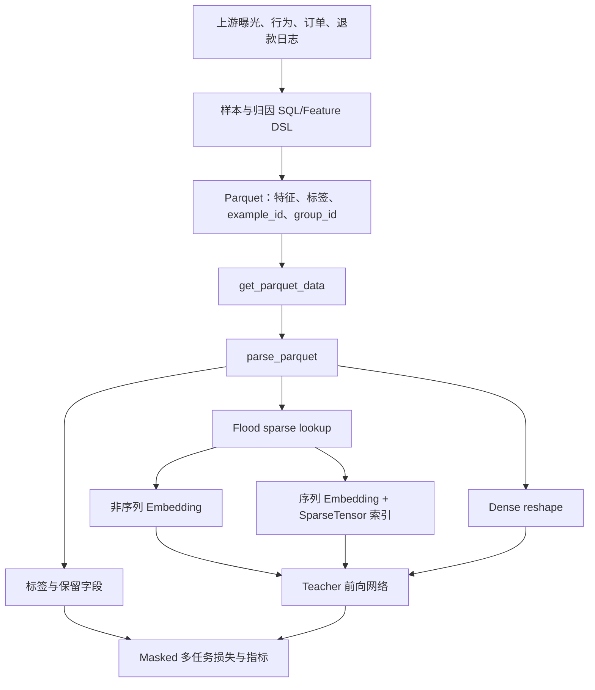
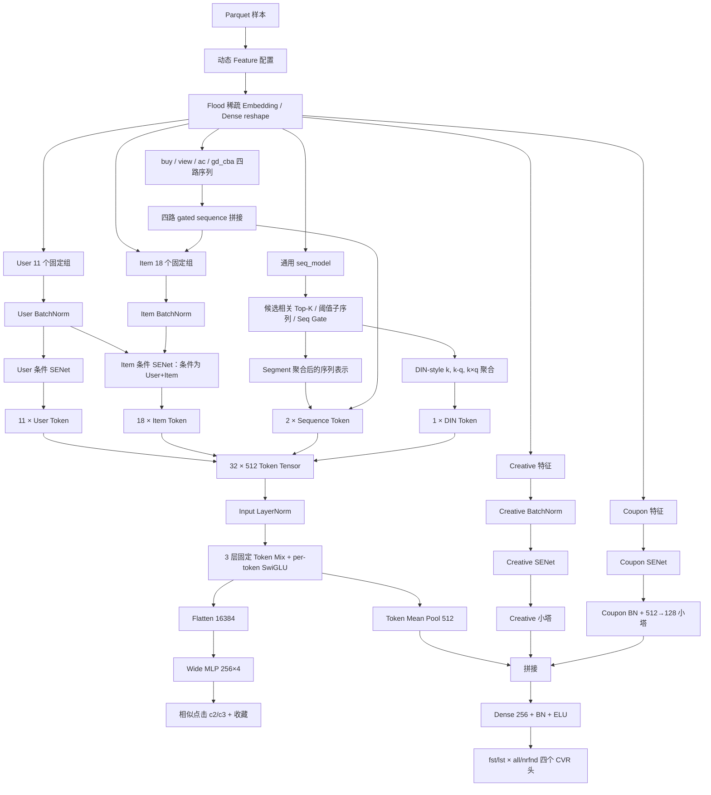
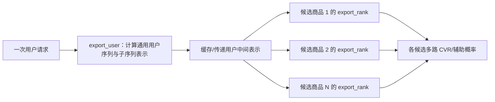

# Reference 部门 CVR 模型：从业务目标、数据到网络与上线的完整拆解

> 分析对象：
>
> - [`recommend_cvr.py`](../src/models/reference/recommend_cvr.py)
> - [`mlp_mixer_swiglu_fuse.py`](../src/models/reference/mlp_mixer_swiglu_fuse.py)
> - [`USER_COM.txt`](../docs/数据特征清单/USER_COM.txt)
>
> 分析日期：2026-08-17
>
> 这是一份基于当前仓库源码的静态分析。它可以完整解释“这份代码想构建什么、主干实际怎样计算、哪些分支已接通、训练和上线怎样组织”，但无法替代未随代码提供的启动参数、动态 Feature 配置、样本 SQL 和外部算子源码。文中会把确定事实、字段名推断和待确认事项严格分开。

建议阅读顺序：第一次先读第 0～5 节建立业务和整体结构，再读第 10 节的一条样本演算；第二次读第 6～9 节理解公式、训练和上线；真正改代码前再读第 12～15 节的生效状态、风险和源码地图。

---

## 0. 先读结论：这到底是一个什么模型？

这是一套面向电商**推荐/展示排序场景**的工业级多目标 CVR 模型。更准确地说，它给“某个用户面对某个候选商品”计算多种转化概率，并把用户长期特征、商品特征、用户与商品的交叉统计、四路行为序列、候选相关兴趣、创意和优惠券共同纳入判断。

它不是一个以 query-document 文本相关性为核心的传统电商搜索模型。源码中虽然使用了 Top-K 检索、目标相似度和名为 `BSEARCH_IMG` 的图像向量，但这些是模型内部从用户历史中找相关行为的技术，不足以把整个模型定义成“搜索”。更强的业务证据来自：

- 类名是 `DisplayCvrFstLst`，文件名是 `recommend_cvr.py`；
- 大量字段包含 `recall_type`、`trigger_idx`、`trigger_cnt`、推荐商品点击、商品详情页停留、收藏等推荐漏斗信号；
- 主目标是转化率，而不是 query-item relevance；
- 在线导出被拆成 user graph 与 rank graph，符合“一位用户对许多候选商品逐个精排”的计算模式；
- 主路径没有看到典型的 query 文本编码塔、query-item 文本相关性标签或搜索结果位置相关损失。

因此最稳妥的业务定义是：

> **推荐/展示流量中的候选商品 CVR 精排模型，可能服务于包含推广流量的展示链路；仅凭当前两份源码不能进一步确认具体页面或流量位。**

它的核心并不是某一个新奇网络层，而是把一个真实工业排序系统需要的环节组合起来：

1. 上游生产训练样本、标签和几千个离散特征；
2. 大规模稀疏 Embedding lookup；
3. 对 user、item、creative、coupon 做动态特征筛选；
4. 用四路行为序列和候选相关 Top-K 找到“这个用户对这个商品为什么可能感兴趣”；
5. 把不同来源压成固定的 32 个 Token；
6. 用 3 层参数无关 Token Mixing + 每 Token 独立 SwiGLU 学习高阶交互；
7. 同时预测 4 个转化目标和 3 个辅助行为目标；
8. 用稀疏/稠密两阶段训练、热启动和 user/rank 分图导出支撑线上迭代。

---

## 1. 它在电商推荐漏斗里处于什么位置？

典型推荐或推广链路可以抽象成：


这份代码最符合上图的“精排 CVR”位置。它不是负责从全库找商品的召回模型，也不是完整的最终排序公式；它输出多个概率，供下游与 CTR、GMV、出价、补贴成本、库存、体验约束等信号组合。

一个简化的下游排序价值可能是：

$$
\operatorname{score}=P(\text{click})\times P(\text{conversion}\mid\text{exposure or click})\times \operatorname{value},
$$

但当前文件只负责其中的多路 CVR/行为概率，并没有定义完整的线上融合公式。因此不能从 `fst_pred` 或 `lst_pred` 直接反推出最终商品顺序。

### 1.1 为什么不是普通搜索排序模型？

| 判别维度 | 本模型的证据 | 更典型的搜索模型 |
|---|---|---|
| 主要目标 | 多路 CVR、收藏、相似点击、停留等 | 文本/语义相关性、点击、转化等联合目标 |
| 用户意图 | 长期画像、近期行为、候选相关历史兴趣 | 当前 query 通常是最强意图信号 |
| 候选来源 | `recall_type`、trigger 特征明显 | 倒排、语义召回、搜索召回来源明显 |
| 序列用法 | 从历史行为中按当前商品找相似行为 | 常见做法是 query 与商品文本/属性交互 |
| 在线计算 | user 表示预计算，rank graph 对多候选复用 | query 通常每次请求变化，不容易完全按用户预计算 |
| 源码命名 | `DisplayCvrFstLst`、`recommend_cvr.py` | 常见 `search_rank`、`query_item`、`relevance` 等 |

这里的“推荐/展示”和你所在的“推广搜”并不是完全割裂的。两者都要解决候选打分、稀疏特征、用户行为、校准和线上延迟；区别主要在于当前意图的来源：搜索以 query 为中心，推荐以用户状态和上下文为中心，推广还要额外处理广告主价值、出价与平台约束。

---

## 2. 为什么要训练这样一个模型？

### 2.1 单一 CVR 无法覆盖真实归因和交易质量

源码默认同时构建四个主头：

| 模型头 | 代码输出 | 源码能确认的含义 | 仍需上游确认的部分 |
|---|---|---|---|
| First + nrfnd | `fst_nrfnd_pred` | first 口径、nrfnd 口径下的转化概率 | first 的归因窗口；`nrfnd` 是否严格等于未退款 |
| Last + nrfnd | `lst_nrfnd_pred` | last 口径、nrfnd 口径下的转化概率 | last 的归因规则与窗口 |
| First + all | `fst_pred` | `label_fst_all` 对应的概率 | all 是否包含退款订单及其他订单类型 |
| Last + all | `lst_pred` | `label_lst_all` 对应的概率 | 同上 |

`fst` 很可能表示 first-touch attribution，`lst` 很可能表示 last-touch attribution；`nrfnd` 很可能表示 non-refund 或退款过滤口径。这些解释与命名高度一致，但源码没有标签 SQL，所以它们属于**高可信推断，不是代码内定义**。最终应向数据或归因同学确认：转化窗口多长、一个订单如何归因、退款观察窗口多长、无效标签为何为负数。

多头训练的业务价值包括：

- first 与 last 归因反映不同触点的贡献，不必强迫一个头同时拟合两种口径；
- all 与 nrfnd 可以区分“发生订单”和“更高质量、退款过滤后的订单”；
- 下游可以按流量、核算或优化目标选择不同头，而不必重复训练四个完全独立的模型；
- 四个目标共享绝大多数表示，数据利用效率高于四套独立模型。

### 2.2 转化标签太稀疏，需要辅助行为帮助主干学习

下单/转化远比曝光、浏览和点击稀疏。模型默认还训练三个辅助头：

- `wide_sim_c2_clk_fst_pred`：标签名为 `label_wide_sim_c1p5_fst_3h`；
- `wide_sim_c3_clk_fst_pred`：标签名为 `label_wide_sim_c3_fst_3h`；
- `is_fav_v3_pred`：收藏行为。

这三个头从展平后的全部 Token 表示预测，能给共享 Mixer 提供更密集的梯度。直觉上，即使某个用户最终没有下单，“是否点击相似商品、是否收藏”仍能告诉模型哪些用户—商品组合更有兴趣。

### 2.3 只看静态画像不足以判断“当前商品是否匹配当前兴趣”

用户可能长期喜欢手机，但此刻正在买充电器；也可能刚浏览了同品牌、同价格带商品。模型因此同时使用：

- 长期统计与画像；
- 近期 buy/view/ac/gd_cba 四路行为序列；
- 当前候选与历史行为向量的 Top-K 相似匹配；
- 候选相关 DIN-style 兴趣聚合；
- 商品、创意和优惠券信息。

这使 CVR 不只是“这个用户平时爱不爱买”，还能够回答“这个候选是否与他此刻的兴趣和交易上下文匹配”。

### 2.4 工业模型还必须解决迭代与部署问题

特征每天增长、稀疏表很大、候选数很多。如果只设计离线网络而忽略工程，模型无法稳定上线。这份代码专门实现了：

- 稀疏表与稠密塔分阶段训练；
- SENet/Mixer 小学习率；
- BN 冻结；
- 字段增删时的 checkpoint 维度迁移；
- 用户序列预计算与候选排序分图；
- train/test/predict/export 多套计算图。

这也是它比教学模型复杂得多的主要原因。

---

## 3. 一条训练样本是什么？标签在哪里生成？

### 3.1 最可能的样本粒度

从 `goods_id_cvr`、用户字段、候选相关交叉字段、四路标签和 `pk` join key 看，一行数据最可能表示：

> **一个用户在一个请求/曝光上下文中面对一个候选商品的打分样本。**

不过源码没有样本 SQL，所以无法确认它是曝光样本、点击后样本还是两者混合，也无法确认负采样比例。CVR 的条件概率口径会受样本空间影响：

$$
P(\text{buy}\mid\text{exposure})\neq P(\text{buy}\mid\text{click}).
$$

理解线上分数前，必须确认分母是曝光、点击还是其他有效触点。

### 3.2 模型不会从原始订单日志现场制造主标签

`get_dataset` 直接读取 Parquet；`build_psv2` 从 Feature 配置映射后的字段中取出：

- `label_fst_nrfnd`；
- `label_lst_nrfnd`；
- `label_fst_all`；
- `label_lst_all`；
- 两个相似点击标签；
- 收藏标签；
- 可选的行为、停留时长和点击次数标签。

也就是说，归因、转化窗口、退款过滤、正负样本定义都已经在上游数据链路完成。模型训练只负责读取这些标签并优化损失。

### 3.3 无效标签如何处理？

数据读取时，部分辅助标签的默认值被设成 `-1`。损失函数统一使用：

$$
m_i=\mathbf{1}[y_i\ge0],
$$

$$
\mathcal{L}_{\text{masked-BCE}}=
\frac{\sum_i m_i\operatorname{BCEWithLogits}(l_i,y_i)}{\sum_i m_i}.
$$

因此 `-1` 不是负样本，而是“这个样本没有可用标签，不参与该任务损失”。如果把 `-1` 错当成 0，会引入大量伪负样本。

### 3.4 数据读取流程



关键工程参数：

- 文件格式：Parquet；
- 默认 join key：`pk`；
- 默认训练与评估 batch size：1024；
- train/test/predict 分别支持标签过滤；
- 支持动态文件、预取、并行读取、共享 Embedding 和字段长度限制；
- train 可 shuffle，但默认 `train_shuffle=False`；
- 序列保留稀疏索引，以避免全部 padding 成统一长度。

---

## 4. 特征从哪里来？到底用了哪些数据？

### 4.1 Feature 配置是模型真正的数据契约

`DisplayCvrFstLst.__init__` 接收 `feature_version` 字符串，通过 `pydoc.locate` 动态加载一个 `Feature` 类。该类必须提供至少：

- `sparse_non_seq_fcs`：普通稀疏特征；
- `sparse_seq_fcs`：稀疏序列特征；
- `extra_seq_fcs`：额外序列输入；
- `dense_fcs`：稠密特征；
- `label_fc_map`：标签字段映射；
- `user_features`、`item_features`、`creative_features`、`cpn_features`；
- `seq_group_features`、`din_from_seq_features`；
- 共享 Embedding、字段名映射、频次阈值、停止梯度字段等配置。

当前 `reference` 文件夹没有对应启动脚本和实际 `feature_version` 模块。因此可以确定模型接口和主干硬编码字段，但无法确定一次真实任务的完整字段总数、每个字段的实际维度和所有通用序列配置。

### 4.2 四个业务域

| 业务域 | 典型内容 | 在模型中的去向 |
|---|---|---|
| User | 用户画像、设备、地区、活跃、浏览/收藏/购买/退款历史、长期统计 | 11 组 Token；item 条件门的条件输入 |
| Item | 商品/品牌/类目/店铺、价格销量、历史 CTR/CVR、召回来源、用户—商品交叉、候选相关序列 | 18 组 Token；四路序列并入 item gate |
| Creative | 展示素材或创意侧字段 | 独立 SENet 和 creative 小塔，最终与 pooled Mixer 拼接 |
| Coupon | 优惠券、补贴或价格优惠字段 | 独立 SENet 和 `[512,128]` coupon 塔，最终拼接 |

### 4.3 主塔中硬编码的字段规模

Teacher 主塔没有直接使用 `feature_config.user_features/item_features` 来组 Token，而是在函数内硬编码了 29 个字段列表。静态解析结果为：

| 侧 | 分组数 | 硬编码字段数 | 去重字段数 |
|---|---:|---:|---:|
| User | 11 | 715 | 715 |
| Item | 18 | 1059 | 1059 |
| 合计 | 29 | 1774 | 1774 |

这 1774 只是 user/item 固定组，不包含动态配置中的 creative、coupon、Dense、通用序列、标签和保留字段。

若每个字段都恰好是默认 16 维单值 Embedding，则 user 拼接宽度名义上约为 `715 × 16 = 11,440`，item 固定字段约为 `1059 × 16 = 16,944`。这只是帮助建立量级感；真实字段可配置不同维度、多值聚合或特殊表示，不能把这两个数当成运行时确定 shape。

### 4.4 User 的 11 个分组

`v1…v11` 更像长期迭代中形成的稳定特征批次，而不是严格互斥的业务主题。下表的“可解释主题”是依据字段名总结，不能代替字段字典。

| 组 | 数量 | 代表字段 | 从名称可见的主题 |
|---|---:|---|---|
| user_v1 | 65 | `app_name_cvr`、`user_impr_count_1h1d3d`、`buy_cnt`、`platform`、`province` | 场景、设备、地区、曝光/浏览/购买基础统计 |
| user_v2 | 65 | `c1bseq`、`c2bseq`、`fllw_mall_list`、`unfav_goods_ids`、`rfndtgseq` | 类目行为、关注/不喜欢、购买与退款序列 |
| user_v3 | 65 | `afstypeseq`、`revactyseq`、`revtgseq_fix`、`user_impr_view_15m...` | 售后/评价、近期曝光与浏览、行为时间间隔 |
| user_v4 | 66 | `term_90d_cba_cnt`、`term_90d_gordr_cnt`、`sess_cba_tg_log` | 90 天行为、长周期订单、session 行为统计 |
| user_v5 | 65 | `ordrv3_2y...`、`c2b_3d_*`、`gd_3m_act_*` | 两年订单链路、近 3 天/3 月商品行为、支付平台 |
| user_v6 | 66 | `rfnd_ordr_*`、`plat_cpn_num`、`nopay_ordr_idx_x_tg`、`page_index_x_offset` | 退款、券、未支付订单、页面位置与实时订单 |
| user_v7 | 65 | `clkscore2m_idx_f`、`action_type`、`os_plat_app_name_cvr` | 点击分数、动作类型、系统/平台/应用及新增统计 |
| user_v8 | 64 | `lst_gd_buy_*`、`lst_gd_clk_*`、`sess_cb_*` | 最近购买/点击商品、最近 session 与转化先验 |
| user_v9 | 64 | 大量 `1400*`、`1300*`、`70089*` 编号字段 | 特征注册表 ID 为主，当前字典无法解释 |
| user_v10 | 66 | 大量 `21002*`、`170008*`、`130031*` 编号字段 | 后续版本增量字段，语义不透明 |
| user_v11 | 64 | 大量 `*_uniq` 编号字段 | 去重/集合类增量特征，需原部门字段字典 |

### 4.5 Item 的 18 个分组

| 组 | 数量 | 代表字段 | 从名称可见的主题 |
|---|---:|---|---|
| item_v1 | 61 | `recall_type`、`trigger_cnt_x_recall_type`、`brand_id`、`sales`、`gcvr30` | 召回来源、商品身份、品牌销量、商品转化先验 |
| item_v2 | 62 | `hot_score`、`title_*`、`goods_id_x_province_cvr`、`c1_x_brd` | 热度、标题、地区/品牌/类目交叉、用户—商品交互 |
| item_v3 | 62 | `goods_id_cvr`、`mall_id_cvr`、`cat_id_cvr`、`grfndcnt2y` | 商品/店铺/类目、长期订单与退款、行为交叉 |
| item_v4 | 62 | `i_f_x_b_tg`、`ups_2yrs_fav_x_buy...`、`g_avgoa_90d` | 长期收藏/购买命中、时间间隔与候选相关统计 |
| item_v5 | 61 | `gcvr30_v2_2`、`term_90d_tgt_*`、`fav_wls_ctr_v2` | 候选商品 90 天统计、转化/收藏/点击先验 |
| item_v6 | 61 | `ordrv3_2y...rfnd...`、`tsghi_i2i_*`、`sess_*ctgt*` | 退款、I2I 历史命中、session 候选相关序列 |
| item_v7 | 59 | `nopay_ordr_ctgt_cnt`、`top_2_sku_price_s2`、`cpnv2_*` | 未支付订单、SKU 价格、优惠券与候选匹配 |
| item_v8 | 63 | `clkscore2m_idx_tarc`、大量统计 ID | 点击分、候选侧新版本统计与交叉 |
| item_v9 | 60 | `*_qtmop_rtfix`、大量 `13000*` 字段 | 时间/操作类修正版特征与注册表字段 |
| item_v10 | 61 | `70089*`、`70076*` 等 | 行为命中和后续版本增量，语义多为不透明 ID |
| item_v11 | 62 | `13002*`、`17101*` 等 | 后续版本增量字段 |
| item_v12 | 61 | `210023*_uniq` 等 | 去重集合/交叉类后续字段 |
| item_v13 | 46 | `model_promo_price_disc_cache`、`price_scores_list_cache` | 促销价格、价格分与其他增量字段 |
| item_v14 | 55 | 大量 `*_uniq`、`*_rtfix` | 去重/实时修正版增量特征 |
| item_v15 | 59 | 大量高位编号 `*_uniq` | 注册表型增量字段，需原始字典 |
| item_v16 | 45 | `180056*`、`230003*` 等 | 注册表型增量字段 |
| item_v17 | 59 | `572428_cvr`、`562130_cvr`、`96000*` | CVR 先验与后续统计字段 |
| item_v18 | 60 | `clkscore2m_fstcvr_tarc`、`clkscore2m_fstcvr_targ` | 新版商品/点击统计、first-CVR 相关分数 |

### 4.6 `USER_COM.txt` 实际能解释多少？

把 1774 个硬编码字段与 `USER_COM.txt` 中带数字 ID 的正式字段名做精确交集，只匹配到 12 个，即约 `0.68%`。这说明 `USER_COM.txt` 与 reference 模型的主要字段命名空间并不一致，不能假装它解释了全部字段。

以下 12 个是能够从字典进一步核实的字段：

| 模型组 | ID | 字段 | `USER_COM.txt` 中可确认的构造 | 可读解释 |
|---|---:|---|---|---|
| user_v3 | 863018 | `afstypeseq` | 取 `lst_afs_types`，转为类别序列，缺失值为 -1 | 最近售后类型序列；具体售后类型枚举待确认 |
| user_v4 | 866013 | `term_90d_cba_cnt` | 90 天计数，按底数 1.1 做对数离散，最大 1,000,000 | 90 天 CBA 行为强度；CBA 缩写需业务字典确认 |
| user_v4 | 790230 | `term_90d_gordr_cnt` | 90 天商品订单计数，按底数 1.1 对数离散 | 近 90 天商品订单活跃度 |
| user_v4 | 24082402 | `acv2_uniq_6m_tgdf_x_page_sn_x_elsn` | 6 月行为时间间隔对数桶，与页面/元素位置交叉 | 历史行为的新鲜度与发生位置联合特征 |
| user_v5 | 866054 | `ordrv3_2y_dc_tgdf_x_ordr_logic_stts` | 两年订单时间间隔对数桶 × 订单逻辑状态 | 订单新鲜度与订单状态联合特征 |
| user_v5 | 24082411 | `ordrv3_2y_dc_pay_to_shp_tg_logv0` | 支付到发货时间差的离散/对数结果 | 履约时效历史特征 |
| user_v5 | 24082412 | `ordrv3_2y_dc_tg_x_plat_types` | 订单时间间隔 × 平台类型 | 不同平台上的订单时间模式 |
| user_v5 | 24082413 | `ordrv3_2y_dc_ots_m_x_ordr_x_pay_app` | 订单月份 × 下单应用 × 支付应用 | 订单季节性和应用链路交叉 |
| user_v6 | 201702 | `hbdist_x_tg_key` | `seq_prefer` 生成最多 100 长度的偏好序列键 | 某类历史行为分布与时间相关的偏好键；`hbdist` 精确定义待确认 |
| item_v1 | 6013 | `brand_id` | 商品品牌 ID 类别化 | 当前候选品牌 |
| item_v1 | 6011 | `sales` | 商品销量取 `log2` 后离散 | 长尾压缩后的销量等级 |
| item_v5 | 24082404 | `acv2_uniq_6m_gtgt_tgdfv2_x_page_sn_x_elsn` | 在 6 月商品行为序列中找到当前商品位置，再取时间间隔与页面/元素交叉 | 当前候选商品在用户历史中的行为新鲜度和发生位置 |

这个交集本身也说明一个重要业务事实：reference 模型很依赖另一个部门的特征注册表。字段名是纯数字时，只能把它视为一个已注册离散信号，不能凭 ID 猜含义。

### 4.7 四路硬编码行为序列

每一路默认最大长度都是 256，并使用当前商品的 `bsearch_img_v9_vec_cp` 图像向量做 soft search：

| 序列 | 主字段 | 位置字段 | 相似度阈值 | 配置 |
|---|---|---|---|---|
| buy | `249601310/311/312` + DSSM | `249601313/314/315` | 0.4、0.3、0.2、0.1 | gate `[40,48]`，DIN 16，key 48 |
| view | `249601300/301` + DSSM | `249601302/303/304/305` | 0.7、0.5、0.3、0.1 | 同上 |
| ac | `249601370/371` + DSSM | `249601372…376` | 0.7、0.5、0.3、0.1 | 同上 |
| gd_cba | `249601320/321` + DSSM | `249601322` | 0.7、0.5、0.3、0.1 | 同上 |

这些数值 ID 在提供的 `USER_COM.txt` 中没有定义。序列名可以支持“买、看、动作、商品 CBA”这一层理解，但 `ac` 与 `gd_cba` 的正式业务口径仍要由原部门确认。

---

## 5. 整体结构图



### 5.1 主干张量账本

设 batch size 为 $B$，Token 数 $T=32$，Token 维度 $D=512$：

| 阶段 | 张量形状 | 说明 |
|---|---|---|
| 单个普通稀疏字段 | `[B, d_f]` | 默认常见 `d_f=16`，由 Feature 配置决定 |
| user 第 $g$ 组 | `[B, U_g]` | 该组全部 Embedding 拼接 |
| item 第 $h$ 组 | `[B, I_h]` | 该组全部 Embedding 拼接 |
| user/item 全量 | `[B,U]`、`[B,I+H]` | $H$ 是四路 hard sequence 宽度 |
| 条件 SENet 输出 | 与输入 target 同形 | 对每一维动态缩放 |
| 每个 user/item Token | `[B,1,512]` | 各组独立 Dense + GELU |
| sequence Token | `[B,2,512]` | 通用序列 + hard sequence 共同投影 |
| DIN Token | `[B,1,512]` | 全部 DIN 输出共同投影 |
| Mixer 输入 | `[B,32,512]` | `11+18+2+1=32` |
| Wide 输入 | `[B,16384]` | `32×512` 展平 |
| Main pooled 输入 | `[B,512]` | Token 维求平均 |
| Coupon 小塔 | `[B,128]` | 默认 `[512,128]` |
| Main final hidden | `[B,256]` | pooled + creative + coupon 后投影 |
| 每个输出头 | `[B,1]` | logit 与 sigmoid probability |

---

## 6. 每个模块是怎样构建的？

### 6.1 稀疏 Embedding：把离散 ID 变成可学习向量

对于类别字段 $f$ 的 ID $i_f$，Embedding lookup 为：

$$
e_f=E_f[i_f]\in\mathbb{R}^{d_f}.
$$

多值字段默认使用 `sum` combiner：

$$
e_f=\sum_{j\in S_f}E_f[j].
$$

`model_input` 调用 `flood_lookup_psv2` 一次取出普通稀疏和序列稀疏表示。普通字段直接成为二维张量；序列字段保留 `(embedding, SparseTensor)`，后者提供每个行为属于哪个样本、位于序列哪个位置等信息。

这一层解决三个问题：

- 数亿级离散 ID 无法 one-hot 后直接送入 Dense；
- Embedding 能学习品牌、类目、商品、行为桶之间的潜在相似性；
- 共享 Embedding 能让 ID 空间相同的字段共享统计强度并节省内存。

`no_update_fea_names` 与 `stop_gradient_features` 可冻结指定表；频次阈值和 shrink 配置可抑制极低频 ID 的不稳定更新。

### 6.2 分域 BatchNorm：先把不同来源的数值尺度拉齐

user、item、creative、coupon 在进入条件 SENet 前分别归一化。BatchNorm 为：

$$
\hat{x}_{i,j}=\frac{x_{i,j}-\mu_{B,j}}{\sqrt{\sigma^2_{B,j}+\epsilon}},
\qquad y_{i,j}=\gamma_j\hat{x}_{i,j}+\beta_j.
$$

为什么要按域分开？因为用户历史统计、商品先验、创意和券的分布完全不同。先各自归一化，比把所有字段拼成一个大向量后统一 BN 更容易保持域内稳定。

代码支持普通 BN 和 Flood BN，并实现训练阶段的 freeze/unfreeze。需要注意：非 Flood 分支的第一段代码没有对 `cpn_part` 做同位置 BN，但 coupon 随后在自己的 `mlp(..., fst_batch_norm=True)` 中会做 BN；两种分支的 coupon 归一化位置不完全一致。

### 6.3 四路 gated sub-sequence：编码最近做过什么

Teacher 分别调用外部 `gated_sub_sequence_opt_no_padding` 处理 buy、view、ac、gd_cba。根据调用接口可以确定它接收：

- 主行为字段；
- 位置字段；
- 当前候选图像向量与历史向量的 soft-search 配置；
- 相似度阈值；
- gate 层；
- DIN/key 投影维度；
- 最大序列长度和导出模式。

四路输出拼成 `hs_seq_out`。它有两次重要作用：

1. 先并入 item 向量，让 user-conditioned item SENet 动态决定这些序列维度的重要性；
2. 随后从 item SENet 结果中拆出，与通用序列输出一起压成 2 个 sequence Token。

这不是无意义的重复：第一次让序列参与候选侧特征选择，第二次让序列作为独立语义 Token 参与高阶交互。

外部 gated sequence 源码不在当前仓库，所以无法逐行证明其内部 attention、gate 或 pooling 公式。文档只陈述当前文件能够确认的输入、配置和输出去向。

### 6.4 通用 `seq_model`：候选相关 Top-K 历史检索

动态 Feature 配置还可以声明若干 `seq_group_features`。每组通用序列依次完成：

1. 拼接主行为和上下文；代码也构造了 `query_tesnor`，但当前函数后续没有使用它；
2. 取得预训练 source/target 向量，target 可按配置在实时与离线版本间选择；
3. 计算真实序列长度和已有子序列索引；
4. 对当前候选与历史行为做点积；
5. 选 Top-K 或按阈值拆成多个子序列；
6. 用 `seq_gate` 动态门控行为维度；
7. 用 sparse segment sum 聚合每个子序列；
8. 可选再经过 1～2 层小 MLP。

候选 query $q_i$ 与第 $j$ 个历史 key $k_{ij}$ 的分数为：

$$
s_{ij}=q_i^\top k_{ij}.
$$

然后保留：

$$
\mathcal{I}_i=\operatorname{TopK}_j(s_{ij}).
$$

Top-K 索引和分数被 `stop_gradient`，也就是离散选择本身不反向传播。代码提供普通 TensorFlow、训练自定义 kernel 和 export 矩阵乘三个实现，以兼顾开发、吞吐和部署兼容。

相似度还可离散成一个可学习桶向量：

$$
b=\operatorname{round}\left(\frac{s+1}{2}N+1\right),\qquad e_s=E_{score}[b].
$$

多个阈值形成互斥区间，例如“强相关”“中相关”“弱相关”，然后分别聚合。这样模型不仅知道有哪些历史行为，还知道它们与当前商品的匹配质量。

#### `seq_gate` 怎样做动态门控？

主行为/上下文和预训练向量分别投影到同一 hidden space：

$$
a=\operatorname{LeakyReLU}\left(W_m\operatorname{LN}(m)+\sum_rW_r\operatorname{LN}(p_r)\right),
$$

$$
g=\sigma(W_oa),\qquad \tilde m=m\odot g.
$$

预训练向量还有各自的二级 gate。最后 `sub_seq_net` 用 `sparse_segment_sum` 或 `unsorted_segment_sum` 聚合：

$$
r_{i,c}=\sum_{j\in\mathcal{I}_{i,c}}v_{ij}.
$$

整个过程不需要把所有序列 padding 到同一长度，适合真实工业数据中很不均匀的行为长度。

### 6.5 DIN-style 候选相关兴趣：历史行为与当前商品怎样交互？

`feat_din_from_seq` 复用通用序列中的 target 与选中历史 source，先做线性投影：

$$
q=W_qx_{target},\qquad k_j=W_kx_{hist,j}.
$$

对每个历史行为构造：

$$
r_j=[k_j,\;k_j-q,\;k_j\odot q].
$$

随后经过零初始化的输出投影，可选乘位置向量，再按样本求和：

$$
o_i=\sum_{j\in\mathcal{I}_i}p_j\odot W_or_j.
$$

它与经典 DIN 的共同点是“兴趣表示依赖当前候选”；区别是这里没有原样使用 softmax attention，而是用差值、逐元素乘积、线性投影和 segment sum。

raw source/target 向量被 `stop_gradient`，但 $W_q$、$W_k$、$W_o$ 仍可学习。`W_o` 零初始化，使新分支刚接入旧模型时初始贡献为零，降低热启冲击。

一个重要的结构约束是：代码默认 `feat_din_from_seq_enable=False`，但后面又无条件执行 `tf.concat(feat_din_outputs)`。因此真实任务必须把该开关打开并提供非空 `din_from_seq_features`，或者修改控制流。仅使用源码默认值会在构图时失败。

### 6.6 条件 SENet：动态判断哪些维度值得信任

当前主路径使用 `excitation2`，不是已注释的旧版 `excitation`。对条件输入 $x$ 和被调制目标 $t$：

$$
h=\phi(\operatorname{BN}(xW_1+b_1)),
$$

$$
g=\sigma(hW_2+b_2),
$$

$$
y=2(t\odot g).
$$

默认关系为：

| SENet | 条件输入 $x$ | 被调制目标 $t$ | 默认低秩 hidden |
|---|---|---|---:|
| User | user | user | 256 |
| Item | `[user,item]` | item | 128 |
| Creative | creative | creative | 128 |
| Coupon | coupon | coupon | 128 |

最关键的是 item gate 依赖 user：同一个商品对不同用户会得到不同的维度权重。它相当于在 Mixer 之前先做一次“这个用户看这个商品时，哪些商品/交叉/序列特征更重要”的实例级筛选。

$W_2$ 全零初始化，默认 sigmoid 下 $g=0.5$，外面再乘 `senet_weight_scalar=2`，所以初始近似：

$$
y_0\approx t.
$$

新门控不会一开始就随机破坏已有表示，而是从近似恒等映射逐渐学习。这里按整个向量维度进行 gate，并不是旧版代码中先 reshape 成“字段 × embedding 维”的字段级 SENet。

### 6.7 固定分组 Token 化：把不同宽度统一成 512 维

SENet 后，模型按原始 11 个 user 组和 18 个 item 组的宽度重新拆分。每组独立投影：

$$
t_g=\operatorname{GELU}(x_gW_g+b_g)\in\mathbb{R}^{512}.
$$

再加入：

- 2 个 sequence Token；
- 1 个 DIN Token。

于是：

$$
X_0=[t_1,\ldots,t_{32}]\in\mathbb{R}^{B\times32\times512}.
$$

固定分组的意义：

- 保留 user、item、sequence 的稳定边界；
- 不同原始宽度都映到相同隐空间；
- 每组拥有独立投影参数，避免所有字段在第一层完全混成一团；
- 下游 per-token FFN 可以形成组级专家化。

但这些组不是由当前代码自动聚类得到，而是工程师长期手工维护的版本批次。迁移到另一个业务时，不应机械照抄这 29 组；应按语义、交互关系、参数均衡和消融结果重新分组。

这里有严格 shape 不变量：

$$
11+18+2+1=32=\texttt{mixup\_token\_num}.
$$

组数、顺序或 token_num 改变后必须同步调整 Mixer 配置和 checkpoint。源码最后强制 reshape 为 `[?,32,512]`；配置不一致可能改变推断出来的 batch 维，随后与 creative/coupon 拼接时才报错，排查会很困难。

### 6.8 参数无关 Token Mixing：不同组怎样交换信息？

`mix_up` 对输入 $X\in\mathbb{R}^{B\times T\times D}$ 执行：

$$
X\rightarrow\operatorname{reshape}(B,T,H,D/H)
\rightarrow\operatorname{transpose}(B,H,T,D/H)
\rightarrow\operatorname{reshape}(B,H,TD/H).
$$

当前 $T=H=32,D=512$：

```text
[B, 32, 512]
→ [B, 32, 32, 16]
→ 交换中间两个 32 维
→ [B, 32, 512]
```

可以把每个旧 Token 的 512 维切成 32 份，每份 16 维；新的每个 Token 从所有旧 Token 各拿一份。这样无需可学习 token-mixing 矩阵，就实现跨组信息交换。

它不是原始 MLP-Mixer 中的可学习 token-mixing MLP，更接近 RankMixer 风格的固定重排。必要条件是 `D` 能被新 Token 数整除；当前 `512/32=16`。

### 6.9 每 Token 独立 SwiGLU：交换后怎样做非线性组合？

每个 Token 有独立的三组权重。第 $t$ 个 Token：

$$
\tilde x_t=\operatorname{LN}(x_t),
$$

$$
u_t=\operatorname{Swish}(\tilde x_tW^{(g)}_t+b^{(g)}_t),
$$

$$
v_t=\tilde x_tW^{(v)}_t+b^{(v)}_t,
$$

$$
h_t=u_t\odot v_t,
$$

$$
y_t=x_t+h_tW^{(o)}_t+b^{(o)}_t.
$$

hidden expansion 固定为 4，因此每个 Token 从 512 升到 2048，再降回 512。SwiGLU 的一个分支决定门开多少，另一个分支携带内容，逐元素乘法提供比单层 ReLU/GELU 更丰富的交互。

$W^{(o)}$ 和输出 bias 全零初始化，因此 FFN 子块初始相对于 `mix_up` 的输出近似恒等：

$$
y_t\approx x_t.
$$

注意：整层仍然包含前面的固定 Token 重排，所以“恒等”只指 SwiGLU 残差子块，不是整层对上一层输入完全不变。

默认堆 3 层，每层之后的结果继续做下一次 fixed mix。最后再做 LayerNorm。

#### 为什么这个模块很大？

忽略 bias，每层三次大矩阵的参数量约为：

$$
3\times T\times D\times4D
=12TD^2.
$$

代入 $T=32,D=512$，每层约 100.7M，三层约 302M 权重。它是一个非常宽的 dense 主干，所以训练模式使用 `cayman.python.swiglu` fused op；test/export 使用等价的普通 TensorFlow 计算，并刻意保持变量名一致以兼容 checkpoint。

`recommend_cvr.py` 导入的是包路径 `cvr.models.modules.mlp_mixer_swiglu_fuse`，不是同目录相对文件。只有部署包中的模块与当前副本一致时，上述逐行分析才与运行时完全一致。

### 6.10 两条读出路径：Mean Pool 主任务与 Flatten 辅助任务

#### 主 CVR 路径

Mixer 输出先对 32 个 Token 求平均：

$$
z=\frac1{32}\sum_{t=1}^{32}X_{L,t}\in\mathbb{R}^{512}.
$$

再与 creative tower、coupon tower 拼接，经过：

```text
Dense(256) → BatchNorm → ELU（默认）
```

最后连接四个主 CVR sigmoid 头。

Mean Pool 的好处是计算稳定、参数较少，并迫使每个 Token 把可用于转化判断的信息编码到统一空间。

#### Wide 辅助路径

另一条路径保留全部 Token 位置并展平：

$$
w=\operatorname{vec}(X_L)\in\mathbb{R}^{16384}.
$$

再经过 `[256,256,256,256]` 四层 MLP，输出两个相似点击头和收藏头。源码把它叫 wide，但它并不是经典“线性 Wide & Deep”中的线性 wide，而是一个读取完整 Token 布局的深 MLP。

为什么两条路径互补？Mean Pool 更紧凑、对主任务稳定；Flatten 能保留“第几个 Token”的身份，适合辅助任务向某些局部 Token 提供更直接梯度。

### 6.11 Creative 与 Coupon 为什么不做成固定 Token？

Creative 和 coupon 各自做 SENet，随后走小塔：

- creative 默认 `layers_creative=[]`，实际只做首层 BN，没有额外 Dense；
- coupon 默认 `[512,128]`，使用 `tanh` 激活配置。

它们在 main pooling 后再拼入，意味着主 Mixer 主要学习用户、商品和行为序列的高阶关系，而展示素材、优惠信息作为靠近输出端的条件修正。这样通常更容易支持创意/优惠的快速变化，也减少它们对大 Mixer 全局表示的扰动。

### 6.12 可选 MLT：更密集的行为和停留监督

当 `mlt_tasks_enable=True`，模型从 SENet 之前的 `raw_task_input` 建一个 `[256,64]` 辅助塔，预测 11 个行为：

- 点击后购买；
- 咨询；
- 点击推荐商品；
- 滑动顶部图片；
- 点击评价；
- SKU 点击；
- 停留 5 秒；
- 停留 30 秒；
- 点击 5 次；
- 收藏；
- 新版 SKU 点击。

它还把详情页停留时长构造成 20 个累计阈值标签。若阈值为 $b_k$：

$$
y_k=\mathbf{1}[t\ge b_k].
$$

理论上应满足 $p_1\ge p_2\ge\cdots\ge p_K$，代码加入违反单调性的惩罚：

$$
\mathcal{L}_{ord}=\sum_{k=2}^{K}\max(p_k-p_{k-1},0).
$$

并用区间宽度恢复期望停留时间：

$$
\hat t=\sum_k(b_{k+1}-b_k)p_k,
$$

对真实时长计算 Huber loss。另外还有 9 桶停留时长分类与 6 桶点击次数分类。

当前 MLT 不会通过 logits gate 回灌到主 Mixer，因为原先的主 MLP 调用已注释。它主要与主任务共享底层 Embedding 和部分 hard sequence，而不共享当前 SENet/Mixer 主干。因此不能把它描述成“辅助头直接调制主塔”。

### 6.13 可选 Delta：在旧 logit 上学习小修正

启用 `enable_delta` 后：

$$
l_{new}=l_{base}+\Delta l,
\qquad p_{new}=\sigma(l_{new}).
$$

默认 delta 输入使用 `stop_gradient(inputs)`，使新头适配新标签或新分布时不反向扰动旧主干。这适合标签口径切换、增量场景或风险较低的在线迭代。

但 `delta_input_type='v0'` 会引用当前主路径没有赋值的 `input_mid`，该配置组合很可能构图失败；普通非 v0 分支才与当前主路径一致。

### 6.14 Student 与知识蒸馏：代码存在，但当前没有生效

文件包含 `_build_student_tower` 和一个蒸馏损失草案，意图训练更小的双流 Student：

$$
\mathcal{L}_{KD}=\operatorname{BCEWithLogits}(l_s,\operatorname{stopgrad}(p_t)).
$$

但它不是当前实际模型的一部分：

- `model_top` 只调用并返回 teacher；
- 蒸馏损失函数定义后未加入总损失；
- 多个 `student_*` 参数未在本类注册；
- Student 调用的双输入 `mlp_mixer` 未在本文件导入；
- 训练变量列表中的 student 部分均被注释。

所以不能把 Student 的更小参数量、蒸馏收益或在线能力算进当前模型。

---

## 7. 输出头和总损失怎样组合？

每个二分类输出层都是：

$$
l=xW+b,\qquad p=\sigma(l).
$$

默认主损失：

$$
\mathcal{L}_{main}=
0.25\mathcal{L}_{fst,nrfnd}
+0.25\mathcal{L}_{lst,nrfnd}
+0.25\mathcal{L}_{fst,all}
+0.25\mathcal{L}_{lst,all}.
$$

默认辅助损失：

$$
\mathcal{L}_{aux}=
0.25\mathcal{L}_{sim,c2}
+0.25\mathcal{L}_{sim,c3}
+0.25\mathcal{L}_{fav}.
$$

因此在默认七个有效任务都存在时，代码是直接加权相加，并没有再除以总权重：

$$
\mathcal{L}=\mathcal{L}_{main}+\mathcal{L}_{aux}
+\mathbb{1}_{delta}\mathcal{L}_{delta}
+\mathbb{1}_{MLT}\mathcal{L}_{MLT}.
$$

这意味着辅助头不仅是监控指标，确实会反向更新共享网络。各损失内部按各自有效样本数平均，所以不同任务的有效率也会影响实际梯度比例。

代码将 `deep_l2_reg` 传给许多 Dense 层的 `kernel_regularizer`，但 `_build_losses` 没有显式把 `REGULARIZATION_LOSSES` collection 加入返回 loss；默认值又是 0。除非外部框架额外注入，否则不能仅凭当前文件断言非零 L2 一定参与优化。

---

## 8. 训练是怎样组织的？

### 8.1 默认超参数

| 参数 | 默认值 | 作用或状态 |
|---|---:|---|
| `embedding_size` | 16 | 稀疏字段默认 Embedding 维度 |
| `batch_size` / `eval_batch_size` | 1024 / 1024 | 训练与评估批大小 |
| `optimizer_type` | Adagrad | 默认优化器 |
| `learning_rate` | 0.01 | 常规 sparse/dense 参数学习率 |
| `senet16_lr` | 1e-5 | SENet/Mixer 分组学习率 |
| `mixup_token_num` | 32 | 固定 Token 数 |
| `mixup_token_dim` | 512 | Token 维度 |
| `mlp_mixer_layers` | 3 | Mixer 层数 |
| FFN expansion | 4 | helper 中写死 |
| `senet16_userrank` | 256 | User gate hidden |
| `senet16_itemrank` | 128 | Item/Creative/Coupon gate hidden |
| `senet_weight_scalar` | 2.0 | 使零初始化 sigmoid gate 初始近似恒等 |
| `wide_layers` | `[256,256,256,256]` | 辅助 Wide MLP |
| `layers_creative` | `[]` | 默认 creative 没有 Dense 层 |
| `layers_cpn` | `[512,128]` | Coupon 小塔 |
| `act_type` | ELU | 主任务层默认激活 |
| `creative_act_type` | tanh | creative/coupon 塔激活 |
| `train_mode` | `twostage` | 默认两阶段图 |
| `mlt_tasks_enable` | False | 可选多行为/停留任务 |
| `enable_delta` | False | 可选残差校正头 |
| `feat_din_from_seq_enable` | False | 默认值与后续非空 concat 冲突，真实任务需覆盖或改代码 |

`layers=[1024,512,256]`、`layers_v2=[512,256]` 和 `mlp_mixer_input_layer=4096` 虽被注册，但当前 teacher Mixer 主路径没有使用，不能把它们画进实际主干。

### 8.2 为什么使用 Adagrad？

Adagrad 累积每个参数的平方梯度：

$$
G_{t,j}=G_{t-1,j}+g_{t,j}^2,
$$

$$
\theta_{t+1,j}=\theta_{t,j}-\frac{\eta}{\sqrt{G_{t,j}}+\epsilon}g_{t,j}.
$$

大规模离散特征的出现频次非常不均匀。Adagrad 给频繁参数逐步减小有效学习率，同时让低频参数保留相对较大的更新，常用于推荐/广告稀疏模型。

### 8.3 `twostage` 实际构建了什么？

默认模式构建两个训练 op：

1. `sparse_train_op`：主要更新 Flood 稀疏表和少量输出 bias；
2. `dense_only_train_op`：用 lookup 的 test/frozen式模式重新建前向，更新 Dense、序列、任务头、SENet 和 Mixer。

Dense 阶段又分学习率：

- 普通 dense 变量使用基础学习率；
- `senet16_*`、`mlp_mixer/*` 以及可配置的 DIN/硬序列变量使用 `senet16_lr=1e-5`。

这样做是因为 Embedding 表与 3 亿级 Mixer 的稳定性和收敛速度不同。小学习率可防止大 Mixer/SENet 在热启动后迅速破坏已有分布。

源码只构建并暴露 `sparse_only`、`dense_only`、`normal` 的执行入口；究竟每个阶段跑多少步、交替还是先后执行，由外部训练调度脚本决定，当前 `reference` 目录没有提供。

### 8.4 分布式与稳定性设施

- `FloodOptimizer` 包装基础优化器；
- 可选 Phalanx `LocalSyncOptimizer`；
- 参数服务器数决定变量 partitioner；
- 支持局部变量优化；
- 支持学习率 milestone schedule；
- 支持 BN freeze、部分 freeze 和 chief 控制；
- train/test/export 复用变量名并分别构图。

这些逻辑是“模型能在集群上持续迭代”的一部分，不是附属代码。

---

## 9. 评估、批量预测和线上导出

### 9.1 评估指标

`parse_accum_config` 支持：

- AUC：正样本分数高于负样本的排序概率；
- Logloss：概率预测的负对数似然；
- COPC：外部 accumulator，通常用于预测总量与观察总量的校准比较，精确定义依赖外部实现；
- PCtr：平均预测概率类统计；
- Dist：预测分布；
- Count：样本量。

训练时主要监控 `fst_nrfnd` 和 `lst_nrfnd` AUC。test/predict 可按配置名将 accumulator 路由到不同输出头，也支持按 group key 做分组统计。

AUC 高不等于概率可直接用于商业价值计算；还应检查 Logloss、COPC/校准曲线、预测分布和不同人群/类目/流量位的分组表现。

### 9.2 批量 predict 文件

`predict` 会逐样本写出：

- 四个主标签与四个主预测；
- 两个相似点击标签与预测；
- 收藏标签与预测；
- 可选 delta 标签/预测；
- sample id，必要时加 group id。

这适合离线诊断、校准、分群和下游实验分析。

### 9.3 为什么拆成 user graph 和 rank graph？



长用户序列对同一请求中的所有候选大多相同。若对每个候选都重新计算，成本近似放大 $N$ 倍。源码因此提供：

- `_build_export_user_graph`：输出用户序列与 user sub-sequence 中间表示；
- `_build_export_rank_graph`：把这些中间表示作为 placeholder 输入，计算候选相关排序；
- `_build_export_all_graph`：端到端完整图，用于兼容或验证。

`export()` 当前返回的是 rank spec，而不是 all spec。

rank graph 默认公开：

- `fst_pred`、`lst_pred`；
- `fst_nrfnd`、`lst_nrfnd`；
- 两个相似点击概率；
- 收藏概率。

还保留了历史别名：`path_pred=fst_nrfnd_pred`，`ad_pred=lst_pred`。这些 alias 可能服务旧下游协议，不能仅从名字推断新的业务含义。

---

## 10. 用一条候选样本走完整个模型

假设用户 U 正在浏览推荐流，候选商品是手机壳 G，并存在一张优惠券 C：

1. 上游把 U 的地区、设备、活跃度、历史浏览/购买/退款统计，G 的品牌、类目、销量、历史 CVR、召回来源，以及 U×G 的交叉统计写入一行 Parquet。
2. 同一行包含 U 的 buy/view/ac/gd_cba 行为序列、通用序列索引和当前候选 G 的图像/DSSM target 向量。
3. Flood lookup 把每个离散字段 ID 转为 Embedding；多值字段被 sum 或按配置聚合。
4. 715 个 user 硬编码字段按 11 组拼接；1059 个 item/交叉字段按 18 组拼接。
5. 四路 hard sequence 分别寻找与手机壳 G 更相近的历史行为并做 gate，四路结果拼到 item 侧。
6. 通用 `seq_model` 计算 G 与历史商品向量点积，选 Top-K，并按强/中/弱相似区间聚合。
7. DIN-style 模块构造 `历史 key`、`key-query` 和 `key×query`，得到针对 G 的兴趣向量。
8. user、item、creative、coupon 分别 BN。item gate 读取 `[U,G]` 的联合表示，对 G 侧每一维动态缩放；例如近期同品牌浏览相关维度可能被放大，完全无关的长期统计被压低。
9. 11 个 user 组各投影成一个 512 维 Token；18 个 item 组同理；序列变成 2 个 Token；DIN 变成 1 个 Token。
10. 32 个 Token 经 fixed mix，每个新 Token 从全部旧 Token 取得 16 个通道；per-token SwiGLU 再学习非线性组合。该过程重复 3 次。
11. 主路径对 32 Token 求均值，与手机壳创意和券表示拼接，输出四种 CVR。
12. Wide 路径保留完整 32×512 布局，输出相似点击和收藏概率。
13. 训练时，如果该样本某个标签是 `-1`，只跳过对应任务，其他有效任务仍产生梯度。
14. 线上下游按业务口径选用一个或多个 CVR，再与 CTR、价格/利润、广告价值和规则融合决定 G 的最终位置。

这个例子揭示了模型的核心思想：它不是把 1774 个字段简单塞进一个 MLP，而是先分域、再动态筛选、再保持语义组、再跨组交换，最后用不同读出路径服务不同目标。

---

## 11. 为什么要这样设计，而不是一个大 MLP？

| 真实问题 | 代码中的设计 | 解决思路 |
|---|---|---|
| 字段极多且噪声大 | 条件 `excitation2` | 对每个样本动态筛选有效维度 |
| 用户与商品的匹配是条件化的 | item gate 读取 `[user,item]` | 同一商品对不同用户使用不同特征权重 |
| 历史很长但多数行为与当前商品无关 | Top-K、阈值子序列、DIN | 只激活候选相关兴趣 |
| 不同特征宽度和来源难以交互 | 29 个组 + 3 个序列 Token | 先统一为 512 维语义 Token |
| 全连接跨组交互参数/访存昂贵 | 固定 `mix_up` | 用无参数重排交换 Token 信息 |
| 每类 Token 的处理规律不同 | per-token 独立 SwiGLU | 形成组级专门参数，而非完全共享 FFN |
| 大模型热启不稳定 | gate/output 零初始化 + residual | 新模块从近似恒等或零贡献开始 |
| 转化标签稀疏 | 相似点击、收藏、可选 MLT | 用更密集行为监督共享表示 |
| 主任务需要稳健，辅助任务需要局部细节 | Mean Pool + Flatten 双读出 | 在紧凑全局表示与位置敏感表示间取互补 |
| 一位用户要打很多候选 | user/rank 分图 | 用户长序列只计算一次 |
| 特征经常增删 | warm-start transforms | 尽量迁移同名字段对应参数 |

代价也很明显：三层 per-token SwiGLU 约 3 亿 dense 权重，固定字段表和 Token 顺序维护成本高，运行强依赖定制 fused op、动态配置和外部训练框架。

---

## 12. 哪些代码是真正生效的，哪些只是草案？

| 模块/参数 | 当前主路径状态 | 说明 |
|---|---|---|
| Teacher tower | 生效 | `model_top` 唯一返回路径 |
| 11 user + 18 item 固定组 | 生效 | 直接硬编码在 Teacher 中 |
| 四路 gated sequence | 生效 | 每次 Teacher 前向都会调用，依赖外部模块 |
| 通用 `seq_model` | 依赖 Feature 配置 | 对 `seq_group_features` 逐组执行 |
| DIN from sequence | 结构上必需 | 后续无条件 concat，真实配置必须非空 |
| `excitation2` | 生效 | 当前条件 SENet |
| 旧 `senet_reshape/excitation` | 未生效 | 调用已注释 |
| 32-token SwiGLU Mixer | 生效 | Teacher 主干 |
| Wide GateNet | 默认关闭 | `gate_group_sizes=[0]` |
| Creative Dense tower | 默认没有 Dense | `layers_creative=[]`，仍做 BN |
| Coupon tower | 生效 | 默认 `[512,128]` |
| 4 主头 + 3 辅助头 | 生效 | 默认都进入总损失 |
| MLT/停留任务 | 默认关闭 | 配置打开后进入总损失 |
| Delta | 默认关闭 | 非 v0 分支较完整 |
| Student/KD | 未接通 | 不进入前向和总损失 |
| 旧 `mlp_mixer` | 未生效 | 只有旧 helper 或 Student 草案引用 |
| `mlp_mixer_swiglu_v2` | 未生效 | 最后一层无残差的实验版本 |
| `layers/layers_v2` | 当前主 Mixer 路径未用 | 历史 MLP 配置残留 |
| `mlp_mixer_input_layer` | 未用 | 只注册不读取 |

---

## 13. Warm start：特征变化后为什么还能接着训练？

`create_warmstart_transforms` 会比较旧、新 Feature 配置中的 user/item/creative 字段列表，按字段名建立旧轴到新轴的映射，并迁移：

- BN 的参数与 moving statistics；
- 旧版 SENet 和 `senet16` 的输入/输出轴；
- MLT 首层；
- 部分 sequence/DIN 参数；
- 历史主 MLP 的首层参数。

抽象地说，对同名字段 $f$ 保持：

$$
W_{new}[\pi_{new}(f)]\leftarrow W_{old}[\pi_{old}(f)].
$$

其余部分再裁剪或补齐。

但这里存在当前架构的迁移缺口：

- warm-start 比较的是动态 `feature_config.user_features/item_features`；
- Teacher 实际 Token 使用的是函数内硬编码的 29 组；
- 没有看到对 `tokens_user_v*` / `tokens_item_v*` 投影核按组内字段显式重排。

因此改变硬编码组内部字段或顺序时，不能假定 Token 投影仍具有正确语义。固定组顺序也是 checkpoint 协议的一部分，应当像模型接口一样版本化。

---

## 14. 当前源码中最需要警惕的风险与边界

### 14.1 缺失外部依赖，不能过度断言

当前目录没有：

- 实际任务启动参数；
- 实际 `feature_version` 类；
- `gated_sub_sequence_opt_no_padding` 源码；
- Flood lookup/optimizer/BN 的实现；
- `cayman` fused op 源码；
- 标签与采样 SQL；
- 线上融合公式。

所以无法仅凭两份文件确认真实字段总数、所有序列语义、实际启用开关、标签窗口、负采样和具体流量页面。

### 14.2 本地 Mixer 副本不一定是运行时版本

主文件从 `cvr.models.modules...` 导入，而不是 `reference` 相对路径。部署环境中的包若不同，本地 `mlp_mixer_swiglu_fuse.py` 只能视为参考副本。

### 14.3 DIN 默认开关与非空要求冲突

默认关闭 DIN，但后续无条件 concat；必须由真实任务配置修正。

### 14.4 固定 32 Token 和字段顺序是硬协议

改组数、Token 数、维度或顺序会影响 reshape、per-token 权重和 checkpoint 语义。不能只改一个参数。

### 14.5 `delta_input_type='v0'` 很可能不可用

它引用注释掉旧主路径遗留的 `input_mid`。

### 14.6 Student/KD 不能算作已实现能力

存在代码不等于进入主图；应以 `model_top`、总损失和训练变量列表三处同时接通为准。

### 14.7 L2 是否进入总损失需要外部框架确认

当前文件没有显式累加 regularization collection，默认值又是 0。

### 14.8 Creative/Coupon 与 Flood/非 Flood BN 路径不完全一致

尤其 coupon 第一处 BN 的位置不同，切换 BN 实现时要做数值一致性测试。

### 14.9 `add_weight` 与变量命名高度依赖 checkpoint

helper 源码自身有“运算不对”的历史注释，且 fused/unfused 刻意模拟旧命名。任何重构都应先比较变量全名、shape 和热启命中率。

### 14.10 输出 alias 可能是历史兼容，不是业务定义

`path_pred`、`ad_pred` 的映射不完全对称，应从下游协议确认而不是按名字理解。

### 14.11 通用序列的 `query_tesnor` 当前是死计算

`seq_model` 会根据 `query_features` 构造拼接张量 `query_tesnor`，但本函数后续没有读取它。真正参与候选相关 Top-K 的 target 来自 `pre_tgt_features/rt_tgt_features`。配置维护者不应因为声明了 `query_features` 就认为它一定影响模型输出。

---

## 15. 源码阅读地图：每个方法负责什么？

### 15.1 `mlp_mixer_swiglu_fuse.py`

| 方法 | 行号 | 状态 | 作用 |
|---|---:|---|---|
| `gelu` | 12 | 主路径 | 组向量到 Token 投影的激活 |
| `layer_norm` | 15 | 主路径 | 自定义 TF1 LayerNorm |
| `mix_up` | 56 | 主路径 | reshape-transpose-reshape 固定混合 |
| `add_weight` | 68 | 主路径 | 在兼容 scope 下创建权重 |
| `MatMulDense` | 90 | test/export 主路径 | 为每个 Token 创建独立三维权重 |
| `pertokenaffn_v2` | 123 | 遗留 | 旧版 gated FFN |
| `pertokenaffn_v2_swiglu_optimized` | 137 | test/export 主路径 | 普通 TensorFlow SwiGLU + residual |
| `pertokenaffn_v2_swiglu_fused` | 211 | train 主路径 | 定制 fused SwiGLU |
| `mlp_mixer` | 306 | 遗留 | 旧 Mixer 总控 |
| `mlp_mixer_swiglu` | 339 | 主路径 | 三层新 Mixer，总控 train/export 实现 |
| `mlp_mixer_swiglu_v2` | 388 | 实验/未调用 | 最后一层取消 residual 的变体 |

### 15.2 配置、数据与变量

| 方法 | 行号 | 作用 |
|---|---:|---|
| `parse_accum_config` | 54 | 解析指标名、accumulator 和分组键 |
| `ExportSparseTensor` | 74 | export 图中的稀疏长度/索引/值包装 |
| `__init__` | 83 | 注册参数、加载 Feature 类、组织标签和字段 |
| `_train_opt_lv_init` | 543 | 按模式选择 gather/LN 等实现 |
| `get_dataset` | 553 | 构建 train/test/predict Parquet 数据集 |
| `parse_parquet` | 704 | 调 Flood parser 得到 Tensor 字典 |
| `_parse_fq_config` | 723 | 生成稀疏字段频次阈值配置 |
| `_all_var_list` 等 | 737–884 | normal/sparse/dense/SENet 各阶段变量分组 |
| `build_psv2` | 886 | 构建训练、测试、损失、优化器、指标和 export 图 |

### 15.3 前向、损失与输出

| 方法 | 行号 | 作用 |
|---|---:|---|
| `_build_losses` | 1414 | 七个默认任务及可选 delta/MLT 联合损失 |
| `model_input` | 1568 | Embedding lookup、Dense reshape、序列包装 |
| `model_top` | 1636 | 当前只路由到 Teacher |
| `_build_teacher_tower` | 1643 | 完整主网络 |
| `_build_student_tower` | 2684 | 未接通 Student 草案 |
| `output_layer` | 3275 | Dense logit + sigmoid |
| `model_fn_new` | 3284 | train/test/export 统一前向入口 |

### 15.4 序列与 DIN

| 方法 | 行号 | 作用 |
|---|---:|---|
| `feat_din_from_seq` | 3294 | 候选相关 `k,k-q,k×q` 匹配聚合 |
| `seq_model` | 3383 | 通用序列总控 |
| `sim_score_*` | 3694–3712 | 相似度离散 Embedding |
| `cal_top_k_sp*` | 3714–3769 | train/test/export 三种 Top-K |
| `cal_top_with_threshold*` | 3771–3826 | 按相似度阈值构造互斥子序列 |
| `sub_indices_top_k` | 3828 | 按位置截断子序列 |
| `generate_indices*` | 3837–3850 | export 稀疏索引生成 |
| `sub_seq_net` | 3852 | segment sum + 可选小 MLP |
| `seq_gate` | 3892 | 主行为与预训练向量的动态 gate |
| `seq_hard_search_list` | 3953 | 局部位置转全局索引并去重 gather |

### 15.5 通用塔、训练、评估、热启与导出

| 方法范围 | 作用 |
|---|---|
| `mlp` / `mlp_gatenet_insert` | creative、coupon、MLT、delta 和 Wide 塔 |
| `senet_reshape` / `excitation` | 旧版 SENet，当前未调用 |
| `excitation2` | 当前条件 SENet |
| `train` | 执行 normal/dense_only/sparse_only op |
| `predict` / `evaluate` / `test` | 批量预测、训练期评估和完整测试 accumulator |
| `create_warmstart_transforms` | 字段变更时迁移旧 checkpoint 轴 |
| `get_features_conf` 等 | 为外部框架导出字段和共享 Embedding 配置 |
| `_build_export*` / `export*` | all、user、rank 三类线上图 |
| `_schedule_lr` / `_build_bn_freeze` / `train_init` | 学习率、BN 与分布式训练初始化 |
| `embedding_to_tokens` | 固定组 Dense + GELU + reshape 成 Token |

### 15.6 其余工程辅助方法完整索引

下面补齐未在前面逐个展开的辅助方法，便于把本文直接当作源码导航使用。

| 方法 | 行号 | 作用 |
|---|---:|---|
| `_sparse_only_var_list` | 770 | `only_sparse` 模式的变量集合 |
| `_dense_only_var_list` | 779 | `only_dense` 模式的变量集合 |
| `_sparse_var_list` | 812 | `twostage` 稀疏阶段的 Embedding/输出 bias 集合 |
| `_dense_var_list` | 838 | `twostage` 普通 Dense 参数集合 |
| `_senet_var_list` | 872 | 小学习率 SENet/Mixer 及可选 DIN/硬序列集合 |
| `sim_score_embedding_sp_export` | 3694 | export 模式连续相似度分桶并查表 |
| `sim_score_embedding_sp` | 3700 | train/test 模式相似度分桶，可选 clip |
| `sim_score_bkt_embedding_sp` | 3708 | 已预计算桶 ID 的 Embedding lookup |
| `cal_top_k_sp_kernel` | 3714 | 定制 no-padding kernel 版 Top-K |
| `cal_top_k_sp` | 3730 | 普通 sparse-to-dense TensorFlow Top-K |
| `cal_top_k_sp_export` | 3755 | export 矩阵乘 Top-K 与稀疏包装 |
| `cal_top_with_threshold_and_top_k` | 3771 | train/test 的 Top-K 阈值分段 |
| `cal_top_with_threshold_and_top_k_export` | 3797 | export 的 Top-K 阈值分段 |
| `generate_indices` | 3837 | 为 export 稀疏包装补生成 indices |
| `generate_sparse_indices` | 3844 | 由每样本长度生成 `[row,col]` 索引 |
| `is_pre_calc` | 3979 | 当前 build phase 是否使用预计算序列 |
| `is_pre_trunc` | 3982 | 是否已在特征生产阶段截断子序列 |
| `exit` | 4519 | predict 后清理全局文件句柄 |
| `test_init` | 4545 | 关闭本地同步训练并初始化测试迭代器 |
| `get_test_accums` | 4555 | 按配置实例化指标 accumulator |
| `get_share_embedding_conf` | 4951 | 返回共享 Embedding 字段映射 |
| `get_additional_checkpoint_features` | 4970 | 解析需要额外保存的 checkpoint 字段组 |
| `get_no_saved_features` | 4985 | 指定增量 checkpoint 不保存的常量大特征 |
| `_build_export` | 4993 | 总控构建 all/user/rank 三张图 |
| `_build_export_input` | 4998 | 创建 serialized Example placeholder 并解析输入 |
| `export` | 5104 | 当前返回 rank export spec |
| `export_user` | 5107 | 返回 user export spec |
| `export_rank` | 5110 | 返回 rank export spec |
| `get_optimizer` | 5113 | 返回已经构建的 optimizer |
| `_build_lr_schedule` | 5129 | 用 schedule 结果覆盖基础学习率 Tensor |
| `_parse_tf_config` | 5138 | 取得 worker ID 与 chief 身份 |
| `_student_embedding_to_tokens` | 5218 | 未接通 Student 双流作用域中的 Token 投影 |

`_build_losses` 内还定义了 `_masked_loss`、停留时长用 `_masked_loss_v2/_masked_loss_v3` 和未接通的 `calc_single_distill_loss`；`predict/test` 内部的 `_step_fn`、`_step_cb`、`_filter_accum_dump_data` 只负责逐批执行、进度日志和指标结果整理。

---

## 16. 作为推广搜实习生，应该怎样把它和自己的业务连接起来？

你可以把两类系统都理解成“对候选进行条件概率估计”，但要先问清条件和目标。

### 推荐/展示 CVR 的核心问题

> 在没有强显式 query，或者 query 不是唯一意图来源时，这个用户看到这个候选后会不会产生目标转化？

因此用户画像、近期兴趣、召回来源和候选相关历史非常重要。

### 搜索/推广搜的核心问题

> 在用户明确输入 query 的条件下，这个商品/广告既是否相关，又是否会点击、转化并产生商业价值？

通常还要加入：

- query 文本、改写、类目和意图；
- query-item 语义/词法相关性；
- 搜索位置与曝光偏差；
- 广告出价、预算、竞争、广告主价值；
- 自然结果与广告混排规则；
- query 粒度校准和冷门 query 泛化。

### 从这份模型最值得迁移的思路

1. 把 user、query、item、ad、context、sequence 分成稳定语义 Token，而不是随意等宽切片；
2. 用 query/user 条件 gate 对 item/ad 特征动态重标定；
3. 从用户历史中选与当前 query+item 最相关的行为，而不是平均全部历史；
4. 对稀疏主目标增加合理的点击、收藏、停留或浅层转化辅助头；
5. 线上拆分可复用部分与候选相关部分，控制延迟；
6. 特征演进时把字段顺序、Token 顺序和 checkpoint 迁移当成正式协议。

### 不能直接照搬的部分

- 这 29 个固定字段组属于另一个部门的特征空间；
- first/last/nrfnd 标签口径不一定适合推广搜；
- 3 亿级 Mixer 是否符合你们的延迟和资源预算需单独评估；
- 推荐中的 user graph 预计算，在 query 每次变化的搜索中需要重新划分可复用边界；
- 任何字段名推断都必须用你们自己的特征字典和样本 SQL验证。

---

## 17. 向原部门继续追问的最小清单

拿到下面材料后，就能把本文中的所有“待确认”变为确定结论：

1. 实际训练启动脚本及完整参数，尤其 `feature_version`、DIN、MLT、delta、train_mode；
2. 对应 Feature 类源码；
3. 样本 SQL：样本空间、正负样本、去重、负采样、时间穿越防护；
4. `fst/lst/nrfnd/all` 的归因和退款窗口定义；
5. 四路 `249601*` 序列字段字典；
6. `gated_sub_sequence_opt_no_padding` 的实际版本；
7. 训练阶段调度：稀疏/稠密各跑多少步，是否交替；
8. 线上最终使用哪个头、是否校准、怎样与 CTR/价值融合；
9. 部署包中 `cvr.models.modules.mlp_mixer_swiglu_fuse` 的 commit；
10. 线上延迟、QPS、模型大小、user cache 命中率和消融报告。

---

## 18. 术语表

| 术语 | 在本文中的含义 |
|---|---|
| CVR | 转化率；必须结合样本分母理解 |
| CTR | 点击率 |
| FST / LST | 很可能是 first-touch / last-touch 归因，需 SQL 确认 |
| nrfnd | 很可能是 non-refund/退款过滤口径，需 SQL 确认 |
| Embedding | 把离散 ID 映射成可学习稠密向量 |
| Token | 一个固定特征组投影后的统一 512 维表示 |
| SENet | 根据当前样本动态缩放特征维度的门控模块 |
| DIN-style | 相对于当前候选激活历史兴趣的建模方式 |
| Top-K | 只保留与当前候选最相关的 K 个历史行为 |
| SwiGLU | Swish 门分支 × value 分支的门控 FFN |
| Fused op | 把多个计算融合成定制高性能算子 |
| Warm start | 从旧 checkpoint 迁移参数继续训练 |
| Calibration | 让预测概率与真实发生率在统计上匹配 |
| Teacher/Student | 大模型与蒸馏后小模型；当前 Student 未接通 |

---

## 19. 最后用一句话概括

这份 reference 代码构建的是一个推荐/展示侧多目标 CVR 精排系统：它先用大规模稀疏特征和候选相关行为序列描述“用户—商品—上下文”，再用条件 SENet 做动态特征选择，把 29 个固定特征组和 3 个序列 Token 组织成 `32×512` 表示，通过 3 层固定 Token Mixing 与 per-token SwiGLU 学习高阶交互，最后以 Mean-Pool 主塔预测四种转化口径、以 Flatten 辅助塔预测点击/收藏，并用两阶段训练、热启和 user/rank 分图解决工业迭代与线上成本问题。
