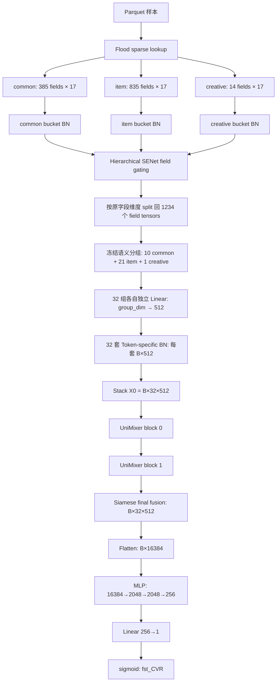
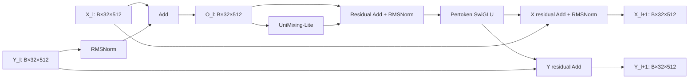

# UniMixer v1：32 个语义 Token、512 维与 fst_CVR 冷启动方案

> 文档版本：`32T-512D / 2026-08-27`。本文只描述当前 32-token 实现，历史草案已从正文移除。

## 0. 最终口径

本方案是一条从 base 训练生命周期出发、与 RankMixer 各版本交互结构解耦的独立 UniMixer 实验线。最终结构为：

> common/item/creative sparse embedding → 三桶输入 BN → 分层 SENet → 按字段切回 → 32 个硬编码语义组分别线性投影到 512 维 → 32 套 Token-specific BN → 2 个 UniMixer-Lite + Pertoken SwiGLU + SiameseNorm block → 展平 → [2048, 2048, 256] MLP → fst_CVR。

固定实验口径如下：

1. 只使用 `common`、`item`、`creative`，不接入 coupon、dense、sequence、gattr 或 DIN。
2. 只预测 `fst_CVR`，不启用 last_CVR、wide、delay 或多任务辅助损失。
3. token 数固定为 `T=32`：`10 common + 21 item + 1 creative`；不存在额外的 CLS/global token，也不复制字段。
4. 每个 token 的表示维度固定为 `D=512`，因此主干输入为 `[B,32,512]`。
5. `block_size q=32`，使展平长度 `L=16384` 时的全局块数仍为 `G=512`。

必须明确：`32×512` 是高容量方案，并不天然保证 AUC 上升。按当前实现估算，固定 dense 可训练参数约 **150.758M**，约为当前 base 90.34M 的 **1.67 倍**。它需要通过同数据、同 checkpoint、同训练步数和多 seed 实验判断是否值得。

## 1. 文件职责与单文件边界

| 文件 | 职责 |
|---|---|
| `src/models/rankmixer/cvr_bn_unimixer_v1.py` | 唯一运行时代码：特征配置、数据集、建图、loss、optimizer、训练/评估/预测/导出生命周期，以及 32 组定义与覆盖校验、温度退火、双随机 UniMixing-Lite、Pertoken SwiGLU、SiameseNorm、桶 BN/SENet、组独立 Linear/BN 和 fst_CVR 模型入口 |
| `src/models/rankmixer/tests/test_unimixer_v1_static.py` | 单文件源码、字段覆盖、token 顺序、参数文件和文档一致性静态测试，不参与服务器建图 |
| `bash/set-unimixer-v1-args.txt` | 本 32T-512D 实验专用的 dense 冷启动训练参数 |

服务器入口固定为 `models.rankmixer.cvr_bn_unimixer_v1.MLPModel`。该类直接继承 `ModelBase`，不再导入或继承 `src/models/seq_model/cvr_bn_senet_dcnm_fst.py` 中的 `MLPModel`。原 base 只作为本次实现的骨架来源：特征配置接口、数据读取、稀疏 lookup、loss、optimizer、AUC/GAUC、训练、测试、预测和导出方法，连同全部 UniMixer v1 算法，都直接写在上述一个文件的同一个 `MLPModel` 中。运行时也不导入现有 RankMixer block 或原 `models.unimixer.unimixer` 模块。

`get_features_conf()` 现在直接定义在单文件的 `MLPModel` 中，Flood 调用 `MLPModel.get_features_conf(**model_args)` 时命中的是本类自己的 classmethod。`get_share_embedding_conf()`、`get_dataset()`、`build()`、loss/optimizer、train/test/predict/export/evaluate/get_hooks 也全部是本类直接方法；`fea_conf_obj` 与 `FeatureColumnBuilder` 同样由本文件内的 `__init__()` 构造。文件中保留的无参数 `super().__init__()` 只调用通用 `ModelBase` 初始化，不会再跳转到 seq_model 或 RankMixer 模型。为控制复制后漂移风险，静态测试会逐项确认原 base 的所有生命周期方法均存在，并对除 `__init__()` 与被替换的 `model_fn()` 之外的方法做 AST 等价校验。

## 2. 总体算法流程图

## 3. 输入约束和预处理

### 3.1 输入字段

| bucket | 字段数 | 默认 embedding 维 | 拼接维度 | token 数 |
|---|---:|---:|---:|---:|
| common | 385 | 17 | 6,545 | 10 |
| item | 835 | 17 | 14,195 | 21 |
| creative | 14 | 17 | 238 | 1 |
| 合计 | 1,234 | — | 20,978 | 32 |

模型在建图时检查 coupon/dense/sequence/gattr/din 均为空；任何额外 bucket 非空都会直接失败。语义表还会与 `cvr_fea_v10_base_cold` 的三桶字段做集合级严格校验：遗漏、未知字段、桶内重复或跨桶重复都会失败。

### 3.2 两级 BN 与 SENet

先在每个原始业务桶拼接后做输入 BN，再执行 base 的层级 SENet：

- common gate 只观察 common；
- item gate 观察 common + item；
- creative gate 观察 common + item + creative；
- gate 输出为 `2·sigmoid(·)`，对每个 field 的 17 维 embedding 整体缩放。

随后按照每个原 field 的静态 embedding 宽度切回。也就是说，语义 Tokenization 使用的是经过 base 输入稳定化和 field gating 的表示，不会绕过第一层 BN/SENet。

每个语义组完成独立 Linear 投影后，再执行一套只属于该组的 Token-specific BN。第 `i` 套 BN 的输入是 `[B,512]`，为 512 个通道分别维护 `gamma_i`、`beta_i`、`moving_mean_i` 和 `moving_variance_i`，统计只跨 batch 维；32 个 token 之间不共享统计量，也不会把 `[B,32,512]` 的 token 轴混入同一套 BN。BN 后不加 GELU/ReLU，直接 stack 进入 UniMixer。

两级 BN 的职责不同：桶 BN 在 SENet 之前稳定 3 个超长原始输入；SENet 与 32 个不同的投影矩阵会重新改变各语义组的尺度和方差，投影后 BN 再把 UniMixer 的 32 行输入拉回可比较的数值范围。实现调用项目 TF1/Flood 的 `ModelBase.batch_norm_layer_v2`，并由本类直接读取 `batch_norm_decay`、`use_riemann_bn` 和 export 配置；服务器参数显式固定 `um_use_token_bn=true`。

## 4. 32 个语义 token

### 4.1 分组原则

32 个 token 是互斥且完备的细粒度业务语义域，不是把三桶长向量随机切片，也不是把一个粗桶投影成若干长度后再 reshape。每个 field 恰好进入一个 token。

桶配额先按字段量近似分配：`32×385/1234≈9.98`、`32×835/1234≈21.65`、`32×14/1234≈0.36`。由于每个业务桶至少保留一个 token，最终固定为 `10 common + 21 item + 1 creative`。这不是要求全局所有 token 的字段数完全相等：common 为 38/39 个字段，item 为 35/41/42 个字段，creative 只有 14 个字段。划分优先级是“桶容量比例 → 语义内聚 → 桶内尽量均衡”；为了从 item 增加第 21 个 token，将跨度最大的价格/促销/购买力交叉域拆成 6 个 35-field 语义组，而不是从其他业务域硬搬字段凑 39/40。creative 的 14 个字段全部归入一个完整的展示与报价语义 token，避免用两个只有 6/8 个字段的小 token 过度代表这个小桶。

### 4.2 固定顺序和输入维度

| token | bucket | 语义组 | 含义 | fields | Linear 输入维度 | 输出 |
|---:|---|---|---|---:|---:|---|
| 0 | common | `common_user_profile_device_geo_lifecycle` | 用户画像、设备、地域、生命周期与购买力 | 39 | 663 | 512 |
| 1 | common | `common_user_order_consumption_value` | 用户下单、购买与消费价值 | 39 | 663 | 512 |
| 2 | common | `common_user_purchase_price_recency` | 历史购买价格、行为时距与复购信号 | 39 | 663 | 512 |
| 3 | common | `common_longterm_view_exposure_interest` | 长期浏览、曝光与实体兴趣 | 39 | 663 | 512 |
| 4 | common | `common_longterm_click_fav_interest` | 长期点击、收藏、停留与行为兴趣 | 39 | 663 | 512 |
| 5 | common | `common_query_text_intent` | Query 文本、NER、词项与搜索意图 | 38 | 646 | 512 |
| 6 | common | `common_query_retrieval_relevance` | Query 召回、候选命中与相关性上下文 | 38 | 646 | 512 |
| 7 | common | `common_realtime_session_action` | 实时会话动作与短周期行为 | 38 | 646 | 512 |
| 8 | common | `common_shortterm_candidate_funnel` | 短期曝光、点击与候选漏斗 | 38 | 646 | 512 |
| 9 | common | `common_shortterm_funnel_page_context` | 页面、位置、时间与搜索会话上下文 | 38 | 646 | 512 |
| 10 | item | `item_goods_category_brand_identity` | 商品、类目、品牌与候选身份 | 42 | 714 | 512 |
| 11 | item | `item_shop_static_quality_service` | 店铺、静态质量、服务与属性 | 42 | 714 | 512 |
| 12 | item | `item_title_query_lexical_ner` | 标题、Query、词项与 NER 字面相关性 | 42 | 714 | 512 |
| 13 | item | `item_semantic_category_relevance` | 语义、类目与文本向量相关性 | 42 | 714 | 512 |
| 14 | item | `item_image_video_embedding_similarity` | 图像、视频与多模态向量相似性 | 42 | 714 | 512 |
| 15 | item | `item_current_price_supply` | 当前价格、SKU 供给与商品价值 | 35 | 595 | 512 |
| 16 | item | `item_coupon_promotion_discount` | 优惠券、促销、折扣与活动供给 | 35 | 595 | 512 |
| 17 | item | `item_user_purchase_price_preference` | 用户购买价格与消费偏好 | 35 | 595 | 512 |
| 18 | item | `item_user_view_click_price_preference` | 用户浏览点击价格偏好 | 35 | 595 | 512 |
| 19 | item | `item_price_gap_rank_competitiveness` | 价格差、价格排序与竞争力 | 35 | 595 | 512 |
| 20 | item | `item_price_promotion_buypower_context` | 价格、促销、购买力、活动与召回源的交叉上下文 | 35 | 595 | 512 |
| 21 | item | `item_goods_category_global_funnel` | 商品类目全局漏斗统计 | 42 | 714 | 512 |
| 22 | item | `item_shop_brand_global_quality` | 店铺品牌全局质量统计 | 42 | 714 | 512 |
| 23 | item | `item_purchase_order_fav_affinity` | 购买、下单与收藏正向亲和 | 42 | 714 | 512 |
| 24 | item | `item_longterm_exposure_view_affinity` | 长期曝光浏览亲和 | 42 | 714 | 512 |
| 25 | item | `item_click_stay_engagement` | 点击、停留与深度互动 | 42 | 714 | 512 |
| 26 | item | `item_shortterm_candidate_funnel` | 短期候选曝光点击漏斗 | 41 | 697 | 512 |
| 27 | item | `item_session_page_position_context` | 当前会话、页面与位置上下文 | 41 | 697 | 512 |
| 28 | item | `item_i2i_graph_neighbor_recall` | i2i、图关系与邻居召回 | 41 | 697 | 512 |
| 29 | item | `item_u2i_q2i_query_recall` | u2i、q2i 与 Query 触发召回 | 41 | 697 | 512 |
| 30 | item | `item_recall_source_hit_rank_path` | 召回源、命中、排序与路径 | 41 | 697 | 512 |
| 31 | creative | `creative_display_offer` | 创意图片、展示形态、券与促销表达 | 14 | 238 | 512 |

Token 顺序就是模型 ABI。训练、测试和导出都按上表顺序 stack；不能在运行时随机打乱，也不能在续训时改变字段归属。

## 5. 语义 Tokenization 的公式与矩阵维度

对第 `i` 个语义组 `S_i`，将组内已经过 BN/SENet 的 field embedding 按冻结顺序拼接：

`z_i = Concat({e_j | j ∈ S_i}) ∈ R^(B×(17·|S_i|))`

每个语义组拥有自己独立的线性矩阵，随后使用自己独立的 BN：

`p_i = z_i W_i + b_i`

`t_i = BN_i(p_i; gamma_i, beta_i)`

`W_i ∈ R^((17·|S_i|)×512), b_i,gamma_i,beta_i ∈ R^512, p_i,t_i ∈ R^(B×512)`

最后按 token 0…31 stack：

`X_0 = Stack(t_0,…,t_31) ∈ R^(B×32×512)`

BN 后不做激活、不做二次 reshape。这样每个 token 的行边界与语义组边界完全一致，解决了现有项目 UniMixer 中“先按粗桶投影成长向量、拼接、再 reshape”无法保证每个 token 对应一个语义域的问题。这里的 `BN_i` 是 32 套独立模块，而不是先 stack 后对 token 轴共享的一套 BN。

全部 token projection 的权重数只由总输入宽度决定：

`Σ_i (17·|S_i|)·512 = 20,978·512 = 10,740,736`

32 个 bias 共 `32·512=16,384`，所以投影层合计 **10,757,120** 个可训练参数。Token-specific BN 再增加 `32·512·2=32,768` 个可训练的 gamma/beta；moving mean/variance 属于非可训练状态，不计入该数字。

## 6. UniMixing-Lite：32×512 下的维度流

设 `T=32`、`D=512`、展平长度 `L=T·D=16,384`、块宽 `q=32`，则全局块数：

`G=L/q=16,384/32=512`。

一次 UniMixing-Lite 的张量变化为：

| 步骤 | 张量形状 | 说明 |
|---|---|---|
| 输入 | `[B,32,512]` | 32 个固定语义 token |
| flatten | `[B,16384]` | 保持 token 顺序 |
| reshape | `[B,512,32]` | 512 个连续块，每块宽 32 |
| transpose | `[512,B,32]` | 为每个块执行块内混合 |
| 块内混合 | `[512,B,32]` | 每块乘 `W_B[g]∈R^(32×32)` |
| transpose | `[B,32,512]` | 32 个块内位置 × 512 个块 |
| 块间混合 | `[B,32,512]` | 最后一维乘 `W_G∈R^(512×512)` |
| transpose/reshape | `[B,32,512]` | 回到 token 表示 |

参数化方式：

- `W_G = U V^T`，`U,V∈R^(512×128)`；
- `W_B[g]=Σ_k α[g,k] Base[k]`；
- `Base∈R^(8×32×32)`，`α∈R^(512×8)`；
- 温度从 1.0 线性退火到 0.05，并对 `W_G` 和 `W_B` 做 Sinkhorn 双随机归一化。

每个 UniMixing-Lite 的可训练参数为 `2·512·128 + 8·32·32 + 512·8 = 143,360`；两层共 **286,720**。当前直接选择 `q=32`，因为 `L=16,384` 时可得到 `G=512`；如果继续减小块宽，`G` 和运行时显式构造的 `W_G∈R^(G×G)` 都会迅速增大。

## 7. Pertoken SwiGLU 与 SiameseNorm

### 7.1 Pertoken SwiGLU

每个 token 独享 gate/up/down 三套矩阵，`d_ff=2D=1024`：

- `W_gate,W_up ∈ R^(32×512×1024)`；
- `W_down ∈ R^(32×1024×512)`；
- 输入 `[B,32,512]`；gate/up 中间量 `[B,32,1024]`；输出 `[B,32,512]`。

单个 Pertoken SwiGLU 参数为 **50,413,568**，两个 block 共 **100,827,136**。这是 `32×512` 版本最大的参数和计算来源。

### 7.2 单个 block 的连接

对应计算为：

`O_l = X_l + RMSNorm(Y_l)`

`M_l = UniMixingLite(O_l)`

`H_l = pSwiGLU(RMSNorm(O_l + M_l))`

`X_(l+1) = RMSNorm(X_l + H_l)`

`Y_(l+1) = Y_l + H_l`

堆叠两层后输出 `X_2 + RMSNorm(Y_2)`，形状仍为 `[B,32,512]`。所有 RMSNorm 只在最后一维 512 上归一化。

## 8. fst_CVR 任务头

最终 token 矩阵直接展平：

`[B,32,512] → [B,16384]`。

任务塔为：

| 层 | 维度 | BN | 激活 |
|---|---|---|---|
| MLP0 | 16384 → 2048 | 是 | `gelu_2` |
| MLP1 | 2048 → 2048 | 是 | `gelu_2` |
| MLP2 | 2048 → 256 | 是 | `gelu_2` |
| 输出 | 256 → 1 | 否 | identity，再 sigmoid |

展平保留 32 个位置的身份信息，但首层权重达到 `16,384×2,048=33,554,432`。模型只返回 `logits` 与 `pred`，并强制 `opt_goal=first_cvr`、`cvr_label_name=fst_cvr_label`。

## 9. 固定 dense 参数量估算

以下不含稀疏 embedding table，不含 BN moving mean/variance，只统计默认参数下的可训练 dense 参数：

| 模块 | 参数量 |
|---|---:|
| 三桶输入 BN | 41,956 |
| 层级 SENet 权重 | 521,344 |
| SENet 内 3 个 128 维 BN | 768 |
| 32 个 token-specific linear | 10,757,120 |
| 32 套 Token-specific BN gamma/beta | 32,768 |
| 2 × UniMixing-Lite | 286,720 |
| 2 × Pertoken SwiGLU | 100,827,136 |
| Siamese/RMSNorm scales | 3,584 |
| fst_CVR MLP + 3 个 BN + 输出层 | 38,286,337 |
| **合计** | **150,757,733（约 150.758M）** |

这一估算揭示了关键事实：只要 1,234 个字段仍各覆盖一次，如何把它们分配到 32 组几乎不改变 projection 权重总量；当前模型的主要参数来自按 token 独立的 SwiGLU，以及 flatten 后的首层任务塔。

## 10. 与 UniMixer 原论文逐项对比

参考：[UniMixer 原论文（arXiv:2604.00590）](https://arxiv.org/abs/2604.00590)。

| 维度 | 原论文思路 | 本 32-token v1 |
|---|---|---|
| Tokenization | 先按语义域组织特征，再在域内形成等宽 token；token 边界应有语义含义 | 将 1,234 个字段冻结为 32 个互斥语义域，每域独立 Linear 到 512；不通过粗桶长投影后 reshape |
| token 输入归一化 | 论文核心公式不要求本项目这套“桶 BN + SENet + 每 token BN”前处理 | 工程适配为桶 BN → SENet → 组 Linear → 组独立 BN；BN 后不加激活 |
| 输入域 | 论文是通用推荐建模，不绑定本项目 bucket | 只允许 common/item/creative |
| token 数/宽度 | 论文超参化 | 固定 `T=32,D=512` |
| Mixer | 局部/全局可学习 mixing 并以温度退火形成接近置换/双随机结构 | 复用项目的低秩 `UniMixing-Lite`：`q=32,G=512,r=128,K=8` |
| FFN | token-specific SwiGLU | 每个 token 独立 gate/up/down，`d_ff=1024` |
| 残差 | UniMixing、FFN 与 SiameseNorm 有明确连接次序 | 在新 wrapper 中按该次序显式连接 |
| MoE | 论文完整方案可包含更丰富的稀疏专家设计 | v1 不引入 MoE，控制新增实验变量 |
| 任务头 | 依具体任务设置 | 只做 fst_CVR 的 flatten MLP |

本方案相对项目当前实现最重要的修正不是把 `D` 变大，而是使 **token 行边界等于语义组边界**。`D=512` 只是容量选择；真正保证 Tokenization 语义一致性的是每组独立投影、独立 BN 后直接 stack。投影后 BN 是面向本 CVR 输入分布的工程增强，不应描述成论文原公式的一部分，因此消融实验需单独报告它的贡献。

## 11. 与项目当前 UniMixer 实现的不同

这里的“项目当前 UniMixer”严格按运行文件确认：`bash/set-unimixer.txt` 首行是 `models.unimixer.cvr_fst_last_norpy.MLPModel`，对应 `src/models/unimixer/cvr_fst_last_norpy.py`，并由它调用 `src/models/unimixer/unimixer.py`。`src/models/mixformer/cvr_fst_last_norpy.py` 是另一条 MixFormer 路线，不是该运行参数的实际模型入口。

| 项目当前 UniMixer | 本独立 v1 |
|---|---|
| common/item/creative/dense/din/gattr 六个粗输入分别投影成长向量，再 concat/reshape 成 32×256 | 仅三桶；先拆成 32 个明确语义组，每组独立投影与 BN 后直接 stack 为 32×512 |
| token 边界由各粗桶输出长度与 reshape 位置决定，行内可能混合多个语义子域 | token 0…31 的字段表完整冻结，边界可解释且可测试 |
| `T=32,D=256,L=8192,q=16,G=512` | `T=32,D=512,L=16384,q=32,G=512` |
| 每个粗桶先长向量投影，再做桶级 BN + GELU，最后 concat/reshape | v1 使用语义组独立 Linear → Token-specific BN，不加 GELU；其前仍保留桶 BN/SENet |
| 同时服务 fst/last 等既有任务配置 | 强制只输出 fst_CVR |
| 旧 block/helper 的连接由原实现决定 | 新 wrapper 显式组织 UniMixing → residual RMSNorm → pSwiGLU → Siamese 双流更新 |
| 与项目既有六桶数据结构耦合 | 与 RankMixer block 解耦；原 base 生命周期和所需 UniMixer 算子均内置在单文件中 |

## 12. 当前 32×512 方案的容量与风险

### 12.1 唯一有效的结构口径

| 超参数或张量 | 当前值 |
|---|---:|
| 语义 token 数 `T` | 32 |
| token 宽度 `D` | 512 |
| Mixer 输入 | `[B,32,512]` |
| 展平长度 `L` | 16,384 |
| block size `q` | 32 |
| 全局块数 `G=L/q` | 512 |
| UniMixer block 数 | 2 |
| pSwiGLU 隐层 `d_ff` | 1,024 |
| 任务头 | `16384→2048→2048→256→1` |
| 固定 dense 可训练参数 | 约 150.758M |

### 12.2 预期收益

- 32 个 token 都对应独立业务语义域，能够减少粗粒度拼接后再 reshape 造成的语义边界错位；
- 每个 token 独立 BN，避免 common/item/creative 及不同投影矩阵产生的尺度差异直接进入 Mixer；
- 512 维为每个语义域保留更充足的表示子空间；
- token 位置固定，flatten readout 可以区分不同语义域的贡献；
- UniMixing-Lite 同时建模块内与跨块交互，pSwiGLU 再为每个 token 提供独立非线性变换。

### 12.3 主要风险

- 两层 Pertoken SwiGLU 共约 100.827M 参数，是最明显的显存和计算瓶颈；
- `batch_size=2048` 时，中间张量 `[B,32,1024]` 及其反向梯度可能使 worker 内存承压；
- 150.758M dense 参数高于 base，样本不足或正例稀疏时更容易扩大训练/测试 AUC 间隙；
- token BN 依赖有效 batch 统计；若服务器实际每卡/每 worker 的有效 batch 远小于配置值，应重点观察 moving statistics 稳定性和 train/eval gap；
- 32 个硬编码语义组成为模型 ABI，任何特征版本变化都必须同步修改语义表并重新验收覆盖关系。

若资源不足，正确的消融方式是保留同一套 32 组语义 Tokenization，仅把 `D` 降为 256；不应回退到粗桶长投影后 reshape，否则会同时改变容量与 Tokenization 语义，无法判断 AUC 差异来自哪里。

## 13. 运行参数与实验建议

`bash/set-unimixer-v1-args.txt` 的关键固定项：

- `um_token_num=32`；
- `um_token_dim=512`；
- `um_bucket_token_counts=[10,21,1]`；
- `um_use_token_bn=true`；
- `um_num_blocks=2`；
- `um_block_size=32`；
- `um_rank=128`、`um_num_bases=8`、`um_swiglu_expansion=2`；
- `cvr_layers=[2048,2048,256]`；
- `ignore_dense_checkpoint=True`、`ignore_sparse_checkpoint=False`。

建议至少保留三组严格对照：base、当前项目 UniMixer `32×256`、本语义 UniMixer `32×512`。若要判断 512 维本身的价值，再补一组结构完全相同的语义 UniMixer `32×256`。所有实验固定训练/测试日期、稀疏 checkpoint、采样、batch size、优化器、训练步数和 AUC/GAUC 口径，并至少使用 3 个随机种子。

重点监控：PS/worker 内存、单 step 时延、训练 AUC 与测试 AUC 间隙、分语义 token 的梯度范数，以及温度 `τ` 是否从约 1.0 正常退火。`batch_size=2048` 下，pSwiGLU 的 `[B,32,1024]` 中间激活本身就很大，真实训练镜像的建图和首 step 压测是上线前置条件。

## 14. 完整字段附录

附录由单文件 `cvr_bn_unimixer_v1.py` 内的 `build_semantic_feature_groups()` 固定顺序展开。每个正文中的反引号 ID 都是该 token 的唯一输入字段。

### 14.1 common

Token 0: `common_user_profile_device_geo_lifecycle` — 用户画像、设备、地域、生命周期与购买力（39 fields，输入 663 维）

`1001`、`1006`、`1014`、`1034`、`1035`、`1036`、`1041`、`1042`、`1043`、`1501`、`1504`、`1505`、`1527`、`25003`、`866024`、`868023`、`10231`、`10232`、`10233`、`10522`、`10601`、`1502`、`19013`、`19016`、`201704`、`20517`、`20521`、`21403`、`21404`、`25000`、`25001`、`25002`、`25006`、`25044`、`25700`、`340121`、`790249`、`790250`、`790251`

Token 1: `common_user_order_consumption_value` — 用户下单、购买与消费价值（39 fields，输入 663 维）

`10442`、`1104`、`1106`、`200306`、`201702`、`201914`、`201915`、`202218`、`2066`、`210000`、`210001`、`21264`、`231056`、`231065`、`24082411`、`24082412`、`24082413`、`26017`、`26021`、`26025`、`26107`、`863712`、`863729`、`866012`、`866014`、`866023`、`866027`、`866029`、`866054`、`866064`、`866065`、`866070`、`870277`、`870324`、`795602`、`340123`、`340125`、`110153`、`110011`

Token 2: `common_user_purchase_price_recency` — 历史购买价格、行为时距与复购信号（39 fields，输入 663 维）

`131480`、`16725`、`16727`、`16731`、`16733`、`16735`、`16737`、`16739`、`200300`、`200302`、`200303`、`200304`、`200320`、`201756`、`201757`、`201939`、`21749`、`21750`、`862355`、`862376`、`866034`、`866063`、`866069`、`33866903`、`870322`、`340093`、`110151`、`340122`、`200318`、`200319`、`204530`、`204543`、`241125006`、`4418196`、`860031`、`860034`、`860037`、`860042`、`860045`

Token 3: `common_longterm_view_exposure_interest` — 长期浏览、曝光与实体兴趣（39 fields，输入 663 维）

`10600`、`1063`、`1064`、`1065`、`1509`、`1512`、`1521`、`1524`、`18021`、`18094`、`18098`、`18100`、`18105`、`18214`、`19024`、`200124`、`21055`、`21233`、`21238`、`21239`、`21240`、`21246`、`21257`、`21258`、`21260`、`4500`、`4501`、`4502`、`4503`、`4504`、`863014`、`866072`、`870311`、`2017702`、`4418192`、`031090`、`340063`、`340092`、`340054`

Token 4: `common_longterm_click_fav_interest` — 长期点击、收藏、停留与行为兴趣（39 fields，输入 663 维）

`1121`、`12403`、`12438`、`200714`、`200715`、`200762`、`200764`、`201720`、`201905`、`201906`、`201909`、`202144`、`2073`、`210015`、`210042`、`21355`、`21602`、`21610`、`231383`、`231384`、`231484`、`25045`、`25046`、`2509`、`25702`、`25703`、`26035`、`33600031`、`863018`、`866041`、`866066`、`866068`、`866071`、`866082`、`867603`、`340059`、`340086`、`340037`、`340001`

Token 5: `common_query_text_intent` — Query 文本、NER、词项与搜索意图（38 fields，输入 646 维）

`12209`、`12402`、`15000`、`15002`、`16743`、`16744`、`25136`、`25138`、`27516`、`3006`、`3007`、`3008`、`3009`、`6910`、`6911`、`6912`、`790220`、`790221`、`790222`、`790230`、`794734`、`794768`、`794802`、`863044`、`863046`、`866013`、`2014601`、`2015703`、`160034`、`87560211`、`340453`、`340394`、`340364`、`340374`、`340367`、`340451`、`340377`、`340455`

Token 6: `common_query_retrieval_relevance` — Query 召回、候选命中与相关性上下文（38 fields，输入 646 维）

`200200`、`200214`、`200758`、`2104`、`211121`、`2112`、`600154`、`7007737`、`7007741`、`7007746`、`7007755`、`794014`、`794015`、`794030`、`794031`、`794164`、`794178`、`794179`、`794200`、`794208`、`794209`、`794210`、`794214`、`794215`、`863141`、`866250`、`866251`、`868413`、`868414`、`870025`、`795014`、`795012`、`2015709`、`2015745`、`2022401`、`300091`、`306045`、`310614`

Token 7: `common_realtime_session_action` — 实时会话动作与短周期行为（38 fields，输入 646 维）

`13037`、`13038`、`13039`、`200752`、`201930`、`201931`、`201932`、`201937`、`21010`、`21012`、`21013`、`2123`、`2503`、`2504`、`25049`、`2505`、`2506`、`2507`、`300000`、`3014`、`3015`、`3016`、`6900`、`860023`、`861818`、`862311`、`863030`、`866061`、`868404`、`868405`、`868407`、`868427`、`870038`、`881402`、`881404`、`4439006`、`340109`、`340160`

Token 8: `common_shortterm_candidate_funnel` — 短期曝光、点击与候选漏斗（38 fields，输入 646 维）

`12235`、`18073`、`18078`、`18083`、`200413`、`201900`、`202223`、`202330`、`202333`、`202334`、`21351`、`21359`、`21402`、`21663`、`865600`、`866103`、`867645`、`867648`、`870059`、`870069`、`870130`、`881102`、`881104`、`881665`、`881687`、`881691`、`881711`、`882303`、`882304`、`882306`、`882305`、`881820`、`881816`、`881842`、`881818`、`881834`、`881817`、`304322`

Token 9: `common_shortterm_funnel_page_context` — 页面、位置、时间与搜索会话上下文（38 fields，输入 646 维）

`21303`、`21307`、`21340`、`20518`、`2100`、`2101`、`2102`、`2103`、`215401`、`246003`、`24904004`、`3001`、`1070`、`200305`、`202425`、`202426`、`21030`、`21031`、`21032`、`21033`、`215311`、`215312`、`215343`、`215373`、`24082402`、`3003`、`3004`、`3020`、`3102`、`3103`、`863024`、`866073`、`881203`、`881204`、`881206`、`881215`、`881663`、`881664`

### 14.2 item

Token 10: `item_goods_category_brand_identity` — 商品、类目、品牌与候选身份（42 fields，输入 714 维）

`6007`、`10003`、`10013`、`10014`、`10016`、`10018`、`10020`、`10021`、`10022`、`10012`、`10062`、`1086`、`13020`、`13021`、`13022`、`17194`、`200313`、`27631`、`302185`、`5001`、`6001`、`6004`、`6008`、`6013`、`6021`、`6501`、`7001`、`7501`、`10068`、`10410`、`24021`、`1600912`、`19041`、`19042`、`19044`、`19047`、`200727`、`200729`、`201705`、`24082417`、`241215001`、`241215101`

Token 11: `item_shop_static_quality_service` — 店铺、静态质量、服务与属性（42 fields，输入 714 维）

`600022`、`6206`、`10059`、`200311`、`200314`、`206056`、`500000`、`500300`、`500301`、`500302`、`600024`、`820000`、`820004`、`27632`、`160070`、`302503`、`302552`、`302595`、`304911`、`304946`、`304952`、`340076`、`5014`、`600100`、`600101`、`6012`、`6016`、`7002`、`7007708`、`7007710`、`7007711`、`7007713`、`820001`、`820025`、`820061`、`881226`、`881237`、`881709`、`881721`、`881733`、`881757`、`2015723`

Token 12: `item_title_query_lexical_ner` — 标题、Query、词项与 NER 字面相关性（42 fields，输入 714 维）

`18504`、`6893`、`25116`、`6892`、`13009`、`13010`、`18501`、`18503`、`25113`、`25120`、`340483`、`341358`、`4012`、`6871`、`6894`、`7809`、`13005`、`28013`、`28017`、`28019`、`28023`、`2115`、`25106`、`28003`、`341105`、`341353`、`4007`、`4009`、`6870`、`7806`、`13006`、`8112`、`87560214`、`10219`、`10419`、`24808118`、`4003`、`5410`、`6914`、`8501`、`87560127`、`87560133`

Token 13: `item_semantic_category_relevance` — 语义、类目与文本向量相关性（42 fields，输入 714 维）

`211100`、`340100`、`341320`、`37615`、`37616`、`37617`、`37618`、`770584`、`3402761`、`13002`、`211130`、`3400141`、`340044`、`6888`、`8502`、`204202`、`33204162`、`33204180`、`33204182`、`862616`、`862844`、`864132`、`864157`、`864215`、`204242`、`33204187`、`864386`、`864410`、`340116`、`3401661`、`341265`、`33866914`、`33868929`、`865682`、`882235`、`770656`、`770657`、`770607`、`864553`、`865093`、`865344`、`865349`

Token 14: `item_image_video_embedding_similarity` — 图像、视频与多模态向量相似性（42 fields，输入 714 维）

`200640`、`200780`、`201021`、`203742`、`212502`、`864743`、`864744`、`864770`、`864774`、`865118`、`865275`、`865416`、`865421`、`33203301`、`33203302`、`33203303`、`33203308`、`33203320`、`33203330`、`33203332`、`33203333`、`160077`、`2015493`、`206201`、`206301`、`206389`、`206563`、`206585`、`212402`、`212422`、`212432`、`33203334`、`33205180`、`33205227`、`4418073`、`621856`、`6802`、`870001`、`882223`、`882225`、`882227`、`882233`

Token 15: `item_current_price_supply` — 当前价格、SKU 供给与商品价值（35 fields，输入 595 维）

`16759`、`27303`、`6046`、`863060`、`27308`、`22102`、`22119`、`302533`、`500150`、`500151`、`131485`、`21762`、`27443`、`27445`、`27459`、`27606`、`770521`、`500103`、`16728`、`16742`、`16746`、`20512`、`500158`、`6133`、`6134`、`6859`、`241215065`、`4017`、`500003`、`500015`、`6041`、`12204`、`12205`、`12206`、`201716`

Token 16: `item_coupon_promotion_discount` — 优惠券、促销、折扣与活动供给（35 fields，输入 595 维）

`22120`、`27635`、`276351`、`500121`、`500136`、`500137`、`868029`、`868030`、`10524`、`140707`、`27447`、`27626`、`27634`、`27640`、`500120`、`500134`、`500135`、`868291`、`10528`、`24530`、`27311`、`27316`、`27321`、`274471`、`622316`、`622555`、`6852`、`780011`、`2022429`、`2022444`、`16726`、`27102`、`27616`、`500159`、`622530`

Token 17: `item_user_purchase_price_preference` — 用户购买价格与消费偏好（35 fields，输入 595 维）

`131474`、`131475`、`131476`、`131478`、`131479`、`131482`、`203708`、`208000`、`208001`、`770461`、`770462`、`770470`、`770471`、`10359`、`11006`、`131466`、`131467`、`131468`、`131470`、`131472`、`131473`、`131483`、`131484`、`160065`、`206081`、`206082`、`21702`、`21743`、`21746`、`21752`、`22106`、`33204181`、`900086`、`206510`、`22101`

Token 18: `item_user_view_click_price_preference` — 用户浏览点击价格偏好（35 fields，输入 595 维）

`200181`、`21708`、`21728`、`22129`、`22131`、`24330`、`24332`、`27402`、`3401321`、`4418101`、`770460`、`770469`、`867665`、`867685`、`870313`、`870315`、`206077`、`215393`、`21668`、`21669`、`21726`、`21729`、`246004`、`246005`、`246006`、`246007`、`246014`、`33203310`、`33203311`、`33203312`、`33203321`、`33203331`、`33866909`、`33866912`、`33866915`

Token 19: `item_price_gap_rank_competitiveness` — 价格差、价格排序与竞争力（35 fields，输入 595 维）

`340824`、`24541`、`206310`、`208011`、`208012`、`208013`、`208014`、`208015`、`21760`、`24328`、`24496`、`24497`、`24498`、`27367`、`27507`、`33204185`、`33204186`、`33204196`、`33205186`、`33795608`、`33795609`、`33795610`、`33868952`、`33868953`、`33868961`、`33868965`、`33868969`、`33868973`、`33868976`、`33868977`、`794165`、`794201`、`794212`、`794213`、`900643`

Token 20: `item_price_promotion_buypower_context` — 价格、促销、购买力、活动与召回源的交叉上下文（35 fields，输入 595 维）

`201735`、`206550`、`302502`、`861219`、`870008`、`870012`、`870303`、`622533`、`10520`、`110041`、`140700`、`500001`、`864219`、`870310`、`600001`、`881108`、`10216`、`10387`、`10388`、`25027`、`5019`、`33866926`、`33868954`、`33868970`、`33868978`、`870177`、`208030`、`208034`、`208016`、`310601`、`310602`、`310604`、`6011`、`60119`、`6047`

Token 21: `item_goods_category_global_funnel` — 商品类目全局漏斗统计（42 fields，输入 714 维）

`10207`、`10213`、`10154`、`10160`、`10310`、`24108`、`24116`、`24121`、`24701`、`24703`、`24705`、`24707`、`24708`、`24709`、`24711`、`24710`、`25506`、`600233`、`25504`、`10152`、`24218`、`24246`、`621415`、`810107`、`810109`、`820003`、`19035`、`24702`、`24704`、`24706`、`25501`、`25717`、`340028`、`341102`、`25515`、`33758666`、`10210`、`6131`、`600253`、`600255`、`12122`、`212611`

Token 22: `item_shop_brand_global_quality` — 店铺品牌全局质量统计（42 fields，输入 714 维）

`6224`、`6804`、`10407`、`10413`、`25008`、`25015`、`621414`、`622496`、`863069`、`160067`、`24107`、`24115`、`25010`、`25011`、`25012`、`600102`、`241215011`、`241215038`、`24231`、`24237`、`24242`、`24531`、`25014`、`304913`、`600112`、`6052`、`621412`、`621416`、`621872`、`621877`、`621878`、`863056`、`6811`、`770568`、`810103`、`810132`、`7502`、`868036`、`302190`、`600200`、`600201`、`600202`

Token 23: `item_purchase_order_fav_affinity` — 购买、下单与收藏正向亲和（42 fields，输入 714 维）

`12157`、`25093`、`4014`、`770560`、`870279`、`131048`、`131049`、`21053`、`200106`、`21054`、`21201`、`21202`、`26003`、`26007`、`302554`、`10010`、`1110`、`1111`、`12100`、`12118`、`12119`、`12120`、`17033`、`200105`、`200310`、`200325`、`201809`、`201916`、`202096`、`206029`、`2111`、`25073`、`25711`、`25721`、`25741`、`302302`、`304393`、`3400731`、`341103`、`341421`、`870270`、`203797`

Token 24: `item_longterm_exposure_view_affinity` — 长期曝光浏览亲和（42 fields，输入 714 维）

`21051`、`200104`、`200765`、`21050`、`21052`、`304395`、`621842`、`861534`、`869300`、`870257`、`304394`、`25059`、`7007715`、`7007716`、`870263`、`870264`、`231334`、`231344`、`231374`、`304451`、`304452`、`770459`、`770468`、`863132`、`863210`、`1602601`、`1602631`、`200324`、`200615`、`200751`、`200753`、`21034`、`21035`、`21036`、`21037`、`215334`、`215337`、`25048`、`3401371`、`870166`、`863054`、`340756`

Token 25: `item_click_stay_engagement` — 点击、停留与深度互动（42 fields，输入 714 维）

`206157`、`231333`、`3029611`、`28060`、`200107`、`200585`、`201717`、`201910`、`201911`、`20500`、`20501`、`20504`、`20505`、`21242`、`231494`、`200315`、`200316`、`25751`、`25752`、`25754`、`302342`、`302374`、`33203304`、`33203306`、`33203607`、`200317`、`33866919`、`33866925`、`4418001`、`7007714`、`7704561`、`770473`、`770570`、`770571`、`860066`、`863133`、`33868943`、`33868950`、`340761`、`865341`、`865342`、`865711`

Token 26: `item_shortterm_candidate_funnel` — 短期候选曝光点击漏斗（41 fields，输入 697 维）

`12111`、`12104`、`12110`、`12112`、`12117`、`12101`、`12113`、`12115`、`12155`、`10002`、`10007`、`10008`、`12088`、`12092`、`12094`、`25060`、`770626`、`863009`、`863047`、`18010`、`215350`、`215399`、`340070`、`770583`、`770627`、`770630`、`820027`、`820028`、`820029`、`820035`、`863087`、`863286`、`868500`、`868513`、`17135`、`17136`、`17137`、`17139`、`868486`、`241215027`、`241215127`

Token 27: `item_session_page_position_context` — 当前会话、页面与位置上下文（41 fields，输入 697 维）

`24082404`、`881284`、`341888`、`600249`、`600254`、`863062`、`881220`、`881221`、`881265`、`881267`、`881309`、`881353`、`881681`、`881705`、`881717`、`21110`、`21114`、`21115`、`12134`、`12137`、`12138`、`12140`、`160063`、`340096`、`881634`、`206051`、`340317`、`340321`、`340335`、`3403491`、`770472`、`882326`、`882353`、`882354`、`882385`、`882416`、`882417`、`882419`、`882369`、`882371`、`206206`

Token 28: `item_i2i_graph_neighbor_recall` — i2i、图关系与邻居召回（41 fields，输入 697 维）

`17053`、`17062`、`17086`、`17107`、`794005`、`794021`、`794169`、`870402`、`17027`、`17177`、`18197`、`200754`、`201825`、`201856`、`201912`、`201918`、`24082423`、`241125018`、`247030061`、`247031681`、`302987`、`304383`、`3044501`、`304456`、`310588`、`340296`、`4061`、`620000`、`770588`、`770590`、`770591`、`770592`、`860076`、`860090`、`881025`、`900017`、`900647`、`909043`、`865618`、`14237`、`341104`

Token 29: `item_u2i_q2i_query_recall` — u2i、q2i 与 Query 触发召回（41 fields，输入 697 维）

`861124`、`861201`、`861540`、`870357`、`27533`、`861213`、`870373`、`87560205`、`861504`、`863780`、`863802`、`863808`、`863811`、`870340`、`17058`、`17071`、`17111`、`17178`、`27525`、`861060`、`861612`、`862388`、`862391`、`870128`、`870195`、`870250`、`87580093`、`17088`、`18088`、`200406`、`200756`、`200757`、`280501`、`280502`、`280602`、`280611`、`7704581`、`770467`、`909116`、`340827`、`820007`

Token 30: `item_recall_source_hit_rank_path` — 召回源、命中、排序与路径（41 fields，输入 697 维）

`340859`、`794202`、`794203`、`794204`、`794205`、`794206`、`794207`、`794211`、`867638`、`867689`、`160033`、`200768`、`340856`、`770587`、`794007`、`794022`、`794023`、`794170`、`794171`、`864578`、`864738`、`865420`、`870283`、`880448`、`881331`、`882401`、`131052`、`160043`、`160044`、`160049`、`18004`、`18007`、`18035`、`200210`、`200269`、`200283`、`200284`、`310585`、`310586`、`87560220`、`865726`

### 14.3 creative

Token 31: `creative_display_offer` — 创意图片、展示形态、券与促销表达（14 fields，输入 238 维）

`780110`、`780111`、`780112`、`780113`、`780117`、`8001`、`8002`、`8003`、`8007`、`8310`、`500157`、`900137`、`8203`、`8207`

## 15. 验收检查表

- [x] UniMixer v1 的全部新增运行时算法只保存在 `src/models/rankmixer/cvr_bn_unimixer_v1.py`；未创建专用实现子目录；
- [x] 未修改现有 base、RankMixer、UniMixer 或公共算子；单文件直接继承 `ModelBase`，不继承任何 seq_model/RankMixer 模型类；
- [x] `get_features_conf()`、数据集、loss、optimizer、训练、测试、预测、评估和导出方法均直接定义在同一个 `MLPModel` 中；
- [x] common/item/creative 的 385/835/14 个字段严格一一覆盖；
- [x] token 顺序固定为 10/21/1，共 32 个；
- [x] 32 个语义组均执行独立 Linear → Token-specific BN，BN 后不加激活；
- [x] 每个 token 512 维，主干输入 `[B,32,512]`，读出 `[B,16384]`；
- [x] `block_size=32`，使 `G=512`；
- [x] 只返回 `logits` 与 `pred`，对应 fst_CVR；
- [x] 以原 base 为骨架内置训练、测试、评估和导出生命周期，并由静态测试防止方法缺失或意外漂移；
- [x] 参数文件已同步为 32-token 冷启动配置；
- [x] 语义、args、文档一致性测试覆盖 32-token 契约；
- [x] 已核对导师运行文件的真实入口是 `models.unimixer.cvr_fst_last_norpy.MLPModel`，并在对比章节中与 MixFormer 路线分开；
- [x] 正文已移除历史草案口径，只保留当前方案和明确标注的现有 UniMixer 对照值；
- [ ] 在真实 Flood/TensorFlow 训练镜像完成建图 smoke test；
- [ ] 在首个真实 step 核对内存、吞吐和 `τ≈1.0`；
- [ ] 完成同口径、多 seed 离线 AUC/GAUC 对照。
