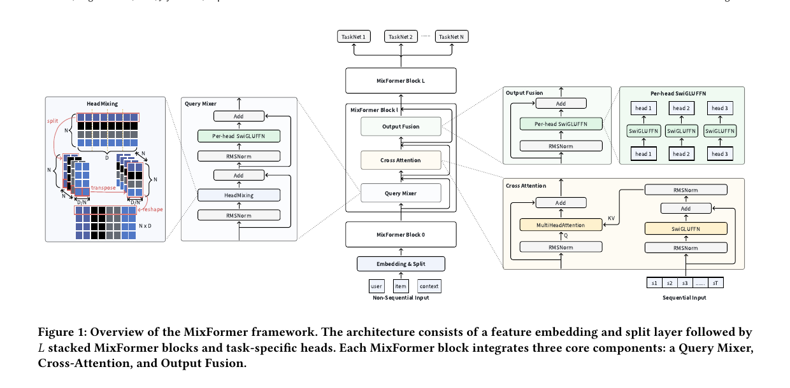
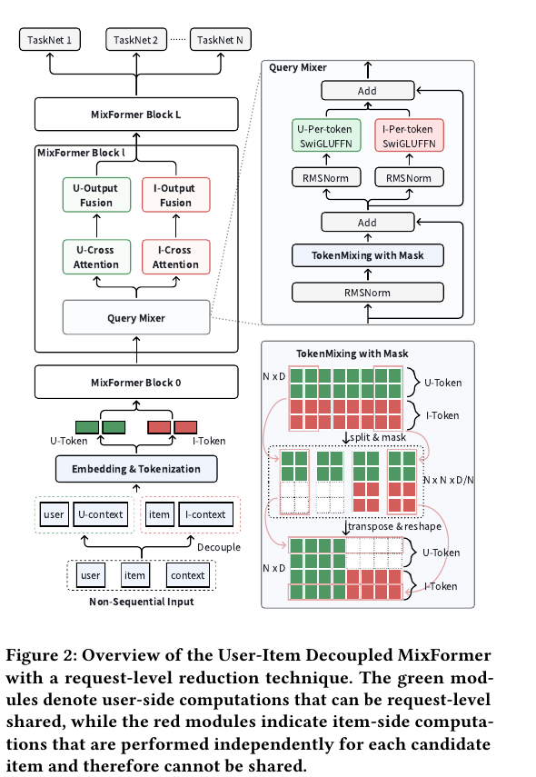
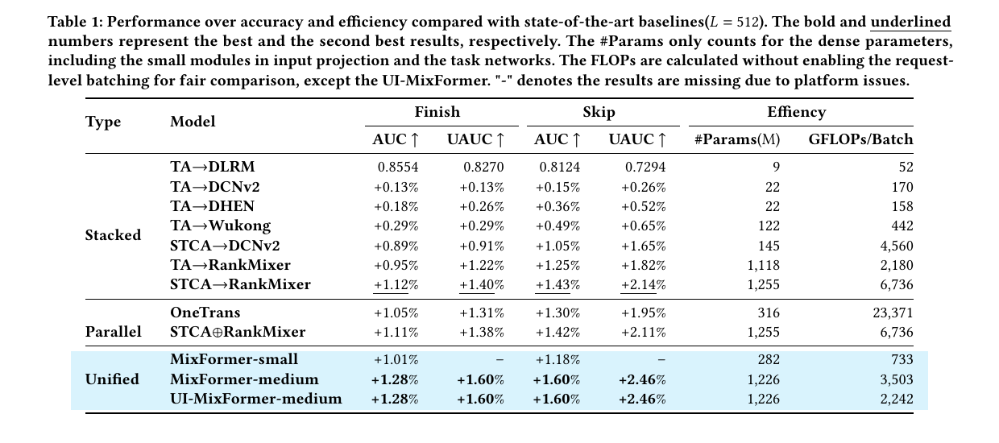
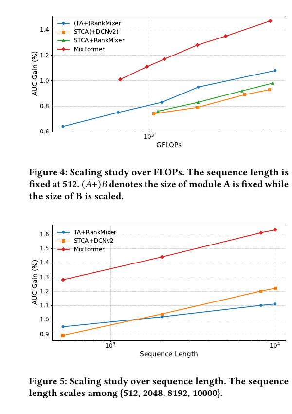

# MixFormer 论文详解

> 一句话概括：MixFormer 不再把“非序列特征交互”和“用户行为序列建模”当作两个独立模块，而是让它们在每个 Transformer 式块中反复交互、共用模型容量；再用用户-物品解耦把可共享的请求级计算抽出，以降低工业排序的推理成本。

## 1. 论文身份与阅读边界

- 标题：*MixFormer: Co-Scaling Up Dense and Sequence in Industrial Recommenders*
- 作者：Xu Huang、Hao Zhang、Zhifang Fan、Yunwen Huang、Zhuoxing Wei、Zheng Chai、Jinan Ni、Yuchao Zheng、Qiwei Chen，作者单位为 ByteDance Inc.
- 论文标注 Xu Huang、Hao Zhang、Zhifang Fan 为共同一作。
- 发表信息：KDD '26，论文页首给出的会议时间是 2026-08-09 至 2026-08-13，共10页。
- DOI：`10.1145/3770855.3818447`
- PDF 内的 arXiv 版本标记：`arXiv:2602.14110v2 [cs.IR] 2 Jul 2026`
- 本地原文：[MixFormer.pdf](./MixFormer.pdf)
- 系列综述：[RankMixer 及其演进方法详细调研](../rankmixer/RankMixer及其演进方法详细调研.md)

本文档只依据该 PDF，没有使用网络资料补全。为避免把解读写成论文原话，下文采用两种标记：

- **论文事实**：PDF 直接给出的方法、数字或作者结论。
- **解读/推断**：根据公式、图表或常规实现得出的工程含义；这些不等同于作者已在原文验证。

---

## 2. 论文要解决什么问题

### 2.1 两条已经各自成熟的路线

工业推荐模型中，Transformer 大致被用在两个方向：

1. **序列建模**：从用户的历史行为中提取动态兴趣，尤其关心长序列的扩展。
2. **非序列特征交互**：对用户、候选物品、上下文、交叉特征等异构特征学习高阶交互。

常见系统把它们组合为：

- **Stacked（串行堆叠）**：先用序列模块把历史压成一个向量，再把它丢给 dense 特征交互模块。
- **Parallel（并行拼接）**：序列模块和 dense 模块各自计算，最后拼接两路输出。

### 2.2 关键矛盾：co-scaling 不是简单的“两边都变大”

**论文事实**：序列 Transformer 的计算对序列长度非常敏感，dense Transformer 则主要随特征维度、宽度和容量增长。当两者参数独立时，它们必须在同一算力和参数预算中竞争：

- 把更多资源给序列模块，可以利用更长历史，但会迅速吃掉 FLOPs 预算。
- 把更多资源给 dense 模块，特征交互变强，却可能无法充分利用长期行为。
- 即使从“串行”改成“并行”，只要参数边界仍是独立的，两路交互仍然较浅。

因此，论文的核心主张不是“再造一个更大的序列模型”，而是：

> 让序列聚合和非序列特征交互在同一套分层参数中共同发生，从架构上消除两个独立模块的容量分配边界。

---

## 3. 总体架构：一个面向推荐的 decoder-style backbone

*图 1：原论文 Figure 1（PDF 第 4 页）裁剪。输入经过 Embedding & Split 后进入 L 个 MixFormer Block；每个块依次包含 Query Mixer、Cross Attention 和 Output Fusion。*

### 3.1 与标准 Transformer decoder 的对应关系

| 标准 Transformer decoder | MixFormer 对应模块 | 改造动机 |
|---|---|---|
| Self-Attention | Query Mixer | 异构特征字段未必处在可直接做内积相似度的统一语义空间，因此用无参数 HeadMixing 和逐头 FFN 代替。 |
| Cross-Attention | Cross Attention | 高阶非序列表示作为 query，用户行为序列作为 key/value，每个特征头学到一个条件化的历史摘要。 |
| FFN | Output Fusion | 对每个头分别使用 SwiGLU FFN，深度融合残差中的非序列信号与注意力聚合的序列信号。 |

数据流可概括为：

1. 序列特征保留为按时间排列的行为向量。
2. 用户、候选物品和上下文等非序列特征被拼接、切分成 `N` 个头，它们是整个 backbone 的 query 主线。
3. 在每一层，Query Mixer 先让非序列头交换信息，构造更高阶的 query。
4. Cross Attention 用这些 query 从整段行为序列中取回与当前特征语义相关的信息。
5. Output Fusion 在头内做非线性融合，输出再进入下一个 MixFormer Block。
6. 最顶层接多个 TaskNet，服务不同排序任务。论文的离线表格报告了 Finish 和 Skip 两个任务。

---

## 4. 输入如何变成 query 头和行为序列

### 4.1 序列输入

对第 `t` 个行为，论文把物品 ID、动作类型、时间戳和可用的侧信息分别 embedding 后拼接，得到行为表示 \(\mathbf{s}_t\)。长度为 `T` 的序列是：

\[
\mathbf{S}=[\mathbf{s}_1,\mathbf{s}_2,\ldots,\mathbf{s}_T].
\]

这些 token 不会先被压成单一向量，而是在各层 Cross Attention 中按 query 重新聚合。

### 4.2 非序列输入

设非序列特征集合为 \(\mathcal F_{ns}=\{f_1,\ldots,f_M\}\)，每个特征经独立 embedding table 得到 \(\mathbf e_i\in\mathbb R^{d_i}\)。首先拼接：

\[
\mathbf e_{ns}=[\mathbf e_1;\mathbf e_2;\ldots;\mathbf e_M]
\in\mathbb R^{D_{ns}},\qquad D_{ns}=\sum_{i=1}^{M}d_i. \tag{1}
\]

然后将该向量均分为 `N` 个连续子向量，每份维度 \(d=D_{ns}/N\)，并分别投影到统一的 `D` 维：

\[
\mathbf x_j=\mathbf W_j\,\mathbf e_{ns}[d(j-1):dj],
\quad \mathbf W_j\in\mathbb R^{D\times d},
\quad j=1,\ldots,N. \tag{2}
\]

最终 \(\mathbf X=[\mathbf x_1,\ldots,\mathbf x_N]\in\mathbb R^{N\times D}\)。这个设计比“所有特征压成一个头”保留了更多异构语义，也给后面三个模块提供了统一的多头接口。

**解读/推断**：直接实现式 (2) 需要 \(D_{ns}\) 能被 `N` 均分；论文未说明不可整除时是填充、不等长切分还是调整 embedding 宽度。

---

## 5. MixFormer Block 逐步拆解

### 5.1 Query Mixer：不用特征头之间的内积注意力

论文认为，推荐中的用户属性、物品属性、上下文和大规模稀疏 ID 来自异质语义空间，直接用 query-key 内积衡量头与头相似度不一定可靠，还会引入昂贵的 Self-Attention。因此 Query Mixer 分两步：

\[
\mathbf P=\operatorname{HeadMixing}(\operatorname{Norm}(\mathbf X))+\mathbf X, \tag{3}
\]

\[
\mathbf q_i=\operatorname{SwiGLUFFN}_i(\operatorname{Norm}(\mathbf p_i))+\mathbf p_i. \tag{4}
\]

#### HeadMixing 到底做了什么

1. 将 \(N\times D\) 的输入再视为 \(N\times N\times(D/N)\)。
2. 交换前两个 `N` 维度。
3. 展平回 \(N\times D\)。

这相当于把每个原头再分成 `N` 片，重组后的每个新头都拿到所有原头的一片信息。它本身没有可学参数；真正的非线性学习由后续每个头独立的 SwiGLU FFN 完成。

**解读/推断**：HeadMixing 使用的重排还要求 `D` 可按 `N` 切分。论文把它称为“parameter-free”并在消融讨论中称为“zero-cost”，这主要指没有矩阵乘和参数；实际内核仍可能有 reshape/transpose 引起的内存访问成本。

### 5.2 Cross Attention：让高阶 query 逐头读取用户历史

在第 `l` 个块中，每个行为先通过该层独有的 SwiGLU FFN：

\[
\mathbf h_t=
\operatorname{SwiGLUFFN}^{(l)}(\operatorname{Norm}(\mathbf s_t))+
\mathbf s_t\in\mathbb R^{ND}. \tag{5}
\]

再将它切成 `N` 个 `D` 维片段：

\[
\mathbf h_t^i=\mathbf h_t[iD:(i+1)D]\in\mathbb R^D, \tag{6}
\]

\[
\mathbf k_t^i=\mathbf W_k^i\mathbf h_t^i,
\qquad
\mathbf v_t^i=\mathbf W_v^i\mathbf h_t^i. \tag{7}
\]

为把论文公式中的 softmax 轴写清楚，可将第 `i` 个头对第 `t` 个行为的权重写为：

\[
\alpha_{it}=
\frac{\exp((\mathbf q_i^\top\mathbf k_t^i)/\sqrt D)}
{\sum_{u=1}^{T}\exp((\mathbf q_i^\top\mathbf k_u^i)/\sqrt D)},
\]

\[
\mathbf z_i=\sum_{t=1}^{T}\alpha_{it}\mathbf v_t^i+\mathbf q_i. \tag{8}
\]

直观理解：`N` 个高阶 query 分别提问，例如某个头可能更关心“当前候选物品与用户近期偏好”，另一个头更关心“场景与长期兴趣”。一个头输出一个条件化的序列摘要，但所有头同时覆盖不同特征子空间。

> 记号提示：原文公式 (7) 的 value 左侧显示为 \(\mathbf v_t\)，而公式 (8) 显示为 \(\mathbf v_t^i\)。上文按后者统一记号，没有改变其逐头计算含义。

### 5.3 Output Fusion：深度融合而不是只拼接

\[
\mathbf o_i=
\operatorname{SwiGLUFFN}_i(\operatorname{Norm}(\mathbf z_i))+
\mathbf z_i. \tag{9}
\]

注意 \(\mathbf z_i\) 中既有 Cross Attention 聚合的历史信号，也通过残差保留了 \(\mathbf q_i\) 的非序列语义。逐头 FFN 可以针对不同异构头使用不同参数，避免一个全局共享 FFN 把所有特征子空间强行混在一起。输出再变成下一层的 query 输入，因而“特征交互 -> 序列聚合 -> 融合”会重复 `L` 次。

### 5.4 “统一参数化”真正统一了什么

MixFormer 并不是说序列和非序列从输入起就使用完全相同的所有矩阵。更准确地说：

- 它们在同一个反复堆叠的 block 中共同形成状态，而不是分属两个背骨。
- Query Mixer 的输出直接成为序列聚合 query，不需要中间压缩向量或最后才拼接。
- 从第二层开始，Query Mixer 处理的已经是前一层融入序列信息的状态，所以后续的非序列交互也会被序列信号反向影响。
- 容量增加时，逐头 FFN 同时服务“构造 query”和“融合序列”的统一状态，这是论文所谓 co-scaling 的架构基础。

---

## 6. 计算复杂度与容量去向

论文没有给出一条完整的渐进复杂度定理。下表将原文结构与从其张量形状可直接得到的数量级分开：

| 部分 | 论文直接信息 | 数量级解读 |
|---|---|---|
| HeadMixing | reshape -> transpose -> flatten，无参数 | **推断**：要读写 \(ND\) 个元素，数据移动约 \(O(ND)\)；没有标准头间 Self-Attention 的 \(O(N^2D)\) 打分项。 |
| 逐头 SwiGLU FFN | `N` 个头独立参数 | **推断**：若扩展比为 `r`，标准两层 SwiGLU 的参数/乘加主项与 \(N rD^2\) 同阶。论文未披露 `r`，不能据此算出精确数。 |
| Cross Attention 打分 | `N` 个 query 头读取 `T` 个行为 | **推断**：注意力打分和加权求和为 \(O(NTD)\)，权重存储为 \(O(NT)\)。当 `N` 固定时对序列长度 `T` 是线性的，而不是行为 token 之间全 Self-Attention 的 \(O(T^2D)\)。 |
| 序列 FFN 和 K/V 投影 | 每一层使用独立的序列 FFN | **推断**：对 `T` 个行为的该项仍然线性增长，可写成 \(O(T\,C_{seq})\)，但原文未给出 FFN 内部宽度，所以 \(C_{seq}\) 不能继续化简。 |
| `L` 层堆叠 | 每层均执行三个模块 | **推断**：上述每块代价再近似乘以 `L`。 |

这个设计的重点不是“序列长度免费”，而是：它避免了对 `T` 个行为做两两 Self-Attention，但序列变长仍会线性提高每层的 FFN、K/V 和 Cross Attention 成本。

---

## 7. UI-MixFormer：如何让请求级共享可用

*图 2：原论文 Figure 2（PDF 第 5 页）裁剪。绿色为可在同一请求内共享的用户侧计算，红色为每个候选物品分别执行的物品侧计算。*

### 7.1 为什么原始 MixFormer 不能直接使用 RLB

Request Level Batching（RLB）的出发点是：同一个用户请求往往要评估很多候选物品，用户画像和行为历史对这些候选是相同的，因此应只算一次。但原始 HeadMixing 会双向混合用户头与物品头，混合后的“用户头”已经依赖具体候选，因而无法复用。

### 7.2 特征拆分

将非序列特征分为不相交的用户侧与物品侧，分别投影为 \(N_U\) 和 \(N_G\) 个头。总头数不变：

\[
N_G=\left\lfloor\frac{D_{ns}^{G}N}{D_{ns}}\right\rfloor,
\qquad N_U=N-N_G.
\]

论文说实际使用的 \(N_U:N_G\) 为 `1:1`。原文用下标 `G` 指称物品侧头，本文保留该符号。

### 7.3 单向混合掩码

为了保证用户头不被物品信息污染，作者定义 \(\mathbf M\in\mathbb R^{N\times D}\)：

\[
M[i,j]=
\begin{cases}
0,&i<N_U\ \text{and}\ j\ge N_U D/N,\\
1,&\text{otherwise}.
\end{cases} \tag{10}
\]

\[
\operatorname{HeadMixing}_{decouple}(\cdot)=
\mathbf M\odot\operatorname{HeadMixing}(\cdot). \tag{11}
\]

信息流因此变成：

- **物品 -> 用户头：禁止**，所以用户头与当前候选无关，可在请求内共享。
- **用户 -> 物品头：保留**，物品分支仍能看到用户信息，因此不是完全独立的双塔。
- **用户历史序列：可共享**，用户头与行为序列之间的 Cross Attention 可在同一请求内复用。

**解读/推断**：若一个请求有 `C` 个候选，原始做法接近于执行 `C × (用户侧 + 物品侧)`；解耦后可理解为 `1 × 用户侧 + C × 物品侧`。具体代价还取决于内核融合、缓存和 batching，论文没有把总 FLOPs 拆成这两项的解析式。

---

## 8. 实验设置

### 8.1 数据与任务

**论文事实**：

- 离线数据来自抖音推荐系统连续两周的日志。
- 数据包含万亿级（trillions）用户-物品交互记录，每个样本有 300 个以上特征。
- 非序列特征包含用户画像、物品属性、上下文派生的类别、数值与交叉特征。
- 序列中每个行为包含物品 ID、动作类型、时间戳与侧信息。
- 评估是 CTR 式二分类，主指标为 AUC 和用户级 AUC（UAUC）；表 1 报告 Finish 与 Skip 两个任务。
- 效率指标是 dense 参数量和 GFLOPs/Batch。表中参数只计 dense 参数，包含小型输入投影与 TaskNet，不是整个稀疏 embedding 系统的总参数。

### 8.2 训练与模型规模

- 在数百张 GPU 上使用混合分布式框架：稀疏部分异步更新，dense 部分同步更新。
- dense 部分：RMSProp，学习率 `0.01`。
- sparse 部分：Adagrad。
- 所有实验 batch size 为 `1,500`。
- MixFormer-small：`N=16, L=4, D=386`。
- MixFormer-medium：`N=16, L=4, D=768`。

> 原文明确排版为 small 的 `D=386`，虽然 386 不是常见的 2 的幂附近宽度，本文不擅自改成 384。另外，表 1 图注写 `(L=512)` 表示其序列长度设定，但方法节已用 `L` 表示 block 层数、用 `T` 表示序列长度；这是原文记号不一致，阅读时不应把 `L=4` 与长度 512 混淆。

---

## 9. 主要离线结果

*图 3：原论文 Table 1（PDF 第 6 页）裁剪。序列长度为 512；除 UI-MixFormer 外，FLOPs 计算未启用请求级 batching。*

### 9.1 怎样正确读这张表

- `TA→DLRM` 一行给出绝对值：Finish AUC/UAUC 为 `0.8554/0.8270`，Skip AUC/UAUC 为 `0.8124/0.7294`。
- 其他模型在这四列中以 `+x%` 报告相对增益。原文没有把它们换算为完整绝对 AUC，因此不应自行当作“绝对百分点”。
- 表中的 `#Params` 只是 dense 参数；`GFLOPs/Batch` 是每批次、且 batch size 为 1,500 的报告口径，不是单样本 FLOPs。

### 9.2 最关键的精确数字

| 模型 | Finish AUC | Finish UAUC | Skip AUC | Skip UAUC | Dense Params | GFLOPs/Batch |
|---|---:|---:|---:|---:|---:|---:|
| STCA→RankMixer | +1.12% | +1.40% | +1.43% | +2.14% | 1,255M | 6,736 |
| OneTrans | +1.05% | +1.31% | +1.30% | +1.95% | 316M | 23,371 |
| STCA⊕RankMixer | +1.11% | +1.38% | +1.42% | +2.11% | 1,255M | 6,736 |
| MixFormer-small | +1.01% | - | +1.18% | - | 282M | 733 |
| MixFormer-medium | **+1.28%** | **+1.60%** | **+1.60%** | **+2.46%** | 1,226M | 3,503 |
| UI-MixFormer-medium | **+1.28%** | **+1.60%** | **+1.60%** | **+2.46%** | 1,226M | 2,242 |

由表中数字可做几个明确的算术对比（**解读/推断**）：

- MixFormer-medium 比最强堆叠基线 STCA→RankMixer 少 29M dense 参数，同时四个增益数分别高 `0.16/0.20/0.17/0.32`。
- MixFormer-medium 的 GFLOPs 是 STCA→RankMixer 的约 `52.0%`（`3503/6736`）。
- UI-MixFormer-medium 从 `3,503` 降到 `2,242` GFLOPs/Batch，减少约 `36.0%`，与论文正文的“约 36%”一致；表中准确性数字不变。
- OneTrans 的 GFLOPs/Batch 为 `23,371`，约是 MixFormer-medium 的 `6.67` 倍，但四个增益数都更低。

注意：表格为了比较原始模型，其他模型的 FLOPs 默认不启用 RLB，但 UI-MixFormer 例外。因此 MixFormer-medium 与 UI-MixFormer-medium 的差值主要展示“解耦 + 请求级减少”的系统收益，而不是两个完全相同 FLOPs 计算口径下的纯架构对比。

---

## 10. 消融实验：哪些设计真正有用

原论文 Figure 3 以 MixFormer-small 为基准，报告以下 AUC 变化：

| 改动 | AUC 变化 | 含义 |
|---|---:|---|
| Query Mixer 删除 HeadMixing | -0.03 | 跨头信息交换有用。 |
| HeadMixing 换成 Self-Attention | +0.00 | 更贵的头间自注意力没有带来可观测增益。 |
| Query Mixer 删除逐头 FFN | -0.04 | 无参数重排之后仍需要头专用非线性。 |
| Cross Attention 的逐层 FFN 改为层间共享 FFN | -0.03 | 各层独立序列变换可逐层精炼行为表示。 |
| Output Fusion 的逐头 FFN 改为头共享 FFN | **-0.06** | 损失最大，说明异构头保留各自参数很重要。 |
| Pre-RMSNorm 改为 Post-LayerNorm | -0.01 | 原始 pre-RMSNorm 配置更好，但影响相对较小。 |

> 原文正文把 HeadMixing 缩写为 HM，Figure 3 的图内标签则写为 TM（TokenMixing）；两处实际指向同一类头/令牌重组操作。此处按方法节统一称为 HeadMixing。

消融结果支持的不是单一模块，而是一个配套：**廉价跨头混合 + 头专用非线性 + 层专用序列变换 + pre-RMSNorm**。

---

## 11. Dense scaling 与 sequence scaling

*图 4：原论文 Figure 4 和 Figure 5（PDF 第 8 页）裁剪。上图固定序列长度 512、横轴为 GFLOPs；下图固定 dense 模型规模、序列长度取 512/2,048/8,192/10,000。*

### 11.1 Dense scaling：固定序列长度 512

**论文事实**：

- 在长度固定时，扩大非序列 RankMixer 带来的边际 AUC 增益大于扩大序列模块 STCA，说明目标物品特征交互在该设定下很重要。
- STCA 与 RankMixer 按 `1:1` FLOPs 组合的基线仍存在两者之间的预算权衡。
- MixFormer 具有更高的起点和有竞争力的 scaling 斜率，在图示的不同 FLOPs 预算下始终高于对比曲线。

### 11.2 Sequence scaling：固定 dense 参数预算

- 序列长度依次为 `{512, 2,048, 8,192, 10,000}`。
- 与 dense scaling 的趋势相反，更偏序列的 STCA 在拉长序列时收益更大。
- MixFormer 的序列 scaling 斜率与 STCA 接近，同时曲线整体更高。
- **读图近似值，非表格精确值**：MixFormer 在长度 512 处约为 `+1.28%`，在 10,000 处约为 `+1.63%`；STCA+DCNv2 约从 `+0.89%` 到 `+1.22%`，TA+RankMixer 约从 `+0.95%` 到 `+1.11%`。

这两组图联合回答了 co-scaling 问题：独立模块中，dense 容量和序列长度各有优势区间，增加一边容易牺牲另一边；MixFormer 的统一状态使它在两种扩展轴上都保持强曲线。

---

## 12. 服务延迟与在线 A/B 实验

### 12.1 服务延迟

原论文 Figure 6 在四个候选集规模上标出了如下精确数字：

| 图中设定（候选数由小到大） | MixFormer | UI-MixFormer | Speedup |
|---|---:|---:|---:|
| 1 | 35.3 ms | 24.7 ms | 30.0% |
| 2 | 45.7 ms | 31.0 ms | 32.2% |
| 3 | 55.9 ms | 37.3 ms | 33.3% |
| 4 | 74.2 ms | 49.0 ms | 34.0% |

**论文事实**：候选数增加时 GPU 利用率逐渐接近饱和，原始 MixFormer 延迟增长更快；UI-MixFormer 因复用用户侧计算，延迟增长更平缓。图中候选数是横轴位置而非每点旁的数字标注，所以上表不猜测每个点的精确候选数，只保留图中直接标注的延迟与加速比。

### 12.2 在线设置

- 在抖音和抖音极速版的 feed 推荐场景进行两周 A/B 实验。
- 对比线上最强基线是超过 1B 参数的 `STCA→RankMixer`。
- 指标：Active Day、Duration、Like、Finish、Comment。
- 作者声明表中所有增益都具有统计显著性，且在两周观察结束时仍未收敛。

### 12.3 抖音 App 在线增益

| 人群 | Active Day | Duration | Like | Finish | Comment |
|---|---:|---:|---:|---:|---:|
| Overall | +0.0415% | +0.2799% | +0.1766% | +0.3897% | +0.7035% |
| Low-active | +0.2263% | +0.2468% | +0.0771% | +0.4123% | +1.2483% |
| Middle-active | +0.0998% | +0.2719% | +0.2445% | +0.2796% | +0.6718% |
| High-active | +0.0203% | +0.2938% | +0.3810% | +0.3335% | +0.8356% |

### 12.4 抖音极速版在线增益

| 人群 | Active Day | Duration | Like | Finish | Comment |
|---|---:|---:|---:|---:|---:|
| Overall | +0.0252% | +0.4105% | +0.2125% | +0.2924% | +1.9097% |
| Low-active | +0.2543% | +0.6044% | +3.0565% | +0.6157% | +2.6452% |
| Middle-active | +0.1218% | +0.4184% | +0.2329% | +0.2951% | +1.3286% |
| High-active | +0.0237% | +0.4042% | +0.4871% | +0.2097% | +2.1170% |

在数值上，总体 Active Day 增益只有 `+0.0415%` 和 `+0.0252%`，而互动指标，特别是抖音极速版 Comment，增益更大。这说明结果不应只用单一在线指标概括；但原文未给出流量规模、置信区间或 p 值，因此无法在 PDF 信息之外评估统计功效和业务价值区间。

---

## 13. 与相关模型的核心区别

| 模型/范式 | 序列如何处理 | 特征交互如何处理 | 与 MixFormer 的关键差异 |
|---|---|---|---|
| DIN/TA 类目标注意力 | 用目标物品对近期行为做一次聚合 | 通常交给后续 MLP/DCN 等 | MixFormer 在每个 block 中用已完成高阶交互的多头 query 重复聚合序列。 |
| STCA/LONGER 类序列模型 | 主要扩大长序列能力 | dense 交互通常是另一模块或较轻的头 | MixFormer 要解决的是 dense 与 sequence 同时扩展时的预算冲突。 |
| RankMixer | 序列被压缩成静态表示，或配较轻的 Target Attention | 用 HeadMixing/逐头 FFN 强化异构特征交互 | MixFormer 继承类 RankMixer 的高效头混合，但在每层加入条件化序列 Cross Attention。 |
| Stacked 组合 | 序列先压缩 | 压缩向量再进 dense backbone | 参数边界严格，高阶 dense 语义无法反过来指导早期序列聚合。 |
| Parallel 组合 | 独立计算 | 独立计算 | 只在末端拼接，交互浅，两边仍竞争预算。 |
| OneTrans | 把序列和非序列建模为异构 token 序列 | 依赖设计的 attention mask 和独立参数 | 论文认为 OneTrans 仍有二次复杂度和参数分离问题；MixFormer 用固定数量 query 头对序列做线性 Cross Attention。 |
| 标准 Transformer decoder | Self-Attention -> Cross-Attention -> 共享 FFN | token 默认位于统一语义空间 | MixFormer 用 HeadMixing + 逐头 FFN 代替 Self-Attention，并把 Output Fusion 做成逐头 FFN。 |
| 双塔 | 用户侧可预计算 | 用户与物品在末端打分 | UI-MixFormer 也拆出用户侧，但保留用户 -> 物品的单向深层交互，不是完全独立塔。 |

---

## 14. 局限与阅读时必须保留的谨慎

论文没有单独的 Limitations 章节。以下大部分是基于披露范围的 **解读/推断**，不是作者在原文中逐条自述：

1. **公开可复现性有限**：离线实验只使用抖音专有的万亿级数据；PDF 没有公开数据分割、字段表、任务损失、多任务权重、SwiGLU 扩展比或完整训练配方。
2. **绝对准确性披露不完整**：表 1 只对 TA→DLRM 给绝对 AUC/UAUC，其他模型多为相对增益；MixFormer-small 的 UAUC 还因平台问题缺失。
3. **FLOPs 不等于所有系统成本**：论文未报告训练总时长、显存峰值、通信量、吞吐或能耗；HeadMixing 的内存布局成本也不会体现为大量 FLOPs。
4. **UI 收益依赖请求形态**：只有同一用户/上下文下同时打分多个候选时，用户侧复用才能充分收益。候选数少、跨请求无法缓存或 GPU 未充分 batching 时，收益可能不同。
5. **用户/物品头比例缺少消融**：实践设为 `1:1`，但论文未展示不同 \(N_U:N_G\) 对准确性和延迟的影响。
6. **长序列仍非免费**：Cross Attention 对 `T` 线性，但各层仍需要处理全部行为的 FFN 与 K/V；序列长度到 10,000 以上时的内存、端到端吞吐和精度未被报告。
7. **没有显式的行为-行为 Self-Attention**：从公式看，行为 token 通过逐 token FFN 变换后被 query 聚合，而非先做全序列两两交互。这换来线性成本，但对强依赖行为间显式转移的任务是否有表达力损失，原文没有专门对照实验。
8. **在线统计信息不足**：作者说所有增益显著且尚未收敛，但没有给流量样本量、置信区间、p 值和完整实验周期曲线。
9. **记号与命名有少量不一致**：包括 block 数/序列长度都用过 `L`、HM/TM 混用、公式 (7)/(8) 的 value 上标不一致，以及 small 宽度 `D=386` 这个非常规值。复现时需要与正式实现逐项核对。

---

## 15. 工程落地启示

### 15.1 模型侧

1. **把多头切分当成容量规划问题**：先固定 `N`，再让 \(D_{ns}\) 和 `D` 与 `N` 的切分规则一致，避免上线时用额外 padding/copy 破坏效率。
2. **逐头 FFN 适合 grouped GEMM/融合内核**：头很多但单头矩阵较小时，若逐头发起独立 kernel，调度成本可能抵消理论 FLOPs 优势。
3. **HeadMixing 要检查实际内存布局**：尽量以 view/stride 或与后续 GEMM 融合实现，不要默认 transpose “没有 FLOPs 就没有延迟”。
4. **层间不要轻易共享序列 FFN**：消融中共享后 AUC 下降 0.03；若为节省参数做这一改动，应重新做准确性-延迟 Pareto 评估。
5. **保留 pre-RMSNorm 与残差路径**：它们在每层保留 query 主线，也是多层统一状态能稳定传递的关键。

### 15.2 服务侧

1. **先按请求定义共享边界**：只有用户、用户上下文和历史序列能进入可复用分支；任何候选物品信息泄漏到用户头都会使缓存结果错误。
2. **把 mask 的单向性做成自动化测试**：替换候选物品时，各层用户头必须数值不变；物品头应当变化，且仍能受用户头影响。
3. **以候选数为主要压测轴**：原论文的加速比从 30.0% 增到 34.0%，说明不能用单一 batch/candidate 设定代表真实服务曲线。
4. **请求内缓存各层用户侧中间量**：除原始 embedding 外，序列的层专用变换和用户头 Cross Attention 结果都可能是复用对象；但要在显存占用与重算之间实测。
5. **分开监控 dense 参数、稀疏表、FLOPs、延迟和通信**：论文的 1.226B 参数只指 dense 部分，不能直接用来预估整个线上模型的内存和网络成本。

### 15.3 一个最小复现检查清单

- [ ] 序列行为 token 包含 ID、动作类型、时间戳和侧信息。
- [ ] \(D_{ns}\) 和 `D` 的多头切分与 `N` 兼容。
- [ ] Query Mixer 顺序为 pre-RMSNorm -> HeadMixing -> residual -> pre-RMSNorm -> per-head SwiGLU -> residual。
- [ ] 每个 block 使用自己的序列 FFN，不意外跨层共享。
- [ ] Cross Attention 的 softmax 沿时间维 `T` 归一，并正确处理 padding/无效行为 mask。
- [ ] Output Fusion 使用逐头参数和残差。
- [ ] UI 版本的用户头对候选物品不变，物品头仍能接收用户信息。
- [ ] 离线比较同时报告 AUC、UAUC、dense params 和 FLOPs，在线比较覆盖多个候选数档位。

---

## 16. 结论

MixFormer 的核心价值是架构层面的“共同扩展”：它用高效 HeadMixing 构造异构高阶 query，用对序列长度线性的 Cross Attention 读取行为，再用逐头 FFN 在每层反复融合两类信息。它不依靠“把序列模块和 dense 模块都继续堆大”，而是取消两个独立参数池之间的结构边界。

实验上，MixFormer-medium 在 1.226B dense 参数下取得表 1 的最优准确性，同时将该配置的计算量控制在 3,503 GFLOPs/Batch；用户-物品解耦后下降到 2,242 GFLOPs/Batch，表中准确性不变，且在候选规模扩大时实测 30.0%-34.0% 的服务加速。两个抖音 feed 场景的两周 A/B 结果也都为正。

但它的证据主要来自单一公司的专有数据和系统，许多复现关键细节尚未披露。对工程团队而言，最值得带走的不只是一个离线 AUC 数字，而是两个可验证的原则：**让 dense 与 sequence 在同一分层状态中共同增容；让线上请求的可共享边界在模型结构中显式可见。**
