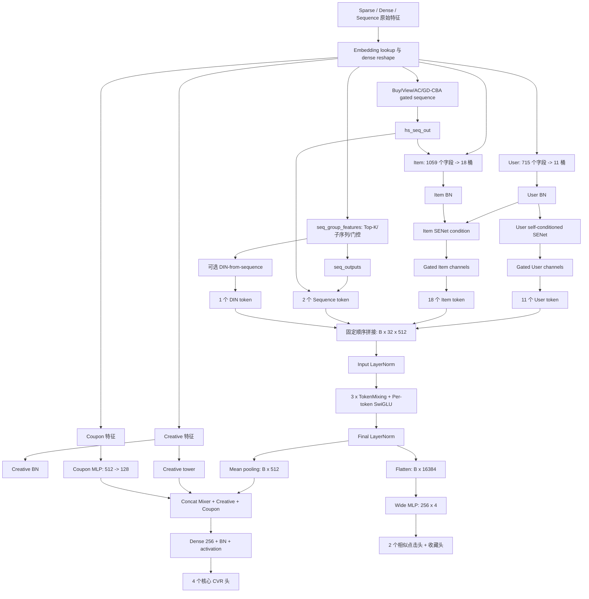

# CVR RankMixer-SwiGLU 模型源码分析与原版 RankMixer 严格对比

> 分析对象：`code/commend_cvr.py`、`code/mlp_mixer_swiglu_fuse.py`<br>
> 对照论文：`rankmixer/RankMixer.pdf`<br>
> 文档日期：2026-08-13<br>
> 分析方法：以当前工作区源码的实际调用链为准；区分默认配置、可选分支和未接通代码。
>
> 按模块分类的全量改进指南：[CVR_RankMixer_全量改进方案_按模块分类.md](CVR_RankMixer_全量改进方案_按模块分类.md)<br>
> 全部改进方法的精炼选型总览：[CVR_RankMixer_v1_改进方案汇总与选型指南.md](CVR_RankMixer_v1_改进方案汇总与选型指南.md)<br>
> 配套改进设计：[CVR_RankMixer_四套改进方案设计.md](CVR_RankMixer_四套改进方案设计.md)<br>
> 基于 base/RM-v1 实测 AUC 差距的专项诊断：[CVR_RankMixer_v1_AUC差距诊断与改进路线.md](CVR_RankMixer_v1_AUC差距诊断与改进路线.md)

---

## 目录

1. [执行摘要](#1-执行摘要)
2. [分析范围与有效主路径](#2-分析范围与有效主路径)
3. [端到端架构总览](#3-端到端架构总览)
4. [输入、Embedding 与特征分桶](#4-输入embedding-与特征分桶)
5. [两套序列兴趣建模](#5-两套序列兴趣建模)
6. [BN 与条件式 SENet](#6-bn-与条件式-senet)
7. [32 个语义 Token 的构造](#7-32-个语义-token-的构造)
8. [当前 RankMixer-SwiGLU 主干](#8-当前-rankmixer-swiglu-主干)
9. [Mixer 输出读取与任务融合](#9-mixer-输出读取与任务融合)
10. [预测头、损失、训练和导出](#10-预测头损失训练和导出)
11. [数据之间如何交互](#11-数据之间如何交互)
12. [原版 RankMixer 方法](#12-原版-rankmixer-方法)
13. [当前实现与原版 RankMixer 严格对比](#13-当前实现与原版-rankmixer-严格对比)
14. [参数量、FLOPs 与初始化动态](#14-参数量flops-与初始化动态)
15. [模型优点](#15-模型优点)
16. [模型缺点与风险](#16-模型缺点与风险)
17. [当前代码的工程问题](#17-当前代码的工程问题)
18. [建议的实验与改进优先级](#18-建议的实验与改进优先级)
19. [最终评价](#19-最终评价)

---

## 1. 执行摘要

这套 CVR 模型可以概括为：

> **大规模稀疏特征与多路行为序列，先经过语义分桶、候选相关序列筛选和条件式 SENet，再统一构造成 32 个 512 维 token，送入 3 层 RankMixer-style Token Mixing + Per-token SwiGLU 主干，最后通过 Mean Pooling 与 Flatten 两种读出方式完成多个 CVR 和辅助行为预测。**

模型的核心设计有五层：

1. **业务语义组织**：715 个 User 特征被划为 11 桶，1059 个 Item 特征被划为 18 桶。
2. **候选相关兴趣**：通过多路序列、Top-K 相似行为、子序列和可选 DIN 建模用户历史与当前候选的关系。
3. **条件特征选择**：User 自身生成 User gate；`[User, Item]` 联合向量生成 Item gate，形成显式的 `User -> Item` 条件交互。
4. **全局 token 交互**：固定 Token Mixing 把所有 token 的同号通道子空间重新组合，再用每 token 独立参数的 SwiGLU 学习非线性交互。
5. **多视角读出**：Mean Pooling 提供紧凑全局表示，Flatten 分支保留全部 token 坐标用于辅助任务。

它与原版 RankMixer 的关系是：

- **保留**：语义 token 化、无参数 Multi-head Token Mixing、Per-token 独立参数。
- **修改**：GELU 两矩阵 PFFN 改为三矩阵 SwiGLU；双 Post-LN 改为 FFN Pre-LN + Final LN。
- **删除**：原版 `TokenMixing(X) + X` 的 mixing residual。
- **新增**：Down projection 零初始化、训练 fused SwiGLU、自定义 CVR 多分支、条件式 SENet、两套序列系统和拆分导出。

因此，当前模块不是“原版 RankMixer 只换了激活函数”，而是一个 **RankMixer-style、但块级拓扑已经发生明显变化的工业 CVR Teacher 模型**。

---

## 2. 分析范围与有效主路径

### 2.1 核心文件

- 主模型：`code/commend_cvr.py`（本地分析输入，未纳入本仓库）
- Mixer 实现：`code/mlp_mixer_swiglu_fuse.py`（本地分析输入，未纳入本仓库）
- 原版论文：[RankMixer.pdf](RankMixer.pdf)

### 2.2 当前实际有效的主调用链

```text
build_psv2
  -> model_fn_new
      -> model_input
      -> model_top
          -> _build_teacher_tower
              -> BN / SENet / Sequence / Tokenizer
              -> mlp_mixer_swiglu
              -> Main + Wide readout
              -> 4 个核心头 + 3 个辅助头
  -> _build_losses
  -> sparse/dense train ops
```

关键入口位置：

| 功能 | 源码位置 |
|---|---|
| 参数注册 | `commend_cvr.py:83-363` |
| 训练/测试/导出建图 | `commend_cvr.py:886-1408` |
| Loss | `commend_cvr.py:1414-1566` |
| 输入 lookup | `commend_cvr.py:1568-1634` |
| Teacher 主塔 | `commend_cvr.py:1643-2676` |
| Student 脚手架 | `commend_cvr.py:2684-3274` |
| Sequence model | `commend_cvr.py:3383-3692` |
| MLP 与 Wide MLP | `commend_cvr.py:3985-4160` |
| SENet | `commend_cvr.py:4162-4284` |
| Tokenizer | `commend_cvr.py:5190-5213` |
| RankMixer-SwiGLU | `mlp_mixer_swiglu_fuse.py:339-386` |

### 2.3 当前未接通或默认关闭的部分

| 分支 | 当前状态 | 依据 |
|---|---|---|
| Teacher | 有效 | `model_top()` 只返回 Teacher |
| Student | 未接通 | 没有从 `model_top()` 调用；训练变量也注释掉 |
| Distillation | 未接通 | helper 定义后未参与总损失 |
| Delta | 默认关闭且返回链不完整 | `enable_delta=False`；Teacher return 无 Delta key |
| 多行为 MLT | 默认关闭 | `mlt_tasks_enable=False` |
| DIN-from-sequence | 默认关闭，但下游无条件消费 | 存在空 `tf.concat` 风险 |
| Creative 深层塔 | 默认无隐藏层 | `layers_creative=[]` |
| 原普通 MLP 主干 | 已注释 | 当前由 RankMixer-SwiGLU 替代 |

后续所有“主模型”描述，默认指实际有效的 Teacher 路径，而不是 Student/Delta 实验代码。

---

## 3. 端到端架构总览



---

## 4. 输入、Embedding 与特征分桶

### 4.1 Sparse 与 Dense 输入

`model_input()` 使用 `lookup_utils.flood_lookup_psv2()` 查询稀疏 embedding。

非序列稀疏特征得到：

$$
e_j \in \mathbb{R}^{B \times d_j}
$$

稀疏序列特征同时保留：

```python
(embedding_tensor, original_sparse_tensor)
```

其中：

- embedding 用于序列表示学习；
- sparse tensor 的 indices、values、dense_shape 用于序列长度、子序列位置和 segment 聚合。

Dense 特征执行：

$$
[B, \ldots] \rightarrow [B, d_j]
$$

默认 `embedding_size=16`，但外部 Feature 配置可以让部分字段具有不同维度，所以不能直接把所有字段都视为严格 16 维。

### 4.2 User 分桶

源码显式列出了 11 个 User 语义桶：

$$
U_1,U_2,\ldots,U_{11}
$$

静态统计共有 715 个不重复字段，每桶约 64-66 个字段。

桶内先拼接：

$$
U_i = \operatorname{Concat}(e_{i,1}, e_{i,2}, \ldots)
$$

User 全量表示为：

$$
U = \operatorname{Concat}(U_1,\ldots,U_{11})
$$

### 4.3 Item 分桶

Item 侧显式列出 18 个桶：

$$
I_1,I_2,\ldots,I_{18}
$$

静态统计共有 1059 个不重复字段，每桶约 45-63 个字段。

Item 表示还会追加 gated long-sequence 输出：

$$
I = \operatorname{Concat}(I_1,\ldots,I_{18},H_{hs})
$$

这里的 $H_{hs}$ 是 Buy/View/AC/GD-CBA 四路序列输出的拼接。

### 4.4 为什么要先分桶

直接把上千字段拼成一个超宽向量再交给共享 MLP，容易出现：

- 高频字段压制低频字段；
- User ID、商品属性、统计特征和序列兴趣共用同一变换；
- 每类语义空间难以分配独立容量；
- 新增字段会改变整个大矩阵的输入结构。

语义分桶使每个后续 token 对应一个相对稳定的业务子空间，也为 Per-token FFN 提供了明确的参数隔离单位。

---

## 5. 两套序列兴趣建模

当前 Teacher 同时包含两条不同的序列路径。

### 5.1 Gated Sub-sequence 路径

四类序列分别调用外部模块 `gated_sub_sequence_opt_no_padding()`：

- Buy sequence；
- View sequence；
- AC sequence；
- GD-CBA sequence。

调用参数包含：

- main sequence columns；
- position columns；
- soft-search keys；
- gate 配置；
- query/key 维度；
- DIN 维度；
- 最长 256 的序列长度。

四路输出拼接为：

$$
H_{hs} = [H_{buy},H_{view},H_{ac},H_{gd-cba}]
$$

$H_{hs}$ 被加入 Item 表示，并参与后续 Item SENet。由于该外部模块源码不在当前工作区，本文只描述调用界面能确定的功能，不推断其内部每个算子。

### 5.2 `seq_model` 路径

`seq_model()` 对 `feature_config.seq_group_features` 中的每个序列组执行：

```text
main sequence embedding
context embedding
pretrained source vector
当前候选 target/query vector
        |
        v
Query-Key 相似度
        |
        v
Top-K / threshold / hard subsequence
        |
        v
Sequence Gate
        |
        v
Segment Sum / Sub-sequence MLP
        |
        v
固定长度 seq_output
```

从张量角色看，候选与历史的点积分数为：

$$
s_{b,j}=k_{b,j}^{\mathsf T}q_b
$$

再选择：

$$
\mathcal I_b = \operatorname{TopK}(s_b)
$$

相似度还会被离散化为 embedding，与子序列结果联合建模。

`seq_gate()` 生成通道级 gate：

$$
g = \sigma(W_2\phi(W_1x))
$$

$$
x'=x\odot g
$$

这使当前候选能够影响历史行为的筛选和聚合，是模型中最明确的 `Item -> User history` 交互之一。

### 5.3 可选 DIN-from-sequence

开启 `feat_din_from_seq_enable` 后，代码对当前候选 $q$ 和历史行为 $k_j$ 分别投影，构造：

$$
[k_j,\ k_j-q,\ k_j\odot q]
$$

再经过零初始化线性投影、可选位置权重和 segment sum：

$$
d_b = \sum_{j\in\mathcal I_b}
W_o[k_j,k_j-q_b,k_j\odot q_b]\odot p_j
$$

原始 Query/Key 输入在进入该分支前被 `stop_gradient`，所以 DIN 自身投影能学习，但不会通过该路径反向更新其 pretrained source/target 输入。

---

## 6. BN 与条件式 SENet

### 6.1 BN

User、Item、Creative 在进入主动 SENet 前分别做 BatchNorm。Coupon 在标准 BN 分支中没有与三者完全对称地执行这一处初始 BN，后续 Coupon MLP 自己仍会执行入口 BN。

记 BN 后的表示为：

$$
\tilde U,\quad \tilde I,\quad \tilde C,\quad \tilde P
$$

### 6.2 User SENet

User gate 只以 User 自身作为条件：

$$
g_U = \sigma\left(W_{U,2}\phi(\operatorname{BN}(W_{U,1}\tilde U))\right)
$$

$$
U' = 2\tilde U\odot g_U
$$

这是一种 User 内部的全局条件通道选择。

### 6.3 Item SENet

Item gate 的条件输入是 User 与 Item 联合向量，但被缩放的目标只有 Item：

$$
g_I = \sigma\left(W_{I,2}\phi(\operatorname{BN}(W_{I,1}[\tilde U,\tilde I]))\right)
$$

$$
I' = 2\tilde I\odot g_I
$$

因此形成了明确的方向性交互：

$$
\boxed{User \rightarrow Item\ gate}
$$

同一个商品通道对不同用户可以获得不同权重，但反方向没有对称的 `Item -> User gate`。

### 6.4 Creative 与 Coupon SENet

Creative 和 Coupon 都是自条件门控：

$$
C' = 2C\odot g_C(C),\qquad
P' = 2P\odot g_P(P)
$$

它们没有在这一阶段与 User/Item 联合生成 gate。

### 6.5 近似恒等初始化

`excitation2()` 的第二个 Dense 使用零 kernel 初始化。默认激活是 sigmoid，因此初始：

$$
g=\sigma(0)=0.5
$$

又因为 `senet_weight_scalar=2`：

$$
2x\cdot0.5=x
$$

所以 SENet 初始接近恒等映射，适合热启动；训练后再逐步学习通道重标定。

注意：`excitation2()` 的 target 是 flat vector，输出 gate 数等于 `target_feature.shape[1]`，因此这里实际是**通道级 SENet**，不是严格的“一字段一个 gate”。

---

## 7. 32 个语义 Token 的构造

### 7.1 Token 数量

| Token 类型 | 数量 | 单 token 维度 | 来源 |
|---|---:|---:|---|
| User | 11 | 512 | 11 个 User SENet 桶 |
| Item | 18 | 512 | 18 个 Item SENet 桶 |
| Sequence | 2 | 512 | `seq_outputs + hs_seq_senet_out` |
| DIN | 1 | 512 | 所有 DIN 输出 |
| 总计 | 32 | 512 | 固定顺序拼接 |

默认超参数：

```python
mlp_mixer_layers = 3
mixup_token_num = 32
mixup_token_dim = 512
```

### 7.2 User 桶到 token

SENet 后的 User 向量按原始 11 个桶的维度重新 split。每个桶独立执行：

$$
T^U_i = \operatorname{GELU}(U'_iW^U_i+b^U_i)
$$

其中：

$$
W^U_i\in\mathbb{R}^{d_i\times512}
$$

再 reshape：

$$
[B,512]\rightarrow[B,1,512]
$$

这不是多层 MLP，而是**一层可学习投影矩阵 + bias + GELU**。11 个桶使用不同 scope，不共享矩阵。

### 7.3 Item 桶到 token

Item 侧同样执行：

$$
T^I_i = \operatorname{GELU}(I'_iW^I_i+b^I_i)
$$

`item_senet` 被 split 成 19 段：前 18 段形成 Item token，最后一段对应 $H_{hs}$，被提取为 `hs_seq_senet_out`，不形成第 19 个 Item token。

### 7.4 Sequence token

所有 `seq_model` 输出和 `hs_seq_senet_out` 拼接：

$$
S_{all}=\operatorname{Concat}(S_1,\ldots,S_m,H'_{hs})
$$

再通过单层 Dense+GELU 投影到 1024 维：

$$
T^S=\operatorname{GELU}(S_{all}W_S+b_S)
$$

$$
[B,1024]\rightarrow[B,2,512]
$$

无论上游序列组数量多少，都会被压缩为固定两个 token。

### 7.5 DIN token

所有 DIN 输出 concat 后：

$$
T^{DIN}=\operatorname{GELU}(D_{all}W_D+b_D)
$$

$$
[B,512]\rightarrow[B,1,512]
$$

### 7.6 固定顺序

最终 token 顺序为：

```text
[user_1 ... user_11,
 item_1 ... item_18,
 seq_1, seq_2,
 din]
```

得到：

$$
X_{raw}\in\mathbb{R}^{B\times32\times512}
$$

然后执行外部输入 LayerNorm：

$$
X_0=\operatorname{LN}_{input}(X_{raw})
$$

当前模型没有显式 token type embedding 或 position embedding。Token 的位置语义主要由：

1. 固定拼接顺序；
2. 每个位置独立的 FFN 参数；

共同编码。因此重排 token 会直接改变 checkpoint 中每组权重的业务含义。

---

## 8. 当前 RankMixer-SwiGLU 主干

当前设置：

$$
T=32,\quad D=512,\quad L=3,\quad k=4
$$

其中 $kD=2048$ 是 SwiGLU hidden dimension。

### 8.1 LayerNorm

`layer_norm()` 沿最后一维计算均值和方差：

$$
\operatorname{LN}(x)=\gamma\odot\frac{x-\mu}{\sqrt{\sigma^2+\epsilon}}+\beta
$$

它是标准 LayerNorm，不是 RMSNorm。

### 8.2 Token Mixing：`mix_up()`

输入：

$$
X\in\mathbb{R}^{B\times T\times D}
$$

执行：

$$
[B,T,D]
\rightarrow[B,T,H,D/H]
\rightarrow[B,H,T,D/H]
\rightarrow[B,H,TD/H]
$$

当前 $T=H=32,D=512,D/H=16$：

$$
[B,32,512]
\rightarrow[B,32,32,16]
\rightarrow[B,32,32,16]
\rightarrow[B,32,512]
$$

设输入为 $X[b,t,d]$，输出为 $Y[b,h,d']$：

$$
Y[b,h,t\cdot16+r]=X[b,t,h\cdot16+r]
$$

第 0 个新 token：

```text
Y[:,0,:] = [
  X[:,0,0:16], X[:,1,0:16], ..., X[:,31,0:16]
]
```

第 1 个新 token：

```text
Y[:,1,:] = [
  X[:,0,16:32], X[:,1,16:32], ..., X[:,31,16:32]
]
```

所以每个新 token 都包含全部 32 个旧 token 的同号通道子空间。

该操作：

- 无可学习参数；
- 无 attention score；
- 无 softmax；
- 只有 reshape/transpose/reshape。

### 8.3 Per-token 参数隔离

普通 Dense 权重为：

$$
W\in\mathbb{R}^{D_{in}\times D_{out}}
$$

当前 `MatMulDense()` 创建：

$$
W\in\mathbb{R}^{T\times D_{in}\times D_{out}}
$$

输入从 `[B,T,D]` 转为 `[T,B,D]`，执行 batched matmul：

$$
Y_t=X_tW_t+b_t
$$

所以 token 0 到 token 31 各自拥有独立矩阵。

### 8.4 Per-token SwiGLU

对第 $l$ 层，先 mixing：

$$
M_l=P(X_{l-1})
$$

Pre-LayerNorm：

$$
N_l=\operatorname{LN}_l(M_l)
$$

Gate 分支：

$$
G_l=\operatorname{Swish}(N_lW_l^g+b_l^g)
$$

Up/Value 分支：

$$
U_l=N_lW_l^u+b_l^u
$$

门控相乘：

$$
H_l=G_l\odot U_l
$$

Down projection：

$$
F_l=H_lW_l^d+b_l^d
$$

FFN residual：

$$
X_l=M_l+F_l
$$

完整一层为：

$$
\boxed{
X_l=P(X_{l-1})+
W_l^d\left[
\operatorname{Swish}(\operatorname{LN}_l(PX_{l-1})W_l^g+b_l^g)
\odot
(\operatorname{LN}_l(PX_{l-1})W_l^u+b_l^u)
\right]+b_l^d
}
$$

三层后：

$$
Y=\operatorname{LN}_{final}(X_3)
$$

### 8.5 权重形状

每层：

$$
W^g,W^u\in\mathbb{R}^{32\times512\times2048}
$$

$$
W^d\in\mathbb{R}^{32\times2048\times512}
$$

Bias：

$$
b^g,b^u\in\mathbb{R}^{32\times1\times2048},\quad
b^d\in\mathbb{R}^{32\times1\times512}
$$

### 8.6 Zero-init Down projection

代码将：

$$
W^d=0,\qquad b^d=0
$$

因此初始化时：

$$
F_l=0,\qquad X_l=P(X_{l-1})
$$

它只让 SwiGLU residual 分支初始为零，**不能让整个 block 成为恒等映射**，因为 mixing 在 residual 外部。

### 8.7 Fused 与普通路径

训练模式调用：

```python
cayman.python.swiglu(
    inputs,
    gate_kernel, gate_bias,
    up_kernel, up_bias,
    down_kernel, down_bias
)
```

测试/导出模式使用普通 TensorFlow matmul。

两条路径的目标数学表达相同，并复用 checkpoint 变量名；但自定义 fused kernel 源码不在工作区，不能仅凭 Python 封装证明它们在低精度、广播和反向梯度上逐位一致。

---

## 9. Mixer 输出读取与任务融合

Mixer 输出：

$$
Y\in\mathbb{R}^{B\times32\times512}
$$

### 9.1 Mean Pooling 主分支

$$
h_{mean}=\frac{1}{32}\sum_{t=1}^{32}Y_t
$$

$$
h_{mean}\in\mathbb{R}^{B\times512}
$$

优点是紧凑、稳定；缺点是直接丢失 token 身份和位置。

### 9.2 Flatten Wide 分支

$$
[B,32,512]\rightarrow[B,16384]
$$

再进入：

```text
16384 -> 256 -> 256 -> 256 -> 256
```

该分支名为 `wide`，但不是传统线性 Wide 模型，而是读取所有 token 坐标的深 MLP。

### 9.3 Creative

默认 `layers_creative=[]`，所以 Creative tower 没有 Dense hidden layer，但 `mlp()` 仍会执行入口 BN。Creative 作为 late-fusion 特征进入核心 CVR 分支。

虽然 Wide MLP 的函数参数中传入了 `creative_output`，调用没有传有效的 `creative_insert_layer`，函数默认插入层为 100，而 Wide 只有 4 层，因此 Creative 实际不会插入 Wide 分支。

### 9.4 Coupon

Coupon 经过：

```text
Coupon features -> SENet -> MLP 512 -> 128
```

默认使用 `tanh` 激活。

### 9.5 核心融合

$$
h_{fusion}=[h_{mean},h_{creative},h_{coupon}]
$$

再经过：

$$
h_{final}=\operatorname{Act}(\operatorname{BN}(W_fh_{fusion}+b_f))
$$

$$
h_{final}\in\mathbb{R}^{B\times256}
$$

默认 `act_type='elu'`。

---

## 10. 预测头、损失、训练和导出

### 10.1 四个核心头

共同的 256 维表示分别预测：

- `fst_nrfnd`；
- `lst_nrfnd`；
- `fst`；
- `lst`。

每个头都是独立线性层：

$$
z_k=w_k^\mathsf Th+b_k,\qquad p_k=\sigma(z_k)
$$

FST/LST 的精确业务定义来自外部 label 配置，脚本本身没有给出完整定义。`nrfnd` 从命名上表示排除退款口径。

训练监控中：

- `fst_auc` 使用 `fst_nrfnd_pred`；
- 主 `auc` 使用 `lst_nrfnd_pred`。

导出别名包括：

```text
path_pred = fst_nrfnd_pred
ad_pred   = lst_pred
```

### 10.2 三个辅助头

Flatten Wide 分支预测：

- `wide_sim_c2_clk_fst`；
- `wide_sim_c3_clk_fst`；
- `is_fav_v3`。

这些头不直接向核心头提供特征，但通过共享 mixer 的反向梯度形成辅助监督。

### 10.3 Masked BCE

标签小于 0 时不计算该任务损失：

$$
m_i=\mathbb{1}[y_i\ge0]
$$

$$
L_k=
\frac{\sum_i m_i\operatorname{BCEWithLogits}(z_i,y_i)}
{\sum_i m_i}
$$

当有效样本数为 0 时返回 0。

这允许同一批样本在不同任务上缺失标签。

### 10.4 可选 MLT

开启后会预测：

- 11 个用户行为二分类；
- 20 个停留时长阈值；
- 停留时长 Huber 回归；
- 有序约束；
- 两组 bucket 分类。

但是 `mlt_logits_input` 注入主网络的调用已注释，所以 MLT 主要通过共享原始 embedding 提供辅助梯度，不会把 MLT logit 直接注入 RankMixer 表示。

### 10.5 两阶段训练

默认：

```python
train_mode = "twostage"
```

它构建：

1. **Sparse update**：主要更新参数服务器上的 sparse embedding 和部分输出 bias。
2. **Dense update**：更新序列网络、tokenizer、主/Wide MLP、输出头、SENet 和 RankMixer。

SENet16 与 RankMixer 被放入独立低学习率变量组：

```python
senet16_lr = 1e-5
```

这有利于保护热启动模型。

### 10.6 拆分导出

支持：

- `export_user`：预计算用户序列表征；
- `export_rank`：在线候选排序时消费预计算结果；
- `export_all`：完整图。

User/Rank 拆图可以避免每个候选都重复计算用户长序列，是重要的在线延迟优化。

---

## 11. 数据之间如何交互

### 11.1 交互总表

| 数据双方 | 发生位置 | 交互机制 | 方向与效果 |
|---|---|---|---|
| User 内部字段 | User SENet | 全局条件通道门控 | `User -> User` |
| User 与 Item | Item SENet | `[User,Item]` 生成 Item gate | `User -> Item` |
| 当前候选与历史 | Top-K sequence | Query-Key 点积、Top-K、阈值筛选 | `Item -> History selection` |
| 当前候选与历史 | DIN | `[k,k-q,k*q]` + segment sum | `Item <-> History` |
| 同一语义桶字段 | Tokenizer | concat 后独立 Dense+GELU | 桶内融合 |
| 32 个 token | Token Mixing | 同号 head 跨全部 token 重排 | 固定全局交换 |
| Mixed token | Per-token SwiGLU | 独立三矩阵非线性建模 | 学习跨 token 组合 |
| Creative/Coupon 与主表示 | Final concat | Late fusion | 侧塔进入核心 CVR |
| Mixer 与辅助行为 | Flatten + Wide MLP | 全坐标读取 | 辅助监督主干 |
| MLT 与主模型 | 共享 embedding | 辅助损失反向传播 | 默认关闭，且仅间接作用 |

### 11.2 交互发生的层级

可以把整个模型的交互分成四级：

#### 第一级：桶内交互

同一个语义桶的字段被拼接，并由一个 Dense+GELU 投影成 token。

#### 第二级：条件式通道交互

SENet 的 gate 网络可以读取完整 User 或 `[User,Item]` 向量，因此一个通道的权重可以由大量其他通道共同决定。

#### 第三级：候选相关序列交互

当前 Item query 决定历史行为的相关性和保留集合，形成候选感知兴趣。

#### 第四级：全 token 交互

Token Mixing 让每个新 token 收集所有旧 token 的一个 channel slice，再由 Per-token SwiGLU 对组合后的向量执行非线性变换。

### 11.3 哪些数据没有提前交互

- Creative 不进入 32-token mixer；
- Coupon 不进入 32-token mixer；
- Coupon 不参与 User/Item 联合 SENet；
- Item 不对 User gate 进行反向条件化；
- Flatten Wide 表示不直接输入四个核心 CVR 头。

这些信息主要通过 late fusion 或辅助梯度与核心 CVR 发生关系。

---

## 12. 原版 RankMixer 方法

本节依据 `rankmixer/RankMixer.pdf` 的 Figure 1、公式（1）-（12）和消融表。

### 12.1 原版总体结构

原版输入为：

$$
X_0\in\mathbb{R}^{T\times D}
$$

经过 $L$ 个 RankMixer block，再对最终 token 做 mean pooling。

每个 block 有两个子层：

1. Multi-head Token Mixing；
2. Per-token FFN。

原论文公式（1）：

$$
S_{n-1}=\operatorname{LN}
\left(
\operatorname{TokenMixing}(X_{n-1})+X_{n-1}
\right)
$$

$$
X_n=\operatorname{LN}
\left(
\operatorname{PFFN}(S_{n-1})+S_{n-1}
\right)
$$

这是两条残差、两次 Post-LayerNorm。

### 12.2 原版语义 Tokenization

论文把语义相关的 feature embeddings 分组后投影：

$$
x_i=\operatorname{Proj}
\left(e_{input}[d(i-1):di]\right),\quad i=1,\ldots,T
$$

目的不是“一字段一个 token”，而是在 token 数太多和太少之间取得平衡：

- token 太多：每 token 容量太小，GPU 利用率低；
- token 太少：退化成普通 DNN，不同特征空间相互压制。

### 12.3 原版 Multi-head Token Mixing

每个 token 被切成 $H$ 个 head：

$$
[x_t^{(1)}\Vert x_t^{(2)}\Vert\cdots\Vert x_t^{(H)}]
=\operatorname{SplitHead}(x_t)
$$

第 $h$ 个新 token 为：

$$
s^h=\operatorname{Concat}(x_1^h,x_2^h,\ldots,x_T^h)
$$

论文设置：

$$
H=T
$$

以保持 token 数与最后一维不变，从而可以执行 residual connection。

### 12.4 原版 Per-token FFN

第 $t$ 个 token 使用独立两层 FFN：

$$
v_t=f^{t,2}_{pffn}
\left(
\operatorname{GELU}(f^{t,1}_{pffn}(s_t))
\right)
$$

其中：

$$
W^{t,1}\in\mathbb{R}^{D\times kD},\qquad
W^{t,2}\in\mathbb{R}^{kD\times D}
$$

不同 token 参数不共享。

### 12.5 原版参数量与 FLOPs

Dense RankMixer：

$$
\#Param\approx2kLTD^2
$$

$$
FLOPs\approx4kLTD^2
$$

论文主要配置：

| 模型 | $D$ | $T$ | $L$ |
|---|---:|---:|---:|
| RankMixer-100M | 768 | 16 | 2 |
| RankMixer-1B | 1536 | 32 | 2 |

### 12.6 原版可选 Sparse-MoE

论文可将每个 PFFN 替换为 Sparse-MoE，并使用：

- ReLU routing；
- 自适应 L1 稀疏约束；
- Dense-training / Sparse-inference。

当前两份源码中没有 MoE、router、expert 或 gate loss，因此当前 CVR mixer 是 full-dense per-token FFN。

### 12.7 原版消融结果

RankMixer-100M 消融：

| 移除或替换组件 | $\Delta$AUC |
|---|---:|
| 去掉 skip connections | -0.07% |
| 去掉 Multi-head Token Mixing | -0.50% |
| 去掉 LayerNorm | -0.05% |
| Per-token FFN 改为 shared FFN | -0.31% |

这说明原论文把以下四项都视为有效组成：

1. Token Mixing；
2. residual；
3. LayerNorm；
4. Per-token 参数隔离。

当前实现保留 1、3、4，但修改了 residual 的位置和数量。

---

## 13. 当前实现与原版 RankMixer 严格对比

### 13.1 块级公式对照

#### 原版 RankMixer

$$
S_l=\operatorname{LN}^{mix}_l(PX_{l-1}+X_{l-1})
$$

$$
V_{l,t}=W^{t,2}_l
\operatorname{GELU}(W^{t,1}_lS_{l,t}+b^{t,1}_l)+b^{t,2}_l
$$

$$
X_l=\operatorname{LN}^{ffn}_l(V_l+S_l)
$$

#### 当前源码

$$
M_l=PX_{l-1}
$$

$$
N_l=\operatorname{LN}^{pre}_l(M_l)
$$

$$
F_l=W_l^d\left[
\operatorname{Swish}(N_lW_l^g+b_l^g)
\odot
(N_lW_l^u+b_l^u)
\right]+b_l^d
$$

$$
X_l=M_l+F_l
$$

$$
Y=\operatorname{LN}_{final}(X_L)
$$

此外，调用模块前还有：

$$
X_0=\operatorname{LN}_{input}(X_{raw})
$$

### 13.2 逐项严格对照

| 比较维度 | 原版 RankMixer | 当前 CVR 实现 | 判断 |
|---|---|---|---|
| 输入组织 | User/Video/Sequence/Cross 等语义组 | User 11 桶、Item 18 桶、Sequence 2、DIN 1 | 思路一致，当前更业务化 |
| Tokenization | `Proj(group)` 抽象投影 | 每桶独立 Dense+GELU | 原版具体落地 |
| SENet | 论文核心结构未包含 | BN + 条件式通道 SENet | 当前新增 |
| User-Item 交互 | 主要依赖 Token Mixing | Item gate 先由 `[User,Item]` 生成 | 当前提前增加交互 |
| Sequence | 抽象 Sequence Module | 两套复杂序列系统 + 可选 DIN | 当前显著增强 |
| Token shape | $[B,T,D]$ | $[B,32,512]$ | 一致形式 |
| Token Mixing | Split/Transpose/Merge | `mix_up()` 完全同构 | 核心一致 |
| Mixing 参数 | 无 | 无 | 一致 |
| Head 数 | 论文设 $H=T$ | $H=T=32$ | 一致 |
| Mixing residual | $PX+X$ | 不存在，只保留 $PX$ | **重大差异** |
| Mixing 后 Norm | Post-LN | 无独立 mixing norm | **重大差异** |
| PFFN 参数 | 每 token 独立 | 每 token 独立 | 核心一致 |
| PFFN 激活 | GELU | SwiGLU | 当前增强门控表达 |
| PFFN 矩阵数 | 2 | 3 | 当前参数/FLOPs +50% |
| PFFN residual | 有 | 有 | 一致原则 |
| PFFN Norm | residual 后 Post-LN | FFN 前 Pre-LN | **归一化范式不同** |
| 每 block LN | 2 | 1 | 当前减少 |
| Final LN | 公式中无独立 Final LN | 有 | 当前新增 |
| Input LN | tokenization 后直接进 block | mixer 前额外 LN | 当前新增 |
| Down 初始化 | 未指定零初始化 | kernel+bias 全零 | 当前新增 |
| 层数 | 100M/1B 主配置均为 2 | 默认 3 | 当前为奇数层 |
| Readout | Final mean pooling | mean 给核心头，flatten 给辅助头 | 当前双读出 |
| Sparse-MoE | 可选 | 无 | 当前未实现 |
| Fused kernel | 论文强调并行大 GEMM | Train 使用自定义 fused SwiGLU | 符合硬件感知原则 |
| 任务 | Finish/Skip/Like 等 | 多口径 CVR + 点击/收藏辅助头 | 业务目标不同 |
| 部署 | 强调 MFU/FP16/MoE | User/Rank 拆图 + PS + fused op | 工业化方向一致 |

### 13.3 相同点的本质

当前实现真正继承了 RankMixer 的两个核心归纳偏置：

#### 无参数跨 token 交换

不学习异构 token 之间的内积相似度，而是用确定性 channel shuffle 建立全局信息通路。

#### Token 与参数同时隔离

每个 token 看到不同输入子空间，并使用独立 FFN 参数，避免高频空间支配所有共享参数。

### 13.4 差异的本质

当前实现的变化不是“GELU -> SwiGLU”一项，而是四项结构变化：

1. **去掉 mixing residual**；
2. **Post-LN 改为 Pre-LN**；
3. **两矩阵 FFN 改为三矩阵门控 FFN**；
4. **引入 zero-init Down + Final LN**。

因此不能直接使用原论文的 block 消融结论为当前实现背书，尤其论文已经显示去掉 skip connection 会有负向影响。

### 13.5 与原版目标的联系

原版 RankMixer 追求：

- 异构特征交互；
- 参数量可扩展；
- 高 MFU；
- 参数增长与实际 latency 解耦。

当前源码中的对应工程选择：

- `mix_up()` 无参数；
- Per-token batched GEMM；
- 训练 fused SwiGLU；
- PS variable partitioner；
- User/Rank 拆分导出；
- Mixer 低学习率热启动。

因此它仍然遵循 RankMixer 的 hardware-aware scaling 思想，只是块级数学结构已经改写。

---

## 14. 参数量、FLOPs 与初始化动态

### 14.1 当前单层参数

当前 $T=32,D=512,k=4,kD=2048$。

| 组件 | Shape | 参数量 |
|---|---|---:|
| Gate kernel | `[32,512,2048]` | 33,554,432 |
| Up kernel | `[32,512,2048]` | 33,554,432 |
| Down kernel | `[32,2048,512]` | 33,554,432 |
| Gate bias | `[32,1,2048]` | 65,536 |
| Up bias | `[32,1,2048]` | 65,536 |
| Down bias | `[32,1,512]` | 16,384 |
| Pre-LN gamma+beta | `[512] x 2` | 1,024 |
| 单层合计 | - | 100,811,776 |

三层加内部 Final LN：

$$
302,436,352
$$

约 3.02 亿稠密参数，不包括：

- 上游 sparse embeddings；
- token projection；
- SENet；
- sequence modules；
- Wide/Main MLP；
- output heads。

### 14.2 同配置下与原版比较

原版两矩阵 GELU PFFN：

$$
\#Param_{orig}\approx2kLTD^2
$$

当前三矩阵 SwiGLU：

$$
\#Param_{current}\approx3kLTD^2
$$

比值：

$$
\frac{\#Param_{current}}{\#Param_{orig}}=\frac32=1.5
$$

同样 $T=32,D=512,k=4,L=3$：

| 方法 | 主要矩阵参数 |
|---|---:|
| 原版 GELU PFFN | 201,326,592 |
| 当前 SwiGLU | 301,989,888 |

### 14.3 FLOPs

原版：

$$
FLOPs_{orig}\approx4kLTD^2
$$

当前：

$$
FLOPs_{current}\approx6kLTD^2
$$

同配置每样本主要矩阵乘：

| 方法 | 主要 MatMul FLOPs |
|---|---:|
| 原版 | 402,653,184 |
| 当前 | 603,979,776 |

同 expansion ratio 下增加约 50%。Fused op 不改变理论 FLOPs，只降低 kernel launch、内存读写和框架调度成本。

### 14.4 $P^2=I$ 的交替性质

当前 $H=T$ 时，`mix_up()` 的排列 $P$ 满足：

$$
P^2=I
$$

所以 token 坐标逐层交替：

```text
原始 token 坐标
  -> P -> head-mixed 坐标
  -> P -> 原始 token 坐标
  -> P -> head-mixed 坐标
```

当前三层为奇数层，最终停留在 head-mixed 坐标。

### 14.5 Zero-init 下的初始网络

因为每层 Down projection 为零：

$$
X_l=PX_{l-1}
$$

所以：

$$
X_L=P^LX_0
$$

当前 $L=3$：

$$
X_3=PX_0
$$

若 $L$ 为偶数，初始值会回到原排列；若为奇数，则处于 mixed 排列。

### 14.6 Mean Pooling 不对 $P$ 不变

若 $Y=PX$：

$$
Y[h,tq+r]=X[t,hq+r]
$$

对 $h$ 求平均：

$$
\frac1H\sum_hY[h,tq+r]
=\frac1H\sum_hX[t,hq+r]
$$

右边平均的是“同一个原 token 的不同 channel-head”，而不是“所有原 token 的同一 channel”。因此：

$$
\operatorname{MeanToken}(PX)\neq\operatorname{MeanToken}(X)
$$

奇数/偶数层不仅影响容量，还改变核心 Main readout 的语义。

### 14.7 Zero-init 的梯度动态

第一步反向传播时：

- Down kernel/bias 可以获得梯度；
- Gate/Up 权重梯度要经过当前为零的 Down kernel，因此为零；
- Down 更新后，Gate/Up 才开始接收梯度。

优点是稳定，缺点是 Gate/Up 学习被延迟一个更新步。

---

## 15. 模型优点

### 15.1 语义分桶减少异构空间干扰

User、Item、序列不再被一个共享大 MLP 无差别处理。固定业务 token 能够保留领域结构，也能给不同子空间分配独立参数。

### 15.2 User 条件化 Item 特征非常符合推荐问题

同一商品属性对不同用户的重要性不同。Item gate 由 `[User,Item]` 共同生成，使模型在进入 mixer 前就完成个性化筛选。

### 15.3 候选感知序列能力丰富

模型同时具有：

- 多行为序列；
- Query-Key Top-K；
- 阈值子序列；
- similarity embedding；
- channel gate；
- 可选 DIN。

它能同时建模长期偏好、短期意图和当前候选相关兴趣。

### 15.4 Token Mixing 简单、高效、确定

没有 $T^2$ attention matrix，避免异构 token 内积难学和额外 Memory IO，适合推荐中的固定语义 token。

### 15.5 Per-token SwiGLU 容量强

每个 token 独立参数，SwiGLU 又比普通两层 GELU FFN 多一个门控分支，适合超大 Teacher 模型追求上限。

### 15.6 稳定初始化设计较完整

- SENet 初始近似 identity；
- SwiGLU Down projection 为零；
- FFN 使用 Pre-LN + residual；
- 整体有 Input LN 和 Final LN；
- Mixer 使用低学习率。

这些都服务于大规模热启动和训练稳定性。

### 15.7 双读出互补

Mean Pooling 提供紧凑全局表示；Flatten 保留所有 token 坐标。辅助头让主干同时受到全局和细粒度监督。

### 15.8 工程化程度高

- sparse/dense 两阶段训练；
- PS 分片；
- LocalSync 可选；
- fused SwiGLU；
- checkpoint 变量名兼容；
- User/Rank 拆图；
- 支持 pre-calc 和 FP16 用户表征。

这些设计与原版 RankMixer 的 hardware-aware scaling 目标一致。

---

## 16. 模型缺点与风险

### 16.1 3.02 亿 Mixer 参数成本很高

仅 Mixer FP32 权重约 1.21 GB。若加入梯度与 Adagrad accumulator，相关训练状态可能接近 3.6 GB，尚未包括 sparse embedding 和其余网络。

完全 Per-token 隔离也意味着某些低频语义 token 的大矩阵可能训练不足。

### 16.2 固定 Token Mixing 不是样本自适应交互

所有样本使用相同排列。模型不能根据当前用户和候选动态决定哪些 token 应当更强交互，只能依赖上游 gate 和下游 SwiGLU 自行适配。

### 16.3 删除原版 mixing residual 缺少直接论文支持

原论文专门保留：

$$
PX+X
$$

并报告移除 skip connection 会下降。当前实现删除该路径，使每层都必须接受排列变换，zero-init 也无法使 block 成为 identity。

### 16.4 三层奇数结构改变最终坐标

因为 $P^2=I$，当前三层最终在 mixed 空间。Mean Pooling 又不对 $P$ 不变，因此这一设置需要专门验证，而不能只把层数当成容量超参数。

### 16.5 核心 CVR 只直接读取 Mean Pooling

四个核心头看不到具体 token 身份。完整 Flatten 只服务辅助点击/收藏头，对核心 CVR 的影响是共享梯度而非直接特征输入。

### 16.6 Creative/Coupon 交互太晚

它们不进入 32-token mixer，因此无法在主干中形成深层：

- User x Creative；
- Sequence x Coupon；
- Item x Coupon；
- History x Creative；

交互，只能在最终 concat 后由单层 256 Dense 学习。

### 16.7 User-Item SENet 是单向的

User 可以调节 Item，但 Item 不能调节 User。这个方向可能符合“用户表征稳定、候选动态”的部署目标，但会损失对称交互能力。

### 16.8 多个相关头没有概率一致性约束

四个 CVR 头独立 sigmoid。如果业务标签之间存在时间、漏斗或包含关系，可能出现概率顺序不一致。

### 16.9 缺少显式正则化手段

- 无 dropout；
- 无 stochastic depth；
- `deep_l2_reg` 默认 0；
- `_build_losses()` 没有在当前脚本中显式加入 `REGULARIZATION_LOSSES`。

除非外部框架自动注入，否则非零 `kernel_regularizer` 也可能没有进入优化目标。

### 16.10 CVR 样本偏差主要交给上游

代码使用普通 BCE，没有显式看到：

- positive weight；
- focal loss；
- IPS；
- sampling probability correction；
- exposure selection bias correction。

这些可能由数据采样系统处理，但模型代码本身没有保证。

---

## 17. 当前代码的工程问题

### 17.1 P0：DIN 默认配置会产生空 concat

默认：

```python
feat_din_from_seq_enable = False
```

于是：

```python
feat_din_outputs = []
```

但后面无条件执行：

```python
tf.concat(feat_din_outputs, axis=1)
```

若运行参数没有覆盖开关，Teacher 图会在这里失败。即使开关为真，也必须确保 `din_from_seq_features` 非空。

### 17.2 P0：缺少 token 数量与 shape 断言

当前直接执行：

```python
tf.reshape(final_3d_tensor, [-1, 32, 512])
```

如果 token 数不为 32，reshape 可能改变 batch 维而不是立即暴露业务错误。

至少应检查：

$$
N_U+N_I+N_S+N_{DIN}=32
$$

$$
D\bmod H=0
$$

$$
H=T
$$

### 17.3 P0：`zip()` 会静默截断

User/Item token 化使用 `zip(parts, TOKEN_CONFIG)`。若分桶数量和配置长度不一致，多余部分会静默丢失。

### 17.4 P0：Train/Test 使用两套 SwiGLU 实现

训练使用 fused custom op，测试/导出使用普通 TensorFlow。必须验证：

- FP32/BF16/FP16 前向误差；
- Gate/Up/Down 梯度；
- Bias broadcasting；
- 不同 batch/token shape；
- export 的 `x * sigmoid(x)` 路径。

### 17.5 P1：Custom op 导入失败不会立即抛错

`swiglu` 导入失败只调用 `logging.fatal()`，没有显式 `raise`，随后训练建图时才可能出现未定义符号。

### 17.6 P1：Delta 路径不完整

- `delta_input_type='v0'` 引用已注释的 `input_mid`；
- Teacher return 无 Delta keys；
- 训练开启后又会读取这些 keys。

### 17.7 P1：Student/Distill 是失效脚手架

- `model_top()` 不调用 Student；
- Student 变量未加入优化；
- distill helper 未使用；
- Student 调用未导入的 `mlp_mixer`；
- 多个 `student_*` 参数未在本脚本注册。

### 17.8 P1：部分配置注册后未生效

例如：

- `mlp_mixer_input_layer`；
- `layers` 主 MLP 配置；
- `layers_v2`；
- `layers_depth`；
- `path_loss_weight`；
- `ad_loss_weight`；
- `wide_ad_loss_weight`；
- `delta_loss_weight`；
- `use_stop_gradient`；
- `skip_connection`。

这些会增加配置理解和线上变更风险。

### 17.9 P2：`scale_factor=True` 是 no-op

`layer_norm()` 中：

```python
inputs = inputs / 1.0
```

不会改变任何数值。

### 17.10 P2：TF1 与内部依赖维护成本高

代码依赖：

- TensorFlow 1.x；
- `tf.contrib`；
- Flood；
- Cayman custom ops；
- 内部 Feature/Sequence 模块；
- 参数服务器 scope collection。

这些提高了环境复现、测试和长期维护成本。

---

## 18. 建议的实验与改进优先级

### 18.1 P0：先保证图结构不变量

1. DIN 关闭时显式创建兼容的零 token，或者调整 token 数；
2. 在 concat 后 assert token 数严格为 32；
3. 在 `mix_up()` 中 assert `D % H == 0`；
4. residual 场景 assert `H == T`；
5. assert User/Item split 数与 token config 一致。

若要保持 checkpoint 兼容，DIN 关闭时更适合保留一个固定零 token，而不是把总 token 数从 32 改成 31。

### 18.2 P0：Fused parity test

建立固定随机种子测试，比较：

```text
optimized TensorFlow path
vs
fused Cayman path
```

覆盖：

- forward；
- input gradient；
- gate/up/down gradient；
- FP32/BF16；
- 不同 batch size；
- checkpoint restore。

### 18.3 P0：验证奇偶层语义

建议消融：

| 实验 | 目的 |
|---|---|
| L=2 | 偶数层，最终回原坐标 |
| L=3 | 当前基线 |
| L=4 | 更深偶数层 |
| L=3 + 显式 P revert | 区分容量与坐标效应 |
| L=3 + 原版 mixing residual | 验证论文 skip 结论 |

评估不仅看 AUC，还要看：

- token norm；
- mean/flatten 表征分布；
- per-head 梯度；
- fused kernel MFU；
- 在线 latency。

### 18.4 P1：重新比较三种 block

#### A. 当前 block

$$
PX + \operatorname{SwiGLU}(\operatorname{LN}(PX))
$$

#### B. 原版 residual 结构

$$
\operatorname{LN}(PX+X)
$$

再接 FFN residual。

#### C. 显式 Mix-Revert pair

先在 mixed 坐标执行 FFN，再显式回原 token 坐标执行下一子层，避免依赖层数奇偶性隐式控制坐标。

### 18.5 P1：降低参数成本

可选择：

- 降低 $D$；
- 降低 expansion ratio $k$；
- Gate/Up 共享 base，token-specific adapter；
- token-group shared FFN；
- low-rank factorization；
- 部分 token 使用 MoE；
- 完成真正可用的 Student 蒸馏。

### 18.6 P1：改进核心读出

比较：

- Mean pooling；
- Learnable weighted pooling；
- User/Item/Sequence 分组 pooling；
- Attention pooling；
- Mean + low-rank flatten；
- 少量 task token。

核心目标是让四个 CVR 头能够保留 token 身份，同时避免直接使用 16384 维造成参数暴涨。

### 18.7 P1：让 Creative/Coupon 更早交互

可以尝试：

1. 把 Creative/Coupon 压成额外 token；
2. 用它们生成 mixer gate；
3. 在每层后做轻量 FiLM；
4. 修复 Wide MLP 的 Creative insert 参数。

### 18.8 P2：相关任务一致性

如果 FST/LST/NRFND 标签存在业务包含关系，可以加入：

- monotonic logit parameterization；
- hierarchical conditional probability；
- pairwise consistency loss；
- post-hoc calibration。

### 18.9 P2：训练监控

建议新增：

- 每层输入/输出 norm；
- 每 token gate/up/down 梯度；
- SENet gate 均值和分位数；
- token effective rank；
- Mean/Flatten readout cosine similarity；
- fused/unfused drift；
- 不同语义桶的 AUC/校准贡献。

---

## 19. 最终评价

### 19.1 方法定位

这不是一个轻量 CVR 模型，而是一套追求容量上限、适配参数服务器、热启动和线上拆图的工业级 Teacher Backbone。

它把三类能力组合在一起：

1. **推荐业务结构**：User/Item/Creative/Coupon、多口径标签、候选感知序列；
2. **大模型容量结构**：语义 token、Per-token 独立 FFN、SwiGLU；
3. **工业执行结构**：PS 分片、two-stage train、fused op、User/Rank export。

### 19.2 与原版 RankMixer 的最终判断

当前实现与原版最紧密的联系是：

> **Token Mixing 算子基本同构，Per-token 参数隔离原则完整保留。**

最关键的差异是：

> **当前模块删除了原版 mixing residual，并把双 Post-LN GELU PFFN 改造成 Pre-LN、zero-init、三矩阵 SwiGLU residual。**

所以它应被视为：

> **以 RankMixer 为骨架、为 CVR 场景重做输入交互、FFN、训练和部署体系的 RankMixer-SwiGLU 变体。**

### 19.3 综合优缺点

最大优点：

- 语义结构明确；
- User-Item 和候选-历史交互丰富；
- 主干容量强；
- 硬件执行友好；
- 工业训练与导出链完整。

最大风险：

- Mixer 参数规模大；
- fixed token order 非常刚性；
- 三层奇偶性改变 readout 语义；
- 去掉论文 residual 缺少直接证据；
- Main 只直接使用 mean pooling；
- DIN、Delta、Student 等代码存在未闭环问题。

### 19.4 最优先的四项行动

1. 修复 DIN 和 token shape 不变量；
2. 建立 fused/unfused parity test；
3. 做 `L=2/3/4 + explicit revert + original residual` 消融；
4. 在保证 AUC 的前提下降低 Per-token SwiGLU 参数成本。

---

## 附录 A：关键默认配置

| 参数 | 默认值 | 作用 |
|---|---:|---|
| `embedding_size` | 16 | 默认 sparse embedding 宽度 |
| `mlp_mixer_layers` | 3 | Mixer 层数 |
| `mixup_token_num` | 32 | token 数/head 数 |
| `mixup_token_dim` | 512 | token 宽度 |
| SwiGLU expansion | 4 | 512 -> 2048 |
| `wide_layers` | `[256,256,256,256]` | Flatten Wide MLP |
| `layers_creative` | `[]` | Creative 无 Dense hidden layer |
| `layers_cpn` | `[512,128]` | Coupon MLP |
| `mlt_tasks_enable` | `False` | 多行为辅助任务开关 |
| `feat_din_from_seq_enable` | `False` | DIN 开关，当前与下游逻辑冲突 |
| `enable_delta` | `False` | Delta 分支 |
| `train_mode` | `twostage` | 稀疏/稠密两阶段训练 |
| `optimizer_type` | `adagrad` | 默认优化器 |
| `learning_rate` | 0.01 | 主学习率 |
| `senet16_lr` | 1e-5 | SENet16/Mixer 低学习率 |
| `batch_norm` | `True` | 主 MLP BN |
| `deep_l2_reg` | 0 | L2 系数 |

## 附录 B：核心张量形状

| 阶段 | Shape |
|---|---|
| 单个原始非序列 embedding | `[B,d_j]` |
| User 桶 | `[B,d^U_i]` |
| Item 桶 | `[B,d^I_i]` |
| 单 User/Item token | `[B,1,512]` |
| Sequence tokens | `[B,2,512]` |
| DIN token | `[B,1,512]` |
| Mixer 输入 | `[B,32,512]` |
| Split heads | `[B,32,32,16]` |
| Mixed token | `[B,32,512]` |
| SwiGLU hidden | `[32,B,2048]` |
| Mixer 输出 | `[B,32,512]` |
| Main mean readout | `[B,512]` |
| Wide flatten readout | `[B,16384]` |
| Final shared CVR representation | `[B,256]` |

## 附录 C：验证边界

本报告已经完成：

- 两份 Python 文件的静态语法校验；
- Teacher 主调用链核对；
- 特征桶数量静态统计；
- Token Mixing 的 $P^2=I$ 验证；
- 参数量和主要 MatMul FLOPs 复算；
- RankMixer 原论文关键页面、公式、配置和消融表核对。

未完成运行时端到端建图/训练验证，原因是当前工作区不包含完整的内部依赖和运行环境，包括：

- Flood；
- Cayman custom ops；
- 外部 Feature 配置；
- `gated_sub_sequence_opt_no_padding` 实现；
- 参数服务器运行时。

因此，对外部序列模块和 fused kernel 内部实现的判断，仅限当前源码调用接口能够证明的部分。
