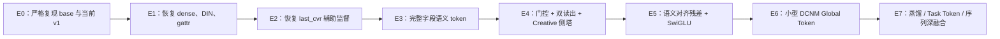
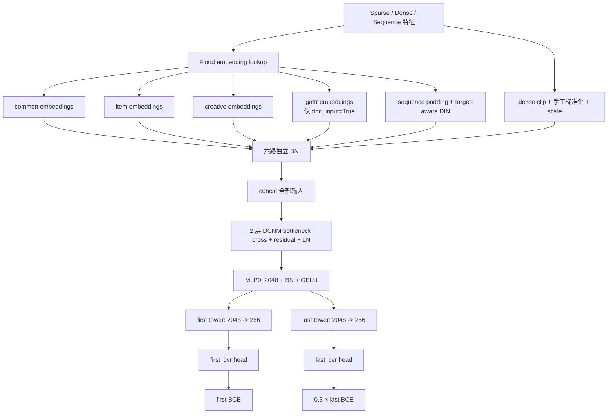
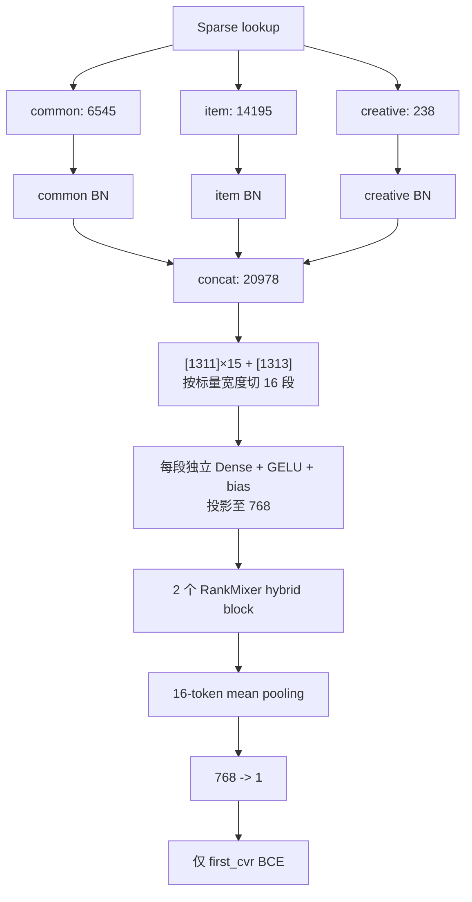
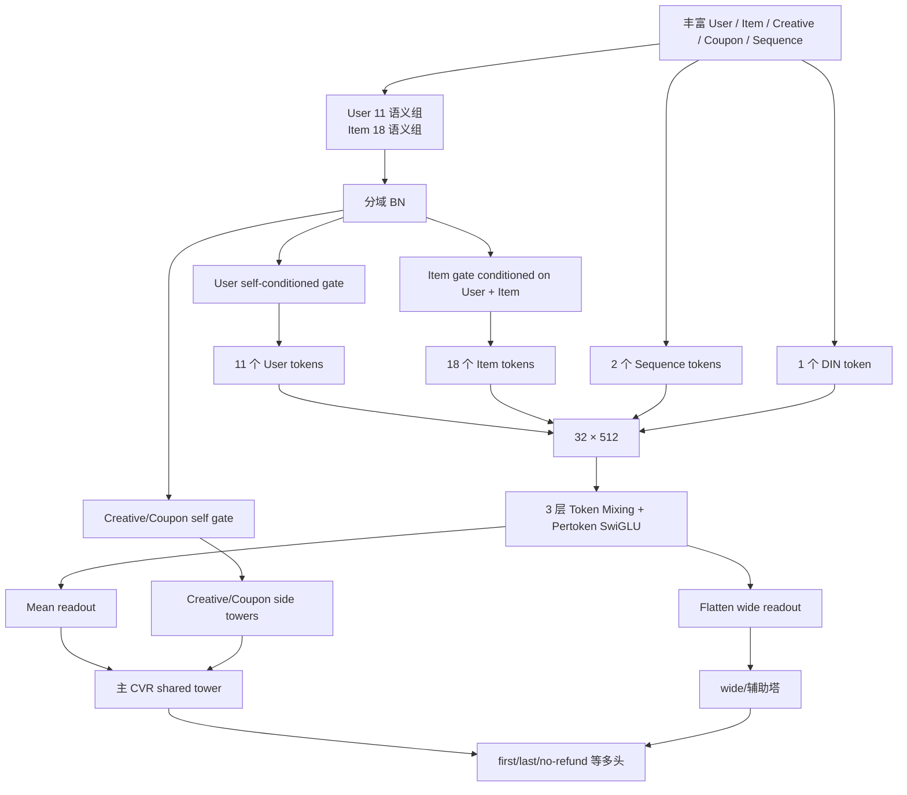
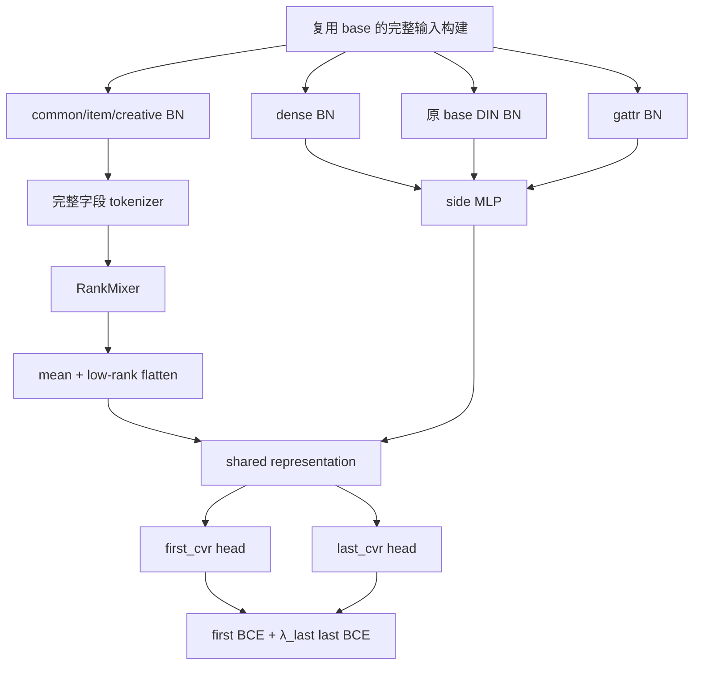
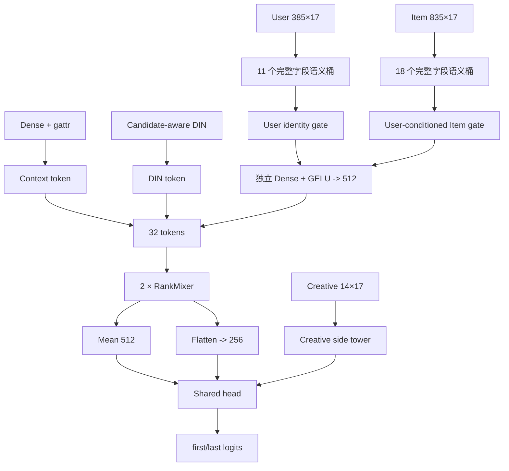
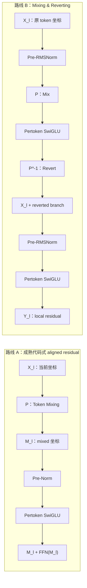
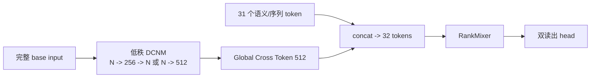
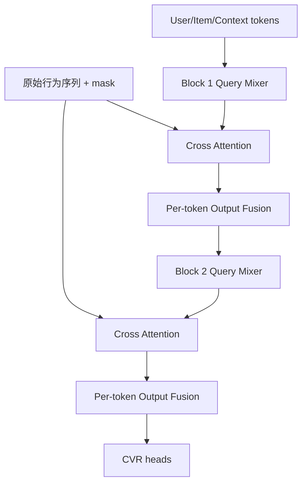

# CVR RankMixer v1 的 0.003 AUC 差距：源码诊断与分级改进路线

> 分析对象：`code/set-xcal.txt`、`code/cvr_fst_last_norpy.py`、`code/cvr_bn_rankmixer_v1.py`、`code/commend_cvr.py`、`code/mlp_mixer_swiglu_fuse.py`<br>
> 实验背景：日训练样本约 5.5 亿、日测试样本约 1.1 亿，连续约 10 天；base AUC 约 0.865，RankMixer v1 AUC 约 0.862<br>
> 文档日期：2026-08-14<br>
> 结论边界：本文完成源码静态审计、结构与参数复算、论文对照和实验设计；未接入公司训练平台，不能替代线上重跑和消融实验。
>
> 按模块分类的全量改进指南：[CVR_RankMixer_全量改进方案_按模块分类.md](CVR_RankMixer_全量改进方案_按模块分类.md)<br>
> 全部改进方法的精炼选型总览：[CVR_RankMixer_v1_改进方案汇总与选型指南.md](CVR_RankMixer_v1_改进方案汇总与选型指南.md)

---

## 目录

1. [执行结论](#1-执行结论)
2. [先统一指标口径与证据边界](#2-先统一指标口径与证据边界)
3. [三套模型的真实数据流](#3-三套模型的真实数据流)
4. [为什么当前实验不能证明 RankMixer 不适合该 CVR](#4-为什么当前实验不能证明-rankmixer-不适合该-cvr)
5. [0.003 AUC 差距的根因排序](#5-0003-auc-差距的根因排序)
6. [RankMixer v1 主干的逐行结构审计](#6-rankmixer-v1-主干的逐行结构审计)
7. [成熟公司方案真正多做了什么](#7-成熟公司方案真正多做了什么)
8. [相关文献给出的可迁移结论](#8-相关文献给出的可迁移结论)
9. [方案一：输入与监督完全对齐的 Parity-RankMixer](#9-方案一输入与监督完全对齐的-parity-rankmixer)
10. [方案二：32 个稳定语义 token、条件门控与双读出](#10-方案二32-个稳定语义-token条件门控与双读出)
11. [方案三：修复 block 拓扑，使用语义对齐残差与 SwiGLU](#11-方案三修复-block-拓扑使用语义对齐残差与-swiglu)
12. [方案四：保留小型显式交叉，构造 DCNM Global Token](#12-方案四保留小型显式交叉构造-dcnm-global-token)
13. [方案五：恢复候选相关序列，并逐步升级到 MixFormer 式融合](#13-方案五恢复候选相关序列并逐步升级到-mixformer-式融合)
14. [方案六：CVR 多任务、Task Token 与 AUC 辅助目标](#14-方案六cvr-多任务task-token-与-auc-辅助目标)
15. [方案七：热启动、蒸馏和分组学习率](#15-方案七热启动蒸馏和分组学习率)
16. [后续研究方案：RankUp 与 UniMixer-Lite](#16-后续研究方案rankup-与-unimixer-lite)
17. [推荐的实验阶梯](#17-推荐的实验阶梯)
18. [监控、验收和归因规范](#18-监控验收和归因规范)
19. [最终推荐组合](#19-最终推荐组合)
20. [来源与源码定位](#20-来源与源码定位)

---

## 1. 执行结论

### 1.1 最重要的判断

当前 `cvr_bn_rankmixer_v1.py` 的 0.862 不能与 `cvr_fst_last_norpy.py` 的 0.865 解释成：

> “只把 MLP/DCNM 换成 RankMixer 后，AUC 下降了 0.003。”

源码证明，RankMixer v1 同时改变了至少七项关键条件：

1. 删除了 base 显式使用的 dense 输入；
2. 删除了 base 的候选相关 DIN 序列表示；
3. 删除了 `dnn_input=True` 的 gattr 输入；
4. 删除了两层 DCNM 显式交叉；
5. 删除了三层 `[2048, 2048, 256]` MLP 头；
6. 删除了 base 实际始终加入的 `last_cvr` 辅助损失；
7. 新增的 RankMixer dense 主干很可能无法复用 base 的 dense checkpoint。

因此，这次实验测到的是：

$$
\Delta\mathrm{AUC}
=\Delta\mathrm{feature}
+\Delta\mathrm{task}
+\Delta\mathrm{warmstart}
+\Delta\mathrm{tokenizer}
+\Delta\mathrm{backbone}
+\Delta\mathrm{readout}
+\Delta\mathrm{optimization},
$$

而不是单独的 $\Delta\mathrm{RankMixer}$。

### 1.2 对 0.003 差距的当前解释

按源码证据强度和可能影响排序：

| 优先级 | 高概率原因 | 源码证据强度 | 当前建议 |
|---|---|---:|---|
| P0 | v1 丢失 dense、DIN、gattr 强信号 | 已直接证明 | 首先恢复，单独消融 |
| P0 | base 实际有 first/last 联合监督，v1 只有 first | 已直接证明 | 恢复 `last_cvr` 辅助头 |
| P0 | 当前长向量等宽切分破坏字段与域边界 | 已直接证明 | 改为完整字段、稳定语义分桶 |
| P0/P1 | base 可热启旧 dense 塔，RM 新主干随机初始化 | 启动配置高度支持，需日志确认 | 做等冷启或显式蒸馏/渐进热启 |
| P1 | v1 block 是“原版 RankMixer + 额外 Pre-LN”的混合体 | 已直接证明 | 严格原版与对齐残差分别消融 |
| P1 | 只做 mean pooling，token 身份被压掉 | 已直接证明 | 增加低秩 flatten/加权读出 |
| P1 | `k=4` 使当前主干约 167M，并非简单的“100M 配置” | 已复算 | 做等参数和等训练预算对比 |
| P2 | 概率式 BCE、logit clip、无实际梯度裁剪等训练细节 | 已直接证明，但 base 也有部分同类写法 | 作为稳定性修复，不当作首因 |

### 1.3 最推荐的落地顺序

不是直接复制 `commend_cvr.py` 的所有复杂结构，而是按以下顺序逐步迁移：



第一目标应当是**先追回 0.003 AUC 差距并完成因果归因**，第二目标才是继续超过 0.865。

---

## 2. 先统一指标口径与证据边界

### 2.1 0.865 与 0.862 是 AUC，不是普通分类 Accuracy

两份代码都通过 `flood_auc(..., num_thresholds=2000)` 和测试阶段的 `RocAucAccum` 计算指标。因此本文把用户口中的“准确率”统一称为 AUC。

绝对差为：

$$
0.865-0.862=0.003,
$$

即 0.3 个绝对百分点；相对 0.865 约为：

$$
\frac{0.003}{0.865}\approx0.347\%.
$$

对于 1.1 亿日测试样本，这通常不应被当作随机小波动直接忽略；但只有在测试日期、样本过滤、标签窗口和 checkpoint 完全一致时，才可解释为模型差异。

### 2.2 当前 `set-xcal.txt` 不是可直接复原的 base 启动命令

用户说明该脚本最初用于运行 base；但当前工作区版本实际写的是：

```text
models.rankmixer.cvr_rankmixer_fst_v1.MLPModel
```

并包含 `rm_token_num`、`rm_hidden_dim`、`rm_layer_num` 等 RankMixer 参数。因此本文可以核对当前 RankMixer 运行配置，但不能仅凭这份文件证明当时 base 的全部线上参数。

需要从服务器历史任务或日志补齐：

- base 实际 Python 类路径；
- base 与 v1 的 `model_args` 完整 JSON；
- 两者导入的 checkpoint 与缺失变量列表；
- 两者实际处理的训练/测试日期；
- 每天有效 step、样本数、正例率与 label delay；
- 两者最终 dense/sparse 学习率曲线。

### 2.3 本文的三类表述

- **源码事实**：当前文件可以直接证明；
- **高概率推断**：由代码和启动配置共同支持，但仍需服务器日志确认；
- **实验假设**：需要消融才能确认，文献结果不能替代本业务实验。

---

## 3. 三套模型的真实数据流

### 3.1 base：六类输入 + DCNM + MLP + first/last 双任务



关键源码：

- `cvr_fst_last_norpy.py:917-962`：构建 common/item/creative/gattr、dense 和 DIN；
- `cvr_fst_last_norpy.py:964-1006`：六路 BN、拼接、DCNM；
- `cvr_fst_last_norpy.py:1013-1130`：主 MLP 和 first head；
- `cvr_fst_last_norpy.py:1041-1141`：last 分塔；
- `cvr_fst_last_norpy.py:525-538`：first loss 与 last loss 相加。

### 3.2 RankMixer v1：三类稀疏输入 + 等宽标量切分 + mean head



v1 虽然仍 lookup 了 `seq_columns`，但主路径没有调用 `_post_process_sequence()`，也没有调用 DIN；dense 与 gattr 也没有进入 `dnn_input_map`。

### 3.3 成熟公司 RankMixer：语义分组、门控、序列 token、双读出和多任务



成熟方案的收益不能简单归结为“SwiGLU 比 GELU 强”。它同时拥有：

- 更细且稳定的语义 token；
- User→Item 条件门控；
- 多路候选相关序列；
- mean 与 flatten 两种读出；
- Creative/Coupon 侧塔；
- 多标签监督；
- 特殊学习率和 fused per-token 实现。

---

## 4. 为什么当前实验不能证明 RankMixer 不适合该 CVR

### 4.1 输入空间不相同

base 的主干输入为：

$$
X_{base}=[U,I,C,Dense,DIN,Gattr],
$$

而 v1 为：

$$
X_{v1}=[U,I,C].
$$

若 DIN、dense 或 gattr 中任何一类对 CVR 有显著边际信息，v1 即使拥有更大的 dense 主干，也无法凭空恢复被删掉的条件信息。

### 4.2 监督信号不相同

当前 `set-xcal.txt` 传入了：

```json
"enable_last_cvr": false
```

但 `cvr_fst_last_norpy.py` 中没有用该 flag 包住 last 分支。base 仍然：

1. 无条件解析 `last_cvr_label`；
2. 无条件构建 last tower；
3. 无条件计算 `loss_last * 0.5`；
4. 将它与 first loss 相加。

v1 则只保留 `fst_cvr_label`。因此 base 实际享有辅助任务正则化和额外正样本结构，v1 没有。

### 4.3 初始化条件可能不相同

当前启动脚本：

- 导入一个既有 v9 delay checkpoint；
- `change_fea=false`；
- `ignore_dense_checkpoint=False`；
- 对新 `rm_*` 张量设置 skip/warm 名单。

高概率情况是：base 的 `dcnm-cross/mlp*/deep_out` 可以从历史模型加载，而 v1 的 `rm_tok/rm_pffn/rm_ln/rm_out` 是新增参数，只能随机初始化。其精确行为取决于 Flood warm-start hook，必须以服务器变量加载日志为准。

### 4.4 容量更大不代表短期一定收敛更好

当前 v1 主干近似参数量为：

#### Token 投影

$$
P_{tokenizer}=20978\times768+16\times768=16,123,392.
$$

#### 两层、16 token、四倍扩展的 PFFN

$$
P_{PFFN}
=L\,T\left(D\cdot4D+4D+4D\cdot D+D\right)
=151,117,824.
$$

再加 6 个 block LN、输出头和输入 BN 后，约为 **167.3M trainable dense parameters**。

所以代码注释中的“论文 100M 配置”只对齐了 `T=16,D=768,L=2` 三个轴；当 `k=4` 时，实际 v1 不是约 100M。原论文参数公式也把 $k$ 作为独立变量，不能仅凭 `T/D/L` 推断总参数。

大模型还可能需要更长数据窗口。TokenMixer-Large 在其直播实验中报告，500M→2.3B 只训练 30 天的增益低于训练 60 天的增益。该结果不能直接外推到本任务，但足以说明“相同天数比较不同容量”可能系统性低估大模型。

---

## 5. 0.003 AUC 差距的根因排序

### 5.1 P0：v1 删除了 base 的强输入

这是最直接、最应先修复的差异。

| 输入 | base | v1 | 可能作用 |
|---|:---:|:---:|---|
| Common/User sparse | ✓ | ✓ | 用户画像与上下文 |
| Item sparse | ✓ | ✓ | 商品/内容属性 |
| Creative sparse | ✓ | ✓ | 创意信号 |
| Dense | ✓ | ✗ | 连续统计、价格、频次等强信号 |
| DIN sequence | ✓ | ✗ | 当前候选相关的历史兴趣 |
| gattr | 条件使用 | ✗ | 全局/请求属性 |

尤其是 CVR，候选相关历史行为、价格/统计类 dense 往往很难由静态 ID embedding 替代。这里的“往往”是业务经验推断；真正贡献必须用逐类恢复消融确认。

### 5.2 P0：标量等宽切分破坏了 token 语义

v1 的实际切分不是“每个域分成若干完整字段”，而是：

```python
base = 20978 // 16  # 1311
segments = [1311] * 15 + [1313]
```

每个 sparse field 宽 17，但：

$$
1311\bmod17=2,\qquad1313\bmod17=4.
$$

因此 15 个内部 token 边界全部落在字段内部。两个域边界也被跨越：

- Common 结束位置为 6545；第 5 个切分边界为 6555，所以该 token 同时包含 Common 尾部和 Item 前 10 维；
- Creative 开始位置为 20740；最后一个 token 从 19665 开始，所以它同时包含 Item 尾部 1075 维和全部 Creative 238 维。

这破坏了 per-token FFN 的前提：token 位置应长期对应稳定且可解释的输入子空间。

### 5.3 P0：base 有 last 辅助监督，v1 没有

base 损失实际为：

$$
\mathcal L_{base}
=\mathcal L_{first}+0.5\mathcal L_{last}.
$$

v1 为：

$$
\mathcal L_{v1}=\mathcal L_{first}.
$$

即使只考察 first AUC，相关的 last 标签也可能改善共享底层表示。是否使用 0.5 最优需要重新搜参；但公平骨干对比至少应保持与 base 相同。

### 5.4 P0/P1：热启动优势可能只属于 base

167M 新 dense 参数用 $2\times10^{-5}$ 学习率从随机初始化开始，而 base 可能从已收敛的 DCNM/MLP 继续训练，两条收敛曲线不具可比性。

必须增加以下日志：

```text
loaded_dense_var_count / loaded_dense_param_count
random_init_dense_var_count / random_init_dense_param_count
每个 scope 的首日 update_norm / weight_norm
每个 scope 的 grad_norm、zero-grad 比例和 NaN/Inf 比例
```

### 5.5 P1：v1 block 不是严格原版，也不是成熟公司版本

严格原版 RankMixer：

$$
S=\operatorname{LN}(P(X)+X),
$$

$$
Y=\operatorname{LN}(\operatorname{PFFN}(S)+S).
$$

v1 实际为：

$$
S=\operatorname{LN}(P(X)+X),
$$

$$
\widetilde S=\operatorname{LN}(S),
$$

$$
Y=\operatorname{LN}(\operatorname{PFFN}(\widetilde S)+S).
$$

即每个 block 有三次 LN，其中 FFN 前多了一次 LN。这是一个未被独立验证的 Sandwich/hybrid 结构。

成熟公司 `mlp_mixer_swiglu_fuse.py` 又是另一种拓扑：

$$
M=P(X),
$$

$$
Y=M+\operatorname{SwiGLU}(\operatorname{LN}(M)),
$$

最后统一 Final LN。它没有做 `P(X)+X`，从而避免把两个不同 token 坐标系直接相加。

### 5.6 P1：mean pooling 是明显的信息瓶颈

v1 将：

$$
[B,16,768]\rightarrow[B,768]
$$

后直接输出一个 logit。所有 token 等权，token 身份、稀有域信号和局部强特征都只能通过均值保留。

成熟公司方案同时使用：

- mean readout：紧凑全局信息；
- flatten wide readout：保留全部 token 坐标；
- Creative/Coupon side tower：避免小域被大域平均掉。

### 5.7 P2：训练与代码卫生问题

以下不是 0.003 的首要归因，但都值得修复：

- `use_rankmixer` flag 定义后，主路径仍无条件执行 RankMixer；
- `grad_clip_value` 定义但优化器没有实际 clip；
- `dropout` 定义但未使用；
- RM tokenizer/PFFN 没有传入 `l2_deep` regularizer；
- 注释写“Linear、无 bias”，实际是 Dense + GELU + bias；
- loss 先 sigmoid，再调用 `tf.losses.log_loss`，不如 raw-logit BCE 稳定；
- loss 前 clip logits 会在极端样本上截断梯度；
- 缺少 `T == H` 的显式 assert，当前配置虽满足，但改参时容易静默破坏语义。

---

## 6. RankMixer v1 主干的逐行结构审计

### 6.1 Tokenizer 确实是“一层非线性投影”，不是两层 MLP

源码实际调用链是：

```text
long_vec [B,20978]
-> tf.split(..., segments=[1311]×15+[1313])
-> 对每段调用 tf.contrib.layers.fully_connected
-> tf.stack(axis=1)
-> x0 [B,16,768]
```

具体执行模块是 `cvr_bn_rankmixer_v1.py:774-799` 的 `_rm_tokenize_bucket()`；维度变化由
`tf.contrib.layers.fully_connected` 完成，而不是一个自定义多层 MLP。对第 $t$ 段执行：

$$
x_t=\operatorname{GELU}(z_tW_t+b_t),
$$

其中：

$$
W_t\in\mathbb R^{d_t\times768},\qquad b_t\in\mathbb R^{768}.
$$

逐步 shape 为：

| 步骤 | 张量 shape | 是否有参数 |
|---|---|---|
| 第 $t$ 段输入 | `[B, d_t]` | 无 |
| 仿射变换 $z_tW_t+b_t$ | `[B, 768]` | kernel `[d_t,768]`、bias `[768]` |
| `gelu_2` | `[B, 768]` | 无 |
| 16 段 stack | `[B,16,768]` | 无 |

每段 scope 为 `rm_tok_proj_t{i}_{seg_dim}/w`，所以 16 段各有自己的 $W_t,b_t$，互不共享；
`reuse=tf.AUTO_REUSE` 只表示同一 scope 再次建图时复用，并不让不同 token 共用权重。
当前 `rm_proj_ln=false`，所以投影后没有 LN；该函数内部也没有第二个 Dense、hidden bottleneck、
residual、BN 或 dropout。

它只有一组矩阵和一个 bias，所以更准确的名称是：

> **带 GELU 的单层 Dense 投影 / nonlinear projection**。

它不是通常意义上的两层 MLP：

$$
W_2\phi(W_1x+b_1)+b_2.
$$

如果采用非常宽松的术语，也可以叫“单层 MLP”，但这容易让人误以为存在
`input -> hidden -> output` 两次维度变换。源码层面的严格结论是：**一个仿射投影矩阵 + bias，
紧接一个 GELU**。

第 $t$ 段参数量为：

$$
P_t=d_t\times768+768.
$$

16 段总参数量为：

$$
\sum_tP_t=20978\times768+16\times768=16,123,392.
$$

因此“每桶压成一个 token”并不是 pooling、求和或无参 reshape，而是让该桶全部输入维度通过
一个可训练矩阵共同生成 token 的 768 个通道；GELU 再提供一次逐通道非线性。

### 6.2 Token Mixing 本身实现正确，但只在 H=T 时与论文形状语义一致

当前配置：

$$
T=H=16,\quad D=768,\quad D/H=48.
$$

数据流为：

```text
[B,16,768]
-> [B,16,16,48]
-> transpose token/head
-> [B,16,16,48]
-> [B,16,768]
```

这个操作是固定置换 $P$，在当前维度下满足 $P^2=I$。但这不意味着可以忽略语义：`P(X)` 的位置含义已经从“原始业务 token”变成“跨 token 的同号通道组合”。

### 6.3 PFFN 每个 token、每个 block 都有独立参数

每个 token 有：

```text
768 -> 3072 -> 768
```

不同 token 的 `rm_pffn_t*` 不共享；外层 `rm_block_0/1` 又使两层之间不共享。这一点符合 RankMixer 的参数隔离思想。

### 6.4 问题不在“有没有 PFFN”，而在给 PFFN 的 token 是否稳定

PFFN 的优势来自：

- token 0 长期负责一类相对稳定的特征；
- token 1 长期负责另一类相对稳定的特征；
- 每套参数能形成自己的专长。

当前 token 由标量位置机械切分，部分 token 甚至跨域。PFFN 参数虽然独立，但其输入职责并不干净，参数隔离的收益会被削弱。

---

## 7. 成熟公司方案真正多做了什么

### 7.1 先做业务语义组织，再做 token 投影

成熟方案不是把整个 User/Item 各看成一个超大桶后等宽切片，而是先构造：

- 11 个 User 语义组；
- 18 个 Item 语义组；
- 2 个 Sequence token；
- 1 个 DIN token。

合计正好 32 个 token。每个组再通过自己的 `embedding_to_tokens()` 做 Dense + GELU。

这里也要严格澄清：`commend_cvr.py:5190-5213` 的函数注释虽然写“通过 MLP 压缩”，实际核心仍是
**单次** `tf.layers.dense(..., units=token_num*token_dim, activation=gelu)`，随后只做 reshape：

```text
普通 User/Item 语义组: [B,d_g] -> Dense+GELU -> [B,512] -> [B,1,512]
Sequence 合并组:       [B,d_s] -> Dense+GELU -> [B,1024] -> [B,2,512]
DIN 合并组:            [B,d_d] -> Dense+GELU -> [B,512] -> [B,1,512]
```

所以成熟方案和 v1 在“单桶如何改维”这一原子操作上是同一类单层非线性投影；真正的差别是成熟方案
先按稳定业务语义形成 11 个 User 组、18 个 Item 组和序列组，并为每组使用独立 scope 与 regularizer，
而 v1 先把三大域拼成 20978 维长向量，再按标量宽度机械切段。

### 7.2 门控是按样本动态的，但 token 身份是稳定的

成熟代码用 `excitation2()`：

$$
g_U=\sigma(W_{U2}\phi(\operatorname{BN}(W_{U1}U))),
$$

$$
g_I=\sigma(W_{I2}\phi(\operatorname{BN}(W_{I1}[U,I]))),
$$

$$
U'=U\odot g_U,\qquad I'=I\odot g_I.
$$

Item gate 由 `[User, Item]` 联合条件生成，因此显式建模“对当前用户哪些 Item 特征更重要”。最后一层 gate kernel 零初始化，初始 gate 为常量，便于从近似恒等变换逐渐学习。

### 7.3 序列不是可选装饰，而是正式 token

成熟方案把多路 gated sequence、Top-K/子序列和 DIN 输出变成 3 个正式 token，与静态域一起进入 Mixer。它没有假设 RankMixer 可以替代候选相关行为建模。

### 7.4 SwiGLU 不是孤立替换

成熟 SwiGLU 模块同时使用：

- per-token 三矩阵 `gate/up/down`；
- Pre-LN；
- down 矩阵零初始化；
- FFN 内语义对齐 residual；
- fused 训练算子；
- Final LN。

直接只把 v1 的 GELU 换成 SwiGLU，而不改初始化、残差和参数预算，不能公平验证 SwiGLU。

### 7.5 双读出和侧塔保留不同粒度的信息

成熟方案：

```text
Mixer [B,32,512]
├─ mean -> main representation
└─ flatten [B,16384] -> wide MLP

Creative/Coupon -> independent side towers
```

它避免“所有信号都必须挤进一个 token 均值”的单点瓶颈。

---

## 8. 相关文献给出的可迁移结论

### 8.1 RankMixer：必须先保证语义 token 和 per-token 参数隔离

[RankMixer](https://arxiv.org/abs/2507.15551) 的核心不是固定的 `16×768×2` 数字，而是：

1. 业务相关特征先组成稳定 token；
2. 无参数 Token Mixing 建立跨 token 通路；
3. 每 token 独立 FFN 保留异质子空间。

其消融在原论文数据上报告：去掉 Token Mixing、改成共享 FFN、去掉 skip、去掉 LN 分别下降 0.50%、0.31%、0.07%、0.05%。这些数值不能外推到本 CVR，但说明错误 tokenization 会直接破坏论文最核心的归纳偏置。

### 8.2 TokenMixer-Large：shape 相同不代表 residual 语义对齐

[TokenMixer-Large](https://arxiv.org/abs/2602.06563) 明确指出原 RankMixer 的 mixing residual 存在 token semantic misalignment，并提出：

- Mixing & Reverting；
- Pre-RMSNorm；
- Pertoken SwiGLU；
- down matrix small init；
- inter-residual 与 auxiliary loss。

其 4B 消融中，移除 Mixing & Reverting、把 Pertoken SwiGLU 换成共享 SwiGLU、换回 Pertoken FFN，分别下降 0.27%、0.21%、0.10%。这些是其他私有任务的相对结果，但“残差两端必须语义对齐”是可直接迁移的结构检查原则。

### 8.3 RankUp：不要只增加参数，要增加输入表示自由度

[RankUp](https://arxiv.org/abs/2604.17878) 与当前问题高度相关：它同样以两层 RankMixer 类模型做 CVR 多任务，提出完整字段层面的随机分片、多 embedding、Global Token、预训练交叉 token 和 Task Token。

可迁移原则是：

- 增加参数前先检查 token 表示是否高度相关；
- Global Token 为每层提供全局上下文；
- Task Token 可缓解多任务共用一个池化向量的信息冲突；
- 随机分片必须保持字段完整且在一次实验内固定，不能按标量乱切。

### 8.4 MixFormer：DIN 恢复后，再考虑让序列逐层参与

[MixFormer](https://arxiv.org/abs/2602.14110) 认为“先把序列压成一个静态向量，最后与 dense 主干拼接”会限制 dense 与 sequence 的共同扩展。它在每层用高阶 query 读取行为序列。

对当前工程的合理迁移顺序是：

1. 先把 base 现有 DIN 原样恢复；
2. 再把 DIN 变为正式 token；
3. 最后才试每层 Cross Attention。

直接从“完全删除 DIN”跳到完整 MixFormer，会再次形成无法归因的大改动。

### 8.5 UniMixer-Lite：固定 mixing 不是永远最优，但属于后期实验

[UniMixer](https://arxiv.org/abs/2604.00590) 把固定置换放松成受 Sinkhorn 约束的可学习软置换；Lite 版用共享局部基和低秩全局矩阵控制成本。

它适合在以下条件满足后再尝试：

- 输入/任务已经与 base 对齐；
- 语义 token 方案已经稳定；
- 监控表明固定 mixing 才是主要瓶颈；
- 有能力验证 Sinkhorn 温度、显存和真实吞吐。

---

## 9. 方案一：输入与监督完全对齐的 Parity-RankMixer

### 9.1 目标

这是所有后续实验的前置方案，不追求一次把结构做到最复杂，而是回答：

> 在相同输入、相同标签、相同 checkpoint 条件下，只替换 dense backbone，RankMixer 到底比 base 好还是差？

### 9.2 架构



### 9.3 关键约束

- 数据日期、feature version、采样、batch、optimizer 和 sparse 更新全部与 base 相同；
- 保留 dense、DIN、gattr；
- 保留 last label，首轮令 `lambda_last=0.5` 与 base 对齐；
- base 和 RM 要么都冷启，要么都从各自可加载的同阶段 checkpoint 启动；
- 先不加入新 gate、SwiGLU、Task Token 或 pairwise loss。

### 9.4 伪代码

```python
def parity_rankmixer(features, labels, mode):
    parts = build_exact_base_inputs(features, labels, mode)
    # parts: common, item, creative, dense, din, gattr

    parts = {name: domain_bn(x, name) for name, x in parts.items()}

    sparse_tokens = field_safe_tokenize(
        [parts['common'], parts['item'], parts['creative']]
    )
    h = rankmixer(sparse_tokens)

    mean_repr = reduce_mean(h, axis=1)
    flat_repr = dense(reshape(h, [B, -1]), 256, activation=gelu)
    side_repr = mlp(
        concat([parts['dense'], parts['din'], parts['gattr']]),
        [512, 256]
    )

    shared = mlp(concat([mean_repr, flat_repr, side_repr]), [512, 256])
    z_first = dense(shared, 1)
    z_last = dense(shared, 1, scope='last_head')

    loss = bce_logits(labels.first, z_first)
    loss += 0.5 * bce_logits(labels.last, z_last)
    return z_first, z_last, loss
```

### 9.5 该方案能回答什么

- 若 AUC 直接追回大部分差距，首因是输入/辅助监督，不是 RankMixer block；
- 若仍差 0.002 以上，再进入 tokenizer、block 和 readout 消融；
- 若超过 base，再逐项删除 side 分支，判断哪些信号真正必要。

---

## 10. 方案二：32 个稳定语义 token、条件门控与双读出

### 10.1 目标

把成熟公司方案最有价值、又能适配当前字段规模的输入结构迁移到 v1。

推荐首轮配置：

| 项目 | 建议值 |
|---|---:|
| Token 数 $T$ | 32 |
| Head 数 $H$ | 32 |
| Token 宽 $D$ | 512 |
| Block 数 $L$ | 2 |
| GELU hidden | 2048 |
| 单 head 宽 | 16 |

这组配置的两层 GELU PFFN 约 134.2M 参数，配合 tokenizer 和低秩读出，能与当前约 167.3M v1 保持相近量级，而不是无控制地增参。

### 10.2 32-token 映射

建议映射：

| Token 类型 | 数量 | 构造方式 |
|---|---:|---|
| User | 11 | 优先业务语义组；无语义表时，每组 35 个完整 17 维字段 |
| Item | 18 | 优先业务语义组；兜底为 7 组×47 字段、11 组×46 字段 |
| DIN | 1 | base 现有 candidate-aware sequence output |
| Context | 1 | dense + gattr 低秩投影 |
| Global | 1 | 全域 pooled summary / 小型 cross 输出 |
| 合计 | 32 | Creative 走独立侧塔 |

注意：兜底均衡分桶只保证字段完整，不保证最佳语义；最终应由 feature config 的业务含义重新编组。

### 10.3 条件门控

建议采用 identity-friendly gate：

$$
g_U=2\sigma(MLP_U(U)),
$$

$$
g_I=2\sigma(MLP_I([U,I])),
$$

$$
g_C=2\sigma(MLP_C(C)).
$$

最后一层 gate kernel 和 bias 零初始化，则初始时：

$$
g_U=g_I=g_C=1.
$$

这比随机 gate 安全：模型从不改变原输入开始，逐渐学习重加权。

### 10.4 双读出

```text
h: [B,32,512]
mean(h): [B,512]
flatten(h): [B,16384] -> low-rank Dense -> [B,256]
creative side: [B,238] -> [B,128]
concat -> [B,896] -> [512,256] -> logits
```

### 10.5 架构图



### 10.6 伪代码

```python
u = domain_bn(user)
i = domain_bn(item)
c = domain_bn(creative)

u = u * identity_gate(u, scope='user_gate')
i = i * identity_gate(concat([u, i]), output_dim=dim(i), scope='item_gate')

u_groups = split_complete_fields(u, 11, semantic_map=user_semantic_map)
i_groups = split_complete_fields(i, 18, semantic_map=item_semantic_map)

tokens = [project_gelu(g, 512, scope=f'u_{j}') for j, g in enumerate(u_groups)]
tokens += [project_gelu(g, 512, scope=f'i_{j}') for j, g in enumerate(i_groups)]
tokens += [project_gelu(din, 512, scope='din')]
tokens += [project_gelu(concat([dense, gattr]), 512, scope='context')]
tokens += [build_global_token(u, i, dense, gattr, out_dim=512)]

x = stack(tokens, axis=1)  # [B, 32, 512]
h = rankmixer(x, layers=2, heads=32)

mean_repr = reduce_mean(h, axis=1)
flat_repr = dense(reshape(h, [B, 32 * 512]), 256, activation=gelu)
creative_repr = mlp(c, [128])
shared = mlp(concat([mean_repr, flat_repr, creative_repr]), [512, 256])
```

### 10.7 必做消融

1. 16 个完整字段桶 vs 32 个稳定桶；
2. 无 gate vs User gate vs User+Item conditional gate；
3. mean only vs mean+low-rank flatten；
4. Creative mixer token vs Creative side tower；
5. Global Token on/off。

---

## 11. 方案三：修复 block 拓扑，使用语义对齐残差与 SwiGLU

### 11.1 为什么不能只把 GELU 改成 SwiGLU

普通 GELU PFFN 的主要权重为：

$$
2D h_{gelu}.
$$

SwiGLU 为：

$$
3D h_{swiglu}.
$$

若 GELU 使用 $h_{gelu}=4D$，等参数 SwiGLU 应满足：

$$
3Dh_{swiglu}\approx8D^2,
$$

$$
h_{swiglu}\approx\frac{8}{3}D.
$$

对 $D=512$，可先用 `h_swiglu=1344` 做接近等参数比较；直接使用公司版本的 `2048=4D` 会让 PFFN 参数增加约 50%，无法区分激活函数和容量收益。

### 11.2 路线 A：成熟代码式“混合坐标内 residual”

```python
def company_style_block(x):
    m = token_mix(x)                     # mixed coordinate
    f = per_token_swiglu(rms_norm(m))   # same coordinate
    return m + f                         # semantic-aligned add
```

使用偶数层 $L=2$，因为 $P^2=I$；最后做一次 RMSNorm/LN。down 矩阵零初始化或 0.01 small init，使初始 FFN 分支接近 0。

优点：

- 最接近现有成熟公司实现；
- 改造成本低；
- 不做 `P(X)+X` 的错位相加。

风险：

- block 间没有始终保留原坐标的长 residual；
- 奇数层输出落在 mixed 坐标，必须谨慎处理 readout。

### 11.3 路线 B：TokenMixer-Large 式 Mixing & Reverting

每个 block：

```python
def mixing_reverting_block(x):
    # stage 1: cross-token interaction in mixed coordinates
    m = token_mix(rms_norm(x))
    m = per_token_swiglu(m, down_init_scale=0.01)
    r = token_revert(m)
    y = x + r                         # original coordinate residual

    # stage 2: local per-token refinement
    f = per_token_swiglu(rms_norm(y), down_init_scale=0.01)
    return y + f
```

因为当前 $T=H$，`token_revert` 与同一个置换的逆操作等价；但代码中仍应使用独立命名函数，防止将来修改 head/token 数后产生错误假设。

### 11.4 两条路线的结构图



路线 A 的 residual 两端都处于 mixed 坐标；路线 B 在加回长 residual 前先恢复到原 token 坐标。
二者都避免 v1/原版式直接将 $P(X)$ 与 $X$ 仅凭 shape 相同就相加。

### 11.5 等参数配置

Mixing & Reverting 每个 block 有两次 SwiGLU。若使用：

```text
T=32, D=512, L=2, hidden=768
```

两段 SwiGLU 的主要参数约为：

$$
2\times3\times T\times D\times768\times L
\approx151.0M,
$$

与当前 v1 的 151.1M PFFN 非常接近，适合公平结构比较。

### 11.6 推荐实验顺序

1. 当前 hybrid block；
2. 严格原版双 Post-LN block；
3. 成熟代码式 aligned residual + parameter-matched SwiGLU；
4. 完整 Mixing & Reverting；
5. 在最佳 block 上比较 down init `0 / 0.01 / 0.1 / 1.0`。

不要把 block、token 数、输入和任务同时改变。

---

## 12. 方案四：保留小型显式交叉，构造 DCNM Global Token

### 12.1 动机

base 的两层 DCNM 显式执行：

$$
x_{l+1}=x_0\odot f_l(x_l)+x_l,
$$

能够高效表达条件性交叉。当前 v1 一次性完全删除它。

TokenMixer-Large 在其任务上发现 DCN 的边际收益会随 backbone 扩大而下降，并在约 700M 时归零；但当前 v1 约 167M、任务是 CVR，因此不能据此推断 DCNM 已经无用。

### 12.2 推荐结构

不是恢复完整高维 DCNM 后再串联所有模块，而是让它变成低成本 Global Token 或 late residual：



### 12.3 两个可选版本

#### A. Global-token 版本

```python
cross = low_rank_dcn(concat(all_base_parts), bottleneck=256, layers=1)
global_token = dense(cross, 512)
tokens = concat([local_tokens, global_token[:, None, :]], axis=1)
```

#### B. 并联 late-fusion 版本

```python
cross_repr = mlp(low_rank_dcn(all_inputs), [256])
rm_repr = concat([mean(rm_out), low_rank_flatten(rm_out)])
shared = mlp(concat([rm_repr, cross_repr, creative_repr]), [512, 256])
```

### 12.4 价值

- 最可能较快恢复 base 的显式交叉能力；
- 给 RankMixer 提供全局上下文，缓解局部 token 视野限制；
- 可以单独测量 DCNM 在当前 167M 容量下是否仍有增益。

---

## 13. 方案五：恢复候选相关序列，并逐步升级到 MixFormer 式融合

### 13.1 第一步：原样恢复 base DIN

这是最高 ROI 的序列实验：复用 `_post_process_sequence()` 和 `_sequence_attention_part()`，先得到与 base 相同的 candidate-aware vector。

比较三种接入方式：

1. late side tower；
2. 单独一个 DIN token；
3. DIN token + late side 同时使用。

```python
din = base_din(feature_embed_map, sequence_map, masks, candidate)
din_token = dense(domain_bn(din), D, activation=gelu)
tokens.append(din_token)
```

### 13.2 第二步：短期与长期序列分成两个 token

若 feature config 能稳定区分行为类型或时间窗口：

```text
short-term candidate-aware DIN -> token_seq_short
long-term/retrieved sequence    -> token_seq_long
```

这更接近成熟公司 `2 sequence + 1 DIN` 的设计。

### 13.3 第三步：MixFormer 式逐层 Cross Attention

只有在前两步已经证明序列是主要增益来源时，才考虑：

```python
for block in blocks:
    q = query_mixer(nonseq_tokens)
    seq_ctx = cross_attention(
        query=q,
        key=sequence_embeddings,
        value=sequence_embeddings,
        mask=sequence_mask,
    )
    nonseq_tokens = per_token_fusion(q + seq_ctx)
```

架构：



### 13.4 风险

- 序列 Cross Attention 的成本随行为长度线性增长；
- 当前内部依赖与线上用户侧缓存需要重新评估；
- 若只有已经聚合好的 DIN vector，没有原始 K/V 和 mask，就不应伪造 MixFormer。

---

## 14. 方案六：CVR 多任务、Task Token 与 AUC 辅助目标

### 14.1 先恢复已经存在的 first/last 任务

第一阶段：

$$
\mathcal L
=\mathcal L_{first}
+\lambda_{last}\mathcal L_{last},
$$

搜索：

```text
lambda_last ∈ {0.1, 0.2, 0.5}
```

其中 0.5 用于与 base 对齐，0.1/0.2 用于检查负迁移。

### 14.2 Task Token

为 first 和 last 各加一个可学习 token：

```python
tokens = concat([shared_tokens, task_token_first, task_token_last], axis=1)
h = backbone(tokens)

repr_first = concat([h[:, first_task_pos, :], mean(shared_h)])
repr_last  = concat([h[:, last_task_pos, :],  mean(shared_h)])
```

如果必须固定 $T=32$，可让 Task Token 只进入读出层，或减少一个 Global/Context token；不要静默改变 `T/H/D` 整除条件。

### 14.3 更多辅助标签

成熟公司方案中的 no-refund、favorite、wide label 等只有在标签定义、观测窗口和线上目标一致时才可迁移。建议：

- 主 first_cvr 权重固定 1.0；
- 单个辅助任务从 0.05-0.2 开始；
- 监控主任务梯度与辅助任务梯度 cosine；
- 若持续负相关，使用独立 tower、stop-gradient side task、PCGrad 或 PLE，而不是继续调大 loss weight。

### 14.4 AUC 辅助目标

BCE 仍作为主损失。可以在同一 query/search 内采样正负对：

$$
\mathcal L_{pair}
=\frac{1}{|\mathcal P|}
\sum_{(i,j)\in\mathcal P}
\operatorname{softplus}(-(z_i^+-z_j^-)).
$$

总损失：

$$
\mathcal L
=\mathcal L_{BCE}
+\lambda_{pair}\mathcal L_{pair},
$$

首轮建议 `lambda_pair` 只取 0.02-0.1。Pairwise loss 可能提升排序 AUC，却损害概率校准，所以必须同时看 COPC、LogLoss 和 ECE。

### 14.5 ESMM 的使用边界

只有当：

- 训练集覆盖曝光样本；
- CVR 只在点击后可观察；
- 有明确的曝光→点击→转化链；

才考虑：

$$
p(CTCVR)=p(CTR)\cdot p(CVR\mid click).
$$

如果当前样本已经是业务定义的 CVR 全量样本，盲目加 ESMM 可能改变问题定义。

---

## 15. 方案七：热启动、蒸馏和分组学习率

### 15.1 公平初始化

必须至少完成一种：

#### 等冷启

- sparse embedding 使用同一 checkpoint；
- base dense 与 RM dense 都随机初始化；
- 同数据、同 step 比较。

#### 等成熟度热启

- base 使用历史 base checkpoint；
- RM 使用一个已经训练充分的 RM checkpoint；
- 比较相同增量日期。

不能让成熟 base 与全新 RM 直接比较后归因架构。

### 15.2 从 base 蒸馏到 RM

base 是现成且更强的 teacher。二分类蒸馏：

$$
p_T=\sigma(z_T/\tau),
$$

$$
\mathcal L_{KD}
=\tau^2\operatorname{BCEWithLogits}(z_S/\tau,p_T),
$$

$$
\mathcal L
=(1-\alpha)\mathcal L_{hard}
+\alpha\mathcal L_{KD}.
$$

推荐起点：

```text
temperature τ ∈ {1, 2}
alpha: 首日 0.5，随后线性降到 0.1
```

teacher logits 可离线写入样本，避免训练时双模型前向。

### 15.3 分组学习率

当前不能简单照抄论文的绝对 LR，因为 FloodAdam、RMSProp、Adagrad 和同步方式不同。应按参数更新比例调：

```text
new RankMixer/tokenizer/head: lr_new
warm sparse embeddings:       0.1 × lr_new 或沿用 sparse optimizer
warm shared side towers:      0.2-0.5 × lr_new
gate zero-init last layer:     lr_new
```

监控：

$$
r_{update}=\frac{\|\Delta W\|_2}{\|W\|_2+\epsilon}.
$$

如果 RM 主干 `r_update` 长期比 head 小两个数量级，说明 $2e-5$、warmup 或梯度路径可能过保守。

### 15.4 训练稳定性修复

```python
loss = sigmoid_cross_entropy_with_logits(labels=y, logits=raw_logits)

grads = optimizer.compute_gradients(loss)
grads = clip_by_global_norm(grads, 5.0)  # 需搜索，不照搬
train_op = optimizer.apply_gradients(grads)
```

- loss 使用 raw logits，不在 loss 前 clip；
- sigmoid 只用于预测和指标；
- down matrix 用 zero/0.01 small init；
- 记录每层 activation RMS、grad RMS 和 dead-unit 比例。

---

## 16. 后续研究方案：RankUp 与 UniMixer-Lite

这些方案不应排在追回 base 差距之前，但可以形成第二阶段研究支线。

### 16.1 RankUp 式固定随机字段分片

当前等宽标量切分应先删除。随后可以比较：

1. 业务语义字段分组；
2. 按完整字段均衡分组；
3. 固定随机 permutation 后的完整字段分组。

关键约束：

```python
perm = fixed_permutation(num_fields, seed)  # 一次实验内固定
groups = split_fields(fields[perm], T)
```

不能每个样本或每一步重新随机，否则 token 位置语义变化，per-token FFN 无法形成稳定职责。

建议至少比较 3 个固定 seed，并同时记录：

- token 间相关系数/互信息；
- 每 token activation effective rank；
- 每 token 正则化后梯度范数；
- AUC 均值和波动。

### 16.2 Multi-Embedding 与 Cross Embedding

如果召回侧已有 user/item 预训练向量：

$$
e_{cross}=Proj(e_{user}^{pre}\odot e_{item}^{pre}).
$$

将其作为独立 token，比简单拼接更直接表达匹配。没有可靠预训练向量时，不应为复现论文而凭空制造。

### 16.3 UniMixer-Lite

在固定 Token Mixing 已被证明确实限制效果后，才把置换 $P$ 改为结构化可学习 mixer：

```text
local block bases + learned coefficients
global low-rank mixing
Sinkhorn normalization + temperature schedule
```

验收必须同时包含：

- AUC/LogLoss；
- dense params；
- FLOPs；
- 实测训练吞吐和显存；
- 在线 P95/P99 latency。

---

## 17. 推荐的实验阶梯

### 17.1 阶段 A：先完成因果归因

| 实验 | 相对上一项唯一主要变化 | 目的 |
|---|---|---|
| A0 | 复现 base | 固定 0.865 参考 |
| A1 | 复现当前 v1 | 固定 0.862 参考 |
| A2 | v1 恢复 dense | 测 dense 边际贡献 |
| A3 | A2 恢复 DIN | 测 candidate-aware sequence 贡献 |
| A4 | A3 恢复 gattr | 测全局属性贡献 |
| A5 | A4 恢复 last loss | 测辅助监督贡献 |
| A6 | A5 改完整字段 tokenizer | 测标量切分损失 |

完成 A6 后，才能比较“相同输入任务下的 backbone 差异”。

### 17.2 阶段 B：改善 token 与读出

| 实验 | 变化 |
|---|---|
| B1 | 16 个完整字段 token |
| B2 | 32 个稳定语义 token，D=512 |
| B3 | B2 + Creative side tower |
| B4 | B3 + low-rank flatten readout |
| B5 | B4 + identity User gate |
| B6 | B5 + User-conditioned Item gate |
| B7 | B6 + Global Token |

### 17.3 阶段 C：改善 block

| 实验 | Block |
|---|---|
| C0 | 当前三-LN hybrid |
| C1 | 严格原版双 Post-LN |
| C2 | company-style aligned residual + 等参数 SwiGLU |
| C3 | Mixing & Reverting + 双 SwiGLU |
| C4 | C3 + down init 0.01 |
| C5 | C4 + Pre-RMSNorm/bias-free |

### 17.4 阶段 D：超过 base

| 实验 | 变化 |
|---|---|
| D1 | 小型 DCNM Global Token |
| D2 | base teacher distillation |
| D3 | Task Token |
| D4 | small pairwise AUC loss |
| D5 | 双序列 token |
| D6 | MixFormer 式逐层序列融合 |
| D7 | RankUp fixed random field split / UniMixer-Lite |

### 17.5 训练资源分配

日样本 5.5 亿使完整 10 天实验成本很高，建议采用逐级晋级：

1. **图构建与 1k-step**：shape、NaN、梯度、checkpoint 加载；
2. **固定小窗筛选**：所有候选用同一 1-2 日训练/测试窗；
3. **中窗复核**：前 2-3 个候选训练 5 天；
4. **最终确认**：最佳 1-2 个候选跑完整 10 天；
5. **时间块稳健性**：至少在另一组日期复测，不只重复同一时间窗。

大模型早期曲线可能慢，不能只按首日 AUC 机械淘汰；同时比较相同样本数下的收敛斜率和最终平台期。

---

## 18. 监控、验收和归因规范

### 18.1 每个实验必须固定

- train/test date；
- feature version；
- label definition 与 delay window；
- sampler、正负率和过滤条件；
- sparse checkpoint；
- dense checkpoint 策略；
- batch/global batch；
- worker 数和同步模式；
- optimizer、LR schedule、warmup；
- 测试样本与 AUC 实现。

### 18.2 必报指标

#### 效果

- first_cvr AUC；
- query/user GAUC；
- PR-AUC；
- LogLoss；
- COPC；
- ECE/分桶校准；
- 高频/低频、冷启动、价格带、行为长度分层 AUC。

#### 收敛

- train/test BCE；
- 每天 AUC 与最佳 checkpoint；
- 每 scope grad norm；
- `update_norm / weight_norm`；
- activation RMS；
- gate 均值、方差和饱和比例；
- 每 token 的输出方差和梯度范数。

#### 成本

- trainable dense params；
- FLOPs/sample 或 FLOPs/batch；
- samples/s；
- MFU；
- peak memory；
- export size；
- serving P50/P95/P99 latency。

### 18.3 统计方式

1. 用同一测试样本做 paired comparison；
2. 按日期、query 或 user block bootstrap 估计差值置信区间；
3. 同时报告绝对 AUC 差和相对百分比；
4. 不把 2000 threshold 的在线近似 AUC 当作唯一最终口径；
5. 最佳方案至少跨两个不重叠日期窗方向一致。

### 18.4 归因模板

每个实验只回答一个问题：

```text
Hypothesis:
Single primary change:
Unchanged controls:
Param/FLOPs delta:
Warm-start status:
First AUC delta:
LogLoss/COPC delta:
Segment deltas:
Convergence evidence:
Conclusion / next action:
```

---

## 19. 最终推荐组合

### 19.1 最稳妥的近期候选：RM-v2-Parity

建议首先构建：

```text
完整 base 输入
+ first/last 双任务
+ 完整字段稳定 token
+ T=32, D=512, L=2
+ mean + low-rank flatten
+ Creative side tower
+ raw-logit BCE
```

这个版本的目标是追回 base，而不是一次引入所有论文组件。

### 19.2 最有希望超过 base 的候选：RM-v3-Aligned

在 RM-v2-Parity 上加入：

```text
identity-init User gate
+ User-conditioned Item gate
+ DIN token
+ Global/DCNM token
+ aligned residual Pertoken SwiGLU
+ down matrix small init
+ base teacher distillation
```

### 19.3 中长期候选：RM-v4-Sequence/RankUp

当上述模型已稳定超过 base，再尝试：

- Mixing & Reverting；
- Task Token；
- 双序列 token / MixFormer 式逐层融合；
- RankUp fixed randomized field split；
- UniMixer-Lite；
- Sparse-Pertoken MoE。

### 19.4 不推荐的做法

- 继续在当前 `[1311]×15+[1313]` tokenizer 上只调 $D/T/L$；
- 只换 SwiGLU，同时把参数增加 50%，再把增益归因激活函数；
- 让 base 热启、RM 冷启后比较固定天数；
- 把 dense、DIN、gattr、last label 同时删除后归因 backbone；
- 每个 batch 动态改变字段到 token 的映射；
- 为追 AUC 直接用纯 pairwise loss而不看校准；
- 看到其他论文的私有数据增益后直接承诺本任务能复制。

---

## 20. 来源与源码定位

### 20.1 本地源码

| 证据 | 文件位置 |
|---|---|
| 当前 RM 启动路径与参数 | `code/set-xcal.txt:222-297` |
| checkpoint/skip 配置 | `code/set-xcal.txt:14,168-191` |
| base first/last label | `code/cvr_fst_last_norpy.py:481-492` |
| base first+last loss | `code/cvr_fst_last_norpy.py:525-538` |
| base 六类输入 | `code/cvr_fst_last_norpy.py:917-1006` |
| base DCNM | `code/cvr_fst_last_norpy.py:772-817` |
| base MLP 与双塔 | `code/cvr_fst_last_norpy.py:1013-1141` |
| v1 三桶输入 | `code/cvr_bn_rankmixer_v1.py:889-930` |
| v1 标量等宽切分 | `code/cvr_bn_rankmixer_v1.py:939-961` |
| v1 mean readout | `code/cvr_bn_rankmixer_v1.py:964-980` |
| v1 tokenizer | `code/cvr_bn_rankmixer_v1.py:774-799` |
| v1 RankMixer block | `code/cvr_bn_rankmixer_v1.py:801-862` |
| 成熟方案语义桶/gate | `code/commend_cvr.py:2243-2323` |
| 成熟方案 32 tokens | `code/commend_cvr.py:2388-2509` |
| 成熟方案双读出 | `code/commend_cvr.py:2550-2564` |
| 成熟 tokenizer | `code/commend_cvr.py:5190-5213` |
| 成熟 SwiGLU block | `code/mlp_mixer_swiglu_fuse.py:137-304,339-386` |

### 20.2 论文与本地详解

1. Jie Zhu et al. [RankMixer: Scaling Up Ranking Models in Industrial Recommenders](https://arxiv.org/abs/2507.15551). 本地：[RankMixer.pdf](RankMixer.pdf)、[中文详解](RankMixer_论文详解.md)。
2. Yuchen Jiang et al. [TokenMixer-Large: Scaling Up Large Ranking Models in Industrial Recommenders](https://arxiv.org/abs/2602.06563). 本地：[中文详解](../tokenmixer/TokenMixer-Large_论文详解.md)。
3. Jin Chen et al. [RankUp: Towards High-rank Representations for Large Scale Advertising Recommender Systems](https://arxiv.org/abs/2604.17878). 本地：[中文详解](../RankUp/RankUp_论文详解.md)。
4. Xu Huang et al. [MixFormer: Co-Scaling Up Dense and Sequence in Industrial Recommenders](https://arxiv.org/abs/2602.14110). 本地：[中文详解](../mixformer/MixFormer_论文详解.md)。
5. Mingming Ha et al. [UniMixer: A Unified Architecture for Scaling Laws in Recommendation Systems](https://arxiv.org/abs/2604.00590). 本地：[中文详解](../UniMixer/UniMixer_论文详解.md)。
6. Guoming Li et al. [Expand More, Shrink Less: Shaping Effective-Rank Dynamics for Dense Scaling in Recommendation](https://arxiv.org/abs/2605.23191). 本地：[中文详解](../RankElastor/RankElastor_论文详解.md)。

### 20.3 结论边界

本文可以确定：当前实验同时改变了输入、任务、热启条件、tokenizer、backbone 和 readout，且 v1 的 token 切分与 block 拓扑存在明确可改进点。

本文不能在不重跑实验的情况下确定：

- 0.003 中每一项各占多少；
- 哪个方案必然超过 0.865；
- 论文中的 AUC 增益能否复制到当前 CVR；
- 当前内部 fused kernel、Flood warm-start 和线上服务栈的真实成本。

真正可靠的结论必须来自第 17 节的逐项 paired ablation。
