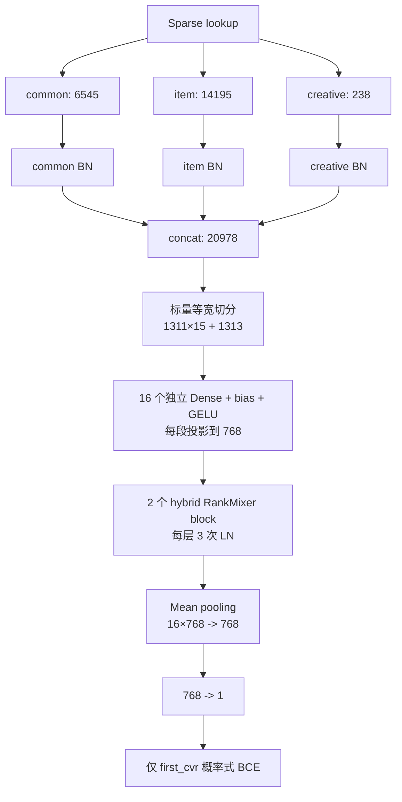
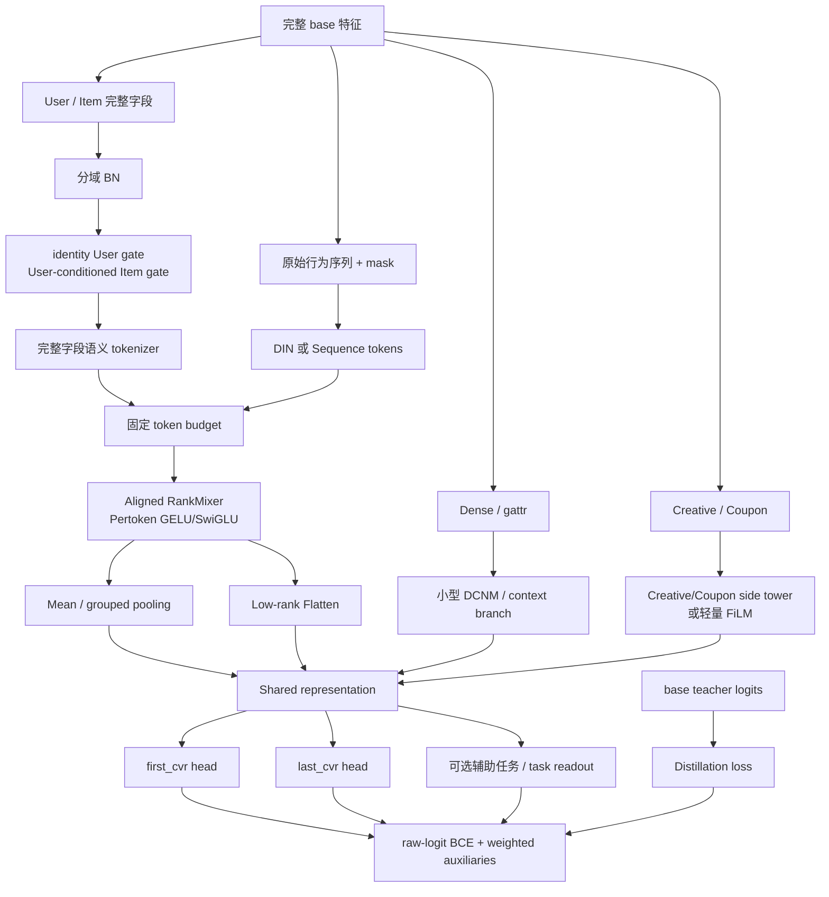

# CVR RankMixer v1 改进方案汇总与选型指南

> 按 RankMixer 模块分类的全量详细版：[CVR_RankMixer_全量改进方案_按模块分类.md](CVR_RankMixer_全量改进方案_按模块分类.md)<br>
> 目标：把现有源码分析、AUC 差距诊断、四套设计方案和 RankMixer 演进方法压缩成一份可快速选型的总览。<br>
> 对比基线：`code/cvr_bn_rankmixer_v1.py`。<br>
> 实验背景：base AUC 约 0.865，RankMixer v1 AUC 约 0.862；日训练约 5.5 亿、日测试约 1.1 亿、训练约 10 天。<br>
> 结论边界：下文“预期收益”是结构假设，不是 AUC 承诺；最终结论必须由同数据、同初始化条件的逐项消融给出。

---

## 1. 一页结论

当前 v1 的问题不是单一的“RankMixer block 不够强”，而是一次实验同时改变了输入、监督、初始化、
tokenizer、block 和 readout：

- base 使用 common/item/creative、dense、DIN、gattr、DCNM 和 first/last 双任务；
- v1 只把 common/item/creative 拼成 20978 维长向量；
- 长向量按 `[1311]×15+[1313]` 切成 16 段，所有内部边界都会切断 17 维字段；
- 每段用一次独立 `Dense + bias + GELU` 投影到 768 维；
- 两层 hybrid RankMixer 后只做 mean pooling，只训练 first_cvr；
- 约 167.3M dense 参数中，大部分新增 per-token FFN 很可能只能随机初始化，精确加载范围仍需服务器日志确认。

因此推荐顺序是：

1. **先对齐**：恢复 base 输入、last 辅助任务和公平热启，修复 loss/shape/fused 正确性；
2. **再改表示**：完整字段语义 token、条件 gate、Creative 侧塔和双读出；
3. **再改主干**：语义对齐 residual、等参数 SwiGLU、DCNM Global/late branch；
4. **再加序列与任务**：DIN、MixFormer 式深融合、Task Token、多任务；
5. **最后研究扩展**：Soft-to-Hard、RankUp、UniMixer、RankElastor、Sparse MoE。

最值得优先实现的不是最复杂方案，而是：

```text
RM-v2-Parity
= 完整 base 输入与 first/last 监督
+ 完整字段稳定 token
+ mean + low-rank flatten
+ Creative side tower
+ raw-logit BCE
```

它先回答“RankMixer 在公平条件下到底行不行”。在此基础上，再构建：

```text
RM-v3-Aligned
= RM-v2-Parity
+ identity-init User gate
+ User-conditioned Item gate
+ aligned-residual Pertoken SwiGLU
+ DIN / 小型 DCNM cross branch
+ base teacher distillation
```

---

## 2. v1 当前到底是什么结构

### 2.1 当前数据流



### 2.2 关键事实

| 维度 | v1 当前实现 | 直接后果 |
|---|---|---|
| 输入 | common/item/creative | dense、DIN、gattr 信息缺失 |
| Token 划分 | flatten 后按标量等宽切 16 段 | 切断字段并跨 common/item、item/creative 边界 |
| Token 投影 | 每段一层 `fully_connected + GELU` | 是单层非线性投影，不是两层 MLP |
| Token shape | `T=16, H=16, D=768` | 当前置换 shape 合法，但缺少显式 `T==H` 断言 |
| Block | mixing residual + 双 Post-LN，额外增加 FFN Pre-LN | 既非严格原版，也非成熟公司 block |
| PFFN | 每 token 独立 `768→3072→768` | 主干容量大，约 151.1M 参数 |
| Readout | mean only | token 身份、小域强信号易被平均 |
| 监督 | first_cvr only | 丢失 base 的 last_cvr 辅助正则 |
| Loss | sigmoid 后 `tf.losses.log_loss`，logit 先 clip | 数值稳定性和极端样本梯度不如 raw-logit BCE |
| 训练 | `grad_clip_value`、dropout、`use_rankmixer` 未真正生效 | 配置与实际图可能不一致 |
| 热启 | RM scope 为新增参数 | 与成熟 base checkpoint 的公平性存疑 |

### 2.3 为什么“一段 Dense+GELU”不是普通两层 MLP

第 $t$ 段执行：

$$
x_t=\mathrm{GELU}(z_tW_t+b_t),
\quad W_t\in\mathbb R^{d_t\times768},
\quad b_t\in\mathbb R^{768}.
$$

它只有一次仿射维度变化：

```text
[B,d_t] -> MatMul(W_t)+bias -> [B,768] -> GELU -> [B,768]
```

没有第二个 Dense、hidden bottleneck 或输出投影。因此严格名称是“带 GELU 的单层 Dense 投影”。
成熟 `commend_cvr.py::embedding_to_tokens()` 在原子操作上也只是一次 Dense+GELU；成熟方案的优势主要来自
**先按稳定业务语义分组**，而不是把投影层数从一层变成两层。

---

## 3. 全部改进方法地图

| 编号 | 方法 | 相对 v1 改变的层次 | 优先级 | 与其他方案关系 |
|---|---|---|---:|---|
| M0 | 公平对齐与正确性基线 | 输入、监督、loss、热启、断言 | P0 | 所有方案前置 |
| M1 | 完整字段稳定语义 token | Tokenizer | P0 | 主线必做 |
| M2 | 条件门控 | Tokenizer 前 | P1 | 可叠加 M1 |
| M3 | Creative/Coupon 侧塔或提前交互 | 小域特征路径 | P1 | 可叠加 M1/M2 |
| M4 | Mean + 低秩 Flatten/分组读出 | Readout | P1 | 可叠加全部主干 |
| M5 | 语义对齐 residual + 等参数 SwiGLU | RankMixer block | P1 | 三种 block 互斥比较 |
| M6 | 小型 DCNM Global Token/late branch | 显式特征交叉 | P1 | 两种接法互斥比较 |
| M7 | 恢复 DIN，再升级 MixFormer 式融合 | 序列交互 | P0→P2 | 逐级升级 |
| M8 | 多任务、Task Token、Pairwise、ESMM | 监督层 | P0→P2 | ESMM 有数据前提 |
| M9 | 热启动、蒸馏、分组学习率 | 优化层 | P0/P1 | 可叠加主线 |
| M10 | Soft-to-Hard 可学习分桶 | Tokenizer 研究线 | P2 | 与人工硬桶互斥比较 |
| M11 | RankUp 表示扩展 | Token 表示 | P2 | 在 M1 稳定后做 |
| M12 | UniMixer-Lite 可学习 mixing | Mixing | P3 | 替换固定 mixing |
| M13 | RankElastor full mixing + rank-aware FFN | Mixing/PFFN | P3 | 与 M12 重叠较大 |
| M14 | 参数压缩与 Sparse-Pertoken MoE | 容量/系统 | P2/P3 | 在 dense baseline 后做 |

这里的 P0/P1/P2/P3 分别表示：正确性前置、近期收益候选、中期研究、长期研究。

---

## 4. 推荐的整体结构

不要把全部方法一次性打开。下面是一个可逐层启用的“容器架构”，其中可选分支由配置开关控制。



### 4.1 Token budget 不变量

成熟公司结构使用 `11 User + 18 Item + 2 Sequence + 1 DIN = 32`。如果加入 Context、Global 或 Task Token，
必须做以下二选一：

1. 在固定 32 个 token 内重新分配语义组；
2. 同时修改 `T/H/D`，确保 `H=T` 且 `D % H == 0`。

不能只 append token 后继续 reshape 为 `[B,32,512]`，也不能让 `zip()` 静默丢字段。

### 4.2 总体伪代码

```python
parts = build_exact_base_inputs(features)  # user, item, creative, dense, gattr, sequence
parts = domain_norm(parts)

user = user * identity_gate(user)
item = item * identity_gate(concat([user, item]))

tokens = field_safe_semantic_tokenize(user, item, token_budget)
tokens += build_sequence_tokens(sequence, candidate, token_budget)
assert_token_contract(tokens, T, H, D)

h = aligned_rankmixer(tokens, block_variant, parameter_budget)
rm_repr = concat([
    grouped_or_mean_pool(h),
    low_rank_flatten(h),
])

cross_repr = optional_low_rank_dcn(dense, gattr, user, item)
creative_repr = creative_side_or_film(creative)
shared = fusion_head(rm_repr, cross_repr, creative_repr)

logits = build_task_heads(shared)
loss = raw_logit_multitask_loss(logits, labels)
loss += optional_distillation(logits, teacher_logits)
```

---

## 5. M0：公平对齐与正确性基线

| 问题 | 说明 |
|---|---|
| 相对 v1 改什么 | 恢复 dense、DIN、gattr、last_cvr；统一日期、采样、优化器和 checkpoint 条件；使用 raw-logit BCE；补 shape、字段覆盖和 fused parity 测试 |
| 为什么 | 当前 0.865 vs 0.862 同时改变了至少七项条件，不能归因 RankMixer backbone |
| 预期好处 | 找回被删输入与辅助监督的贡献；建立可解释的 backbone 对照；尽早发现静默建图错误 |
| 最常犯错误 | 一次恢复所有输入又同时改 block；base 热启、RM 冷启；只看最终 AUC 不看加载变量和收敛曲线 |

结构变化：

```text
v1:   [U,I,C] -> RM -> first
M0:   [U,I,C,Dense,DIN,gattr] -> RM/side -> first + 0.5*last
```

必做检查：

- base 与 RM 使用相同训练/测试日期、label delay、过滤和正例率；
- 记录每个 scope 的 loaded/random-init 参数量；
- assert 字段无遗漏、无重复，`T==H`、`D%H==0`；
- `sigmoid_cross_entropy_with_logits` 直接读取 raw logits；
- 真正执行 global-norm gradient clipping；
- fused/unfused forward、input gradient、各权重 gradient 和 checkpoint restore 一致。

---

## 6. M1：完整字段稳定语义 token

| 问题 | 说明 |
|---|---|
| 相对 v1 改什么 | 删除 `[1311]×15+[1313]` 标量切分；只沿完整 17 维字段轴分组；优先使用业务语义桶 |
| 为什么 | per-token FFN 需要 token 位置长期承担稳定职责；当前所有内部边界都切断字段，还跨域污染 |
| 预期好处 | 提高 token 可解释性和参数专门化；减少异构字段互相干扰；checkpoint schema 更稳定 |
| 最常犯错误 | 仍在 flatten 后切标量；每 batch 动态换桶；遗漏/重复字段；语义配置变更却复用旧 checkpoint |

结构变化：

```text
v1: concat 20978 scalars -> equal-width scalar slices -> 16 tokens
M1: field list -> versioned semantic groups -> per-group Dense+GELU -> T tokens
```

可选基线：

- 低风险：`5 User + 10 Item + 1 Creative = 16`；
- 工业增强：`5 User + 11 Item = 16`，Creative 走侧塔；
- 成熟大塔：`11 User + 18 Item + 2 Sequence + 1 DIN = 32`。

这里每组仍然可以只用一次 Dense+GELU。首轮不要额外增加两层 tokenizer MLP，否则无法区分“分桶正确”与“容量增加”。

---

## 7. M2：identity-init 条件门控

| 问题 | 说明 |
|---|---|
| 相对 v1 改什么 | Token 投影前增加 User self gate 和 User-conditioned Item gate |
| 为什么 | 同一 Item 字段对不同用户的重要性不同；v1 对所有样本使用同一静态投影 |
| 预期好处 | 动态选择当前用户相关的 Item 子空间；降低无关字段噪声；接近成熟公司 SENet 设计 |
| 最常犯错误 | 普通 sigmoid 零初始化后初始缩放为 0.5；gate 饱和；把动态 gate 误当成动态 token 归属 |

推荐：

$$
g_U=2\sigma(MLP_U(U)),\qquad
g_I=2\sigma(MLP_I([U,I])).
$$

最后一层 kernel/bias 零初始化，使初始 $g=1$。这样模型从恒等映射开始，而不是第一步就把 embedding 缩半。

需要监控 gate 的均值、分位数、接近 0/2 的比例和各域梯度；先比较无 gate、User gate、User+Item gate 三组。

---

## 8. M3：Creative/Coupon 侧塔或提前交互

| 问题 | 说明 |
|---|---|
| 相对 v1 改什么 | 不再让 238 维 Creative 混在包含 1075 维 Item 的最后 token；改为独立侧塔、正式 token 或 FiLM/gate |
| 为什么 | Creative 是小而强的候选域，mean pooling 和跨域长切片都容易稀释它 |
| 预期好处 | 保留创意局部强信号；减少大域压制；能控制在线增量成本 |
| 最常犯错误 | Creative 只在极晚层拼接导致交互不足；同时走 token 和 side tower 却不做消融；Wide insert 层号无效 |

推荐按成本递增比较：

1. `creative -> BN -> 128 side tower -> final fusion`；
2. Creative 生成 Item/token gate；
3. Creative 作为一个完整 token；
4. 每层后用轻量 FiLM 提前影响主干。

Coupon 同理，但只有当线上确实存在该字段与稳定标签时才接入。

---

## 9. M4：双读出、分组读出与 Task readout

| 问题 | 说明 |
|---|---|
| 相对 v1 改什么 | `mean only` 改成 mean/grouped pooling + low-rank flatten；可选 weighted/attention pooling 或只在读出层使用 Task Token |
| 为什么 | mean 对所有 token 等权，丢失 token 身份和小域峰值；完整 flatten 又会参数爆炸 |
| 预期好处 | mean 保留全局统计，低秩 flatten 保留坐标身份；不同任务可读取不同信息 |
| 最常犯错误 | 直接把 `[B,32,512]` 全量接大 MLP；把辅助 wide 分支增益误归主干；奇数层 mixed 坐标未经检查就 flatten |

推荐首轮：

```text
h [B,T,D]
├─ mean/grouped pool -> [B,D]
└─ flatten [B,T*D] -> low-rank Dense -> [B,256]
concat -> shared head
```

消融顺序：mean → mean+low-rank flatten → grouped pooling → weighted/attention pooling。不要第一轮就引入 attention。

---

## 10. M5：语义对齐 residual 与等参数 SwiGLU

### 10.1 四个需要严格区分的 block

| Block | 结构 | 定位 |
|---|---|---|
| v1 hybrid | `LN(PX+X)`，再 `LN(LN(S)->PFFN + S)` | 当前基线，每层 3 LN |
| 严格原版 | `LN(PX+X)`，再 `LN(PFFN(S)+S)` | 论文可归因基线 |
| 公司 aligned | `M=PX; M+SwiGLU(LN(M))`，末尾 Final LN | 同一 mixed 坐标内 residual |
| Mixing & Reverting | `P -> FFN -> P^-1 -> add X`，再 local FFN | 显式恢复原 token 坐标 |

| 问题 | 说明 |
|---|---|
| 相对 v1 改什么 | 删除未验证的额外 LN；或避免直接相加 `PX` 与 `X`；GELU PFFN 改 Pertoken SwiGLU、Pre-RMSNorm 和 small/zero-init down |
| 为什么 | shape 相同不代表 token 语义相同；SwiGLU 增强通道门控，但必须控制参数和初始化 |
| 预期好处 | 残差语义更清晰；深层训练更稳定；per-token 非线性容量更强 |
| 最常犯错误 | 只换 SwiGLU 却增参 50%；依赖奇偶层隐式 revert；zero-init 后误判首步 gate/up 无梯度；train/export 两条实现不一致 |

公平参数匹配：普通 GELU hidden 为 $4D$ 时，单 FFN SwiGLU hidden 约取 $8D/3$；如果一个
Mixing & Reverting block 有两次 SwiGLU，还要再次下调 hidden，使总 PFFN 参数与 v1 接近。

推荐实验顺序：v1 hybrid → strict original → company aligned → Mixing & Reverting；每一步固定输入、token、readout 和参数预算。

---

## 11. M6：小型 DCNM Global Token 或 late branch

| 问题 | 说明 |
|---|---|
| 相对 v1 改什么 | 恢复低秩显式交叉，但不一定恢复完整 base DCNM；输出作为 Global Token 或 late-fusion representation |
| 为什么 | v1 一次性删掉 base 的两层 DCNM；固定 token mixing 未必能在当前容量和训练窗内替代显式乘性交叉 |
| 预期好处 | 快速补回全局条件交叉；为局部 token 提供全局摘要；可测 DCNM 的真实边际贡献 |
| 最常犯错误 | 高维 DCNM 与 RM 同时无控制增参；同一输入重复走两条大塔；Global Token 占用 token budget 却不调整 T/H/D |

两个互斥接法：

```text
A. all inputs -> low-rank DCNM -> Global Token -> RankMixer
B. all inputs -> low-rank DCNM -> 256 -> late fusion with RM readout
```

建议先做 B：不改变 mixer token contract，更容易归因和回滚。若 B 有稳定收益，再试 A。

---

## 12. M7：恢复 DIN，再升级序列深融合

| 问题 | 说明 |
|---|---|
| 相对 v1 改什么 | 先恢复 base candidate-aware DIN；再拆短期/长期序列 token；最后每个 block 用 query 对原始序列做 Cross Attention |
| 为什么 | v1 lookup 了 sequence column，却没有把 sequence/DIN 表示送入主路径；CVR 对候选相关历史行为通常高度敏感 |
| 预期好处 | 恢复用户意图、购买阶段和候选匹配信号；深融合允许序列与 dense token 共同演化 |
| 最常犯错误 | sequence mask 错位；把未来行为或标签窗信息带入；没有原始 K/V 却伪造 MixFormer；candidate-dependent 用户塔破坏请求级复用 |

升级阶梯：

```text
S0: 无序列（当前 v1）
S1: base DIN -> late side
S2: DIN -> 1 token
S3: short/long -> 2 tokens + DIN
S4: 每层 Query Mixer + Cross Attention + Output Fusion
```

只有 S1/S2 已证明序列是主要增益来源，才值得承担 S4 的训练、显存和在线延迟成本。

---

## 13. M8：多任务、Task Token、Pairwise 与全空间建模

| 问题 | 说明 |
|---|---|
| 相对 v1 改什么 | first-only 改 first+last；可增加 no-refund 等可靠标签、Task Token、pairwise AUC loss；有全曝光链路时再试 ESMM |
| 为什么 | base 实际使用 first/last 联合监督；相关任务可正则共享表示；BCE 与 AUC 的优化目标并不完全一致 |
| 预期好处 | 提高样本效率和共享表示；Task Token 缓解任务冲突；小权重 pairwise 可能改善排序 |
| 最常犯错误 | 标签窗口/可观测性不一致；辅助权重过大产生负迁移；纯 pairwise 损害校准；无全曝光数据却套 ESMM |

第一步只恢复：

$$
\mathcal L=\mathcal L_{first}+\lambda_{last}\mathcal L_{last},
\quad \lambda_{last}\in\{0.1,0.2,0.5\}.
$$

随后再分别测试：

- Task Token 或 task-specific readout；
- `0.02-0.1` 小权重 query 内 pairwise softplus；
- 业务标签包含关系的 monotonic/consistency loss；
- 只有曝光→点击→转化定义完整时的 ESMM。

同时监控 AUC、LogLoss、COPC、ECE 和任务梯度 cosine，不能只追 AUC。

---

## 14. M9：公平热启、蒸馏与分组学习率

| 问题 | 说明 |
|---|---|
| 相对 v1 改什么 | 显式记录加载范围；选择等冷启或等成熟度热启；用 base teacher logits 蒸馏；新旧参数使用不同 LR |
| 为什么 | v1 约 167M 新 dense 参数可能以很小 LR 冷启，而 base 可复用已收敛 DCNM/MLP；固定 10 天会低估新大塔 |
| 预期好处 | 公平比较收敛；利用 base 已学知识缩短追平时间；保护成熟 sparse embedding |
| 最常犯错误 | skip/warm scope 写错；teacher 与 student 样本/标签定义不同；所有参数同 LR；只比相同天数不比相同样本/FLOPs |

建议：

```text
new tokenizer / RankMixer / head: 1.0 × lr_new
warm shared side tower:           0.2-0.5 × lr_new
warm sparse embeddings:           0.1 × lr_new 或保持 sparse optimizer
```

蒸馏从 `temperature ∈ {1,2}`、首日 `alpha=0.5` 逐渐降至 0.1 开始。teacher logits 最好离线写入，
避免训练时双模型前向。

---

## 15. M10：Soft-to-Hard 可学习语义分桶

| 问题 | 说明 |
|---|---|
| 相对 v1 改什么 | 不再人工固定每个字段所属 token；训练一个全局字段归属矩阵，soft 阶段学习后冻结并 hard 化 |
| 为什么 | 人工均分只保证字段完整，不保证语义相关；可学习分桶可能找到更适合 CVR 的字段组合 |
| 预期好处 | 自动发现跨业务域的有效组合；hard 化后仍可使用固定、高效的 per-token FFN |
| 最常犯错误 | 每样本动态分桶导致 token 身份漂移；所有字段塌缩到少数 token；soft 到 hard AUC 大跌；服务 schema 未版本化 |

必须加入负载均衡、assignment entropy 和字段覆盖约束。流程必须是：

```text
固定 field identity -> soft assignment 训练 -> 稳定性审计
-> argmax / capacity-aware hardening -> 冻结映射 -> 重新训练/微调
```

它是 M1 人工硬桶的替代研究线，不应和 M1 在同一次实验同时改变。

---

## 16. M11：RankUp 式表示扩展

| 问题 | 说明 |
|---|---|
| 相对 v1 改什么 | 固定随机完整字段分片、多 embedding、预训练 Cross Embedding、Global Token、Task Token |
| 为什么 | 增加 PFFN 参数不等于提高输入表示的有效秩；v1 的单份 embedding 和机械 token 相关性可能过高 |
| 预期好处 | 给大 backbone 更丰富、较低相关的输入子空间；增强用户-商品匹配和任务特异性 |
| 最常犯错误 | 在标量而非字段层随机；每 step 重新随机；多 embedding 参数爆炸；没有可靠预训练向量却制造 Cross Embedding |

推荐一次只加一个组件：

1. 3 个固定 seed 的完整字段 permutation；
2. Multi-Embedding；
3. `Proj(e_user_pre * e_item_pre)` Cross Token；
4. Global/Task Token。

同时看 token 相关性、effective rank、梯度和 AUC，不能只看总参数量。

---

## 17. M12：UniMixer-Lite 可学习 mixing

| 问题 | 说明 |
|---|---|
| 相对 v1 改什么 | 把固定无参置换 $P$ 替换为局部基 + 低秩全局矩阵，并用 Sinkhorn 约束成软置换 |
| 为什么 | 固定 mixing 对所有样本、层和任务都相同，可能限制更复杂的 token 交互 |
| 预期好处 | 在保持结构化效率的同时学习更合适的局部/全局交换模式 |
| 最常犯错误 | 输入/任务尚未对齐就归因 mixing；Sinkhorn 温度不稳；矩阵看似低秩但真实 kernel/通信成本很高 |

只有 M0/M1 和固定 mixing 基线已经稳定，且证据表明 mixing 是瓶颈后再做。验收必须包含吞吐、显存、
P95/P99 延迟和温度/矩阵可视化，而不只是 AUC。

---

## 18. M13：RankElastor 式 full mixing 与 rank-aware PFFN

| 问题 | 说明 |
|---|---|
| 相对 v1 改什么 | 用 Parameterized Full Mixing 允许更完整的坐标交互；用 GLU-improved PFFN 减少有效秩反复收缩 |
| 为什么 | v1 固定置换和扩张-收缩 FFN 可能产生表示秩振荡，容量没有转化为有效表示 |
| 预期好处 | 提高通道与 token 的交互覆盖；改善 effective-rank 动态 |
| 最常犯错误 | 直接复制论文私有任务配置；full mixing 成本不可服务；把 effective rank 上升等同于业务 AUC 上升 |

它与 UniMixer 都是在替换 fixed mixing，重叠很大。应先选一个研究，不应同时启用；并用相同参数、FLOPs、
训练预算比较 fixed mixing、UniMixer-Lite 和 full mixing。

---

## 19. M14：参数效率、Student 与 Sparse-Pertoken MoE

| 问题 | 说明 |
|---|---|
| 相对 v1 改什么 | 降 D/k、低秩分解、token-group shared base + adapter、Student 蒸馏，或每 token 使用稀疏专家 |
| 为什么 | v1 已约 167.3M，成熟 32×512×3 SwiGLU 主干更大；容量若无法训练/服务就没有实际价值 |
| 预期好处 | 在接近 AUC 下提高吞吐、降低显存和延迟；MoE 可提高训练容量而保持稀疏推理 |
| 最常犯错误 | 只算理论 FLOPs 不测 kernel；router 负载塌缩；专家通信抵消稀疏收益；Student 脚手架未闭环却宣称可用 |

建议优先级：

1. 参数匹配地降低 expansion；
2. low-rank flatten 和低秩 FFN；
3. group-shared base + token adapter；
4. 完整 Teacher→Student 蒸馏；
5. 系统支持成熟后再做 Sparse-Pertoken MoE。

---

## 20. 哪些能组合，哪些不能一起改

### 20.1 自然组合

```text
M0 公平基线
 -> M1 稳定语义 token
 -> M2 条件 gate
 -> M3 Creative side
 -> M4 双读出
 -> M5 aligned block
 -> M6/M7 显式交叉与序列
 -> M8 多任务
 -> M9 蒸馏
```

这些模块处于不同数据流层次，但仍应逐项打开。

### 20.2 互斥或高度重叠

| 选择组 | 为什么不能首轮一起改 |
|---|---|
| 人工硬桶 vs Soft-to-Hard vs RankUp 随机字段分片 | 都在改变字段到 token 的映射，无法归因 |
| strict original vs company aligned vs Mixing & Reverting | 都是 block 拓扑替代 |
| fixed mixing vs UniMixer-Lite vs RankElastor full mixing | 都在改变 token mixing |
| Global Token vs DCNM late branch | 都在验证显式全局交叉，先选低风险 late branch |
| mean+flat vs attention pooling vs Task Token readout | 都在改变输出信息通路 |
| dense PFFN vs Sparse MoE | 必须先有相同输入的 dense 基线 |

### 20.3 有条件才能使用

- ESMM：必须有全曝光数据和曝光→点击→转化链；
- Cross Embedding：必须有可靠、时间安全的预训练 user/item 表示；
- MixFormer 深融合：必须保留原始序列 K/V、mask，并核算在线复用；
- Sparse MoE：必须证明底层算子、通信和服务链真正支持稀疏执行。

---

## 21. 三个推荐候选

### 21.1 候选 A：RM-v2-Parity，先追回 base

```text
完整 base 输入 + first/last
-> 完整字段硬桶
-> strict RankMixer 或保留 v1 block 做单变量对照
-> mean + low-rank flatten
-> Creative side
-> raw-logit BCE
```

回答：输入、辅助监督和错误 tokenization 能解释多少 0.003 差距？

### 21.2 候选 B：RM-v3-Aligned，近期上限候选

```text
候选 A
+ identity User gate
+ User-conditioned Item gate
+ company-aligned、等参数 Pertoken SwiGLU
+ DIN token
+ 小型 DCNM late branch
+ base teacher distillation
```

回答：在公平输入下，成熟公司 RankMixer 思路能否稳定超过 base？

### 21.3 候选 C：RM-v4-Research，中长期研究

从候选 B 复制固定 checkpoint，分别开独立支线：

- C1：Mixing & Reverting；
- C2：MixFormer 深序列；
- C3：Soft-to-Hard 或 RankUp 表示扩展；
- C4：UniMixer-Lite 或 RankElastor；
- C5：Student / Sparse-Pertoken MoE。

每条支线只能替换一个核心假设。

---

## 22. 推荐实验阶梯

| 阶段 | 唯一主要变化 | 目的 |
|---|---|---|
| E0 | 原样复现 base 与 v1 | 固定 0.865/0.862 参考与方差 |
| E1 | v1 恢复 dense | dense 边际贡献 |
| E2 | E1 恢复 DIN | 候选相关序列贡献 |
| E3 | E2 恢复 gattr | 全局属性贡献 |
| E4 | E3 恢复 last loss | 辅助监督贡献 |
| E5 | E4 改完整字段 hard tokenizer | 错误标量切分损失 |
| E6 | E5 + Creative side | 小域隔离收益 |
| E7 | E6 + identity gates | 动态字段选择收益 |
| E8 | E7 + low-rank flatten | token 身份读出收益 |
| E9 | 固定 E8 比较四种 block | 拓扑与激活归因 |
| E10 | 最佳 block + DCNM late | 显式交叉边际 |
| E11 | E10 + distillation | 收敛与迁移收益 |
| E12 | E11 + 多任务/Task readout | 监督增强收益 |
| E13+ | Soft-to-Hard、RankUp、UniMixer 等独立支线 | 中长期上限 |

日样本量很大，可采用：1k-step 图验证 → 固定 1-2 日小窗 → 5 日中窗 → 最佳 1-2 个跑完整 10 日 →
另一时间窗复测。大模型首日收敛慢，淘汰时要同时看相同样本、FLOPs 和 wall-clock 曲线。

---

## 23. 每个实验必须防止的错误

### 23.1 数据与标签

- 日期、过滤、采样、label delay 不一致；
- sequence 或 dense 特征含未来信息；
- first/last/no-refund 标签窗口和 head 名称映射错误；
- ESMM 使用的不是全曝光样本。

### 23.2 Shape 与字段

- flatten 后按标量切分；
- 字段遗漏、重复或跨 schema version 复用 checkpoint；
- append Global/Task/Sequence token 后总数不等于 T；
- `H!=T` 却仍做 mixing residual；
- `D%H!=0`；
- `zip()` 长度不一致后静默截断；
- DIN 关闭时空 `concat`。

### 23.3 优化与初始化

- base 热启、RM 冷启；
- down zero-init 后只看第一步 gate/up gradient；
- gate 初始为 0.5 而非 1；
- 新主干 LR 太小，10 天仍未进入平台期；
- loss 前 clip logits；
- 配置了 gradient clipping 但没有真正 apply。

### 23.4 归因与指标

- 同时改输入、token、block、任务和参数量；
- SwiGLU 增参后把收益全归激活函数；
- 只看 AUC，不看 LogLoss/COPC/ECE；
- 只看总体，不看冷启动、长尾、行为长度等切片；
- 用论文私有数据增益承诺当前业务收益；
- 只算参数/FLOPs，不测 samples/s、显存和 P95/P99。

---

## 24. 最小验收清单

### 正确性

- [ ] 每个字段恰好进入一个预期桶；
- [ ] token 数、宽度、head 数和 residual 坐标断言通过；
- [ ] fused/unfused forward、gradient、restore parity 通过；
- [ ] raw-logit loss 与预测 sigmoid 分离；
- [ ] checkpoint 加载和随机初始化范围可审计。

### 效果

- [ ] first AUC/GAUC、PR-AUC、LogLoss、COPC、ECE 全部报告；
- [ ] paired bootstrap 或多 seed 方向一致；
- [ ] 关键用户、Item、Creative、序列长度切片无系统性退化；
- [ ] 至少两个不重叠日期窗复测。

### 成本

- [ ] trainable dense params、FLOPs、samples/s、peak memory；
- [ ] checkpoint 大小与恢复时长；
- [ ] serving P50/P95/P99；
- [ ] 新增序列、gate、mixer 或 MoE 的真实 kernel/通信成本。

---

## 25. 源码落点

| 改进 | 主要位置 |
|---|---|
| M0 输入/任务对齐 | `cvr_bn_rankmixer_v1.py:380-462,889-930`；参考 `cvr_fst_last_norpy.py:481-538,917-1141` |
| M1 tokenizer | `cvr_bn_rankmixer_v1.py:774-799,938-962` |
| M2 gate | 参考 `commend_cvr.py:2243-2323` |
| M3/M4 side 与双读出 | 参考 `commend_cvr.py:2507-2564` |
| M5 block | `cvr_bn_rankmixer_v1.py:801-862`；参考 `mlp_mixer_swiglu_fuse.py:137-304,339-386` |
| M6 DCNM | 参考 `cvr_fst_last_norpy.py:772-817` |
| M7 DIN/sequence | 参考 `cvr_fst_last_norpy.py:917-962`、`commend_cvr.py:2370-2500` |
| M8 多任务 | 参考 `cvr_fst_last_norpy.py:481-538`、`commend_cvr.py:1414+` |
| M9 warm/distill | `set-xcal.txt:168-191` 与两模型 warmup scope |
| M10-M14 | 建议新增独立 scope，不覆盖现有 fused checkpoint scope |

推荐新 scope：

```text
tokenizer_field_safe_v1/
rankmixer_strict_v1/
rankmixer_aligned_swiglu_v1/
readout_dual_v1/
cross_branch_v1/
multitask_head_v1/
```

---

## 26. 延伸文档

- AUC 差距与七套详细路线：[CVR_RankMixer_v1_AUC差距诊断与改进路线.md](CVR_RankMixer_v1_AUC差距诊断与改进路线.md)
- 四套输入/监督方案与完整伪代码：[CVR_RankMixer_四套改进方案设计.md](CVR_RankMixer_四套改进方案设计.md)
- 成熟公司源码与 SwiGLU 严格对比：[CVR_RankMixer_SwiGLU_源码分析与原版对比.md](CVR_RankMixer_SwiGLU_源码分析与原版对比.md)
- RankMixer 及演进论文调研：[RankMixer及其演进方法详细调研.md](RankMixer及其演进方法详细调研.md)
- RankMixer 原论文详解：[RankMixer_论文详解.md](RankMixer_论文详解.md)

最终原则只有两条：

1. **先让比较公平且 token 语义正确，再讨论更强 mixer。**
2. **每次只替换一个核心假设，并同时报告效果、校准、收敛和系统成本。**
