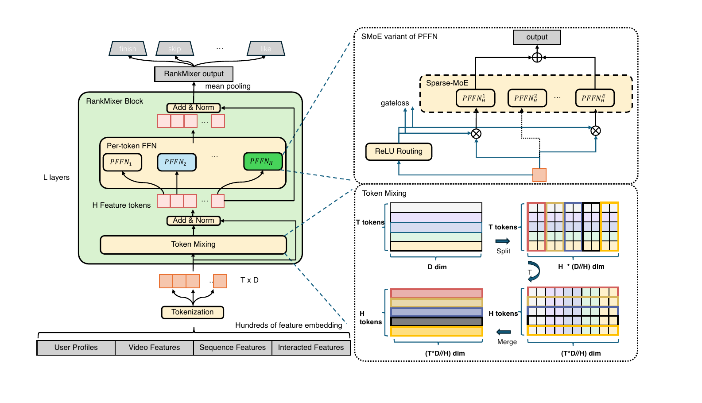
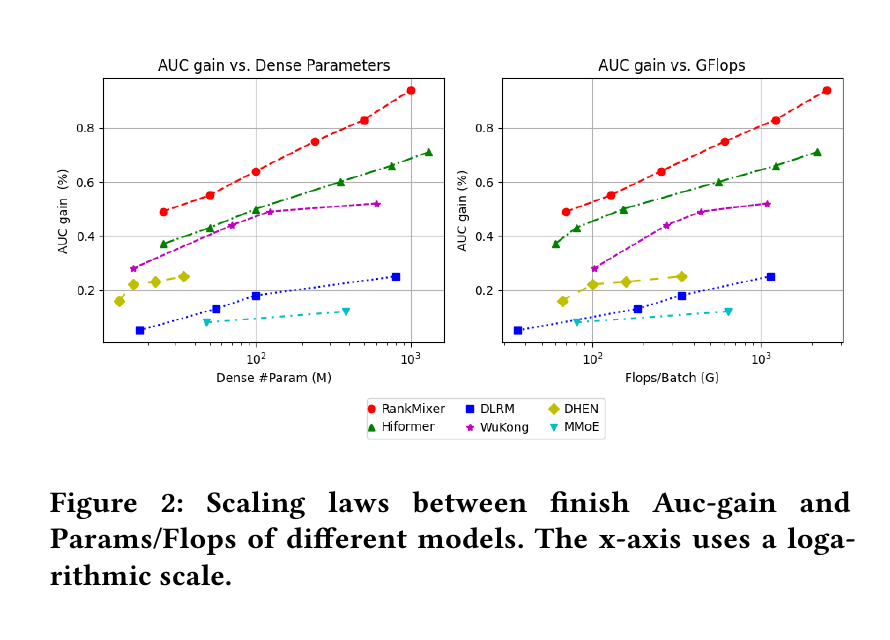
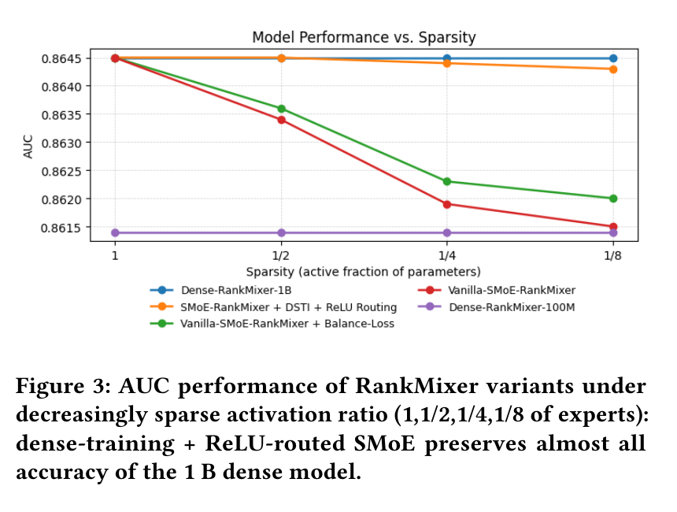
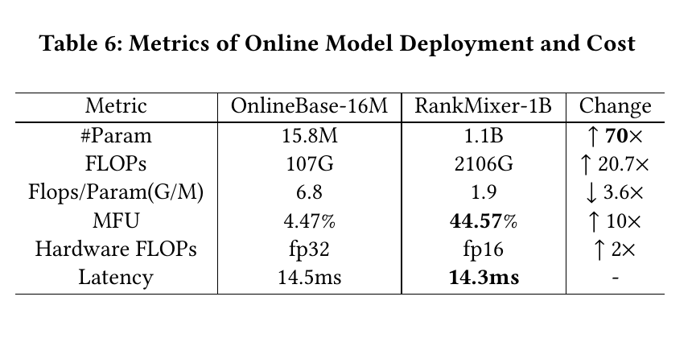

# RankMixer 论文详解

> 原文：[RankMixer: Scaling Up Ranking Models in Industrial Recommenders](./RankMixer.pdf)
>
> 阅读版本：arXiv:2507.15551v3，2025-07-26（PDF 页脚标识）
>
> 图片：本文中的图 1、图 2、图 3 和表 6 均由仓库内原 PDF 对应页面高分辨率裁剪而来，没有使用外部图片。

## 0. 阅读约定

为避免把论文结论与本文解读混在一起，下文使用两种标记：

- **[论文事实]**：PDF 明确给出的方法、公式、数字或作者观点。
- **[本文解读]**：基于公开公式和实验现象做的工程化归纳或推断，不等同于论文已经验证。
- **[边界说明]**：对 PDF 未披露的细节、实验口径或无法由原文外推之处做的明确限定。

## 1. 一句话讲清这篇论文

RankMixer 将工业推荐排序中“几百个异质特征如何交互”的问题，改写为“先用无参数的 Multi-head Token Mixing 重组各特征子空间，再让每个 token 走自己的 FFN”；这样既能跨 token 交互，又能大量增加参数而不同比增加计算量，并将运算集中到 GPU 擅长的大矩阵乘上。

## 2. 论文身份与贡献边界

**[论文事实]**

- 题目：*RankMixer: Scaling Up Ranking Models in Industrial Recommenders*。
- 作者：Jie Zhu、Zhifang Fan、Xiaoxie Zhu、Yuchen Jiang、Hangyu Wang、Xintian Han、Haoran Ding、Xinmin Wang、Wenlin Zhao、Zhen Gong、Huizhi Yang、Zheng Chai、Zhe Chen、Yuchao Zheng、Qiwei Chen、Feng Zhang、Xun Zhou、Peng Xu、Xiao Yang、Di Wu、Zuotao Liu，均来自 ByteDance。
- 研究对象是工业推荐的排序模型，不是召回模型，也不是纯序列生成式推荐。
- 论文主要贡献是 RankMixer 骨干、Sparse-MoE 扩展，以及在抖音 Feed 排序和广告排序上的离线/在线验证。
- PDF 仍保留了“Conference acronym 'XX, June 03-05, 2018, Woodstock, NY”等模板占位文字，因此应将其视为 arXiv 预印本，不应从这份 PDF 推断已被某个会议录用。

## 3. 它要解决什么问题

### 3.1 “模型更大”不等于“排序更好”

**[论文事实]** 工业 DLRM 同时处理数值特征、ID 特征、用户行为序列、用户-物品交叉特征等几百个 field。早期扩展方法只加宽或堆叠 MLP/特征交互层，增益可能很小，甚至为负。论文认为，原因不只是参数数量，还在于结构没有匹配推荐数据的异质特征空间。

### 3.2 CPU 时代的交互结构不适合现代 GPU

**[论文事实]** 传统线上排序模型常将 DCN、FM、Attention、多路 MLP 等异构模块组合起来。其中很多操作在 GPU 上是 memory-bound，难以形成大规模并行矩阵乘，结果是 MFU（Model FLOPs Utilization）只有个位数百分比。线上系统又有极高 QPS 和严格延迟上限，所以不能照搬 LLM 的“加层+加 Attention”思路。

### 3.3 Self-Attention 在异质特征上不是必然的最优解

**[论文事实]** 作者的核心判断是：NLP token 通常处在统一语义嵌入空间，而推荐的用户 ID、视频 ID、统计量、序列特征属于不同语义空间，ID 域甚至可有数亿取值。用 token 内积估计这些空间间的“相似度”并不容易；同时，Attention 权重矩阵带来额外 FLOPs、显存和 Memory I/O。

## 4. 总体架构：数据如何流过 RankMixer

*图 1：原论文 Figure 1 的架构主体。左侧是完整 RankMixer block；右下是 Token Mixing 的 split/merge；右上是 PFFN 的 Sparse-MoE 变体。*

**[论文事实]** 整个数据流可以拆成 6 步：

1. 数值、ID、序列模块输出、交叉特征等先各自变成 embedding。
2. 根据业务语义将特征分组，同类 embedding 拼接后再切成固定长度片段，投影成 $T$ 个 $D$ 维 feature token。
3. 无参数 Multi-head Token Mixing 将每个 token 的子片段与其他 token 重组，得到新的 $T$ 个 token。
4. 添加残差连接并做 LayerNorm。
5. 第 $t$ 个 token 仅进入属于它自己的第 $t$ 个 FFN，然后再做残差与 LayerNorm。这一 FFN 也可换成 Sparse-MoE。
6. 重复 $L$ 个 block，对最后一层所有 token 做 mean pooling，得到统一表示，再接 finish、skip、like 等不同任务头。

用公式表示，第 $n$ 个 block 为（原文式 1）：

$$
S^{n-1}=\operatorname{LN}(\operatorname{TokenMixing}(X^{n-1})+X^{n-1}),
$$

$$
X^n=\operatorname{LN}(\operatorname{PFFN}(S^{n-1})+S^{n-1}),
$$

其中 $X^n\in\mathbb{R}^{T\times D}$。最后的 $X^L$ 经均值池化得到排序任务的公共表示。

## 5. 输入层：为什么不是“一个 field 一个 token”

**[论文事实]** 论文认为 token 数量存在两端风险：

- 几百个特征各占一个 token：单 token 可分到的参数和计算过少，重要特征建模不充分，小矩阵也难以吃满 GPU。
- 只有一个或很少 token：模型退化成普通 DNN，异质特征空间无法分开，高频强信号容易压过长尾信号。

作者采用**基于领域知识的语义分组**：先将语义接近的 $N$ 组 embedding 依次拼接，

$$
e_{\text{input}}=[e_1;e_2;\ldots;e_N],
$$

再每隔固定长度 $d$ 切片并投影到 $D$ 维（原文式 2）：

$$
x_i=\operatorname{Proj}\!\left(e_{\text{input}}[d(i-1):di]\right),\quad i=1,\ldots,T.
$$

**[本文解读]** 这一步其实将“业务上怎么划分特征子空间”变成了模型的结构先验。它比完全自动的 Attention 更便宜，但也意味着 token 分组需要跟随特征新增、业务迁移和数据分布漂移而维护。

## 6. 核心机制一：Multi-head Token Mixing

设第 $t$ 个输入 token 为 $x_t\in\mathbb{R}^D$。先沿隐藏维将它均分为 $H$ 个 head（原文式 3）：

$$
[x_t^{(1)}\Vert x_t^{(2)}\Vert\cdots\Vert x_t^{(H)}]
=\operatorname{SplitHead}(x_t),
$$

每个 $x_t^{(h)}\in\mathbb{R}^{D/H}$。随后不在同一 token 内重新拼回去，而是收集**所有 token 的第 $h$ 个 head**（原文式 4）：

$$
s^h=\operatorname{Concat}(x_1^{(h)},x_2^{(h)},\ldots,x_T^{(h)}).
$$

因而 $s^h\in\mathbb{R}^{TD/H}$，全部输出为 $S\in\mathbb{R}^{H\times TD/H}$。论文设置 $H=T$，此时 $s^h\in\mathbb{R}^{D}$，输出仍是 $T\times D$，可以直接与输入做残差（原文式 5）：

$$
(s_1,\ldots,s_T)=\operatorname{LN}\left(
\operatorname{TokenMixing}(x_1,\ldots,x_T)+(x_1,\ldots,x_T)
\right).
$$

> **直观例子**：若 $T=H=4$，每个 8 维 token 分成 4 个 2 维 head，那么新 token 1 由原来 4 个 token 的“第 1 个 2 维片段”拼成；新 token 2 由它们的第 2 个片段拼成，以此类推。它本质上是 reshape + transpose + reshape，没有 $QK^\top$ 和 softmax。

**[论文事实]** 作者强调该模块无参数，在推荐特征上比 Self-Attention 有更好的性能/效率折中，且避免 Attention 权重矩阵。

**[本文解读]** Token Mixing 自身只做 $TD$ 个元素的重排，算术复杂度可看作 $O(TD)$；它仍可能受内存布局和 transpose 实现影响，因此“无参数”不等于“零成本”。论文没有单独报告该算子的微基准延迟。

## 7. 核心机制二：Per-token FFN（PFFN）

普通 Transformer 让所有 token 共享同一个 FFN。RankMixer 则给第 $t$ 个 token 一套独立参数（原文式 6-7）：

$$
v_t=f_{\mathrm{pffn}}^{t,2}\left(
\operatorname{GELU}\left(f_{\mathrm{pffn}}^{t,1}(s_t)\right)
\right),
$$

$$
f_{\mathrm{pffn}}^{t,i}(x)=xW_{\mathrm{pffn}}^{t,i}+b_{\mathrm{pffn}}^{t,i}.
$$

其中：

- $W^{t,1}\in\mathbb{R}^{D\times kD}$，$b^{t,1}\in\mathbb{R}^{kD}$；
- $W^{t,2}\in\mathbb{R}^{kD\times D}$，$b^{t,2}\in\mathbb{R}^{D}$；
- $k$ 是 FFN 中间层扩展倍数。

### 7.1 为什么“参数变多”但“计算量不同比变多”

共享 FFN 有约 $2kD^2$ 参数，但要被 $T$ 个 token 各调用一次；PFFN 有 $T$ 套参数，共约 $2kTD^2$，但每套只服务一个 token。因此两者处理 $T$ 个 token 时的主要乘加量处在同一数量级，但 PFFN 拥有约 $T$ 倍 FFN 参数容量。

**[论文事实]** 作者认为这种参数隔离能防止高频特征主导统一交互模块，同时保留不同特征子空间的独立建模能力。

### 7.2 PFFN 与 MMoE/普通 MoE 的区别

- MMoE 的多个 expert 看到的是同一份全局输入，用于学习不同专家函数。
- PFFN 的第 $t$ 套网络只看第 $t$ 个 token，即“输入子空间”和“参数子空间”同时被分开。
- RankMixer 中的 Sparse-MoE 是再把**每个 PFFN**扩展为多专家版本，因此专家总数可能很快膨胀，这正是作者需要处理 expert under-training 的原因。

## 8. 核心机制三：Sparse-MoE、ReLU Routing 与 DTSI

### 8.1 Vanilla Top-k 路由的两个问题

**[论文事实]**

1. **固定 $k$ 不区分 token 的信息量**：低信息 token 可能浪费 expert 预算，高信息 token 反而不够用。
2. **expert 训练不足**：PFFN 已经按 token 分开，再给每个 token 放多个不共享 expert，会导致路由不平衡、低频 expert 缺少梯度，甚至成为“死专家”。

### 8.2 ReLU Routing：让每个 token 自己决定激活几个 expert

对第 $i$ 个 token $s_i$、其第 $j$ 个 expert $e_{i,j}$ 和 router $h$，原文式 10 为：

$$
G_{i,j}=\left[\operatorname{ReLU}(h(s_i))\right]_j,\qquad
v_i=\sum_{j=1}^{N_e}G_{i,j}e_{i,j}(s_i).
$$

与 Top-k + softmax 相比，ReLU 输出为 0 的 expert 自然不激活，正值 expert 数量不必固定。稀疏程度由 $L_1$ 式正则引导（原文式 11）：

$$
\mathcal{L}=\mathcal{L}_{\text{task}}+\lambda\mathcal{L}_{\text{reg}},
\qquad
\mathcal{L}_{\text{reg}}=\sum_{i=1}^{N_t}\sum_{j=1}^{N_e}G_{i,j}.
$$

**[论文事实]** 论文称采用 adaptive $\ell_1$ penalty，并用系数 $\lambda$ 使平均激活 expert 比例贴近预算。**[边界说明]** PDF 没有给出 $\lambda$ 的更新规则、预算控制器伪代码或具体超参数，因此不宜进一步猜测“adaptive”的实现细节。

### 8.3 Dense-training / Sparse-inference（DTSI-MoE）

**[论文事实]** 训练时同时使用 $h_{\text{train}}$ 和 $h_{\text{infer}}$ 两个 router，$\mathcal{L}_{\text{reg}}$ 只加在 $h_{\text{infer}}$ 上，两者都在训练时更新；推理时只用 $h_{\text{infer}}$。作者给出的目标是：训练期让更多 expert 获得梯度，推理期再用稀疏路由降成本。

**[边界说明]** PDF 对 DTSI 只有一段描述，没有说清两个 router 输出如何合并、dense 路径是否每步激活全部 expert，也没有提供完整伪代码。因此本文不对这些实现细节做额外猜测。

## 9. 参数、FLOPs 与扩展方向

对全稠密版，原文式 12 给出 $L$ 层的近似量：

$$
\#\mathrm{Param}\approx 2kLTD^2,
\qquad
\mathrm{FLOPs}\approx 4kLTD^2.
$$

这里主要统计 PFFN 的两个线性层；系数 4 对应乘法和加法都按一次 FLOP 计。可扩展轴有：

- token 数 $T$；
- 宽度 $D$；
- 层数 $L$；
- Sparse-MoE expert 数 $E$。

对 Sparse-MoE，原文定义稀疏比 $s=\#\mathrm{Activated\ Param}/\#\mathrm{Total\ Param}$，有效计算会随激活比例而下降。

**[本文解读]**

- Token Mixing 取代了 Attention 的 $T\times T$ 权重矩阵，因此不存在该部分的 $O(T^2)$ 存储/计算增长；整个 block 主成本变成 $O(kTD^2)$ 的 PFFN 矩阵乘。这一大 O 比较是从公式推导，不是论文额外报告的基准。
- 增大 $D$ 会使参数/FLOPs 按平方增长，但也会制造更大 GEMM，更容易提高 GPU MFU。论文正是因此在相近质量下偏好“加宽”而不是一味“加深”。

## 10. 离线实验

### 10.1 数据、任务与训练环境

**[论文事实]**

| 项目 | 论文披露 |
|---|---|
| 数据来源 | 抖音推荐系统线上日志与用户反馈标签 |
| 规模 | 每日万亿（trillions）级记录，实验使用两周数据 |
| 特征 | 300+ 个数值、ID、交叉、序列特征；数十亿用户 ID，数亿视频 ID |
| 预测任务 | Finish 与 Skip；分别报告 AUC 和用户粒度 UAUC |
| 效率指标 | 稠密参数数（不含稀疏 embedding）、每 batch=512 的训练 FLOPs、MFU |
| 训练 | 数百张 GPU；稀疏部分异步更新，稠密部分同步更新 |
| 优化器 | 稠密部分 RMSProp，learning rate=0.01；稀疏部分 Adagrad |
| 显著性口径 | 论文称 AUC 增加 0.0001 可视为可信的显著改善 |

### 10.2 与主要 baseline 的比较

下表复述原文 Table 1 的关键行。增益按原表的百分比口径保留，不自行换算成绝对 AUC：

| 模型 | Finish AUC | Finish UAUC | Skip AUC | Skip UAUC | 稠密参数 | FLOPs/batch |
|---|---:|---:|---:|---:|---:|---:|
| DLRM-MLP base | 0.8554 | 0.8270 | 0.8124 | 0.7294 | 8.7M | 52G |
| DLRM-MLP-100M | +0.15% | - | +0.15% | - | 95M | 185G |
| DCNv2 | +0.13% | +0.13% | +0.15% | +0.26% | 22M | 170G |
| DHEN | +0.18% | +0.26% | +0.36% | +0.52% | 22M | 158G |
| HiFormer | +0.48% | - | - | - | 116M | 326G |
| Wukong | +0.29% | +0.29% | +0.49% | +0.65% | 122M | 442G |
| **RankMixer-100M** | **+0.64%** | **+0.72%** | **+0.86%** | **+1.33%** | 107M | 233G |
| **RankMixer-1B** | **+0.95%** | **+1.22%** | **+1.25%** | **+1.82%** | 1.1B | 2.1T |

**[论文事实]** 约 100M 参数时，RankMixer 在四个 AUC/UAUC 指标都高于表中对手。它的 233G FLOPs 高于 DHEN 和 DCNv2，但低于 HiFormer 的 326G 与 Wukong 的 442G。因此更准确的表述是“更好的效果-计算折中”，而不是“所有情况 FLOPs 最少”。

### 10.3 Scaling law 现象

*图 2：原论文 Figure 2。左图横轴为稠密参数量，右图横轴为每 batch FLOPs；两者均为对数坐标，纵轴为 Finish AUC gain。*

**[论文事实]** 在作者的数据点上，RankMixer 对参数和 FLOPs 都呈现最陡的性能增长曲线。Wukong 的参数曲线也较陡，但计算量上升更快，所以在 AUC-FLOPs 图上落后更明显。

论文还报告，对 RankMixer 分别增加 $D$、$T$、$L$时，质量主要与总参数相关，不同扩展方向得到的性能近似。考虑到大宽度会形成更大矩阵乘、MFU 更高，作者最终使用：

- RankMixer-100M：$D=768,T=16,L=2$；
- RankMixer-1B：$D=1536,T=32,L=2$。

**[边界说明]** 图中是单一内部数据分布上的经验曲线，论文没有拟合幂律指数、给出置信区间，也没有证明该曲线能外推到其他业务或更大规模。这里的“scaling law”应理解为工业经验规律，而不是已被严格确定的普适定律。

### 10.4 消融实验：哪个组件真正有用

原文 Table 2 在 RankMixer-100M 上报告：

| 改动 | $\Delta$AUC |
|---|---:|
| 去掉残差连接 | -0.07% |
| 去掉 Multi-head Token Mixing | **-0.50%** |
| 去掉 LayerNorm | -0.05% |
| Per-token FFN 换成共享 FFN | **-0.31%** |

这说明最关键的两个设计正是“跨 token 信息交换”和“按 token 隔离参数”。

原文 Table 3 将 Multi-head Token Mixing 替换为其他 Token-to-FFN 路由：

| 路由方式 | $\Delta$AUC | $\Delta$Params | $\Delta$FLOPs |
|---|---:|---:|---:|
| All-Concat-MLP | -0.18% | 0.0% | 0.0% |
| All-Share | -0.25% | 0.0% | 0.0% |
| Self-Attention | -0.03% | +16% | **+71.8%** |

Self-Attention 只少 0.03% AUC，但多 16% 参数和 71.8% FLOPs，这是作者选择无参数 mixing 的直接实验依据。

### 10.5 Sparse-MoE 扩展与专家平衡

*图 3：原论文 Figure 3。激活比例从 1 降到 1/8 时，DTSI + ReLU Routing 曲线仍接近 Dense-RankMixer-1B；普通 SMoE 与只加 balance loss 的版本明显下降。*

**[论文事实]** 作者声称，DTSI + ReLU Routing 在激活专家比例降至 1/8 时仍几乎保留 1B 稠密模型的 AUC，并带来约 50% 的 throughput 改善。相比之下，Vanilla SMoE 随稀疏度增加而单调退化；加 load-balancing loss 能缓解但不如 DTSI + ReLU。

原文 Figure 4 还展示了不同 token/层的 expert 激活比例随训练动态变化，用以说明 ReLU Routing 确实给不同 token 分配不同 expert 数量，而不是所有 token 套用固定 $k$。

## 11. 线上部署：70 倍参数为什么没有让延迟爆炸

*表 6：原论文 Table 6。参数增至 70 倍、FLOPs 增至 20.7 倍，但 MFU、半精度和更低 FLOPs/Param 共同抵消了成本，端到端延迟近似不变。*

论文将延迟拆解成一个概念性比例式：

$$
\mathrm{Latency}
=\frac{\#\mathrm{Param}\times \mathrm{FLOPs/Param}}
{\mathrm{MFU}\times \mathrm{Theoretical\ Hardware\ FLOPs}}.
$$

从表 6 可看到四个杠杆：

1. **参数/FLOPs 解耦**：参数从 15.8M 到 1.1B（$70\times$），FLOPs 只从 107G 到 2106G（$20.7\times$）；FLOPs/Param 从 6.8 降到 1.9，降低 $3.6\times$。
2. **提高 MFU**：更大 GEMM、友好的并行拓扑，以及将并行 PFFN 融合到一个 kernel，使 MFU 从 4.47% 升到 44.57%，接近 $10\times$。
3. **半精度推理**：从 fp32 到 fp16，论文按理论峰值计为硬件 FLOPs $2\times$。RankMixer 的主计算是大矩阵乘，适合半精度。
4. **结果**：线上延迟从 14.5 ms 变为 14.3 ms，基本持平。

**[本文解读]** 这个延迟公式是理想化的主导项分解，不包含排队、特征读取、embedding 查表、通信、kernel launch 等所有实际项。表 6 是字节跳动自有软硬件栈上的端到端结果，不代表在任意 GPU、batch 和 QPS 下都能复制 14.3 ms。

## 12. 线上 A/B 测试结果

### 12.1 Feed 推荐

**[论文事实]** 原文 Table 4 称所有改善都具有统计显著性，并报告了长期观察/反向 A/B 实验；页 8 写明观察期为 8 个月，脚注称结果在 2025-07-24 更新，增益尚未饱和。

| 应用/人群 | Active Day | Duration | Like | Finish | Comment |
|---|---:|---:|---:|---:|---:|
| 抖音 Overall | +0.2908% | +1.0836% | +2.3852% | +1.9874% | +0.7886% |
| 抖音 Low-active | +1.7412% | +3.6434% | +8.1641% | +4.5393% | +2.9368% |
| 抖音 Middle-active | +0.7081% | +1.5269% | +2.5823% | +2.5062% | +1.2266% |
| 抖音 High-active | +0.1445% | +0.6259% | +1.8280% | +1.4939% | +0.4151% |
| 抖音极速版 Overall | +0.1968% | +0.9869% | +1.1318% | +2.0744% | +1.1338% |

低活用户在抖音主 App 上的增益最大，作者将其解释为模型具有较好的泛化能力。

### 12.2 广告排序

**[论文事实]** RankMixer-1B 在广告业务上相比原 16M DLRM+DCN 稠密部分，$\Delta$AUC 为 **+0.73%**，ADVV（Advertiser Value）为 **+3.90%**。

### 12.3 数字表述中需要注意的地方

- 摘要用“两个数量级”概括参数扩展，引言也有“over 100x”的表述，但线上部署 Table 6 的可核对数字是 **15.8M -> 1.1B = 70x**。阅读时应以明确对比口径为准。
- 论文称覆盖“three personalised-ranking application”，而其叙述对象可理解为抖音 Feed、抖音极速版 Feed 和广告；PDF 没有单独给出“第三类”模型的更多定义。

## 13. 与相关方法的关键区别

| 方法 | 特征交互方式 | 扩参特点 | RankMixer 对其的核心区别 |
|---|---|---|---|
| DLRM-MLP | 拼接后共享 MLP | 加宽/加深 | RankMixer 保留多个特征子空间，用 PFFN 按 token 隔离参数 |
| DCN/DCNv2 | 显式交叉层 | 交叉阶数/低秩结构 | RankMixer 不倚赖特定交叉算子，更偏向统一大 GEMM 骨干 |
| AutoInt/HiFormer | Self-Attention 学 token 间权重 | Attention 层/宽度 | RankMixer 使用无参数重排，不构造 $T\times T$ 权重矩阵 |
| DHEN | 堆叠 DCN/Attention/FM/LR 等异构 block | 增加模块数 | RankMixer 追求单一、硬件友好的可重复 block |
| Wukong | FMB + LCB 的层叠交互 | 参数曲线较陡，但 FLOPs 增长快 | RankMixer 在原文数据上有更好的 AUC-FLOPs 曲线 |
| Transformer FFN | 所有 token 共享一个 FFN | 参数不随 token 数增长 | PFFN 每 token 一套 FFN，在相近主要计算量下提高参数容量 |
| MMoE | 多 expert 处理同一全局输入 | 按 expert 扩展 | RankMixer PFFN 先按 token 分输入和参数，然后才可在每 token 内做 Sparse-MoE |

## 14. 局限性与可复现性缺口

以下除明确标注为作者声称外，均是**[本文解读]**：

1. **数据不公开**：全部核心结果来自抖音内部万亿级数据，外部无法使用同一数据精确复现；论文也没有公开数据切分方式、负采样策略、随机种子和误差条。
2. **硬件信息不足**：只说使用数百 GPU，未披露 GPU 型号、batch 组织、并行维度、线上 batch/QPS、显存和功耗。MFU 从 4.47% 到 44.57% 的跨平台可迁移性未被证明。
3. **语义 tokenization 依赖领域知识**：论文没有给出分组算法或自动化原则，这可能成为迁移到新业务时的主要人工成本。
4. **DTSI 详细度不足**：两 router 的组合、密集训练路径、自适应 $\lambda$ 更新和 expert 容量约束都没有完整公开，仅凭公式 10-11 难以无歧义复现。
5. **交互方式是固定置换**：Token Mixing 不根据当前样本学习 token-token 权重。它在论文任务上比 Attention 更划算，但不能由此推出在所有需要样本级动态交互的任务上都更好。
6. **线上显著性细节缺失**：原文明确称 Table 4 所有改善显著，但未给出样本量、置信区间、$p$ 值、分流方式或多重检验校正。
7. **参数口径不包含稀疏 embedding**：表中的 1.1B 是 dense parameter，不是整个工业推荐系统的总参数；与其他论文对比时必须先统一口径。
8. **“向 10B 扩展”是未来方向**：论文实际全流量部署的是 1B dense-parameter RankMixer；10B 只是 Sparse-MoE 可能支持的后续规模，不是已部署成果。

## 15. 工程实施启示

### 15.1 适合优先尝试 RankMixer 的场景

- 排序层有很多异质 field，而现有模型由多个小交互算子拼接，GPU MFU 很低。
- 线上延迟不允许堆很多 Attention/交互层，但仍希望提升 dense capacity。
- 可以基于业务语义稳定地将特征分成 $T$ 个子空间，并有能力实现 grouped/batched GEMM 或融合 kernel。

### 15.2 一个稳妥的落地顺序（[本文解读]）

1. **先量基线**：分别测密集模型参数、单样本/单 batch FLOPs、MFU、P50/P95/P99 延迟和 QPS，不要只看 FLOPs。
2. **先做 dense RankMixer**：用相同输入特征和任务头，只替换稠密交互骨干，让结构收益与 MoE 收益可以分开归因。
3. **搜索 tokenization**：在业务语义的约束下比较 $T$、组内特征排序、投影方式，并检查长尾 field 是否仍被强信号淹没。
4. **优先加宽并监测 MFU**：根据论文结论，在质量相似时优先增大 $D$ 形成大 GEMM，再决定是否加 $L$ 或 $T$。
5. **融合 PFFN**：如果每 token 单独发射小 kernel，很可能丢掉 RankMixer 的主要硬件优势；需将并行 PFFN 组织成大矩阵计算。
6. **再引入 Sparse-MoE**：同时跟踪每 token 激活专家比、每 expert 梯度/样本量、路由稀疏度和端到端 throughput，不能只看平均激活率。
7. **逐级精度验证**：先验证 fp16/bf16 离线误差，再做影子流量、小流量 A/B 和长期反向实验。

## 16. 最后总结

RankMixer 的关键不是发明了一个更复杂的交互算子，而是做了三个结构上的取舍：

1. 用无参数的分片-转置-重组替代二次复杂度 Attention，专注于异质特征间的信息交换；
2. 用 Per-token FFN 将不同特征子空间的参数分开，在不让主要计算量按参数倍数同比上涨的前提下扩容；
3. 用 ReLU Routing + DTSI 将这个思路延伸到 Sparse-MoE，并用大 GEMM、kernel 融合和 fp16 把算法优势转换为线上成本优势。

在原文的抖音数据和服务栈上，这些设计将 dense parameter 从 15.8M 提到 1.1B，MFU 从 4.47% 提到 44.57%，同时将线上延迟维持在约 14.3 ms，并获得 Active Day +0.2908%、Duration +1.0836% 等线上增益。但它仍是一组强依赖内部数据、硬件和工程实现的工业证据；迁移到新系统时，最应该复制的不是某一组 $D/T/L$，而是“效果、FLOPs、MFU 和端到端延迟同时评估”的设计方法。
