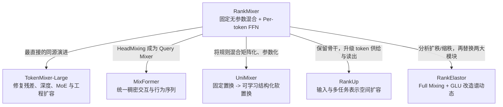

# RankMixer 及其演进方法详细调研

> 调研日期：2026-08-12
>
> 调研范围：仅依据仓库中的 6 篇论文 PDF 及其对应讲解整理。
>
> 基线：**RankMixer: Scaling Up Ranking Models in Industrial Recommenders**。
>
> 目标：说明每种后续方法究竟继承了 RankMixer 的什么、修复了什么、付出了什么代价，以及论文实际报告了怎样的改进效果。
>
> 面向 `cvr_bn_rankmixer_v1.py` 的全部改进方法精炼总览：[CVR_RankMixer_v1_改进方案汇总与选型指南.md](CVR_RankMixer_v1_改进方案汇总与选型指南.md)

## 摘要

RankMixer 的关键贡献，是把工业排序模型改造成适合 GPU 的 MetaFormer 式骨干：用**无参数的 Multi-head Token Mixing**完成跨 token 信息交换，用**彼此独立的 Per-token FFN**保留异质特征子空间，并通过大矩阵乘法、高 MFU 和稀疏 MoE 扩大稠密参数规模。它解决的是“传统特征交叉模块难以高效扩容”的问题，但也留下了五类后续问题：固定混合不可学习、残差前后 token 语义错位、深层训练不稳、序列与稠密特征仍彼此割裂、表示有效秩随深度收缩。

本仓库收录的后续方法并不是沿同一条线做小修小补，而是围绕这些瓶颈形成了五条互补路线：

1. **TokenMixer-Large**：RankMixer 最直接的工程继任者。保留无参数混合的硬件优势，用 Mixing-Reverting、Pre-RMSNorm、层间残差、辅助损失、Pertoken-SwiGLU 和 Sparse-Pertoken MoE 修复深度、残差与稀疏训练问题，并把规模推进到离线 15B、在线 7B。
2. **MixFormer**：把 RankMixer 的 HeadMixing 从“纯稠密特征交互骨干”扩展为统一的 Query Mixer，并在同一 block 中加入行为序列 Cross Attention，解决稠密模型与序列模型分别扩容时的预算竞争；再通过 User-Item Decoupling 降低请求级重复计算。
3. **UniMixer**：把 RankMixer 的固定切分-转置-拼接解释为置换矩阵，再放松为受 Sinkhorn、对称性和温度约束的可学习“软置换”；Lite 版用局部基矩阵与全局低秩分解提高参数效率，并用 SiameseNorm 改善深度扩展。
4. **RankUp**：基本保留 RankMixer/MetaFormer 骨干，不重点修改 mixer，而是从输入和多任务读出两端增加表示自由度：随机分片、多套 embedding、Global Token、预训练向量交叉 token 和 Task Token，目标是让新增参数真正对应更多有效表示方向。
5. **RankElastor**：从谱动态解释 RankMixer 的瓶颈，用 Parameterized Full Mixing 增强“扩秩”，用 GLU-improved P-FFN 减少“缩秩”。公开数据上优于 RankMixer，但全混合为 $O(T^2D^2)$，且论文的有效秩定义、代码和图值存在需复核的不一致。

因此，不能简单问“谁是最好的 RankMixer 后继者”。更准确的选择是：极致工业扩容看 TokenMixer-Large，稠密与长序列共扩展看 MixFormer，可学习结构化 mixer 看 UniMixer-Lite，输入/多任务表示扩容看 RankUp，谱诊断和全坐标表达力研究看 RankElastor。

---

## 1. 调研对象、谱系关系与读数口径

### 1.1 本仓库中的有效资料

| 对象 | 本地资料 | 与 RankMixer 的关系 | 本调研定位 |
|---|---|---|---|
| RankMixer | [论文 PDF](./RankMixer.pdf)；[中文详解](./RankMixer_论文详解.md) | 基线 | 统一骨干与工业扩容起点 |
| TokenMixer-Large | [论文 PDF](../tokenmixer/TokenMixer-Large.pdf)；[中文详解](../tokenmixer/TokenMixer-Large_论文详解.md) | **直接演进**；论文明确称原 TokenMixer 来自 RankMixer | 深度、残差、MoE 与系统工程升级 |
| MixFormer | [论文 PDF](../mixformer/MixFormer.pdf)；[中文详解](../mixformer/MixFormer_论文详解.md) | **架构扩展**；Query Mixer 直接受 RankMixer 启发 | 稠密交互与行为序列统一建模 |
| UniMixer | [论文 PDF](../UniMixer/UniMixer.pdf)；[中文详解](../UniMixer/UniMixer_论文详解.md) | **理论与结构泛化**；把固定 TokenMixer 参数化 | 可学习软置换、结构化压缩、深度扩展 |
| RankUp | [论文 PDF](../RankUp/RankUp.pdf)；[中文详解](../RankUp/RankUp_论文详解.md) | **骨干保留、输入/读出增强**；主基线为 RankMixer | 高秩输入、全局/外部先验、多任务解耦 |
| RankElastor | [论文 PDF](../RankElastor/RankElastor_paper.pdf)；[中文详解](../RankElastor/RankElastor_论文详解.md) | **机制替换**；直接诊断 RankMixer 的谱动态 | Full Mixing + GLU，缓解表示坍塌 |

### 1.2 演进关系图

### 1.3 实验数字的统一解释

这些论文使用不同公司、数据集、标签和基线，原始 AUC 或百分比不能横向排列成全局排行榜。本调研采用三种口径：

- **同表直接对比**：同一论文、同一数据、同一表中的 RankMixer 与新方法，证据最强；例如 RankElastor、UniMixer、TokenMixer-Large 的离线表。
- **相同生产对照下的增量**：例如 MixFormer 相对 `STCA -> RankMixer` 的线上 A/B，能说明系统替换后的业务价值，但通常同时改变架构、参数量和计算量。
- **作者报告的 uplift**：RankUp、UniMixer 的部分线上数据只给百分比或聚合结果，缺少基准绝对值；本文保留作者口径，不把它擅自换算成 AUC 绝对差。

特别地，论文中的 `+0.10% AUC`、`+0.001 AUC` 和“AUC 相对提升 0.10%”不是天然等价的。本文在能由原始 AUC 计算时明确写“绝对差”，否则保留论文的 `ΔAUC` 记法。

FLOPs/Batch 也只能在同一论文内部比较：RankMixer 主表的 batch 是 512，MixFormer 是 1500，TokenMixer-Large 是 2048，且不同论文是否计入序列模块、输入投影和任务塔的口径不完全相同。本文所有 FLOPs 百分比都由同一张表内的数值计算，不直接比较跨论文的 FLOPs 绝对值。

---

## 2. RankMixer 基线：它解决了什么，又留下了什么

来源定位：[RankMixer.pdf](./RankMixer.pdf) 第 3-7 页，重点为 Figure 1、Tables 1-6；可配合 [RankMixer 中文详解](./RankMixer_论文详解.md) 阅读。

### 2.1 设计动机：从“堆很多小算子”转向统一可扩展骨干

工业排序输入包含数值特征、离散 ID、用户/物品特征、交叉特征和行为序列聚合结果。传统 DLRM 常把 DCN、FM、Attention、LHUC 等异构模块并联或串联。这些结构在小模型上有效，但大量算子来自 CPU 时代，容易形成小矩阵、频繁访存和低并行度；参数增加时，FLOPs、显存和延迟迅速上升，GPU 的理论算力却没有被充分利用。

RankMixer 的设计原则是：

- 使用少数统一、可重复堆叠的 block；
- 让主体计算落在大尺寸 GEMM 上，提高 MFU；
- 避免 Self-Attention 的 $O(T^2)$ 权重矩阵和异质 token 间不可靠的内积相似度；
- 用 token 级参数隔离保留不同特征子空间，而不是让高频特征支配一个共享 MLP；
- 通过稀疏专家让总参数增长快于激活计算。

### 2.2 输入 token 化

不同特征先变成 embedding，再按语义域组织、拼接，并切成 $T$ 段。第 $i$ 段通过独立投影统一到 $D$ 维：

$$
x_i=\operatorname{Proj}_i\big(e_{input}[d(i-1):di]\big),\qquad
X_0=[x_1;\ldots;x_T]\in\mathbb{R}^{T\times D}.
$$

这里的折中很关键：token 太多，每个 token 获得的 FFN 宽度和算力太小；token 太少，模型退化为一个大 DNN，异质子空间相互干扰。RankMixer 通常把相近语义特征组织到有限数量的 token 中。

### 2.3 Multi-head Token Mixing：零参数的跨 token 信息交换

每个 token $x_t$ 沿通道维切成 $H$ 份：

$$
x_t=[x_t^{(1)}\Vert x_t^{(2)}\Vert\cdots\Vert x_t^{(H)}].
$$

然后把所有 token 的第 $h$ 个子块拼成一个新 token：

$$
s_h=\operatorname{Concat}(x_1^{(h)},x_2^{(h)},\ldots,x_T^{(h)}).
$$

论文设置 $H=T$，因此输入输出都为 $T\times D$，可以做残差连接。这个操作本质是确定性的切分、转置和重排，不引入可学习参数，复杂度近似线性于 $TD$。它让每个新 token 都获得来自全部原 token 的一个子空间，同时避免构造 Attention score matrix。

### 2.4 Per-token FFN：把异质性转化为参数容量

对混合后的第 $t$ 个 token，RankMixer 使用独立的两层 FFN：

$$
v_t=W_{t,2}\,\operatorname{GELU}(W_{t,1}s_t+b_{t,1})+b_{t,2}.
$$

不同 token 不共享 FFN 参数。与 Transformer 的“所有 token 共用同一个 FFN”相比，这种设计有三点意义：

1. 不同语义子空间可以学习不同变换；
2. 增加 token 数或隐藏宽度时，参数容量快速增加；
3. 计算仍可整理为规则的分组大矩阵乘法，适合 GPU。

一个 RankMixer block 的基本形式是：

$$
S_{l}=\operatorname{LN}(\operatorname{TokenMixing}(X_l)+X_l),
$$

$$
X_{l+1}=\operatorname{LN}(\operatorname{PFFN}(S_l)+S_l).
$$

若 FFN expansion ratio 为 $k$、block 数为 $L$，论文给出稠密主体近似：

$$
\#\operatorname{Param}\approx 2kLTD^2,\qquad
\operatorname{FLOPs}\approx 4kLTD^2.
$$

### 2.5 Sparse MoE 与部署效率

RankMixer 进一步把每个 token 的 FFN 扩展为专家集合，采用 ReLU 路由和 Dense-Training/Sparse-Inference：训练时尽量让专家获得充分梯度，推理时只激活部分专家。论文希望借此把容量继续推向 10B，而不按总参数同比增加服务计算。

RankMixer 的消融结果直接说明了两个核心组件的必要性：

| RankMixer-100M 改动 | ΔAUC |
|---|---:|
| 去掉 Multi-head Token Mixing | -0.50% |
| Per-token FFN 改为共享 FFN | -0.31% |
| 去掉残差 | -0.07% |
| 去掉 LayerNorm | -0.05% |

进一步把 Multi-head Token Mixing 换成其他 token-to-FFN 路由时，All-Concat-MLP 下降 `0.18%`，让所有 P-FFN 共享完整输入下降 `0.25%`；换成 Self-Attention 只下降 `0.03%`，却增加 16% 参数和 71.8% FLOPs。这说明 Attention 并未在异质推荐 token 上带来可见精度优势，而固定重排以近似相同效果获得了明显更好的成本。

Sparse-MoE 曲线还显示，Dense-Training/Sparse-Inference + ReLU routing 在推理仅激活约 $1/8$ 专家时几乎保留 1B 稠密模型效果，并报告约 50% 吞吐改善；普通稀疏 MoE 则随稀疏度提高持续退化。它证明 RankMixer 已具备容量-激活计算解耦的雏形，也正是 TokenMixer-Large 后续要把“只在推理稀疏”升级为“训练与推理都稀疏”的起点。

### 2.6 基线效果

在抖音内部万亿级日志的约 100M 参数对比中，RankMixer-100M 相对 DLRM-MLP 基线报告：Finish AUC/UAUC `+0.64%/+0.72%`，Skip AUC/UAUC `+0.86%/+1.33%`；RankMixer-1B 进一步达到 `+0.95%/+1.22%` 和 `+1.25%/+1.82%`。

在线部署表中，原 15.8M 模型升级为 1.1B RankMixer 后：

| 指标 | OnlineBase | RankMixer-1B | 变化 |
|---|---:|---:|---:|
| Dense 参数 | 15.8M | 1.1B | 约 70 倍 |
| FLOPs/Batch | 107G | 2106G | 约 20 倍 |
| MFU | 4.47% | 44.57% | 约 10 倍 |
| 延迟 | 14.5 ms | 14.3 ms | 基本不变 |

抖音 Feed 总体线上指标为 Active Day `+0.2908%`、Duration `+1.0836%`、Like `+2.3852%`、Finish `+1.9874%`、Comment `+0.7886%`；抖音 Lite 对应为 `+0.1968%/+0.9869%/+1.1318%/+2.0744%/+1.1338%`。广告场景报告 `ΔAUC +0.73%`、ADVV `+3.90%`。这些结果构成后续方法共同追赶的工业基线。

### 2.7 后续论文集中指出的五个瓶颈

| RankMixer 瓶颈 | 为什么出现 | 对应后续方法 |
|---|---|---|
| 固定混合不可学习 | 切分/转置规则不随场景优化，且经典形式要求 $H=T$ | UniMixer、RankElastor |
| 残差语义错位、深层不稳 | mixing 前后每个位置的语义已变化，却直接相加；Post-Norm 和浅层设计不利于加深 | TokenMixer-Large、UniMixer |
| 稠密与序列模块割裂 | RankMixer 主要把序列编码结果视为一个静态输入，序列模型通常在外部独立运行 | MixFormer |
| 表示空间没有随参数充分增长 | 固定 mixing 扩秩有限，P-FFN 可能反复压缩奇异值谱；语义分组和单 embedding 又让初始表示相关 | RankUp、RankElastor |
| MoE 和服务扩容仍不彻底 | Dense-Train/Sparse-Infer 不节省训练成本，ReLU 动态激活不易预测，超大 per-token 参数需要并行策略 | TokenMixer-Large |

---

## 3. 总览：五种方法分别改了 RankMixer 的哪里

| 方法 | 保留的 RankMixer 核心 | 主要修改位置 | 核心改进 | 主要收益 | 主要代价/风险 |
|---|---|---|---|---|---|
| TokenMixer-Large | 无参数 HeadMixing、token 专属 FFN、硬件友好骨干 | block、残差/归一化、MoE、并行与量化 | Mixing-Reverting、Pertoken-SwiGLU、深层残差/辅助损失、Sparse-Pertoken MoE | 最直接地把规模、深度和部署能力推高 | 结构与工程复杂度明显增加；大规模收益依赖私有系统 |
| MixFormer | HeadMixing 与 per-head FFN 的异质特征建模思想 | 整个宏观骨干 | Query Mixer + Cross Attention + Output Fusion；稠密/序列共享参数 | 同时改善 dense scaling 与 sequence-length scaling | Cross Attention 仍随序列长度增长；与 RankMixer 不再是同构 block |
| UniMixer | TokenMixer 的静态、与输入无关全局混合；Pertoken FFN | mixer 与 norm | 固定置换参数化为局部-全局软置换；Lite 低秩/共享基；SiameseNorm | 更强参数效率和深度扩展趋势 | Sinkhorn/低温训练复杂；部分配置 FLOPs 高于 RankMixer |
| RankUp | MetaFormer/TokenMixer 骨干 | token 形成、embedding、外部先验、多任务输出 | 随机分片、多 embedding、Global/Cross/Task Token | 更高有效秩、冷启动与多任务业务收益 | 组件增参且对照不完全等参数；高秩不是效果的因果证明 |
| RankElastor | `mixing -> P-FFN` 的两阶段结构 | mixer 与 FFN | 全坐标可学习 mixing；乘法门控 GLU P-FFN | 公开数据 AUC/LogLoss 与 scaling 趋势更好 | Full Mixing 为 $(TD)^2$；论文谱指标存在一致性问题 |

---

## 4. TokenMixer-Large：把 RankMixer 从“可扩”推进到“超大规模可训练、可服务”

来源定位：[TokenMixer-Large.pdf](../tokenmixer/TokenMixer-Large.pdf) 第 3-8 页，重点为 Figures 1-5、Tables 2-7；可配合 [TokenMixer-Large 中文详解](../tokenmixer/TokenMixer-Large_论文详解.md) 阅读。

### 4.1 与 RankMixer 的继承关系

这是目录中谱系最直接的方法。论文明确写道：前一代 TokenMixer 架构由 RankMixer 论文引入，RankMixer 将其作为排序骨干。TokenMixer-Large 不否定固定混合的高效性，而是认为 RankMixer 在 1B 左右仍受四个实际问题限制：

- mixing 后 token 数/语义变化，原残差连接不严格对齐；
- 工业模型通常只堆 2 层，继续加深时梯度与收敛恶化；
- RankMixer 的 Dense-Train/Sparse-Infer 只节省服务成本，不节省训练；
- DCN、LHUC 等历史碎片算子仍可能拉低整体 MFU。

因此它是一次“保留计算范式、重写 block 与系统栈”的升级。

### 4.2 Mixing & Reverting：修复残差的维度和语义

RankMixer 只做一次 mixing：

$$
X\in\mathbb{R}^{T\times D}
\longrightarrow
H\in\mathbb{R}^{H\times(TD/H)}.
$$

只有令 $H=T$，形状才能与原输入一致；即使形状一致，新位置也代表“某个 head 汇聚全部 token”，与原位置的语义 token 并不相同。直接计算 $F(H)+X$ 存在语义错位。

TokenMixer-Large 在一个 block 内先 mixing、经过一组 Pertoken-SwiGLU，再按相反的数据布局 revert 回原始 $T\times D$：

$$
X_{T\times D}
\xrightarrow{\text{mix}}
H_{H\times TD/H}
\xrightarrow{\text{pSwiGLU}}
\widehat H
\xrightarrow{\text{revert}}
X^{revert}_{T\times D}.
$$

这样 block 外部始终保持原 token 位置，标准残差既维度相容，也语义对齐；$H$ 不再必须等于 $T$。论文 Table 5 中去掉 Mixing & Reverting，4B 模型 AUC 下降 `0.27%`，是最重要的单项之一。

论文 Table 3 还把三个条件拆开：SR 表示标准残差，OTR 表示原 token 残差能跨层保留，TSA 表示相加两侧的 token 语义对齐。

| 版本 | SR | OTR | TSA | 表中 ΔAUC | 参数 | FLOPs |
|---|---:|---:|---:|---:|---:|---:|
| RankMixer w/o SR & OTR | 否 | 否 | 否 | -0.20% | 510M | 4.2T |
| RankMixer w/o OTR | 是 | 否 | 否 | -0.13% | 510M | 4.2T |
| RankMixer | 是 | 是 | 否 | +0.03% | 567M | 4.6T |
| TokenMixer-Large | 是 | 是 | 是 | **+0.13%** | 500M | 4.2T |

在参数和 FLOPs 反而更低时，补齐 TSA 后相对完整 RankMixer 再高 0.10 个百分点，是 Mixing-Reverting 不只改善工程可用性、也改善效果的直接证据。

### 4.3 Pertoken-SwiGLU：升级通道交互

RankMixer 的两层 GELU P-FFN 被替换为 token 专属的 SwiGLU：

$$
\operatorname{pSwiGLU}(x_t)=W^t_{down}
\left[\operatorname{Swish}(W^t_{gate}x_t)\odot(W^t_{up}x_t)\right].
$$

乘法门控带来比普通两层 FFN 更丰富的交互，同时继续为各 token 隔离参数。消融显示：

- Pertoken-SwiGLU 改成共享 SwiGLU：`-0.21% AUC`；
- 改回 Pertoken FFN：`-0.10% AUC`。

这说明收益同时来自 SwiGLU 和 token 专属参数，前者不能代替后者。

### 4.4 深层训练：Pre-RMSNorm、层间残差、辅助损失、小初始化

TokenMixer-Large 采用四个相互配合的稳定化机制：

1. **Pre-RMSNorm**：把 RankMixer 的 Post-LayerNorm 改为 Pre-Norm，并用更轻量的 RMSNorm；附录称吞吐提升 8.4%，而 Post-Norm 虽可能短期多 `+0.01%`，但会出现 NaN。
2. **Interval Residual**：每隔 2-3 层增加跨层残差，让低层信号更直接到达高层；最后一层不加，避免过多低级特征干扰最终抽象。
3. **Auxiliary Loss**：用中间层输出也参与预测损失，避免深层模型的低层参数训练不足。
4. **Down-Matrix Small Init**：将 SwiGLU 的 $W_{down}$ 初始化尺度降至 0.01，使早期残差块接近恒等映射；附录最优配置约 `+0.03% AUC`。

Table 5 中去掉层间残差与辅助损失下降 `0.04%`，去掉普通残差下降 `0.15%`。单项数值不大，但它们决定更深模型能否稳定得到 scaling 收益。

### 4.5 Sparse-Pertoken MoE：训练和推理都稀疏

TokenMixer-Large 采用“先扩大、再稀疏”：先训练/验证更大的 Pertoken-SwiGLU 能带来效果，再把每个 token 的宽 FFN 切成多个专属子专家，只激活 Top-$k$。基本形式为：

$$
y_t=\alpha\sum_{j\in\operatorname{TopK}}g_j(x_t)\operatorname{Expert}_{t,j}(x_t)
+\operatorname{SharedExpert}_t(x_t).
$$

相对 RankMixer 的 ReLU MoE，改进包括：

- 每个 token 只在自己的专家池中路由，先验上避免异质 token 竞争同一批专家；
- Softmax Top-$k$ 使激活数量固定，训练和服务成本更可预测；
- Shared Expert 保留通用路径；
- Gate Value Scaling 令 $\alpha$ 约为稀疏率的倒数，补偿专家被选中频率下降后的梯度不足；
- Sparse-Train/Sparse-Infer 同时节省训练和服务计算。

在 Table 6 中，去掉 Shared Expert、Gate Scaling、Small Init 分别下降 `0.02%/0.03%/0.03%`；把 Sparse-Pertoken MoE 换成普通 Sparse MoE 下降 `0.10%`。4.6B 总参数、激活 2.3B 的版本与 4.6B 稠密版本同为 `+1.14% ΔAUC`，FLOPs/Batch 从 29.8T 降到 15.1T，约减少 49.3%。

### 4.6 纯模型与系统优化

论文观察到，DCN 在 150M 时仍有 `+0.09%`，到 700M 时增益降为 `0.00%`。因此超大模型可以移除大量小型、I/O-bound 的历史模块，让统一 block 自己吸收其功能，广告骨干 MFU 最高达到约 60%。

工程侧还包括：

- FP8 E4M3 推理，论文报告约 1.7 倍加速且无精度损失；
- MoEGroupedFFN、Permute/Unpermute 融合算子；
- Token Parallel 顺着 Mixing-Reverting 的布局切分参数，将 $L$ 层通信从约 $4L$ 次降为 $2L+1$ 次；
- 4 路并行在生产服务中基础吞吐提升 29.2%，叠加通信计算重叠后报告 96.6%。

### 4.7 改进效果

#### 同规模离线对比

在抖音电商约 500M 参数表中：

| 模型 | CTCVR ΔAUC | 参数 | FLOPs/Batch |
|---|---:|---:|---:|
| RankMixer | +0.84% | 567M | 4.6T |
| TokenMixer-Large 500M | **+0.94%** | 501M | 4.2T |

即在参数少约 11.6%、FLOPs 少约 8.7% 时，TokenMixer-Large 的同基线 `ΔAUC` 再高 0.10 个百分点。Table 3 的结构对照也给出相同的 0.10 个百分点差距，说明改进并不只来自参数变大。

#### Scaling 与线上结果

- 离线规模：Feed Ads 15B、电商 7B、直播 4B；
- 在线规模：Feed Ads 7B、电商 4B、直播 2B；
- 线上相对各场景 RankMixer 基线：Feed Ads `ΔAUC +0.35%`、ADSS `+2.0%`；电商 `ΔAUC +0.51%`、订单 `+1.66%`、人均预览支付 GMV `+2.98%`；直播 `ΔUAUC +0.7%`、支付 `+1.4%`。

这里的线上 uplift 同时包含了结构升级和参数扩容，例如广告从 RankMixer-1B 升到 TokenMixer-Large-7B，不能解释为某个单模块的纯因果增益。

规模变大还需要更多数据才能收敛：直播实验中 30M 到 90M 用 14 天数据得到 `+0.94% ΔUAUC`，而 500M 到 2.3B 用 30 天只得到 `+0.41%`，把窗口扩到 60 天后增益才达到 `+0.70%`。这说明“大模型曲线更好”依赖足够长的数据窗口，不能只扩大参数而保持训练数据不变。

### 4.8 评价

TokenMixer-Large 是 RankMixer 路线中工业证据最完整、最强调训练-服务协同的一支。它没有把 mixer 变得更“智能”，而是证明固定重排只要配上正确的可逆数据流、通道网络、残差和稀疏专家，仍能以极高硬件效率扩到十亿乃至百亿参数。代价是系统复杂度较高，复现这些收益需要定制算子、分布式并行、量化和大规模私有数据，不是只替换一个 PyTorch block 就能得到。

其边界也很明确：当前最高 ROI 是约 1:2 稀疏，1:4 已有轻微效果损失，无损达到 1:8 以上仍在探索；稀疏度很高时负载均衡重新恶化；服务阶段 MoEGroupedFFN 在论文剖析中占 block 时间 98.35%，并从训练时 compute-bound 变成 memory-bound。它也仍主要接收 DIN/LONGER 等外部聚合后的序列 token，没有解决 MixFormer 所针对的逐层原始行为序列联合建模。

---

## 5. MixFormer：从 RankMixer 的稠密交互扩展到“稠密 + 序列”共扩展

来源定位：[MixFormer.pdf](../mixformer/MixFormer.pdf) 第 3-8 页，重点为 Figures 1-6、Tables 1-2；可配合 [MixFormer 中文详解](../mixformer/MixFormer_论文详解.md) 阅读。

### 5.1 RankMixer 在序列建模上的结构性缺口

RankMixer 可以接收 DIN、LONGER 等序列模块压缩后的向量，但行为序列通常在骨干外先被编码。工业系统于是形成两套相互独立的参数：

- 序列 Transformer 负责更长历史；
- RankMixer/其他 dense backbone 负责用户、物品、上下文和交叉特征。

当计算预算固定时，两者竞争资源：序列长度增加会快速占用 FLOPs，压缩 dense backbone 的扩容空间；优先扩大 dense 参数又无法充分利用更长历史。层级串联 `Sequence -> RankMixer` 或并联 `Sequence ⊕ RankMixer` 只在末端融合，无法让高阶非序列特征持续指导序列聚合。

MixFormer 因而不是给 RankMixer 加一个序列插件，而是把两类建模合并到同一个 Transformer-decoder 式 block 中。

### 5.2 三段式 MixFormer block

#### 5.2.1 Query Mixer：继承 RankMixer 的 HeadMixing

非序列 embedding 拼接后切成 $N$ 个 head，每个 head 投影到 $D$ 维。由于用户、物品和上下文 token 仍来自异质空间，MixFormer 沿用 RankMixer 的判断：用内积 Self-Attention 计算它们的相似度既昂贵又未必可靠。

因此 Query Mixer 使用无参数 HeadMixing，再接 per-head SwiGLU：

$$
P=\operatorname{HeadMixing}(\operatorname{Norm}(X))+X,
$$

$$
q_i=\operatorname{SwiGLUFFN}_i(\operatorname{Norm}(p_i))+p_i.
$$

它本质上把 RankMixer 的“Token Mixing + Per-token FFN”变成了生成高阶查询表示的模块。

#### 5.2.2 Cross Attention：用高阶 query 聚合行为序列

行为序列中每个 action 先经每层独立的 SwiGLU 投影，再生成各 head 的 key/value。第 $i$ 个高阶非序列 query 对完整序列做目标相关聚合：

$$
z_i=\sum_{t=1}^{T}\operatorname{softmax}
\left(\frac{q_i^\top k_t^i}{\sqrt D}\right)v_t^i+q_i.
$$

这里保留 Attention 是合理的：query 与序列 action 已通过投影进入可比较空间，任务也正是目标条件下的历史检索；这与在原始异质字段间做 Self-Attention 不同。

#### 5.2.3 Output Fusion：再次使用 per-head SwiGLU

Cross Attention 输出同时包含非序列残差和序列聚合。每个 head 再用独立 SwiGLU 深度融合：

$$
o_i=\operatorname{SwiGLUFFN}_i(\operatorname{Norm}(z_i))+z_i.
$$

这些输出直接进入下一个 block，于是“稠密高阶交互 -> 序列检索 -> 融合”在每层反复发生，而不是只在输入或末端连接一次。

### 5.3 User-Item Decoupling：恢复请求级复用

统一模型的副作用是用户与候选物品很早就混在一起，同一请求的数百个候选会重复计算用户侧和历史序列。MixFormer 将非序列 head 分成 user-side 与 item-side，并给 HeadMixing 加单向 mask：

- 用户 head 不接收 item 信息，因此可在一个请求内共享；
- item head 仍能接收 user 信息，保留目标相关交互；
- 用户行为序列及用户侧 Cross Attention 也可复用。

这不同于完全隔离的双塔：信息仍允许 `user -> item` 单向传播，只禁止 item 污染可复用的 user 表示。

Figure 6 的真实服务测试与 FLOPs 结论一致：候选数逐步增大时，原 MixFormer 延迟约为 `35.3/45.7/55.9/74.2 ms`，UI-MixFormer 降至 `24.7/31.0/37.3/49.0 ms`，对应约 30.0%-34.0% 加速，候选越多越能摊薄用户侧重复计算。

### 5.4 改进效果

#### 离线同表对比

以约 1.2B dense 参数、序列长 512 的强基线 `STCA -> RankMixer` 为参照：

| 模型 | Finish AUC/UAUC 增益 | Skip AUC/UAUC 增益 | 参数 | GFLOPs/Batch |
|---|---:|---:|---:|---:|
| STCA -> RankMixer | +1.12% / +1.40% | +1.43% / +2.14% | 1255M | 6736 |
| MixFormer-medium | **+1.28% / +1.60%** | **+1.60% / +2.46%** | 1226M | 3503 |
| UI-MixFormer-medium | **+1.28% / +1.60%** | **+1.60% / +2.46%** | 1226M | 2242 |

因此，在参数少约 2.3% 时，MixFormer-medium 相对该 RankMixer 组合在 Finish AUC/UAUC 上再增加 0.16/0.20 个百分点，在 Skip AUC/UAUC 上再增加 0.17/0.32 个百分点；FLOPs 少约 48%。User-Item Decoupling 保持表中精度不变，并在 MixFormer 基础上再降约 36% FLOPs；相对 `STCA -> RankMixer` 总计少约 66.7%。

#### 消融与 scaling

Figure 3 报告的 AUC 降幅约为：去掉 Query Mixer 的 HeadMixing `-0.03%`，用 Self-Attention 替换 HeadMixing `+0.00%`，去掉 Query Mixer 的 per-head FFN `-0.04%`，Cross Attention 的 per-layer FFN 改共享 `-0.03%`，Output Fusion 的 per-head FFN 改共享 `-0.06%`，Pre-RMSNorm 换 Post-LayerNorm `-0.01%`。这说明 RankMixer 式零参数混合并不弱于更贵的 Self-Attention，而 token/head 参数隔离仍是主要收益来源。

在固定序列长 512 时，MixFormer 的 AUC-FLOPs 曲线整体高于 `RankMixer`、`STCA` 和两者组合；固定 dense 规模、把序列从 512 增加到 10,000 时，其斜率又接近强序列模型 STCA。论文用此证明统一参数可以同时继承 dense scaling 与 sequence scaling。

#### 在线 A/B

线上对照为已部署的 `STCA -> RankMixer`，运行两周。总体结果：

| 场景 | Active Day | Duration | Like | Finish | Comment |
|---|---:|---:|---:|---:|---:|
| 抖音 | +0.0415% | +0.2799% | +0.1766% | +0.3897% | +0.7035% |
| 抖音 Lite | +0.0252% | +0.4105% | +0.2125% | +0.2924% | +1.9097% |

论文称所有提升均统计显著且尚未收敛，但没有给出置信区间和硬件/流量细节。

### 5.5 评价

MixFormer 的本质不是“更强的 Token Mixer”，而是把 RankMixer 的异质特征交互能力嵌入每一层序列查询中。它解决的是 RankMixer 之外的系统级共扩展问题，因此与 TokenMixer-Large、UniMixer 不属于完全同一替代关系。若业务的主要瓶颈是独立 dense/sequence 模块之间的预算争夺，MixFormer 的结构最有针对性；若没有长行为序列，其 Cross Attention 和解耦机制的必要性会明显下降。

其限制是 Cross Attention 仍会随 head 数和序列长度近似线性增加，统一参数不等于序列计算免费；UI 加速依赖“一次请求包含多个候选”以及稳定的 user/item 特征划分，候选复用少时收益有限。它也没有直接修复 RankMixer 的极深层梯度、残差语义和训练期 MoE 稀疏问题，这些仍是 TokenMixer-Large 的专长。

---

## 6. UniMixer：把固定 TokenMixer 变成可学习的局部-全局软置换

来源定位：[UniMixer.pdf](../UniMixer/UniMixer.pdf) 第 5-13 页，重点为 Figures 2-6、Tables 1-4；可配合 [现有中文详解](../UniMixer/UniMixer_论文详解.md) 阅读。

### 6.1 对 RankMixer 的核心重解释

RankMixer 的 split-transpose-concat 看似是专用数据搬运规则，但对展平向量而言，任何固定重排都等价于一个置换矩阵：

$$
\operatorname{TokenMixer}(X)
=\operatorname{reshape}\left(W^{perm}\operatorname{flatten}(X)\right).
$$

$W^{perm}\in\mathbb{R}^{TD\times TD}$ 具有四个性质：可压缩、双随机、极稀疏，以及在 $T=H$ 时对称。RankMixer 的问题由此被重新表述为：它选择了一个手工固定的 0-1 置换，而不是从数据中学习应该怎样混合。

直接学习整个 $TD\times TD$ 矩阵需要 $O(T^2D^2)$ 参数和计算，这正是 RankElastor 后来采用、但 UniMixer 希望避免的成本。UniMixer 因此选择结构化参数化。

### 6.2 UniMixing：局部矩阵 + 全局矩阵

令展平后的长度为 $L=TD$，块大小为 $B$，块数 $n=L/B$。输入被切成 $n$ 个长度为 $B$ 的块。每个块有自己的局部混合矩阵 $W_B^i\in\mathbb{R}^{B\times B}$：

$$
h_i=x_iW_B^i.
$$

将 $h_i$ 堆成 $H\in\mathbb{R}^{n\times B}$ 后，用全局矩阵 $W_G\in\mathbb{R}^{n\times n}$ 做块间混合：

$$
\operatorname{UniMixing}(X)=\operatorname{reshape}(W_GH,1,L).
$$

于是 $W_B^i$ 决定块内通道如何交流，$W_G$ 决定不同块之间的信息流。优化后的计算复杂度为：

$$
O\left(LB+\frac{L^2}{B}\right),
$$

避免显式构造 $L\times L$ 大矩阵，也取消经典 RankMixer 的 $H=T$ 限制。

### 6.3 用结构先验约束“可学习置换”

自由矩阵可能失去 TokenMixer 稳定、稀疏的归纳偏置。UniMixer 对全局和局部矩阵都做：

1. 对称化 $\widetilde W=(W+W^\top)/2$；
2. Sinkhorn-Knopp 交替归一化，使其近似双随机；
3. 用温度 $\tau$ 控制尖锐度：低温得到接近稀疏置换的分布。

$$
\bar W=\operatorname{Sinkhorn}(\widetilde W/\tau).
$$

它不是离散置换，而是连续、可微、近似双随机的软路由。消融中，去掉温度系数造成最大下降 `-0.1645% AUC`，去掉对称约束 `-0.0573%`，取消块特异局部矩阵 `-0.0436%`，支持这些结构先验确有作用。这里沿用论文表中的 `ΔAUC` 百分号写法；例如 `-0.1645%` 来自 AUC 绝对差 `-0.001645` 乘 100，是百分点式展示，不应再解释成“相对下降 0.1645%”。

### 6.4 UniMixing-Lite：共享局部基 + 全局低秩

完整 UniMixing 在块很多时仍有两种冗余：每块一个 $B\times B$ 局部矩阵，以及 $n\times n$ 全局矩阵。Lite 版采用：

$$
W_B^{*i}=\operatorname{Sinkhorn}\left(\sum_{\ell=1}^{b}\omega_\ell^iZ_\ell\right),
$$

即用 $b$ 个共享基矩阵组合出每块的局部模式；全局矩阵则低秩分解：

$$
W_G=\operatorname{Sinkhorn}(A_GB_G),\quad
A_G\in\mathbb{R}^{n\times r},\ B_G\in\mathbb{R}^{r\times n}.
$$

这保留了“静态全局混合 + 块特异局部变换”，同时减少参数。实验中局部基从 $b=2$ 增至 4，AUC 从 0.749228 升到 0.750230；增至 8 仅到 0.750283，说明少数共享模式已覆盖大部分收益。全局秩 $r=2,64,128,256$ 时 AUC 依次为 0.748568、0.749002、0.749228、0.749539，收益更平滑但边际递减。

### 6.5 Pertoken-SwiGLU、SiameseNorm 与温度训练

UniMixer 继续使用 token 专属 SwiGLU，继承 RankMixer 的异质参数隔离。为解决深度扩展，使用双流 SiameseNorm：一条流每层规范化，另一条流保留更直接的残差信息，最终融合。这不是 TokenMixer-Large 的跨层 shortcut，而是通过双状态流调和 Pre-Norm 与 Post-Norm。

低温虽然有利于稀疏、尖锐的混合图，却也会使梯度变弱。论文给出从 $\tau=1.0$ 线性退火到 0.05，或先高温训练、再以其权重 warm-start 低温模型。去掉 warm-up，AUC 下降 `0.0856%`；SiameseNorm 换成 Post-Norm 下降 `0.0273%`。

### 6.6 改进效果

#### 与 RankMixer 的直接 AUC 对比

在快手广告留存数据的 Table 2 中：

| 模型 | AUC | UAUC | 参数 | FLOPs/Batch |
|---|---:|---:|---:|---:|
| RankMixer | 0.749329 | 0.738938 | 135.5M | 1.68T |
| UniMixer 2-block, 67.5M | 0.749770 | 0.739331 | 67.5M | 2.07T |
| UniMixer 2-block, 101.5M | 0.750238 | 0.739983 | 101.5M | 2.50T |
| UniMixer-Lite 4-block, 38.2M | 0.752327 | 0.742091 | 38.2M | 1.26T |
| UniMixer-Lite 4-block, 84.5M | **0.752718** | **0.742530** | 84.5M | 4.24T |

相对 RankMixer：

- 101.5M UniMixer 的 AUC/UAUC 绝对提高 `0.000909/0.001045`，参数少 25.1%，但 FLOPs 多 48.8%；
- 84.5M UniMixer-Lite 的 AUC/UAUC 绝对提高 `0.003389/0.003592`，参数少 37.6%，但该点 FLOPs 多 152.4%；
- 67.5M 标准 UniMixer 的 AUC/UAUC 绝对提高 `0.000441/0.000393`，参数少 50.2%，但 FLOPs 多 23.2%；
- 38.2M Lite 是更有说服力的 Pareto 点：AUC/UAUC 绝对提高 `0.002998/0.003153`，参数少 71.8%，FLOPs 少 25.0%。

因此论文“更高效”的最稳妥解释是**参数效率和若干 Pareto 点更优**，并非每个配置都比 RankMixer 计算更少。

#### Scaling 指数与深度

论文拟合的参数 scaling 指数为 RankMixer `0.116043`、UniMixer `0.131973`、UniMixer-Lite `0.141903`；FLOPs scaling 指数为 `0.116635/0.125702/0.135327`。在本数据和拟合范围内，Lite 随资源增加的边际衰减最慢，但论文未报告拟合误差和跨任务验证，不能当作普适定律。

深度表更直观：

| 模型 | 2 blocks | 4 blocks | 8 blocks |
|---|---:|---:|---:|
| RankMixer AUC | 0.747772 | 0.746706 | - |
| UniMixer-Lite AUC | 0.749228 | 0.750803 | 0.750875 |

RankMixer 从 2 层到 4 层绝对下降 0.001066，UniMixer-Lite 则提高 0.001575；但 4 层到 8 层只再提高 0.000072，说明深度收益仍会饱和。

这张深度表也不是同 FLOPs 对照：论文 Table 4 中，同深度 UniMixer-Lite 的 FLOPs 约为 RankMixer 的 2.9 倍。因此它能支持“该结构在继续加深时不退化”，但不能单独证明深度扩展的单位计算收益一定更高。

#### 在线结果

论文称 UniMixer/UniMixer-Lite 在快手多个广告投放场景中，安装日后 D1-D30 累计活跃天数平均提升超过 15%。但未披露对照模型、场景拆分、流量、置信区间和护栏指标，故只能视为作者报告的强业务信号，不能独立审计。

### 6.7 评价

UniMixer 是对 RankMixer 最干净的数学泛化：RankMixer 是“预先选好一个固定洗牌”，UniMixer 是“在软置换约束下学习洗牌”。相比 RankElastor 的全矩阵，它用结构化分解控制成本；相比 TokenMixer-Large，它愿意增加 mixer 参数来换取场景适配性。最值得警惕的是实现细节：低秩乘积之后的 Sinkhorn 是否物化 $n\times n$ 矩阵、迭代次数与真实吞吐均未充分披露，而且实验来自单一私有留存任务。

---

## 7. RankUp：不改 mixer 主体，先让 RankMixer 获得更丰富的表示原料

来源定位：[RankUp.pdf](../RankUp/RankUp.pdf) 第 3-8 页，重点为 Figures 1-5、Tables 1-4；可配合 [现有中文详解](../RankUp/RankUp_论文详解.md) 阅读。

### 7.1 问题重定义：参数规模不等于表示容量

RankUp 认为，扩大 $T$、$D$、层数和 FFN 参数，并不保证隐藏矩阵真正使用更多独立方向。对 $H_l\in\mathbb{R}^{T\times D}$ 的奇异值 $\sigma_i$ 归一化为

$$
p_i=\frac{\sigma_i}{\sum_j\sigma_j},
$$

其熵型有效秩为：

$$
\operatorname{erank}(H_l)=
\exp\left(-\sum_ip_i\log p_i\right).
$$

若能量集中在少数奇异方向，有效秩很低，新增维度和参数可能只在原低维子空间内重复计算。RankUp 沿用 RankMixer/MetaFormer 的 Token Mixer + Per-token FFN 骨干，并采用 PreNorm 和 SwiGLU，但主要创新不在 mixer，而在**token 进入骨干之前和多任务输出之前**。

### 7.2 五个表示增强组件

#### 7.2.1 Randomized Permutation Splitting

RankMixer 的语义分组可能把高度相关或同为长尾的特征聚在一个 token 中，使 token 内共线、token 间冗余。RankUp 先随机打乱 $M$ 个稀疏特征索引，再分组投影：

$$
\mathcal F_\sigma=\{f_{\sigma(1)},\ldots,f_{\sigma(M)}\}.
$$

其目标不是删除语义，而是避免人工先验让相关特征过度集中。论文的 K-means 离散互信息图在 $K=48/64$ 时均显示随机分组的 token 间 MI 更低；32 个 sparse token 的有效秩也总体更高、更均匀。

#### 7.2.2 Multi-embedding

同一特征从多套独立 embedding 表中取得多个表示：

$$
e_j=\{\psi_k(f_j)\mid \psi_k\in\mathcal K_j\}.
$$

它为同一类别信号提供多个几何坐标系，扩大初始表示自由度，尤其希望帮助长尾特征。但论文没有与“单表、同总参数、更宽 embedding”做等参数对照，因此部分收益可能只是来自更多 embedding 参数。

#### 7.2.3 Global Token

用 MLP、FM 或 DCNv2 等聚合全部特征，形成全局 token：

$$
g=\operatorname{func}\left(
\operatorname{Pool}(\{\operatorname{Embed}(f_i)\}_{i=1}^{M})
\right).
$$

它为每个局部 token 提供全局汇聚/广播节点。有效秩曲线显示，没有充分全局信息的变体在第二个 FFN 后下降更明显。

#### 7.2.4 Cross Pre-trained Embedding Token

召回两塔已有用户向量 $z_{ue}$ 和广告/物品向量 $z_{ie}$。RankUp 不只拼接，而是做 Hadamard 乘积后投影：

$$
e_{cross}=\operatorname{Proj}(z_{ue}\odot z_{ie}).
$$

这把用户-物品每一维的显式匹配先验作为一个 token 注入精排骨干，对 Order 任务的单项增益最大，也与新广告冷启动收益较高的现象一致；但论文没有因果消融证明冷启动收益完全来自该 token。

#### 7.2.5 Task-Specific Token Decoupling

对 32 个优化目标分别加入可学习 Task Token。第 $k$ 个任务塔同时读取自己的 token 和共享池化表示：

$$
y^{(k)}=\operatorname{Tower}^{(k)}
\left(x_{task}^{(k)},\operatorname{Pool}(H_L')\right).
$$

这为每个任务提供私有信息槽位，缓解所有任务压缩同一共享空间。论文在 Book/Order 上用“表示聚类标签-任务标签互信息”作间接证据：有 Task Token 时 MI 更高。但它没有与 MMoE/PLE 比较，也没有直接测量任务梯度冲突。

### 7.3 改进效果

#### 组件与完整模型的 Realtime AUC

以两层 RankMixer 类骨干为基线，Table 1 报告：

| 变体 | Order | Book | Add Service |
|---|---:|---:|---:|
| Randomized Permutation Split | +0.06% | +0.06% | +0.08% |
| Global Token + Multi-Embedding | +0.21% | +0.18% | +0.13% |
| Cross Embedding | +0.22% | +0.10% | +0.03% |
| Task Token | +0.09% | +0.02% | +0.02% |
| **完整 RankUp** | **+0.41%** | **+0.23%** | **+0.25%** |

各行是组件变体的提升，不能相加。以 Order 为例，单项相加为 0.58%，完整模型只有 0.41%，说明 Global/Multi-Embedding/Cross Token 等机制学习了部分重叠信息，组合收益并非线性。

#### 表示动态

论文 Figure 4 显示每个 Token Mixer 后有效秩上升、紧随的 FFN 后明显下降；完整 RankUp 在第二个 FFN 后仍约为 40，而 Single Embedding 变体约为 34。这与“丰富初始表示可减轻深层收缩”一致。

但这里存在一个重要混杂：Global、Cross、Task Token 会增加 $T$，而 raw erank 的上限是 $\min(T,D)$。论文没有做 token 数匹配或用 $\operatorname{erank}/\min(T,D)$ 归一化，所以一部分有效秩上升可能由矩阵行数增加造成，不能全部归因于更好的谱利用。

#### 线上部署

RankUp 在微信视频号、公众号、朋友圈广告中，以 20% 流量连续测试 14 天，随后全量部署。生产模型约从 10M 扩到 100M，batch 300 时约 70 GFLOPs，MFU 23%。

线上对照是各场景当时的生产排序系统；论文只明确写到公众号场景的旧系统以 RankMixer 作为子模块，并未证明三个场景都是“纯 RankMixer 对照”。所以以下 uplift 是完整生产替换的结果，而不是对 RankMixer 单一骨干的严格受控增量。

| 场景 | Realtime AUC | CTCVR | GMV |
|---|---:|---:|---:|
| 微信视频号 | +0.367% | +1.41% | +3.41% |
| 微信公众号 | +0.331% | +0.21% | +4.81% |
| 微信朋友圈 | +0.269% | +0.87% | +2.12% |

新广告首日 GMV 分别提升 `+5.83%/+9.67%/+2.84%`；Order 任务 GMV 分别为 `+5.18%/+7.18%/+4.79%`。这是本仓库收录论文中很强的生产证据，但线上模型同时扩容约 10 倍，且未提供等参数、等 FLOPs 的生产对照，不能把全部 GMV 增长只归因于高秩组件。

### 7.4 评价

RankUp 是与其他方法最正交的一条路线：TokenMixer-Large、UniMixer、RankElastor主要改“骨干如何处理 token”，RankUp 改“给骨干什么 token，以及不同任务怎样读出”。它的组件多数可插拔，理论上可以和其他 mixer 组合；但这种组合尚未在论文中验证。最可靠的结论是：这套工具箱在微信广告的两层 RankMixer 类系统中有效，并带来显著线上价值；尚不能证明有效秩提升是业务增长的原因，也不能证明它改善了很深网络的普遍 scaling law。

---

## 8. RankElastor：从“阻尼式有效秩振荡”出发重写 Mixing 和 FFN

来源定位：[RankElastor_paper.pdf](../RankElastor/RankElastor_paper.pdf) 第 4-10 页，重点为 Figures 1-8、Tables 2-4；详细批判性核验见 [RankElastor_论文详解.md](../RankElastor/RankElastor_论文详解.md)。

### 8.1 对 RankMixer 的谱诊断

RankElastor 观察到 RankMixer 内部存在重复的锯齿：

$$
\text{Token Mixing 后有效秩上升}
\quad\rightarrow\quad
\text{P-FFN 后有效秩下降}.
$$

随着 block 增加，振幅衰减，形成“阻尼振荡”。作者认为固定块转置只能有限地打散谱，而普通逐 token GELU FFN 又容易把能量压回少数方向。因此方法口号是 **Expand More, Shrink Less**。

论文正文采用 norm-based effective rank，也就是 stable rank：

$$
\operatorname{erank}(X)
=\frac{\sum_i\sigma_i^2}{\max_i\sigma_i^2}
=\frac{\|X\|_F^2}{\|X\|_2^2}.
$$

这与 RankUp 使用的熵型 effective rank 不是同一个指标，二者的绝对值不能直接比较。

### 8.2 Parameterized Full Mixing：全坐标可学习交互

RankElastor 把 $X\in\mathbb{R}^{T\times D}$ 展平，使用完整矩阵：

$$
\operatorname{vec}(M^\top)
=\operatorname{LN}\left((W+I)\operatorname{vec}(X^\top)\right),
\qquad W\in\mathbb{R}^{TD\times TD}.
$$

RankMixer 只能按预设块转置，同一块内坐标共享混合模式；Full Mixing 允许任意 token-feature 坐标影响任意其他坐标，表达力最大化。它与 UniMixer 的差别很清楚：

- RankElastor 直接学习完整 $TD\times TD$ 矩阵；
- UniMixer 用局部-全局结构近似更丰富的混合，并显式控制成本和先验。

Full Mixing 的参数和计算均为 $O(T^2D^2)$。论文配置较小：Criteo 的 $TD=390$、Avazu 的 $TD=384$，单层矩阵约 15 万参数，因而成本尚可；若 $T=100,D=128$，单层即约 1.64 亿权重，扩展到工业大 token 空间会成为主要瓶颈。

若直接代入 RankMixer 原论文的典型配置，代价更直观：100M 版本 $T=16,D=768$ 时，单个 Full Mixing 约有 1.51 亿权重；1B 版本 $T=32,D=1536$ 时，单层约有 24.16 亿权重。也就是说，RankElastor 在公开数据的小 $TD$ 上只增加有限成本，并不等于它能原样保留 RankMixer 在 100M/1B 工业配置下的低延迟优势。

### 8.3 GLU-improved P-FFN：减少通道收缩

第 $t$ 个 token 使用乘法门控和可学习残差：

$$
Z_t=
\left(\operatorname{GELU}(M_tW_1)\odot(M_tW_2)\right)W_3
+M_tW_r.
$$

两个投影的逐元素乘积可产生类似二阶多项式的新方向，$W_r$ 则保护原有方向。论文的理论目标是：若输入有效维度约为 $k$，二阶特征空间最多可扩到 $k(k+1)/2$ 个方向。这里的理论依赖随机初始化、宽度、非退化数据等较强条件，只能作为机制动机，不是训练后模型必然增秩的无条件保证。

### 8.4 改进效果

#### 公开 CTR 数据主结果

| 模型 | Criteo AUC | Criteo LogLoss | Avazu AUC | Avazu LogLoss |
|---|---:|---:|---:|---:|
| RankMixer | 0.81375 | 0.43799 | 0.79270 | 0.37218 |
| **RankElastor** | **0.81482** | **0.43730** | **0.79323** | **0.37196** |

相对 RankMixer：Criteo AUC 绝对提高 `0.00107`、LogLoss 下降 `0.00069`；Avazu AUC 提高 `0.00053`、LogLoss 下降 `0.00022`。论文称每项为 10 次随机初始化均值，但没有标准差、置信区间或显著性检验。

#### 模块协同

| 变体 | Criteo AUC | Avazu AUC |
|---|---:|---:|
| 完整 RankElastor | **0.81482** | **0.79323** |
| w/o Full Mixing | 0.81413 | 0.79289 |
| GELU-based FFN | 0.81349 | 0.79288 |
| RankMixer | 0.81375 | 0.79270 |
| RankMixer + GLU-style FFN | 0.81393 | 0.79286 |

只给 RankMixer 换 GLU 的收益很小；Full Mixing 与 GLU 同时使用时最好，支持“先充分打散，再用乘法产生/保留新方向”的协同解释。论文报告训练时间相对 RankMixer 增加约 10%-15%，显存接近，但效率图缺少硬件与精确数值。

更严格地说，单组件并非都稳定提升：`RankMixer + GLU` 只比 RankMixer 高 `0.00018/0.00016 AUC`；采用 Full Mixing 但把 FFN 换回普通 GELU 时，Criteo AUC 0.81349 反而低于 RankMixer 的 0.81375。消融支持的是**两组件存在强交互，完整组合最有效**，而不是 Full Mixing 和 GLU 各自都能单独保证提升。主表也未严格做等参数、等 FLOPs 配平，部分收益可能来自新增 dense 参数。

#### 其他数据与 scaling

相对 RankMixer，RankElastor 在 KuaiVideo 上 gAUC/AUC 提高 `0.0040/0.0032`，TaobaoAd 上提高 `0.0015/0.0014`。在论文测试的约 1 倍至 9 倍 dense scaling 范围内，增宽、加深及联合扩展的 AUC/LogLoss 曲线均优于 RankMixer；但未给出参数绝对量、拟合方程或大规模外推验证。

### 8.5 必须保留的证据边界

RankElastor 的谱分析很有启发性，但本地精读核验出几项重要问题：

1. 论文公式使用 stable rank；本地精读 README 报告作者分析脚本计算的却是熵型 effective rank；
2. 按正文 $T,D$，逐样本秩上限分别为 15 和 16，但 Figures 1/2/5/6 的值约为 17-23，说明图、配置、聚合轴或定义至少有一项未写清；
3. 关于普通 FFN 收缩的定理依赖正齐次激活，而实际 GELU 不严格正齐次；
4. Full Mixing 只在小 $TD$ 上验证，没有线上 A/B 和大 token 服务成本；
5. 主表虽是 10 次均值，却没有方差或显著性。

其中第 1 点来自 [RankElastor_论文详解.md](../RankElastor/RankElastor_论文详解.md) 对作者公开代码的额外核验；本仓库没有收录该代码，本文未独立重跑脚本。即使改用熵型 effective rank，同一 $T\times D$ 矩阵的值仍不能超过代数秩，因此也不能自动解释图中超过 $\min(T,D)$ 的数值。理论部分还把普通 FFN写成对所有行共享的权重，而实际 RankMixer 的 P-FFN 对不同 token 使用独立参数，这进一步限制了“定理直接证明实际 P-FFN 必然缩秩”的力度。

因此，应相信“论文报告的相对趋势和离线指标”，但不应把有效秩曲线的绝对值或理论结论当作已被完全验证。

### 8.6 评价

RankElastor 的最大价值是把 scaling 失败转化为可测的中间过程：mixing 究竟扩了多少，FFN 又收缩了多少。Full Mixing 本身并非总能直接进入工业系统，更可迁移的思想是：先记录每层奇异值谱，再判断瓶颈在 mixer 还是 FFN，并尝试分组、低秩、稀疏或 Kronecker 化的可学习 mixing。它更像架构诊断与研究原型，而不是 TokenMixer-Large 那样已经证明可扩到数十亿参数的生产方案。

还应明确，RankElastor 只改造并验证了 RankMixer 的 dense 核心；它没有改进或验证 RankMixer 的 Sparse-MoE、ReLU routing、Dense-Train/Sparse-Infer、量化、MFU 优化和线上服务链路，不能被视为对完整工业 RankMixer 系统的等价升级。

---

## 9. 横向分析：这些方法其实在优化不同层次

### 9.1 按数据流位置对比

| 数据流位置 | RankMixer | TokenMixer-Large | MixFormer | UniMixer | RankUp | RankElastor |
|---|---|---|---|---|---|---|
| 输入分组 | 语义组织后切分 | 语义分组 + Global Token | 非序列多 head + 原始行为序列 | 沿用域 embedding 与 token-specific 投影 | 随机分片 + 多 embedding | 沿用常规 token 化 |
| 跨 token 混合 | 固定 HeadMixing | 固定 Mixing-Reverting | Query HeadMixing；序列用 Cross Attention | 可学习局部-全局软置换 | 基本沿用 Token Mixer | 完整 $TD\times TD$ 可学习矩阵 |
| 通道网络 | Per-token GELU FFN | Pertoken-SwiGLU / Sparse-Pertoken MoE | Query/Output per-head SwiGLU | Pertoken-SwiGLU | Per-token SwiGLU | GLU-improved P-FFN + 可学习残差 |
| 深度稳定性 | Post-LN，典型 2 层 | Pre-RMSNorm、跨层残差、AuxLoss、Small Init | Pre-RMSNorm、统一 block | SiameseNorm + 温度 warm-up | PreNorm；主实验仍为 2 层 | 通过更强 mixing/GLU 改谱，但无深层工程方案 |
| 序列建模 | 外部模块压缩后输入 | 仍主要接收外部序列聚合 token | 每层直接 Cross Attention 原行为序列 | 当前论文主要验证静态异质特征 | 外部 sequence token | 另在序列数据集验证，但非统一长序列骨干 |
| 多任务 | 最终池化后多塔 | 最终池化后多任务 | 多 task network | 多 task tower | 每任务专属 token + tower | 主要二分类 CTR |
| 系统优化 | 高 MFU、FP16、MoE | FP8、Grouped MoE、Token Parallel、纯模型 | User-Item Decoupling + 请求级复用 | 结构化矩阵压缩 | 报告 MFU 23%，细节少 | 训练时间约 +10%-15%，无线上系统数据 |

### 9.2 “可学习 mixer”三种选择

| 路线 | 代表 | 表达力 | 参数/计算 | 结构先验 | 适合场景 |
|---|---|---|---|---|---|
| 固定重排 | RankMixer / TokenMixer-Large / MixFormer Query Mixer | 中等；由后续 FFN 补足 | 最低，近似 $O(TD)$ 数据重排 | 最强、最稳定 | 大规模工业服务、MFU 优先 |
| 结构化可学习混合 | UniMixer / Lite | 高于固定重排 | $O(LB+L^2/B)$；Lite 进一步降参 | 双随机、对称、低温稀疏、低秩/共享基 | 希望 mixer 适配数据，同时控制成本 |
| 全坐标可学习混合 | RankElastor | 最高 | $O(T^2D^2)$ | 除残差外较少 | $TD$ 较小、研究表达力和谱动态 |

这三条路线构成明确的效率-表达力三角。TokenMixer-Large 的结果说明“固定 mixer 不一定是主要瓶颈”；UniMixer 说明“固定规则可以在结构约束下学习”；RankElastor 则探测完全解除约束的上限。不能只用 AUC 选型，还必须看 $T,D$、batch、延迟和硬件。

### 9.3 对“深度问题”的三种不同回答

- **TokenMixer-Large**：把深度问题视为梯度通路与初始化问题，用正确残差、Pre-Norm、辅助损失和 small init 解决。
- **UniMixer**：把深度问题视为归一化与残差信息保真问题，用 SiameseNorm 双流解决，同时使每层混合可学习。
- **RankElastor/RankUp**：把深度问题视为表示谱逐层收缩；前者重写 mixer/FFN，后者丰富输入和 token 类型。

这些解释并不矛盾。深层模型可能同时存在优化不稳和表示坍塌：一个模型即使梯度能传到，也可能只在低维子空间内更新；有效秩较高，也不代表训练一定稳定。

### 9.4 对“参数效率”的不同定义

- RankMixer/TokenMixer-Large 强调**总参数、激活参数与真实延迟解耦**；
- UniMixer-Lite 强调**每单位 dense 参数带来的 AUC scaling**；
- MixFormer 强调**一套参数同时服务 dense interaction 和 sequence aggregation**；
- RankUp 强调**新增参数是否变成独立、任务相关的表示方向**；
- RankElastor 强调**dense scaling 后性能曲线是否持续改善**。

因此，“参数更少”不是唯一效率指标。一个参数量较大的 TokenMixer-Large 可能因稀疏激活和 FP8 更容易服务；一个参数少的 UniMixer 配置也可能因结构化矩阵操作而 FLOPs 更高。

---

## 10. 效果对比：哪些结论可以直接说，哪些不能

### 10.1 可以较有把握地说

1. **TokenMixer-Large 在同一内部电商表中优于 RankMixer**：500M 级参数更少、FLOPs 更低，`ΔAUC` 高 0.10 个百分点；Mixing-Reverting 与 Pertoken-SwiGLU 是最大消融项。
2. **MixFormer 在相近 1.2B 参数下优于 `STCA -> RankMixer`**：四个 AUC/UAUC 指标均进一步提高，同时 FLOPs 显著下降；线上也相对该基线正向。
3. **UniMixer-Lite 在同一快手留存数据中明显优于 RankMixer**：既存在低参数、低 FLOPs 的更优 Pareto 点，也展示了 2 到 4 层继续增益，而 RankMixer 退化。
4. **RankUp 完整系统在腾讯微信广告中产生显著线上业务提升**：三个场景 AUC、CTCVR 和 GMV 均为正，并已全量上线。
5. **RankElastor 在四个公开数据集的论文结果中优于 RankMixer**：Criteo/Avazu 主表和 KuaiVideo/TaobaoAd 泛化表方向一致。

### 10.2 不能据此直接说

- 不能说 UniMixer 的 `0.752718` 比 RankElastor 的 `0.81482` 差，因为数据集和任务完全不同；
- 不能说 RankUp 的 `+4.81% GMV` 证明它比 TokenMixer-Large 的 `+2.98% GMV` 更强，因为业务、对照和指标定义不同；
- 不能把 TokenMixer-Large 的 7B 线上模型相对 RankMixer-1B 的全部收益归于 Mixing-Reverting；
- 不能从 RankElastor 更高有效秩推出有效秩是 AUC 提升的因果原因；
- 不能从 UniMixer 的拟合指数推出它在任意推荐任务、任意规模下都有普适 scaling law；
- 不能把 RankUp 的 2 层实验直接解释为已经解决十几层模型的深度坍塌。

### 10.3 证据强度排序

| 证据类型 | 代表 | 强度 | 主要缺口 |
|---|---|---|---|
| 同数据、同表、直接 RankMixer 对比 | TokenMixer-Large、UniMixer、RankElastor | 较强 | 多为私有数据或缺方差；RankElastor无显著性 |
| 相近参数的系统组合对比 | MixFormer | 较强 | 基线包含独立 STCA，结构变化较大 |
| 多场景线上 A/B | RankMixer、TokenMixer-Large、MixFormer、RankUp | 工业价值强 | 常同时扩容；系统细节/置信区间不完整 |
| 有效秩/互信息中间指标 | RankUp、RankElastor | 机制支持中等 | 定义、上限、聚类估计或因果解释存在混杂 |
| 单一任务 scaling 拟合 | UniMixer | 趋势证据中等 | 无拟合误差、跨任务验证和外推检验 |

---

## 11. 方法之间是否可以组合

从结构位置看，部分方法具有明显互补性，但以下组合都只是本调研基于架构做出的推断，本仓库收录的论文没有完成联合实验。

### 11.1 较自然的组合

- **RankUp + TokenMixer-Large**：RankUp 提供随机分片、Global/Cross/Task Token；TokenMixer-Large 负责更深骨干和稀疏服务。前者主要改输入/读出，后者主要改 block，接口上最兼容。
- **RankUp + UniMixer-Lite**：先提高输入表示自由度，再用可学习软置换建模 token 交互；需要控制新增 token 对全局矩阵尺寸和 Sinkhorn 成本的影响。
- **RankUp + RankElastor 的 GLU FFN 思想**：高秩输入若仍被普通 FFN压缩，可以继续使用更强门控；但 Full Mixing 会随 RankUp 增加的 token 数平方增长。
- **MixFormer + TokenMixer-Large 的工程机制**：MixFormer 的 Query Mixer/Output Fusion 可借鉴 Pre-RMSNorm、small init、稀疏 Pertoken MoE 和 Token Parallel，但 Cross Attention 的数据流与原 Mixing-Reverting 不同，需要重新设计并行布局。

### 11.2 重叠或冲突较大的组合

- **UniMixer Full/Lite 与 RankElastor Full Mixing** 都在替换同一个 mixer，不能简单串联；更合理的是做表达力-成本对照，或把 RankElastor 全矩阵蒸馏/分解成 UniMixer 式结构。
- **TokenMixer-Large 固定 mixing 与 UniMixer 可学习 mixing** 代表不同设计取舍。若替换，必须重新验证 Mixing-Reverting 的可逆布局、残差语义和定制算子效率。
- **MixFormer 与原 RankMixer 宏观骨干** 不只是可插拔算子关系。MixFormer 已把序列 Cross Attention 放进每层，继续外接一个完整 RankMixer 往往又回到参数割裂问题。

---

## 12. 工程选型建议

| 主要需求 | 优先方法 | 原因 | 首要验证项 |
|---|---|---|---|
| 从 1B 继续扩到数十亿参数且受严格延迟约束 | TokenMixer-Large | 直接解决深度、稀疏训练、FP8、并行与 MFU | 定制 Grouped MoE、Token Parallel、稀疏率下的真实 P99 |
| 长行为序列与 dense backbone 预算冲突 | MixFormer / UI-MixFormer | 每层统一查询、序列聚合和输出融合；请求级复用 | 序列长度、候选数、Cross Attention FLOPs、用户侧缓存一致性 |
| 固定 mixer 已成为表达力瓶颈，但全矩阵太贵 | UniMixer-Lite | 结构化可学习软置换，参数 Pareto 点好 | Sinkhorn 迭代、$B/b/r$、真实吞吐与显存、低温稳定性 |
| 多任务广告、长尾/冷启动、召回向量利用不足 | RankUp | 输入/先验/任务 token 直接针对这些问题 | 等参数对照、随机分片稳定性、embedding 存储、任务冲突与校准 |
| 想研究 scaling 饱和是否来自表示谱收缩 | RankElastor 思路 | 提供逐层谱诊断和模块级改造假设 | 同时计算 stable/entropy rank；先试低秩/分组 Full Mixing |
| 只追求最稳定、最便宜的工业 mixer | RankMixer/TokenMixer-Large 固定混合 | 零参数、规则、硬件友好，后续 FFN 可提供容量 | mixer 是否真是瓶颈；不要因追求可学习而牺牲 MFU |

一个稳妥的验证顺序是：

1. 在现有 RankMixer 每个 `raw -> mixing -> FFN` 位置记录 AUC、梯度范数、奇异值谱和两种有效秩；
2. 保持等参数、等 FLOPs、等延迟三组对照，而不是只做一个预算；
3. 先单独替换输入、mixer、FFN、残差、MoE，再做组合；
4. 对 2/4/8/16 层同时观察效果和训练稳定性；
5. 在线同时报告 P50/P95/P99、吞吐、显存、校准、核心业务指标和护栏指标；
6. 对长尾、新物品、新用户、低活用户和主要任务分别切片，避免平均指标掩盖收益来源。

---

## 13. 综合结论

RankMixer 建立了一个很强的工业推荐起点：**固定、便宜的跨 token 重排负责信息交换，独立、可扩的 Per-token FFN 负责容量，高 MFU 和稀疏化负责把参数转化为可服务的模型。** 本仓库收录的后续工作分别指出，这个范式仍可能在优化、结构、表示和系统层面遇到瓶颈。

- TokenMixer-Large 证明，RankMixer 的固定 mixer 可以继续保留，真正的下一步是修正残差语义、深层梯度、MoE 训练和并行系统；
- MixFormer 证明，RankMixer 若只处理压缩后的序列向量，就无法解决稠密与序列的全局共扩展，必须在每层统一建模；
- UniMixer 证明，固定重排可以被解释、连续化并结构化学习，在参数效率和深度上取得更好的若干 Pareto 点；
- RankUp 提醒，模型变大之前还要检查 token 是否相关、embedding 是否单一、任务是否争夺同一空间，新增参数必须获得更好的“表示供给”；
- RankElastor 则把所有这些现象压缩为一个谱问题：每层能否扩展更多有效方向，又能否在 FFN 中少丢失一些。

从研究角度看，最值得延续的不是把五种方法机械拼成一个巨型模型，而是建立一个统一的诊断框架：

$$
\text{输入表示自由度}
\rightarrow
\text{跨 token 混合表达力}
\rightarrow
\text{FFN 的谱保真}
\rightarrow
\text{深层梯度稳定性}
\rightarrow
\text{稀疏激活与硬件效率}
\rightarrow
\text{线上业务价值}.
$$

只有这条链路上的每个环节都被同预算实验验证，才能判断一次“基于 RankMixer 的改进”究竟是结构创新、规模收益、工程优化，还是三者共同作用。就当前证据而言，**TokenMixer-Large 是最直接、生产化最完整的继任；MixFormer 是面向序列共扩展的宏观重构；UniMixer-Lite 是可学习 mixer 中最平衡的结构化方案；RankUp 是最适合与其他骨干组合的表示增强工具箱；RankElastor 是最有启发性的谱诊断与高表达力研究方案。**

---

## 附录 A：关键数字速查

| 方法 | 相对 RankMixer/RankMixer 组合的关键结果 | 备注 |
|---|---|---|
| TokenMixer-Large | 500M 级同表 `ΔAUC` 再高 0.10 个百分点，参数 -11.6%，FLOPs -8.7%；4.6B SP-MoE 同效果下 FLOPs -49.3% | 私有电商数据；线上还包含大幅扩容 |
| MixFormer-medium | 相对 `STCA -> RankMixer`：Finish AUC/UAUC +0.16/+0.20 个百分点，Skip +0.17/+0.32；FLOPs -48% | 同约 1.2B 参数；UI 版再降 36% FLOPs |
| UniMixer 67.5M | AUC/UAUC 绝对 +0.000441/+0.000393；参数 -50.2%，FLOPs +23.2% | 快手留存数据 |
| UniMixer-Lite 38.2M | AUC/UAUC 绝对 +0.002998/+0.003153；参数 -71.8%，FLOPs -25.0% | 同表最强 Pareto 点 |
| UniMixer-Lite 84.5M | AUC/UAUC 绝对 +0.003389/+0.003592；参数 -37.6%，FLOPs +152.4% | 最佳绝对指标点，不是最低 FLOPs 点 |
| RankUp | 三任务 Realtime AUC +0.41%/+0.23%/+0.25%；三场景 GMV +3.41%/+4.81%/+2.12% | 线上同时约 10M -> 100M，结构与规模混合 |
| RankElastor | Criteo AUC +0.00107、Avazu +0.00053；LogLoss 分别 -0.00069/-0.00022 | 公开数据；无线上；谱定义需复核 |

## 附录 B：本地参考资料

1. Jie Zhu et al. **RankMixer: Scaling Up Ranking Models in Industrial Recommenders**. [本地 PDF](./RankMixer.pdf)；[中文详解](./RankMixer_论文详解.md)。
2. Yuchen Jiang et al. **TokenMixer-Large: Scaling Up Large Ranking Models in Industrial Recommenders**. [本地 PDF](../tokenmixer/TokenMixer-Large.pdf)；[中文详解](../tokenmixer/TokenMixer-Large_论文详解.md)。
3. Xu Huang et al. **MixFormer: Co-Scaling Up Dense and Sequence in Industrial Recommenders**. [本地 PDF](../mixformer/MixFormer.pdf)；[中文详解](../mixformer/MixFormer_论文详解.md)。
4. Mingming Ha et al. **UniMixer: A Unified Architecture for Scaling Laws in Recommendation Systems**. [本地 PDF](../UniMixer/UniMixer.pdf)；[中文详解](../UniMixer/UniMixer_论文详解.md)。
5. Jin Chen et al. **RankUp: Towards High-rank Representations for Large Scale Advertising Recommender Systems**. [本地 PDF](../RankUp/RankUp.pdf)；[中文详解](../RankUp/RankUp_论文详解.md)。
6. Guoming Li et al. **Expand More, Shrink Less: Shaping Effective-Rank Dynamics for Dense Scaling in Recommendation**. [本地 PDF](../RankElastor/RankElastor_paper.pdf)；[中文详解](../RankElastor/RankElastor_论文详解.md)。
