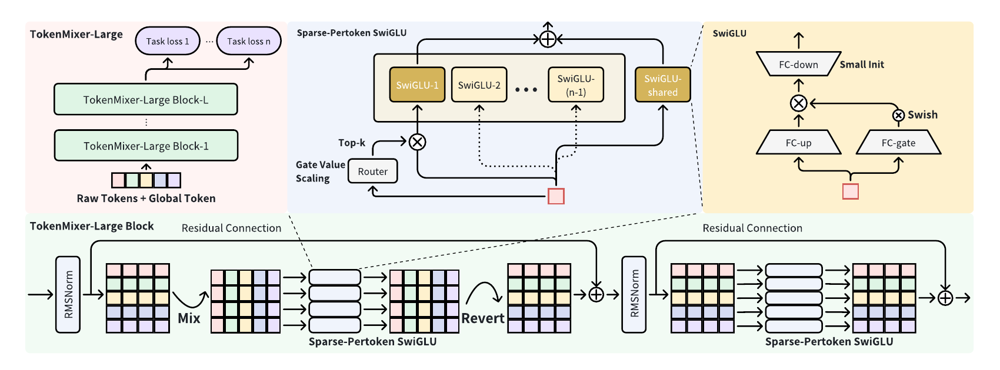
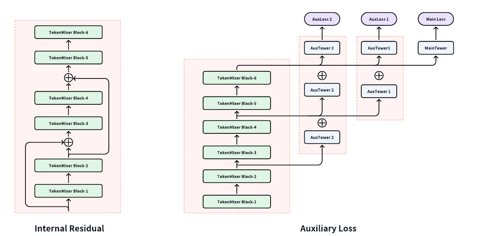
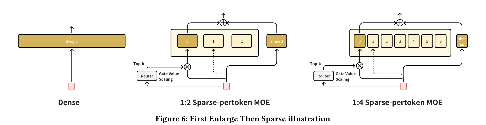
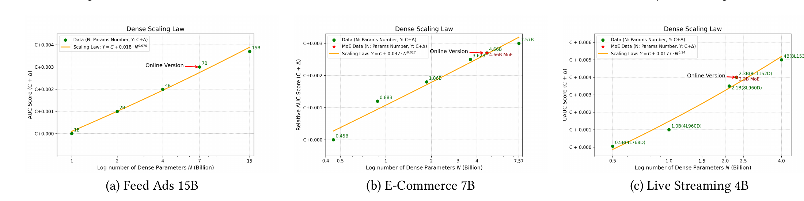

# TokenMixer-Large 论文详解

> 原文：[TokenMixer-Large: Scaling Up Large Ranking Models in Industrial Recommenders](./TokenMixer-Large.pdf)
> 说明：文中的“论文事实”只复述原 PDF；“公式推导”和“工程解读”是为了帮助理解而添加的分析，不应视为作者原话。本文未使用网络资料补全未披露信息。
> 系列综述：[RankMixer 及其演进方法详细调研](../rankmixer/RankMixer及其演进方法详细调研.md)

## 1. 一句话结论

TokenMixer-Large 的核心不是“把 RankMixer 盲目做大”，而是先修复 TokenMixer 在深层网络中的语义对齐和梯度通路，再用按 token 隔离的稀疏 MoE、FP8 和 Token Parallel 把容量扩展到工业级规模。论文在字节跳动私有数据上报告了最大 15B 的离线模型和 7B 的在线模型，以及广告、电商和直播三类业务的在线收益。

## 2. 论文身份与阅读边界

- 标题：*TokenMixer-Large: Scaling Up Large Ranking Models in Industrial Recommenders*
- 作者：Yuchen Jiang、Jie Zhu、Xintian Han 等 21 位作者，单位为 ByteDance AML 与 ByteDance。
- 版本：PDF 页脚标记为 arXiv:2602.06563v2，日期为 2026-02-10，全文 12 页。
- 领域：工业推荐系统的排序模型，关注 feature interaction、scaling law、稀疏 MoE 与训练/服务工程协同。
- 发表状态边界：当前 PDF 内仍有 `Conference'17`、占位 ACM ISBN 和占位 DOI。因此，仅依这份文件可确定其为 arXiv 预印本，不应据此宣称已被某个会议正式录用。

## 3. 论文要解决什么

工业排序模型先将用户、物品、上下文、交叉特征和行为序列等高维稀疏输入嵌入为低维向量，再由特征交互网络建模用户-物品关系。论文的出发点是：“更多参数/更多 FLOPs 是否能稳定换来更好排序效果？”不只取决于规模，还取决于结构是否可深化、算子是否适配 GPU、以及稀疏计算是否在训练和推理两端都成立。

作者将上一代 RankMixer 中的 TokenMixer 问题归纳为五类：

1. **残差设计不完整**：原始 `T` 个 token 被混合成 `H` 个新 token 后，只有 `T = H` 才容易跨层传递原输入；而且混合前后位置的语义可能不同，直接相加造成残差语义错位。
2. **架构不够“纯”**：历史模型中保留了 DCNv2、LHUC 等零散、低计算强度、高内存/通信成本的算子，拉低 MFU。
3. **深层模型梯度更新不足**：RankMixer 工业配置常只有 2 层，直接加深会出现收敛和效果问题。
4. **MoE 稀疏化不彻底**：RankMixer 使用“稠密训练、稀疏推理”；ReLU-MoE 激活专家数还会随样本动态变化，推理需要截断或 fallback。
5. **扩展上限低**：受训练框架和效率限制，RankMixer 只扩到约 1B 参数。

## 4. 整体架构与数据流



*图 1（裁自原论文 Figure 1）：上半部分是完整网络与 Sparse-Pertoken SwiGLU，下半部分是一个 TokenMixer-Large Block 的 Mixing - MoE - Reverting - MoE 流程。*

整体流程可压缩为：

```text
稀疏原始特征
  -> Embedding
  -> 按语义分组、压缩和维度对齐
  -> T-1 个语义 token + 1 个 global token
  -> 堆叠 L 个 TokenMixer-Large Block
       [RMSNorm -> Mix -> Sparse-Pertoken MoE -> Revert -> 残差]
       [RMSNorm -> Sparse-Pertoken MoE -> 残差]
  -> 所有输出 token 做 mean pooling
  -> 多个业务任务头
```

### 4.1 Semantic Group-wise Tokenizer

对稀疏特征 `F_i` 做 embedding：

$$
e_i = \operatorname{Embedding}(F_i, d_i) \in \mathbb{R}^{d_i}.
$$

不同特征的 embedding 维度可不同。作者先按语义将它们分为 $G_1,\ldots,G_{T-1}$，组内拼接，再用每组独立的 MLP 压缩为统一维度 $D$：

$$
X_i = \operatorname{MLP}_i\!\left(\operatorname{concat}[e_l,\ldots,e_m]\right),
\quad e_l,\ldots,e_m \in G_i.
$$

独立 MLP 的目的是保留用户、物品、交叉、短/长/超长序列等语义组之间的异质性，而不是强迫它们共享同一个投影。

### 4.2 Global Token

模型额外用一个 MLP 压缩所有语义组，得到类似 BERT `[CLS]` 的全局 token：

$$
X_G = \operatorname{MLP}_g\!\left(\operatorname{concat}[G_1,\ldots,G_{T-1}]\right).
$$

最终输入为：

$$
X = \operatorname{concat}[X_G,X_0,\ldots,X_{T-1}] \in \mathbb{R}^{T\times D}.
$$

这个 global token 不是最后才做的 pooling；它从网络输入就参与 mixing，用于把全局信息传播给其他 token。表 5 中移除 global token 会使 AUC 下降 0.02%。

## 5. 核心结构：Mixing & Reverting

设输入 $X\in\mathbb{R}^{T\times D}$，`T` 是 token 数，`D` 是每个 token 的通道维，`H` 是混合后 token 数，并假设 `D` 能被 `H` 整除。

### 5.1 Mix：让每个新 token 看到所有原 token

1. 将每个 $D$ 维 token 切成 $H$ 份，每份维度为 $D/H$：

   $$
   X \longrightarrow \mathbb{R}^{T\times H\times(D/H)}.
   $$

2. 对同一个 chunk 索引 $h$ 汇集全部 `T` 个 token：

   $$
   H_h = \operatorname{concat}[x_1^{(h)},\ldots,x_T^{(h)}]
   \in \mathbb{R}^{TD/H}.
   $$

3. 共得到 `H` 个混合 token：

   $$
   H = \operatorname{concat}[H_1,\ldots,H_H]
   \in \mathbb{R}^{H\times(TD/H)}.
   $$

因为每个 $H_h$ 都含有原始 `T` 个 token 的一部分通道，所以一次无参数的 `split + concat` 就建立了跨 token 的信息通路。附录表 11 进一步表明，竖向、对角线和随机切分的效果都一样；关键条件是“每个新的混合 token 都覆盖所有原 token 的信息”。只混合一半原 token 时，AUC 下降 0.08%。

### 5.2 Revert：恢复原 token 语义与形状

混合 token 经过一次 per-token SwiGLU 或 Sparse-Pertoken MoE 后，将每个 $H_h$ 再切为 `T` 份，按原 token 索引 $t$ 重组：

$$
X_t^{\text{revert}}
= \operatorname{concat}[x_t'^{(1)},x_t'^{(2)},\ldots,x_t'^{(H)}]
\in \mathbb{R}^{D},
$$

$$
X^{\text{revert}}
= \operatorname{concat}[X_1^{\text{revert}},\ldots,X_T^{\text{revert}}]
\in \mathbb{R}^{T\times D}.
$$

此时才将变换结果与 block 的原输入 $X$ 做标准残差，然后再进行一次 token 语义不变的 per-token 变换和残差。

### 5.3 它为什么比 RankMixer 的直接残差更合理

RankMixer 的问题可用三个检查项来看：

- **SR (Standard Residual)**：block 之间是否有普通残差。
- **OTR (Original Token Residual)**：原始 token 语义能否一直传到高层。
- **TSA (Token Semantic Alignment)**：$F(x')+x$ 相加时，$x'$ 和 $x$ 的同一位置是否表示同一类 token。

Mixing & Reverting 使 block 输入和输出都是 $T\times D$，而且相加前恢复了 token 位置的原语义，因此同时满足 SR、OTR 和 TSA。表 3 的 500M 级别对比如下：

| 模型 | SR | OTR | TSA | $Δ$AUC | 参数 | FLOPs/Batch |
|---|:---:|:---:|:---:|---:|---:|---:|
| Group Transformer | ✓ | ✓ | ✓ | - | 500M | 4.5T |
| RankMixer w/o SR & OTR | ✗ | ✗ | ✗ | -0.20% | 510M | 4.2T |
| RankMixer w/o OTR | ✓ | ✗ | ✗ | -0.13% | 510M | 4.2T |
| RankMixer | ✓ | ✓ | ✗ | +0.03% | 567M | 4.6T |
| TokenMixer-Large | ✓ | ✓ | ✓ | **+0.13%** | 500M | 4.2T |

> **工程解读：**残差连接不只要张量 shape 相同，还要求同一个索引位置的语义相同。这是本文最值得迁移到其他网络的设计原则。

## 6. Pertoken SwiGLU：用参数隔离保留特征异质性

RankMixer 使用 Pertoken FFN，TokenMixer-Large 将其升级为 Pertoken SwiGLU。对第 $t$ 个 token：

$$
\operatorname{pSwiGLU}(x_t)
= W_{\text{down}}^t
\left(
\operatorname{Swish}(W_{\text{gate}}^t x_t+b_{\text{gate}}^t)
\odot (W_{\text{up}}^t x_t+b_{\text{up}}^t)
\right)+b_{\text{down}}^t.
$$

对于 $x_t\in\mathbb{R}^{D}$，论文给出：

$$
W_{\text{up}}^t,W_{\text{gate}}^t\in\mathbb{R}^{D\times nD},
\qquad W_{\text{down}}^t\in\mathbb{R}^{nD\times D}.
$$

`n` 是中间维扩展倍数。上标 $t$ 意味着不同 token 位置拥有不同的 FC 参数；用户 token 与物品 token 不会被迫用同一套变换。表 5 中，将 Pertoken SwiGLU 换成共享 SwiGLU 使 AUC 降低 0.21%，换回 Pertoken FFN 也降低 0.10%。

## 7. 让深层模型真正能训起来

### 7.1 RMSNorm + Pre-Norm

论文用 RMSNorm 替代 LayerNorm，并移除线性层 bias。RMSNorm 为：

$$
\operatorname{RMS}(x)=\sqrt{\frac{1}{d}\sum_{i=1}^{d}x_i^2+\epsilon},
\qquad
\operatorname{RMSNorm}(x_i)=\frac{x_i}{\operatorname{RMS}(x)}\gamma_i.
$$

作者报告，这一替换在效果持平时使端到端吞吐提高 8.4%。归一化位置消融显示：Post-Norm 短期 AUC 高 0.01%，但后续出现 NaN；Sandwich-Norm 下降 0.03%；因此选择稳定的 Pre-Norm。

### 7.2 Inter-Residual 和 Auxiliary Loss



*图 2（裁自原论文 Figure 2）：左侧每隔若干 block 引入跨层残差；右侧让不同深度的表示参与辅助任务塔和联合损失。*

- **Inter-Residual**：通常每隔 2 或 3 层，将较低层表示直接送到高层，缩短梯度路径。论文特别建议不在最后一层加，以免过多低层信息干扰最后的高层抽象。
- **Auxiliary Loss / Residual Loss**：让较低层输出经辅助 tower 得到 logits，再与高层 logits 联合计算损失，直接监督低层参数。

移除 Inter-Residual 与 AuxLoss 的组合使 4B 模型 AUC 下降 0.04%。它的绝对数字小于 Mixing & Reverting，但解决的是随深度增长而放大的训练稳定性问题。

### 7.3 Down-Matrix Small Initialization

对 SwiGLU 的三组矩阵 `[FC_up, FC_gate, FC_down]`，最佳配置是初始化尺度 `[1, 1, 0.01]`。这让 block 初期的 $F(x)$ 接近 0，$F(x)+x$ 接近恒等映射，同时抑制 up/gate 乘性交互产生的激活和梯度放大。

| 初始化尺度 `[up, gate, down]` | $Δ$AUC |
|---|---:|
| `[1, 1, 1]` | - |
| `[1, 1, 0.01]` | **+0.03%** |
| `[1, 1, 0.1]` | +0.02% |
| `[0.01, 0.01, 0.01]` | -0.10% |
| `[0.01, 0.01, 1]` | -0.01% |

> **复现注意：**正文 3.4.4 称使用 `xavier_uniform`，附录 A.7 又用 Xavier normal 公式描述，两处术语不一致。能明确复现的结论是 down 矩阵尺度设为 0.01，但具体分布仍需作者代码或额外说明。

## 8. Sparse-Pertoken MoE



*图 3（裁自原论文 Figure 6）：先得到效果最好的 dense SwiGLU，再细分为专家并采用 1:2 或 1:4 稀疏激活；shared expert 始终激活。*

### 8.1 不是全局 MoE，而是“每个 token 各自一组专家”

普通 MoE 常让所有 token 共享一个专家池。Sparse-Pertoken MoE 则把每个 token 原本独立的 SwiGLU 再切成 `E` 个细粒度子专家；第 $t$ 个 token 只在自己的专家集合中路由。每个子专家的中间维从 $nD$ 变为 $nD/E$。

加入一个每 token 独立的 shared expert 后，数据流可写为：

$$
y_t = \alpha
\sum_{i\in\operatorname{Top-(k-1)}(g_t(x_t))}
g_{t,i}(x_t)\,E_{t,i}(x_t)
+ E^{\text{shared}}_t(x_t).
$$

- 路由专家的权重经 softmax 归一化，被选中者的权重和为 1。
- shared expert 总是激活，同时仍然是 per-token，不是所有 token 共享一套参数。
- Top-k 使训练和推理的激活规模可预测，从而实现“Sparse Train, Sparse Infer”。

### 8.2 First Enlarge, Then Sparse

作者不是一开始就用 MoE 堆更多总参数，而是：

1. 先设计并训出效果良好的大型 dense Pertoken SwiGLU。
2. 将其大 FC 沿中间维细分成多个子专家。
3. 只激活其中一部分，尽量保留 dense 效果、同时节省计算。

论文称 1:2 稀疏度可在线与离线近乎无损，1:4 有轻微下降，因此在线部署选择 ROI 最高的 1:2。在 1:8 稀疏度下负载均衡已变差，是作者留待研究的问题。

### 8.3 Gate Value Scaling

由于 softmax 把路由权重压到和为 1，将大 dense 矩阵切得越细，每个子专家被选中并更新的频率就越低。常数 $\alpha$ 用于放大被选中专家的输出和梯度。表 12 报告：

- 1:2 稀疏时，$\alpha=2$ 最好，相对 4B dense 为 -0.00%；
- 1:4 稀疏时，$\alpha=4$ 最好，为 -0.03%；
- 最佳 $\alpha$ 约等于稀疏比例的倒数。

作者还用“直接增大专家权重初始方差”模拟输出放大，结果反而下降 0.07%，说明 Gate Value Scaling 不可简单等同于更大初始值。

### 8.4 为什么比标准 Sparse MoE 更好

在总参数和激活参数都对齐时，把 Sparse-Pertoken MoE 换成标准 Sparse MoE 使 AUC 下降 0.10%。作者的解释是：per-token 专家池相当于给路由器一个强先验 - 用户 token 只与用户 token 的专家竞争，避免了训练初期全局路由难学的问题。

> **工程解读：**这一优势同时是一种归纳偏置。它适合 token 位置具有稳定业务语义的排序系统；如果 token 语义高度可交换，这种硬分池是否仍最优，论文没有证明。

## 9. 参数量、计算量与真实瓶颈

### 9.1 由公式直接推导的理论量级

> 本小节是公式推导，论文本身没有给出这些渐进式。忽略 bias、路由、残差和归一化的小常数开销。

对 `T` 个 `D` 维 token 的普通 Pertoken SwiGLU，up、gate、down 三个矩阵合计约为：

$$
P_{\text{pSwiGLU}} \approx 3TnD^2,
\qquad
C_{\text{pSwiGLU}} = O(3TnD^2).
$$

Mix 后是 `H` 个 $TD/H$ 维 token，因此第一个 Pertoken SwiGLU 约为：

$$
P_{\text{mix-stage}}
\approx 3Hn\left(\frac{TD}{H}\right)^2
= \frac{3nT^2D^2}{H}.
$$

Revert 后的第二个 Pertoken SwiGLU 约为 $3TnD^2$。Mix/Revert 本身是无参数的数据重排，算术量约 $O(TD)$，但可能受到内存搬运和通信的限制。

对稀疏率 $\rho=$ 激活参数/总参数的 MoE，大矩阵的激活计算在理想情况下约按 $\rho$ 缩放，但 shared expert、router、permute/unpermute 和小 batch 时的内存带宽开销不会同比例消失。

### 9.2 论文的实测数字

表 1 的单 block 算子耗时：

| 算子 | 训练耗时 | 训练占比/瓶颈 | 服务耗时 | 服务占比/瓶颈 |
|---|---:|---|---:|---|
| MoEGroupedFFN | 136.77 ms | 89.18% / compute-bound | 7.43 ms | 98.35% / memory-bound |
| MoEPermute | 6.32 ms | 4.12% / memory-bound | 0.06 ms | 0.75% / memory-bound |
| MoEUnpermute | 10.27 ms | 6.69% / memory-bound | 0.07 ms | 0.90% / memory-bound |

这揭示了一个容易被 FLOPs 掩盖的事实：同一个 GroupedFFN 在大 batch 训练时是 compute-bound，在小 batch 服务时却是 memory-bound。因此“只减 FLOPs”不一定等于“端到端更快”。

4B dense 与 1:2 Sparse-Pertoken MoE 的直接对比也支持上面的计算推导：

| 版本 | 激活/总参数 | FLOPs/Batch | $Δ$AUC |
|---|---:|---:|---:|
| TokenMixer-Large 4B dense | 4.6B / 4.6B | 29.8T | +1.14% |
| TokenMixer-Large 4B SP-MoE | 2.3B / 4.6B | 15.1T | +1.14% |

这里的“4B”是模型版本名，表 2 的实际 dense 参数记为 4.6B。FLOPs 也几乎减半，但不应从这一行离线数字推导出“线上延迟必然减半”。

## 10. 训练与服务优化

### 10.1 Grouped MoE 算子

1. `MoEPermute`：把 batch-first 输入重排为 expert-first，使每个专家的输入在内存中连续。
2. `MoEGroupedSwiGLU` 和 `MoEGroupedGemm`：用单个 kernel 计算多个专家 FFN，降低 kernel launch 开销并提高设备利用率。
3. `MoEUnpermute`：根据路由权重对已激活专家输出加权求和，恢复数据排列。

### 10.2 FP8 推理

- 训练全程用 bfloat16；服务使用 FP8 E4M3 训练后量化。
- 专家权重预先量化，输入在 MoEPermute 里量化，GroupedSwiGLU 融合输出量化，GroupedGemm 用 FP8 计算并输出 bfloat16。
- 作者报告在线推理加速 1.7 倍，未观察到模型准确率损失。论文未给出该结论的硬件型号、置信区间和逐任务数字。

### 10.3 Token Parallel

朴素模型并行需在每个 block 前后切换权重/数据分片布局，`L` 层需约 `4L` 次通信。Token Parallel 将分片布局与 Mixing - Reverting 的数据流对齐：层间直接保留 `Shard(token)` 布局，只在最后恢复 batch 分片，把通信次数降为 `2L + 1`。

论文报告，4-way Token Parallel、全局 batch size 320 的生产服务中，吞吐比无并行基线提高 29.2%；用细粒度 micro-batch 调度或 kernel 内计算-通信重叠后，提升达 96.6%。

> **工程解读：**Token Parallel 的价值不只是“多卡分参数”，而是让通信后的数据布局正好成为下一个算子所需布局，避免来回还原。

## 11. 实验设置

### 11.1 私有数据

| 场景 | 数据规模 | 补充说明 |
|---|---:|---|
| 抖音主端 Feed 电商 | 采样后约 4 亿条/日，覆盖 2 年 | 500+ 数值、ID、交叉和序列特征；数亿用户级覆盖；标签含商品点击、转化和 GMV |
| 抖音广告 | 采样后约 3 亿条/日 | 真实工业训练日志 |
| 抖音直播 | 采样后约 170 亿条/日 | 真实工业训练日志 |

评估指标包括 CTR/CVR 任务的 AUC 和 UAUC，以及 dense 参数量（不含稀疏 embedding）、单 batch 2048 样本的训练 FLOPs 和 MFU。

### 11.2 训练环境与优化器

- 电商实验用 64 张 GPU，Feed Ads 和 Live Streaming 各用 256 张 GPU。
- 稀疏参数异步更新，dense 参数同步更新。
- 两部分都用 Adagrad；dense 学习率 0.01，sparse 学习率 0.05。
- 论文未披露 GPU 型号、主要模型的完整 `T/D/H/L/n/E/k`、batch 组成、训练时长或早停准则。

### 11.3 对比方法

基线包含 DLRM-MLP、DCNv2、AutoInt、HiFormer、DHEN、Wukong、内部 Group Transformer、FAT 和 RankMixer。前三者代表 MLP/显式特征交互/自注意力路线；DHEN 和 Wukong 代表统一 block 堆叠式 scaling；Group Transformer/FAT 和 RankMixer 是更直接的 GPU 时代工业排序对手。

## 12. 主要离线结果

### 12.1 约 500M 参数及扩展模型

下表数字来自论文表 2，$Δ$AUC 是电商 CTCVR 相对 DLRM-MLP-500M 的提升：

| 模型 | $Δ$AUC | dense/激活参数 | FLOPs/Batch |
|---|---:|---:|---:|
| DLRM-MLP-500M | - | 499M | 125.1T |
| HiFormer | +0.44% | 570M | 28.8T |
| DCNv2 | +0.49% | 502M | 125.8T |
| DHEN | +0.63% | 415M | 103.4T |
| AutoInt | +0.75% | 549M | 138.6T |
| Wukong | +0.76% | 513M | 4.6T |
| Group Transformer | +0.81% | 550M | 4.5T |
| FAT | +0.82% | 551M | 4.59T |
| RankMixer | +0.84% | 567M | 4.6T |
| **TokenMixer-Large 500M** | **+0.94%** | 501M | **4.2T** |
| TokenMixer-Large 4B | +1.14% | 4.6B | 29.8T |
| TokenMixer-Large 7B | **+1.20%** | 7.6B | 49.0T |
| TokenMixer-Large 4B SP-MoE | +1.14% | 2.3B activated in 4.6B | 15.1T |

同一约 500M 级别下，TokenMixer-Large 的 AUC 最高且 FLOPs 最低。但这些都是同一组织的私有数据和训练框架上的结果，不能直接当作跨公开数据集的普适排名。

### 12.2 Scaling law



*图 4（裁自原论文 Figure 4）：三类业务中，随着 dense 参数规模增大，AUC/UAUC 均继续上升；红色星标为在线版本或 MoE 版本。三图纵轴基准常数和任务不同，不应横向比较绝对高度。*

作者通过同时增加通道维 $D$、深度 $L$ 和 SwiGLU 扩展倍数 $n$ 做 scaling，得到两个重要结论：

1. 1B 以上只增大宽度、深度或中间扩展的任意一个维度都会逐渐遇到瓶颈，需要均衡扩展。
2. 模型越大，收敛需要的数据时间窗口越长。

论文的场景规模汇总：

| 场景 | 离线最大规模 | 在线流量最大规模 |
|---|---:|---:|
| Feed Ads | 15B | 7B |
| E-Commerce | 7B | 4B |
| Live Streaming | 4B | 2B |

直播场景的数据量-收敛关系（每行以前一行为基线）：

| 参数变化 | 收敛所需样本日数 | $Δ$UAUC |
|---|---:|---:|
| 30M -> 90M | 14 天 | +0.94% |
| 90M -> 500M | 30 天 | +0.62% |
| 500M -> 2.3B（只训 30 天） | 30 天 | +0.41% |
| 500M -> 2.3B（训满 60 天） | 60 天 | +0.70% |

> **工程解读：**如果用同一个短训练窗口比较大小模型，可能会系统性低估大模型；scaling 实验需要同时扩充训练数据或训练时长。

## 13. 消融实验

### 13.1 TokenMixer-Large Block（4B）

| 变体 | $Δ$AUC |
|---|---:|
| 移除 Global Token | -0.02% |
| 移除 Mixing & Reverting | **-0.27%** |
| 移除标准 Residual | -0.15% |
| 移除 Inter-Residual & AuxLoss | -0.04% |
| Pertoken SwiGLU -> 共享 SwiGLU | **-0.21%** |
| Pertoken SwiGLU -> Pertoken FFN | -0.10% |

最大的两个下降来自 Mixing & Reverting 和 per-token 参数隔离，说明本文的收益不只来自“更大”或“更稀疏”。

### 13.2 Sparse-Pertoken MoE

| 变体 | $Δ$AUC | 额外参数/FLOPs |
|---|---:|---:|
| 移除 Shared Expert | -0.02% | 0 / 0 |
| 移除 Gate Value Scaling | -0.03% | 0 / 0 |
| 移除 Down-Matrix Small Init | -0.03% | 0 / 0 |
| Sparse-Pertoken MoE -> 标准 Sparse MoE | **-0.10%** | 0 / 0 |

论文称前三项是“零额外参数和 FLOPs”的改动。严格说，shared expert 的总容量并非凭空为零；此处表达指的是在该表的对齐配置中，不改变总参数和激活计算预算。

### 13.3 Pure Model 设计

随 TokenMixer-Large 扩大，前置 DCN 的边际收益从 150M 模型的 +0.09%，降为 500M 的 +0.04%，到 700M 时为 +0.00%。作者也试验了 DHEN 和 LHUC 的串/并联组合，得出类似结论，因此删去碎片化 I/O-bound 算子，使 TokenMixer-Large Block 的 MFU 最高达 60%。

> **事实与推论的边界：**“在 700M 时 DCN 消融无损”是表 9 的事实；“所有任务中参数足够大就都可以删 DCN”不是论文已证明的普遍结论。

## 14. 在线结果

三个场景使用不同在线基线：Feed Ads 为 RankMixer-1B，电商为 RankMixer-150M，直播为 RankMixer-500M；对应的 TokenMixer-Large 版本为 7B、4B 和 2B。

| 场景 | 离线指标改善 | 业务指标改善 |
|---|---:|---:|
| Feed Ads | AUC +0.35% | ADSS +2.0% |
| E-Commerce | AUC +0.51% | 订单数 +1.66%，人均预览支付 GMV +2.98% |
| Live Streaming | UAUC +0.7% | 支付/收入 +1.4% |

这些是论文报告的相对提升，不是绝对 AUC 值。原文还提到部署覆盖数亿用户。

## 15. 与 RankMixer 和相关路线的区别

| 方法/路线 | 特征交互主体 | 语义/残差 | 稀疏化 | 论文中的定位 |
|---|---|---|---|---|
| AutoInt / HiFormer | 自注意力或其异质/低秩变体 | token 数通常不因 attention 改变 | 未作为本文主线 | 效果强，但标准 attention 代价高 |
| DHEN / Wukong | 将多种特征交互子模块 bagging 成 block 再堆叠 | 依具体子模块 | 非本文的 per-token MoE | 证明推荐模型也有 scaling，但碎片算子/硬件利用是隐患 |
| Group Transformer / FAT | 分组 token 上的 attention，并用 per-token Q/K/V/O | token 数与位置语义保持，SR/OTR/TSA 都满足 | 未作为本文主线 | 效果强的内部基线，但仍有 attention |
| RankMixer / TokenMixer | 用轻量 token mixing 替换 attention，配 Pertoken FFN | 混合前后直接残差可语义错位；难以保持原 token 通路 | ReLU-MoE，dense train / sparse infer，激活数动态 | 高 MFU 的前代，但工业规模约 1B、常用 2 层 |
| **TokenMixer-Large** | 无参数 Mixing & Reverting + 两段 Pertoken SwiGLU/SP-MoE | 恢复 $T\times D$ 和原语义后再做残差；加 Inter-Residual/AuxLoss | 固定 top-k，sparse train / sparse infer；每 token 专家池 | 针对深层、大参数和生产部署的系统重构 |

需要强调：论文说 TokenMixer 比自注意力更轻，并通过表 2 的实测 FLOPs 支持这一点；但它没有给出在统一 `T/D/H/n` 假设下与 attention 的完整闭式复杂度对比。因此，最稳妥的结论是“该工业配置的实测 FLOPs/MFU 更好”，而不是无条件地宣称任意尺寸下都有更优的渐近复杂度。

## 16. 局限与尚未回答的问题

1. **可复现性有限**：数据集、代码、特征方案和业务标签都未公开；GPU 型号与完整超参数也未披露。
2. **比较局限于内部环境**：所有主要对比基于私有数据和内部分布式训练框架，缺少公开 benchmark 上的第三方验证。
3. **Scaling law 证据主要是经验曲线**：图 4/5 展示了少量规模点的拟合，没有给出参数估计置信区间、重复实验方差或拟合稳健性。
4. **在线实验统计信息不完整**：论文没有披露 A/B 时长、流量比例、方差/显著性、多次实验一致性或成本增量。
5. **在线收益混合了结构与规模收益**：三个场景都将 TokenMixer-Large 2B-7B 与更小的 RankMixer 150M-1B 比较，不能仅用这组在线数字分离“新结构”和“更多参数/计算”的贡献。
6. **高稀疏比尚未解决**：1:2 是当前稳定部署点；1:4 有轻微效果下降，1:8 负载均衡变差，超过 1:8 且无损仍是未来工作。
7. **文本有若干复现级不一致**：除 Xavier uniform/normal 描述不一致外，正文对 ReZero 的引用编号与附录/参考文献列表也不完全对齐；这不改变实验数字，但实现时需核对。

## 17. 可直接带走的工程启示

1. **先检查残差语义，再检查 shape**：变换前后张量维度相同不代表可以安全相加，同一索引必须对应同一语义单元。
2. **深层化需要“短通路 + 直接监督 + 近恒等初始”**：Inter-Residual、AuxLoss 和 small-init 解决的是同一类问题的不同环节。
3. **让一个统一大 block 吸收碎片特征交互**：模型变大后，要重新测量 DCN/LHUC 等历史模块的边际收益，避免为极小 AUC 收益长期支付低 MFU 和调度开销。
4. **稀疏化要从训练到推理闭环**：固定 top-k 不只节约训练 FLOPs，也让推理容量规划可预测。
5. **专家路由可用业务语义作先验**：当 token 位置有稳定含义时，每 token 独立专家池可减少路由竞争，但要通过消融确认这个归纳偏置确实适用。
6. **并行方案要沿数据流设计**：不要在每层都恢复“标准布局”；如果下一层能直接消费当前分片，就应让分片穿过层边界。
7. **大模型与更多数据必须成对规划**：2.3B 模型仅看 30 天数据时的收益显著低于训满 60 天，容量计划需同时包含数据时间窗口。

## 18. 快速复习

- **架构关键词**：Semantic Group-wise Tokenizer、Global Token、Mixing & Reverting、Pertoken SwiGLU、RMSNorm/Pre-Norm、Inter-Residual、AuxLoss。
- **MoE 关键词**：First Enlarge Then Sparse、per-token expert pool、shared expert、fixed Top-k、Gate Value Scaling、Down-Matrix Small Init。
- **工程关键词**：GroupedFFN、FP8 E4M3、Token Parallel、`4L -> 2L+1` 通信、Pure Model、60% MFU。
- **最强消融信号**：去掉 Mixing & Reverting 为 -0.27% AUC；Pertoken SwiGLU 改为共享 SwiGLU 为 -0.21%。
- **最直观的稀疏化结果**：4.6B dense 与 2.3B activated in 4.6B SP-MoE 都为 +1.14% AUC，FLOPs 从 29.8T 降到 15.1T。
- **在线业务结果**：电商订单 +1.66% / GMV +2.98%，广告 ADSS +2.0%，直播支付/收入 +1.4%。
